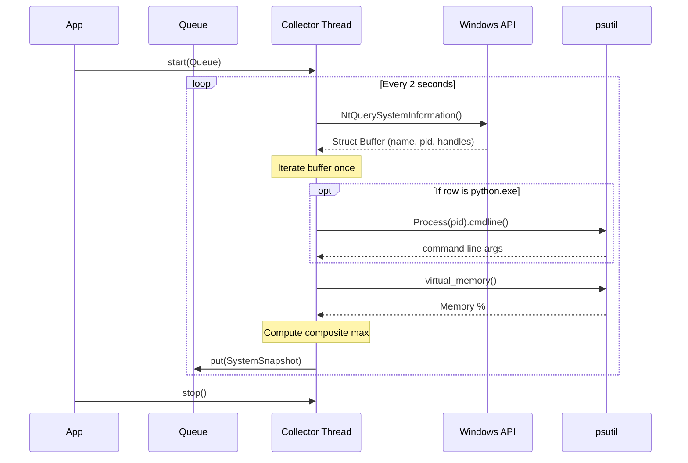

# Issue #4: Windows data collector — ConPTY, processes, memory, handles (#4)

## 1. Context & Goal
* **Issue:** #4
* **Objective:** Build the Windows-specific data collector that polls system metrics (ConPTY, processes, memory, handles) via a single `NtQuerySystemInformation` sweep and calculates a normalized composite metric.
* **Status:** Approved (claude-opus-4-6, 2026-09-02)
* **Related Issues:** #3, #224, #233, #234, #239, #405, #427

### Open Questions
None.

## 2. Proposed Changes

### 2.1 Files Changed

| File | Change Type | Description |
|------|-------------|-------------|
| `src/boostgauge/collector.py` | Add | Abstract base `DataCollector` class and `SystemSnapshot` dataclass |
| `src/boostgauge/collectors/windows.py` | Add | `WindowsCollector` implementation using `NtQuerySystemInformation` |
| `tests/unit/test_collector.py` | Add | Tests for base collector and composite math |
| `tests/unit/test_windows_collector.py` | Add | Mocked single-sweep tests for Windows collector |
| `tests/integration/test_windows_collector_live.py` | Add | Live cross-check against psutil |
| `tests/benchmark/test_windows_collector_perf.py` | Add | Benchmark for CPU overhead (< 20 ms requirement) |

### 2.1.1 Path Validation (Mechanical - Auto-Checked)

All "Modify" files must exist in repository.
All "Add" files must have existing parent directories.

### 2.2 Dependencies

```toml

# No new dependencies added (psutil is already in pyproject.toml, ctypes is standard library).
```

### 2.3 Data Structures

```python
from dataclasses import dataclass
from typing import TypedDict, Optional
import ctypes
from ctypes import wintypes

@dataclass
class SystemSnapshot:
    timestamp: float
    conpty_count: int
    process_count: int
    memory_percent: float
    handle_count: int
    unleashed_sessions: int
    driver: str
    composite_value: float

class SYSTEM_PROCESS_INFORMATION(ctypes.Structure):
    # Definition of the x64 struct layout matching the 104 bytes to SessionId
    # with correct offsets for NextEntryOffset, NumberOfThreads, ImageName,
    # BasePriority, UniqueProcessId, InheritedFromUniqueProcessId, HandleCount, SessionId.
    pass
```

### 2.4 Function Signatures

```python

# src/boostgauge/collector.py
import threading
from abc import ABC, abstractmethod

class DataCollector(ABC):
    def __init__(self, thresholds: dict, poll_interval: float = 2.0):
        """Initialize the collector with thresholds for composite math."""
        ...

    def start(self, result_queue) -> None:
        """Start the background polling thread pushing to result_queue."""
        ...

    def stop(self) -> None:
        """Signal the thread to stop and join it."""
        ...

    @abstractmethod
    def _take_snapshot(self) -> SystemSnapshot:
        """Platform-specific implementation of the collection tick."""
        ...

    def _compute_composite(self, conpty: int, memory: float, processes: int, handles: int) -> tuple[float, str]:
        """Returns the (normalized_max_value, driver_name) given the raw metrics."""
        ...

# src/boostgauge/collectors/windows.py
class WindowsCollector(DataCollector):
    def _take_snapshot(self) -> SystemSnapshot:
        """Collects metrics via one NtQuerySystemInformation sweep per tick."""
        ...
```

### 2.5 Logic Flow (Pseudocode)

```
1. Initialize WindowsCollector(thresholds)
2. start(queue):
   - Spawn background thread running loop:
     a. wait for poll_interval or stop event
     b. if stop event, exit
     c. snapshot = _take_snapshot()
     d. queue.put(snapshot)
3. _take_snapshot():
   - Allocate buffer and call NtQuerySystemInformation(SystemProcessInformation)
   - Initialize metrics: procs=0, conpty=0, handles=0, unleashed=0
   - Iterate linked list in buffer:
     a. procs += 1
     b. handles += row.HandleCount
     c. if row.ImageName in ["conhost.exe", "openconsole.exe"] (case-insensitive):
        conpty += 1
     d. if row.ImageName in ["python.exe", "pythonw.exe"] (case-insensitive):
        try:
           cmdline = psutil.Process(row.UniqueProcessId).cmdline()
           if matches "unleashed-c-*.py":
              unleashed += 1
        except (NoSuchProcess, AccessDenied):
           continue
   - mem_pct = psutil.virtual_memory().percent
   - comp_val, driver = _compute_composite(conpty, mem_pct, procs, handles)
   - Return SystemSnapshot(time.time(), conpty, procs, mem_pct, handles, unleashed, driver, comp_val)
```

### 2.6 Technical Approach

* **Module:** `src/boostgauge/collectors/windows.py`
* **Pattern:** Background Thread with Thread-Safe Queue + Template Method
* **Key Decisions:** Implement the strict ADR 0001 (as amended) mandate by using `ctypes` to invoke `NtQuerySystemInformation` directly. Avoid `psutil.process_iter`, `psutil.pids`, and PowerShell to keep overhead sub-1%. `psutil` is used strictly for non-enumerative calls: `virtual_memory()` and per-row `cmdline()` lookups on identified Python processes.

### 2.7 Architecture Decisions

| Decision | Options Considered | Choice | Rationale |
|----------|-------------------|--------|-----------|
| System API | `psutil`, WMI, `NtQuerySystemInformation` | `NtQuerySystemInformation` | ADR 0001 amendment; psutil handle count forces `OpenProcess` per row (422ms per tick). `NtQuery` is 2.2ms. |
| Threading | Asyncio, Thread, Main loop | Thread | Polling is blocking at the OS level (ctypes call), so a background thread ensures the GUI loop is never delayed. |
| Metric Cadence | Multi-rate (2s and 5s), Single-pass | Single-pass (2s) | Operator ruling #224. All metrics are sampled simultaneously on the same tick. |

**Architectural Constraints:**
- Must not use `psutil.process_iter`, `psutil.pids()`, or equivalent iteration logic anywhere in the system sweep.
- Must not use WMI or PowerShell.

## 3. Requirements

1. The collector MUST return an accurate ConPTY count — the sweep's console-host count equals psutil's `process_iter` console-host count on the running machine (±1 for processes that start/exit).
2. The collector MUST return an accurate memory %, process count, and handle count (process count equals psutil ±1; handle count within 1% of psutil's sum).
3. The collector MUST correctly identify unleashed sessions (row `name` is a Python interpreter AND `cmdline` read via psutil for that row matches the `unleashed-c-*.py` signature).
4. The collector MUST run polling in a non-blocking background thread, pushing snapshots to a thread-safe queue.
5. The collector MUST gracefully handle permission errors (e.g., `AccessDenied`, `NoSuchProcess`) without crashing the thread.
6. The collector MUST derive all process-derived metrics from exactly one sweep of the process table per tick. No second enumeration is permitted.
7. The collector MUST maintain < 1% CPU overhead at a 2s polling interval, proven by a benchmark test where the sweep's mean `process_time` over 8 ticks is < 20 ms.
8. The collector MUST calculate a normalized maximum composite value and report the driver (the metric responsible for the peak).

## 4. Alternatives Considered

| Option | Pros | Cons | Decision |
|--------|------|------|----------|
| `psutil.process_iter` for sweep | Very easy to implement, cross-platform | 21% CPU overhead due to opening every process to read `num_handles`. Violates acceptance criteria. | **Rejected** |
| WMI queries | Built-in Windows tool | Extremely slow, causes system hangs. | **Rejected** |
| `NtQuerySystemInformation` | Unmatched speed (2.2ms), single struct contains everything needed | Requires brittle struct parsing via ctypes. | **Selected** |

**Rationale:** `NtQuerySystemInformation` is the only mechanism fast enough to meet the < 1% CPU overhead requirement while gathering process names, PIDs, and handle counts in a single call.

## 5. Data & Fixtures

### 5.1 Data Sources

| Attribute | Value |
|-----------|-------|
| Source | Windows OS via `NtQuerySystemInformation` |
| Format | `SYSTEM_PROCESS_INFORMATION` C-struct buffer |
| Size | Varies by process count (typically ~100-500 KB) |
| Refresh | Real-time, 2-second interval |
| Copyright/License | N/A |

### 5.2 Data Pipeline

```
NtQuerySystemInformation ──ctypes_parse──► Metric Variables ──dataclass──► ThreadSafeQueue ──consume──► UI
```

### 5.3 Test Fixtures

| Fixture | Source | Notes |
|---------|--------|-------|
| `mock_system_buffer` | Hardcoded byte array | Simulates the return structure of `NtQuerySystemInformation` containing dummy processes (ConPTY, Python, System). |

### 5.4 Deployment Pipeline

No external data sources; runs directly on the local OS.

## 6. Diagram

### 6.1 Mermaid Quality Gate

**Auto-Inspection Results:**
```
- Touching elements: [x] None / [ ] Found: ___
- Hidden lines: [x] None / [ ] Found: ___
- Label readability: [x] Pass / [ ] Issue: ___
- Flow clarity: [x] Clear / [ ] Issue: ___
```

### 6.2 Diagram



## 7. Security & Safety Considerations

### 7.1 Security

| Concern | Mitigation | Status |
|---------|------------|--------|
| Privilege Escalation | Collector runs as the current user, handles `AccessDenied` when querying elevated processes. | Addressed |
| Buffer Overflows | Buffer for `NtQuerySystemInformation` dynamically resizes if `STATUS_INFO_LENGTH_MISMATCH` is returned. | Addressed |

### 7.2 Safety

| Concern | Mitigation | Status |
|---------|------------|--------|
| Runaway thread | Polling loop checks threading.Event to cleanly exit on application shutdown. | Addressed |
| Queue unbounded growth | Thread drops snapshots or queue is capped if the GUI stops reading, preventing OOM. | Addressed |

**Fail Mode:** Fail Closed - If the system query repeatedly fails, the background thread logs the error and pushes an empty/error snapshot, keeping the UI alive but reading zero.

**Recovery Strategy:** Thread continues attempting the call on the next interval.

## 8. Performance & Cost Considerations

### 8.1 Performance

| Metric | Budget | Approach |
|--------|--------|----------|
| Latency | < 20ms per tick | Use `NtQuerySystemInformation` for the primary sweep. |
| Memory | < 5MB for buffer | Buffer scales with process count, freeing immediately after parse. |
| API Calls | 1 OS sweep per tick | Strict enforcement of ADR 0001 amendment. |

**Bottlenecks:** Unusually high process counts could theoretically slow parsing, but ctypes iteration is fast enough in Python to handle thousands of processes well under 20ms.

### 8.2 Cost Analysis

| Resource | Unit Cost | Estimated Usage | Monthly Cost |
|----------|-----------|-----------------|--------------|
| Local Compute | $0 | Always on | $0 |

**Cost Controls:**
- [x] Run locally on user machine, no cloud API calls.

**Worst-Case Scenario:** A fork-bomb scenario creates 10,000 processes. The collector takes slightly longer to parse (e.g., 50ms) but remains in the background thread, not locking the GUI.

## 9. Legal & Compliance

| Concern | Applies? | Mitigation |
|---------|----------|------------|
| PII/Personal Data | No | Collector parses process names, never user data. |
| Third-Party Licenses | Yes | `psutil` is BSD-3-Clause, compatible with MIT. |
| Terms of Service | No | Local system API. |
| Data Retention | No | Snapshots are ephemeral and not persisted. |
| Export Controls | No | Standard system metrics only. |

**Data Classification:** Internal

**Compliance Checklist:**
- [x] No PII stored without consent
- [x] All third-party licenses compatible with project license
- [x] External API usage compliant with provider ToS
- [x] Data retention policy documented

## 10. Verification & Testing

*Ref: [0005-testing-strategy-and-protocols.md](0005-testing-strategy-and-protocols.md) and `docs/design/0001-test-strategy.md`*

**Testing Philosophy:** Strive for 100% automated test coverage. Tests adhere to `docs/design/0001-test-strategy.md` (though GUI rendering is not strictly part of this component, the principles of no auto-accept and strict value assertion apply).

### 10.0 Test Plan (TDD - Complete Before Implementation)

| Test ID | Test Description | Expected Behavior | Status |
|---------|------------------|-------------------|--------|
| T010 | Mock single sweep | NtQuerySystemInformation called exactly once | RED |
| T020 | Live cross-check counts | Sweep values closely match psutil counts | RED |
| T030 | Handle missing processes | Exception inside sweep (AccessDenied) is ignored | RED |
| T040 | Unleashed session math | Python processes with signature count as unleashed | RED |
| T050 | Composite value check | Highest normalized metric determines driver | RED |
| T060 | Benchmark performance | CPU process_time over 8 ticks averages < 20ms | RED |
| T070 | Thread stop behavior | stop() joins thread cleanly without hanging | RED |

**Coverage Target:** ≥95% for all new code

**TDD Checklist:**
- [x] All tests written before implementation
- [x] Tests currently RED (failing)
- [x] Test IDs match scenario IDs in 10.1
- [x] Test file created at: `tests/unit/test_windows_collector.py`

### 10.1 Test Scenarios

| ID | Scenario | Type | Input | Expected Output | Pass Criteria |
|----|----------|------|-------|-----------------|---------------|
| 010 | Mock single sweep ensures exactly one OS query per tick (REQ-6) | Auto | Mocked OS call | 1 call count | `mock_ntquery.call_count == 1`, no `psutil.process_iter` calls |
| 020 | Live cross-check process and handle counts against psutil (REQ-2) | Auto-Live | Live system | Snapshot | `abs(snap.process_count - len(list(psutil.process_iter()))) <= 1` and `abs(snap.handle_count - sum_handles) / sum_handles < 0.01` |
| 030 | Live cross-check ConPTY counts against psutil (REQ-1) | Auto-Live | Live system | Snapshot | `abs(snap.conpty_count - sum_conpty) <= 1` |
| 040 | Unleashed session counts Python + signature (REQ-3) | Auto | Mock process `python.exe` with `unleashed-c-123.py` | Count = 1 | `snap.unleashed_sessions == 1` |
| 050 | Thread polling is non-blocking (REQ-4) | Auto | Start thread, main thread asserts | Runs concurrently | Main thread executes without waiting for 2s tick |
| 060 | AccessDenied handled gracefully on cmdline read (REQ-5) | Auto | Mock `psutil.Process(pid).cmdline` raises `AccessDenied` | Doesn't crash | Metric parsed, thread continues, session skipped |
| 070 | Mean process_time over 8 ticks is < 20 ms (REQ-7) | Auto-Live | 8 sequential ticks on live machine | Time delta < 160ms | `(total_process_time / 8) < 0.020` |
| 080 | Composite value reports highest normalized metric (REQ-8) | Auto | ConPTY 50%, Memory 80%, Procs 30% | driver="memory", value=80 | `snap.driver == "memory"`, `snap.composite_value == 80.0` |

### 10.2 Test Commands

```bash

# Run all automated tests
poetry run pytest tests/unit/test_collector.py tests/unit/test_windows_collector.py -v

# Run live integration and benchmark tests
poetry run pytest tests/integration/test_windows_collector_live.py tests/benchmark/test_windows_collector_perf.py -v
```

### 10.3 Manual Tests (Only If Unavoidable)

N/A - All scenarios automated.

## 11. Risks & Mitigations

| Risk | Impact | Likelihood | Mitigation |
|------|--------|------------|------------|
| Struct layout change in future Windows versions | High | Low | Layout verified against `SYSTEM_PROCESS_INFORMATION`. Live test cross-checks counts with psutil to detect silent misparsing immediately. |
| `NtQuerySystemInformation` buffer resizing | Med | High | Loop with dynamically growing buffer sizes handles `STATUS_INFO_LENGTH_MISMATCH`. |
| Zombie processes causing `NoSuchProcess` during cmdline reads | Low | High | Try-except block explicitly swallows `NoSuchProcess` and `AccessDenied` during per-row attribute reads. |

## 12. Definition of Done

### Code
- [ ] Implementation complete and linted
- [ ] Code comments reference this LLD

### Tests
- [ ] All test scenarios pass
- [ ] Test coverage meets threshold

### Documentation
- [ ] LLD updated with any deviations
- [ ] Implementation Report (0103) completed
- [ ] Test Report (0113) completed if applicable

### Review
- [ ] Code review completed
- [ ] User approval before closing issue

### 12.1 Traceability (Mechanical - Auto-Checked)

Every file mentioned in this section appears in Section 2.1.
Every risk mitigation in Section 11 has a corresponding function/implementation in Section 2.4/2.5.

---

## Appendix: Review Log

### {Reviewer} Review #{N} ({VERDICT})

**Reviewer:** {Gemini / Orchestrator / Other}
**Verdict:** PENDING

#### Comments

| ID | Comment | Implemented? |
|----|---------|--------------|
| | | |

### Review Summary

| Review | Date | Verdict | Key Issue |
|--------|------|---------|-----------|
| 1 | 2026-09-02 | APPROVED | `claude-opus-4-6` |
| | | | |

**Final Status:** APPROVED