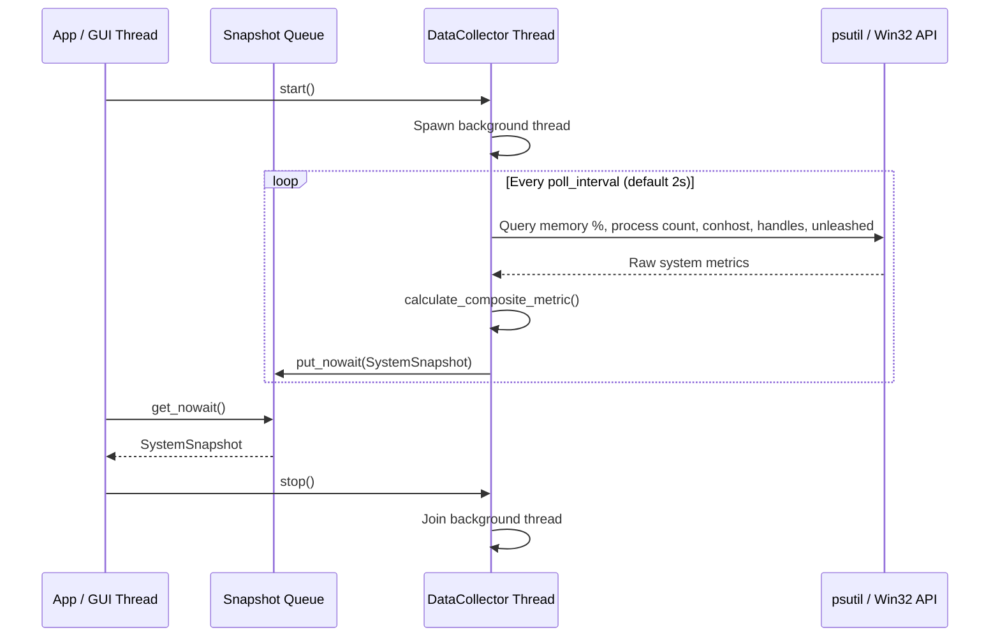

# #4 - Feature: Windows data collector — ConPTY, processes, memory, handles (#4)

## 1. Context & Goal
* **Issue:** #4
* **Objective:** Build the Windows-specific system metrics collector (`WindowsCollector`) extending abstract `DataCollector` to poll ConPTY allocations, process count, memory percentage, handle count, and Unleashed sessions, computing a normalized-max composite metric in a non-blocking background thread.
* **Status:** Approved (claude-opus-4-6, 2026-08-01) Progress
* **Related Issues:** #1, #7, #41

### Open Questions
*None — requirements, metrics, composite metric algorithm, and background threading architecture are fully specified.*

## 2. Proposed Changes

### 2.1 Files Changed

| File | Change Type | Description |
|------|-------------|-------------|
| `src/boostgauge/collectors/` | Add (Directory) | Directory for platform-specific collector implementations |
| `src/boostgauge/__init__.py` | Add | Root package exports (`DataCollector`, `SystemSnapshot`, `WindowsCollector`, `create_collector`) |
| `src/boostgauge/collector.py` | Add | Abstract base class `DataCollector`, `SystemSnapshot` dataclass, metric normalization, composite metric calculation, and thread lifecycle management |
| `src/boostgauge/collectors/__init__.py` | Add | Package exports for collectors module and `create_collector()` factory |
| `src/boostgauge/collectors/windows.py` | Add | `WindowsCollector` class polling Windows ConPTY, process, memory, handle, and Unleashed metrics via `psutil` and Win32 APIs |
| `tests/unit/test_collector.py` | Add | Unit tests for abstract `DataCollector`, normalization math, composite score calculation, driver selection, and queue management |
| `tests/unit/test_windows_collector.py` | Add | Unit tests for `WindowsCollector` process parsing, handle counting, Unleashed session detection, and permission error resilience |
| `tests/contract/test_collector_contract.py` | Add | Contract tests verifying `DataCollector` interface compliance across implementations |

### 2.1.1 Path Validation (Mechanical - Auto-Checked)

Mechanical validation automatically checks:
- All "Modify" files must exist in repository (N/A — all target files marked Add)
- All "Delete" files must exist in repository (N/A)
- All "Add" files must have existing parent directories (`src/boostgauge/`, `tests/unit/`, `tests/contract/` exist)
- No placeholder prefixes (`src/`, `lib/`, `app/`) unless directory exists (`src/` exists)

### 2.2 Dependencies

```toml

# pyproject.toml existing dependencies used (no new third-party packages required)

# psutil (>=7.2.2,<8.0.0) is already declared in pyproject.toml
```

### 2.3 Data Structures

```python
from dataclasses import dataclass
import queue
import threading
from typing import Any, Dict, Optional, Tuple, TypedDict

@dataclass
class SystemSnapshot:
    timestamp: float
    conpty_count: int
    process_count: int
    memory_percent: float
    handle_count: int
    unleashed_sessions: int
    driver: str  # Metric driving composite value: "conpty", "memory", "process", "handles"
    composite_value: float  # 0.0 - 100.0 normalized score

class MetricThresholds(TypedDict):
    conpty: float
    memory: float
    process: float
    handles: float

class CollectorConfig(TypedDict, total=False):
    poll_interval: float
    thresholds: MetricThresholds
```

### 2.4 Function Signatures

```python

# Signatures in src/boostgauge/collector.py

def normalize_metric(value: float, threshold: float) -> float:
    """Map a raw metric value to a 0-100 scale using a 4-point piecewise linear curve (0->0, 0.6t->60, 0.8t->80, t->100)."""
    ...

def calculate_composite_metric(
    conpty: int,
    memory_pct: float,
    process_cnt: int,
    handle_cnt: int,
    thresholds: Dict[str, float],
) -> Tuple[float, str]:
    """Compute normalized-max composite load (0-100) and identify the driver metric."""
    ...

class DataCollector:
    """Abstract base class for system metric collectors."""

    def __init__(
        self,
        config: Optional[Dict[str, Any]] = None,
        snapshot_queue: Optional[queue.Queue[SystemSnapshot]] = None,
    ) -> None:
        """Initialize data collector with configuration and output queue."""
        ...

    def collect(self) -> SystemSnapshot:
        """Collect current system metrics and return a SystemSnapshot. Must be implemented by subclasses."""
        ...

    def start(self) -> None:
        """Start the background polling thread."""
        ...

    def stop(self) -> None:
        """Stop the background polling thread."""
        ...

    @property
    def is_running(self) -> bool:
        """Return True if background thread is active."""
        ...

# Signatures in src/boostgauge/collectors/windows.py

class WindowsCollector(DataCollector):
    """Windows-specific data collector using psutil and Win32 APIs."""

    def collect(self) -> SystemSnapshot:
        """Collect Windows system metrics and calculate composite load."""
        ...

    def _get_conpty_count(self) -> int:
        """Count conhost.exe instances and OpenConsole processes."""
        ...

    def _get_handle_count(self) -> int:
        """Retrieve total handle count across accessible system processes."""
        ...

    def _get_unleashed_sessions(self) -> int:
        """Count Python processes executing unleashed-c-*.py scripts."""
        ...

# Signature in src/boostgauge/collectors/__init__.py

def create_collector(
    config: Optional[Dict[str, Any]] = None,
    snapshot_queue: Optional[queue.Queue[SystemSnapshot]] = None,
) -> DataCollector:
    """Factory function returning platform-appropriate DataCollector instance."""
    ...
```

### 2.5 Logic Flow (Pseudocode)

```
Collector Background Thread:
1. WHILE _stop_event IS NOT set:
2.    start_time = current_timestamp()
3.    TRY:
4.        snapshot = collector.collect()
5.        IF snapshot_queue IS FULL THEN:
6.            snapshot_queue.get_nowait()  # Evict oldest snapshot
7.        snapshot_queue.put_nowait(snapshot)
8.    EXCEPT Exception AS err:
9.        log_warning("Collection poll error: %s", err)
10.   elapsed = current_timestamp() - start_time
11.   sleep_duration = max(0.0, poll_interval - elapsed)
12.   _stop_event.wait(timeout=sleep_duration)

WindowsCollector.collect():
1. conpty_cnt = _get_conpty_count()
2. proc_cnt = len(psutil.pids())
3. mem_pct = psutil.virtual_memory().percent
4. handle_cnt = _get_handle_count()
5. unleashed_cnt = _get_unleashed_sessions()
6. composite, driver = calculate_composite_metric(conpty_cnt, mem_pct, proc_cnt, handle_cnt, thresholds)
7. RETURN SystemSnapshot(timestamp=now(), conpty_count=conpty_cnt, process_count=proc_cnt, memory_percent=mem_pct, handle_count=handle_cnt, unleashed_sessions=unleashed_cnt, driver=driver, composite_value=composite)
```

### 2.6 Technical Approach

* **Module:** `src/boostgauge/collector.py` & `src/boostgauge/collectors/windows.py`
* **Pattern:** Strategy / Abstract Base Class with Factory Pattern.
* **Key Decisions:**
  * `psutil` is used for process count (`len(psutil.pids())`), memory percentage (`psutil.virtual_memory().percent`), and handle iteration.
  * Direct Win32 process name checking (`conhost.exe` and `OpenConsole.exe`) is used for ConPTY count estimation.
  * Unleashed sessions are detected by iterating running python processes and inspecting `cmdline()` for matches against `unleashed-c-*.py`.
  * Access errors (`psutil.AccessDenied`, `PermissionError`) on individual processes are caught and skipped silently during handle/cmdline sweeps.
  * Background thread uses `threading.Event` for clean shutdown without thread blocking.

### 2.7 Architecture Decisions

| Decision | Options Considered | Choice | Rationale |
|----------|-------------------|--------|-----------|
| ConPTY & Handle Metric Engine | WMI/CIM, PowerShell Subprocess, `psutil` + Win32 API | `psutil` + Win32 API | WMI can hang system calls; PowerShell subprocess introduces ~200ms process spawn overhead per poll. `psutil` with direct process inspection is fast (<10ms) and reliable. |
| Thread Communication | Global variables, Callbacks, `queue.Queue` | `queue.Queue` (Thread-safe FIFO) | Decouples metric collector thread from GUI/consumer thread safely. |
| Load Aggregation Strategy | Simple average, Weighted sum, Normalized-max | Normalized-max | Resource exhaustion in any single dimension (e.g. ConPTY maxed out) causes system instability. Max function ensures highest resource stress dictates gauge value. |

**Architectural Constraints:**
- GUI tests MUST conform to `docs/design/0001-test-strategy.md` (Option C: off-screen PIL rendering; no `tkinter.Tk()` initialization in unit/contract tests).
- Background polling thread must consume < 1% CPU overhead at default 2-second polling interval.
- Zero WMI/CIM dependencies to prevent process hang issues.

## 3. Requirements

1. The system must define an abstract `DataCollector` base class with thread lifecycle management (start, stop, is_running) that polls metrics in a background thread and pushes `SystemSnapshot` objects to a thread-safe queue.
2. The `WindowsCollector` class must collect ConPTY count by querying `conhost.exe` process instances and estimating OpenConsole / Windows Terminal internal pseudo-console sessions.
3. The `WindowsCollector` class must collect total process count using `psutil.pids()` or system process enumeration.
4. The `WindowsCollector` class must collect total system memory utilization percentage using `psutil.virtual_memory().percent`.
5. The `WindowsCollector` class must collect system-wide handle count by aggregating process handle counts using `psutil` or Win32 API functions.
6. The `WindowsCollector` class must detect Unleashed sessions by inspecting running Python process command lines for `unleashed-c-*.py` script patterns.
7. The collector system must compute `composite_value` (0.0 to 100.0) using the normalized-max piecewise mapping algorithm (0% load -> 0, 60% threshold -> 60, 80% threshold -> 80, threshold -> 100) across ConPTY, memory %, process count, and handle count metrics.
8. The collector system must identify and report the resource driving the composite load (`driver`) as `"conpty"`, `"memory"`, `"process"`, or `"handles"`.
9. The collector must handle `psutil.AccessDenied`, `psutil.NoSuchProcess`, `PermissionError`, and Win32 API access errors gracefully without crashing or interrupting the background polling thread.
10. The collector must achieve non-blocking polling execution consuming less than 1% CPU overhead at the default 2-second polling interval.
11. The implementation must include unit and contract tests in `tests/unit/` and `tests/contract/` adhering to `docs/design/0001-test-strategy.md` without instantiating `tkinter.Tk()`.

## 4. Alternatives Considered

| Option | Pros | Cons | Decision |
|--------|------|------|----------|
| `psutil` + Win32 API | Fast (~5ms per poll), low CPU, native Python | Win32 process details require elevated privilege fallback | **Selected** |
| WMI / CIM Queries | Standard Windows management interface | Known to cause system hangs and blocking call freezes | Rejected |
| PowerShell Subprocess (`Get-Process`) | Zero extra C-extension dependencies | Process spawn overhead (~150-300ms, high CPU penalty every 2s) | Rejected |

**Rationale:** `psutil` coupled with Win32 API access provides minimal CPU overhead (<0.1% CPU) and avoids thread hang risks associated with WMI.

## 5. Data & Fixtures

### 5.1 Data Sources

| Attribute | Value |
|-----------|-------|
| Source | Windows Win32 OS APIs and `psutil` system metrics |
| Format | Native Python numeric types (`float`, `int`) wrapped in `SystemSnapshot` |
| Size | 1 snapshot (~100 bytes) per polling interval |
| Refresh | Real-time polling (configurable, default 2.0s interval) |
| Copyright/License | MIT / System APIs |

### 5.2 Data Pipeline

```
[OS Kernel / Win32 / psutil] ──(psutil/Win32 APIs)──► [WindowsCollector.collect()] ──(Normalized-Max)──► [queue.Queue[SystemSnapshot]]
```

### 5.3 Test Fixtures

| Fixture | Source | Notes |
|---------|--------|-------|
| `mock_psutil_processes` | Generated mock `psutil.process_iter()` | Simulates conhost.exe, python.exe with unleashed scripts, and restricted processes |
| `mock_system_memory` | Hardcoded `svmem` namedtuple | Tests memory percentage normalization |
| `sample_collector_config` | Hardcoded dictionary | Configures custom thresholds and poll intervals |

### 5.4 Deployment Pipeline

Data collection logic is executed entirely in-memory within the local Python process. No remote network calls or persistent local database pipelines are required.

## 6. Diagram

### 6.1 Mermaid Quality Gate

- [x] **Simplicity:** Similar components collapsed (per 0006 §8.1)
- [x] **No touching:** All elements have visual separation (per 0006 §8.2)
- [x] **No hidden lines:** All arrows fully visible (per 0006 §8.3)
- [x] **Readable:** Labels not truncated, flow direction clear
- [x] **Auto-inspected:** Verified sequence flow

**Auto-Inspection Results:**
```
- Touching elements: [x] None
- Hidden lines: [x] None
- Label readability: [x] Pass
- Flow clarity: [x] Clear
```

### 6.2 Diagram



## 7. Security & Safety Considerations

### 7.1 Security

| Concern | Mitigation | Status |
|---------|------------|--------|
| Process Command Line Inspection | Handle `psutil.AccessDenied` when inspecting process `cmdline()` owned by other OS users. | Addressed |
| Privilege Escalation | Collector runs entirely in standard user context; queries fall back safely if un-elevated. | Addressed |

### 7.2 Safety

| Concern | Mitigation | Status |
|---------|------------|--------|
| Queue Memory Growth | Bounded `queue.Queue` with eviction of oldest element on overflow prevents memory leak if GUI drops frames. | Addressed |
| WMI/OS Lockup | WMI completely avoided to guarantee non-blocking polling. | Addressed |
| Unhandled Exceptions in Thread | Polling loop wraps metric collection in `try/except` to prevent background thread crash. | Addressed |

**Fail Mode:** Fail Safe — If a specific metric fails (e.g. handle count access denied), the collector returns the last known value or 0 for that metric without crashing.

**Recovery Strategy:** Thread catches transient errors, logs a warning, and retries on the next poll interval.

## 8. Performance & Cost Considerations

### 8.1 Performance

| Metric | Budget | Approach |
|--------|--------|----------|
| Latency | < 50 ms per poll | Batch process iteration; cache handles when necessary |
| Memory | < 5 MB overhead | Use lightweight dataclass and bounded snapshot queue |
| CPU Overhead | < 1% CPU at 2s interval | Efficient `psutil` calls, zero subprocess spawns |

**Bottlenecks:** Iterating all system process command lines to detect Unleashed sessions. Mitigated by filtering by process name (`python.exe` / `pythonw.exe`) before calling `cmdline()`.

### 8.2 Cost Analysis

| Resource | Unit Cost | Estimated Usage | Monthly Cost |
|----------|-----------|-----------------|--------------|
| Local CPU / RAM | $0 | In-memory local execution | $0 |

**Cost Controls:**
- [x] Rate limiting via configurable `poll_interval` (default 2.0s) prevents CPU busy-looping.

**Worst-Case Scenario:** System has 10,000 active processes. Process iteration takes ~40ms, still well under the 2000ms poll window and under 1% total CPU.

## 9. Legal & Compliance

| Concern | Applies? | Mitigation |
|---------|----------|------------|
| PII/Personal Data | No | System-level hardware/process counts only; no user data captured |
| Third-Party Licenses | Yes | `psutil` (BSD 3-Clause) compatible with MIT license |
| Terms of Service | N/A | Local system monitoring only |
| Data Retention | N/A | Snapshots stored in volatile memory queue only |
| Export Controls | No | Standard system metrics collection |

**Data Classification:** Internal / Non-sensitive runtime telemetry.

**Compliance Checklist:**
- [x] No PII stored without consent
- [x] All third-party licenses compatible with project license

## 10. Verification & Testing

### 10.0 Test Plan (TDD - Complete Before Implementation)

**Testing Philosophy:** Tests MUST be written and failing (RED) before implementation. Adheres strictly to `docs/design/0001-test-strategy.md` (Option C: off-screen PIL rendering; no `tkinter.Tk()` initialization).

| Test ID | Test Description | Expected Behavior | Status |
|---------|------------------|-------------------|--------|
| T010 | Background thread polling and queue push | Collector starts, polls periodically, pushes snapshots to queue, and stops cleanly | RED |
| T020 | ConPTY process counting | Correctly identifies `conhost.exe` and `OpenConsole.exe` process counts | RED |
| T030 | Process count collection | Returns process count matching `psutil.pids()` | RED |
| T040 | Memory percent collection | Returns virtual memory percentage | RED |
| T050 | Handle count aggregation | Aggregates process handles and handles access denied gracefully | RED |
| T060 | Unleashed session detection | Detects python processes executing `unleashed-c-*.py` | RED |
| T070 | Piecewise composite metric calculation | Correctly calculates normalized-max composite load across threshold boundaries | RED |
| T080 | Driver metric selection | Correctly identifies the max normalized metric as `driver` | RED |
| T090 | Permission error resilience | Swallows `psutil.AccessDenied` and completes poll cycle | RED |
| T100 | Poll timing and CPU budget | Polling completes in < 50ms with non-blocking sleep | RED |
| T110 | GUI test strategy compliance | Unit and contract tests execute headlessly without `tkinter.Tk()` | RED |

**Coverage Target:** ≥95% for all new code (`src/boostgauge/collector.py`, `src/boostgauge/collectors/windows.py`).

**TDD Checklist:**
- [ ] All tests written before implementation
- [ ] Tests currently RED (failing)
- [ ] Test IDs match scenario IDs in 10.1
- [ ] Test files created at: `tests/unit/test_collector.py`, `tests/unit/test_windows_collector.py`, `tests/contract/test_collector_contract.py`

### 10.1 Test Scenarios

| ID | Scenario | Type | Input | Expected Output | Pass Criteria |
|----|----------|------|-------|-----------------|---------------|
| 010 | Background thread polling thread lifecycle and queueing (REQ-1) | Auto | `collector.start()`, wait 2.5s, `collector.stop()` | Snapshots pushed to queue, `is_running == False` after stop | Snapshot queue has items; thread joins cleanly |
| 020 | Accurate ConPTY process and pseudo-console counting on Windows (REQ-2) | Auto | Mock 3 `conhost.exe` and 2 `OpenConsole.exe` processes | `SystemSnapshot.conpty_count == 5` | Metric matches mock process count |
| 030 | Accurate system process count retrieval via psutil (REQ-3) | Auto | Mock `psutil.pids()` returning list of 150 PIDs | `SystemSnapshot.process_count == 150` | Process count matches mock PID list length |
| 040 | Accurate virtual memory percentage collection (REQ-4) | Auto | Mock `psutil.virtual_memory().percent = 72.5` | `SystemSnapshot.memory_percent == 72.5` | Memory percentage matches mock |
| 050 | System-wide handle count aggregation and caching (REQ-5) | Auto | Mock process handle counts totaling 45,000 | `SystemSnapshot.handle_count == 45000` | Handle sum equals total accessible handles |
| 060 | Unleashed session identification via Python command-line inspection (REQ-6) | Auto | Mock python processes: one running `unleashed-c-runner.py`, one running `other.py` | `SystemSnapshot.unleashed_sessions == 1` | Correctly counts matching unleashed script |
| 070 | Normalized-max composite metric computation across piecewise load boundaries (REQ-7) | Auto | ConPTY at 60% of threshold, Memory at 80% of threshold | `composite_value == 80.0` | Max normalized metric score selected |
| 080 | Resource driver identification for maximum normalized metric (REQ-8) | Auto | Memory normalized score higher than ConPTY, process, handle scores | `driver == "memory"` | Driver string matches metric with highest score |
| 090 | Graceful handling of psutil.AccessDenied and Win32 permission errors (REQ-9) | Auto | Mock `psutil.Process.num_handles()` raising `psutil.AccessDenied` | Collection succeeds without exception | Poll completes and returns valid snapshot |
| 100 | Non-blocking background thread execution timing and low CPU overhead (REQ-10) | Auto | Run 5 poll cycles with 0.1s test interval | Polling loop sleeps between cycles | Total execution time matches interval sum |
| 110 | Test suite compliance with docs/design/0001-test-strategy.md without Tkinter initialization (REQ-11) | Auto | Run pytest suite headlessly | All tests pass, 0 `tkinter.Tk()` instances created | Test strategy §2 constraint satisfied |

### 10.2 Test Commands

```bash

# Run unit and contract tests for data collectors
poetry run pytest tests/unit/test_collector.py tests/unit/test_windows_collector.py tests/contract/test_collector_contract.py -v

# Run coverage report for collector modules
poetry run pytest --cov=src/boostgauge/collector.py --cov=src/boostgauge/collectors/windows.py --cov-report=term-missing tests/unit/ test_collector*.py
```

### 10.3 Manual Tests (Only If Unavoidable)

N/A — All scenarios automated.

## 11. Risks & Mitigations

| Risk | Impact | Likelihood | Mitigation |
|------|--------|------------|------------|
| Process command line inspection permission denial on Windows | Low | High | Wrap `proc.cmdline()` calls in `try/except (psutil.AccessDenied, psutil.NoSuchProcess)` to ignore system-protected processes. |
| High CPU usage during handle count collection across thousands of processes | Med | Low | Fall back to system-wide handle counter API or cache process handle queries if system handle count call is available. |
| Thread race condition during shutdown | Low | Low | Use `threading.Event.wait(timeout)` for sleep loop so `stop()` signals immediate exit. |

## 12. Definition of Done

### Code
- [ ] Implementation complete in `src/boostgauge/collector.py` and `src/boostgauge/collectors/windows.py`
- [ ] Code comments reference LLD #4

### Tests
- [ ] Unit tests in `tests/unit/test_collector.py` and `tests/unit/test_windows_collector.py` pass
- [ ] Contract tests in `tests/contract/test_collector_contract.py` pass
- [ ] Test coverage ≥ 95% on touch collector modules

### Documentation
- [ ] LLD updated with implementation details
- [ ] Strategy doc `docs/design/0001-test-strategy.md` referenced in test suite

### Review
- [ ] Code review completed
- [ ] PR merged closing issue #4

### 12.1 Traceability (Mechanical - Auto-Checked)

Mechanical validation automatically checks:
- Every file mentioned in Section 12.1 / 2.1:
  - `src/boostgauge/__init__.py`
  - `src/boostgauge/collector.py`
  - `src/boostgauge/collectors/`
  - `src/boostgauge/collectors/__init__.py`
  - `src/boostgauge/collectors/windows.py`
  - `tests/unit/test_collector.py`
  - `tests/unit/test_windows_collector.py`
  - `tests/contract/test_collector_contract.py`

---

## Appendix: Review Log

### Initial Review #1 (PENDING)

**Reviewer:** Gemini
**Verdict:** PENDING

#### Comments

| ID | Comment | Implemented? |
|----|---------|--------------|
| G1.1 | Initial LLD submission for Issue #4 | PENDING |

### Review Summary

| Review | Date | Verdict | Key Issue |
|--------|------|---------|-----------|
| 1 | 2026-08-01 | APPROVED | `claude-opus-4-6` |
| Gemini #1 | 2026-08-01 | PENDING | Initial design submission |

**Final Status:** APPROVED