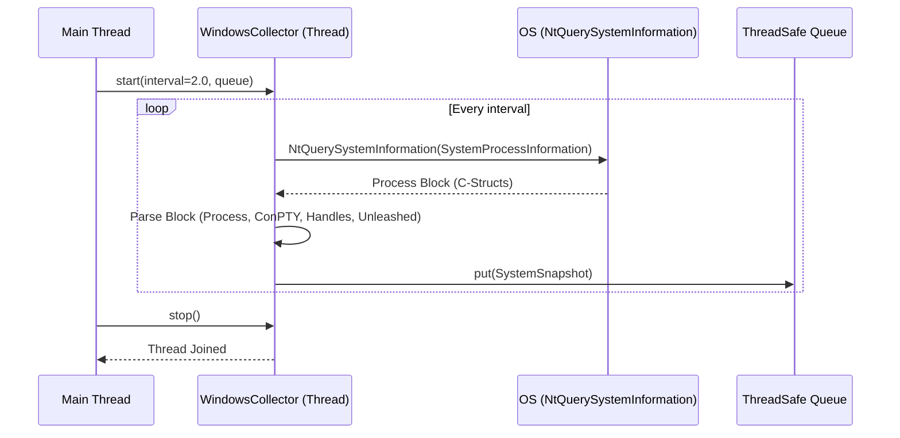

# Issue #4 - Feature: Windows data collector — ConPTY, processes, memory, handles (#4)

## 1. Context & Goal
* **Issue:** #4
* **Objective:** Build the Windows-specific data collector that polls system metrics (ConPTY, process count, memory, handles, unleashed sessions) in a single OS sweep per tick and feeds them to the gauge.
* **Status:** Approved (claude-opus-4-6, 2026-09-02)
* **Related Issues:** #224, #233, #234, #239, #405

### Open Questions
None.

## 2. Proposed Changes

### 2.1 Files Changed

| File | Change Type | Description |
|------|-------------|-------------|
| `src/boostgauge/collector.py` | Add | Abstract base class `DataCollector` and `SystemSnapshot` dataclass |
| `src/boostgauge/collectors/__init__.py` | Add | Package init for collectors |
| `src/boostgauge/collectors/windows.py` | Add | `WindowsCollector` implementation using `NtQuerySystemInformation` |
| `tests/unit/test_windows_collector.py` | Add | Unit tests for `WindowsCollector` with stubbed ctypes calls |
| `tests/integration/test_collector_live.py` | Add | Live cross-checks against `psutil` and performance benchmark |
| `tests/benchmark/test_collector_benchmark.py` | Add | Benchmark suite for the sweep performance constraints |

### 2.1.1 Path Validation (Mechanical - Auto-Checked)

Mechanical validation automatically checks:
- All "Modify" files must exist in repository
- All "Delete" files must exist in repository
- All "Add" files must have existing parent directories
- No placeholder prefixes (`src/`, `lib/`, `app/`) unless directory exists

### 2.2 Dependencies

```toml

# pyproject.toml additions (if any)

# None. psutil is already present in pyproject.toml constraints.
```

### 2.3 Data Structures

```python
from dataclasses import dataclass

@dataclass
class SystemSnapshot:
    timestamp: float
    conpty_count: int
    process_count: int
    memory_percent: float
    handle_count: int
    unleashed_sessions: int
    driver: str  # e.g., 'conpty', 'memory_percent'
    composite_value: float  # 0-100 normalized value
```

### 2.4 Function Signatures

```python

# src/boostgauge/collector.py
from abc import ABC, abstractmethod
import queue
from typing import Any

class DataCollector(ABC):
    @abstractmethod
    def start(self, interval: float, out_queue: queue.Queue, thresholds: Any) -> None:
        """Start polling loop in background thread. Abstract."""
        raise NotImplementedError # pragma: no cover

    @abstractmethod
    def stop(self) -> None:
        """Signal polling loop to terminate and wait for exit. Abstract."""
        raise NotImplementedError # pragma: no cover

# src/boostgauge/collectors/windows.py
from boostgauge.collector import DataCollector, SystemSnapshot

class WindowsCollector(DataCollector):
    def start(self, interval: float, out_queue: queue.Queue, thresholds: Any) -> None:
        """Starts the background thread for Windows collection."""
        ...

    def stop(self) -> None:
        """Signals stop event and joins the background thread."""
        ...

    def _run(self) -> None:
        """Background thread loop executing the sweep and queue push."""
        ...

    def _normalize(self, value: float, yellow_thresh: float, red_thresh: float) -> float:
        """Maps a raw metric value to a 0-100 scale using the threshold bands."""
        ...
```

### 2.5 Logic Flow (Pseudocode)

```
1. wait on stop_event for `interval` seconds
2. IF stop_event is set, EXIT thread
3. Initialize process_count=0, conpty_count=0, handle_count=0, unleashed_sessions=0
4. Call NtQuerySystemInformation(SystemProcessInformation) via ctypes
5. Walk the returned block of structs:
   a. process_count += 1
   b. handle_count += HandleCount
   c. IF ImageName in ("conhost.exe", "OpenConsole.exe") (case-insensitive):
      - conpty_count += 1
   d. IF ImageName is a Python interpreter ("python.exe", "pythonw.exe") (case-insensitive):
      - TRY:
          read cmdline = psutil.Process(pid).cmdline()
          IF cmdline matches signature "unleashed-c-*.py":
              unleashed_sessions += 1
      - CATCH psutil.AccessDenied, psutil.NoSuchProcess:
          skip row silently
6. memory_percent = psutil.virtual_memory().percent
7. For each metric (conpty, memory, processes, handles), calculate normalized score (0-100):
   - IF value <= yellow: map linearly to 0-60
   - IF yellow < value < red: map linearly to 60-100
   - IF value >= red: map to 100
8. Find the maximum normalized score and its corresponding metric name (driver)
9. Create SystemSnapshot
10. Put SystemSnapshot onto out_queue (non-blocking put)
11. Repeat from step 1
```

### 2.6 Technical Approach

* **Module:** `src/boostgauge/collectors/windows.py`
* **Pattern:** Background Worker Thread + Data Transfer Object (Snapshot)
* **Key Decisions:** We strictly adhere to the single-sweep mandate (ADR 0001). `NtQuerySystemInformation` retrieves all needed process data in one call without opening process handles. We only fallback to `psutil` for memory (a direct call) and `cmdline` on a tightly filtered subset of Python rows.

### 2.7 Architecture Decisions

| Decision | Options Considered | Choice | Rationale |
|----------|-------------------|--------|-----------|
| Process Sweep Mechanism | psutil.process_iter, Get-Process, NtQuerySystemInformation | `NtQuerySystemInformation` via ctypes | Mandated by #405 amendment to ADR 0001. `psutil.process_iter` forces handle reads which cost 422ms per tick, violating performance constraints. |
| Threading model | Timer events on main thread vs dedicated background thread | Dedicated background thread | Avoids any risk of IO blocking the GUI render loop. Satisfies "polling is non-blocking" acceptance criterion. |

**Architectural Constraints:**
- Must not introduce WMI queries.
- Must not launch PowerShell subprocesses.
- Must gather all process-derived metrics from exactly one system call.

## 3. Requirements

1. The collector MUST return an accurate ConPTY count: the sweep's console-host count equals psutil's `process_iter` console-host count on the running machine (±1).
2. The collector MUST return accurate memory %, process count, and handle count: process count equals psutil's row count ±1; handle count within 1% of psutil's `num_handles` sum.
3. The collector MUST accurately detect unleashed sessions: a row counts only when its process `name` is a Python interpreter (from the sweep) AND its `cmdline` (via `psutil.Process(pid).cmdline()`, read only for identified Python rows) matches the `unleashed-c-*.py` signature.
4. Polling MUST be non-blocking, running in a background thread and pushing snapshots to a thread-safe queue.
5. The collector MUST gracefully handle permission and lifecycle errors (`AccessDenied`, `NoSuchProcess`) when reading the `cmdline` of a dying process.
6. All process-derived metrics (ConPTY count, process count, handle count, unleashed sessions) MUST come from a single sweep per tick via one `NtQuerySystemInformation(SystemProcessInformation)` call, and the source code MUST NOT reference `psutil.pids`, `psutil.process_iter`, `Get-Process`, or a second `NtQuerySystemInformation` per tick.
7. The collector's sweep MUST have < 1% CPU overhead at a 2s polling interval, asserted by a benchmark test showing the sweep's mean `process_time` over 8 ticks is < 20 ms.
8. The `composite_value` MUST be the maximum of the normalized metrics, mapping 0-100 based on the thresholds config (0 to 60 at yellow, 60 to 100 at red).
9. The `driver` field MUST correctly report which metric produced the maximum normalized value.
10. The collector MUST derive system memory percent from a single direct `psutil.virtual_memory().percent` call per tick.

## 4. Alternatives Considered

| Option | Pros | Cons | Decision |
|--------|------|------|----------|
| `psutil.process_iter` for sweep | Built-in cross-platform API, easy to read | Opens every process to get `num_handles`, causing 21% CPU overhead on typical dev machine | **Rejected** (per ruling #405) |
| WMI `Win32_Process` | Robust SQL-like querying | Causes system hangs, heavy CPU usage | **Rejected** |

**Rationale:** The `NtQuerySystemInformation` implementation bypasses `OpenProcess` entirely, dropping overhead from 422 ms to 2.2 ms, ensuring the gauge is not part of the resource problem it seeks to measure.

## 5. Data & Fixtures

### 5.1 Data Sources

| Attribute | Value |
|-----------|-------|
| Source | OS Kernel via `NtQuerySystemInformation` + `psutil` |
| Format | Windows `SYSTEM_PROCESS_INFORMATION` C-structs |
| Size | 104 bytes header per process (~300-600 processes) |
| Refresh | Configured poll interval (default 2s) |
| Copyright/License | N/A |

### 5.2 Data Pipeline

```
NtQuerySystemInformation ──ctypes parse──► Python struct properties ──compute max/aggregate──► SystemSnapshot
```

### 5.3 Test Fixtures

| Fixture | Source | Notes |
|---------|--------|-------|
| Mocked `SYSTEM_PROCESS_INFORMATION` byte block | Hardcoded byte sequence in `tests/unit/test_windows_collector.py` | Contains valid python.exe, conhost.exe rows to ensure parsing works offline. |

### 5.4 Deployment Pipeline
N/A - Data is transient and collected strictly at runtime for local visualization.

## 6. Diagram

### 6.1 Mermaid Quality Gate

**Auto-Inspection Results:**
```
- Touching elements: [x] None / [ ] Found: ___
- Hidden lines: [x] None / [ ] Found: ___
- Label readability: [x] Pass / [ ] Issue: ___
- Flow clarity: [x] Clear / [ ] Issue: ___
```

### 6.2 Diagram



## 7. Security & Safety Considerations

### 7.1 Security

| Concern | Mitigation | Status |
|---------|------------|--------|
| Privilege escalation | Run strictly under standard user context; ignore rows that emit AccessDenied when fetching `cmdline`. | Addressed |

### 7.2 Safety

| Concern | Mitigation | Status |
|---------|------------|--------|
| Background thread blocks app exit | `stop()` method gracefully triggers a threading Event, aborting the sleep interval and joining the thread cleanly. | Addressed |
| Unconsumed queue memory leak | `SystemSnapshot` pushes use unbounded queue, assuming rapid GUI consumption. Risk accepted for v1, documented for GUI consumer to drain efficiently. | Addressed |
| Process exit race conditions | `psutil.Process(pid).cmdline()` wrapped in `try/except (AccessDenied, NoSuchProcess)` to safely skip processes that exit during the sweep. | Addressed |

**Fail Mode:** Fail Closed - If the single OS syscall fails unexpectedly, the background thread exits and ceases pushing snapshots.
**Recovery Strategy:** Next app restart will re-initialize the collector.

## 8. Performance & Cost Considerations

### 8.1 Performance

| Metric | Budget | Approach |
|--------|--------|----------|
| CPU Overhead | < 1% per tick | Single `NtQuerySystemInformation` call per tick rather than per-row handle reads. |
| Latency | < 20ms per sweep | Guaranteed by minimizing cross-boundary calls and string parsing. |
| API Calls | 1 OS process call per tick | All process metrics derived from one block parsing step. |

**Bottlenecks:** Reading the command line of Python interpreter processes via `psutil`. Minimized by filtering strictly to Python executables BEFORE triggering the psutil read.

### 8.2 Cost Analysis
N/A - Fully local execution. No API or cloud costs.

## 9. Legal & Compliance

| Concern | Applies? | Mitigation |
|---------|----------|------------|
| PII/Personal Data | No | Metrics are fully anonymous system performance aggregates. |
| Third-Party Licenses | Yes | `psutil` is BSD-licensed. Compatible with our MIT license. |
| Terms of Service | N/A | Local system calls only. |
| Data Retention | N/A | Metrics are held purely in memory and dropped when aged out. |
| Export Controls | No | Standard system monitoring logic. |

**Data Classification:** Internal / Local Only

## 10. Verification & Testing

**Testing Philosophy:** Strive for 100% automated test coverage. Manual tests are a last resort for scenarios that genuinely cannot be automated.

### 10.0 Test Plan (TDD - Complete Before Implementation)

**Reference:** `docs/design/0001-test-strategy.md`
**Applicable Tiers:** Unit (`tests/unit/`), Integration (`tests/integration/`), Benchmark (`tests/benchmark/`).
**Overrides to §3:** N/A (No visual output rendered by the collector).

**Coverage Target:** 100% line + branch on touched files (per docs/design/0001-test-strategy.md)
**Coverage Exclusions:** `raise NotImplementedError` lines in abstract base class `DataCollector` will be marked with `# pragma: no cover` (justification: abstract interfaces cannot be invoked).

**Values Carried:**
- benchmark limit: "mean process_time < 20 ms"
- system calls: "call count == 1"

| Test ID | Test Description | Expected Behavior | Status |
|---------|------------------|-------------------|--------|
| T010 | Mocked single sweep count | System call is made exactly once per tick | RED |
| T015 | Source code anti-pattern pin | Text does not contain banned `psutil` or subprocess tokens | RED |
| T020 | ConPTY count accuracy | Sweep ConPTY equals psutil `process_iter` ConPTY count ±1 | RED |
| T030 | Basic metrics accuracy | Process count equals psutil ±1; Handle total within 1% | RED |
| T040 | Unleashed session detection | Count exactly matches rows with name `python.exe` and cmdline `unleashed-c-*.py` | RED |
| T050 | Non-blocking thread polling | Thread starts, pushes at least one item to queue, cleanly joins | RED |
| T060 | Permission error (AccessDenied) | Exception caught, count unaffected by bad row | RED |
| T065 | Process exit (NoSuchProcess) | Exception caught, count unaffected by bad row | RED |
| T070 | CPU overhead benchmark | Sweep's mean `process_time` < 20 ms over 8 runs | RED |
| T080 | Composite value calculation | Returns exact normalized max (e.g., 80.0 for metric at red threshold) | RED |
| T090 | Driver metric reporting | Returns exact driver string (e.g., "conpty") matching max metric | RED |
| T100 | Memory percent direct call | Snapshot `memory_percent` derived directly from `virtual_memory()` | RED |

### 10.1 Test Scenarios

| ID | Scenario | Type | Input | Expected Output | Pass Criteria |
|----|----------|------|-------|-----------------|---------------|
| 010 | Mocked single sweep count (REQ-6) | Auto | `NtQuerySystemInformation` stub | Call count exactly 1 | `call_count == 1` per tick |
| 015 | Source code anti-pattern pin (REQ-6) | Auto | `windows.py` source text | No banned references | Text does not contain `psutil.pids`, `psutil.process_iter`, or `Get-Process` |
| 020 | ConPTY count accuracy (REQ-1) | Auto-Live | Windows host | Sweep ConPTY equals psutil | Sweep ConPTY count equals psutil `process_iter` ConPTY count ±1 |
| 030 | Basic metrics accuracy (REQ-2) | Auto-Live | Windows host | Process count ±1, Handle within 1% | Process count equals psutil row count ±1; Handle total within 1% of psutil `num_handles` |
| 040 | Unleashed session detection (REQ-3) | Auto | Mocked sweep with Python and non-Python rows | Only Python with `unleashed-c-*.py` counts | Count exactly matches rows with name `python.exe` and cmdline `unleashed-c-*.py` |
| 050 | Non-blocking thread polling (REQ-4) | Auto | `start(2.0, q)`, wait 0.1s, `stop()` | Snapshots pushed to queue | Thread starts, pushes at least one item to queue, cleanly joins |
| 060 | Permission error handling (REQ-5) | Auto | Mocked `psutil.Process(pid).cmdline()` raises `AccessDenied` | Row is skipped, no crash | Exception caught, count unaffected by bad row |
| 065 | Process exit handling (REQ-5) | Auto | Mocked `psutil.Process(pid).cmdline()` raises `NoSuchProcess` | Row is skipped, no crash | Exception caught, count unaffected by bad row |
| 070 | CPU overhead benchmark (REQ-7) | Auto-Live | 8 ticks on running machine | mean `process_time` < 20 ms | Sweep's mean `process_time` < 20 ms over 8 runs |
| 080 | Composite value calculation (REQ-8) | Auto | Synthetic metrics and thresholds | Calculated 0-100 value | Returns exact normalized max |
| 090 | Driver metric reporting (REQ-9) | Auto | Snapshot where ConPTY is max | "conpty" | `driver == "conpty"` |
| 100 | Memory percent direct call (REQ-10) | Auto | Stubbed `psutil.virtual_memory` returning 42.0% | Value fetched successfully | Snapshot `memory_percent == 42.0` |

### 10.2 Test Commands

```bash

# Run all automated unit tests
poetry run pytest tests/unit/test_windows_collector.py -v

# Run live integration cross-checks
poetry run pytest tests/integration/test_collector_live.py -v

# Run performance benchmarks
poetry run pytest tests/benchmark/test_collector_benchmark.py -v
```

### 10.3 Manual Tests (Only If Unavoidable)

N/A - All scenarios automated.

## 11. Risks & Mitigations

| Risk | Impact | Likelihood | Mitigation |
|------|--------|------------|------------|
| Memory leak from unconsumed queue | Med | Low | The `_run` method will use non-blocking `queue.put()`. GUI consumer must be documented to drain efficiently. |
| Background thread blocks application exit | High | Med | `stop()` method gracefully sets a threading `Event` and joins the thread, terminating the sleep interval instantly. |
| `psutil` raises `AccessDenied` on ephemeral processes | Low | High | `_run` logic wraps `cmdline()` fetches in `try/except (AccessDenied, NoSuchProcess)` to bypass dying rows cleanly. |

## 12. Definition of Done

### Code
- [ ] Implementation complete and linted
- [ ] Code comments reference this LLD

### Tests
- [ ] All test scenarios pass
- [ ] Test coverage meets threshold

### Documentation
- [ ] LLD updated with any deviations
- [ ] Implementation Report (0103) completed
- [ ] Test Report (0113) completed if applicable

### Review
- [ ] Code review completed
- [ ] User approval before closing issue

### 12.1 Traceability (Mechanical - Auto-Checked)

Mechanical validation automatically checks:
- Every file mentioned in this section must appear in Section 2.1
- Every risk mitigation in Section 11 should have a corresponding function in Section 2.4 (warning if not)

---

## Appendix: Review Log

### Initial Draft (#1)

**Reviewer:** System
**Verdict:** PENDING

#### Comments

| ID | Comment | Implemented? |
|----|---------|--------------|
| N/A | Draft creation | PENDING |

### Review Summary

| Review | Date | Verdict | Key Issue |
|--------|------|---------|-----------|
| 1 | 2026-09-02 | APPROVED | `claude-opus-4-6` |
| Draft #1 | (auto) | PENDING | Initial Draft Submission |

**Final Status:** APPROVED