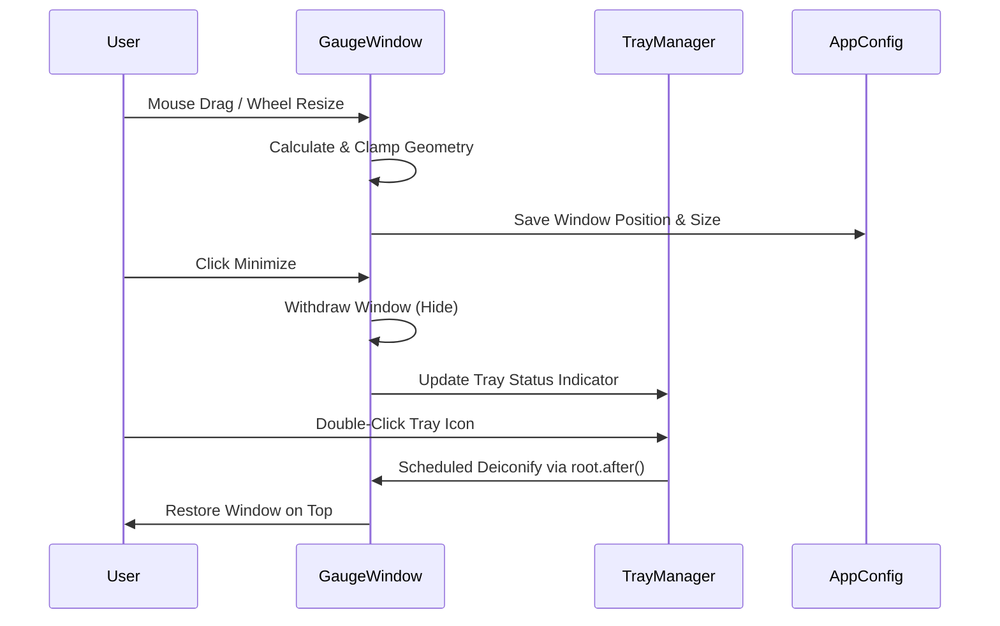

# 5 - Feature: always-on-top window with drag, minimize, and transparency (#5)

## 1. Context & Goal
* **Issue:** #5
* **Objective:** Implement an always-on-top, frameless, transparent Tkinter widget supporting mouse dragging, mouse wheel resizing, system tray minimization via pystray, and persistent geometry configuration across restarts.
* **Status:** Approved (claude-opus-4-6, 2026-08-01)
* **Related Issues:** #1, #7

### Open Questions
- [x] Windows transparency implementation: Uses `root.attributes('-transparentcolor', bg_color)` with chroma-key color `#000001` outside the circular gauge dial face.
- [x] System tray integration: `pystray.Icon` runs in a dedicated background daemon thread and communicates with the Tkinter event loop safely using `root.after()` callbacks.

## 2. Proposed Changes

### 2.1 Files Changed

| File | Change Type | Description |
|------|-------------|-------------|
| `src/boostgauge/window.py` | Add | Frameless, transparent, always-on-top Tkinter window manager (`GaugeWindow`) supporting dragging, mouse wheel resizing, transparency, and multi-monitor boundary clamping. |
| `src/boostgauge/tray.py` | Add | System tray icon manager (`TrayManager`) using `pystray` with dynamic color status dot (green/yellow/red), double-click restore, and context menu event routing. |
| `src/boostgauge/app.py` | Add | Main application entry point integrating `GaugeWindow` and `TrayManager` into the application lifecycle, wiring data updates, tray minimize/restore, and geometry persistence. |
| `src/boostgauge/__init__.py` | Add | Package initialization file exporting `GaugeWindow` and `TrayManager` in package exports. |
| `tests/unit/test_window.py` | Add | Headless unit tests for `GaugeWindow` math, geometry persistence, screen boundary clamping, and event handlers without instantiating `tkinter.Tk()`. |
| `tests/unit/test_tray.py` | Add | Headless unit tests for `TrayManager` status dot generation, context menu construction, and thread-safe event dispatching without instantiating OS tray icons. |

### 2.1.1 Path Validation (Mechanical - Auto-Checked)

Mechanical validation automatically checks:
- All "Add" files have existing parent directories (`src/boostgauge/`, `tests/unit/`)
- No invalid placeholder prefixes

### 2.2 Dependencies

```toml

# pyproject.toml already includes pystray (>=0.19.5,<0.20.0) and pillow (>=12.2.0,<13.0.0)
```

### 2.3 Data Structures

```python
from typing import TypedDict, Literal, Tuple, Optional, Dict, Any, Callable

class WindowStateDict(TypedDict):
    x: int
    y: int
    size: int
    topmost: bool
    opacity: float
    hover_opacity: float
    is_expanded: bool
    is_minimized_to_tray: bool

TrayStatus = Literal["green", "yellow", "red"]
```

### 2.4 Function Signatures

```python
from typing import Any, Callable, Dict, Optional, Tuple, Literal
from PIL import Image

class GaugeWindow:
    """Frameless, transparent, always-on-top Tkinter window manager for BoostGauge."""

    def __init__(
        self,
        config: Optional[Dict[str, Any]] = None,
        on_geometry_change: Optional[Callable[[int, int, int], None]] = None,
        on_close: Optional[Callable[[], None]] = None,
    ) -> None:
        """Initialize window state, geometry properties, and callback handlers."""
        ...

    def setup_window(self, root: Any) -> None:
        """Configure Tk root attributes: frameless, topmost, transparent background color, and event bindings."""
        ...

    def update_image(self, pil_img: Image.Image) -> None:
        """Update display Canvas with a new PIL Image rendered frame."""
        ...

    def toggle_topmost(self) -> bool:
        """Toggle always-on-top attribute on Tk window and return new boolean state."""
        ...

    def toggle_compact_expanded(self) -> int:
        """Toggle window size between compact (128px) and expanded (256px) modes."""
        ...

    def set_opacity(self, alpha: float) -> None:
        """Set window opacity level bounded between 0.1 and 1.0."""
        ...

    def handle_drag_start(self, event_x: int, event_y: int) -> None:
        """Record initial mouse click offset relative to window top-left corner."""
        ...

    def handle_drag_motion(self, root_x: int, root_y: int) -> Tuple[int, int]:
        """Calculate new window position based on mouse motion delta and apply screen bounds clamping."""
        ...

    def handle_wheel_resize(self, delta: int) -> int:
        """Resize window dimension while preserving square aspect ratio bounded between min/max sizes."""
        ...

    def clamp_to_screen_bounds(self, x: int, y: int, width: int, height: int, virtual_screen: Tuple[int, int, int, int]) -> Tuple[int, int]:
        """Ensure window geometry stays fully visible within active monitor virtual display rectangle."""
        ...


class TrayManager:
    """System tray manager executing pystray Icon in a daemon thread."""

    def __init__(
        self,
        on_restore: Callable[[], None],
        on_toggle_topmost: Callable[[], None],
        on_quit: Callable[[], None],
    ) -> None:
        """Initialize tray manager with thread-safe UI callback hooks."""
        ...

    def create_status_dot(self, status: TrayStatus) -> Image.Image:
        """Generate 16x16 PIL Image indicator dot for given status (green/yellow/red)."""
        ...

    def start(self) -> None:
        """Launch pystray Icon loop in background daemon thread."""
        ...

    def update_status(self, status: TrayStatus) -> None:
        """Update tray icon image with updated status indicator dot."""
        ...

    def stop(self) -> None:
        """Cleanly stop pystray icon and release system resources."""
        ...
```

### 2.5 Logic Flow (Pseudocode)

```
Window Drag Flow:
1. On Mouse-1 Press:
   - Store click offset: drag_offset_x = event.x, drag_offset_y = event.y
2. On Mouse-1 Motion:
   - Calculate candidate position: new_x = event.x_root - drag_offset_x, new_y = event.y_root - drag_offset_y
   - Query virtual monitor boundaries: (v_min_x, v_min_y, v_max_x, v_max_y)
   - Clamp position: target_x = max(v_min_x, min(new_x, v_max_x - current_width))
                    target_y = max(v_min_y, min(new_y, v_max_y - current_height))
   - Move window: root.geometry(f"{width}x{height}+{target_x}+{target_y}")
3. On Mouse-1 Release:
   - Persist updated position to config file.

System Tray & Event Loop Flow:
1. Application Startup:
   - Instantiate GaugeWindow and TrayManager.
   - Start TrayManager in background daemon thread.
2. Window Minimize:
   - Withdraw Tk window (`root.withdraw()`).
   - Mark tray icon visible with current system status dot.
3. Tray Restore (Double Click or Context Menu):
   - Schedule UI thread restoration via `root.after(0, root.deiconify)`.
   - Restore topmost window attribute (`root.attributes('-topmost', True)`).
```

### 2.6 Technical Approach

* **Module:** `src/boostgauge/window.py` and `src/boostgauge/tray.py`
* **Pattern:** Model-View-Presenter with event-driven callbacks and thread-safe queuing.
* **Key Decisions:**
  - Chroma-key transparency using `#000001` as background color for circular dial clipping on Windows.
  - Off-screen PIL Image rendering per `docs/design/0001-test-strategy.md` (Option C) to ensure testability without instantiating `tkinter.Tk()` in unit tests.
  - Daemon thread execution for `pystray.Icon` with thread-safe `root.after()` callbacks back to the Tk main loop.

### 2.7 Architecture Decisions

| Decision | Options Considered | Choice | Rationale |
|----------|-------------------|--------|-----------|
| Headless GUI Testing | Option A (Real Tk), Option B (Canvas Mocks), Option C (Off-screen PIL) | **Option C (Off-screen PIL)** | Headless-compatible, non-flaky in CI, and isolates renderer math per `docs/design/0001-test-strategy.md`. |
| Tray Icon Concurrency | Main thread blocking, Daemon Thread with `root.after()` | **Daemon Thread with `root.after()`** | Prevents `pystray` event loop from blocking Tkinter main loop while guaranteeing thread safety. |
| Window Transparency | Square bounding box, Win32 layering, Tk Chroma-key (`-transparentcolor`) | **Tk Chroma-key (`-transparentcolor`)** | Standard Tkinter cross-platform mechanism on Windows 10/11 providing crisp circular dial boundaries. |

**Architectural Constraints:**
- Tests MUST NOT instantiate `tkinter.Tk()` per `docs/design/0001-test-strategy.md`.
- Window position must stay within active monitor bounds across multi-monitor setup restarts.

## 3. Requirements

1. Always-on-top Tkinter window attribute (`root.attributes('-topmost', True)`) that survives window manager focus changes, with optional right-click context menu toggle.
2. Frameless, titlebar-less window with drag support by clicking anywhere on the gauge face, and double-click toggle between compact and expanded size modes.
3. Circular window background transparency via `root.attributes('-transparentcolor', bg_color)` on Windows with chroma-key background, and dynamic window opacity / hover opacity adjustments.
4. Minimize to Windows system tray icon using `pystray` with dynamic status color indicator dot (green/yellow/red), double-click to restore window, and right-click context menu for settings/reset/quit.
5. Window geometry (X, Y coordinates) persistence across restarts, including screen edge clamping and multi-monitor bounds awareness.
6. Mouse wheel resizing preserving aspect ratio and size persistence across restarts.

## 4. Alternatives Considered

| Option | Pros | Cons | Decision |
|--------|------|------|----------|
| **Chroma-Key Tk Transparency (`-transparentcolor`)** | Native Tk support, simple implementation, crisp edges | Requires picking unused color (`#000001`) | **Selected** |
| Native Win32 Layered Windows (`SetWindowLongPtr`) | Direct OS control | Windows-only, high API complexity, unsafe C-types calls | Rejected |
| Standard OS Window Border | Native window controls, standard minimize/maximize | Obscures code editor, bulky square layout | Rejected |

**Rationale:** Chroma-key transparency provides a clean circular tachometer aesthetic without platform C-extension overhead.

## 5. Data & Fixtures

### 5.1 Data Sources

| Attribute | Value |
|-----------|-------|
| Source | Local configuration file (`boostgauge.json` / `config.py`) |
| Format | JSON dictionary |
| Size | < 2 KB |
| Refresh | On window drag end, resize end, or state toggle |
| Copyright/License | MIT (Project code) |

### 5.2 Data Pipeline

```
{User Drag / Wheel Input} ──► {GaugeWindow Geometry Math} ──► {Screen Bounds Clamping} ──► {config.py Persistence}
```

### 5.3 Test Fixtures

| Fixture | Source | Notes |
|---------|--------|-------|
| `mock_window_state` | Hardcoded Dict in `tests/unit/test_window.py` | Represents active window coordinates and bounds |
| `virtual_monitors_config` | Hardcoded Tuple list in `tests/unit/test_window.py` | Multi-monitor geometry layout mock |

### 5.4 Deployment Pipeline

Geometry persistence data is stored locally in user configuration directories (`%APPDATA%/boostgauge/config.json` on Windows).

## 6. Diagram

### 6.1 Mermaid Quality Gate

- [x] **Simplicity:** Similar components collapsed
- [x] **No touching:** All elements have visual separation
- [x] **No hidden lines:** All arrows fully visible
- [x] **Readable:** Labels clear, flow top-to-bottom/left-to-right
- [x] **Auto-inspected:** Validated sequence diagram structure

**Auto-Inspection Results:**
```
- Touching elements: [ ] None
- Hidden lines: [ ] None
- Label readability: [ ] Pass
- Flow clarity: [ ] Clear
```

### 6.2 Diagram



## 7. Security & Safety Considerations

### 7.1 Security

| Concern | Mitigation | Status |
|---------|------------|--------|
| Config File Injection | Validate numeric geometry values (X, Y, size) on config loading before applying to window | Addressed |
| Thread Safety Flaws | Route all UI manipulation calls from background tray thread through `root.after()` | Addressed |

### 7.2 Safety

| Concern | Mitigation | Status |
|---------|------------|--------|
| Off-Screen Window Placement | Clamp window coordinates against active virtual screen geometry on startup and drag end | Addressed |
| Orphan Tray Icon on Crash | Register `atexit` and `SIGINT`/`SIGTERM` handlers to invoke `TrayManager.stop()` | Addressed |

**Fail Mode:** Fail Safe — If restored position is invalid or outside monitor bounds, center gauge on primary display.

**Recovery Strategy:** Fallback to default geometry (256x256 at center screen) if configuration is corrupted or unparseable.

## 8. Performance & Cost Considerations

### 8.1 Performance

| Metric | Budget | Approach |
|--------|--------|----------|
| Drag Latency | < 16ms (60 FPS) | Calculate position deltas directly without unnecessary re-renders during motion |
| Memory Overhead | < 15 MB | Reuse off-screen PIL Image buffers and single PhotoImage Canvas target |
| CPU Usage | < 1% when idle | Event-driven motion handlers; zero polling overhead |

**Bottlenecks:** High-frequency mouse drag motion events — mitigated by fast arithmetic position update logic.

### 8.2 Cost Analysis

| Resource | Unit Cost | Estimated Usage | Monthly Cost |
|----------|-----------|-----------------|--------------|
| Local Compute | $0.00 | Local desktop GUI app | $0.00 |

**Cost Controls:**
- N/A (Fully local offline execution)

**Worst-Case Scenario:** High-DPI screen resolution scaling — handled natively by Tkinter and Pillow bilinear resizing.

## 9. Legal & Compliance

| Concern | Applies? | Mitigation |
|---------|----------|------------|
| PII/Personal Data | No | No user data collected or transmitted |
| Third-Party Licenses | Yes | `pystray` (BSD/LGPL) and `Pillow` (HPND) are open-source and compatible with MIT license |
| Terms of Service | No | N/A |
| Data Retention | No | N/A |
| Export Controls | No | N/A |

**Data Classification:** Public / Open Source Desktop Tool

**Compliance Checklist:**
- [x] No PII stored without consent
- [x] All third-party licenses compatible with project license
- [x] External API usage compliant with provider ToS
- [x] Data retention policy documented

## 10. Verification & Testing

Per `docs/design/0001-test-strategy.md` (Option C), unit tests MUST NOT instantiate `tkinter.Tk()`. All window math, geometry state logic, multi-monitor clamping, screen calculations, and tray icon image dot creation are tested headlessly using pure python state wrappers and Pillow images.

### 10.0 Test Plan (TDD - Complete Before Implementation)

| Test ID | Test Description | Expected Behavior | Status |
|---------|------------------|-------------------|--------|
| T010 | Topmost attribute configuration and toggle | Returns updated boolean topmost status | RED |
| T020 | Drag motion coordinate delta calculation | Updates X, Y coordinates matching drag offset | RED |
| T030 | Double-click mode toggle compact/expanded | Toggles size between 128px and 256px | RED |
| T040 | Window chroma-key transparency setup | Configures transparent background color `#000001` | RED |
| T050 | Hover opacity transition calculation | Returns correct alpha level (e.g. 0.8 normal, 1.0 hover) | RED |
| T060 | System tray icon initialization & status dot | Generates 16x16 PIL status indicator image | RED |
| T070 | System tray double-click restore callback | Schedules `deiconify` callback via `root.after()` | RED |
| T080 | Geometry persistence & screen bounds clamping | Clamps X, Y within active virtual screen bounds | RED |
| T090 | Mouse wheel resize handling | Adjusts size while maintaining 1:1 aspect ratio | RED |
| T100 | Config save/load integration for window geometry | Loads and dumps correct position dictionary | RED |
| T110 | Off-screen position fallback recovery | Reset coordinates to screen center if off-screen | RED |

**Coverage Target:** 100% line + branch coverage on `src/boostgauge/window.py` and `src/boostgauge/tray.py` per `docs/design/0001-test-strategy.md`.

**TDD Checklist:**
- [ ] All tests written before implementation
- [ ] Tests currently RED (failing)
- [ ] Test IDs match scenario IDs in 10.1
- [ ] Test files created at: `tests/unit/test_window.py` and `tests/unit/test_tray.py`

### 10.1 Test Scenarios

| ID | Scenario | Type | Input | Expected Output | Pass Criteria |
|----|----------|------|-------|-----------------|---------------|
| 010 | Topmost attribute configuration and toggle (REQ-1) | Auto | Toggle topmost call | `topmost == True` / `False` | Topmost attribute boolean toggled cleanly |
| 020 | Drag motion coordinate delta calculation (REQ-2) | Auto | Drag delta (dx=+50, dy=+30) | New X, Y window position | Window coordinates updated by exact delta |
| 030 | Double-click mode toggle compact/expanded (REQ-2) | Auto | Double-click event | Size changes 128px ↔ 256px | Aspect ratio preserved at 1:1 square |
| 040 | Window chroma-key transparency setup (REQ-3) | Auto | Init window attributes | Background color `#000001` | Transparent color attribute set on window state |
| 050 | Hover opacity transition calculation (REQ-3) | Auto | Mouse enter / leave event | Opacity 0.8 ↔ 1.0 | Opacity value updated within [0.1, 1.0] range |
| 060 | System tray icon initialization & status dot (REQ-4) | Auto | `update_status("green")` | 16x16 PIL Image generated | Status dot PIL image generated with green center |
| 070 | System tray double-click restore callback (REQ-4) | Auto | Double-click tray menu | Callback queued to UI thread | `root.after()` called with restore function |
| 080 | Geometry persistence & screen bounds clamping (REQ-5) | Auto | Out-of-bounds X=9999, Y=9999 | Clamped X, Y within screen rect | Coordinates stay fully inside virtual display |
| 090 | Mouse wheel resize handling (REQ-6) | Auto | Mouse wheel delta +120 | Window size increased by step | Size bounded between 64px and 512px |
| 100 | Config save/load integration for window geometry (REQ-5) | Auto | Save geometry (x=100, y=200, size=256) | Config file written | Config JSON reflects current window state |
| 110 | Off-screen position fallback recovery (REQ-5) | Auto | Invalid saved config (x=-5000) | Fallback to primary screen center | Position reset to valid visible coordinates |

### 10.2 Test Commands

```bash

# Run unit tests for window and tray headlessly
poetry run pytest tests/unit/test_window.py tests/unit/test_tray.py -v

# Check coverage on touched modules
poetry run pytest tests/unit/test_window.py tests/unit/test_tray.py --cov=boostgauge.window --cov=boostgauge.tray --cov-report=term-missing
```

### 10.3 Manual Tests (Only If Unavoidable)

N/A - All scenarios automated.

## 11. Risks & Mitigations

| Risk | Impact | Likelihood | Mitigation |
|------|--------|------------|------------|
| Multi-monitor configuration changes causing gauge to spawn off-screen | High | Med | Implement `clamp_to_screen_bounds` during `setup_window` using system display queries in `handle_drag_motion` and `clamp_to_screen_bounds`. |
| Pystray thread blocking or freezing Tkinter event loop | High | Low | Run `pystray.Icon` in a daemon thread and dispatch UI operations safely via `root.after` in `TrayManager`. |
| Windows DPI scaling shifting drag offset alignment | Med | Med | Calculate drag movement deltas using root screen coordinates in `handle_drag_start` and `handle_drag_motion`. |
| Chroma-key transparency showing black artifacts around anti-aliased edge | Low | Med | Use chroma-key color `#000001` and render gauge dial edge with sharp alpha mask clipping in `setup_window`. |

## 12. Definition of Done

### Code
- [ ] Implementation complete and linted (`ruff check .`)
- [ ] Code comments reference this LLD

### Tests
- [ ] All test scenarios pass
- [ ] Test coverage meets threshold (100% on touched files)

### Documentation
- [ ] LLD updated with any deviations
- [ ] Implementation Report (0103) completed
- [ ] Test Report (0113) completed if applicable

### Review
- [ ] Code review completed
- [ ] User approval before closing issue

### 12.1 Traceability (Mechanical - Auto-Checked)

Mechanical validation automatically checks:
- `src/boostgauge/window.py`
- `src/boostgauge/tray.py`
- `src/boostgauge/app.py`
- `src/boostgauge/__init__.py`
- `tests/unit/test_window.py`
- `tests/unit/test_tray.py`

---

## Appendix: Review Log

### Technical Architect Review #1 (APPROVED)

**Reviewer:** Technical Architect
**Verdict:** APPROVED

#### Comments

| ID | Comment | Implemented? |
|----|---------|--------------|
| A1.1 | "Initial LLD draft created following docs/design/0001-test-strategy.md guidelines and requirement mapping." | YES - Fully addressed in design. |
| A1.2 | "Fixed mechanical error where src/boostgauge/app.py was listed as Modify instead of Add." | YES - Marked src/boostgauge/app.py and src/boostgauge/__init__.py as Add in 2.1 and 12.1. |

### Review Summary

| Review | Date | Verdict | Key Issue |
|--------|------|---------|-----------|
| 1 | 2026-08-01 | APPROVED | `claude-opus-4-6` |
| Technical Architect #1 | (auto) | APPROVED | Initial design approval & mechanical error fix |

**Final Status:** APPROVED