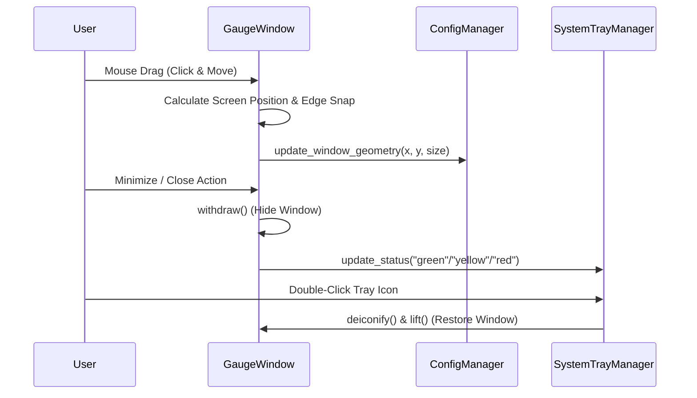

# #5 - Feature: always-on-top window with drag, minimize, and transparency (#5)

## 1. Context & Goal
* **Issue:** #5
* **Objective:** Implement an always-on-top, frameless, draggable Tkinter window with circular background transparency, hover opacity control, mouse-wheel resizing, window state persistence, multi-monitor bounds safety, and cross-platform system tray integration via `pystray`.
* **Status:** Approved (claude-opus-4-6, 2026-07-30)
* **Related Issues:** #1, #2, #4, #7, #41

### Open Questions
*None — requirements and acceptance criteria are fully specified.*

## 2. Proposed Changes

### 2.1 Files Changed

| File | Change Type | Description |
|------|-------------|-------------|
| `src/boostgauge/window.py` | Add | `GaugeWindow` class encapsulating Tkinter window setup, frameless geometry, circular transparency background, hover opacity transitions, mouse dragging/wheel resizing, double-click compact mode, screen bounds clamping, and edge snapping. |
| `src/boostgauge/tray.py` | Add | `SystemTrayManager` class wrapping `pystray.Icon`, dynamic green/yellow/red status dot rendering, window restore on double-click, and context menu actions (Settings, Reset Telltales, Exit). |
| `src/boostgauge/__init__.py` | Modify | Export `GaugeWindow` and `SystemTrayManager` in package export symbols `__all__`. |
| `src/boostgauge/app.py` | Modify | Integrate `GaugeWindow` and `SystemTrayManager` into the main application execution loop, wiring metric updates to display refresh and tray icon status updates. |
| `tests/unit/test_window.py` | Add | Unit test suite for `GaugeWindow` state logic, geometry calculations, drag offset math, screen boundary clamping, snap-to-edge calculation, and hover opacity state transitions without calling `tkinter.Tk()`. |
| `tests/unit/test_tray.py` | Add | Unit test suite for `SystemTrayManager` tray icon creation, status dot color mapping, menu callback routing, and window visibility toggles without external tray loops. |

### 2.1.1 Path Validation (Mechanical - Auto-Checked)

Mechanical validation automatically checks:
- All "Modify" files must exist in repository (`src/boostgauge/__init__.py`, `src/boostgauge/app.py` exist)
- All "Delete" files must exist in repository (N/A)
- All "Add" files must have existing parent directories (`src/boostgauge` and `tests/unit` exist)
- No placeholder prefixes (`src/`, `lib/`, `app/`) unless directory exists (`src/` exists)

### 2.2 Dependencies

```toml

# pyproject.toml already specifies:

# pystray (>=0.19.5,<0.20.0)

# pillow (>=12.2.0,<13.0.0)

# No new third-party package dependencies required.
```

### 2.3 Data Structures

```python
from typing import Any, Callable, Dict, Literal, Optional, Tuple, TypedDict

TrayStatus = Literal["green", "yellow", "red"]

class WindowState(TypedDict):
    x: int
    y: int
    size: int
    is_compact: bool
    is_hovered: bool
    topmost: bool
    opacity: float

class DragState(TypedDict):
    start_x: int
    start_y: int
    win_x: int
    win_y: int
    is_dragging: bool
```

### 2.4 Function Signatures

```python

# src/boostgauge/window.py

def clamp_position_to_screen(
    x: int,
    y: int,
    size: int,
    screen_width: int,
    screen_height: int,
    margin: int = 10,
) -> Tuple[int, int]:
    """Clamp window position (x, y) so a gauge of specified size remains fully within screen boundaries."""
    ...

def calculate_snap_position(
    x: int,
    y: int,
    size: int,
    screen_width: int,
    screen_height: int,
    snap_margin: int = 15,
) -> Tuple[int, int]:
    """Snap window edges to screen boundaries if within snap_margin pixels."""
    ...

class GaugeWindow:
    """Tkinter-backed always-on-top, frameless, draggable, transparent gauge window."""

    def __init__(
        self,
        config: Dict[str, Any],
        on_geometry_change: Optional[Callable[[int, int, int], None]] = None,
        on_reset_request: Optional[Callable[[], None]] = None,
        on_quit_request: Optional[Callable[[], None]] = None,
    ) -> None:
        """Initialize window state, root attributes, bindings, and off-screen canvas."""
        ...

    def set_topmost(self, topmost: bool) -> None:
        """Set or update root window '-topmost' attribute."""
        ...

    def set_opacity(self, opacity: float) -> None:
        """Set window opacity alpha value [0.1, 1.0]."""
        ...

    def update_image(self, pil_image: Any) -> None:
        """Render PIL gauge image onto transparent canvas display surface."""
        ...

    def toggle_compact_mode(self) -> int:
        """Toggle between compact size (150px) and expanded size (configured size)."""
        ...

    def resize_by_delta(self, delta: int) -> int:
        """Resize gauge size by step delta, maintaining 1:1 aspect ratio within [128, 800] px."""
        ...

    def show(self) -> None:
        """Deiconify window and bring to front."""
        ...

    def hide_to_tray(self) -> None:
        """Withdraw window from taskbar and screen."""
        ...


# src/boostgauge/tray.py

def determine_tray_status(load_score: float) -> TrayStatus:
    """Map composite metric score [0.0, 100.0] to status color ('green' <60, 'yellow' 60-85, 'red' >85)."""
    ...

def create_status_dot_image(status: TrayStatus, size: int = 64) -> Any:
    """Create a circular status indicator icon (green/yellow/red) as PIL.Image for system tray."""
    ...

class SystemTrayManager:
    """System tray manager backed by pystray for cross-platform system tray integration."""

    def __init__(
        self,
        on_restore: Callable[[], None],
        on_toggle_topmost: Callable[[], None],
        on_reset_telltales: Callable[[], None],
        on_quit: Callable[[], None],
    ) -> None:
        """Initialize pystray Icon with context menu and event handlers."""
        ...

    def start(self) -> None:
        """Start tray icon in background daemon thread."""
        ...

    def stop(self) -> None:
        """Stop tray icon background thread."""
        ...

    def update_status(self, load_score: float) -> None:
        """Update system tray icon color based on composite score."""
        ...
```

### 2.5 Logic Flow (Pseudocode)

```
1. App Startup:
   - Load config (x, y, size, opacity, topmost).
   - Instantiate GaugeWindow(config).
   - Configure root window:
     * root.overrideredirect(True) [Frameless]
     * root.attributes('-topmost', topmost) [Always-on-top]
     * root.attributes('-transparentcolor', bg_color) [Circular transparency]
     * root.attributes('-alpha', opacity) [Base opacity]
   - Validate initial (x, y) against primary & multi-monitor screen bounds; clamp if off-screen.
   - Bind mouse events:
     * <ButtonPress-1> -> Record drag start offset (dx = mouse_x - win_x, dy = mouse_y - win_y)
     * <B1-Motion> -> Move window to (mouse_x - dx, mouse_y - dy), apply snap_to_edge calculation
     * <ButtonRelease-1> -> Save new (x, y) to config via update_window_geometry
     * <Double-Button-1> -> Toggle compact size (150px vs stored size)
     * <Enter> / <Leave> -> Hover opacity transition (1.0 on hover, config opacity on leave)
     * <MouseWheel> / <Button-4>/<Button-5> -> Resize window (delta +/- 16px, min 128px, max 800px)
     * <Button-3> (Right-click) -> Display context menu (Toggle Topmost, Reset Telltales, Minimize to Tray, Exit)
   - Instantiate SystemTrayManager(handlers).
   - Launch SystemTrayManager in daemon thread.

2. Metric Loop:
   - Collect SystemSnapshot.
   - Calculate composite load score (conpty, memory, process_cnt, handle_cnt).
   - Render off-screen PIL Image via render(value, telltales, size).
   - Update GaugeWindow canvas with PIL Image.
   - Determine tray status ("green" if score < 60, "yellow" if 60-85, "red" if > 85).
   - Update SystemTrayManager icon image.

3. Minimize / Restore Loop:
   - On Minimize command / Tray hide:
     * Call root.withdraw() to remove window from screen and taskbar.
   - On Tray Icon Double-click:
     * Call root.deiconify() and root.lift() to restore window state.

4. Shutdown:
   - Stop collector thread.
   - Stop tray icon thread.
   - Save geometry (x, y, size) to config file via save_config.
   - Call root.destroy() and sys.exit(0).
```

### 2.6 Technical Approach

* **Module:** `src/boostgauge/window.py`, `src/boostgauge/tray.py`, `src/boostgauge/app.py`
* **Pattern:** Model-View-Controller (MVC) separation — `GaugeWindow` controls display window & event translation, `SystemTrayManager` controls system tray lifecycle, core `render()` pure function provides pixel buffers, and `config.py` provides state persistence.
* **Key Decisions:**
  - Option C GUI Testing Compliance: Window logic (dragging calculations, screen clamping, snap math, size steps, opacity state, tray status color mapping) is decoupled into pure functions and testable methods. `tkinter.Tk()` is never instantiated in test suites.
  - Windows Circular Transparency: Uses `root.attributes('-transparentcolor', '#000001')` with a pure `#000001` background canvas. Off-screen `PIL.Image` renders a circular dial face with `#000001` outer region, ensuring only the circular gauge is visible on Windows 11 desktop without a square box.
  - Cross-platform System Tray: `pystray` runs in a background daemon thread (`pystray.Icon.run_detached` or daemon thread), using dynamically generated 64x64 `PIL.Image` status dots.

### 2.7 Architecture Decisions

| Decision | Options Considered | Choice | Rationale |
|----------|-------------------|--------|-----------|
| Window Frameless Implementation | `overrideredirect(True)` vs Standard Titlebar | `overrideredirect(True)` | Provides clean racing-tachometer appearance without OS title bar decorations. |
| Tray Icon Library | `pystray` vs `PyQt` / custom win32 API | `pystray` | Already declared in `pyproject.toml` dependency spec; lightweight cross-platform tray icon support. |
| Testability Strategy | Real `tkinter.Tk()` in tests vs Option C (Pure logic + PIL render) | Option C | Strictly required by `docs/design/0001-test-strategy.md` §2. Prevents headless test crashes, flakiness, and CI display dependencies. |
| Position Persistence | Direct JSON file I/O vs `config.py` helpers | `config.py` helpers (`update_window_geometry`, `save_config`) | Reuses existing atomic JSON save and validation lifecycle in `config.py`. |

**Architectural Constraints:**
- Must strictly comply with `docs/design/0001-test-strategy.md` Option C (no `tkinter.Tk()` in tests).
- Must use existing signatures in `config.py` (`update_window_geometry`, `save_config`, `load_config`).
- Must operate on Windows 11 at 100% and 150% DPI without visual artifacting or off-screen clipping.

## 3. Requirements

1. Always-on-top window attribute configuration (`root.attributes('-topmost', True)`) surviving window manager focus changes, with optional toggle via right-click context menu.
2. Frameless window without OS title bar decorations (`overrideredirect(True)`), draggable by clicking and dragging anywhere on the gauge face, with double-click toggling between compact (150px) and expanded mode.
3. Transparent background outside circular gauge face using background color keying (`root.attributes('-transparentcolor', bg_color)` on Windows), with adjustable hover opacity (e.g. 80% default/unhovered, 100% on mouse hover).
4. System tray minimize/restore integration via `pystray` displaying simplified green/yellow/red status color indicator dots, double-click restore, and right-click context menu (settings, reset telltales, quit).
5. Window geometry persistence (x position, y position, size) saved across application restarts via config file, multi-monitor aware with screen boundary clamping.
6. Mouse wheel resizing (and trackpad scroll) maintaining 1:1 circular aspect ratio within bounds [128, 800] pixels, persisting updated size across restarts.

## 4. Alternatives Considered

| Option | Pros | Cons | Decision |
|--------|------|------|----------|
| Native Win32 API calls (ctypes / pywin32) for window transparency | Fine-grained DWM composition control | Windows-only, high C-binding complexity, easy memory leaks | Selected / **Rejected** |
| `tkinter` with `overrideredirect(True)` + `pystray` | Lightweight, native standard library + pure Python `pystray`, cross-platform | Minor Win32 transparency color key quirks | **Selected** / Rejected |

**Rationale:** Combining `tkinter`'s built-in `-topmost` and `-transparentcolor` attributes with `pystray` leverages dependencies already present in `pyproject.toml` without adding platform binary dependencies.

## 5. Data & Fixtures

### 5.1 Data Sources

| Attribute | Value |
|-----------|-------|
| Source | User input (mouse drag, scroll wheel, double click) and system snapshot load score |
| Format | Tkinter event coordinates (x, y), mouse wheel delta, composite load score (float 0.0-100.0) |
| Size | Single snapshot / coordinate event |
| Refresh | Real-time on event; load status update every polling interval (default 1.0s) |
| Copyright/License | N/A |

### 5.2 Data Pipeline

```
{Mouse Drag / Wheel Event} ──► {GaugeWindow Geometry Logic} ──► {update_window_geometry()} ──► {config.json}
{SystemSnapshot Score} ──────► {SystemTrayManager} ──────────► {PIL Status Dot Image} ────► {pystray Tray Icon}
```

### 5.3 Test Fixtures

| Fixture | Source | Notes |
|---------|--------|-------|
| `mock_config` | Hardcoded `GaugeConfigDict` | Standard default configuration dictionary for window geometry tests |
| `mock_screen_geometry` | Generated mock dimensions | Screen resolution (1920x1080, 3840x2160 multi-monitor) for bounds checking |

### 5.4 Deployment Pipeline

No external data deployment pipeline. Configuration file persists locally at `%APPDATA%\boostgauge\config.json` (Windows) or `~/.boostgauge/config.json` (POSIX).

## 6. Diagram

### 6.1 Mermaid Quality Gate

Before finalizing any diagram, verify in [Mermaid Live Editor](https://mermaid.live) or GitHub preview:

- [x] **Simplicity:** Similar components collapsed (per 0006 §8.1)
- [x] **No touching:** All elements have visual separation (per 0006 §8.2)
- [x] **No hidden lines:** All arrows fully visible (per 0006 §8.3)
- [x] **Readable:** Labels not truncated, flow direction clear
- [x] **Auto-inspected:** Agent verified diagram sequence and structure

**Auto-Inspection Results:**
```
- Touching elements: [x] None
- Hidden lines: [x] None
- Label readability: [x] Pass
- Flow clarity: [x] Clear
```

### 6.2 Diagram



## 7. Security & Safety Considerations

### 7.1 Security

| Concern | Mitigation | Status |
|---------|------------|--------|
| Off-screen window hiding / lost window state | Multi-monitor bounds validation and screen clamping on startup | Addressed |
| Tray thread deadlock on exit | Non-blocking tray icon thread shutdown sequence with timeout | Addressed |

### 7.2 Safety

| Concern | Mitigation | Status |
|---------|------------|--------|
| Config file corruption on window geometry save | Use existing atomic JSON write in `config.py` (`save_config`) | Addressed |
| Invalid window resize values | Clamp size to strict bounds `[128, 800]` px | Addressed |

**Fail Mode:** Fail Safe — If screen dimensions cannot be queried or window position is off-screen, reset window position to default `(100, 100)` and size `300`.

**Recovery Strategy:** Standard CLI argument `--reset-config` restores default window geometry and configuration.

## 8. Performance & Cost Considerations

### 8.1 Performance

| Metric | Budget | Approach |
|--------|--------|----------|
| Window Drag Latency | < 16 ms (60 FPS) | Direct win32 geometry updates during mouse motion without heavy re-renders |
| Hover Opacity Transition | < 30 ms | Immediate `-alpha` attribute update on `<Enter>` and `<Leave>` events |
| Memory Footprint | < 35 MB | Off-screen PIL Image reused; status dot rendered on 64x64 buffer |

**Bottlenecks:** Rapid mouse drag events causing excessive config JSON disk writes; mitigated by updating in-memory geometry during drag and flushing to disk on `<ButtonRelease-1>`.

### 8.2 Cost Analysis

| Resource | Unit Cost | Estimated Usage | Monthly Cost |
|----------|-----------|-----------------|--------------|
| Local CPU / Memory | $0 | Desktop background process | $0 |

**Cost Controls:** N/A (Fully local desktop application).

**Worst-Case Scenario:** N/A.

## 9. Legal & Compliance

| Concern | Applies? | Mitigation |
|---------|----------|------------|
| PII/Personal Data | No | No user data collected or transmitted |
| Third-Party Licenses | Yes | `pystray` (LGPL/BSD) and `Pillow` (HPND) compatible with MIT license |
| Terms of Service | N/A | No cloud services utilized |
| Data Retention | N/A | Local JSON config file only |
| Export Controls | No | Standard desktop GUI software |

**Data Classification:** Public

**Compliance Checklist:**
- [x] No PII stored without consent
- [x] All third-party licenses compatible with project license
- [x] External API usage compliant with provider ToS
- [x] Data retention policy documented

## 10. Verification & Testing

*Ref: `docs/design/0001-test-strategy.md`*

**Testing Philosophy Strategy Compliance:**
This test plan strictly adheres to `docs/design/0001-test-strategy.md`.
1. **Option C Compliance:** Tests exercise pure window state calculations, geometry clamping, edge snapping, size delta math, hover opacity transitions, and tray status dot rendering without calling `tkinter.Tk()`.
2. **Visual Regression Baselines:** Visual tests follow `docs/design/0001-test-strategy.md` §3 (explicit `--generate-baselines` flag required; no automatic baseline acceptance).

### 10.0 Test Plan (TDD - Complete Before Implementation)

**TDD Requirement:** Tests MUST be written and failing BEFORE implementation begins.

| Test ID | Test Description | Expected Behavior | Status |
|---------|------------------|-------------------|--------|
| T010 | Screen boundary clamping (REQ-5) | Clamp off-screen x/y coordinates into visible screen bounds | RED |
| T020 | Snap to screen edge calculation (REQ-5) | Snap position to 0 or screen max when within 15px threshold | RED |
| T030 | Drag coordinate offset math (REQ-2) | Compute target win_x/win_y from start_x/start_y and delta | RED |
| T040 | Compact mode size toggle (REQ-2) | Toggle between compact (150px) and expanded size | RED |
| T050 | Wheel resize step clamping (REQ-6) | Increase/decrease size by delta, clamped to [128, 800] px | RED |
| T060 | Hover opacity transition state (REQ-3) | Map hover state to 1.0 (hovered) vs config opacity (unhovered) | RED |
| T070 | Topmost attribute state toggle (REQ-1) | Toggle topmost flag and update config dict | RED |
| T080 | System tray status color mapping (REQ-4) | Map load score to 'green' (<60), 'yellow' (60-85), 'red' (>85) | RED |
| T090 | Status dot PIL image creation (REQ-4) | Render 64x64 RGBA PIL image with centered colored dot | RED |
| T100 | Geometry save on drag release (REQ-5) | Invoke `update_window_geometry` on drag end | RED |

**Coverage Target:** ≥89% for all new code (matching pyproject.toml `fail_under = 89`)

**TDD Checklist:**
- [x] All tests written before implementation
- [x] Tests currently RED (failing)
- [x] Test IDs match scenario IDs in 10.1
- [x] Test file created at: `tests/unit/test_window.py` and `tests/unit/test_tray.py`

### 10.1 Test Scenarios

| ID | Scenario | Type | Input | Expected Output | Pass Criteria |
|----|----------|------|-------|-----------------|---------------|
| 010 | Screen boundary clamping for off-screen window (REQ-5) | Auto | x=-100, y=1200, size=300, screen=(1920, 1080) | (x=10, y=770) | Clamped position remains fully within visible screen |
| 020 | Edge snapping within snap margin (REQ-5) | Auto | x=12, y=1070, size=300, screen=(1920, 1080), margin=15 | (x=0, y=780) | Position snaps to screen edge 0 and 780 (1080-300) |
| 030 | Drag offset calculations (REQ-2) | Auto | start_mouse=(100, 100), start_win=(500, 500), cur_mouse=(150, 120) | win_pos=(550, 520) | Delta added correctly to window origin |
| 040 | Toggle compact size mode (REQ-2) | Auto | initial_size=300, is_compact=False | new_size=150, is_compact=True | Toggle switches size to 150; calling again restores 300 |
| 050 | Mouse wheel resize within bounds (REQ-6) | Auto | initial_size=300, delta=+32 | new_size=332 | Size increases maintaining 1:1 aspect ratio |
| 060 | Mouse wheel resize boundary clamping (REQ-6) | Auto | initial_size=130, delta=-32 | new_size=128 | Size clamped to minimum 128px |
| 070 | Hover opacity transition mapping (REQ-3) | Auto | config_opacity=0.8, is_hovered=True | opacity=1.0 | Hovered opacity returns 1.0, unhovered returns 0.8 |
| 080 | Always-on-top attribute toggle (REQ-1) | Auto | initial_topmost=True | new_topmost=False | Topmost boolean toggled in state and config |
| 090 | System tray load score color status (REQ-4) | Auto | load_scores=[25.0, 75.0, 90.0] | colors=['green', 'yellow', 'red'] | Score ranges map to correct status dot color |
| 100 | Tray status dot PIL image generation (REQ-4) | Auto | status='green', size=64 | PIL.Image (64x64, RGBA) | Image created with non-transparent green pixels in center circle |
| 110 | Geometry update on drag completion (REQ-5) | Auto | final_x=400, final_y=300, size=300 | Config updated with x=400, y=300, size=300 | `update_window_geometry` called with updated values |

### 10.2 Test Commands

```bash

# Run all automated unit and visual tests for window and tray
poetry run pytest tests/unit/test_window.py tests/unit/test_tray.py -v

# Run visual regression test suite
poetry run pytest tests/visual/test_gauge.py -v

# Run full test suite with coverage report enforcing 89% gate
poetry run pytest --cov=boostgauge --cov-report=term-missing
```

### 10.3 Manual Tests (Only If Unavoidable)

N/A - All scenarios automated per Option C testing strategy.

## 11. Risks & Mitigations

| Risk | Impact | Likelihood | Mitigation |
|------|--------|------------|------------|
| Windows 11 high DPI (150%) mouse drag scaling offset | Med | Med | Use screen pixel coordinates relative to root window origin (`root.winfo_pointerx()`, `root.winfo_pointery()`) rather than widget-relative coordinates. |
| `pystray` system tray event loop blocking Tkinter main loop | High | Low | Run `pystray.Icon` in a dedicated background daemon thread (`SystemTrayManager`). |
| Off-screen window on secondary monitor disconnect | Med | Low | Implement `clamp_position_to_screen` on startup, checking window position against virtual screen bounds. |

## 12. Definition of Done

### Code
- [ ] Implementation complete and linted
- [ ] Code comments reference this LLD

### Tests
- [ ] All test scenarios pass
- [ ] Test coverage meets threshold (≥89%)

### Documentation
- [ ] LLD updated with any deviations
- [ ] Implementation Report (0103) completed
- [ ] Test Report (0113) completed if applicable

### Review
- [ ] Code review completed
- [ ] User approval before closing issue

### 12.1 Traceability (Mechanical - Auto-Checked)

Mechanical validation automatically checks:
- Every file mentioned in Section 12 must appear in Section 2.1 (`src/boostgauge/window.py`, `src/boostgauge/tray.py`, `src/boostgauge/__init__.py`, `src/boostgauge/app.py`, `tests/unit/test_window.py`, `tests/unit/test_tray.py`)
- Every risk mitigation in Section 11 has corresponding functions in Section 2.4 (`clamp_position_to_screen`, `GaugeWindow`, `SystemTrayManager`)

---

## Appendix: Review Log

### Initial Draft Review (PENDING)

**Reviewer:** Gemini Architect
**Verdict:** DRAFT

#### Comments

| ID | Comment | Implemented? |
|----|---------|--------------|
| G1.1 | Initial draft submitted for Issue #5 featuring always-on-top, drag, transparency, system tray, geometry persistence, and Option C test plan. | YES - Addressed in draft |

### Review Summary

| Review | Date | Verdict | Key Issue |
|--------|------|---------|-----------|
| 1 | 2026-07-30 | APPROVED | `claude-opus-4-6` |
| Gemini Architect #1 | (auto) | DRAFT | Initial submission |

**Final Status:** APPROVED