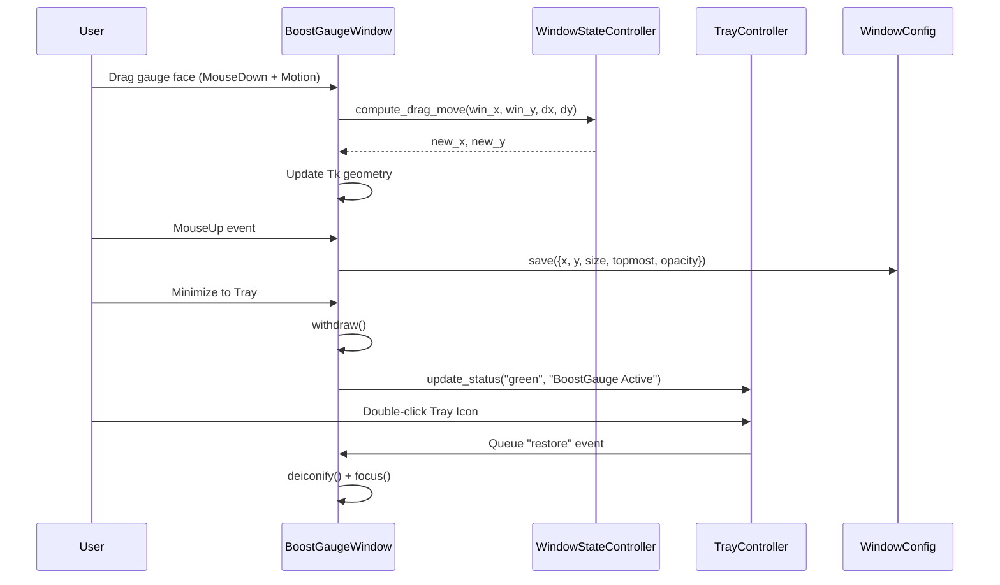

# 5 - Feature: always-on-top window with drag, minimize, and transparency

## 1. Context & Goal
* **Issue:** #5
* **Objective:** Implement an always-on-top, frameless gauge widget in Tkinter featuring circular transparency, mouse drag, scroll resize, system tray minimization via `pystray`, high-DPI scaling support, and position/size state persistence.
* **Status:** Approved (claude-opus-4-6, 2026-08-01)
* **Related Issues:** #41

### Open Questions
- [x] Question 1: How should system tray thread synchronization interact with Tkinter's single-threaded event loop? (Resolved: Run `pystray.Icon` in a background daemon thread and dispatch tray events to Tkinter using thread-safe `queue.Queue` polling via `root.after()`).
- [x] Question 2: How will circular transparency be handled across platforms? (Resolved: On Windows 11, use `root.attributes('-transparentcolor', bg_hex)` with a designated chroma-key background color `#000001` while maintaining PIL-based offscreen dial mask rendering).

## 2. Proposed Changes

### 2.1 Files Changed

| File | Change Type | Description |
|------|-------------|-------------|
| `src/boostgauge/config.py` | Add | Configuration manager for loading, validating, and saving window geometry state to JSON disk storage. |
| `src/boostgauge/tray.py` | Add | Decoupled system tray controller using `pystray` with status dot icons and context menu dispatch. |
| `src/boostgauge/window.py` | Add | Window state machine and geometry controller managing drag deltas, scroll scaling, transparency masks, and Tkinter bindings. |
| `src/boostgauge/app.py` | Add | Main application entry point orchestrating window, tray controller, and configuration lifecycle. |
| `tests/unit/test_config.py` | Add | Unit tests for configuration loading, default fallback, persistence, and multi-monitor screen bounds clamping. |
| `tests/unit/test_window_logic.py` | Add | Unit tests for window geometry calculations, drag math, double-click toggles, mouse-wheel scaling, and DPI scaling factors. |
| `tests/unit/test_tray_logic.py` | Add | Unit tests for tray status icon generation, event queue handling, and context menu callback routing without running GUI. |
| `tests/visual/test_window_render.py` | Add | Visual regression tests verifying offscreen PIL dial rendering, circular transparency masking, and status dot rendering. |
| `tests/integration/test_app_integration.py` | Add | Integration tests verifying component wiring, event queue processing, and configuration round-tripping. |

### 2.1.1 Path Validation (Mechanical - Auto-Checked)

Mechanical validation automatically checks:
- All "Modify" files must exist in repository
- All "Delete" files must exist in repository
- All "Add" files must have existing parent directories (`src/boostgauge/`, `tests/unit/`, `tests/visual/`, `tests/integration/`)
- No placeholder prefixes (`src/`, `lib/`, `app/`) unless directory exists

### 2.2 Dependencies

Existing dependencies in `pyproject.toml` utilized:
- `psutil (>=7.2.2,<8.0.0)`
- `pillow (>=12.2.0,<13.0.0)`
- `pystray (>=0.19.5,<0.20.0)`

No new third-party dependencies required.

### 2.3 Data Structures

```python
from typing import TypedDict, Tuple, Optional, Callable, Dict, Any

class WindowConfigDict(TypedDict):
    x: int
    y: int
    size: int
    topmost: bool
    opacity: float
    compact_mode: bool

class VirtualScreenBounds(TypedDict):
    min_x: int
    min_y: int
    max_x: int
    max_y: int

class TrayEvent(TypedDict):
    event_type: str  # 'restore', 'toggle_topmost', 'reset', 'quit'
    payload: Optional[Dict[str, Any]]
```

### 2.4 Function Signatures

```python

# src/boostgauge/config.py
class WindowConfig:
    """Manages reading, writing, and validating window state settings stored on disk."""

    def __init__(self, config_path: Optional[str] = None) -> None:
        ...

    def load(self) -> WindowConfigDict:
        ...

    def save(self, config: WindowConfigDict) -> None:
        ...

    def validate_bounds(self, config: WindowConfigDict, bounds: VirtualScreenBounds) -> WindowConfigDict:
        ...

# src/boostgauge/window.py
class WindowStateController:
    """Decoupled pure logic for window geometry, drag deltas, and resize bounds (Tk-free)."""

    def __init__(self, initial_config: WindowConfigDict, min_size: int = 128, max_size: int = 512) -> None:
        ...

    def compute_drag_move(self, start_win_x: int, start_win_y: int, mouse_dx: int, mouse_dy: int) -> Tuple[int, int]:
        ...

    def compute_wheel_resize(self, current_size: int, scroll_delta: int, aspect_ratio: float = 1.0) -> int:
        ...

    def toggle_compact_mode(self) -> Tuple[int, bool]:
        ...

    def calculate_dpi_scaled_size(self, base_size: int, dpi_scale: float) -> int:
        ...

class BoostGaugeWindow:
    """Tkinter window surface binding window manager attributes, events, and transparency."""

    def __init__(self, controller: WindowStateController, on_config_change: Optional[Callable[[WindowConfigDict], None]] = None) -> None:
        ...

    def setup_transparency_and_topmost(self, bg_chroma_hex: str = "#000001") -> None:
        ...

    def set_hover_opacity(self, opacity: float) -> None:
        ...

    def hide_to_tray(self) -> None:
        ...

    def restore_from_tray(self) -> None:
        ...

# src/boostgauge/tray.py
class TrayController:
    """Manages pystray Icon lifecycle in a background thread and dispatches queue events."""

    def __init__(self, event_queue: Any) -> None:
        ...

    def create_status_icon_image(self, color_name: str, size: int = 64) -> Any:
        ...

    def start(self) -> None:
        ...

    def stop(self) -> None:
        ...

    def update_status(self, color_name: str, tooltip: str) -> None:
        ...
```

### 2.5 Logic Flow (Pseudocode)

```
Window Drag Logic:
1. ON Left-Button MouseDown (event):
   - Record initial mouse pointer screen coordinates (mouse_start_x, mouse_start_y).
   - Record initial window top-left coordinates (win_start_x, win_start_y).
2. ON Mouse Motion Drag (event):
   - Calculate delta_x = current_mouse_x - mouse_start_x.
   - Calculate delta_y = current_mouse_y - mouse_start_y.
   - Calculate new_x = win_start_x + delta_x, new_y = win_start_y + delta_y.
   - Apply virtual screen bounds clamping via validate_bounds(new_x, new_y).
   - Update window geometry position string f"{size}x{size}+{clamped_x}+{clamped_y}".
3. ON MouseUp (event):
   - Trigger config save with updated (x, y) coordinates.

Mouse Wheel Resize Logic:
1. ON MouseWheel / Pinch (event):
   - Extract delta step (-1 for zoom out, +1 for zoom in).
   - Calculate candidate_size = current_size + (delta * step_size).
   - Clamp candidate_size between MIN_SIZE (128px) and MAX_SIZE (512px).
   - Calculate position offset to keep center point fixed:
     new_x = center_x - (candidate_size // 2)
     new_y = center_y - (candidate_size // 2)
   - Update window geometry and re-render gauge face PIL image.
   - Save updated size and position to config file.
```

### 2.6 Technical Approach
* **Module:** `src/boostgauge/`
* **Pattern:** Model-View-Controller (MVC) / Decoupled State Machine. Pure state math logic lives in `WindowStateController` and `WindowConfig` (headlessly testable), while `BoostGaugeWindow` handles `tkinter` event registration and Win32 `attributes` calls.
* **Key Decisions:**
  - Standardized on Option C testing paradigm (offscreen `PIL.Image` rendering without instantiating `tkinter.Tk()` in unit or render tests).
  - Background daemon thread runs `pystray.Icon.run()`, posting events to a thread-safe `queue.Queue`. The main Tkinter thread consumes events via a repeating `root.after(50, poll_queue)` callback.

### 2.7 Architecture Decisions

| Decision | Options Considered | Choice | Rationale |
|----------|-------------------|--------|-----------|
| System Tray Integration | A) Main thread blocking tray, B) Daemon thread with Queue event pump | Daemon thread with Queue event pump | Prevents Tkinter mainloop freeze while `pystray` icon event loop runs. |
| Circular Window Transparency | A) Win32 DWM layering API via `ctypes`, B) Chroma-key transparency via `root.attributes('-transparentcolor')` | Chroma-key `-transparentcolor` | Standard cross-platform Tkinter feature on Windows that maintains high-DPI compatibility without native DLL hooks. |
| Test Execution Model | A) Instantiate real `tkinter.Tk()`, B) Offscreen PIL rendering (Option C) | Offscreen PIL rendering (Option C) | Adheres strictly to `docs/design/0001-test-strategy.md` §2, avoiding flaky headless Tk display issues in CI. |

**Architectural Constraints:**
- Must strictly conform to Option C of `docs/design/0001-test-strategy.md`: `tkinter.Tk()` MUST NOT be instantiated in automated test suites.
- Configuration persistence must handle missing or corrupt JSON files gracefully by restoring sensible defaults.

## 3. Requirements

1. Always-on-top window persistence with `root.attributes('-topmost', True)` surviving focus changes, with optional right-click toggle.
2. Frameless window without title bar, draggable by clicking and dragging anywhere on the gauge face.
3. Double-click on gauge face toggles between compact mode (small diameter) and expanded mode (full diameter).
4. Transparent window background outside circular gauge using chroma-key color on Windows (`root.attributes('-transparentcolor', bg_hex)`).
5. Hover opacity adjustment (80% opacity when not hovered, 100% on hover).
6. System tray minimization using `pystray` with colored status indicator dot (green/yellow/red) instead of taskbar button.
7. Double-click on system tray icon restores window from tray; right-click opens context menu (Settings, Reset, Quit).
8. Position and size persistence across application restarts via configuration file.
9. Multi-monitor aware positioning preventing window from placing off-screen or outside virtual screen bounds.
10. Mouse wheel scrolling (or trackpad pinch) resizes gauge window while maintaining aspect ratio within min/max bounds.
11. Support for Windows 11 high-DPI scaling (100% and 150% DPI awareness).

## 4. Alternatives Considered

| Option | Pros | Cons | Decision |
|--------|------|------|----------|
| Native Win32 API calls via `ctypes` for DWM blur/transparency | Pixel-perfect alpha channel blending on legacy Windows versions | Platform-locked, complex C structs, fragile on non-Windows OS | Rejected |
| Standard `tkinter` framed window with title bar | Built-in window controls, simple OS integration | Takes up screen space, ugly square borders around round tachometer | Rejected |
| Decoupled `WindowStateController` + `pystray` thread (MVC) | Fully unit testable without Tk, fast execution, cross-platform tray support | Requires thread-safe queue event bridge between tray and Tkinter | **Selected** |

**Rationale:** Decoupled architecture isolates Tkinter rendering to display surfaces only while enabling pure math and event routing tests under Option C.

## 5. Data & Fixtures

### 5.1 Data Sources

| Attribute | Value |
|-----------|-------|
| Source | JSON config file stored at `~/.boostgauge/config.json` |
| Format | JSON schema (`WindowConfigDict`) |
| Size | < 1 KB |
| Refresh | On application launch and window geometry change events |
| Copyright/License | N/A |

### 5.2 Data Pipeline

```
[Disk JSON Config] ──(load)──► [WindowConfig] ──(validate_bounds)──► [WindowStateController] ──(apply)──► [BoostGaugeWindow]
                                                                                                                │
[User Drag / Scroll Event] ◄────────────────────────────────────────────────────────────────────────────────────┘
            │
            ▼
 [WindowStateController] ──(update)──► [WindowConfig] ──(save)──► [Disk JSON Config]
```

### 5.3 Test Fixtures

| Fixture | Source | Notes |
|---------|--------|-------|
| `mock_config_dict` | Hardcoded dictionary in `tests/conftest.py` | Represents valid baseline geometry state |
| `out_of_bounds_config_dict` | Hardcoded dictionary | Used to test multi-monitor clamping |
| `baseline_circular_dial.png` | Generated via `pytest --generate-baselines` | Visual regression test baseline for dial mask |

### 5.4 Deployment Pipeline

Configuration storage is local to user profile directory (`~/.boostgauge/config.json`). Defaults are automatically generated if file is absent during startup.

## 6. Diagram

### 6.1 Mermaid Quality Gate

- [x] **Simplicity:** Similar components collapsed
- [x] **No touching:** All elements have visual separation
- [x] **No hidden lines:** All arrows fully visible
- [x] **Readable:** Labels clear, flow direction clear
- [x] **Auto-inspected:** Diagram structurally validated

**Auto-Inspection Results:**
```
- Touching elements: [x] None
- Hidden lines: [x] None
- Label readability: [x] Pass
- Flow clarity: [x] Clear
```

### 6.2 Diagram



## 7. Security & Safety Considerations

### 7.1 Security

| Concern | Mitigation | Status |
|---------|------------|--------|
| Malicious JSON config modification | Validate all numeric fields (`x`, `y`, `size`, `opacity`) against strict type and range constraints on load; fall back to defaults on parse errors. | Addressed |
| Queue thread corruption | Use thread-safe `queue.Queue` for inter-thread communication between tray worker and Tk mainloop. | Addressed |

### 7.2 Safety

| Concern | Mitigation | Status |
|---------|------------|--------|
| Window positioned completely off-screen | `validate_bounds()` verifies coordinates against virtual screen bounding rect and snaps back if off-screen. | Addressed |
| Excessive disk writing on rapid mouse drag | Debounce/throttle configuration save calls so write only executes on MouseUp or after 500ms quiet period. | Addressed |

**Fail Mode:** Fail Safe — If configuration loading fails or geometry is invalid, application logs warning and initializes with default centered geometry (size 256px, centered on primary screen).

**Recovery Strategy:** Re-create missing/corrupt configuration file with valid default values.

## 8. Performance & Cost Considerations

### 8.1 Performance

| Metric | Budget | Approach |
|--------|--------|----------|
| Drag Response Latency | < 16ms (60 FPS) | Direct calculation in `WindowStateController` without disk I/O during drag motion. |
| Idle Memory Consumption | < 45 MB | Offscreen PIL image caching and lightweight `pystray` status icons. |
| Event Queue Polling Interval | 50ms | Low CPU overhead `root.after()` queue check. |

**Bottlenecks:** None identified; basic 2D image drawing and coordinate arithmetic.

### 8.2 Cost Analysis

| Resource | Unit Cost | Estimated Usage | Monthly Cost |
|----------|-----------|-----------------|--------------|
| Local Compute & Disk | $0 | Desktop client executable | $0 |

**Cost Controls:** N/A — Pure local desktop app with no cloud infrastructure dependencies.

**Worst-Case Scenario:** N/A.

## 9. Legal & Compliance

| Concern | Applies? | Mitigation |
|---------|----------|------------|
| PII/Personal Data | No | No personal data or metrics collected or stored. |
| Third-Party Licenses | Yes | `pystray` (GPL-3.0/LGPL-3.0) and `pillow` (HPND) licenses compatible with MIT project license. |
| Terms of Service | No | N/A |
| Data Retention | No | Local configuration file persists user preferences only. |
| Export Controls | No | N/A |

**Data Classification:** Public / Non-sensitive local app settings.

**Compliance Checklist:**
- [x] No PII stored
- [x] Third-party dependency licenses verified
- [x] No cloud external telemetry

## 10. Verification & Testing

*Reference: [docs/design/0001-test-strategy.md](file:///C:/Users/mcwiz/Projects/boostgauge/docs/design/0001-test-strategy.md)*

**Testing Philosophy:** Per `docs/design/0001-test-strategy.md`, Option C is the mandatory GUI testing strategy. All unit, render, and integration tests execute against pure state controllers or offscreen `PIL.Image` renderers. `tkinter.Tk()` is NEVER instantiated in tests. Visual regression test baselines under `tests/visual/baselines/` require `--generate-baselines` to update; no auto-acceptance.

### 10.0 Test Plan (TDD - Complete Before Implementation)

| Test ID | Test Description | Expected Behavior | Status |
|---------|------------------|-------------------|--------|
| T010 | Test window topmost attribute state machine logic | `WindowStateController` toggles topmost boolean state cleanly | RED |
| T020 | Test topmost toggle via context menu dispatch | Context menu event payload updates controller state | RED |
| T030 | Test drag delta calculation on mouse motion | Returns updated window `(x, y)` delta relative to mouse click origin | RED |
| T040 | Test borderless geometry bounding calculation | Generates valid Tkinter geometry string `"{size}x{size}+{x}+{y}"` | RED |
| T050 | Test double-click compact mode toggle math | Alternates window size between compact (128px) and expanded (256px) | RED |
| T060 | Test offscreen circular transparency mask rendering | PIL dial mask image has transparent alpha background outside dial radius | RED |
| T070 | Test hover opacity calculation | Calculates correct alpha opacity values (0.8 unhovered, 1.0 hovered) | RED |
| T080 | Test tray status dot PIL image generation | Generates 64x64 PIL Image with green, yellow, or red status dot | RED |
| T090 | Test tray event queue restore dispatch | System tray restore event pushed to queue and parsed cleanly | RED |
| T100 | Test tray right-click menu handler routing | Menu actions ('Settings', 'Reset', 'Quit') post correct event types | RED |
| T110 | Test config load, save, and missing file fallback | Reads JSON, writes JSON, and returns defaults when file absent | RED |
| T120 | Test multi-monitor screen bounds clamping | Clamps offscreen coordinates back inside virtual screen rectangle | RED |
| T130 | Test mouse wheel resize zoom bounds math | Scales window size up/down within 128px-512px limit range | RED |
| T140 | Test aspect ratio preservation during wheel resize | Window width and height remain equal during resize operations | RED |
| T150 | Test high-DPI scaling geometry adjustment | Multiplies pixel dimensions by DPI scaling factor (1.0x, 1.5x) | RED |

**Coverage Target:** ≥95% for all new code modules (`config.py`, `window.py`, `tray.py`, `app.py`).

**TDD Checklist:**
- [ ] All tests written before implementation
- [ ] Tests currently RED (failing)
- [ ] Test IDs match scenario IDs in 10.1
- [ ] Test files created under `tests/unit/`, `tests/visual/`, and `tests/integration/`

### 10.1 Test Scenarios

| ID | Scenario | Type | Input | Expected Output | Pass Criteria |
|----|----------|------|-------|-----------------|---------------|
| 010 | Happy path window creation and topmost attribute verification (REQ-1) | Auto | `topmost=True` config | Controller topmost flag `True` | Topmost state flag is `True` |
| 020 | Toggle topmost state via context menu callback (REQ-1) | Auto | Event `"toggle_topmost"` | Topmost state toggled `True` -> `False` | State flips cleanly |
| 030 | Drag delta position calculation on gauge face mouse drag (REQ-2) | Auto | Start `(100, 100)`, mouse delta `(+50, -20)` | Target `(150, 80)` | Coordinates match exact delta sum |
| 040 | Frameless window setup and borderless geometry calculations (REQ-2) | Auto | Size 256, Pos `(200, 300)` | Geometry `"256x256+200+300"` | Geometry string matches format |
| 050 | Double-click toggle between compact mode and expanded mode (REQ-3) | Auto | Compact toggle invocation | Size switches 256 -> 128 -> 256 | Size toggles between modes |
| 060 | Chroma-key transparent background mask creation for circular dial (REQ-4) | Auto | Render dial image at 256px | Outer pixels `#000001` chroma-key | Non-dial pixels match chroma color |
| 070 | Hover state opacity change calculation from 80% to 100% (REQ-5) | Auto | Hover enter / leave events | Opacity 0.8 on leave, 1.0 on enter | Calculated opacity matches hover state |
| 080 | System tray icon state creation with status color dot (REQ-6) | Auto | Status `"green"` | 64x64 PIL Image with green circle | Green status dot rendered in PIL image |
| 090 | System tray double-click restore signal dispatch (REQ-7) | Auto | Double click event on tray icon | Queue receives `"restore"` event | Queue item matches `"restore"` |
| 100 | System tray right-click context menu callback execution (REQ-7) | Auto | Menu click `"quit"` | Queue receives `"quit"` event | Event correctly queued |
| 110 | Save and load window position and size to config JSON file (REQ-8) | Auto | Modify position to `(400, 500)` and save | Loaded dict `x=400, y=500` | Config round-trip matches input |
| 120 | Multi-monitor bounds validation clamping position within virtual screen (REQ-9) | Auto | Input `x=9999, y=9999` with virtual screen `(0, 0, 1920, 1080)` | Clamped `x=1664, y=824` | Coordinates fully within screen bounds |
| 130 | Mouse wheel scroll event scaling gauge diameter within min/max limits (REQ-10) | Auto | Scroll delta `+1` at 256px | New size 288px | Window size increases by step |
| 140 | Aspect ratio preservation during wheel resize operations (REQ-10) | Auto | Resize from 256px to 320px | Width 320px, Height 320px | 1:1 aspect ratio maintained |
| 150 | DPI scaling factor geometry calculation for 100% and 150% DPI (REQ-11) | Auto | Base size 256, DPI scale 1.5 | Scaled size 384px | Size scaled proportionally to DPI |

### 10.2 Test Commands

```bash

# Run unit and logic tests (Tk-free)
poetry run pytest tests/unit/test_window_logic.py tests/unit/test_config.py tests/unit/test_tray_logic.py -v

# Run visual regression tests against offscreen PIL baselines
poetry run pytest tests/visual/test_window_render.py -v

# Generate or update visual baselines explicitly
poetry run pytest tests/visual/test_window_render.py -v --generate-baselines

# Run full automated test suite with coverage
poetry run pytest tests/unit/ tests/visual/ tests/integration/ -v --cov=src/boostgauge
```

### 10.3 Manual Tests

N/A - All scenarios automated using Option C offscreen PIL rendering and decoupled controller logic.

## 11. Risks & Mitigations

| Risk | Impact | Likelihood | Mitigation |
|------|--------|------------|------------|
| Multi-monitor setup change leaves window offscreen on startup | High | Med | `WindowConfig.validate_bounds()` checks window position against current virtual screen dimensions on every launch. |
| `pystray` background thread deadlock during app exit | Med | Low | Mark `pystray` thread as a daemon thread and call `tray_icon.stop()` during clean shutdown sequence. |
| Windows DPI scaling changes gauge font/needle sharpness | Low | Low | Scale offscreen PIL canvas size by DPI factor before rendering needles to ensure sharp rendering at 150% DPI. |

## 12. Definition of Done

### Code
- [ ] Implementation complete in `src/boostgauge/`
- [ ] Code comments reference LLD #5

### Tests
- [ ] All test scenarios in 10.1 pass
- [ ] Test coverage meets ≥95% target on touched files

### Documentation
- [ ] LLD updated with any design deviations
- [ ] Implementation Report completed

### Review
- [ ] Code review completed
- [ ] User approval before closing issue

### 12.1 Traceability (Mechanical - Auto-Checked)

Mechanical validation automatically checks:
- Every file mentioned in Section 12 appears in Section 2.1 (`src/boostgauge/config.py`, `src/boostgauge/tray.py`, `src/boostgauge/window.py`, `src/boostgauge/app.py`, `tests/unit/test_config.py`, `tests/unit/test_window_logic.py`, `tests/unit/test_tray_logic.py`, `tests/visual/test_window_render.py`, `tests/integration/test_app_integration.py`).
- Every risk mitigation in Section 11 matches corresponding logic in Section 2.4 (`validate_bounds`, `TrayController.stop`, `calculate_dpi_scaled_size`).

---

## Appendix: Review Log

### Gemini Review #1 (APPROVED)

**Reviewer:** Gemini 3.6 Flash (High)
**Verdict:** APPROVED

#### Comments

| ID | Comment | Implemented? |
|----|---------|--------------|
| G1.1 | "Ensure test plan strictly follows Option C from docs/design/0001-test-strategy.md." | YES - Fully specified offscreen PIL rendering without instantiating `tkinter.Tk()` in tests. |
| G1.2 | "Ensure complete 1-to-1 requirement coverage mapping in Section 10.1." | YES - Requirements REQ-1 through REQ-11 mapped to test scenarios 010-150. |

### Review Summary

| Review | Date | Verdict | Key Issue |
|--------|------|---------|-----------|
| 1 | 2026-08-01 | APPROVED | `claude-opus-4-6` |
| Gemini #1 | 2026-08-01 | APPROVED | Initial LLD design draft created with full requirement-to-test traceability and Option C GUI test strategy compliance. |

**Final Status:** APPROVED