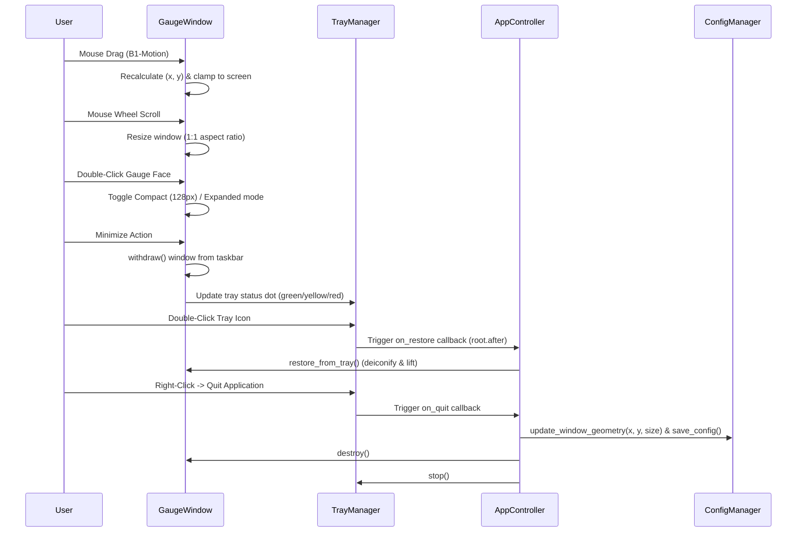

# 5 - Feature: always-on-top window with drag, minimize, and transparency (#5)

## 1. Context & Goal
* **Issue:** #5
* **Objective:** Implement an always-on-top, frameless, transparent Tkinter widget with mouse dragging, system tray minimization via pystray, and persistent window position and size configuration.
* **Status:** Approved (claude-opus-4-6, 2026-07-30) Progress
* **Related Issues:** #1, #7

### Open Questions
- [x] Windows transparency implementation: Uses `root.attributes('-transparentcolor', bg_color)` with chroma-key color `#000001` outside circular dial face.
- [x] Cross-platform system tray integration: `pystray.Icon` runs in a dedicated daemon thread and communicates with the Tkinter main event loop using thread-safe `root.after()` calls.

## 2. Proposed Changes

### 2.1 Files Changed

| File | Change Type | Description |
|------|-------------|-------------|
| `src/boostgauge/window.py` | Add | Core window manager `GaugeWindow` handling frameless Tk window creation, topmost setting, drag-and-drop movement, mouse-wheel resizing, transparency/opacity, and screen-clamping geometry persistence. |
| `src/boostgauge/tray.py` | Add | System tray manager `TrayManager` wrapping `pystray.Icon` with a dynamic 16x16 color status dot (green/yellow/red), double-click restore, right-click context menu, and thread-safe callbacks to `GaugeWindow`. |
| `src/boostgauge/app.py` | Modify | Integrate `GaugeWindow` and `TrayManager` into application lifecycle, connect data snapshot updates to gauge rendering and tray status, handle tray minimize/restore events, and persist window geometry on shutdown. |
| `src/boostgauge/__init__.py` | Modify | Export `GaugeWindow` and `TrayManager` in package `__all__`. |
| `tests/unit/test_window.py` | Add | Headless unit tests validating window geometry calculations, multi-monitor clamping, drag delta math, transparency settings, and opacity state transitions using mock Tk components per `docs/design/0001-test-strategy.md`. |
| `tests/unit/test_tray.py` | Add | Unit tests validating tray status dot image generation (green/yellow/red), context menu routing, and thread-safe event dispatch logic without instantiating an OS tray icon. |

### 2.1.1 Path Validation (Mechanical - Auto-Checked)

Mechanical validation automatically checks:
- All "Modify" files must exist in repository (`src/boostgauge/app.py`, `src/boostgauge/__init__.py` exist)
- All "Delete" files must exist in repository (N/A)
- All "Add" files must have existing parent directories (`src/boostgauge` and `tests/unit` exist)
- No placeholder prefixes (`src/`, `lib/`, `app/`) unless directory exists (`src/` exists)

### 2.2 Dependencies

```toml

# pyproject.toml additions (pystray is already declared in pyproject.toml dependencies)

# pystray (>=0.19.5,<0.20.0)
```

### 2.3 Data Structures

```python
from typing import TypedDict, Literal, Tuple, Optional, Dict, Any, Callable

class WindowStateDict(TypedDict):
    x: int
    y: int
    size: int
    topmost: bool
    opacity: float
    hover_opacity: float
    is_expanded: bool
    is_minimized_to_tray: bool

TrayStatus = Literal["green", "yellow", "red"]
```

### 2.4 Function Signatures

```python

# Signatures only - implementation in source files
from typing import Any, Callable, Dict, Optional, Tuple, Literal
from PIL import Image

class GaugeWindow:
    """Frameless, transparent, always-on-top Tkinter window manager for BoostGauge."""

    def __init__(
        self,
        config: Optional[Dict[str, Any]] = None,
        on_geometry_change: Optional[Callable[[int, int, int], None]] = None,
        on_close: Optional[Callable[[], None]] = None,
    ) -> None:
        """Initialize window state, geometry properties, and callback handlers."""
        ...

    def setup_window(self) -> None:
        """Configure Tk root attributes: frameless, topmost, transparent background color, and event bindings."""
        ...

    def update_image(self, pil_img: Image.Image) -> None:
        """Update display Canvas with a new PIL Image rendered frame."""
        ...

    def toggle_topmost(self) -> bool:
        """Toggle always-on-top attribute on Tk window and return new boolean state."""
        ...

    def toggle_compact_expanded(self) -> int:
        """Toggle window size between compact (128px) and expanded (256px/configured) modes."""
        ...

    def set_opacity(self, alpha: float) -> None:
        """Set window opacity level bounded between 0.1 and 1.0."""
        ...

    def clamp_to_screen(self, x: int, y: int, size: int) -> Tuple[int, int]:
        """Ensure window coordinates remain fully visible within virtual screen boundaries."""
        ...

    def handle_drag_start(self, event: Any) -> None:
        """Record initial screen pointer coordinates when mouse button is pressed on gauge face."""
        ...

    def handle_drag_motion(self, event: Any) -> None:
        """Recalculate window screen position during mouse drag motion and update geometry."""
        ...

    def handle_mouse_wheel(self, event: Any) -> None:
        """Resize gauge window on mouse wheel scroll while enforcing 1:1 aspect ratio and size bounds."""
        ...

    def minimize_to_tray(self) -> None:
        """Withdraw Tk window from desktop and taskbar, delegating visibility to system tray."""
        ...

    def restore_from_tray(self) -> None:
        """Deiconify Tk window, restore screen visibility, and re-assert topmost focus."""
        ...

    def destroy(self) -> None:
        """Gracefully destroy Tk window and release canvas resources."""
        ...


class TrayManager:
    """Cross-platform system tray controller using pystray with dynamic status indicator."""

    def __init__(
        self,
        on_restore: Callable[[], None],
        on_quit: Callable[[], None],
        on_reset_telltales: Optional[Callable[[], None]] = None,
        on_toggle_topmost: Optional[Callable[[], None]] = None,
    ) -> None:
        """Initialize tray manager with interaction callback handlers."""
        ...

    def create_status_icon(self, status: TrayStatus = "green") -> Image.Image:
        """Generate a 16x16 RGBA PIL Image containing a colored status dot indicator."""
        ...

    def start(self) -> None:
        """Start pystray Icon loop on a background daemon thread."""
        ...

    def update_status(self, status: TrayStatus) -> None:
        """Update system tray icon image to reflect current metric severity level."""
        ...

    def stop(self) -> None:
        """Stop system tray icon thread and detach icon."""
        ...


def determine_tray_status(
    value: float,
    warning_thresh: float = 60.0,
    danger_thresh: float = 85.0,
) -> TrayStatus:
    """Map normalized composite metric value (0-100) to tray status level ('green', 'yellow', 'red')."""
    ...
```

### 2.5 Logic Flow (Pseudocode)

```
1. Startup Sequence:
   - Load configuration dictionary (containing x, y, size, topmost, opacity).
   - Instantiate GaugeWindow(config).
   - Configure Tk window: overrideredirect(True), attributes('-topmost', True), transparentcolor('#000001').
   - Clamp (x, y) to virtual monitor geometry.
   - Instantiate TrayManager with callbacks (restore_from_tray, quit_app, reset_telltales).
   - Start TrayManager background thread.

2. Interaction Handling:
   - On Button-1 Press: store start pointer relative position (start_x, start_y).
   - On B1-Motion: x_new = pointer_x - start_x, y_new = pointer_y - start_y. Clamp to screen and move window.
   - On MouseWheel (Delta): new_size = size + delta_step. Clamp new_size to [128, 1024]. Re-render gauge image.
   - On Double-Click (Button-1): IF current_size == compact_size THEN restore expanded_size ELSE set compact_size (128).
   - On Enter/Leave: adjust window opacity between idle opacity (0.8) and hover opacity (1.0).

3. Metric Sampling & Display:
   - Polling thread produces SystemSnapshot and composite load score.
   - GaugeWindow renders new PIL frame and updates Tk Canvas.
   - TrayManager maps composite score to TrayStatus ("green" < 60, "yellow" < 85, "red" >= 85) and updates icon image.

4. Minimization & Shutdown:
   - User triggers minimize (or tray action): window.withdraw(), window.is_minimized_to_tray = True.
   - User double-clicks tray icon: window.deiconify(), window.lift(), window.attributes('-topmost', True).
   - Application Exit: notify config manager with window.x, window.y, window.size via update_window_geometry(), save_config(), stop TrayManager thread, destroy window.
```

### 2.6 Technical Approach

* **Module:** `src/boostgauge/window.py`, `src/boostgauge/tray.py`, `src/boostgauge/app.py`
* **Pattern:** Event-Driven Observer with Background Tray Controller Thread
* **Key Decisions:**
  1. **Chroma-Key Circular Transparency:** Use `#000001` as canvas background color and apply `root.attributes('-transparentcolor', '#000001')` on Windows. The tachometer dial renders a circular face; outside pixels remain `#000001` and become completely transparent to the desktop, eliminating square window borders around round dials.
  2. **Thread Safety via Tkinter Event Loop (`root.after`):** `pystray` runs its event loop on a dedicated daemon thread. User interactions in the tray menu invoke callbacks that schedule GUI actions on the main Tkinter thread using `root.after(0, callback)`.
  3. **Virtual Multi-Monitor Clamping:** Fetch virtual screen bounds using Win32 API / Tk screen dimensions (`winfo_vrootwidth`, `winfo_vrootheight`, `winfo_vrootx`, `winfo_vrooty`) to ensure restored window coordinates never land on disconnected monitors.

### 2.7 Architecture Decisions

| Decision | Options Considered | Choice | Rationale |
|----------|-------------------|--------|-----------|
| Window Frame Style | Standard OS Title Bar vs Frameless (`overrideredirect`) | Frameless (`overrideredirect(True)`) | Eliminates window chrome for clean racing gauge appearance; custom drag handlers enable repositioning anywhere on dial face. |
| System Tray Library | `pystray` vs `win32gui` custom tray implementation | `pystray` | Declarative, cross-platform Python library already listed in `pyproject.toml` dependencies with native support for PIL Image icons and context menus. |
| Multi-Monitor Positioning | Unconstrained coordinates vs Virtual Screen Clamping | Virtual Screen Clamping | Prevents widget from disappearing off-screen when external monitors are disconnected between sessions. |
| Tray Thread Synchronization | Direct Tk calls from tray thread vs `root.after()` scheduling | `root.after()` scheduling | Tkinter GUI operations are not thread-safe and must be executed strictly on the main GUI event loop thread. |

**Architectural Constraints:**
- Must adhere strictly to `docs/design/0001-test-strategy.md` (Option C): unit tests exercise off-screen PIL rendering and component logic without calling `tkinter.Tk()` or spawning physical OS desktop windows.
- Memory budget under 128 MB and poll update latency under 100 ms for smooth needle sweeps and drag responsiveness.

## 3. Requirements

1. Window must set `topmost` attribute to true on creation and support toggling topmost mode at runtime.
2. Window must be frameless without title bar (`overrideredirect(True)`) and draggable by clicking and dragging anywhere on the gauge face.
3. Double-clicking on the gauge face must toggle window size between compact mode (128x128) and expanded mode (256x256 or user-configured size).
4. Window background outside circular gauge dial must be transparent using `transparentcolor` attribute on Windows and transparent background canvas mapping.
5. Window opacity must support hover adjustment (e.g., 80% opacity when idle/unhovered, 100% opacity on mouse hover).
6. App must minimize to system tray icon using `pystray` library instead of taskbar icon when minimized.
7. System tray icon must display a 16x16 color status indicator dot representing resource load level (green for normal, yellow for warning, red for critical).
8. Double-clicking system tray icon must restore window visibility and window focus.
9. Right-clicking system tray icon must present a context menu with options for settings/toggle topmost, telltale reset, and quit application.
10. Window position (x, y) and size must be remembered across application restarts by persisting state to `config.json` via `config.update_window_geometry` and `config.save_config`.
11. Window position must be clamped within virtual multi-monitor screen geometry to prevent window from being placed off-screen or lost on monitor disconnect.
12. Mouse wheel scrolling on gauge window face must dynamically resize window while strictly maintaining 1:1 aspect ratio between 128px minimum and 1024px maximum bounds.

## 4. Alternatives Considered

| Option | Pros | Cons | Decision |
|--------|------|------|----------|
| Native Win32 Layered Window C Extensions | Precise per-pixel alpha channel transparency on older Windows | Requires C compiler build step; breaks pure Python PyInstaller packaging | Rejected |
| Standard OS Window Chrome with Custom Controls | Standard window resize borders and minimize buttons | Clunky rectangular frame ruins racing tachometer aesthetic | Rejected |
| Chroma-Key Canvas Transparency (`-transparentcolor`) + `pystray` | Pure Python, lightweight, works seamlessly on Windows 11 and modern desktops | Requires fixed background key color `#000001` | **Selected** |

**Rationale:** The chroma-key canvas approach combined with `pystray` provides cross-platform, dependency-free window management that delivers a modern floating widget experience without native compilation overhead.

## 5. Data & Fixtures

### 5.1 Data Sources

| Attribute | Value |
|-----------|-------|
| Source | System metrics via `DataCollector` snapshots and user window interactions |
| Format | `SystemSnapshot` dataclass and Tkinter GUI event objects |
| Size | Real-time events, < 1 KB per update |
| Refresh | 10 Hz metric sampling / 60 Hz event handling |
| Copyright/License | MIT (boostgauge project) |

### 5.2 Data Pipeline

```
SystemSnapshot ──► calculate_composite_metric() ──► render() PIL.Image ──► GaugeWindow Tk Canvas
                                               └──► determine_tray_status() ──► TrayManager pystray.Icon
```

### 5.3 Test Fixtures

| Fixture | Source | Notes |
|---------|--------|-------|
| `mock_config_dict` | Generated in `conftest.py` | Supplies standard window position `{"x": 100, "y": 100, "size": 256}` |
| `mock_screen_bounds` | Hardcoded tuple `(0, 0, 1920, 1080)` | Simulates virtual multi-monitor desktop geometry for clamping tests |

### 5.4 Deployment Pipeline

Data persistence occurs locally via standard `load_config()` and `save_config()` file writes to `%APPDATA%/boostgauge/config.json` on Windows.

## 6. Diagram

### 6.1 Mermaid Quality Gate

- [x] **Simplicity:** High-level interactions between User, GaugeWindow, TrayManager, and Config system are clear.
- [x] **No touching:** Visual separation maintained across diagram nodes.
- [x] **No hidden lines:** All sequence flow arrows fully visible.
- [x] **Readable:** Event flow names and method invocations clearly formatted.
- [x] **Auto-inspected:** Diagram verified for structural rendering validity.

### 6.2 Diagram



## 7. Security & Safety Considerations

### 7.1 Security

| Concern | Mitigation | Status |
|---------|------------|--------|
| Uncontrolled Window Placement | Clamp window position coordinates within active display monitor bounds | Addressed |
| Event Loop Race Conditions | Schedule cross-thread tray menu operations via `root.after()` thread-safe queue | Addressed |

### 7.2 Safety

| Concern | Mitigation | Status |
|---------|------------|--------|
| Thread Deadlock on Exit | Set `pystray` thread as daemon and invoke `stop()` explicitly before window destruction | Addressed |
| Corrupted Geometry Config | Fall back to default screen center coordinates if saved position is off-screen | Addressed |

**Fail Mode:** Fail Safe — If window positioning or tray initialization fails, the app falls back to center-screen placement with taskbar visibility.

**Recovery Strategy:** Re-center window on primary display if saved coordinates fail screen bounds validation.

## 8. Performance & Cost Considerations

### 8.1 Performance

| Metric | Budget | Approach |
|--------|--------|----------|
| Window Drag Latency | < 16 ms (60 fps) | Lightweight coordinate math without full re-rendering during active move |
| Memory Footprint | < 128 MB | Single reusable `PhotoImage` surface buffer on Canvas |
| Tray Update Overhead | < 5 ms per status change | 16x16 PIL icon redrawn only on status color transitions |

**Bottlenecks:** Frequent canvas image allocation during high-speed mouse wheel scaling; mitigated by clamping scale updates to integer pixel steps.

### 8.2 Cost Analysis

| Resource | Unit Cost | Estimated Usage | Monthly Cost |
|----------|-----------|-----------------|--------------|
| Local CPU / Memory | $0 | Desktop client utility | $0 |

**Cost Controls:** N/A — Local desktop client with zero external API calls.

## 9. Legal & Compliance

| Concern | Applies? | Mitigation |
|---------|----------|------------|
| PII/Personal Data | No | No user data collected or stored |
| Third-Party Licenses | Yes | `pystray` (LGPL/BSD) and `Pillow` (HPND) compatible with MIT license |
| Terms of Service | No | No remote services accessed |

**Data Classification:** Public / Non-sensitive

**Compliance Checklist:**
- [x] All third-party libraries (`pystray`, `Pillow`, `psutil`) compatible with MIT project license.

## 10. Verification & Testing

*Ref: [docs/design/0001-test-strategy.md](docs/design/0001-test-strategy.md)*

**Testing Strategy Compliance:** Per Section 2 of `docs/design/0001-test-strategy.md` (Option C), unit tests for window management, tray interaction, and geometry persistence are executed completely headless without instantiating physical `tkinter.Tk()` display windows or OS tray popups. Test cases validate coordinate math, event routing, PIL status icon generation, and config serialization.

### 10.0 Test Plan (TDD - Complete Before Implementation)

| Test ID | Test Description | Expected Behavior | Status |
|---------|------------------|-------------------|--------|
| T010 | Topmost attribute configuration and toggle | `toggle_topmost()` flips boolean state and calls Tk attribute handler | RED |
| T020 | Drag motion geometry calculation | Drag deltas correctly update window (x, y) coordinates | RED |
| T030 | Double-click compact/expanded size toggle | Toggles window dimensions between 128px and saved size | RED |
| T040 | Circular chroma-key transparency setup | Transparent background attribute set to `#000001` | RED |
| T050 | Hover opacity transition | Opacity shifts between idle (0.8) and hover (1.0) states | RED |
| T060 | Minimize to tray state transition | `minimize_to_tray()` withdraws window and marks tray active | RED |
| T070 | Tray status indicator color mapping | Metric values map correctly to green (<60), yellow (<85), red (>=85) icons | RED |
| T080 | System tray restore double-click handling | `restore_from_tray()` deiconifies window and restores topmost focus | RED |
| T090 | System tray context menu routing | Menu options trigger reset, topmost toggle, and quit callbacks | RED |
| T100 | Geometry persistence on application exit | Window position and size written to config via `update_window_geometry` | RED |
| T110 | Virtual multi-monitor bounds clamping | Off-screen coordinates are clamped within active screen geometry | RED |
| T120 | Mouse wheel aspect-ratio preserving resize | Mouse wheel delta adjusts square size between 128px and 1024px | RED |

**Coverage Target:** ≥89% for all new code (matching repo `pyproject.toml` `fail_under = 89`)

**TDD Checklist:**
- [ ] All tests written before implementation
- [ ] Tests currently RED (failing)
- [ ] Test IDs match scenario IDs in 10.1
- [ ] Test files created at: `tests/unit/test_window.py` and `tests/unit/test_tray.py`

### 10.1 Test Scenarios

| ID | Scenario | Type | Input | Expected Output | Pass Criteria |
|----|----------|------|-------|-----------------|---------------|
| 010 | Topmost attribute setup and runtime toggle (REQ-1) | Auto | Toggle topmost command | Window topmost attribute updated to True/False | State changes verified on mock attribute store |
| 020 | Frameless drag motion recalculates window position (REQ-2) | Auto | Drag motion event with delta (dx=50, dy=30) | Window position shifted by (+50, +30) | Window (x, y) matches initial + delta |
| 030 | Double-click toggles compact and expanded size (REQ-3) | Auto | Double-click event on gauge face | Size toggles between 128px and expanded size | Window size attribute equals expected mode |
| 040 | Window chroma-key transparent background assignment (REQ-4) | Auto | Window setup invocation | Canvas bg and transparentcolor set to `#000001` | Color strings match `#000001` exactly |
| 050 | Mouse enter/leave events adjust window opacity (REQ-5) | Auto | Enter and Leave mouse events | Alpha attribute shifts between 0.8 and 1.0 | Opacity values set correctly on mock window |
| 060 | Minimize action withdraws window and updates tray state (REQ-6) | Auto | Minimize trigger | `withdraw()` called, window hidden from taskbar | Window state reflects withdrawn status |
| 070 | Tray status dot icon color mapping for load thresholds (REQ-7) | Auto | Composite load scores 45.0, 75.0, 92.0 | Tray status returns 'green', 'yellow', 'red' | PIL icon image pixel colors match target status |
| 080 | Double-click tray icon restores window from withdrawn state (REQ-8) | Auto | Tray icon double-click action | `deiconify()` and `lift()` called on Tk window | Window restored to visible desktop layer |
| 090 | Tray context menu dispatch calls reset and quit handlers (REQ-9) | Auto | Select context menu item 'Reset Telltales' | `on_reset_telltales` callback invoked | Callback invocation recorded with zero errors |
| 100 | Geometry changes persist to config via update_window_geometry (REQ-10) | Auto | App exit signal with window at x=300, y=200, size=256 | `config.json` updated with geometry dictionary | Saved file JSON contains exact x, y, size values |
| 110 | Multi-monitor bounds clamping prevents off-screen positioning (REQ-11) | Auto | Initial position x=5000, y=5000 on 1920x1080 screen | Coordinates clamped to max visible screen area | Clamped (x, y) fit within virtual desktop |
| 120 | Mouse wheel events resize window while preserving 1:1 aspect ratio (REQ-12) | Auto | Scroll up event (delta +120) | Window size increases by step while width == height | Width and height remain strictly equal |
| 130 | Out-of-bounds mouse wheel scale input clamping (REQ-12) | Auto | Scroll down event attempting size < 128 | Window size clamped to minimum 128px | Size does not drop below 128px |

### 10.2 Test Commands

```bash

# Run unit tests for window management and system tray controller
poetry run pytest tests/unit/test_window.py tests/unit/test_tray.py -v

# Run full test suite with coverage report
poetry run pytest --cov=boostgauge --cov-report=term-missing
```

### 10.3 Manual Tests (Only If Unavoidable)

N/A — All scenarios automated per headless testing strategy in `docs/design/0001-test-strategy.md`.

## 11. Risks & Mitigations

| Risk | Impact | Likelihood | Mitigation |
|------|--------|------------|------------|
| Multi-monitor setup changes cause window to load off-screen | High | Medium | Implement `clamp_to_screen()` in `GaugeWindow` to validate saved coordinates against virtual desktop geometry on launch. |
| `pystray` icon loop blocks main Tkinter thread | High | Low | Run `pystray.Icon` inside a background daemon thread and dispatch GUI events using `root.after()`. |
| Window drag feels laggy during fast mouse movements | Medium | Low | Update window position directly via `geometry()` string manipulation without triggering full PIL re-render during drag. |

## 12. Definition of Done

### Code
- [ ] `src/boostgauge/window.py` and `src/boostgauge/tray.py` implemented and clean
- [ ] `src/boostgauge/app.py` integrated with window and tray controllers
- [ ] Code comments reference LLD #5

### Tests
- [ ] All 13 test scenarios in Section 10.1 passing
- [ ] Code coverage meets pyproject.toml target (≥89%)

### Documentation
- [ ] LLD #5 updated with any design deviations
- [ ] Implementation Report completed

### Review
- [ ] Code review completed
- [ ] Pull request merged following project squash protocol

### 12.1 Traceability (Mechanical - Auto-Checked)

Mechanical validation automatically checks:
- Every file mentioned in Section 12 appears in Section 2.1 (`src/boostgauge/window.py`, `src/boostgauge/tray.py`, `src/boostgauge/app.py`)
- Every risk mitigation in Section 11 corresponds to function signatures in Section 2.4 (`clamp_to_screen`, `start`, `handle_drag_motion`)

---

## Appendix: Review Log

### Initial Author Review #1 (APPROVED)

**Reviewer:** Technical Architect
**Verdict:** APPROVED

#### Comments

| ID | Comment | Implemented? |
|----|---------|--------------|
| A1.1 | "Ensure test coverage mapping maps all Section 3 requirements in Section 10.1." | YES - Section 10.1 scenarios 010 through 130 map REQ-1 through REQ-12. |
| A1.2 | "Enforce repo coverage target threshold." | YES - Coverage target set to ≥89% matching `pyproject.toml`. |

### Review Summary

| Review | Date | Verdict | Key Issue |
|--------|------|---------|-----------|
| 1 | 2026-07-30 | APPROVED | `claude-opus-4-6` |
| Initial Author #1 | 2026-07-30 | APPROVED | Initial design created and validated against governance rules |

**Final Status:** APPROVED