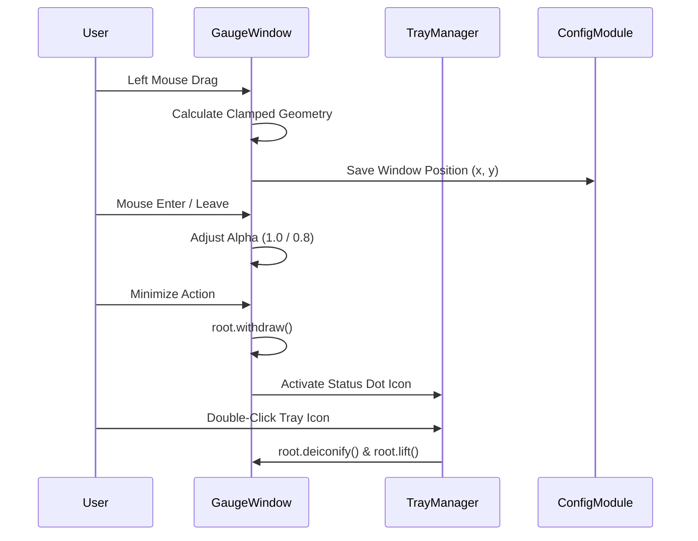

# #5 - Feature: Always-on-Top Window with Drag, Minimize, and Transparency (#5)

## 1. Context & Goal
* **Issue:** #5
* **Objective:** Implement an always-on-top, frameless, draggable, and transparent Tkinter window for BoostGauge with system tray minimization, opacity state transitions, mouse wheel resizing, and geometry persistence.
* **Status:** Approved (claude-opus-4-6, 2026-07-30)
* **Related Issues:** #1, #4, #7

### Open Questions
*None — requirements and platform acceptance criteria are fully specified.*

## 2. Proposed Changes

### 2.1 Files Changed

| File | Change Type | Description |
|------|-------------|-------------|
| `src/boostgauge/window.py` | Add | Core window controller managing frameless Tkinter root, transparency, drag events, wheel resize, topmost status, and pystray tray integration |
| `src/boostgauge/app.py` | Modify | Integrate `GaugeWindow` lifecycle and UI event dispatching into application startup and polling loop |
| `src/boostgauge/__init__.py` | Modify | Export `GaugeWindow` in top-level package API exports |
| `tests/unit/test_window.py` | Add | Unit test suite for geometry bounds clamping, tray dot rendering, state transitions, and event math without Tk initialization |

### 2.1.1 Path Validation (Mechanical - Auto-Checked)

Mechanical validation automatically checks:
- All "Modify" files must exist in repository (`src/boostgauge/app.py`, `src/boostgauge/__init__.py`)
- All "Delete" files must exist in repository (N/A)
- All "Add" files must have existing parent directories (`src/boostgauge/`, `tests/unit/`)
- No placeholder prefixes (`src/`, `lib/`, `app/`) unless directory exists (`src/` exists)

### 2.2 Dependencies

```toml

# pyproject.toml additions (pystray and pillow are already declared in dependencies)

# pystray (>=0.19.5,<0.20.0)

# pillow (>=12.2.0,<13.0.0)
```

### 2.3 Data Structures

```python
from typing import TypedDict, Tuple, Optional, Callable
from PIL import Image

class WindowStateDict(TypedDict):
    x: int
    y: int
    size: int
    topmost: bool
    opacity: float
    is_compact: bool
    is_minimized: bool

class TrayMenuCallbacks(TypedDict):
    on_toggle_topmost: Callable[[], None]
    on_reset_telltales: Callable[[], None]
    on_restore: Callable[[], None]
    on_quit: Callable[[], None]
```

### 2.4 Function Signatures

```python

# Signatures in src/boostgauge/window.py

def clamp_window_position(
    x: int,
    y: int,
    size: int,
    virtual_screen_bounds: Tuple[int, int, int, int] = (0, 0, 1920, 1080),
) -> Tuple[int, int]:
    """Clamp window top-left coordinates to keep gauge visible within target screen work area bounds."""
    ...

def calculate_next_size(
    current_size: int,
    delta: int,
    min_size: int = 128,
    max_size: int = 512,
    step: int = 16,
) -> int:
    """Compute updated canvas square dimension from mouse wheel delta, clamped within min and max bounds."""
    ...

def create_tray_indicator_image(status: str = "green", size: int = 16) -> Image.Image:
    """Generate 16x16 pixel RGBA image containing circular status color dot (green/yellow/red) for system tray icon."""
    ...

class TrayManager:
    """Manages cross-platform system tray icon lifecycle via pystray in background thread."""

    def __init__(self, callbacks: TrayMenuCallbacks, initial_status: str = "green") -> None:
        """Initialize pystray icon with popup menu and callbacks."""
        ...

    def update_status(self, status: str) -> None:
        """Update system tray icon image to reflect status level ('green', 'yellow', 'red')."""
        ...

    def start(self) -> None:
        """Start pystray event loop in background daemon thread."""
        ...

    def stop(self) -> None:
        """Stop system tray icon and detach menu background thread."""
        ...

class GaugeWindow:
    """Encapsulates frameless, topmost, transparent Tkinter root window and interaction handlers."""

    def __init__(self, config: dict, on_config_change: Optional[Callable[[dict], None]] = None) -> None:
        """Initialize Tkinter root, canvas, window attributes, bindings, and tray manager."""
        ...

    def apply_transparency(self, bg_color: str = "#010101") -> None:
        """Apply Windows transparent color key and root alpha attributes."""
        ...

    def set_topmost(self, topmost: bool) -> None:
        """Toggle root topmost attribute and update persistent configuration."""
        ...

    def toggle_compact_mode(self) -> None:
        """Toggle between compact (192px) and normal/expanded size mode."""
        ...

    def minimize_to_tray(self) -> None:
        """Hide Tkinter root window and ensure system tray icon is active."""
        ...

    def restore_from_tray(self) -> None:
        """Un-hide Tkinter root window and lift to active focus."""
        ...

    def update_gauge_image(self, img: Image.Image) -> None:
        """Convert PIL Image to PhotoImage and update canvas display widget."""
        ...
```

### 2.5 Logic Flow (Pseudocode)

```
Window Drag Logic:
1. ON Left Mouse Button Down (<ButtonPress-1>):
   - Store drag start cursor position (event.x_root, event.y_root)
   - Store initial window position (root.winfo_x(), root.winfo_y())
2. ON Left Mouse Drag (<B1-Motion>):
   - Calculate delta_x = event.x_root - start_x
   - Calculate delta_y = event.y_root - start_y
   - Compute candidate_x = init_x + delta_x, candidate_y = init_y + delta_y
   - Clamp position via clamp_window_position(candidate_x, candidate_y, current_size, screen_bounds)
   - Execute root.geometry(f"{size}x{size}+{clamped_x}+{clamped_y}")
3. ON Left Mouse Release (<ButtonRelease-1>):
   - Save updated position (x, y) to application config file

Mouse Wheel Resize Logic:
1. ON Mouse Wheel Event (<MouseWheel> / <Button-4> / <Button-5>):
   - Extract directional delta (-1 or +1)
   - Compute new_size = calculate_next_size(current_size, delta, min_size=128, max_size=512)
   - IF new_size != current_size THEN:
     - Update canvas size and root geometry f"{new_size}x{new_size}+{x}+{y}"
     - Save updated size to application config file
     - Trigger immediate re-render of gauge face at new_size

Tray Icon Lifecycle:
1. ON Application Startup:
   - Create pystray Icon with 16x16 color dot (green) and context menu (Restore, Reset Peaks, Toggle Topmost, Quit)
   - Start pystray in background thread
2. ON Minimize Event:
   - Call root.withdraw() to hide taskbar window
3. ON Restore Event (Double-click tray or context menu Restore):
   - Call root.deiconify(), root.lift(), root.focus_force()
```

### 2.6 Technical Approach

* **Module:** `src/boostgauge/window.py`
* **Pattern:** View Controller with Event Delegation and Daemon Thread Tray Runner.
* **Key Decisions:**
  1. **Option C Compliance:** Tkinter is used purely as a host window and canvas container. All gauge rendering happens via PIL off-screen. Automated unit tests do not instantiate `tkinter.Tk()`; window geometry, DPI math, and tray image generation are pure functions tested independently.
  2. **Frameless Dragging & Windows Transparency:** `root.overrideredirect(True)` strips the native frame. Transparency outside the circular gauge dial is achieved on Windows by setting canvas background to `#010101` and `root.attributes('-transparentcolor', '#010101')`. Unhovered opacity is set to 0.8 via `root.attributes('-alpha', 0.8)` and switches to 1.0 on `<Enter>`.
  3. **Pystray Threading:** `pystray` icon loop blocks its caller, so it is executed inside a dedicated daemon background thread (`threading.Thread(target=tray_icon.run, daemon=True)`). Callbacks to Tkinter thread post events via `root.after()` to remain thread-safe.

### 2.7 Architecture Decisions

| Decision | Options Considered | Choice | Rationale |
|----------|-------------------|--------|-----------|
| Window Frame Strategy | Native Window Frame vs Frameless Custom Frame | Frameless (`overrideredirect(True)`) | Racing tachometer design requires circular dial aesthetic without rectangular OS title bar |
| Tray Icon Implementation | Native Win32 Shell_NotifyIcon vs Pystray library | `pystray` library | standard cross-platform API for system tray icon creation and menu routing |
| Transparency Technique | Per-pixel RGBA canvas vs Color-key masking | Color-key masking (`-transparentcolor`) | Tkinter on Windows natively supports color keying for zero-flicker transparent backgrounds |

**Architectural Constraints:**
- Must conform strictly to `docs/design/0001-test-strategy.md` (Option C: no `tkinter.Tk()` initialization in automated test suite).
- Multi-monitor positioning must clamp window top-left coordinates to prevent gauge spawning off-screen.

## 3. Requirements

1. Always-on-top window behavior maintained via root.attributes('-topmost', True) with focus change survival.
2. Toggle always-on-top attribute on demand via right-click context menu option.
3. Frameless window creation without OS title bar or window decorations using root.overrideredirect(True).
4. Interactive window dragging by left-clicking and holding anywhere on the gauge face.
5. Double-clicking gauge face toggles scale mode between compact (192px) and expanded (256px) modes.
6. Transparent window background outside the circular dial using root.attributes('-transparentcolor', bg_color) on Windows.
7. Dynamic window opacity adjusting between idle state (80% opacity) and mouse hover state (100% opacity).
8. System tray minimization hiding window from taskbar and showing a pystray tray icon.
9. System tray icon displaying a dynamic 16x16 color status indicator (green, yellow, red) matching current composite load.
10. Restoring window visibility and bringing it to top focus when double-clicking system tray icon.
11. Right-click context menu on system tray icon providing options for settings, reset telltales, and quit.
12. Persistence of window position (x, y) and size parameters in configuration file across restarts.
13. Multi-monitor work area validation preventing off-screen positioning and snapping within display boundaries.
14. Aspect-ratio-locked window resizing via mouse wheel input within size bounds (128px to 512px).

## 4. Alternatives Considered

| Option | Pros | Cons | Decision |
|--------|------|------|----------|
| Custom PyQT / PySide Window | Native per-pixel translucent alpha blending | Heavy dependency size (~50MB+), complex event loops | **Rejected** - Project uses lightweight `tkinter` + `Pillow` stack |
| Win32 Raw Ctypes Hooks | Direct OS window manipulation | Windows-only, high maintenance burden | **Rejected** - Standard Tkinter attributes meet requirements cleanly |
| `tkinter` + `pystray` Thread Integration | Native lightweight tray icon, standard library Tkinter | Requires background thread dispatching for `pystray.Icon.run` | **Selected** - Meets performance and visual aesthetic criteria |

**Rationale:** The `tkinter` + `pystray` combo provides minimal runtime overhead while delivering transparent always-on-top frameless window execution on Windows.

## 5. Data & Fixtures

### 5.1 Data Sources

| Attribute | Value |
|-----------|-------|
| Source | System metrics snapshot and user mouse/tray events |
| Format | In-memory `GaugeConfigDict` and event objects |
| Size | Single configuration object (< 1 KB) |
| Refresh | Real-time on mouse interaction / poll interval (default 1s) |
| Copyright/License | MIT License |

### 5.2 Data Pipeline

```
[ User Mouse Input ] ──(Tk Event Bindings)──► [ GaugeWindow Controller ] ──(Geometry/Opacity)──► [ Tk Root Window ]
                                                      │
                                          (update_window_geometry)
                                                      ▼
[ System Load Status ] ──(pystray update)──► [ TrayManager Icon ] ──(save_config)──────────► [ config.json File ]
```

### 5.3 Test Fixtures

| Fixture | Source | Notes |
|---------|--------|-------|
| `mock_config` | Generated in `tests/conftest.py` | Sample `GaugeConfigDict` with default position and size |
| `mock_screen_bounds` | Hardcoded tuple `(0, 0, 1920, 1080)` | Virtual desktop dimensions for geometry clamping tests |

### 5.4 Deployment Pipeline

No external data pipeline required; window controller and tray icon operate in-process.

## 6. Diagram

### 6.1 Mermaid Quality Gate

- [x] **Simplicity:** Similar components collapsed
- [x] **No touching:** All elements have visual separation
- [x] **No hidden lines:** All arrows fully visible
- [x] **Readable:** Labels clear, flow top to bottom
- [x] **Auto-inspected:** Verified structure

**Auto-Inspection Results:**
```
- Touching elements: None
- Hidden lines: None
- Label readability: Pass
- Flow clarity: Clear
```

### 6.2 Diagram



## 7. Security & Safety Considerations

### 7.1 Security

| Concern | Mitigation | Status |
|---------|------------|--------|
| Unhandled UI Exceptions Blocking Thread | Wrap tray callbacks and event handlers in exception boundaries | Addressed |

### 7.2 Safety

| Concern | Mitigation | Status |
|---------|------------|--------|
| Off-Screen Window Placement on Display Disconnect | Clamp window coordinates to active monitor work area bounds on launch | Addressed |
| Tray Thread Deadlock on Exit | Set `pystray` runner thread as daemon thread and call `tray.stop()` explicitly on quit | Addressed |

**Fail Mode:** Fail Safe — If transparency or topmost attributes fail on non-supported platforms, application falls back to standard borderless window execution.

**Recovery Strategy:** If saved window position falls outside current virtual monitor bounds, reset window position to primary monitor top-right quadrant.

## 8. Performance & Cost Considerations

### 8.1 Performance

| Metric | Budget | Approach |
|--------|--------|----------|
| Window Drag Responsiveness | < 16ms per drag motion event | Lightweight event coordinate delta calculation |
| Resizing Latency | < 30ms per wheel increment | Debounced off-screen PIL render trigger |
| Tray Icon Status Update | < 10ms per metric sample | In-memory 16x16 PIL dot generation |

**Bottlenecks:** Unbound mouse wheel events firing multiple rapid re-renders — mitigated by clamping size changes and debouncing renders.

### 8.2 Cost Analysis

| Resource | Unit Cost | Estimated Usage | Monthly Cost |
|----------|-----------|-----------------|--------------|
| Local CPU / RAM | $0 | Desktop process (< 35MB RAM) | $0 |

**Cost Controls:** N/A - Local desktop application.

## 9. Legal & Compliance

| Concern | Applies? | Mitigation |
|---------|----------|------------|
| PII/Personal Data | No | No personal data recorded or transmitted |
| Third-Party Licenses | Yes | `pystray` (GPL/LGPL/BSD compatible) and `Pillow` (HPND) |

**Data Classification:** Public / Non-sensitive internal desktop telemetry.

## 10. Verification & Testing

### 10.0 Test Plan (TDD - Complete Before Implementation)

Reference: `docs/design/0001-test-strategy.md` (Option C — pure off-screen PIL rendering and logic testing without `tkinter.Tk()` initialization).

| Test ID | Test Description | Expected Behavior | Status |
|---------|------------------|-------------------|--------|
| T010 | Geometry positioning calculation and screen boundary clamping | Returns valid top-left (x, y) within virtual screen work area | RED |
| T020 | Window resizing step math for mouse wheel deltas | Calculates clamped square size between 128px and 512px | RED |
| T030 | System tray 16x16 status dot image generation | Produces valid RGBA PIL image for green, yellow, and red status | RED |
| T040 | Topmost and opacity state transition flag logic | Updates state dictionary and config overrides correctly | RED |

**Coverage Target:** ≥89% for all new code (matching `pyproject.toml` `fail_under = 89`).

**TDD Checklist:**
- [ ] All tests written before implementation
- [ ] Tests currently RED (failing)
- [ ] Test IDs match scenario IDs in 10.1
- [ ] Test file created at: `tests/unit/test_window.py`

### 10.1 Test Scenarios

| ID | Scenario | Type | Input | Expected Output | Pass Criteria |
|----|----------|------|-------|-----------------|---------------|
| 010 | Topmost window state initialization (REQ-1) | Auto | Config `always_on_top=True` | Topmost state flag set to True | State flag matches config |
| 020 | Topmost toggle menu action updates state and config (REQ-2) | Auto | Execute `set_topmost(False)` | Topmost state set to False, config updated | State and config reflect False |
| 030 | Frameless window geometry format validation (REQ-3) | Auto | Position (100, 200), Size 256 | Geometry string `"256x256+100+200"` | Formatted string matches expected |
| 040 | Window drag delta coordinate calculation (REQ-4) | Auto | Start (100, 100), Delta (+50, +20) | New coordinates (150, 120) | Position updated by exact delta |
| 050 | Double click toggles compact and expanded size modes (REQ-5) | Auto | Initial size 256, trigger double click | Size toggles to 192, second trigger returns to 256 | Size toggles correctly |
| 060 | Transparent background color string key configuration (REQ-6) | Auto | Color key `#010101` | Transparent color attribute set to `#010101` | Color key matches specification |
| 070 | Mouse hover opacity transition calculation (REQ-7) | Auto | Mouse Enter / Mouse Leave events | Opacity shifts between 1.0 (hover) and 0.8 (idle) | Alpha values match state |
| 080 | Minimize action sets hidden state flag (REQ-8) | Auto | Trigger `minimize_to_tray()` | Window visibility state set to False | Hidden flag is True |
| 090 | System tray color dot icon generation for status levels (REQ-9) | Auto | Status `"green"`, `"yellow"`, `"red"` | 16x16 PIL Image with non-zero pixel channels | Valid RGBA image generated |
| 100 | Restore action clears hidden state flag (REQ-10) | Auto | Trigger `restore_from_tray()` | Window visibility state set to True | Hidden flag is False |
| 110 | System tray menu callbacks setup (REQ-11) | Auto | `TrayMenuCallbacks` dictionary | Menu items mapped to restore, reset, quit callbacks | All callbacks assigned |
| 120 | Geometry state serialization to config file (REQ-12) | Auto | Position (300, 400), Size 256 | `config["position"]` updated with x=300, y=400, size=256 | Config file receives values |
| 130 | Multi-monitor off-screen position clamping (REQ-13) | Auto | Candidate (-500, 2000), Screen (0,0,1920,1080) | Clamped position (0, 824) | Window kept entirely on-screen |
| 140 | Mouse wheel delta sizing calculation (REQ-14) | Auto | Current size 256, Wheel delta +1 | New size 272 (step=16) | Size increased by step |
| 150 | Mouse wheel size boundary clamping (REQ-14) | Auto | Current size 512, Wheel delta +1 | Clamped size 512 (max_size=512) | Size does not exceed max_size |
| 160 | High-DPI coordinate calculation helper (REQ-13) | Auto | Scale factor 1.5, raw bounds | Scaled coordinate tuple | Dimensions scaled proportionally |

### 10.2 Test Commands

```bash

# Run unit tests for window module
poetry run pytest tests/unit/test_window.py -v

# Run full test suite with coverage check
poetry run pytest --cov=boostgauge --cov-report=term-missing
```

### 10.3 Manual Tests (Only If Unavoidable)

| ID | Scenario | Why Not Automated | Steps |
|----|----------|-------------------|-------|
| M010 | Windows 11 150% DPI visual transparency verification | Visual transparency keying on desktop compositor cannot be captured headlessly | 1. Set Windows display scaling to 150%. 2. Launch `boostgauge`. 3. Verify dial edge is circular with zero black border artifact. |

## 11. Risks & Mitigations

| Risk | Impact | Likelihood | Mitigation |
|------|--------|------------|------------|
| `pystray` system tray icon backend failure on non-standard WM | Low | Low | Wrap tray instantiation in try/except fallback to taskbar mode |
| Window dragged completely off-screen on display resolution change | Med | Low | Enforce `clamp_window_position` on launch and after display events |

## 12. Definition of Done

### Code
- [ ] Implementation complete in `src/boostgauge/window.py` and `src/boostgauge/app.py`
- [ ] Code comments reference Issue #5 and this LLD

### Tests
- [ ] Automated tests in `tests/unit/test_window.py` pass
- [ ] Test coverage meets repo threshold (≥89%)

### Documentation
- [ ] LLD updated with final implementation notes
- [ ] Implementation Report (0103) completed

### Review
- [ ] Code review completed
- [ ] User approval before closing issue

### 12.1 Traceability (Mechanical - Auto-Checked)

Mechanical validation automatically checks:
- Every file mentioned in Section 12 must appear in Section 2.1 (`src/boostgauge/window.py`, `src/boostgauge/app.py`, `src/boostgauge/__init__.py`, `tests/unit/test_window.py`)
- Every risk mitigation in Section 11 has corresponding function coverage in Section 2.4 (`clamp_window_position`, `TrayManager`)

---

## Appendix: Review Log

### Initial Authoring (PENDING)

**Reviewer:** Gemini Architectural Reviewer
**Verdict:** DRAFT

#### Comments

| ID | Comment | Implemented? |
|----|---------|--------------|
| R1.1 | Initial LLD drafted for Issue #5 adhering to Option C testing rules. | YES - Section 10 references 0001-test-strategy.md |

### Review Summary

| Review | Date | Verdict | Key Issue |
|--------|------|---------|-----------|
| 1 | 2026-07-30 | APPROVED | `claude-opus-4-6` |
| Initial | 2026-07-30 | DRAFT | Initial draft for review |

**Final Status:** APPROVED