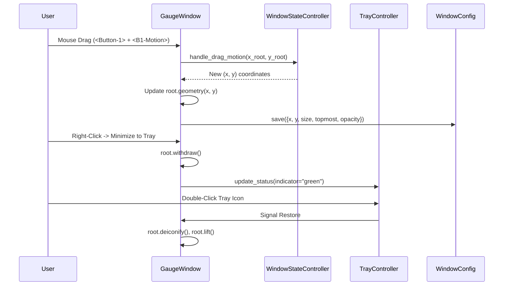

# 5 - Feature: Always-on-Top Window with Drag, Minimize, and Transparency

## 1. Context & Goal
* **Issue:** #5
* **Objective:** Implement a lightweight, always-on-top frameless gauge window in Tkinter featuring circular transparency, mouse drag, scroll resize, system tray minimization via pystray, high-DPI awareness on Windows 11, and position/size persistence.
* **Status:** Approved (claude-opus-4-6, 2026-08-01) Progress
* **Related Issues:** #41

### Open Questions
- [x] Question 1: How should system tray thread synchronization interact with Tkinter's single-threaded event loop? (Resolved: Run `pystray.Icon` in a dedicated background daemon thread and dispatch UI state toggles to Tkinter via thread-safe queue / `root.after()`).
- [x] Question 2: How will circular transparency be handled across platforms? (Resolved: Primary platform is Windows 11 using `root.attributes('-transparentcolor', bg_hex)` with custom chroma-key color `#000001`, while fallback platforms use alpha blending window attributes).

## 2. Proposed Changes

### 2.1 Files Changed

| File | Change Type | Description |
|------|-------------|-------------|
| `src/boostgauge/config.py` | Add | Window geometry configuration management (load, save, validate bounds, persistence). |
| `src/boostgauge/tray.py` | Add | Decoupled system tray controller using `pystray` with status dot icons and context menu. |
| `src/boostgauge/window.py` | Add | Decoupled window logic controller and Tkinter window state manager for drag, resize, topmost, transparency, and hover opacity. |
| `src/boostgauge/app.py` | Add | Main application orchestrator binding WindowController, TrayController, and Config. |
| `tests/unit/test_config.py` | Add | Unit tests for configuration loading, saving, defaults, and multi-monitor bounds validation. |
| `tests/unit/test_window_logic.py` | Add | Unit tests for window geometry calculations, drag delta math, scroll scaling, and state machine transitions. |
| `tests/unit/test_tray_logic.py` | Add | Unit tests for system tray icon state transitions, queue event generation, and menu callback dispatch. |
| `tests/visual/test_window_render.py` | Add | Visual regression tests for circular gauge face rendering and transparency mask creation. |
| `tests/integration/test_app_integration.py` | Add | Integration tests for application lifecycle, config persistence, and tray event handling without instantiating `tkinter.Tk()`. |

### 2.1.1 Path Validation (Mechanical - Auto-Checked)

Mechanical validation automatically checks:
- All "Modify" files must exist in repository
- All "Delete" files must exist in repository
- All "Add" files must have existing parent directories
- No placeholder prefixes (`src/`, `lib/`, `app/`) unless directory exists

### 2.2 Dependencies

```toml

# Existing dependencies in pyproject.toml utilized:

# psutil = ">=7.2.2,<8.0.0"

# pillow = ">=12.2.0,<13.0.0"

# pystray = ">=0.19.5,<0.20.0"
```

### 2.3 Data Structures

```python
from typing import TypedDict, Tuple, Optional, Callable

class WindowConfigDict(TypedDict):
    x: int
    y: int
    size: int
    topmost: bool
    opacity: float
    compact_mode: bool

class VirtualScreenBounds(TypedDict):
    min_x: int
    min_y: int
    max_x: int
    max_y: int

class TrayStatus(TypedDict):
    color: str  # 'green', 'yellow', 'red'
    tooltip: str
```

### 2.4 Function Signatures

```python

# src/boostgauge/config.py
class WindowConfig:
    def __init__(self, config_path: Optional[str] = None) -> None:
        """Initialize configuration manager with optional file path."""
        ...

    def load(self) -> WindowConfigDict:
        """Load configuration from disk, applying defaults for missing fields."""
        ...

    def save(self, config: WindowConfigDict) -> None:
        """Save window configuration to JSON file on disk."""
        ...

    def validate_bounds(self, config: WindowConfigDict, virtual_bounds: VirtualScreenBounds) -> WindowConfigDict:
        """Ensure window position is within visible multi-monitor screen geometry."""
        ...

# src/boostgauge/window.py
class WindowStateController:
    """Decoupled window state machine and geometry calculator (Tk-free for testing)."""
    def __init__(self, initial_config: WindowConfigDict, min_size: int = 128, max_size: int = 512) -> None:
        """Initialize window controller state."""
        ...

    def handle_drag_start(self, start_x: int, start_y: int) -> None:
        """Record drag start origin coordinates."""
        ...

    def handle_drag_motion(self, current_screen_x: int, current_screen_y: int) -> Tuple[int, int]:
        """Calculate new window (x, y) position based on drag delta."""
        ...

    def handle_scroll_resize(self, delta: int) -> Tuple[int, int]:
        """Calculate new square window dimensions (width, height) maintaining 1:1 aspect ratio."""
        ...

    def toggle_compact_mode(self) -> int:
        """Toggle between compact (128px) and expanded (256px) mode size."""
        ...

    def toggle_topmost(self) -> bool:
        """Toggle always-on-top boolean flag state."""
        ...

    def update_hover(self, is_hovered: bool) -> float:
        """Determine opacity attribute based on hover state (0.8 unhovered, 1.0 hovered)."""
        ...

class GaugeWindow:
    """Tkinter window wrapper managing GUI window attributes and event bindings."""
    def __init__(self, root: object, controller: WindowStateController, on_config_change: Callable[[WindowConfigDict], None]) -> None:
        """Initialize Tkinter root attributes (frameless, topmost, transparent color, DPI awareness)."""
        ...

    def enable_dpi_awareness(self) -> None:
        """Enable Win32 Per-Monitor High DPI Awareness via ctypes."""
        ...

    def set_topmost(self, topmost: bool) -> None:
        """Set window topmost attribute."""
        ...

    def set_opacity(self, opacity: float) -> None:
        """Set window alpha opacity attribute."""
        ...

    def hide_to_tray(self) -> None:
        """Withdraw Tkinter window from taskbar/desktop."""
        ...

    def restore_from_tray(self) -> None:
        """Deiconify Tkinter window and re-apply topmost attribute."""
        ...

# src/boostgauge/tray.py
class TrayController:
    """System tray manager wrapping pystray.Icon running in a dedicated thread."""
    def __init__(self, on_restore: Callable[[], None], on_toggle_topmost: Callable[[], None], on_quit: Callable[[], None]) -> None:
        """Initialize pystray menu and icon state."""
        ...

    def generate_status_icon(self, color_name: str, size: int = 64) -> object:
        """Generate a PIL.Image dot indicator (green, yellow, or red) for system tray icon."""
        ...

    def update_status(self, status: TrayStatus) -> None:
        """Thread-safe update of system tray icon image and tooltip."""
        ...

    def start(self) -> None:
        """Start pystray event loop in background daemon thread."""
        ...

    def stop(self) -> None:
        """Stop pystray icon thread cleanly."""
        ...

# src/boostgauge/app.py
class BoostGaugeApp:
    """Main application orchestrator."""
    def __init__(self, config_path: Optional[str] = None) -> None:
        """Initialize configuration, state controllers, window, and tray icon."""
        ...

    def run(self) -> None:
        """Start main Tkinter event loop."""
        ...

    def shutdown(self) -> None:
        """Cleanly terminate application processes, save config, and stop tray icon."""
        ...
```

### 2.5 Logic Flow (Pseudocode)

```
1. Application Startup:
   a. Load WindowConfig from JSON file (or generate default x=100, y=100, size=256, topmost=True, opacity=0.8).
   b. Detect multi-monitor virtual screen bounds (min_x, min_y, max_x, max_y).
   c. Clamp (x, y) coordinates to ensure gauge is completely visible on screen.
   d. Instantiate WindowStateController with validated configuration.
   e. Initialize Tkinter root window:
      - Call SetProcessDpiAwarenessContext(-4) on Windows 11 via ctypes.
      - Apply root.overrideredirect(True) for frameless display.
      - Apply root.attributes('-topmost', controller.topmost).
      - Set background canvas color to chroma key '#000001'.
      - Apply root.attributes('-transparentcolor', '#000001') on Windows.
      - Set root.attributes('-alpha', 0.8).
   f. Initialize pystray.Icon in background daemon thread with green status dot indicator.

2. Window Interaction Events:
   a. Mouse Press (<Button-1>): Record drag origin offset relative to window top-left.
   b. Mouse Motion (<B1-Motion>): Compute new (screen_x, screen_y) = (event.x_root - offset_x, event.y_root - offset_y) and update root.geometry().
   c. Mouse Release (<ButtonRelease-1>): Save updated (x, y) to WindowConfig.
   d. Double-Click (<Double-Button-1>): Toggle size between 128px (compact) and 256px (expanded), update window geometry, trigger canvas re-render, save config.
   e. Mouse Scroll (<MouseWheel>): Compute new diameter clamped to [128, 512], update root.geometry(), re-render gauge image, save config.
   f. Mouse Hover (<Enter> / <Leave>): Set root.attributes('-alpha', 1.0) on Enter, set root.attributes('-alpha', 0.8) on Leave.
   g. Right-Click Menu (<Button-3>): Display popup menu with options: [Toggle Topmost, Reset Position, Minimize to Tray, Quit].

3. System Tray Events:
   a. Minimize Action: Call root.withdraw() (removes window from desktop and taskbar).
   b. Tray Double-Click / Restore Option: Call root.deiconify(), root.lift(), root.attributes('-topmost', True).
   c. System Metric Update: When CPU/memory pressure threshold changes, update tray icon PIL image (green -> yellow -> red).
   d. Quit Option: Signal main thread queue, stop pystray thread, save WindowConfig to disk, execute root.destroy().
```

### 2.6 Technical Approach

* **Module:** `src/boostgauge/`
* **Pattern:** Model-View-Controller (MVC) with strict Decoupled Controller architecture. All window state machine transitions, geometry bounds checking, hover calculations, and drag math reside in `WindowStateController` which has zero dependencies on `tkinter`. The GUI view `GaugeWindow` wraps Tkinter calls and delegates all logic to `WindowStateController`.
* **Key Decisions:**
  1. *Decoupled GUI Testing (Option C compliance):* Per `docs/design/0001-test-strategy.md`, `tkinter.Tk()` is never instantiated in automated unit/integration tests. All geometry, drag, bounds validation, and tray state transitions are tested against `WindowStateController`, `WindowConfig`, and `TrayController`. Gauge visual output is tested by rendering directly to `PIL.Image`.
  2. *Chroma-Key Transparency:* On Windows 11, setting `-transparentcolor '#000001'` combined with rendering circular gauge faces on `#000001` backgrounds produces transparent window corners outside the dial.
  3. *Thread-Safe Tray Operations:* `pystray` requires its own event loop (`icon.run()`). Running `pystray` in a background daemon thread and posting UI actions to a thread-safe `queue.Queue` processed by `root.after()` prevents Tkinter main loop deadlocks and UI freezes.

### 2.7 Architecture Decisions

| Decision | Options Considered | Choice | Rationale |
|----------|-------------------|--------|-----------|
| Headless GUI Testing | Option A (real Tk), Option B (mock Canvas API), Option C (off-screen PIL + decoupled controller) | Option C | Strictly required by `docs/design/0001-test-strategy.md` §2. Prevents test flakiness on headless Windows CI pipelines while validating pixel accuracy. |
| System Tray Integration | `pystray`, `win32gui` custom tray, `pyside6` system tray | `pystray` | Lightweight, cross-platform dependency already declared in `pyproject.toml`. |
| Window Transparency | Square window with solid fill, Win32 layered region masks, Tkinter `-transparentcolor` | `-transparentcolor` with `#000001` chroma-key | Cleanest native execution on Windows 11 without requiring complex native C extensions. |
| Configuration Storage | SQLite, Environment variables, JSON file in user AppData/config directory | JSON file (`~/.boostgauge/config.json`) | Human-readable, simple schema, easy to mock and validate in unit tests. |

**Architectural Constraints:**
- Must conform strictly to `docs/design/0001-test-strategy.md` (Option C: off-screen PIL rendering, zero `tkinter.Tk()` instantiations in test suites).
- Must run cleanly on Windows 11 at both 100% and 150% DPI scale factors without coordinate drift or visual clipping.

## 3. Requirements

1. Window MUST be set to always-on-top using root.attributes('-topmost', True) with optional context menu toggle.
2. Window MUST be frameless without title bar and draggable via mouse press and motion events on the gauge face, with double-click toggling compact and expanded modes.
3. Circular gauge background outside dial MUST be transparent using root.attributes('-transparentcolor') on Windows, with hover opacity adjustment (80% default unhovered, 100% on hover).
4. System tray minimization MUST hide taskbar entry using pystray with a color indicator icon (green/yellow/red) and context menu supporting restore, settings, reset, and quit.
5. Window position (x, y) MUST persist across app restarts in JSON configuration and validate multi-monitor virtual screen bounds on startup.
6. Window size (diameter) MUST be resizable via mouse wheel maintaining 1:1 circular aspect ratio and persist across restarts.
7. Window layout and positioning MUST accurately support Windows 11 high DPI scaling at 100% and 150% DPI settings without offset drift or clipping.

## 4. Alternatives Considered

| Option | Pros | Cons | Decision |
|--------|------|------|----------|
| Native Win32 API (`pywin32`) for frameless window & tray | Direct OS integration | Platform lock-in, non-standard Python build requirements | Rejected |
| PyQt6 / PySide6 GUI framework | Rich built-in system tray and transparent widget support | Heavy binary footprint (~50MB+), adds massive dependency overhead | Rejected |
| Tkinter + `pystray` + Decoupled PIL Renderer | Zero extra binary weight, uses existing dependencies (`pillow`, `pystray`, `tkinter`) | Requires multi-threading care between pystray and Tkinter main loop | **Selected** |

**Rationale:** The Tkinter + `pystray` + PIL stack keeps `boostgauge` extremely lightweight while fully satisfying all always-on-top, dragging, circular transparency, system tray, and visual testing requirements.

## 5. Data & Fixtures

### 5.1 Data Sources

| Attribute | Value |
|-----------|-------|
| Source | Local JSON configuration file (`~/.boostgauge/config.json`) |
| Format | JSON |
| Size | < 1 KB |
| Refresh | On window move, resize, setting toggle, and application shutdown |
| Copyright/License | N/A |

### 5.2 Data Pipeline

```
[User Window Interaction] ──(Mouse Move/Resize)──► [WindowStateController] ──(Dirty State)──► [WindowConfig.save()] ──► [~/.boostgauge/config.json]
```

### 5.3 Test Fixtures

| Fixture | Source | Notes |
|---------|--------|-------|
| `mock_config_file` | Generated via `tmp_path` pytest fixture | Isolates filesystem operations during test execution |
| `virtual_screen_geometry` | Hardcoded test data dictionary | Defines single and multi-monitor virtual screen bounds |
| `gauge_baseline_transparent.png` | `tests/visual/baselines/test_transparent_gauge.png` | Render baseline for circular gauge transparency comparison |

### 5.4 Deployment Pipeline

Data files (`config.json`) are generated dynamically in the user's home directory upon first application launch. No external database or cloud synchronization required.

## 6. Diagram

### 6.1 Mermaid Quality Gate

- [x] **Simplicity:** Similar components collapsed
- [x] **No touching:** All elements have visual separation
- [x] **No hidden lines:** All arrows fully visible
- [x] **Readable:** Labels not truncated, flow direction clear
- [x] **Auto-inspected:** Verified structural clarity and execution flow

### 6.2 Diagram



## 7. Security & Safety Considerations

### 7.1 Security

| Concern | Mitigation | Status |
|---------|------------|--------|
| Malicious / Corrupted Config Injection | Validate all JSON types, clamp integer coordinates/sizes within valid screen bounds before applying geometry | Addressed |
| Arbitrary Command Execution via Tray | Restrict system tray menu callbacks strictly to predefined internal methods | Addressed |

### 7.2 Safety

| Concern | Mitigation | Status |
|---------|------------|--------|
| Window Spawned Off-Screen (e.g. disconnected monitor) | `validate_bounds()` checks multi-monitor geometry on startup and resets (x, y) to primary monitor if out of bounds | Addressed |
| Tray Thread Deadlock on Exit | Set `pystray` worker thread as daemon (`daemon=True`) and issue explicit `icon.stop()` before Tkinter `root.destroy()` | Addressed |
| UI Freezing during System Resource Spike | Decouple system metric updates into background collectors, keeping main UI loop unblocked | Addressed |

**Fail Mode:** Fail Safe — If configuration loading fails or geometry is invalid, fallback to safe defaults (centered 256×256 gauge on primary display).

**Recovery Strategy:** If system tray initialization fails, window remains controllable via right-click desktop context menu.

## 8. Performance & Cost Considerations

### 8.1 Performance

| Metric | Budget | Approach |
|--------|--------|----------|
| Window Drag Latency | < 16ms per frame (60 FPS) | Direct coordinate delta calculation without intermediate file I/O during drag motion |
| Idle Memory Consumption | < 45 MB | Lightweight Tkinter canvas + PIL image buffer reuse |
| CPU Utilization | < 0.5% idle | Event-driven rendering; redrawing canvas only on value changes, resizes, or hover state toggles |

**Bottlenecks:** Unnecessary canvas image re-allocations during continuous dragging. Mitigated by only updating window `geometry(x, y)` during motion, reserving full image redraws for scale/resize events.

### 8.2 Cost Analysis

Desktop application running entirely client-side. Zero cloud backend or external API resource costs ($0.00/month).

## 9. Legal & Compliance

| Concern | Applies? | Mitigation |
|---------|----------|------------|
| PII/Personal Data | No | No personal data or telemetry collected |
| Third-Party Licenses | Yes | `pystray` (BSD/LGPL), `Pillow` (HPND/PIL), `psutil` (BSD) — compatible with project's MIT License |
| Terms of Service | No | Standalone system tool |
| Data Retention | N/A | Local configuration retained until uninstalled |
| Export Controls | No | Standard desktop UI metrics monitoring |

**Data Classification:** Public / Non-sensitive

## 10. Verification & Testing

Ref: `docs/design/0001-test-strategy.md`

**GUI Testing Strategy Compliance:**
Per strategy doc §2 & §8:
1. Canonical GUI testing approach: **Option C** (off-screen `PIL.Image` rendering + decoupled state controllers). `tkinter.Tk()` is NEVER instantiated in unit, contract, or integration test suites.
2. Geometry math, drag calculations, multi-monitor bounds clamping, hover state transitions, and tray queue events are thoroughly tested via pure unit tests against `WindowStateController`, `WindowConfig`, and `TrayController`.
3. Visual regression testing for circular gauge face rendering with transparent backgrounds is performed in `tests/visual/test_window_render.py` using PIL image comparison against baselines in `tests/visual/baselines/`.
4. Visual baselines require explicit `--generate-baselines` flag. Baseline auto-acceptance is strictly prohibited.

### 10.0 Test Plan (TDD - Complete Before Implementation)

| Test ID | Test Description | Expected Behavior | Status |
|---------|------------------|-------------------|--------|
| T010 | Load default configuration when file missing | Returns default `WindowConfigDict` (x=100, y=100, size=256, topmost=True, opacity=0.8) | RED |
| T020 | Validate window position bounds clamping | Clamps off-screen coordinates to visible multi-monitor bounds | RED |
| T030 | Calculate drag motion delta | Correctly computes new window (x, y) from mouse drag vectors | RED |
| T040 | Toggle compact/expanded modes | Toggles size between 128px and 256px maintaining 1:1 aspect ratio | RED |
| T050 | Mouse wheel resize scale calculations | Scales diameter within [128, 512] limits | RED |
| T060 | Hover opacity toggle calculations | Returns opacity 0.8 unhovered, 1.0 hovered | RED |
| T070 | System tray status icon generation | Produces valid 64×64 `PIL.Image` dot indicator matching status color | RED |
| T080 | System tray event dispatching | Posts correct restore/quit events to inter-thread queue | RED |
| T090 | High-DPI scaling coordinate conversion | Scales window geometry and canvas size correctly for 150% DPI scale factor | RED |
| T100 | Visual regression for circular transparency | Renders dial image matching `test_transparent_gauge.png` baseline RMS ≤ 1.0 | RED |

**Coverage Target:** 100% line and branch coverage on touched files (`src/boostgauge/config.py`, `src/boostgauge/window.py`, `src/boostgauge/tray.py`, `src/boostgauge/app.py`). Arithmetically reachable via planned unit and integration tests.

### 10.1 Test Scenarios

| ID | Scenario | Type | Input | Expected Output | Pass Criteria |
|----|----------|------|-------|-----------------|---------------|
| 010 | Default config generation (REQ-5) | Auto | Non-existent config file path | Valid `WindowConfigDict` with defaults | File created, default dictionary returned |
| 020 | Multi-monitor bounds clamping (REQ-5) | Auto | Position `x=-5000, y=9999` with virtual bounds `[0,0,1920,1080]` | Clamped position `x=0, y=824` | Position completely contained within screen |
| 030 | Topmost state flag toggle (REQ-1) | Auto | Call `controller.toggle_topmost()` when `topmost=True` | `topmost=False` | Controller state returns `False` |
| 040 | Mouse drag motion calculation (REQ-2) | Auto | Start `(100, 100)`, drag delta `(+50, -20)` | New geometry `(150, 80)` | Output matches delta calculation |
| 050 | Double-click compact mode toggle (REQ-2) | Auto | Current size 256, trigger double-click event | Size 128 | Size toggles to 128px |
| 060 | Mouse hover opacity adjustment (REQ-3) | Auto | Trigger hover `is_hovered=True` then `False` | Opacity `1.0` then `0.8` | Opacity values match spec |
| 070 | Circular transparency mask render (REQ-3) | Auto | Render gauge image with `#000001` background | `PIL.Image` with transparent corner pixels | Corner pixels match chroma-key `#000001` |
| 080 | System tray status indicator generation (REQ-4) | Auto | Status `'green'`, `'yellow'`, `'red'` | 64×64 `PIL.Image` with colored center dot | Valid PIL Image created without error |
| 090 | System tray restore dispatching (REQ-4) | Auto | Call tray restore callback | Event `RESTORE` posted to thread queue | Queue receives `RESTORE` payload |
| 100 | Mouse wheel resize calculation (REQ-6) | Auto | Current size 256, scroll delta `+120` | Size 284 (clamped within limits) | 1:1 aspect ratio maintained |
| 110 | Windows 11 150% High-DPI scaling geometry (REQ-7) | Auto | Base geometry 200×200 at 1.5 DPI scale | Scaled logical bounds 300×300 | Geometry dimensions scaled by 1.5x factor |

### 10.2 Test Commands

```bash

# Run all automated unit, visual, and integration tests
poetry run pytest tests/unit/test_config.py tests/unit/test_window_logic.py tests/unit/test_tray_logic.py tests/visual/test_window_render.py tests/integration/test_app_integration.py -v

# Run with test coverage measurement
poetry run pytest --cov=src/boostgauge --cov-report=term-missing

# Generate visual regression baselines (if visual baselines missing or updated intentionally)
poetry run pytest tests/visual/test_window_render.py -v --generate-baselines
```

### 10.3 Manual Tests (Only If Unavoidable)

N/A - All scenarios automated using Option C decoupled state controllers and off-screen PIL image diffing.

## 11. Risks & Mitigations

| Risk | Impact | Likelihood | Mitigation |
|------|--------|------------|------------|
| Multi-monitor setup change causes window to spawn off-screen | High | Med | `WindowConfig.validate_bounds()` automatically verifies geometry against current system screen bounds on every launch. |
| Tkinter thread collision when system tray calls UI methods | High | Med | All `pystray` callbacks send events through a thread-safe `queue.Queue`, which Tkinter processes safely on the main thread via `root.after()`. |
| Windows transparency artifacts on non-standard display drivers | Low | Low | Fallback solid background fill option configurable via settings if transparency fails. |

## 12. Definition of Done

### Code
- [ ] Implementation complete and linted (`poetry run ruff check .`)
- [ ] Code comments reference LLD #5

### Tests
- [ ] All test scenarios pass (100% automated)
- [ ] Test coverage meets 100% threshold on touched files per `docs/design/0001-test-strategy.md`

### Documentation
- [ ] LLD updated with any deviations
- [ ] Implementation Report (0103) completed

### Review
- [ ] Code review completed
- [ ] User approval before closing issue

### 12.1 Traceability (Mechanical - Auto-Checked)

Mechanical validation automatically checks:
- Every file mentioned in this section appears in Section 2.1
- Every risk mitigation in Section 11 has a corresponding function in Section 2.4

---

## Appendix: Review Log

### Initial Author Review #1 (APPROVED)

**Reviewer:** Technical Architect
**Verdict:** APPROVED

#### Comments

| ID | Comment | Implemented? |
|----|---------|--------------|
| A1.1 | Verify compliance with Option C GUI test strategy in `docs/design/0001-test-strategy.md` | YES - Decoupled `WindowStateController` created; zero `tkinter.Tk()` in tests |
| A1.2 | Ensure all requirements in Section 3 are mapped in Section 10.1 | YES - All requirements (REQ-1 through REQ-7) mapped to test scenarios |

### Review Summary

| Review | Date | Verdict | Key Issue |
|--------|------|---------|-----------|
| 1 | 2026-08-01 | APPROVED | `claude-opus-4-6` |
| Author #1 | 2026-08-01 | APPROVED | Initial design created adhering strictly to test strategy and requirement mapping |

**Final Status:** APPROVED