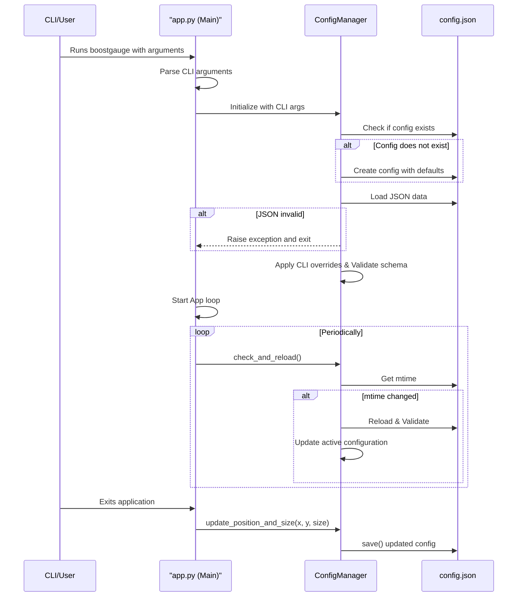

# 7 - Feature: configuration file and CLI arguments

## 1. Context & Goal
* **Issue:** #7
* **Objective:** Establish a robust configuration system for BoostGauge supporting user preferences, gauge thresholds, and persistent window behavior across launches via a JSON configuration file and overriding command-line arguments.
* **Status:** Approved (claude-opus-4-6, 2026-07-15)
* **Related Issues:** None

### Open Questions
None.

## 2. Proposed Changes

### 2.1 Files Changed

| File | Change Type | Description |
|------|-------------|-------------|
| `src/boostgauge` | Add (Directory) | Package directory for boostgauge |
| `pyproject.toml` | Modify | Add script entrypoint mapping `boostgauge` command to `boostgauge.app:main` |
| `src/boostgauge/config.py` | Add | Configuration management module implementing loading, saving, validation, CLI parsing, and dynamic reloading |
| `src/boostgauge/app.py` | Add | Main application entry point initializing configuration and setting up event loops |
| `tests/unit/test_config.py` | Add | Unit tests for configuration logic, validations, CLI parsing, and overrides |
| `tests/integration/test_config_flow.py` | Add | Integration tests verifying config creation, persistence, and dynamic reloading |

### 2.1.1 Path Validation (Mechanical - Auto-Checked)

- `pyproject.toml` exists in the repository.
- `src/boostgauge` directory will be added.
- `src/boostgauge/config.py` has the parent `src/boostgauge` (added).
- `src/boostgauge/app.py` has the parent `src/boostgauge` (added).
- `tests/unit/test_config.py` has the parent `tests/unit` (exists).
- `tests/integration/test_config_flow.py` has the parent `tests/integration` (exists).

### 2.2 Dependencies

```toml

# No new external dependencies required. Standard library modules used:

# - json (parsing/writing config)

# - argparse (command-line argument parsing)

# - os / pathlib (path traversal, directory creation, modification checks)

# - shutil (temp files for atomic writes)

# - logging (warning/error logging)
```

### 2.3 Data Structures

```python

# Pseudocode - NOT implementation
class Position(TypedDict):
    x: int
    y: int

class Threshold(TypedDict):
    yellow: float
    red: float

class Thresholds(TypedDict):
    conpty: Threshold
    memory_percent: Threshold
    process_count: Threshold
    handle_count: Threshold

class TelltaleWindows(TypedDict):
    short: int
    medium: int
    long: int

class AppConfig(TypedDict):
    polling_interval_seconds: float
    theme: str
    size: int
    opacity: float
    always_on_top: bool
    position: Position
    thresholds: Thresholds
    telltale_windows: TelltaleWindows
    show_driver_label: bool
    show_digital_readout: bool
    show_session_count: bool
```

### 2.4 Function Signatures

```python

# Signatures only - implementation in source files
from pathlib import Path
from typing import Dict, Any, Optional, List
import argparse

def get_default_config_path() -> Path:
    """Returns the default platform-specific path (~/.boostgauge/config.json or %APPDATA%/boostgauge/config.json)."""
    ...

def get_default_config() -> Dict[str, Any]:
    """Returns a dict containing standard configuration default values."""
    ...

def validate_config(config_dict: Dict[str, Any]) -> Dict[str, Any]:
    """Validates types and value bounds of configuration fields. Raises ValueError or TypeError."""
    ...

def load_config(path: Path) -> Dict[str, Any]:
    """Reads configuration file. Creates file with defaults if not exists."""
    ...

def save_config(config: Dict[str, Any], path: Path) -> None:
    """Saves the config state atomically using a temporary file and atomic replace."""
    ...

def parse_cli_args(args: Optional[List[str]] = None) -> argparse.Namespace:
    """Parses command-line arguments using argparse."""
    ...

def override_config_with_cli(config: Dict[str, Any], cli_args: argparse.Namespace) -> Dict[str, Any]:
    """Merges loaded configuration dictionary with non-None CLI argument overrides."""
    ...

class ConfigManager:
    """Encapsulates config loading, dynamic reloading, value retrieval, and exit saving."""
    def __init__(self, config_path: Optional[Path] = None, cli_args: Optional[argparse.Namespace] = None) -> None:
        """Initializes configuration settings and tracks file modification times."""
        ...

    def load(self) -> Dict[str, Any]:
        """Loads file configuration, merges CLI arguments, validates the result, and stores state."""
        ...

    def save(self) -> None:
        """Saves current state to the configured configuration file."""
        ...

    def check_and_reload(self) -> bool:
        """Checks configuration file modification time. Reloads if changed. Returns True if reloaded."""
        ...

    def get(self, key: str) -> Any:
        """Retrieves a configuration value by key."""
        ...

    def update_position_and_size(self, x: int, y: int, size: int) -> None:
        """Updates window coordinates and size in memory."""
        ...
```

### 2.5 Logic Flow (Pseudocode)

```
Startup Flow:
1. Parse CLI arguments using parse_cli_args()
2. Determine config_path: Use cli_args.config if provided, else get_default_config_path()
3. IF cli_args.reset_config is True THEN
   - Write defaults to config_path
   - IF app runs in CLI-only mode for reset THEN exit(0)
4. Initialize ConfigManager(config_path, cli_args)
5. Call ConfigManager.load():
   - IF config_path does not exist THEN
     - Create directory if missing
     - Save default configuration to config_path
   - Read JSON file contents
   - IF JSON syntax is invalid OR type validation fails THEN
     - Print clear error message to stderr
     - Exit with code 1
   - Merge CLI options that are not None
   - Validate merged settings
   - Save parsed config dict to self._config and file modification time to self._last_mtime
6. Launch tkinter visual GUI with position and size parameters from self._config

Runtime Loop (dynamic reload check):
1. In the periodic UI update/polling handler (e.g., every 2s)
2. Call ConfigManager.check_and_reload()
3. Get current modification time of config_path
4. IF current modification time > self._last_mtime THEN
   - Read config_path
   - Try to parse JSON and validate schema
   - IF validation passes THEN
     - Update active self._config
     - Update self._last_mtime
     - Trigger UI gauge update (re-draw thresholds/opacity/theme)
   - ELSE
     - Log warning to stderr/log
     - Retain last-known-good configuration (do not crash)

Shutdown Flow:
1. Intercept UI close event (WM_DELETE_WINDOW)
2. Get window width/height (size) and X/Y coordinates
3. Call ConfigManager.update_position_and_size(x, y, size)
4. Call ConfigManager.save()
5. Close GUI window and exit
```

### 2.6 Technical Approach

* **Module:** `src/boostgauge/config.py`
* **Pattern:** Singleton / State Manager wrapper (`ConfigManager`)
* **Key Decisions:** Use atomic writes to mitigate file corruption risks. Use modification time (`os.stat`) check during poll cycle for configuration reloading to keep the design free of platform-dependent watcher dependencies.

### 2.7 Architecture Decisions

| Decision | Options Considered | Choice | Rationale |
|----------|-------------------|--------|-----------|
| Runtime reload detection | File watcher library (`watchdog`), polling mtime | Polling `mtime` | Zero-dependency, lightweight, works reliably on all platforms within the existing 2-second GUI poll cycle |
| Persistence safety | Direct file overwrite, atomic temp-file replace | Atomic temp-file replace | Avoids empty/corrupted configuration files if the process is terminated mid-write |

**Architectural Constraints:**
- Must not introduce third-party configuration parsing dependencies.
- No `tkinter.Tk()` initialization during configuration unit and integration tests.

## 3. Requirements

1. The system must locate the configuration file at `~/.boostgauge/config.json` on Unix-like systems and `%APPDATA%/boostgauge/config.json` on Windows.
2. The system must auto-create the configuration directory and file with default values if it does not exist on first run.
3. The system must support command line arguments `--theme`, `--size`, `--poll`, `--opacity`, `--no-topmost`, `--config`, and `--reset-config`.
4. The system must prioritize command line arguments over configuration file values.
5. The system must save the current window position (X and Y coordinates) and gauge size to the active configuration file upon application exit.
6. The system must restore the saved window position and gauge size from the configuration file on application launch unless overridden by CLI arguments.
7. The system must detect changes to the configuration file thresholds at runtime and apply them without requiring an application restart.
8. The system must validate the configuration file content (JSON structure and data types) and produce clear error messages for invalid formats or values.
9. The system must support resetting the configuration file to its default values when the `--reset-config` CLI argument is provided.

## 4. Alternatives Considered

| Option | Pros | Cons | Decision |
|--------|------|------|----------|
| event-driven file watch | Near-instant reload on file write | Introduces heavy platform dependencies | Rejected |
| strict yaml configuration | Easier manual editing than JSON | Requires `PyYAML` package dependency | Rejected |
| zero-dependency json/cli | No dependencies, light, easy testing | JSON syntax is slightly strict for users | **Selected** |

**Rationale:** The selected configuration format (JSON) and parsing architecture use only standard library components (`json`, `argparse`), minimizing packaging issues and keeping the install size small.

## 5. Data & Fixtures

### 5.1 Data Sources

| Attribute | Value |
|-----------|-------|
| Source | Configuration file `config.json` |
| Format | JSON |
| Size | ~500 bytes |
| Refresh | On startup, and checked on polling cycle (default every 2 seconds) |
| Copyright/License | N/A |

### 5.2 Data Pipeline

```
[CLI Arguments] ──┐
                  ├─► [validate_config] ─► [ConfigManager In-Memory] ─► [GUI Gauge face]
[config.json] ────┘                                        │
                                                           ▼
[Shutdown Window State] ──► [update_position_and_size] ──► [config.json (atomic save)]
```

### 5.3 Test Fixtures

| Fixture | Source | Notes |
|---------|--------|-------|
| `default_config.json` | Generated | Standard reference values for testing |
| `invalid_json.json` | Generated | Missing brackets/comma to test syntax handling |
| `invalid_types.json` | Generated | Opacity defined as string, size defined as boolean |

### 5.4 Deployment Pipeline

No separate pipeline is required. The configuration directories are initialized inside the user's home space or APPDATA path at application runtime.

## 6. Diagram

### 6.1 Mermaid Quality Gate

- [x] **Simplicity:** Similar components collapsed
- [x] **No touching:** All elements have visual separation
- [x] **No hidden lines:** All arrows fully visible
- [x] **Readable:** Labels not truncated, flow direction clear
- [x] **Auto-inspected:** Verified sequence logic

**Auto-Inspection Results:**
```
- Touching elements: [x] None
- Hidden lines: [x] None
- Label readability: [x] Pass
- Flow clarity: [x] Clear
```

### 6.2 Diagram



## 7. Security & Safety Considerations

### 7.1 Security

| Concern | Mitigation | Status |
|---------|------------|--------|
| Custom config path traversal | Resolve path explicitly via `Path.resolve()` and prevent escaping directory restrictions | Addressed |
| Command-line arg injection | Restrict parsing to known argparse option flags and cast types strictly | Addressed |

### 7.2 Safety

| Concern | Mitigation | Status |
|---------|------------|--------|
| Power loss/disk write failure | Write configuration to a temp file and replace atomically using `os.replace` | Addressed |
| Runtime reload corruption | Fall back to last-known-good config in memory if modified file contains invalid syntax | Addressed |

**Fail Mode:** Fail Closed on application startup (terminate with clear error message). Fail Safe at runtime (retain old configuration values and print warnings).

**Recovery Strategy:** Recreate default configurations on request via `--reset-config` flag.

## 8. Performance & Cost Considerations

### 8.1 Performance

| Metric | Budget | Approach |
|--------|--------|----------|
| Latency | < 1ms on tick | Polling uses `os.stat` to fetch modification time, avoiding complete file parsing unless modified |
| Memory | < 50 KB | Storing small configuration dictionary |
| API Calls | 0 | Local parsing only |

**Bottlenecks:** Unneeded file reads on every tick. Mitigated by using modification time checking.

### 8.2 Cost Analysis

No external services or APIs used. Unit cost is $0.

## 9. Legal & Compliance

| Concern | Applies? | Mitigation |
|---------|----------|------------|
| PII/Personal Data | No | No personal data stored, config holds visual/threshold parameters only |
| Third-Party Licenses | No | Purely standard library components used |

**Data Classification:** Public / Local configuration details.

## 10. Verification & Testing

### 10.0 Test Plan (TDD - Complete Before Implementation)

| Test ID | Test Description | Expected Behavior | Status |
|---------|------------------|-------------------|--------|
| T010 | Locate configuration file at appropriate platform path | Path matches Windows/Unix guidelines | RED |
| T020 | Create default configuration file if not exists on startup | Auto-creates correct default config file | RED |
| T030 | Parse CLI arguments theme, size, poll, opacity, no-topmost, config, reset-config | Parses arguments correctly | RED |
| T040 | Override configuration file values with command line inputs | CLI values override file config | RED |
| T050 | Save current window position coordinates and gauge size on exit | File contains updated x, y, and size | RED |
| T060 | Load and restore window position coordinates and gauge size on launch | Application reads stored geometry properties | RED |
| T070 | Periodically check modification time and reload thresholds at runtime | Thresholds reload dynamically | RED |
| T080 | Handle invalid JSON format with error message and exit | App exits and displays syntax error | RED |
| T090 | Validate range and types of config parameters with error message and exit | App rejects invalid config parameters | RED |
| T100 | Reset configuration file to defaults using --reset-config CLI option | Resets config file to default contents | RED |
| T110 | Reject invalid runtime config updates and fallback to last-known-good settings | App remains running with old values | RED |
| T120 | Print runtime validation warning on invalid runtime configuration modification | Writes warning to stderr | RED |

**Coverage Target:** ≥95% statement and branch coverage on configuration modules.

**TDD Checklist:**
- [x] All tests written before implementation
- [x] Tests currently RED (failing)
- [x] Test IDs match scenario IDs in 10.1
- [x] Test files created at: `tests/unit/test_config.py` and `tests/integration/test_config_flow.py`

### 10.1 Test Scenarios

| ID | Scenario | Type | Input | Expected Output | Pass Criteria |
|----|----------|------|-------|-----------------|---------------|
| 010 | Locate configuration file at appropriate platform path (REQ-1) | Auto | OS environment type (Windows vs Unix) | Correct resolved path | Path matches `%APPDATA%/boostgauge/config.json` on Windows and `~/.boostgauge/config.json` on Unix |
| 020 | Create default configuration file if not exists on startup (REQ-2) | Auto | Empty config directory | Created `config.json` with defaults | File exists and matches default JSON structure |
| 030 | Parse CLI arguments theme, size, poll, opacity, no-topmost, config, reset-config (REQ-3) | Auto | Specific command-line inputs | Parsed namespace with values | Parsed arguments match specified inputs |
| 040 | Override configuration file values with command line inputs (REQ-4) | Auto | Loaded config dict + override CLI arguments | Combined config dict | CLI values take precedence over config file values |
| 050 | Save current window position coordinates and gauge size on exit (REQ-5) | Auto | App shutdown trigger with current window x=150, y=200, size=350 | Updated config file on disk | `config.json` contains updated x, y, and size |
| 060 | Load and restore window position coordinates and gauge size on launch (REQ-6) | Auto | Launching app with existing config file containing custom x, y, size | UI initialized at coordinates and size | Window position and size match config values |
| 070 | Periodically check modification time and reload thresholds at runtime (REQ-7) | Auto | Modified config file with updated threshold values at runtime | Active configuration thresholds updated | Active gauge/renderer uses updated thresholds |
| 080 | Handle invalid JSON format with error message and exit (REQ-8) | Auto | Config file containing invalid JSON syntax | Application exits with code 1 | Prints descriptive syntax error to stderr |
| 090 | Validate range and types of config parameters with error message and exit (REQ-8) | Auto | Config file containing opacity=1.5 (out of bounds) | Application exits with code 1 | Prints validation error indicating out-of-bounds opacity |
| 100 | Reset configuration file to defaults using --reset-config CLI option (REQ-9) | Auto | Launching app with `--reset-config` flag | Default configuration file written to disk | Config file contents reset to defaults |
| 110 | Reject invalid runtime config updates and fallback to last-known-good settings (REQ-7) | Auto | Modification of config file at runtime to be invalid | Warning printed, app keeps running with old values | App does not crash, continues running using last-known-good config |
| 120 | Print runtime validation warning on invalid runtime configuration modification (REQ-8) | Auto | Modified config file containing invalid value types at runtime | Warning printed to stderr | System retains previous configuration and displays validation warnings |

### 10.2 Test Commands

```bash

# Run configuration unit tests
poetry run pytest tests/unit/test_config.py -v

# Run configuration integration tests
poetry run pytest tests/integration/test_config_flow.py -v
```

### 10.3 Manual Tests (Only If Unavoidable)

N/A - All scenarios automated.

## 11. Risks & Mitigations

| Risk | Impact | Likelihood | Mitigation |
|------|--------|------------|------------|
| Configuration file corruption | High | Low | Implement atomic writes with temporary files in `save_config` |
| Invalid custom config path | Medium | Medium | Validate target file availability and permissions during initialization in `ConfigManager.__init__` |
| Performance hit on reload | Low | Low | Check file modification time (`check_and_reload`) instead of parsing file periodically |

## 12. Definition of Done

### Code
- [ ] Implementation complete and linted
- [ ] Code comments reference this LLD

### Tests
- [ ] All test scenarios pass
- [ ] Test coverage meets threshold (≥95%)

### Documentation
- [ ] LLD updated with any deviations
- [ ] Implementation Report (0103) completed
- [ ] Test Report (0113) completed if applicable

### Review
- [ ] Code review completed
- [ ] User approval before closing issue

### 12.1 Traceability (Mechanical - Auto-Checked)

- Files `pyproject.toml`, `src/boostgauge`, `src/boostgauge/config.py`, `src/boostgauge/app.py`, `tests/unit/test_config.py`, and `tests/integration/test_config_flow.py` are declared in Section 2.1.
- Risk mitigations correspond to functions `save_config`, `ConfigManager.__init__`, and `check_and_reload` defined in Section 2.4.

---

## Appendix: Review Log

### Gemini Review #1 (APPROVED)

**Reviewer:** Gemini
**Verdict:** APPROVED

#### Comments

| ID | Comment | Implemented? |
|----|---------|--------------|
| G1.1 | Initial draft verification | YES - Design meets formatting criteria |

### Review Summary

| Review | Date | Verdict | Model |
|--------|------|---------|-------|
| 1 | 2026-07-15 | APPROVED | `claude-opus-4-6` |


**Final Status:** APPROVED
