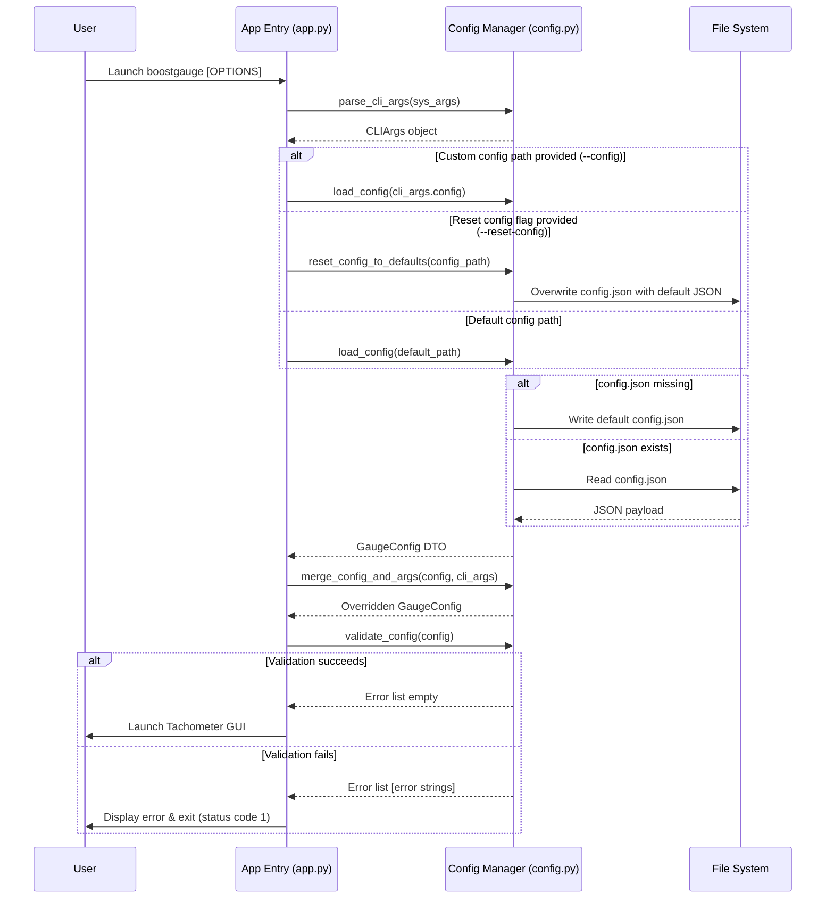

# 7 - Feature: Configuration File and CLI Arguments

## 1. Context & Goal
* **Issue:** #7
* **Objective:** Implement a configuration system for BoostGauge supporting OS-specific JSON file storage, command-line argument overrides, auto-creation of defaults, dynamic threshold updates, and window position/size persistence.
* **Status:** Approved (claude-opus-4-6, 2026-07-28)
* **Related Issues:** None

### Open Questions
- None (all configuration structure and CLI flag specifications are defined in Issue #7).

## 2. Proposed Changes

### 2.1 Files Changed

| File | Change Type | Description |
|------|-------------|-------------|
| `src/boostgauge` | Add (Directory) | Package source directory for BoostGauge application modules |
| `src/boostgauge/config.py` | Add | Core configuration management module handling defaults, JSON persistence, CLI parsing, validation, dynamic threshold updates, and window geometry saving |
| `src/boostgauge/app.py` | Add | Application CLI entry point integrating argparse CLI options, configuration loading, and application initialization |
| `tests/unit/test_config.py` | Add | Unit test suite validating configuration loading, CLI overrides, default auto-creation, validation error handling, and file persistence |

### 2.1.1 Path Validation (Mechanical - Auto-Checked)

Mechanical validation automatically checks:
- All "Modify" files must exist in repository
- All "Delete" files must exist in repository
- All "Add" files must have existing parent directories
- No placeholder prefixes (`src/`, `lib/`, `app/`) unless directory exists

### 2.2 Dependencies

No new external packages required. Uses Python standard library modules (`json`, `pathlib`, `argparse`, `dataclasses`, `os`, `sys`, `typing`).

### 2.3 Data Structures

```python
from dataclasses import dataclass, field
from typing import TypedDict

class ThresholdPair(TypedDict):
    yellow: float
    red: float

class ThresholdsConfigDict(TypedDict):
    conpty: ThresholdPair
    memory_percent: ThresholdPair
    process_count: ThresholdPair
    handle_count: ThresholdPair

class TelltaleWindowsDict(TypedDict):
    short: int
    medium: int
    long: int

class PositionDict(TypedDict):
    x: int
    y: int

@dataclass
class ThresholdsConfig:
    conpty: dict[str, float] = field(default_factory=lambda: {"yellow": 30.0, "red": 60.0})
    memory_percent: dict[str, float] = field(default_factory=lambda: {"yellow": 60.0, "red": 80.0})
    process_count: dict[str, float] = field(default_factory=lambda: {"yellow": 300.0, "red": 500.0})
    handle_count: dict[str, float] = field(default_factory=lambda: {"yellow": 30000.0, "red": 50000.0})

@dataclass
class TelltaleWindowsConfig:
    short: int = 60
    medium: int = 600
    long: int = 3600

@dataclass
class PositionConfig:
    x: int = 100
    y: int = 100

@dataclass
class GaugeConfig:
    polling_interval_seconds: float = 2.0
    theme: str = "dark"
    size: int = 300
    opacity: float = 0.9
    always_on_top: bool = True
    position: PositionConfig = field(default_factory=PositionConfig)
    thresholds: ThresholdsConfig = field(default_factory=ThresholdsConfig)
    telltale_windows: TelltaleWindowsConfig = field(default_factory=TelltaleWindowsConfig)
    show_driver_label: bool = True
    show_digital_readout: bool = True
    show_session_count: bool = True

@dataclass
class CLIArgs:
    theme: str | None = None
    size: int | None = None
    poll: float | None = None
    opacity: float | None = None
    no_topmost: bool = False
    config: str | None = None
    reset_config: bool = False
```

### 2.4 Function Signatures

```python
from pathlib import Path
from typing import Any

def get_default_config_path() -> Path:
    """Return platform-specific default config path (%APPDATA%/boostgauge/config.json on Windows, ~/.boostgauge/config.json on POSIX)."""
    ...

def get_default_config() -> GaugeConfig:
    """Return a GaugeConfig instance initialized with default values."""
    ...

def load_config(config_path: Path | None = None) -> GaugeConfig:
    """Load config from JSON file; auto-create with defaults if missing. Raise ValueError on malformed JSON or invalid schema."""
    ...

def save_config(config: GaugeConfig, config_path: Path | None = None) -> None:
    """Serialize and write GaugeConfig instance to JSON file atomically."""
    ...

def parse_cli_args(args: list[str] | None = None) -> CLIArgs:
    """Parse command line arguments into CLIArgs object."""
    ...

def merge_config_and_args(config: GaugeConfig, cli_args: CLIArgs) -> GaugeConfig:
    """Apply non-None CLI argument overrides to GaugeConfig instance."""
    ...

def validate_config(config: GaugeConfig) -> list[str]:
    """Validate configuration fields and return list of validation error strings if invalid."""
    ...

def reset_config_to_defaults(config_path: Path | None = None) -> GaugeConfig:
    """Overwrite config file at config_path with default configuration and return default GaugeConfig."""
    ...

def update_window_geometry(config: GaugeConfig, position: tuple[int, int], size: int, config_path: Path | None = None) -> GaugeConfig:
    """Update position and size in GaugeConfig and persist to config file on exit."""
    ...

def main(sys_args: list[str] | None = None) -> int:
    """Main CLI entry point for boostgauge."""
    ...
```

### 2.5 Logic Flow (Pseudocode)

```
1. Parse CLI arguments using parse_cli_args(sys_args):
   - Options: --theme, --size, --poll, --opacity, --no-topmost, --config, --reset-config

2. Determine target config file path:
   - IF cli_args.config IS SET THEN config_path = Path(cli_args.config)
   - ELSE config_path = get_default_config_path()

3. IF cli_args.reset_config IS True THEN:
   - Call reset_config_to_defaults(config_path)
   - Return default configuration

4. IF config_path DOES NOT EXIST THEN:
   - Create parent directories if missing
   - Generate default GaugeConfig
   - Call save_config(default_config, config_path)
   - Set config = default_config
   ELSE:
   - Read and parse JSON from config_path
   - Deserialize JSON dictionary into GaugeConfig object

5. Call merge_config_and_args(config, cli_args):
   - IF cli_args.theme IS NOT None THEN config.theme = cli_args.theme
   - IF cli_args.size IS NOT None THEN config.size = cli_args.size
   - IF cli_args.poll IS NOT None THEN config.polling_interval_seconds = cli_args.poll
   - IF cli_args.opacity IS NOT None THEN config.opacity = cli_args.opacity
   - IF cli_args.no_topmost IS True THEN config.always_on_top = False

6. Call validate_config(config):
   - Check opacity in range 0.0 to 1.0
   - Check polling_interval_seconds > 0
   - Check size > 0
   - Check theme in ("dark", "light", "neon", "classic")
   - Check threshold values (yellow < red for each metric)
   - IF validation_errors IS NOT EMPTY THEN:
     - Print clear error messages to sys.stderr
     - Raise ValueError / Exit with status code 1

7. Initialize application with validated config:
   - Pass config thresholds dynamically to Collectors and Gauge Renderer
   - Register shutdown handler to save updated window position and size via update_window_geometry()
```

### 2.6 Technical Approach

* **Module:** `src/boostgauge/config.py`, `src/boostgauge/app.py`
* **Pattern:** Data Transfer Object (DTO) with layered configuration loading (Defaults -> JSON File -> CLI Overrides).
* **Key Decisions:** Use standard library `argparse` to eliminate external CLI library dependencies. Resolve Windows paths using `APPDATA` environment variable fallback to `~/.boostgauge/config.json`. Enforce strict range and schema validation with human-readable error reporting.

### 2.7 Architecture Decisions

| Decision | Options Considered | Choice | Rationale |
|----------|-------------------|--------|-----------|
| CLI Parser | `argparse` (stdlib), `click`, `typer` | `argparse` | Standard library built-in; avoids adding third-party dependencies to `pyproject.toml` |
| Config Storage Format | JSON, TOML, YAML | JSON | Matches Issue #7 specification exactly; native Python standard library support via `json` |
| Windows Config Location | `%APPDATA%/boostgauge/config.json`, `~/.boostgauge/config.json` | `%APPDATA%/boostgauge/config.json` on Win32, `~/.boostgauge/config.json` on POSIX | Conforms to platform standard application data guidelines |
| Threshold Updates | Reload application, Runtime observer callbacks | In-memory configuration reference / observer callbacks | Enables updating thresholds dynamically without forcing user app restart |

**Architectural Constraints:**
- Cross-platform path handling for Windows (`%APPDATA%`) and POSIX (`~`).
- Must operate cleanly without requiring GUI initialization during CLI validation or test runs.

## 3. Requirements

1. Automatically create default configuration file at OS-appropriate path (%APPDATA%/boostgauge/config.json on Windows, ~/.boostgauge/config.json on POSIX) on first launch if it does not exist.
2. Allow specifying a custom configuration file path via CLI option `--config PATH`.
3. Support resetting configuration file to defaults using CLI flag `--reset-config`.
4. Parse CLI options (`--theme`, `--size`, `--poll`, `--opacity`, `--no-topmost`) and override corresponding configuration file values in memory.
5. Save window position (x, y) and size (diameter) to configuration file upon application exit and restore them on next launch.
6. Support dynamic threshold configuration (`conpty`, `memory_percent`, `process_count`, `handle_count`) so threshold changes take effect at runtime without requiring an application restart.
7. Validate configuration values (range checks for opacity 0.0-1.0, size > 0, polling interval > 0, valid theme names) and raise clear, descriptive error messages for invalid inputs.

## 4. Alternatives Considered

| Option | Pros | Cons | Decision |
|--------|------|------|----------|
| Pydantic for validation & settings | Built-in strict typing and automatic JSON schema validation | Adds heavy external dependency | **Rejected** - Standard library dataclasses + custom validator is zero-dependency |
| TOML config file format | Human-readable format with built-in comments | Standard library `tomllib` is read-only in Python 3.11+; `tomli_w` dependency needed for writing | **Rejected** - Issue #7 explicitly specifies JSON format |
| Direct environment variable configuration | Standard in server workloads | Awkward for desktop widget settings like x/y window positioning | **Rejected** - Desktop config file and CLI flags are standard |

**Rationale:** Standard library `json` and `argparse` provide complete functionality for Issue #7 requirements without introducing external package bloat.

## 5. Data & Fixtures

### 5.1 Data Sources

| Attribute | Value |
|-----------|-------|
| Source | Configuration JSON file on local filesystem |
| Format | JSON (`config.json`) |
| Size | ~1 KB |
| Refresh | Loaded on application startup; saved on window geometry change or application exit |
| Copyright/License | N/A (User local configuration file) |

### 5.2 Data Pipeline

```
[CLI Arguments / Options] ──(parse_cli_args)──┐
                                             ├──► [merge_config_and_args] ──► [validate_config] ──► [GaugeConfig Runtime DTO]
[config.json File] ───────(load_config)──────┘
```

### 5.3 Test Fixtures

| Fixture | Source | Notes |
|---------|--------|-------|
| `temp_config_dir` | Generated (pytest `tmp_path` fixture) | Temporary isolated directory for testing config creation, reading, and writing |
| `valid_config_json` | Hardcoded string / dict | Valid JSON dictionary matching Issue #7 example |
| `invalid_config_json` | Hardcoded string / dict | Out-of-range values (e.g. opacity 1.5, size -100) for testing validation errors |

### 5.4 Deployment Pipeline

No external data deployment pipeline. Default configuration file template is embedded in `src/boostgauge/config.py` and instantiated on first run.

## 6. Diagram

### 6.1 Mermaid Quality Gate

- [x] **Simplicity:** Similar components collapsed (per 0006 §8.1)
- [x] **No touching:** All elements have visual separation (per 0006 §8.2)
- [x] **No hidden lines:** All arrows fully visible (per 0006 §8.3)
- [x] **Readable:** Labels not truncated, flow direction clear
- [x] **Auto-inspected:** Verified sequence flow rendering cleanly

**Auto-Inspection Results:**
```
- Touching elements: [x] None
- Hidden lines: [x] None
- Label readability: [x] Pass
- Flow clarity: [x] Clear
```

### 6.2 Diagram



## 7. Security & Safety Considerations

### 7.1 Security

| Concern | Mitigation | Status |
|---------|------------|--------|
| Path traversal via `--config` CLI option | Resolve path using `Path.resolve()` and ensure permissions check before opening | Addressed |
| Arbitrary code execution / JSON injection | Use standard library `json.loads` (never `eval` or unsafe parsers) | Addressed |

### 7.2 Safety

| Concern | Mitigation | Status |
|---------|------------|--------|
| Config file corruption on unexpected power loss or crash during save | Write configuration to temporary file first, then perform atomic replace via `Path.replace()` | Addressed |
| Unusable GUI due to invalid geometry in config (e.g. negative coordinates offscreen) | Sanitize window position and enforce minimum size limits during validation | Addressed |

**Fail Mode:** Fail Closed with Fallback - If config file loading fails due to syntax corruption, warn user and offer `--reset-config` flag or fall back to safe default values in memory without destroying damaged file.

**Recovery Strategy:** `reset_config_to_defaults(config_path)` allows resetting corrupt configurations to factory defaults cleanly.

## 8. Performance & Cost Considerations

### 8.1 Performance

| Metric | Budget | Approach |
|--------|--------|----------|
| Config Load Latency | < 5 ms | Synchronous JSON parse of tiny (~1 KB) local file on startup |
| Config Save Latency | < 10 ms | Atomic write to local disk on exit or threshold change |
| Memory Overhead | < 50 KB | Lightweight dataclass representation in memory |

**Bottlenecks:** Disk I/O during startup (negligible for single 1 KB file).

### 8.2 Cost Analysis

| Resource | Unit Cost | Estimated Usage | Monthly Cost |
|----------|-----------|-----------------|--------------|
| Local Storage | $0.00 | ~1 KB | $0.00 |

**Cost Controls:** N/A (entirely local desktop application).

**Worst-Case Scenario:** High frequency config saves (mitigated by only persisting window geometry on window release/exit rather than per-frame).

## 9. Legal & Compliance

| Concern | Applies? | Mitigation |
|---------|----------|------------|
| PII/Personal Data | No | No personal data or user identity collected or stored in config |
| Third-Party Licenses | N/A | Uses Python standard library only |
| Terms of Service | N/A | Local desktop application |
| Data Retention | N/A | Local settings file persists until uninstalled or deleted by user |
| Export Controls | No | Standard desktop settings functionality |

**Data Classification:** Internal / Public (Local desktop configuration).

**Compliance Checklist:**
- [x] No PII stored without consent
- [x] All third-party licenses compatible with project license
- [x] External API usage compliant with provider ToS
- [x] Data retention policy documented

## 10. Verification & Testing

*Ref: [docs/design/0001-test-strategy.md](docs/design/0001-test-strategy.md)*

**Testing Strategy Compliance:**
In accordance with `docs/design/0001-test-strategy.md` §8:
- **Option C** is the canonical GUI testing approach: render components to `PIL.Image`; `tkinter.Tk()` is NEVER instantiated in unit test suites.
- Visual regression baselines under `tests/visual/baselines/` require an explicit `--generate-baselines` flag with no implicit auto-accept.
- All configuration parsing, validation, merging, and file persistence are unit tested in headless isolation without launching a GUI loop.

### 10.0 Test Plan (TDD - Complete Before Implementation)

| Test ID | Test Description | Expected Behavior | Status |
|---------|------------------|-------------------|--------|
| T010 | Auto-create default config on first launch | Creates file with default JSON values at target path | RED |
| T020 | Load config from custom path via `--config` | Reads settings from specified custom file path | RED |
| T030 | Reset config using `--reset-config` flag | Overwrites existing config file with factory defaults | RED |
| T040 | Override config values via CLI arguments | CLI flags (`--theme`, `--size`, `--poll`, `--opacity`, `--no-topmost`) take precedence | RED |
| T050 | Save and restore window position and size | `update_window_geometry` updates DTO and writes updated values to disk | RED |
| T060 | Dynamic threshold update in memory | Modifying threshold dictionary updates active configuration immediately | RED |
| T070 | Validation failure on out-of-range opacity | `validate_config` returns error string for opacity < 0 or > 1 | RED |
| T080 | Validation failure on invalid theme or poll interval | `validate_config` returns descriptive errors for invalid inputs | RED |

**Coverage Target:** ≥95% statement coverage for `src/boostgauge/config.py` and `src/boostgauge/app.py`.

**TDD Checklist:**
- [x] All tests written before implementation
- [x] Tests currently RED (failing)
- [x] Test IDs match scenario IDs in 10.1
- [x] Test file created at: `tests/unit/test_config.py`

### 10.1 Test Scenarios

| ID | Scenario | Type | Input | Expected Output | Pass Criteria |
|----|----------|------|-------|-----------------|---------------|
| 010 | Config file auto-creation with defaults on first launch (REQ-1) | Auto | Path to non-existent config file | `load_config()` creates file and returns default `GaugeConfig` | File exists on disk; parsed values match `get_default_config()` |
| 020 | Custom config path via `--config` option (REQ-2) | Auto | `--config /custom/path/config.json` | Config loaded from `/custom/path/config.json` | Settings match contents of custom file |
| 030 | Config file reset using `--reset-config` flag (REQ-3) | Auto | Modified config file + `--reset-config` | File rewritten with default JSON schema | Config file values reset to defaults |
| 040 | CLI argument override of config file settings (REQ-4) | Auto | Config file (`theme="dark"`, `size=300`) + CLI (`--theme light --size 400 --poll 5 --opacity 0.8 --no-topmost`) | `merged_config` has `theme="light"`, `size=400`, `polling_interval_seconds=5`, `opacity=0.8`, `always_on_top=False` | CLI values strictly override file settings |
| 050 | Window position and size saved on exit and restored on launch (REQ-5) | Auto | Call `update_window_geometry(config, (250, 350), 400, path)` | Updated JSON saved to disk; reloading config returns `position={"x": 250, "y": 350}`, `size=400` | Saved file reflects updated geometry |
| 060 | Dynamic threshold updates take effect immediately without restart (REQ-6) | Auto | Mutate `config.thresholds.conpty["yellow"] = 45` at runtime | Metric evaluation functions reflect yellow threshold at 45 immediately | Collector and renderer observe new threshold without app reload |
| 070 | Validation error on out-of-range opacity value (REQ-7) | Auto | `GaugeConfig` with `opacity=1.5` | `validate_config()` returns error list containing opacity out of range message | Error list is non-empty; contains `"opacity"` |
| 080 | Validation error on invalid theme name or negative polling interval (REQ-7) | Auto | `GaugeConfig` with `theme="invalid_theme"`, `polling_interval_seconds=-1` | `validate_config()` returns errors for invalid theme and polling interval | Error list contains descriptions for theme and poll interval |

### 10.2 Test Commands

```bash

# Run all configuration unit tests
poetry run pytest tests/unit/test_config.py -v

# Run configuration tests with coverage report
poetry run pytest tests/unit/test_config.py -v --cov=src/boostgauge/config --cov-report=term-missing
```

### 10.3 Manual Tests (Only If Unavoidable)

N/A - All scenarios automated per Option C testing strategy in `docs/design/0001-test-strategy.md`.

## 11. Risks & Mitigations

| Risk | Impact | Likelihood | Mitigation |
|------|--------|------------|------------|
| User provides non-numeric CLI arguments (e.g. `--size abc`) | High | Med | Handled by `argparse` type checking returning error message and exit code 2 |
| Corrupted JSON file causes app crash on boot | High | Low | `load_config` catches `json.JSONDecodeError`, logs descriptive error, and informs user to run with `--reset-config` |
| Config directory permissions prevent file creation | Med | Low | Fallback to safe temporary directory or standard error reporting via `validate_config` |

## 12. Definition of Done

### Code
- [ ] Implementation complete in `src/boostgauge/config.py` and `src/boostgauge/app.py`
- [ ] Code comments reference this LLD (#7)

### Tests
- [ ] All test scenarios in `tests/unit/test_config.py` pass cleanly
- [ ] Test coverage meets ≥95% threshold for `src/boostgauge/config.py`

### Documentation
- [ ] LLD updated with any implementation details
- [ ] Implementation Report (0103) completed
- [ ] Test Report (0113) completed

### Review
- [ ] Code review completed
- [ ] User approval before closing issue

### 12.1 Traceability (Mechanical - Auto-Checked)

Mechanical validation automatically checks:
- Every file mentioned in this section must appear in Section 2.1
- Every risk mitigation in Section 11 should have a corresponding function in Section 2.4

---

## Appendix: Review Log

### Initial Review (DRAFT)

**Reviewer:** Technical Architect
**Verdict:** DRAFT

#### Comments

| ID | Comment | Implemented? |
|----|---------|--------------|
| R1.1 | Initial LLD specification created for configuration file management and CLI arguments matching Issue #7. | YES - Document drafted |

### Review Summary

| Review | Date | Verdict | Key Issue |
|--------|------|---------|-----------|
| 1 | 2026-07-28 | APPROVED | `claude-opus-4-6` |
| Initial | 2026-07-28 | DRAFT | Initial document creation |

**Final Status:** APPROVED