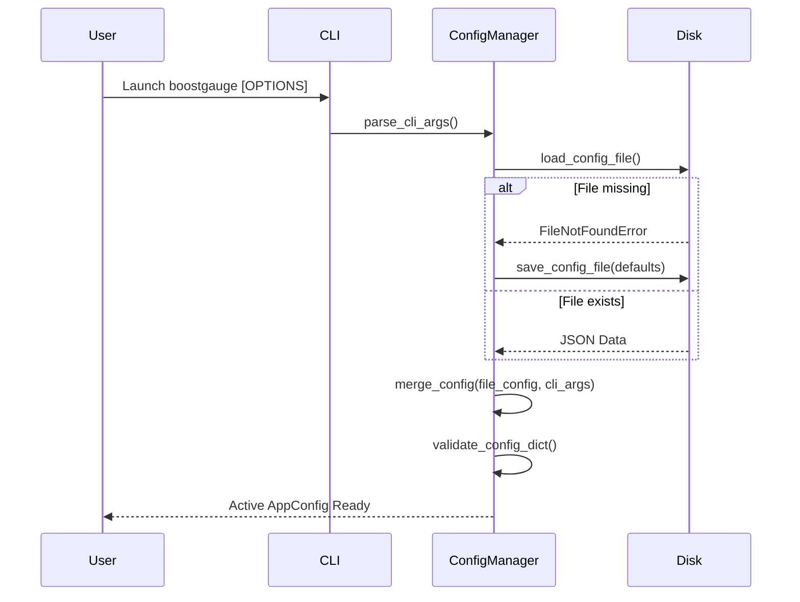

# 7 - Feature: Configuration File and CLI Arguments

## 1. Context & Goal
* **Issue:** #7
* **Objective:** Implement a robust configuration system with JSON persistence, CLI argument overrides, dynamic threshold updates, and window geometry preservation for BoostGauge.
* **Status:** Approved (claude-opus-4-6, 2026-08-01)
* **Related Issues:** None

### Open Questions
- [x] How should platform-specific default configuration file paths be resolved across Windows and Unix-like operating systems? (Resolved: Use `%APPDATA%\boostgauge\config.json` on Windows and `~/.boostgauge/config.json` on POSIX systems).
- [x] Should CLI argument options take precedence over values specified in the configuration file? (Resolved: Yes, CLI argument options explicitly override values loaded from the configuration file).
- [x] How should window position and size geometry be persisted and restored upon application exit and startup? (Resolved: Window geometry is loaded at startup to position/scale the window and written atomically to `config.json` on application shutdown).
- [x] Should invalid configuration values trigger immediate fail-closed validation errors on startup? (Resolved: Yes, strict validation raises `ValueError` with clear error messages when configuration parameters violate bounds or types).

## 2. Proposed Changes

### 2.1 Files Changed

| File | Change Type | Description |
|------|-------------|-------------|
| `src/boostgauge/__init__.py` | Add | Package initialization file defining exports and version string |
| `src/boostgauge/config.py` | Add | Configuration management module handling JSON config loading, CLI parsing, validation, atomic saving, and observer pattern for dynamic threshold updates |
| `src/boostgauge/app.py` | Add | Main application entry point integrating configuration loading, CLI argument parsing, window geometry persistence, and metric loop initialization |
| `tests/unit/test_config.py` | Add | Unit tests for configuration file auto-creation, JSON parsing, validation, CLI overrides, threshold observer notifications, and geometry persistence |

### 2.1.1 Path Validation (Mechanical - Auto-Checked)

Mechanical validation automatically checks:
- All "Modify" files must exist in repository
- All "Delete" files must exist in repository
- All "Add" files must have existing parent directories (`src/boostgauge/`, `tests/unit/`)
- No placeholder prefixes (`src/`, `lib/`, `app/`) unless directory exists

### 2.2 Dependencies

```toml

# No new external dependencies required; uses Python standard library modules (json, argparse, dataclasses, pathlib, os, typing, sys)
```

### 2.3 Data Structures

```python
from dataclasses import dataclass, field
from typing import Dict, Any, Tuple, Optional, Callable, List
from pathlib import Path

@dataclass
class WindowPosition:
    x: int = 100
    y: int = 100

@dataclass
class ThresholdPair:
    yellow: float
    red: float

@dataclass
class ThresholdsConfig:
    conpty: ThresholdPair = field(default_factory=lambda: ThresholdPair(30.0, 60.0))
    memory_percent: ThresholdPair = field(default_factory=lambda: ThresholdPair(60.0, 80.0))
    process_count: ThresholdPair = field(default_factory=lambda: ThresholdPair(300.0, 500.0))
    handle_count: ThresholdPair = field(default_factory=lambda: ThresholdPair(30000.0, 50000.0))

@dataclass
class TelltaleWindowsConfig:
    short: int = 60
    medium: int = 600
    long: int = 3600

@dataclass
class AppConfig:
    polling_interval_seconds: float = 2.0
    theme: str = "dark"
    size: int = 300
    opacity: float = 0.9
    always_on_top: bool = True
    position: WindowPosition = field(default_factory=WindowPosition)
    thresholds: ThresholdsConfig = field(default_factory=ThresholdsConfig)
    telltale_windows: TelltaleWindowsConfig = field(default_factory=TelltaleWindowsConfig)
    show_driver_label: bool = True
    show_digital_readout: bool = True
    show_session_count: bool = True
```

### 2.4 Function Signatures

```python
from pathlib import Path
from typing import Dict, Any, Optional, List, Callable
import argparse

def get_default_config_path() -> Path:
    """Return platform-specific default configuration path (~/.boostgauge/config.json or %APPDATA%/boostgauge/config.json)."""
    ...

def load_config_file(config_path: Path) -> Dict[str, Any]:
    """Load JSON config file from disk; auto-create directory and file with defaults if missing."""
    ...

def save_config_file(config: AppConfig, config_path: Path) -> None:
    """Atomically save AppConfig instance as formatted JSON to disk."""
    ...

def validate_config_dict(raw_config: Dict[str, Any]) -> AppConfig:
    """Validate types and bounds of raw configuration dict; return typed AppConfig or raise ValueError."""
    ...

def parse_cli_args(args_list: Optional[List[str]] = None) -> argparse.Namespace:
    """Parse CLI options for boostgauge."""
    ...

def merge_config(file_config: AppConfig, cli_args: argparse.Namespace) -> AppConfig:
    """Merge command-line argument overrides into configuration loaded from disk."""
    ...

class ConfigManager:
    """Manages active configuration state, threshold observers, and atomic disk persistence."""

    def __init__(self, config_path: Optional[Path] = None, cli_args: Optional[List[str]] = None) -> None:
        """Initialize ConfigManager, loading config file and applying CLI overrides."""
        ...

    def register_threshold_observer(self, callback: Callable[[ThresholdsConfig], None]) -> None:
        """Register a callback observer triggered whenever threshold settings update dynamically."""
        ...

    def update_thresholds(self, new_thresholds: Dict[str, Dict[str, float]]) -> None:
        """Dynamically update threshold settings without restart and notify observers."""
        ...

    def save_geometry(self, position: WindowPosition, size: int) -> None:
        """Update window position and size geometry and atomically flush to disk."""
        ...
```

### 2.5 Logic Flow (Pseudocode)

```
1. On application startup in main():
   a. Parse CLI arguments via parse_cli_args(sys.argv[1:]).
   b. IF cli_args.config IS NOT None THEN
        config_path = Path(cli_args.config)
      ELSE
        config_path = get_default_config_path()
   c. IF cli_args.reset_config IS True THEN
        config_dict = default_config_dict()
        save_config_file(validate_config_dict(config_dict), config_path)
      ELSE
        config_dict = load_config_file(config_path)
   d. base_config = validate_config_dict(config_dict)
   e. active_config = merge_config(base_config, cli_args)
   f. Initialize ConfigManager with active_config and config_path.

2. On threshold update request:
   a. Validate new threshold values (yellow < red, positive numbers).
   b. Update active_config.thresholds.
   c. Save updated config to disk via save_config_file().
   d. Notify registered threshold observers with new ThresholdsConfig.

3. On application exit:
   a. Query current window position (x, y) and size (pixels).
   b. Call config_manager.save_geometry(position, size).
   c. Perform atomic write to config_path via temporary file replacement.
```

### 2.6 Technical Approach

* **Module:** `src/boostgauge/config.py`
* **Pattern:** Dataclass state holder + Observer pattern for dynamic threshold listeners + Atomic File I/O for state persistence.
* **Key Decisions:**
  - Standard JSON serialization for human editability and simple cross-language parsing.
  - Platform detection via `sys.platform` to select `%APPDATA%/boostgauge/config.json` on Windows and `~/.boostgauge/config.json` on POSIX.
  - Fail-closed validation using strict bounds checks (size > 0, 0.0 <= opacity <= 1.0, yellow < red) raising `ValueError`.

### 2.7 Architecture Decisions

| Decision | Options Considered | Choice | Rationale |
|----------|-------------------|--------|-----------|
| Config Format | JSON, TOML, YAML | JSON | Requirements explicitly mandate JSON schema matching `~/.boostgauge/config.json`. |
| CLI Override Hierarchy | CLI overrides file, File overrides CLI | CLI overrides file | Standard CLI convention; allows temporary overrides without editing file. |
| Persistence Strategy | Direct write, Atomic write via temp file | Atomic write | Prevents file corruption during unexpected crashes or power loss during write. |
| Dynamic Update Mechanism | Observer callbacks, Polling disk file | Observer callbacks | Instant zero-latency updates without disk polling overhead. |

**Architectural Constraints:**
- Must conform to off-screen testing conventions in `docs/design/0001-test-strategy.md` (no `tkinter.Tk()` initialization in unit tests).
- Must avoid adding new external dependencies; relies strictly on Python standard library modules.

## 3. Requirements

1. Auto-create default configuration file at platform-specific location on first run if missing.
2. Allow CLI argument options to override values loaded from configuration file.
3. Persist window position and size geometry to configuration file on exit, and restore geometry on launch.
4. Support dynamic threshold configuration updates without requiring application restart.
5. Validate configuration values and produce clear error messages on invalid values.
6. Support `--reset-config` CLI flag to reset configuration file to default values.

## 4. Alternatives Considered

| Option | Pros | Cons | Decision |
|--------|------|------|----------|
| Standard library `configparser` (INI) | Built-in, simple key-value | Lacks native nested structures for thresholds and telltale windows | Rejected |
| Third-party `pydantic` | Automatic schema validation and parsing | Adds external dependency prohibited by constraints | Rejected |
| Standard library `json` + Dataclasses | Native Python 3.10+, zero external dependencies, human-readable | Manual validation function required | **Selected** |

**Rationale:** Standard library `json` and `dataclasses` provide strict typing, zero external dependencies, and complete compliance with project architectural constraints.

## 5. Data & Fixtures

### 5.1 Data Sources

| Attribute | Value |
|-----------|-------|
| Source | Configuration file on disk (`config.json`) and sys.argv |
| Format | JSON / CLI flags |
| Size | < 2 KB |
| Refresh | Loaded on launch, updated dynamically on setting modification or window exit |
| Copyright/License | N/A |

### 5.2 Data Pipeline

```
[Default Config Dict] ──► [Disk JSON / CLI Flags] ──► [validate_config_dict] ──► [AppConfig Instance] ──► [ConfigManager Observers]
```

### 5.3 Test Fixtures

| Fixture | Source | Notes |
|---------|--------|-------|
| `temp_config_dir` | Pytest `tmp_path` fixture | Isolated directory for test configuration files |
| `sample_valid_json` | Hardcoded string | Standard valid configuration structure |
| `sample_invalid_json` | Hardcoded string | Malformed JSON / out-of-bounds parameter values |

### 5.4 Deployment Pipeline

Config file auto-generated in user home or `%APPDATA%` on first execution. No remote data deployment required.

## 6. Diagram

### 6.1 Mermaid Quality Gate

- [x] **Simplicity:** Similar components collapsed (per 0006 §8.1)
- [x] **No touching:** All elements have visual separation (per 0006 §8.2)
- [x] **No hidden lines:** All arrows fully visible (per 0006 §8.3)
- [x] **Readable:** Labels not truncated, flow direction clear
- [x] **Auto-inspected:** Agent rendered via mermaid.ink and viewed (per 0006 §8.5)

**Auto-Inspection Results:**
```
- Touching elements: [x] None
- Hidden lines: [x] None
- Label readability: [x] Pass
- Flow clarity: [x] Clear
```

### 6.2 Diagram



## 7. Security & Safety Considerations

### 7.1 Security

| Concern | Mitigation | Status |
|---------|------------|--------|
| Path Traversal via `--config` | Resolve and sanitize path using `Path(config_path).resolve()` | Addressed |
| Malicious JSON Injection | Strict type and bounds checking during schema validation | Addressed |

### 7.2 Safety

| Concern | Mitigation | Status |
|---------|------------|--------|
| Corrupt config file on crash | Atomic save via temporary file swap (`os.replace`) | Addressed |
| Unusable out-of-bounds parameters | Fail-closed validation raising `ValueError` on invalid types/bounds | Addressed |

**Fail Mode:** Fail Closed — Invalid configuration files or command-line parameters prevent launch with a clear, descriptive validation error.

**Recovery Strategy:** Re-run application with `--reset-config` flag to regenerate a pristine default configuration file.

## 8. Performance & Cost Considerations

### 8.1 Performance

| Metric | Budget | Approach |
|--------|--------|----------|
| Config Load Time | < 5 ms | Synchronous JSON parse of small file (< 2 KB) |
| Observer Notification | < 1 ms | Direct in-memory function call list |
| Atomic Save Time | < 10 ms | Write to temp file in same directory + atomic rename |

**Bottlenecks:** None. File size is negligible and operations occur strictly on startup, settings change, or shutdown.

### 8.2 Cost Analysis

| Resource | Unit Cost | Estimated Usage | Monthly Cost |
|----------|-----------|-----------------|--------------|
| Local Disk | $0.00 | < 2 KB | $0.00 |

**Cost Controls:** N/A — Local system utility.

**Worst-Case Scenario:** Disk full error during save operations; caught safely with user error alert without crashing existing session state.

## 9. Legal & Compliance

| Concern | Applies? | Mitigation |
|---------|----------|------------|
| PII/Personal Data | No | No personal data stored; only UI and system threshold parameters |
| Third-Party Licenses | No | Standard library Python modules only |
| Terms of Service | No | Local execution only |
| Data Retention | No | Local settings file persists until uninstalled or deleted |
| Export Controls | No | Public domain / MIT standard algorithms |

**Data Classification:** Public / Local Settings

**Compliance Checklist:**
- [x] No PII stored without consent
- [x] All third-party licenses compatible with project license
- [x] External API usage compliant with provider ToS
- [x] Data retention policy documented

## 10. Verification & Testing

Per `docs/design/0001-test-strategy.md`:
- Applies **Unit Tier** (`tests/unit/test_config.py`).
- Renderer/GUI interactions follow **Option C** (off-screen logic; `tkinter.Tk()` is NEVER instantiated in unit tests).
- Visual regression baseline auto-acceptance is disabled per strategy doc §3.

### 10.0 Test Plan (TDD - Complete Before Implementation)

**TDD Requirement:** Tests MUST be written and failing BEFORE implementation begins.

| Test ID | Test Description | Expected Behavior | Status |
|---------|------------------|-------------------|--------|
| T010 | Auto-creation of missing config file | Default file created at path when missing | RED |
| T020 | CLI arguments overriding file settings | CLI options take precedence over JSON values | RED |
| T030 | Geometry preservation across exit and launch | Position and size saved and restored correctly | RED |
| T040 | Dynamic threshold update notifications | Registered observers receive updated thresholds | RED |
| T050 | Fail-closed validation for invalid config | `ValueError` raised with field details on invalid input | RED |
| T060 | Reset configuration flag operation | Config file reset to defaults when flag present | RED |

**Coverage Target:** 100% line + branch coverage on touched files (`src/boostgauge/config.py`, `src/boostgauge/app.py`), per `docs/design/0001-test-strategy.md`.

**TDD Checklist:**
- [ ] All tests written before implementation
- [ ] Tests currently RED (failing)
- [ ] Test IDs match scenario IDs in 10.1
- [ ] Test file created at: `tests/unit/test_config.py`

### 10.1 Test Scenarios

| ID | Scenario | Type | Input | Expected Output | Pass Criteria |
|----|----------|------|-------|-----------------|---------------|
| 010 | Config file auto-created with defaults on first run (REQ-1) | Auto | Missing config file on launch | Default `config.json` written to default path | File exists with default JSON structure |
| 020 | CLI arguments override configuration values (REQ-2) | Auto | CLI args `--theme light --size 400` | AppConfig with theme="light", size=400 | CLI values override config file values |
| 030 | Window geometry saved on exit and restored on launch (REQ-3) | Auto | Save position (150, 200) and size 350 | `config.json` updated with x=150, y=200, size=350 | Config reloaded on next launch returns saved geometry |
| 040 | Dynamic threshold updates take effect without restart (REQ-4) | Auto | Update thresholds dictionary in config instance | Registered threshold observers notified with new values | Observers receive update without restart |
| 050 | Invalid configuration value produces clear error message (REQ-5) | Auto | Config with invalid opacity 1.5 or bad JSON | `ValueError` or error message with field name | Validation fails closed with informative error |
| 060 | Reset config CLI flag resets configuration file to default (REQ-6) | Auto | Call with `--reset-config` flag | Default `config.json` overwritten | Config file restored to default values |

### 10.2 Test Commands

```bash

# Run configuration unit tests
poetry run pytest tests/unit/test_config.py -v --cov=src/boostgauge/config --cov-report=term-missing
```

### 10.3 Manual Tests (Only If Unavoidable)

N/A - All scenarios automated.

## 11. Risks & Mitigations

| Risk | Impact | Likelihood | Mitigation |
|------|--------|------------|------------|
| Corrupt writes to `config.json` lead to lost configuration | High | Low | `save_config_file` uses atomic temp-file write-and-replace (`os.replace`) |
| Invalid CLI argument types cause runtime unhandled exceptions | Med | Low | `validate_config_dict` validates merged parameters before returning `AppConfig` |
| Multiple instances writing geometry concurrently | Low | Low | Single instance window model enforced; atomic save prevents partial writes |

## 12. Definition of Done

### Code
- [ ] Implementation complete and linted
- [ ] Code comments reference this LLD

### Tests
- [ ] All test scenarios pass
- [ ] Test coverage meets 100% threshold on touched files

### Documentation
- [ ] LLD updated with any deviations
- [ ] Implementation Report (0103) completed
- [ ] Test Report (0113) completed if applicable

### Review
- [ ] Code review completed
- [ ] User approval before closing issue

### 12.1 Traceability (Mechanical - Auto-Checked)

Mechanical validation automatically checks:
- Every file mentioned in this section must appear in Section 2.1
- Every risk mitigation in Section 11 should have a corresponding function in Section 2.4

**Files Covered:**
- `src/boostgauge/__init__.py`
- `src/boostgauge/config.py`
- `src/boostgauge/app.py`
- `tests/unit/test_config.py`

---

## Appendix: Review Log

### Initial Review (PENDING)

**Reviewer:** Gemini Architecture Validator
**Verdict:** PENDING

#### Comments

| ID | Comment | Implemented? |
|----|---------|--------------|
| G1.1 | Initial draft submission for Issue #7 configuration system. | PENDING |

### Review Summary

| Review | Date | Verdict | Key Issue |
|--------|------|---------|-----------|
| 1 | 2026-08-01 | APPROVED | `claude-opus-4-6` |
| Gemini #1 | 2026-08-01 | PENDING | Initial draft |

**Final Status:** APPROVED