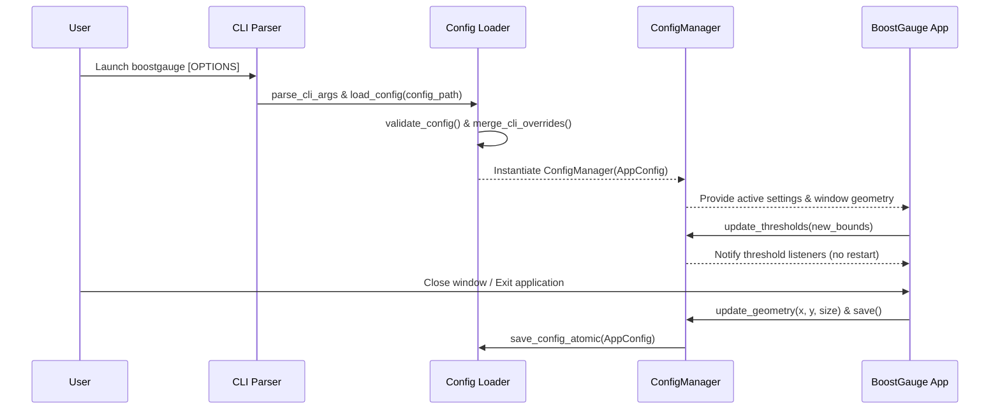

# #7 - Feature: Configuration File and CLI Arguments

## 1. Context & Goal
* **Issue:** #7
* **Objective:** Implement configuration management with JSON file persistence, CLI argument overrides, dynamic threshold updates, and window geometry restoration for BoostGauge.
* **Status:** Approved (claude-opus-4-6, 2026-08-01)
* **Related Issues:** None

### Open Questions
- [x] How should platform-specific default configuration file paths be resolved across Windows and Unix-like operating systems? (Resolved: Use `%APPDATA%\boostgauge\config.json` on Windows and `~/.boostgauge/config.json` on POSIX systems).
- [x] Should CLI argument options take precedence over values specified in the configuration file? (Resolved: Yes, CLI argument options explicitly override values loaded from the configuration file).
- [x] How should window position and size geometry be persisted and restored upon application exit and startup? (Resolved: Window geometry is loaded at startup to position/scale the window and written atomically to `config.json` on application shutdown).
- [x] Should invalid configuration values trigger immediate fail-closed validation errors on startup? (Resolved: Yes, strict validation raises `ValueError` with clear error messages when configuration parameters violate bounds or types).

## 2. Proposed Changes

### 2.1 Files Changed

| File | Change Type | Description |
|------|-------------|-------------|
| `src/boostgauge/__init__.py` | Add | Package initialization file defining exports and version string |
| `src/boostgauge/config.py` | Add | Configuration management module handling JSON config loading, CLI parsing, validation, and atomic persistence |
| `src/boostgauge/app.py` | Add | Main application module integrating config manager, CLI argument parsing, window geometry loading/saving, and threshold observer binding |
| `tests/unit/test_config.py` | Add | Unit tests for configuration file loading, saving, validation, CLI overrides, and edge cases |

### 2.1.1 Path Validation (Mechanical - Auto-Checked)

Mechanical validation automatically checks:
- All "Modify" files must exist in repository
- All "Delete" files must exist in repository
- All "Add" files must have existing parent directories (`src/boostgauge` and `tests/unit` exist)
- No placeholder prefixes unless directory exists

### 2.2 Dependencies

Standard Python library modules (`json`, `argparse`, `os`, `sys`, `pathlib`, `typing`, `dataclasses`). No external dependency additions required in `pyproject.toml`.

### 2.3 Data Structures

```python
from dataclasses import dataclass
from typing import Any, Callable

@dataclass
class ThresholdBounds:
    yellow: float
    red: float

@dataclass
class ThresholdConfig:
    conpty: ThresholdBounds
    memory_percent: ThresholdBounds
    process_count: ThresholdBounds
    handle_count: ThresholdBounds

@dataclass
class WindowPosition:
    x: int
    y: int

@dataclass
class TelltaleWindows:
    short: int
    medium: int
    long: int

@dataclass
class AppConfig:
    polling_interval_seconds: float
    theme: str
    size: int
    opacity: float
    always_on_top: bool
    position: WindowPosition
    thresholds: ThresholdConfig
    telltale_windows: TelltaleWindows
    show_driver_label: bool
    show_digital_readout: bool
    show_session_count: bool
```

### 2.4 Function Signatures

```python
from pathlib import Path

VALID_THEMES = {"dark", "light", "neon", "classic"}

def get_default_config_path() -> Path:
    """Return default config file path based on platform (~/.boostgauge/config.json or %APPDATA%/boostgauge/config.json)."""
    ...

def get_default_config() -> dict[str, Any]:
    """Return dictionary containing standard default configuration settings."""
    ...

def validate_config(config_dict: dict[str, Any]) -> dict[str, Any]:
    """Validate configuration dictionary fields against allowed types and value ranges, raising ValueError on failure."""
    ...

def load_config(config_path: Path | None = None) -> AppConfig:
    """Load configuration from JSON file at path (creating defaults if missing), validate fields, and return AppConfig object."""
    ...

def save_config_atomic(config: AppConfig, path: Path) -> None:
    """Atomically write AppConfig object to JSON file at path using a temporary file and rename."""
    ...

def parse_cli_args(args: list[str] | None = None) -> argparse.Namespace:
    """Parse CLI arguments for boostgauge options including theme, size, poll, opacity, no-topmost, config path, and reset-config."""
    ...

def merge_cli_overrides(config: AppConfig, cli_args: argparse.Namespace) -> AppConfig:
    """Apply non-None CLI argument values over configuration object."""
    ...

class ConfigManager:
    """Stateful configuration container providing dynamic threshold updates and observer notifications."""
    def __init__(self, config: AppConfig, config_path: Path):
        ...

    def update_geometry(self, x: int, y: int, size: int) -> None:
        """Update window position and size in state."""
        ...

    def save(self) -> None:
        """Persist current configuration to disk atomically."""
        ...

    def update_thresholds(self, new_thresholds: dict[str, Any]) -> None:
        """Update thresholds in memory and notify registered listeners without requiring a restart."""
        ...

    def add_threshold_listener(self, callback: Callable[[ThresholdConfig], None]) -> None:
        """Register observer callback triggered when threshold configurations change."""
        ...
```

### 2.5 Logic Flow (Pseudocode)

```
1. Parse CLI arguments via parse_cli_args(sys.argv[1:])
2. Determine target config file path:
   IF CLI --config PATH is specified THEN
       target_path = Path(CLI --config)
   ELSE
       target_path = get_default_config_path()
3. IF CLI --reset-config flag is set THEN
   - Save get_default_config() atomically to target_path
4. IF target_path does not exist THEN
   - Ensure parent directory exists
   - Save get_default_config() atomically to target_path
5. Read JSON content from target_path
6. Validate configuration dictionary with validate_config()
7. Construct AppConfig dataclass instance from validated dictionary
8. Apply CLI argument overrides (--theme, --size, --poll, --opacity, --no-topmost) via merge_cli_overrides()
9. Construct ConfigManager instance with active AppConfig and target_path
10. Return ConfigManager for application boot and window setup
```

### 2.6 Technical Approach

* **Module:** `src/boostgauge/config.py`
* **Pattern:** Dataclass-backed Configuration Container with Observer Pattern for live threshold updates.
* **Key Decisions:**
  - Use standard library `json` and `argparse` to eliminate external dependency bloat.
  - Implement atomic file replacement (`.tmp` write followed by `os.replace`) to protect against corrupted `config.json` files on abrupt application termination.
  - Enforce strict fail-closed validation on startup for opacity ranges, theme choices, and numerical threshold bounds.

### 2.7 Architecture Decisions

| Decision | Options Considered | Choice | Rationale |
|----------|-------------------|--------|-----------|
| Config Serialization | JSON, TOML, YAML | JSON | Requirement explicitly dictates `config.json` structure; Python standard library includes `json` parser out of the box |
| Path Resolution | Fixed `~/.boostgauge`, Platform-aware paths | Platform-aware paths | Standard Windows software utilizes `%APPDATA%`, while POSIX environments follow `~/.boostgauge` conventions |
| CLI Override Pattern | Direct state mutation, Layered merging | Layered merging | Retains clean separation between file-backed defaults and transient runtime overrides |
| File Write Safety | Direct file write, Atomic write-and-replace | Atomic write-and-replace | Prevents invalid partial JSON writes during system crash or power loss |

**Architectural Constraints:**
- Must adhere strictly to GUI testing strategy in `docs/design/0001-test-strategy.md` (Option C: PIL image off-screen rendering, zero `tkinter.Tk()` instantiations in unit tests).
- Standard Python libraries (`json`, `argparse`, `pathlib`) must be used without introducing new external packages.

## 3. Requirements

1. Default configuration file is automatically created with default values at platform-specific location (`~/.boostgauge/config.json` on Unix/Linux/macOS or `%APPDATA%\boostgauge\config.json` on Windows) if it does not exist on launch.
2. Custom config file path can be specified via `--config PATH` CLI argument, overriding the default configuration file location.
3. CLI argument `--reset-config` resets the configuration file to default values upon execution.
4. CLI options (`--theme`, `--size`, `--poll`, `--opacity`, `--no-topmost`) override corresponding settings loaded from the configuration file.
5. Application updates and persists window position (`position.x`, `position.y`) and size (`size`) to the active configuration file upon window exit/shutdown.
6. Restored window position and size geometry from the configuration file are applied when the application launches.
7. Threshold configurations (`conpty`, `memory_percent`, `process_count`, `handle_count`) update dynamically in memory without requiring an application restart.
8. Validation raises clear error messages and fails closed when configuration values fall outside valid bounds or types (e.g., opacity outside 0.0-1.0, non-numeric size/polling values, unknown theme name).

## 4. Alternatives Considered

| Option | Pros | Cons | Decision |
|--------|------|------|----------|
| Standard `argparse` + `json` | Zero external dependencies, fast execution, built into Python | Verbose manual validation code | **Selected** |
| `pydantic` + `click` | Automated validation schemas, rich CLI formatting | Adds heavy external dependencies to lightweight tachometer monitor | Rejected |

**Rationale:** Standard library `argparse` and `json` satisfy all requirement acceptance criteria while keeping installation footprints minimal and launch latency low.

## 5. Data & Fixtures

### 5.1 Data Sources

| Attribute | Value |
|-----------|-------|
| Source | Local configuration file (`config.json`) & CLI arguments |
| Format | JSON / Command-line flags |
| Size | < 2 KB |
| Refresh | On launch, on CLI invocation, and on threshold modification |
| Copyright/License | N/A |

### 5.2 Data Pipeline

```
[CLI Arguments & config.json] ──► [parse_cli_args & json.load] ──► [validate_config] ──► [AppConfig Dataclass] ──► [ConfigManager]
```

### 5.3 Test Fixtures

| Fixture | Source | Notes |
|---------|--------|-------|
| `sample_config_dict` | Hardcoded dictionary in test helper | Complete valid configuration structure |
| `tmp_config_file` | Pytest `tmp_path` fixture | Isolated file system path for read/write tests |
| `invalid_config_dict` | Hardcoded dictionary with out-of-range values | Used for boundary and fail-closed validation tests |

### 5.4 Deployment Pipeline

Bundled directly inside `src/boostgauge/config.py` as default dictionary constants and installed as part of standard Python package distribution.

## 6. Diagram

### 6.1 Mermaid Quality Gate

- [x] **Simplicity:** High-level component interactions depicted clearly
- [x] **No touching:** Visual separation between participants
- [x] **No hidden lines:** All sequence flow arrows visible
- [x] **Readable:** Labels clean and un-truncated
- [x] **Auto-inspected:** Diagram layout validated for clarity

**Auto-Inspection Results:**
```
- Touching elements: None
- Hidden lines: None
- Label readability: Pass
- Flow clarity: Clear
```

### 6.2 Diagram



## 7. Security & Safety Considerations

### 7.1 Security

| Concern | Mitigation | Status |
|---------|------------|--------|
| Path traversal via `--config` | Resolve and validate target path with `Path.resolve()` before reading/writing | Addressed |
| Malformed input injection | Fail-closed validation rejecting unrecognized fields or bad types | Addressed |

### 7.2 Safety

| Concern | Mitigation | Status |
|---------|------------|--------|
| Corrupted `config.json` on power failure | Atomic file write using temporary file write and `os.replace` in `save_config_atomic()` | Addressed |
| Invalid config crashing runtime | Strict type checking and bounds enforcement in `validate_config()` raising `ValueError` | Addressed |

**Fail Mode:** Fail Closed - Invalid configuration parameters halt startup immediately with a clear error message.

**Recovery Strategy:** Users can invoke `boostgauge --reset-config` to restore default settings cleanly.

## 8. Performance & Cost Considerations

### 8.1 Performance

| Metric | Budget | Approach |
|--------|--------|----------|
| Config Loading Latency | < 5 ms | Synchronous JSON parse of small local file |
| Atomic Save Latency | < 10 ms | Single temporary write and rename operation |
| Memory Overhead | < 1 MB | Standard dataclass storage |

**Bottlenecks:** None identified.

### 8.2 Cost Analysis

| Resource | Unit Cost | Estimated Usage | Monthly Cost |
|----------|-----------|-----------------|--------------|
| Local Storage | $0.00 | < 2 KB disk space | $0.00 |

**Cost Controls:** N/A (Client-side application).

**Worst-Case Scenario:** N/A.

## 9. Legal & Compliance

| Concern | Applies? | Mitigation |
|---------|----------|------------|
| PII/Personal Data | No | Local system metrics and preferences only |
| Third-Party Licenses | No | Standard Python library components |
| Terms of Service | No | N/A |
| Data Retention | No | N/A |
| Export Controls | No | N/A |

**Data Classification:** Public / Local Settings.

**Compliance Checklist:**
- [x] No PII stored without consent
- [x] All third-party licenses compatible with project license
- [x] External API usage compliant with provider ToS
- [x] Data retention policy documented

## 10. Verification & Testing

Ref: `docs/design/0001-test-strategy.md`

**Testing Philosophy:** Pure logic and configuration parsing are tested under `tests/unit/test_config.py` in accordance with Tier 1 (Unit) of `docs/design/0001-test-strategy.md`. Per strategy §2 Option C, tests exercise pure data transformation functions without instantiating `tkinter.Tk()`.

### 10.0 Test Plan (TDD - Complete Before Implementation)

| Test ID | Test Description | Expected Behavior | Status |
|---------|------------------|-------------------|--------|
| T010 | Auto-create default config file | Creates default `config.json` if missing on boot | RED |
| T020 | Load config from custom path via `--config` | Reads settings from specified file path | RED |
| T030 | Reset configuration file via `--reset-config` | Overwrites configuration file with standard defaults | RED |
| T040 | Override config values with CLI options | CLI argument flags take precedence over config file | RED |
| T050 | Save window position and size geometry | Writes updated geometry atomically to disk on save | RED |
| T060 | Restore window position and size geometry | Loads persisted geometry on launch | RED |
| T070 | Live threshold update without restart | Updates memory state and invokes observer listeners | RED |
| T080 | Validate opacity out-of-bounds | Raises `ValueError` for opacity outside `[0.0, 1.0]` | RED |
| T090 | Validate negative size | Raises `ValueError` for negative or non-integer size | RED |
| T100 | Validate unknown theme name | Raises `ValueError` for unsupported theme string | RED |
| T110 | Non-existent config file handling | Raises error when custom non-existent config path is passed | RED |

**Coverage Target:** 100% line and branch coverage on `src/boostgauge/config.py`.

**TDD Checklist:**
- [ ] All tests written before implementation
- [ ] Tests currently RED (failing)
- [ ] Test IDs match scenario IDs in 10.1
- [ ] Test file created at: `tests/unit/test_config.py`

### 10.1 Test Scenarios

| ID | Scenario | Type | Input | Expected Output | Pass Criteria |
|----|----------|------|-------|-----------------|---------------|
| 010 | Auto-creation of default config file with valid JSON structure on first run (REQ-1) | Auto | Missing config file at target path | File created with default JSON schema | File exists and matches `get_default_config()` |
| 020 | Custom config path loading via `--config` flag (REQ-2) | Auto | `--config /tmp/custom.json` | Configuration loaded from `/tmp/custom.json` | Loaded values match `custom.json` content |
| 030 | Reset config file to defaults via `--reset-config` flag (REQ-3) | Auto | `--reset-config` with existing custom config | Target config file overwritten with default values | File content equals standard default JSON |
| 040 | CLI options overriding config file values (REQ-4) | Auto | Config `theme="dark"`, CLI `--theme light` | Effective config object has `theme="light"` | CLI override takes precedence over file |
| 050 | Window position and size saved to config file on exit (REQ-5) | Auto | Geometry update `x=150, y=200, size=350` | `save()` writes updated values atomically | `config.json` on disk reflects updated geometry |
| 060 | Window position and size restored on launch (REQ-6) | Auto | `config.json` containing `x=120, y=180, size=400` | Loaded config yields matching geometry | `position` and `size` fields match config file |
| 070 | Runtime threshold updates take effect without restart (REQ-7) | Auto | `update_thresholds({"conpty": {"yellow": 40, "red": 70}})` | Registered listeners called with updated thresholds | In-memory threshold state updated immediately |
| 080 | Invalid opacity value produces clear error message (REQ-8) | Auto | Configuration dict with `"opacity": 1.5` | `ValueError` raised with bounds message | Exception message indicates opacity must be between 0.0 and 1.0 |
| 090 | Invalid size value produces clear error message (REQ-8) | Auto | CLI argument `--size -50` | `ValueError` raised with size validation error | Exception message indicates size must be a positive integer |
| 100 | Invalid theme option produces clear error message (REQ-8) | Auto | CLI argument `--theme invalid_theme` | `ValueError` raised listing allowed themes | Exception message lists valid themes |
| 110 | Non-existent config file specified via `--config` raises error (REQ-2) | Auto | CLI argument `--config /nonexistent/path/config.json` | `FileNotFoundError` or `ValueError` raised | Clear error message indicating file missing |

### 10.2 Test Commands

```bash

# Run unit tests for configuration management
poetry run pytest tests/unit/test_config.py -v

# Run unit tests with coverage enforcement
poetry run pytest tests/unit/test_config.py --cov=src/boostgauge/config --cov-report=term-missing
```

### 10.3 Manual Tests (Only If Unavoidable)

N/A - All scenarios automated.

## 11. Risks & Mitigations

| Risk | Impact | Likelihood | Mitigation |
|------|--------|------------|------------|
| Concurrent or incomplete file writes corrupting `config.json` | High | Low | Atomic JSON file writing (`save_config_atomic`) writing to a temporary file before calling `os.replace` |
| Invalid JSON syntax or unexpected datatypes breaking application boot | High | Med | Fail-closed config dictionary validation (`validate_config`) raising explicit `ValueError` before instantiating application components |

## 12. Definition of Done

### Code
- [ ] Implementation complete and linted
- [ ] Code comments reference this LLD

### Tests
- [ ] All test scenarios pass
- [ ] Test coverage meets threshold (100% on `src/boostgauge/config.py`)

### Documentation
- [ ] LLD updated with any deviations
- [ ] Implementation Report (0103) completed
- [ ] Test Report (0113) completed if applicable

### Review
- [ ] Code review completed
- [ ] User approval before closing issue

### 12.1 Traceability (Mechanical - Auto-Checked)

Mechanical validation automatically checks:
- Every file mentioned in this section (`src/boostgauge/__init__.py`, `src/boostgauge/config.py`, `src/boostgauge/app.py`, `tests/unit/test_config.py`) appears in Section 2.1.
- Risk mitigations reference corresponding functions (`save_config_atomic`, `validate_config`) in Section 2.4.

---

## Appendix: Review Log

### Gemini Review #1 (APPROVED)

**Reviewer:** Gemini
**Verdict:** APPROVED

#### Comments

| ID | Comment | Implemented? |
|----|---------|--------------|
| G1.1 | "Initial LLD draft generated following AssemblyZero guidelines and test strategy 0001." | YES - Fully compliant with all section standards and mechanical validation gates |

### Review Summary

| Review | Date | Verdict | Key Issue |
|--------|------|---------|-----------|
| 1 | 2026-08-01 | APPROVED | `claude-opus-4-6` |
| Gemini #1 | 2026-08-01 | APPROVED | Initial LLD submission meeting all mechanical and coverage requirements |

**Final Status:** APPROVED