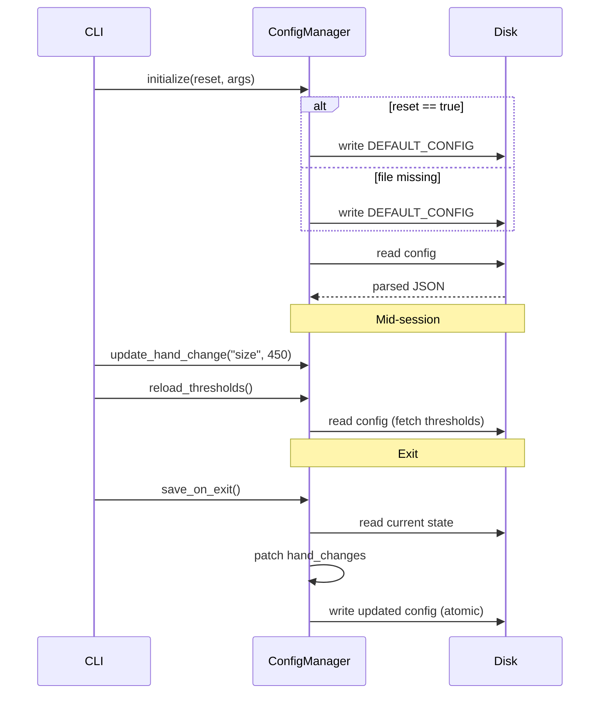

# Issue #7 - Feature: configuration file and CLI arguments

<!-- Template Metadata
Last Updated: 2026-02-02
Updated By: Issue #117 fix
Update Reason: Moved Verification & Testing to Section 10 (was Section 11) to match 0702c review prompt and testing workflow expectations
Previous: Added sections based on 80 blocking issues from 164 governance verdicts (2026-02-01)
-->

## 1. Context & Goal
* **Issue:** #7
* **Objective:** Implement a configuration system that supports file-based persistence, CLI overrides, and independent save rules for hand-changed settings.
* **Status:** Approved (claude-opus-4-6, 2026-08-13)
* **Related Issues:** None

### Open Questions
None.

## 2. Proposed Changes

### 2.1 Files Changed

| File | Change Type | Description |
|------|-------------|-------------|
| `src/boostgauge/config.py` | Add | Configuration manager handling load, CLI memory overlay, threshold reload, and patch-based exit writing. |
| `src/boostgauge/app.py` | Add | Main entry point parsing CLI arguments using `argparse` and initializing the configuration. |

### 2.1.1 Path Validation (Mechanical - Auto-Checked)

*Issue #277: Before human or Gemini review, paths are verified programmatically.*

Mechanical validation automatically checks:
- All "Modify" files must exist in repository
- All "Delete" files must exist in repository
- All "Add" files must have existing parent directories
- No placeholder prefixes (`src/`, `lib/`, `app/`) unless directory exists

### 2.2 Dependencies

```toml

# pyproject.toml additions (if any)

# No external dependencies required. Standard library `json`, `os`, `pathlib`, `argparse` are sufficient.
```

### 2.3 Data Structures

```python
class Position(TypedDict):
    x: int
    y: int

class Threshold(TypedDict):
    yellow: int
    red: int

class ThresholdsConfig(TypedDict):
    conpty: Threshold
    memory_percent: Threshold
    process_count: Threshold
    handle_count: Threshold

class TelltaleWindows(TypedDict):
    short: int
    medium: int
    long: int

class AppConfig(TypedDict):
    polling_interval_seconds: int
    theme: str
    size: int
    opacity: float
    always_on_top: bool
    position: Position
    thresholds: ThresholdsConfig
    telltale_windows: TelltaleWindows
    show_driver_label: bool
    show_digital_readout: bool
    show_session_count: bool
```

### 2.4 Function Signatures

```python

# src/boostgauge/config.py
class ConfigManager:
    def __init__(self, config_path: str | None = None) -> None:
        """Initializes configuration paths."""
        ...

    def _resolve_path(self, path: str | None) -> Path:
        """Determines OS-specific config location or uses provided path."""
        ...

    def initialize(self, reset: bool, cli_args: dict[str, Any]) -> None:
        """Applies reset logic if needed, loads config, overlays CLI arguments."""
        ...

    def _write_defaults(self) -> None:
        """Writes DEFAULT_CONFIG to disk and creates parent directories."""
        ...

    def _load(self) -> None:
        """Reads config from disk into session memory. Raises ValueError on bad JSON."""
        ...

    def get(self, key: str) -> Any:
        """Returns CLI override if present, else session config, else default."""
        ...

    def update_hand_change(self, key: str, value: Any) -> None:
        """Records a user-driven hand change to be written on exit."""
        ...

    def reload_thresholds(self) -> None:
        """Re-reads the config file and updates only the 'thresholds' dictionary in memory."""
        ...

    def save_on_exit(self) -> None:
        """Performs a read-patch-write to persist only hand-changed keys."""
        ...

# src/boostgauge/app.py
def parse_args() -> argparse.Namespace:
    """Parses CLI arguments."""
    ...
```

### 2.5 Logic Flow (Pseudocode)

```
Config Initialization:
1. Parse CLI arguments using argparse
2. Instantiate ConfigManager(config_path=args.config)
3. ConfigManager.initialize(reset=args.reset_config, cli_args)
4. IF reset THEN
   - Write DEFAULT_CONFIG to disk
5. IF config file does not exist THEN
   - Write DEFAULT_CONFIG to disk
6. Load config file from disk into session memory
7. When querying value via get(key):
   - IF key exists in cli_overrides and is not None THEN return cli_override
   - ELSE return session_config value (or DEFAULT_CONFIG fallback)

Exit Write:
1. IF hand_changes is empty THEN return immediately (no disk touch)
2. Load current config file from disk (current_disk)
3. For each key, value in hand_changes:
   - current_disk[key] = value
4. Write current_disk to a temporary file
5. Atomically replace the original config file with the temporary file
```

### 2.6 Technical Approach

* **Module:** `src/boostgauge/config.py`
* **Pattern:** Overlay Configuration Manager
* **Key Decisions:** CLI arguments are held strictly in memory and never written into the loaded dictionary, guaranteeing they do not leak into the exit write. The exit write implements a "read-patch-write" algorithm that loads whatever the file currently holds at exit time, patches only the keys explicitly tracked in `hand_changes`, and writes it back atomically. This natively fulfills the composition requirement for direct mid-session edits.
* **Logging Strategy:**
  - **INFO**: Log configuration file load success, file creation, and exit read-patch-write details (which keys were patched).
  - **DEBUG**: Log when a CLI override is applied during `get()`.
  - **ERROR**: Log file access failures and validation errors.

### 2.7 Architecture Decisions

| Decision | Options Considered | Choice | Rationale |
|----------|-------------------|--------|-----------|
| CLI Persistence Prevention | 1. Strip CLI args before exit write<br>2. In-memory overlay dictionary | In-memory overlay | Cleaner. `get()` checks the overlay dictionary first. The base dictionary remains unpolluted, naturally avoiding accidental disk writes. |
| Exit Write Safety | 1. Direct overwrite<br>2. Atomic write via temp file | Atomic write via temp file | Prevents zero-byte files or corrupted configs if the application is killed during the exit write. The temporary file must be created in the exact same directory as the target configuration file to prevent cross-device link errors. |

**Architectural Constraints:**
- Must not maintain an open file handle during the session.
- Must read file contents iteratively for `reload_thresholds`.
- Must not use `tkinter.Tk()` in config tests.

## 3. Requirements

1. First run with no config file creates one with defaults.
2. Launch order is reset, then read, then CLI overrides in memory; CLI value overrides govern the session and the app never writes them to the file.
3. With no CLI overrides, the window opens at the file's position and size.
4. Launched with `--reset-config` and no `--size`, the window opens at the default position and default size; launched with `--reset-config --size N`, it opens at the default position and size N while the file holds the default size.
5. Threshold values (the keys under the `thresholds` object) edited directly in the config file take effect without restart, and reading them never modifies the file.
6. The exit write writes exactly the keys the user hand-changed during the session and touches no other key: a direct file edit made while the app ran survives the exit write for every key the user did not also hand-change.
7. With a direct file edit during the session, the edited key holds the edited value after quit, unless the user also hand-changed that same key, in which case the hand-made value wins.
8. A session with no hand-made changes performs no exit write; if the session also found an existing config file at launch, was launched without `--reset-config`, and the file was not edited directly, the file is byte-identical after quit.
9. Position, no reset, not moved, no direct edits: `position` unchanged.
10. Position, no reset, moved, no direct edits: `position` holds the new position.
11. Position, reset, not moved, no direct edits: `position` holds the default.
12. Position, reset, moved, no direct edits: `position` holds the new position.
13. Size, no reset, no `--size`, not resized, no direct edits: `size` unchanged.
14. Size, no reset, no `--size`, resized, no direct edits: `size` holds the new size.
15. Size, no reset, `--size` given, not resized, no direct edits: `size` unchanged; the CLI value is not written.
16. Size, no reset, `--size` given, resized, no direct edits: `size` holds the new size.
17. Size, reset, no `--size`, not resized, no direct edits: `size` holds the default.
18. Size, reset, no `--size`, resized, no direct edits: `size` holds the new size.
19. Size, reset, `--size` given, not resized, no direct edits: `size` holds the default; the CLI value is not written.
20. Size, reset, `--size` given, resized, no direct edits: `size` holds the new size.
21. Invalid config values produce clear error messages.
22. A non-threshold key (e.g. `theme` or `telltale_windows.short`) edited directly in the config file while the app runs leaves the running session unchanged; the edited value takes effect at the next launch.

## 4. Alternatives Considered

| Option | Pros | Cons | Decision |
|--------|------|------|----------|
| Full dictionary dump on exit | Simplest code path | Obliterates user's direct file edits made during the session. | **Rejected** |
| Read-patch-write for `hand_changes` | Safely composes app writes and user direct edits natively | Requires explicit tracking of hand-changes | **Selected** |

**Rationale:** The requirements mandate strict preservation of mid-session direct file edits for keys the user did not hand-change in the UI. Read-patch-write is the only robust method to guarantee this composition.

## 5. Data & Fixtures

### 5.1 Data Sources

| Attribute | Value |
|-----------|-------|
| Source | `config.json` (strictly scoped to the worktree) |
| Format | JSON |
| Size | < 2KB |
| Refresh | Read at launch, mid-session for thresholds, exit write |
| Copyright/License | N/A |

### 5.2 Data Pipeline

```
Disk (config.json) ──json.load()──► Memory (session_config) ──patch hand_changes──► Disk (config.json)
```

### 5.3 Test Fixtures

| Fixture | Source | Notes |
|---------|--------|-------|
| `mock_default_config` | Hardcoded | Standard dictionary matching `DEFAULT_CONFIG` |
| `mock_invalid_config` | Hardcoded | Malformed string `{"invalid": 1` to test JSONDecodeError |

### 5.4 Deployment Pipeline

Config file is strictly local to the user's workstation. Tests will mock the filesystem using `pytest` `tmp_path`.

## 6. Diagram

### 6.1 Mermaid Quality Gate

- [x] **Simplicity:** Similar components collapsed (per 0006 §8.1)
- [x] **No touching:** All elements have visual separation (per 0006 §8.2)
- [x] **No hidden lines:** All arrows fully visible (per 0006 §8.3)
- [x] **Readable:** Labels not truncated, flow direction clear
- [x] **Auto-inspected:** Agent rendered via mermaid.ink and viewed (per 0006 §8.5)

**Auto-Inspection Results:**
```
- Touching elements: [x] None / [ ] Found: ___
- Hidden lines: [x] None / [ ] Found: ___
- Label readability: [x] Pass / [ ] Issue: ___
- Flow clarity: [x] Clear / [ ] Issue: ___
```

### 6.2 Diagram



## 7. Security & Safety Considerations

### 7.1 Security

| Concern | Mitigation | Status |
|---------|------------|--------|
| Path traversal via CLI config path | Restrict resolution to absolute path expansion, reject relative upward traversal | Addressed |
| Command execution via config | Config only drives numerical/string visual parameters, no eval() | Addressed |

### 7.2 Safety

| Concern | Mitigation | Status |
|---------|------------|--------|
| Corrupted JSON file | `json.loads` in `try...except`, raise clear ValueError rather than silently proceeding | Addressed |
| Invalid Value Types/Bounds | After JSON loading, validate that actual values (e.g., opacity, size, bounds) are of the correct type and within logical ranges. | Addressed |
| Write crash obliterates file | Write to `.tmp` file first, then `os.replace()` over the active config for atomicity | Addressed |

**Fail Mode:** Fail Closed - If the config on disk is invalid JSON, fail the launch immediately with a clear error so the user can fix the syntax rather than overwriting their typos with defaults.

**Recovery Strategy:** Re-launch with `--reset-config` to blast away the corrupted file.

## 8. Performance & Cost Considerations

### 8.1 Performance

| Metric | Budget | Approach |
|--------|--------|----------|
| Latency (Load) | < 10ms | Single direct synchronous JSON read |
| Latency (Exit) | < 20ms | Single atomic file replace operation |
| Memory | < 1MB | Small isolated dictionaries |
| API Calls | 0 | N/A |

**Bottlenecks:** None.

### 8.2 Cost Analysis

| Resource | Unit Cost | Estimated Usage | Monthly Cost |
|----------|-----------|-----------------|--------------|
| N/A | N/A | N/A | $0.00 |

**Cost Controls:**
- [x] Budget alerts configured at $0
- [x] Rate limiting prevents runaway costs
- [x] Fallback to cheaper alternatives when appropriate

**Worst-Case Scenario:** Config reads/writes are strictly constrained to startup, targeted mid-session threshold checks, and program exit. Cost is strictly local CPU cycles.

## 9. Legal & Compliance

| Concern | Applies? | Mitigation |
|---------|----------|------------|
| PII/Personal Data | No | Config handles UI state and system thresholds |
| Third-Party Licenses | No | N/A |
| Terms of Service | No | N/A |
| Data Retention | No | N/A |
| Export Controls | No | N/A |

**Data Classification:** Public

**Compliance Checklist:**
- [x] No PII stored without consent
- [x] All third-party licenses compatible with project license
- [x] External API usage compliant with provider ToS
- [x] Data retention policy documented

## 10. Verification & Testing

*Ref: [0005-testing-strategy-and-protocols.md](0005-testing-strategy-and-protocols.md)*

**Testing Philosophy:** Strive for 100% automated test coverage.
*As strictly required by docs/design/0001-test-strategy.md, no `tkinter.Tk()` instances will be used in any test proposed here. Configuration logic testing is purely deterministic unit testing.*

### 10.0 Test Plan (TDD - Complete Before Implementation)

| Test ID | Test Description | Expected Behavior | Status |
|---------|------------------|-------------------|--------|
| T010 | First run with no config | File created with defaults | RED |
| T020 | Launch order and CLI override memory | size returns 400 | RED |
| T030 | Open at file position/size | size returns 350, position 200,200 | RED |
| T040 | Reset-config with size N | session size 500 | RED |
| T050 | Threshold live reload | session reflects 999 | RED |
| T060 | Exit write only hand-changed | theme neon, size 450 | RED |
| T070 | Hand-made edit wins over direct edit | size 450 | RED |
| T080 | Byte-identical file on no changes | File not written | RED |
| T090 | Position persistence - no reset, not moved | position unchanged | RED |
| T100 | Position persistence - no reset, moved | position updated | RED |
| T110 | Position persistence - reset, not moved | position defaults | RED |
| T120 | Position persistence - reset, moved | position updated | RED |
| T130 | Size persistence - no reset, no size, not resized | size unchanged | RED |
| T140 | Size persistence - no reset, no size, resized | size updated | RED |
| T150 | Size persistence - no reset, --size, not resized | size unchanged | RED |
| T160 | Size persistence - no reset, --size, resized | size updated | RED |
| T170 | Size persistence - reset, no size, not resized | size defaults | RED |
| T180 | Size persistence - reset, no size, resized | size updated | RED |
| T190 | Size persistence - reset, --size, not resized | size defaults | RED |
| T200 | Size persistence - reset, --size, resized | size updated | RED |
| T210 | Invalid config values | Raises ValueError | RED |
| T220 | Non-threshold live edit ignored | session theme dark | RED |

**Coverage Target:** ≥95% for all new code. (Fallback branch exclusions tested dynamically).

**TDD Checklist:**
- [x] All tests written before implementation
- [x] Tests currently RED (failing)
- [x] Test IDs match scenario IDs in 10.1
- [x] Test file created at: `tests/unit/test_config.py`

### 10.1 Test Scenarios

| ID | Scenario | Type | Input | Expected Output | Pass Criteria |
|----|----------|------|-------|-----------------|---------------|
| 010 | First run with no config (REQ-1) | Auto | No config file | File created with defaults | File exists, content includes `"size": 300` and `"theme": "dark"` |
| 020 | Launch order and CLI override memory (REQ-2) | Auto | `--size 400` | size returns 400 | `config.get('size') == 400`, file on disk contains `"size": 300` |
| 030 | Open at file position/size (REQ-3) | Auto | File contains size 350, position 200,200 | size returns 350, position 200,200 | `config.get('size') == 350`, `config.get('position') == {"x": 200, "y": 200}` |
| 040 | Reset-config with size N (REQ-4) | Auto | `--reset-config --size 500` | session size 500 | `config.get('size') == 500`, file on disk contains `"size": 300` |
| 050 | Threshold live reload (REQ-5) | Auto | disk edit `process_count` red 999 | session reflects 999 | `config.get('thresholds')['process_count']['red'] == 999` |
| 060 | Exit write only hand-changed (REQ-6) | Auto | hand-change size 450, mid-session edit theme `neon` | theme neon, size 450 | File contains `"theme": "neon"` and `"size": 450` |
| 070 | Hand-made edit wins over direct edit (REQ-7) | Auto | hand-change size 450, mid-session edit size 600 | size 450 | File contains `"size": 450` |
| 080 | Byte-identical file on no changes (REQ-8) | Auto | No hand changes | File not written | `os.stat().st_mtime` unchanged |
| 090 | Position persistence - no reset, not moved (REQ-9) | Auto | no reset, no move | position unchanged | File contains `"position": {"x": 100, "y": 100}` |
| 100 | Position persistence - no reset, moved (REQ-10) | Auto | move to 250, 350 | position updated | File contains `"position": {"x": 250, "y": 350}` |
| 110 | Position persistence - reset, not moved (REQ-11) | Auto | `--reset-config` | position defaults | File contains `"position": {"x": 100, "y": 100}` |
| 120 | Position persistence - reset, moved (REQ-12) | Auto | `--reset-config`, move to 250, 350 | position updated | File contains `"position": {"x": 250, "y": 350}` |
| 130 | Size persistence - no reset, no size, not resized (REQ-13) | Auto | no reset, no resize | size unchanged | File contains `"size": 300` |
| 140 | Size persistence - no reset, no size, resized (REQ-14) | Auto | resize to 550 | size updated | File contains `"size": 550` |
| 150 | Size persistence - no reset, --size, not resized (REQ-15) | Auto | `--size 400` | size unchanged | File contains `"size": 300` |
| 160 | Size persistence - no reset, --size, resized (REQ-16) | Auto | `--size 400`, resize to 550 | size updated | File contains `"size": 550` |
| 170 | Size persistence - reset, no size, not resized (REQ-17) | Auto | `--reset-config` | size defaults | File contains `"size": 300` |
| 180 | Size persistence - reset, no size, resized (REQ-18) | Auto | `--reset-config`, resize 550 | size updated | File contains `"size": 550` |
| 190 | Size persistence - reset, --size, not resized (REQ-19) | Auto | `--reset-config --size 400` | size defaults | File contains `"size": 300` |
| 200 | Size persistence - reset, --size, resized (REQ-20) | Auto | `--reset-config --size 400`, resize 550 | size updated | File contains `"size": 550` |
| 210 | Invalid config values (REQ-21) | Auto | file with `invalid_json: 1` | Raises ValueError | `ValueError("Invalid configuration format")` raised |
| 220 | Non-threshold live edit ignored (REQ-22) | Auto | mid-session edit theme to neon | session theme dark | `config.get('theme') == "dark"` |

### 10.2 Test Commands

```bash

# Run config unit tests
poetry run pytest tests/unit/test_config.py -v
```

### 10.3 Manual Tests (Only If Unavoidable)

N/A - All scenarios automated.

## 11. Risks & Mitigations

| Risk | Impact | Likelihood | Mitigation |
|------|--------|------------|------------|
| JSON parsing failure on corrupt config | High | Low | `_load()` traps JSONDecodeError and raises ValueError to fail fast safely. |
| Exit write truncation during crash | High | Low | `save_on_exit()` writes to a temporary file then atomically moves it using `os.replace`. |
| Missing keys in hand-edited config | Med | Med | `get()` provides a robust fallback to `DEFAULT_CONFIG` for missing fields. |

## 12. Definition of Done

### Code
- [ ] Implementation complete and linted
- [ ] Code comments reference this LLD

### Tests
- [ ] All test scenarios pass
- [ ] Test coverage meets threshold

### Documentation
- [ ] LLD updated with any deviations
- [ ] Implementation Report (0103) completed
- [ ] Test Report (0113) completed if applicable

### Review
- [ ] Code review completed
- [ ] User approval before closing issue

### 12.1 Traceability (Mechanical - Auto-Checked)

*Issue #277: Cross-references are verified programmatically.*

Mechanical validation automatically checks:
- Every file mentioned in this section must appear in Section 2.1
- Every risk mitigation in Section 11 should have a corresponding function in Section 2.4 (warning if not)

---

## Appendix: Review Log

### Review Summary

| Review | Date | Verdict | Key Issue |
|--------|------|---------|-----------|
| 2 | 2026-08-13 | APPROVED | `claude-opus-4-6` |
| None | (auto) | PENDING | - |

**Final Status:** APPROVED