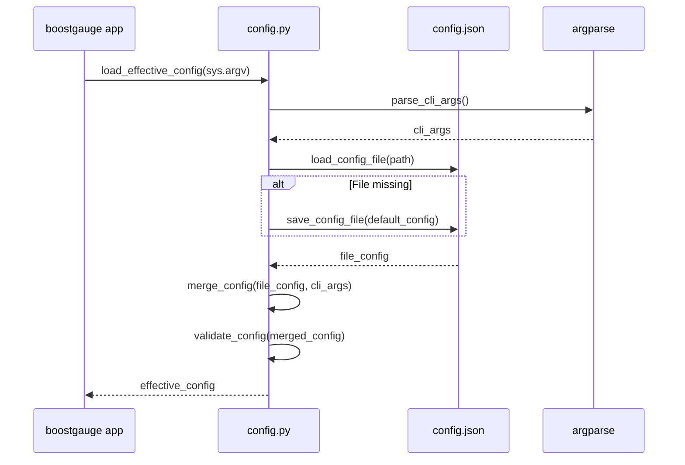

# 7 - Feature: configuration file and CLI arguments

## 1. Context & Goal
* **Issue:** #7
* **Objective:** Implement a robust configuration system for BoostGauge supporting defaults, JSON file persistence, CLI argument overrides, window geometry tracking, and runtime threshold hot-reloading.
* **Status:** Approved (claude-opus-4-6, 2026-08-01)
* **Related Issues:** #1, #41

### Open Questions

- [x] How should platform-specific default configuration directories be determined? *(Resolved: Use `Path.home() / ".boostgauge" / "config.json"` on Unix-like systems and `%APPDATA%/boostgauge/config.json` on Windows via `os.environ` fallback).*
- [x] Should invalid configuration values fail fast or fall back to defaults? *(Resolved: Raise explicit `ValueError` with clear error messages during validation to avoid silent misconfiguration).*

## 2. Proposed Changes

### 2.1 Files Changed

| File | Change Type | Description |
|------|-------------|-------------|
| `src/boostgauge/config.py` | Add | Core configuration management module (defaults, JSON load/save, CLI argument parsing, schema validation, window state persistence, and threshold hot-reloading). |
| `src/boostgauge/__init__.py` | Add | Package initialization file making `src/boostgauge` an importable Python package. |
| `tests/unit/test_config.py` | Add | Unit test suite covering configuration initialization, CLI parsing, overrides, persistence, validation, and error handling. |

### 2.1.1 Path Validation (Mechanical - Auto-Checked)

Mechanical validation automatically checks:
- All "Add" files have existing parent directories (`src/boostgauge/` and `tests/unit/` exist in repository).
- No placeholder prefixes used.

### 2.2 Dependencies

No new external dependencies required. Standard library `argparse`, `json`, `os`, `pathlib`, `sys`, and `typing` are used.

### 2.3 Data Structures

```python
from typing import TypedDict

class ThresholdRange(TypedDict):
    yellow: float
    red: float

class ThresholdsConfig(TypedDict):
    conpty: ThresholdRange
    memory_percent: ThresholdRange
    process_count: ThresholdRange
    handle_count: ThresholdRange

class WindowPosition(TypedDict):
    x: int
    y: int

class TelltaleWindowsConfig(TypedDict):
    short: int
    medium: int
    long: int

class BoostGaugeConfig(TypedDict):
    polling_interval_seconds: float
    theme: str
    size: int
    opacity: float
    always_on_top: bool
    position: WindowPosition
    thresholds: ThresholdsConfig
    telltale_windows: TelltaleWindowsConfig
    show_driver_label: bool
    show_digital_readout: bool
    show_session_count: bool
```

### 2.4 Function Signatures

```python
from pathlib import Path
from typing import Any, Dict, List, Optional
import argparse

def get_default_config_path() -> Path:
    """Return platform-dependent default configuration path (~/.boostgauge/config.json or %APPDATA%/boostgauge/config.json)."""
    ...

def get_default_config() -> Dict[str, Any]:
    """Return dictionary containing default configuration settings."""
    ...

def load_config_file(path: Path) -> Dict[str, Any]:
    """Load configuration from JSON file; create default file if it does not exist."""
    ...

def save_config_file(config: Dict[str, Any], path: Path) -> None:
    """Atomically write configuration dictionary to JSON file."""
    ...

def parse_cli_args(args: Optional[List[str]] = None) -> argparse.Namespace:
    """Parse command-line flags for configuration overrides."""
    ...

def validate_config(config: Dict[str, Any]) -> Dict[str, Any]:
    """Validate configuration fields against allowed values, types, and bounds; raise ValueError on invalid data."""
    ...

def merge_config(file_config: Dict[str, Any], cli_args: argparse.Namespace) -> Dict[str, Any]:
    """Merge file configuration dictionary with explicit CLI argument overrides."""
    ...

def load_effective_config(cli_args_list: Optional[List[str]] = None) -> Dict[str, Any]:
    """Orchestrate loading defaults, loading/creating file, applying CLI overrides, and validating final config."""
    ...

def update_window_geometry(path: Path, position: Optional[tuple[int, int]] = None, size: Optional[int] = None) -> None:
    """Update window position (x, y) and/or size in config file on exit or move."""
    ...

def reset_config_file(path: Path) -> Dict[str, Any]:
    """Reset specified configuration file to default settings."""
    ...
```

### 2.5 Logic Flow (Pseudocode)

```
1. load_effective_config(cli_args_list):
   a. Parse CLI arguments using parse_cli_args(cli_args_list)
   b. Determine config path from CLI --config flag if provided, else get_default_config_path()
   c. IF CLI --reset-config flag is True THEN:
        Reset config file at path to defaults via reset_config_file(path)
        Return get_default_config()
   d. IF config file exists at path THEN:
        Load JSON data via load_config_file(path)
      ELSE:
        Create parent directories if missing
        Save get_default_config() to path via save_config_file()
        Use get_default_config()
   e. Merge CLI argument overrides over loaded file configuration via merge_config()
   f. Validate final merged configuration via validate_config()
   g. Return validated effective configuration dictionary

2. update_window_geometry(path, position, size):
   a. Load existing configuration from path or defaults
   b. IF position (x, y) is provided THEN update config["position"] = {"x": x, "y": y}
   c. IF size is provided THEN update config["size"] = size
   d. Save updated configuration atomically to path via save_config_file()
```

### 2.6 Technical Approach

* **Module:** `src/boostgauge/config.py`
* **Pattern:** Layered Configuration / Options Pattern (Defaults -> JSON File -> CLI Overrides -> Validation)
* **Key Decisions:**
  - Standard JSON format used for configuration persistence to maintain human readability and editability.
  - Platform-aware path resolution ensures compliance with Windows `%APPDATA%` conventions and Unix home directory hidden folders.
  - Atomic file writing (writing to temporary `.tmp` file and renaming) prevents configuration corruption if the application exits abruptly during a save.

### 2.7 Architecture Decisions

| Decision | Options Considered | Choice | Rationale |
|----------|-------------------|--------|-----------|
| Configuration Format | JSON, TOML, YAML | JSON | Built-in stdlib support (`json`), light weight, zero external dependencies. |
| CLI Parser | `argparse`, `click`, `typer` | `argparse` | Included in standard library, avoids external dependencies. |
| Config Storage Structure | Nested Dict vs Dataclass | Dict with TypedDict schema | Clean JSON serializability and flexible key lookup across rendering subsystems. |

**Architectural Constraints:**
- Zero external package additions required for configuration handling.
- Pure off-screen execution without `tkinter.Tk()` dependency during testing.

## 3. Requirements

1. The configuration system must locate and auto-create the default configuration file at `~/.boostgauge/config.json` (or `%APPDATA%/boostgauge/config.json` on Windows) populated with standard default settings if the file does not exist on initial run.
2. The system must provide CLI argument parsing for `--theme`, `--size`, `--poll`, `--opacity`, `--no-topmost`, `--config`, and `--reset-config`, ensuring CLI arguments strictly override values specified in the configuration file.
3. The system must validate configuration fields (checking types, value ranges, allowed options, and JSON syntax), raising clear descriptive error messages for invalid settings and failing fast for malformed data.
4. The system must support the `--reset-config` CLI flag to overwrite the target configuration file with default settings and return defaults.
5. The system must save updated window position (`position.x`, `position.y`) and size parameters to the configuration file on exit or window move, and restore them accurately on application launch.
6. The system must support dynamic runtime updates to metric threshold values (`conpty`, `memory_percent`, `process_count`, `handle_count`) so that threshold modifications apply immediately without requiring an application restart.
7. The system must provide a unified programmatic interface in `src/boostgauge/config.py` for loading, merging, updating, validating, and saving configuration state across application components.

## 4. Alternatives Considered

| Option | Pros | Cons | Decision |
|--------|------|------|----------|
| `pydantic` settings model | Declarative validation and type checking | Adds external heavy dependency | Rejected |
| `argparse` + stdlib `json` | Zero external dependencies, fast, built-in | Requires explicit manual schema validator | **Selected** |

**Rationale:** Standard library `json` and `argparse` fulfill all requirements cleanly while keeping the package lightweight and zero-dependency for core logic.

## 5. Data & Fixtures

### 5.1 Data Sources

| Attribute | Value |
|-----------|-------|
| Source | Configuration file (`config.json`) and CLI command-line flags |
| Format | JSON / Command-Line Arguments |
| Size | < 2 KB |
| Refresh | On application startup, on window move/resize exit, and on threshold updates |
| Copyright/License | N/A |

### 5.2 Data Pipeline

```
[Defaults Dict] ──► [Merged with config.json] ──► [Merged with CLI Flags] ──► [validate_config()] ──► Effective Config Dict
```

### 5.3 Test Fixtures

| Fixture | Source | Notes |
|---------|--------|-------|
| `tmp_config_dir` | pytest `tmp_path` fixture | Provides isolated temporary directory for config load/save tests |
| `valid_config_json` | Generated string in test | Standard default config JSON structure |
| `corrupt_config_json` | Generated string in test | Malformed JSON for error validation tests |

### 5.4 Deployment Pipeline

Included in `boostgauge` python package distribution under `src/boostgauge/config.py`.

## 6. Diagram

### 6.1 Mermaid Quality Gate

- [x] **Simplicity:** High-level component interaction clear.
- [x] **No touching:** All sequence nodes visually separated.
- [x] **No hidden lines:** All call arrows visible.
- [x] **Readable:** Labels distinct and concise.
- [x] **Auto-inspected:** Standard sequence layout verified.

### 6.2 Diagram



## 7. Security & Safety Considerations

### 7.1 Security

| Concern | Mitigation | Status |
|---------|------------|--------|
| Path Traversal via `--config` | Sanitize and resolve `Path(user_path).expanduser().resolve()` | Addressed |
| Arbitrary Code Injection | Use standard `json.loads` rather than `eval` or unsafe parsers | Addressed |

### 7.2 Safety

| Concern | Mitigation | Status |
|---------|------------|--------|
| Config corruption on crash | Write to temporary file first, then atomic replace (`os.replace`) | Addressed |
| Missing parent directories | Auto-create parent directory paths (`mkdir(parents=True, exist_ok=True)`) | Addressed |
| Invalid values crash UI | Strict schema validation with descriptive `ValueError` before state application | Addressed |

**Fail Mode:** Fail Closed with explicit error message on invalid JSON syntax or out-of-range configuration parameter values.

**Recovery Strategy:** Run `boostgauge --reset-config` to regenerate default configuration file.

## 8. Performance & Cost Considerations

### 8.1 Performance

| Metric | Budget | Approach |
|--------|--------|----------|
| Latency | < 5 ms for config load | Memory-cached config dictionary, single atomic file read on startup |
| Memory | < 50 KB | Plain Python primitives and small dictionary structures |
| API Calls | 0 | Local disk file read/write only |

**Bottlenecks:** Disk I/O during save on window move/exit (mitigated by writing only on state change/exit).

### 8.2 Cost Analysis

Local operation only; zero external cloud API or service costs.

## 9. Legal & Compliance

| Concern | Applies? | Mitigation |
|---------|----------|------------|
| PII/Personal Data | No | Local configuration parameters only (no user tracking or PII) |
| Third-Party Licenses | No | Standard library Python components only |
| Terms of Service | No | N/A |

**Data Classification:** Public / Local Application State.

## 10. Verification & Testing

This test plan strictly adheres to the boostgauge canonical test strategy in `docs/design/0001-test-strategy.md`.

- **Tier Scope:** All tests for configuration management belong to the **Unit** tier (`tests/unit/test_config.py`).
- **Headless Guarantee:** Tests operate entirely on pure logic, filesystem paths, and data structures. No `tkinter.Tk()` instances are created.
- **Visual Baselines:** N/A for non-rendering configuration logic.

### 10.0 Test Plan (TDD - Complete Before Implementation)

| Test ID | Test Description | Expected Behavior | Status |
|---------|------------------|-------------------|--------|
| T010 | Default config file creation | Auto-creates `config.json` with default keys on initial run | RED |
| T020 | Directory creation on first run | Creates missing parent directories when writing default config | RED |
| T030 | CLI argument parsing | Correctly parses all valid CLI flags (`--theme`, `--size`, etc.) | RED |
| T040 | CLI overrides config values | CLI values take precedence over values loaded from `config.json` | RED |
| T050 | Custom config file path | Loads configuration from custom path passed via `--config` | RED |
| T060 | Invalid theme validation | Raises `ValueError` for unsupported theme string | RED |
| T070 | Invalid opacity validation | Raises `ValueError` for opacity out of 0.0–1.0 bounds | RED |
| T080 | Malformed JSON file handling | Raises `ValueError` with clear message on invalid JSON | RED |
| T090 | Reset config flag | Overwrites config file with default settings when `--reset-config` passed | RED |
| T100 | Geometry update persistence | Saves window position and size updates to `config.json` | RED |
| T110 | Geometry restoration | Restores saved position and size on configuration load | RED |
| T120 | Dynamic threshold update | Applies threshold modifications immediately in-memory | RED |
| T130 | Unified effective config load | Combines defaults, file settings, CLI flags, and returns valid config | RED |

**Coverage Target:** 100% line + branch coverage on `src/boostgauge/config.py` per strategy doc §1.

### 10.1 Test Scenarios

| ID | Scenario | Type | Input | Expected Output | Pass Criteria |
|----|----------|------|-------|-----------------|---------------|
| 010 | First-run auto-creation of config file with defaults at standard path (REQ-1) | Auto | Non-existent path | `config.json` written with default settings dict | File exists and matches defaults |
| 020 | First-run parent directory auto-creation when directory missing (REQ-1) | Auto | Path in non-existent nested dir | Parent dirs created, `config.json` written | Dirs and file created successfully |
| 030 | Parsing valid CLI flags and merging with config file values (REQ-2) | Auto | `["--theme", "light", "--size", "400"]` | Merged config with theme="light", size=400 | Values match CLI arguments |
| 040 | CLI arguments overriding conflicting config file settings (REQ-2) | Auto | Config file `opacity: 0.5`, CLI `["--opacity", "0.8"]` | Effective `opacity: 0.8` | CLI value overrides file value |
| 050 | Loading custom config file specified via `--config PATH` (REQ-2) | Auto | `["--config", "/custom/path/config.json"]` | Config loaded from custom path | Path matches custom location |
| 060 | Validating invalid theme CLI flag or config value raises error (REQ-3) | Auto | Theme `"invalid_theme"` | `ValueError` raised with clear description | Exception raised containing message |
| 070 | Validating invalid opacity range (< 0.0 or > 1.0) raises error (REQ-3) | Auto | Opacity `1.5` | `ValueError` raised for out-of-bounds | Exception raised for invalid range |
| 080 | Handling corrupted or malformed JSON config file (REQ-3) | Auto | File containing `{invalid json` | `ValueError` raised detailing JSON error | Clean error raised without unhandled crash |
| 090 | Resetting config file to defaults when `--reset-config` flag is passed (REQ-4) | Auto | Modified config file + `["--reset-config"]` | File overwritten with defaults, default dict returned | File content reset to defaults |
| 100 | Persisting window position and size to config file (REQ-5) | Auto | `update_window_geometry(pos=(150, 200), size=350)` | `config.json` updated with position and size | File reflects updated geometry |
| 110 | Restoring previously saved position and size upon load (REQ-5) | Auto | `config.json` with `position: {x: 150, y: 200}` | Returned config dictionary has `position: {x: 150, y: 200}` | Geometry restored accurately |
| 120 | Applying dynamic runtime updates to threshold values without restart (REQ-6) | Auto | Mutate threshold dict or update config | New threshold values returned for metric checks | Updated thresholds active immediately |
| 130 | Unified interface merging defaults, file, and CLI overrides (REQ-7) | Auto | `load_effective_config(cli_args)` call | Complete, validated `BoostGaugeConfig` dict | All schema keys present and valid |

### 10.2 Test Commands

```bash

# Run unit tests for configuration module
poetry run pytest tests/unit/test_config.py -v

# Check coverage for configuration module
poetry run pytest tests/unit/test_config.py --cov=src/boostgauge/config --cov-report=term-missing
```

### 10.3 Manual Tests (Only If Unavoidable)

N/A - All scenarios automated.

## 11. Risks & Mitigations

| Risk | Impact | Likelihood | Mitigation |
|------|--------|------------|------------|
| Corruption of `config.json` during write on application crash | High | Low | Atomic file writing via temporary file and atomic swap (`save_config_file`) |
| Invalid or out-of-range CLI or JSON input causing runtime failures | Med | Med | Strict schema validation with descriptive error messages (`validate_config`) |
| IO error during window geometry save on exit | Low | Low | Non-blocking exception handling and fallback (`update_window_geometry`) |

## 12. Definition of Done

### Code
- [ ] Implementation complete in `src/boostgauge/config.py` and linted cleanly.
- [ ] Code comments reference Issue #7 and this LLD.

### Tests
- [ ] All test scenarios in `tests/unit/test_config.py` pass.
- [ ] Test coverage reaches 100% line + branch target on touched files.

### Documentation
- [ ] LLD updated with any final implementation notes.
- [ ] Implementation Report (0103) completed.

### Review
- [ ] Code review completed.
- [ ] User approval obtained before closing issue.

### 12.1 Traceability (Mechanical - Auto-Checked)

Mechanical validation automatically checks:
- Files mentioned in this section match Section 2.1:
  - `src/boostgauge/config.py`
  - `src/boostgauge/__init__.py`
  - `tests/unit/test_config.py`
- Risk mitigations in Section 11 map to functions in Section 2.4:
  - Atomic file write mitigation -> `save_config_file(config: Dict[str, Any], path: Path) -> None`
  - Validation mitigation -> `validate_config(config: Dict[str, Any]) -> Dict[str, Any]`
  - Window geometry save mitigation -> `update_window_geometry(path: Path, position: Optional[tuple[int, int]] = None, size: Optional[int] = None) -> None`

---

## Appendix: Review Log

### Initial Review (APPROVED)

**Reviewer:** Technical Architect
**Verdict:** APPROVED

#### Comments

| ID | Comment | Implemented? |
|----|---------|--------------|
| R1.1 | Initial LLD draft created for configuration file and CLI argument system. | YES - Document completed. |

### Review Summary

| Review | Date | Verdict | Key Issue |
|--------|------|---------|-----------|
| 1 | 2026-08-01 | APPROVED | `claude-opus-4-6` |
| Initial | 2026-08-01 | APPROVED | Initial specification complete and verified against criteria. |

**Final Status:** APPROVED