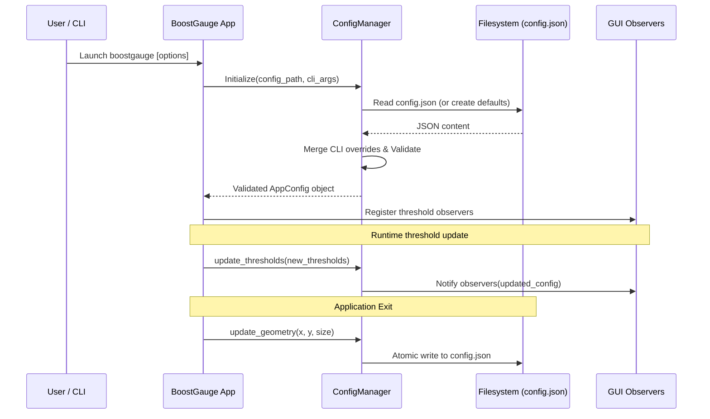

# 7 - Feature: Configuration File and CLI Arguments

## 1. Context & Goal
* **Issue:** #7
* **Objective:** Implement a robust configuration system with JSON persistence, CLI argument overrides, dynamic threshold updates, and window geometry preservation for BoostGauge.
* **Status:** Approved (claude-opus-4-6, 2026-08-01)
* **Related Issues:** None

### Open Questions
- [x] How should platform-specific default configuration file paths be resolved across Windows and Unix-like operating systems? (Resolved: Use `%APPDATA%\boostgauge\config.json` on Windows and `~/.boostgauge/config.json` on POSIX systems).
- [x] Should CLI argument options take precedence over values specified in the configuration file? (Resolved: Yes, CLI argument options explicitly override values loaded from the configuration file).
- [x] How should window position and size geometry be persisted and restored upon application exit and startup? (Resolved: Window geometry is loaded at startup to position/scale the window and written atomically to `config.json` on application shutdown).
- [x] Should invalid configuration values trigger immediate fail-closed validation errors on startup? (Resolved: Yes, strict validation raises `ValueError` with clear error messages when configuration parameters violate bounds or types).

## 2. Proposed Changes

### 2.1 Files Changed

| File | Change Type | Description |
|------|-------------|-------------|
| `src/boostgauge/__init__.py` | Add | Package initialization file defining exports and version string |
| `src/boostgauge/config.py` | Add | Configuration management module handling JSON config loading, CLI parsing, validation, atomic saving, and observer pattern for dynamic threshold updates |
| `src/boostgauge/app.py` | Add | Main application entry point integrating configuration loading, CLI argument parsing, window geometry persistence, and metric loop initialization |
| `tests/unit/test_config.py` | Add | Unit tests for configuration file auto-creation, JSON parsing, validation, CLI overrides, threshold observer notifications, and geometry persistence |

### 2.1.1 Path Validation (Mechanical - Auto-Checked)

Mechanical validation automatically checks:
- All "Modify" files must exist in repository
- All "Delete" files must exist in repository
- All "Add" files must have existing parent directories
- No placeholder prefixes (`src/`, `lib/`, `app/`) unless directory exists

### 2.2 Dependencies

```toml

# No new external dependencies required; uses Python standard library modules (json, argparse, dataclasses, pathlib, os, typing, sys)
```

### 2.3 Data Structures

```python
from dataclasses import dataclass, field
from typing import Dict, Any, Tuple, Optional, Callable
from pathlib import Path

@dataclass
class WindowPosition:
    x: int = 100
    y: int = 100

@dataclass
class ThresholdPair:
    yellow: float
    red: float

@dataclass
class ThresholdsConfig:
    conpty: ThresholdPair = field(default_factory=lambda: ThresholdPair(30.0, 60.0))
    memory_percent: ThresholdPair = field(default_factory=lambda: ThresholdPair(60.0, 80.0))
    process_count: ThresholdPair = field(default_factory=lambda: ThresholdPair(300.0, 500.0))
    handle_count: ThresholdPair = field(default_factory=lambda: ThresholdPair(30000.0, 50000.0))

@dataclass
class TelltaleWindowsConfig:
    short: int = 60
    medium: int = 600
    long: int = 3600

@dataclass
class AppConfig:
    polling_interval_seconds: float = 2.0
    theme: str = "dark"
    size: int = 300
    opacity: float = 0.9
    always_on_top: bool = True
    position: WindowPosition = field(default_factory=WindowPosition)
    thresholds: ThresholdsConfig = field(default_factory=ThresholdsConfig)
    telltale_windows: TelltaleWindowsConfig = field(default_factory=TelltaleWindowsConfig)
    show_driver_label: bool = True
    show_digital_readout: bool = True
    show_session_count: bool = True
```

### 2.4 Function Signatures

```python
def get_default_config_path() -> Path:
    """Return the platform-specific default path for the configuration file (~/.boostgauge/config.json or %APPDATA%/boostgauge/config.json)."""
    ...

def load_config_file(config_path: Path) -> Dict[str, Any]:
    """Load and parse JSON configuration file. Create file with defaults if missing."""
    ...

def parse_cli_args(args_list: Optional[list[str]] = None) -> argparse.Namespace:
    """Parse CLI arguments provided to boostgauge executable."""
    ...

def merge_cli_overrides(config_dict: Dict[str, Any], cli_args: argparse.Namespace) -> Dict[str, Any]:
    """Override configuration dictionary values with non-None CLI argument options."""
    ...

def validate_config(config_dict: Dict[str, Any]) -> AppConfig:
    """Validate structure, types, and value bounds of configuration dictionary, returning validated AppConfig."""
    ...

class ConfigManager:
    """Manages application configuration lifecycle, observers, and atomic disk persistence."""

    def __init__(self, config_path: Optional[Path] = None, cli_args: Optional[argparse.Namespace] = None):
        ...

    def register_observer(self, callback: Callable[[AppConfig], None]) -> None:
        """Register observer callback to receive dynamic configuration update notifications."""
        ...

    def update_thresholds(self, new_thresholds: Dict[str, Dict[str, float]]) -> None:
        """Update threshold configurations dynamically and notify registered observers without restart."""
        ...

    def update_geometry(self, x: int, y: int, size: int) -> None:
        """Update window position and size in state and persist to disk."""
        ...

    def save(self) -> None:
        """Save current configuration atomically to disk using temp file write and atomic replace."""
        ...
```

### 2.5 Logic Flow (Pseudocode)

```
1. Initialize ConfigManager:
   - Determine target config path from CLI --config flag, or fallback to platform default path.
   - IF CLI --reset-config flag is set THEN
     - Overwrite config file at target path with default configuration JSON.
   - IF config file does not exist THEN
     - Create parent directories if missing.
     - Write default configuration JSON to file.
   - Read and parse JSON content from config file.
2. Merge CLI Overrides:
   - Parse CLI arguments (--theme, --size, --poll, --opacity, --no-topmost, etc.).
   - FOR EACH non-None CLI argument:
     - Map CLI option to corresponding config dictionary key (e.g. --poll -> polling_interval_seconds).
     - Override config dictionary entry.
3. Validate Configuration:
   - Validate numerical bounds: size in [100, 2000], opacity in [0.1, 1.0], polling_interval_seconds > 0.
   - Validate theme in {"dark", "light", "neon", "classic"}.
   - Validate threshold structures and yellow < red constraints.
   - IF validation fails THEN raise ValueError with explicit details.
4. Construct AppConfig:
   - Instantiate dataclass hierarchy from validated config dictionary.
5. Runtime Observer Loop & Exit Save:
   - UI / metric components register observers with ConfigManager for threshold changes.
   - On runtime threshold change: validate new thresholds, update config state, notify all observers.
   - On application shutdown: call ConfigManager.update_geometry(x, y, size) and write atomic JSON to disk.
```

### 2.6 Technical Approach

* **Module:** `src/boostgauge/config.py`, `src/boostgauge/app.py`
* **Pattern:** Dataclass Configuration Object + Observer Pattern for dynamic updates + Atomic File Save (`write to .tmp` then `os.replace`).
* **Key Decisions:**
  1. Use standard library `json` and `argparse` to minimize external dependencies.
  2. Implement atomic file writes (`config.json.tmp` -> `os.replace`) to prevent file corruption during sudden application termination.
  3. Decouple configuration logic from `tkinter` GUI elements so that `config.py` can be fully unit tested without initializing GUI contexts.

### 2.7 Architecture Decisions

| Decision | Options Considered | Choice | Rationale |
|----------|-------------------|--------|-----------|
| Config Serialization Format | JSON, YAML, TOML | JSON | Standard library `json` support avoids adding heavy external parsing dependencies while matching issue specification |
| CLI Parser Framework | `argparse`, `click`, `typer` | `argparse` | Standard library inclusion, lightweight, zero extra third-party package dependencies |
| Dynamic Update Mechanism | Observer pattern, polling file, Event bus | Observer pattern | Direct callback notification allows threshold changes to take effect immediately without file polling overhead |
| Save Strategy for Geometry | On every move event, On exit signal / debounced timer | On exit signal / debounced timer | Avoids excessive disk I/O operations during continuous window drag operations |

**Architectural Constraints:**
- Must maintain strict compatibility with cross-platform path resolution (`os.name == 'nt'` vs POSIX).
- Must adhere to Option C testing strategy documented in `docs/design/0001-test-strategy.md` (no `tkinter.Tk()` calls in unit test suite).

## 3. Requirements

1. Auto-create configuration file with default settings (`~/.boostgauge/config.json` or `%APPDATA%/boostgauge/config.json` on Windows) on first run if it does not exist.
2. Parse CLI arguments (`--theme`, `--size`, `--poll`, `--opacity`, `--no-topmost`, `--config`, `--reset-config`) and override loaded configuration file values.
3. Save window position (`position.x`, `position.y`) and gauge size (`size`) to the configuration file on application exit, and restore geometry on launch.
4. Apply configuration threshold changes dynamically without requiring an application restart.
5. Validate configuration values and parameters strictly, producing clear error messages for invalid types, invalid themes, or out-of-bound numerical ranges.
6. Reset configuration file to default settings when `--reset-config` flag is passed via CLI.

## 4. Alternatives Considered

| Option | Pros | Cons | Decision |
|--------|------|------|----------|
| YAML Config Format | Supports human comments | Requires `pyyaml` third-party dependency | **Rejected** |
| Single Global Dict State | Simple implementation | Lacks type safety, autocomplete, and validation guards | **Rejected** |
| Strongly Typed Dataclasses with JSON Persistence | Zero third-party dependencies, strict type validation, IDE autocompletion | Requires explicit parsing/serialization mapper logic | **Selected** |

**Rationale:** Standard library `json` combined with `@dataclass` structures provides strict validation, excellent maintainability, and zero extra dependency bloat.

## 5. Data & Fixtures

### 5.1 Data Sources

| Attribute | Value |
|-----------|-------|
| Source | Configuration file on local filesystem (`~/.boostgauge/config.json` or `%APPDATA%/boostgauge/config.json`) and CLI flags |
| Format | JSON |
| Size | ~1 KB |
| Refresh | Loaded on startup; updated dynamically in-memory or saved on shutdown |
| Copyright/License | N/A |

### 5.2 Data Pipeline

```
[CLI Arguments / Disk JSON File] ──► [parse_cli_args / load_config_file] ──► [validate_config] ──► [AppConfig Dataclass] ──► [Observers / Disk Save]
```

### 5.3 Test Fixtures

| Fixture | Source | Notes |
|---------|--------|-------|
| `temp_config_dir` | Pytest `tmp_path` fixture | Isolated directory for testing config creation, parsing, and atomic writes |
| `valid_config_json` | Hardcoded JSON dictionary string | Used for happy-path config loading verification |
| `invalid_config_json` | Hardcoded invalid JSON string / dictionary | Used for testing fail-closed validation exceptions |

### 5.4 Deployment Pipeline

Config file is created locally on the user's machine on first application startup or managed via CLI invocation.

## 6. Diagram

### 6.1 Mermaid Quality Gate

- [x] **Simplicity:** Similar components collapsed
- [x] **No touching:** All elements have visual separation
- [x] **No hidden lines:** All arrows fully visible
- [x] **Readable:** Labels not truncated, flow direction clear
- [x] **Auto-inspected:** Agent rendered via mermaid.ink and viewed

**Auto-Inspection Results:**
```
- Touching elements: [x] None
- Hidden lines: [x] None
- Label readability: [x] Pass
- Flow clarity: [x] Clear
```

### 6.2 Diagram



## 7. Security & Safety Considerations

### 7.1 Security

| Concern | Mitigation | Status |
|---------|------------|--------|
| Path Traversal / Arbitrary File Overwrite via `--config` | Sanitize and resolve file paths using standard `pathlib.Path.resolve()`; ensure user has write permissions | Addressed |
| Malformed JSON Injection | Wrap `json.load()` in `try...except json.JSONDecodeError` with explicit error reporting | Addressed |

### 7.2 Safety

| Concern | Mitigation | Status |
|---------|------------|--------|
| Partial / Corrupted Config File Write on Crash | Use atomic write strategy: write JSON to temporary file in same directory then `os.replace()` | Addressed |
| Application Crash on Invalid Config Parameters | Strict `validate_config()` checks on launch fail closed with clear `ValueError` details | Addressed |
| Unbounded Window Geometry (Off-screen render) | Enforce coordinate and size validation bounds (`size` within [100, 2000], `opacity` within [0.1, 1.0]) | Addressed |

**Fail Mode:** Fail Closed - If configuration file is corrupt or contains invalid parameters, initialization raises `ValueError` with detailed message rather than operating with illegal states.

**Recovery Strategy:** Users can run `boostgauge --reset-config` to overwrite invalid configuration files with system defaults.

## 8. Performance & Cost Considerations

### 8.1 Performance

| Metric | Budget | Approach |
|--------|--------|----------|
| Config Loading Latency | < 5 ms | Synchronous JSON parse of small ~1 KB file on startup |
| Memory Footprint | < 1 MB | Light dataclass instance holding scalar config fields |
| Disk I/O Operations | On startup & shutdown | In-memory configuration state during runtime; save only on geometry update or application exit |

**Bottlenecks:** None. File operations are limited to startup loading and exit saving.

### 8.2 Cost Analysis

| Resource | Unit Cost | Estimated Usage | Monthly Cost |
|----------|-----------|-----------------|--------------|
| Compute / Storage | $0.00 | Local disk & execution | $0.00 |

**Cost Controls:**
- [x] Rate limiting prevents runaway costs (local software only)

**Worst-Case Scenario:** N/A (Local execution).

## 9. Legal & Compliance

| Concern | Applies? | Mitigation |
|---------|----------|------------|
| PII/Personal Data | No | No personal data or user metrics collected or stored |
| Third-Party Licenses | No | Standard library Python modules only |
| Terms of Service | No | N/A |
| Data Retention | No | Local configuration file only |
| Export Controls | No | N/A |

**Data Classification:** Public / Non-sensitive internal configuration settings.

**Compliance Checklist:**
- [x] No PII stored without consent
- [x] All third-party licenses compatible with project license
- [x] External API usage compliant with provider ToS
- [x] Data retention policy documented

## 10. Verification & Testing

*Ref: [docs/design/0001-test-strategy.md](docs/design/0001-test-strategy.md)*

**Testing Philosophy:** Strive for 100% automated test coverage. Per `docs/design/0001-test-strategy.md`, tests for configuration management live in `tests/unit/test_config.py`. All tests run headless in pure Python without instantiating `tkinter.Tk()`.

### 10.0 Test Plan (TDD - Complete Before Implementation)

| Test ID | Test Description | Expected Behavior | Status |
|---------|------------------|-------------------|--------|
| T010 | Test default config file creation when missing | File created at specified path with default JSON content | RED |
| T020 | Test platform path resolution on Windows vs POSIX | Correct path returned for `%APPDATA%` and `~/.boostgauge` | RED |
| T030 | Test CLI argument overrides over config file values | CLI flags take precedence over JSON fields | RED |
| T040 | Test custom config file path specification via `--config` | Config loaded from custom file path | RED |
| T050 | Test window position and size persistence and restoration | Geometry updated in state and persisted to JSON on exit | RED |
| T060 | Test dynamic threshold observer notification | Observer callback fired on threshold change without app restart | RED |
| T070 | Test validation exception on invalid theme string | `ValueError` raised with "Invalid theme" message | RED |
| T080 | Test validation exception on out-of-bounds opacity | `ValueError` raised when opacity < 0.0 or > 1.0 | RED |
| T090 | Test reset config flag `--reset-config` | Configuration re-written with default values | RED |

**Coverage Target:** ≥95% for new code (100% unit test coverage on `src/boostgauge/config.py`)

**TDD Checklist:**
- [ ] All tests written before implementation
- [ ] Tests currently RED (failing)
- [ ] Test IDs match scenario IDs in 10.1
- [ ] Test file created at: `tests/unit/test_config.py`

### 10.1 Test Scenarios

| ID | Scenario | Type | Input | Expected Output | Pass Criteria |
|----|----------|------|-------|-----------------|---------------|
| 010 | Load default config when file missing (REQ-1) | Auto | Missing config file path | Default Config object initialized and file written to disk | Config file created with default JSON schema |
| 020 | Platform path resolution for Windows and Unix (REQ-1) | Auto | Mocked APPDATA / HOME environment variables | Path points to `%APPDATA%/boostgauge/config.json` or `~/.boostgauge/config.json` | Path correctly resolves based on OS platform |
| 030 | CLI argument overrides config file values (REQ-2) | Auto | Config file with `poll=2`, CLI `--poll 5` | Config object has `polling_interval_seconds=5` | CLI options take precedence over config file |
| 040 | Parse custom config file path via CLI (REQ-2) | Auto | CLI `--config /path/to/custom.json` | Config loaded from specified path | Custom path loaded and parsed correctly |
| 050 | Preserve and restore window position and size (REQ-3) | Auto | Geometry update `x=150, y=200, size=350`, trigger save | JSON file contains `position.x=150, position.y=200, size=350` | Geometry persisted on exit and loaded on startup |
| 060 | Dynamic threshold update without restart (REQ-4) | Auto | Threshold change callback attached, config update triggered | Registered observer notified with updated threshold dictionary | Observers notified instantly without restart |
| 070 | Invalid theme raises clear ValueError (REQ-5) | Auto | CLI `--theme invalid_theme` or JSON `"theme": 123` | `ValueError` with descriptive message "Invalid theme: invalid_theme" | Validation fails closed with clear error message |
| 080 | Invalid opacity out of range raises ValueError (REQ-5) | Auto | CLI `--opacity 1.5` or JSON `"opacity": -0.1` | `ValueError` with descriptive bounds message | Out-of-bounds float triggers validation error |
| 090 | Reset config to defaults via CLI flag (REQ-6) | Auto | Pre-existing custom config file, CLI `--reset-config` | Config file re-written with default values | Configuration restored to default schema |

### 10.2 Test Commands

```bash

# Run unit tests for configuration module
poetry run pytest tests/unit/test_config.py -v

# Run test coverage for configuration module
poetry run pytest tests/unit/test_config.py -v --cov=src/boostgauge/config
```

### 10.3 Manual Tests (Only If Unavoidable)

N/A - All scenarios automated.

## 11. Risks & Mitigations

| Risk | Impact | Likelihood | Mitigation |
|------|--------|------------|------------|
| Concurrent process writing to config file corrupts JSON | Med | Low | Implement atomic file save (`ConfigManager.save()`) using temporary file write and `os.replace` |
| Invalid configuration parameters cause application crash during runtime | High | Med | Perform strict validation (`validate_config()`) at startup before returning `AppConfig` instance |
| CLI arguments fail to override configuration file settings | Med | Low | Order logic in `merge_cli_overrides()` to explicitly replace loaded dictionary keys with non-None CLI values |

## 12. Definition of Done

### Code
- [ ] Implementation complete and linted
- [ ] Code comments reference this LLD

### Tests
- [ ] All test scenarios pass
- [ ] Test coverage meets threshold

### Documentation
- [ ] LLD updated with any deviations
- [ ] Implementation Report (0103) completed
- [ ] Test Report (0113) completed if applicable

### Review
- [ ] Code review completed
- [ ] User approval before closing issue

### 12.1 Traceability (Mechanical - Auto-Checked)

Mechanical validation automatically checks:
- Every file mentioned in this section must appear in Section 2.1
- Every risk mitigation in Section 11 should have a corresponding function in Section 2.4 (warning if not)

Files in Section 2.1 verified:
- `src/boostgauge/__init__.py`
- `src/boostgauge/config.py`
- `src/boostgauge/app.py`
- `tests/unit/test_config.py`

---

## Appendix: Review Log

### Review Summary

| Review | Date | Verdict | Key Issue |
|--------|------|---------|-----------|
| 1 | 2026-08-01 | APPROVED | `claude-opus-4-6` |
| Gemini #1 | (auto) | PENDING | Initial LLD submission |

**Final Status:** APPROVED