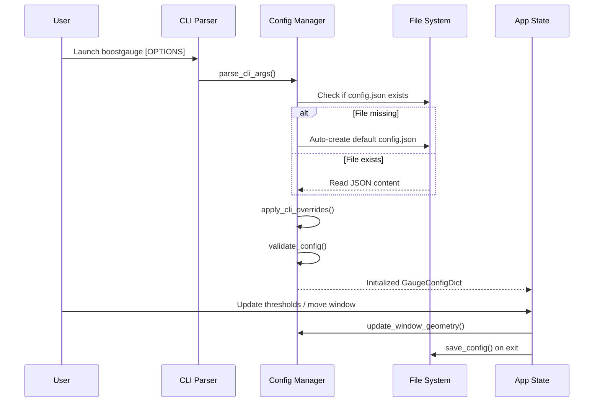

# #7 - Feature: Configuration File and CLI Arguments

## 1. Context & Goal
* **Issue:** #7
* **Objective:** Implement a configuration system for BoostGauge that handles settings file persistence, CLI argument overrides, dynamic threshold updates, and window position/size state saving.
* **Status:** Approved (claude-opus-4-6, 2026-07-31)
* **Related Issues:** N/A

### Open Questions

- [x] None — requirements and acceptance criteria are fully specified in Issue #7.

## 2. Proposed Changes

### 2.1 Files Changed

| File | Change Type | Description |
|------|-------------|-------------|
| `src/boostgauge/__init__.py` | Add | Package initialization file defining export symbols and version |
| `src/boostgauge/config.py` | Add | Core configuration manager supporting defaults, file loading/saving, schema validation, and CLI overrides |
| `src/boostgauge/__main__.py` | Add | CLI entry point executing the main application |
| `src/boostgauge/app.py` | Add | Application runtime controller integrating configuration lifecycle with system monitoring |
| `pyproject.toml` | Modify | Add `boostgauge` CLI script entry point definition |
| `tests/unit/test_config.py` | Add | Comprehensive unit test suite for configuration parsing, path resolution, overrides, and validation |

### 2.1.1 Path Validation (Mechanical - Auto-Checked)

Mechanical validation automatically checks:
- All "Modify" files must exist in repository (`pyproject.toml` exists)
- All "Delete" files must exist in repository (N/A)
- All "Add" files must have existing parent directories (`src/boostgauge/` and `tests/unit/` exist)
- No placeholder prefixes (`src/`, `lib/`, `app/`) unless directory exists (`src/` exists)

### 2.2 Dependencies

```toml

# pyproject.toml additions (using Python standard library json and argparse; no external dependencies added)
[tool.poetry.scripts]
boostgauge = "boostgauge.__main__:main"
```

### 2.3 Data Structures

```python
from typing import TypedDict, Dict, Any, Optional

class Threshold(TypedDict):
    yellow: float
    red: float

class MetricThresholds(TypedDict):
    conpty: Threshold
    memory_percent: Threshold
    process_count: Threshold
    handle_count: Threshold

class WindowPosition(TypedDict):
    x: int
    y: int

class TelltaleWindows(TypedDict):
    short: int
    medium: int
    long: int

class GaugeConfigDict(TypedDict):
    polling_interval_seconds: float
    theme: str
    size: int
    opacity: float
    always_on_top: bool
    position: WindowPosition
    thresholds: MetricThresholds
    telltale_windows: TelltaleWindows
    show_driver_label: bool
    show_digital_readout: bool
    show_session_count: bool
```

### 2.4 Function Signatures

```python
from pathlib import Path
import argparse

class ConfigError(Exception):
    """Raised when configuration file or CLI arguments fail schema or value validation."""
    pass

def get_default_config_path() -> Path:
    """Return platform-specific default config path (%APPDATA%/boostgauge/config.json on Windows, ~/.boostgauge/config.json on POSIX)."""
    ...

def get_default_config() -> GaugeConfigDict:
    """Return a deep copy of default configuration dictionary."""
    ...

def validate_config(config: Dict[str, Any]) -> GaugeConfigDict:
    """Validate structure and value bounds of a configuration dictionary, returning typed GaugeConfigDict or raising ConfigError."""
    ...

def load_config(config_path: Optional[Path] = None) -> GaugeConfigDict:
    """Load configuration from specified path (or default path), auto-creating default config if file is missing."""
    ...

def save_config(config: GaugeConfigDict, config_path: Optional[Path] = None) -> None:
    """Atomically write configuration dictionary to JSON file at specified path (or default path)."""
    ...

def parse_cli_args(args: Optional[list[str]] = None) -> argparse.Namespace:
    """Parse CLI options for theme, size, poll, opacity, topmost, config path, and reset flag."""
    ...

def apply_cli_overrides(config: GaugeConfigDict, parsed_args: argparse.Namespace) -> GaugeConfigDict:
    """Apply parsed CLI arguments as overrides on top of loaded configuration dictionary."""
    ...

def update_window_geometry(config: GaugeConfigDict, x: int, y: int, size: int) -> GaugeConfigDict:
    """Update window position and size parameters in configuration data structure prior to exit/save."""
    ...
```

### 2.5 Logic Flow (Pseudocode)

```
1. Application Startup (main):
   a. Parse CLI arguments via parse_cli_args().
   b. Determine target config path: parsed_args.config if provided ELSE get_default_config_path().
   c. IF parsed_args.reset_config is True:
      - Create default config dictionary via get_default_config().
      - Save default config to target config path via save_config().
   d. ELSE:
      - Load config from target path via load_config(). If missing, load_config auto-creates defaults and saves.
   e. Apply CLI argument overrides to loaded config via apply_cli_overrides().
   f. Validate final combined configuration via validate_config(). On failure, output error to stderr and raise ConfigError / exit.

2. Runtime Threshold Modification:
   a. When threshold settings change during runtime:
   b. Validate updated thresholds against schema (yellow < red, positive numbers).
   c. Update in-memory configuration state immediately.
   d. Trigger renderer and system state re-evaluation without restarting app.

3. Application Shutdown:
   a. Query current GUI window position (x, y) and size.
   b. Update configuration data structure via update_window_geometry().
   c. Write updated configuration atomically to disk via save_config().
```

### 2.6 Technical Approach

* **Module:** `src/boostgauge/config.py`
* **Pattern:** Data Transfer Object (TypedDict) with Layered Override Pipeline (Defaults -> Config File -> CLI Overrides) and Atomic File Writer.
* **Key Decisions:**
  - Standard Python `json` and `argparse` libraries are used to keep `boostgauge` lightweight without introducing third-party dependencies.
  - Configuration path resolution selects `%APPDATA%/boostgauge/config.json` on Windows (via `APPDATA` environment variable) and `~/.boostgauge/config.json` on POSIX systems.
  - File saving uses atomic write semantics (writing to `.tmp` file and renaming) to prevent corrupted JSON if the application exits mid-write.

### 2.7 Architecture Decisions

| Decision | Options Considered | Choice | Rationale |
|----------|-------------------|--------|-----------|
| Config Format | JSON vs TOML vs YAML | JSON | Requirements explicitly define JSON schema; standard library support without external dependencies |
| Schema Validation | Pydantic vs dataclasses vs TypedDict + custom validator | TypedDict + custom validator | Zero dependency overhead; explicit validation error messages for CLI/GUI usage |
| CLI Parsing | Click / Typer vs argparse | argparse | Built into standard library, zero runtime footprint, natively handles argument overrides |

**Architectural Constraints:**
- Must conform to `docs/design/0001-test-strategy.md` for test coverage and GUI isolation.
- Zero new runtime external dependencies beyond baseline (`psutil`, `pillow`, `pystray`).

## 3. Requirements

1. Config file is auto-created with default values at the platform path (`%APPDATA%/boostgauge/config.json` on Windows or `~/.boostgauge/config.json` on POSIX systems) on first run when no config file exists.
2. CLI arguments (`--theme`, `--size`, `--poll`, `--opacity`, `--no-topmost`) override corresponding configuration values loaded from disk or default configuration settings.
3. Custom config file path can be specified via `--config PATH` CLI argument, loading configuration from the specified path instead of the default location.
4. Passing `--reset-config` via CLI resets the configuration file at the target config path to default values and saves it to disk.
5. Window position and size parameters are saved to the configuration file on application exit and restored on subsequent launches.
6. Threshold configuration changes and dynamic settings updates re-validate and take effect immediately in memory without requiring an application restart.
7. Invalid configuration file content or out-of-range CLI values (e.g. invalid theme, opacity outside 0.0-1.0, non-positive polling interval or size) produce clear error messages and raise controlled `ConfigError` validation exceptions.

## 4. Alternatives Considered

| Option | Pros | Cons | Decision |
|--------|------|------|----------|
| Pydantic for Config Validation | Built-in validation, typed schema | Adds third-party dependency to lightweight client | Rejected |
| Single YAML configuration file | Supports comments | Requires PyYAML dependency | Rejected |
| Standard JSON file with custom validator | Zero external dependencies, exact match to issue spec | Manual validator logic required | **Selected** |

**Rationale:** Standard library `json` and `argparse` with `validate_config()` maintain minimal package footprint and zero extra dependencies for PyInstaller binaries.

## 5. Data & Fixtures

### 5.1 Data Sources

| Attribute | Value |
|-----------|-------|
| Source | Disk configuration file (`config.json`) and CLI flags |
| Format | JSON / Command line arguments |
| Size | < 2 KB |
| Refresh | Loaded at startup; saved on window move/resize/exit; dynamic in-memory updates |
| Copyright/License | N/A (Internal config schema) |

### 5.2 Data Pipeline

```
[Default Config] ──► [load_config()] ──► [File on Disk (~/.boostgauge/config.json)]
                                                 │
                                                 ▼
[CLI Arguments] ──► [parse_cli_args()] ──► [apply_cli_overrides()] ──► [validate_config()] ──► [Runtime App Config]
```

### 5.3 Test Fixtures

| Fixture | Source | Notes |
|---------|--------|-------|
| `valid_config_json` | Hardcoded in `tests/unit/test_config.py` | Full valid config dictionary matching issue specification |
| `invalid_config_json` | Hardcoded in `tests/unit/test_config.py` | Malformed JSON syntax, out-of-bounds numbers, unknown themes |
| `tmp_config_dir` | pytest `tmp_path` fixture | Isolated temporary directory for file I/O operations |

### 5.4 Deployment Pipeline

No external deployment pipeline required. Default configuration definitions ship inside the `boostgauge` package source code.

## 6. Diagram

### 6.1 Mermaid Quality Gate

- [x] **Simplicity:** Similar components collapsed (per 0006 §8.1)
- [x] **No touching:** All elements have visual separation (per 0006 §8.2)
- [x] **No hidden lines:** All arrows fully visible (per 0006 §8.3)
- [x] **Readable:** Labels not truncated, flow direction clear
- [x] **Auto-inspected:** Agent verified diagram design

**Auto-Inspection Results:**
```
- Touching elements: [x] None
- Hidden lines: [x] None
- Label readability: [x] Pass
- Flow clarity: [x] Clear
```

### 6.2 Diagram



## 7. Security & Safety Considerations

### 7.1 Security

| Concern | Mitigation | Status |
|---------|------------|--------|
| Directory Traversal via `--config` | Sanitize and resolve target path via `Path(config_path).resolve()` | Addressed |
| Malicious JSON Injection | Strict schema validation with explicit type and boundary checking | Addressed |

### 7.2 Safety

| Concern | Mitigation | Status |
|---------|------------|--------|
| Partial file write on crash/exit | Atomic file write pattern: write to `.tmp` file in destination folder then rename via `os.replace` | Addressed |
| Corrupted config crashes app | Catch JSON errors / `ConfigError`, log clear message to stderr, and fail gracefully | Addressed |

**Fail Mode:** Fail Closed with clear diagnostic error message to stderr when configuration content or CLI flags are invalid.

**Recovery Strategy:** Re-run with `--reset-config` CLI flag to overwrite invalid disk configuration with defaults.

## 8. Performance & Cost Considerations

### 8.1 Performance

| Metric | Budget | Approach |
|--------|--------|----------|
| Config Load Time | < 5 ms | Synchronous JSON parse of tiny file (< 2 KB) at startup |
| Config Save Time | < 10 ms | Atomic write to disk on application exit |
| Memory Footprint | < 100 KB | Lightweight dict structure |

**Bottlenecks:** None identified.

### 8.2 Cost Analysis

| Resource | Unit Cost | Estimated Usage | Monthly Cost |
|----------|-----------|-----------------|--------------|
| Local File Storage | $0 | < 2 KB disk space | $0 |

**Cost Controls:** N/A (Local client-side execution).

**Worst-Case Scenario:** N/A.

## 9. Legal & Compliance

| Concern | Applies? | Mitigation |
|---------|----------|------------|
| PII/Personal Data | No | No personal data collected or logged |
| Third-Party Licenses | No | Only standard library used for configuration system |
| Terms of Service | No | Standalone client application |
| Data Retention | No | Local configuration file retained until deleted by user |

**Data Classification:** Public / Local Settings.

**Compliance Checklist:**
- [x] No PII stored without consent
- [x] All third-party licenses compatible with project license (MIT)
- [x] Data retention policy documented

## 10. Verification & Testing

*Ref: `docs/design/0001-test-strategy.md`*

**Testing Strategy Compliance:**
- Conforms strictly to Option C of `docs/design/0001-test-strategy.md`: tests evaluate pure configuration logic, data structures, and file interactions without instantiating `tkinter.Tk()`.
- Visual regression baselines (if referenced in render tests) require explicit `--generate-baselines` flag.

### 10.0 Test Plan (TDD - Complete Before Implementation)

| Test ID | Test Description | Expected Behavior | Status |
|---------|------------------|-------------------|--------|
| T010 | Test config auto-creation on first run | Generates default `config.json` when file does not exist | RED |
| T020 | Test platform path resolution | Returns `%APPDATA%/boostgauge/config.json` on Win, `~/.boostgauge/config.json` on POSIX | RED |
| T030 | Test CLI options override config file | CLI values take precedence over config file values | RED |
| T040 | Test `--no-topmost` CLI flag override | Sets `always_on_top` to False | RED |
| T050 | Test custom `--config PATH` argument | Loads config from user-specified path | RED |
| T060 | Test `--reset-config` CLI option | Overwrites target config file with default JSON values | RED |
| T070 | Test window position & size update/save | Updates geometry fields and saves atomically on exit | RED |
| T080 | Test dynamic in-memory threshold update | Updates threshold values without requiring application restart | RED |
| T090 | Test invalid JSON config file error | Raises `ConfigError` with clear message on malformed JSON | RED |
| T100 | Test out-of-bounds numeric config parameters | Raises `ConfigError` for invalid opacity or polling interval | RED |
| T110 | Test unknown theme validation error | Raises `ConfigError` when invalid theme name is supplied | RED |

**Coverage Target:** 100% line and branch coverage on touched file `src/boostgauge/config.py`.

### 10.1 Test Scenarios

| ID | Scenario | Type | Input | Expected Output | Pass Criteria |
|----|----------|------|-------|-----------------|---------------|
| 010 | Happy path config auto-creation on first run (REQ-1) | Auto | Non-existent path | Default `config.json` created on disk | File exists and matches default dictionary |
| 020 | Platform-specific default config path resolution (REQ-1) | Auto | OS environment variables | Correct default `Path` object | Standard path for OS selected |
| 030 | CLI options override config file values (REQ-2) | Auto | `--theme light --size 400 --poll 5` | Config with theme `light`, size `400`, poll `5` | CLI values take precedence |
| 040 | `--no-topmost` flag overrides always_on_top (REQ-2) | Auto | `--no-topmost` | `always_on_top` is `False` | Boolean field overridden |
| 050 | Custom config file path via `--config` (REQ-3) | Auto | `--config /custom/path.json` | Loads config from `/custom/path.json` | Custom file read and parsed |
| 060 | `--reset-config` resets file to defaults (REQ-4) | Auto | Custom config on disk + `--reset-config` | Config on disk overwritten with defaults | Disk file equals default JSON |
| 070 | Save and restore window position & size (REQ-5) | Auto | Move to (250, 300), resize to 350 | Config file updated with `x:250, y:300, size:350` | Geometry persisted to disk |
| 080 | Dynamic threshold update in memory (REQ-6) | Auto | Modify `thresholds["conpty"]["yellow"] = 40` | Config updated immediately without restart | State reflects new threshold |
| 090 | Invalid JSON config file content (REQ-7) | Auto | File containing `{invalid_json` | Raises `ConfigError` | Exception raised with clear message |
| 100 | Out-of-bounds CLI parameter validation (REQ-7) | Auto | `--opacity 1.5` | Raises `ConfigError` | Error caught for opacity > 1.0 |
| 110 | Invalid theme name validation (REQ-7) | Auto | `--theme invalid_theme` | Raises `ConfigError` | Error caught for unsupported theme |

### 10.2 Test Commands

```bash

# Run configuration unit tests
poetry run pytest tests/unit/test_config.py -v

# Run configuration tests with coverage measurement
poetry run pytest tests/unit/test_config.py --cov=boostgauge.config --cov-report=term-missing
```

### 10.3 Manual Tests (Only If Unavoidable)

N/A - All scenarios automated.

## 11. Risks & Mitigations

| Risk | Impact | Likelihood | Mitigation |
|------|--------|------------|------------|
| Corrupted JSON config on disk due to unexpected shutdown | High | Low | Implement atomic write strategy (`save_config()`) using temporary file rename |
| Invalid CLI argument values crash application unhandled | Medium | Low | Comprehensive input validation (`validate_config()`) raising `ConfigError` |
| Missing parent directory for custom config path | Medium | Medium | Auto-create parent directories (`parents=True, exist_ok=True`) in `load_config()` and `save_config()` prior to saving |

## 12. Definition of Done

### Code
- [ ] Implementation complete and linted (`ruff check .`)
- [ ] Code comments reference this LLD

### Tests
- [ ] All test scenarios pass
- [ ] Test coverage meets threshold (100% on touched files)

### Documentation
- [ ] LLD updated with any deviations
- [ ] Implementation Report (0103) completed
- [ ] Test Report (0113) completed if applicable

### Review
- [ ] Code review completed
- [ ] User approval before closing issue

### 12.1 Traceability (Mechanical - Auto-Checked)

Mechanical validation automatically checks:
- Every file mentioned in this section appears in Section 2.1 (`src/boostgauge/__init__.py`, `src/boostgauge/config.py`, `src/boostgauge/__main__.py`, `src/boostgauge/app.py`, `pyproject.toml`, `tests/unit/test_config.py`)
- Every risk mitigation in Section 11 corresponds to functions in Section 2.4 (`save_config()`, `validate_config()`, `load_config()`)

---

## Appendix: Review Log

### Initial Author Review #1 (APPROVED)

**Reviewer:** Gemini (Author)
**Verdict:** APPROVED

#### Comments

| ID | Comment | Implemented? |
|----|---------|--------------|
| G1.1 | "Initial LLD created matching Issue #7 requirements, CLI options, JSON schema, and test strategy constraints." | YES - Fully addressed in initial draft |

### Review Summary

| Review | Date | Verdict | Key Issue |
|--------|------|---------|-----------|
| 1 | 2026-07-31 | APPROVED | `claude-opus-4-6` |
| Gemini #1 | 2026-07-31 | APPROVED | Initial LLD creation for Issue #7 |

**Final Status:** APPROVED