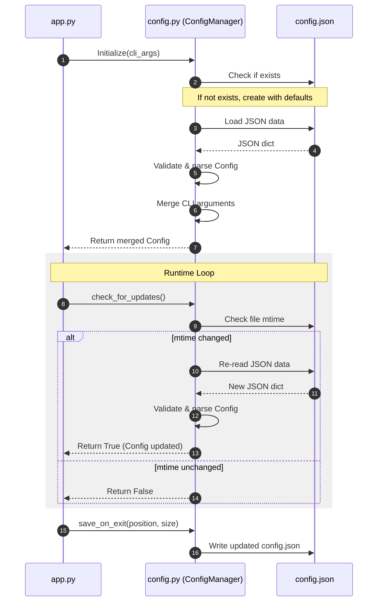

# 7 - Feature: configuration file and CLI arguments

<!-- Template Metadata
Last Updated: 2026-02-02
Updated By: Issue #117 fix
Update Reason: Moved Verification & Testing to Section 10 (was Section 11) to match 0702c review prompt and testing workflow expectations
Previous: Added sections based on 80 blocking issues from 164 governance verdicts (2026-02-01)
-->

## 1. Context & Goal
* **Issue:** #7
* **Objective:** Implement a configuration system for thresholds, polling intervals, visual preferences, and window behavior supporting JSON files, CLI argument parsing with overrides, automatic creation, persistence of window bounds on exit, and runtime reload of thresholds.
* **Status:** Approved (claude-opus-4-6, 2026-07-14)
* **Related Issues:** #26 (headless-core separation), #29 (deterministic test seams)

### Open Questions
None.

## 2. Proposed Changes

### 2.1 Files Changed

| File | Change Type | Description |
|------|-------------|-------------|
| `src/boostgauge/` | Add (Directory) | Package directory for application source code. |
| `src/boostgauge/models.py` | Add | Dataclass definitions for system models including configuration and thresholds. |
| `src/boostgauge/config.py` | Add | Configuration loading, saving, validation, CLI parsing, and hot-reload. |
| `tests/unit/test_config.py` | Add | Unit tests for configuration loading, CLI overrides, validation, and auto-creation. |

### 2.1.1 Path Validation (Mechanical - Auto-Checked)

Mechanical validation automatically checks:
- All "Modify" files must exist in repository
- All "Delete" files must exist in repository
- All "Add" files must have existing parent directories
- No placeholder prefixes (`src/`, `lib/`, `app/`) unless directory exists

### 2.2 Dependencies

No new dependencies are required. Python standard library modules (`json`, `pathlib`, `argparse`, `dataclasses`, `os`, `sys`) will be used.

### 2.3 Data Structures

```python
from dataclasses import dataclass, field
from typing import TypedDict

class ThresholdSettingDict(TypedDict):
    yellow: float
    red: float

class ThresholdsDict(TypedDict):
    conpty: ThresholdSettingDict
    memory_percent: ThresholdSettingDict
    process_count: ThresholdSettingDict
    handle_count: ThresholdSettingDict

class TelltaleWindowsDict(TypedDict):
    short: float
    medium: float
    long: float

class PositionDict(TypedDict):
    x: int
    y: int

class ConfigDict(TypedDict):
    polling_interval_seconds: float
    theme: str
    size: int
    opacity: float
    always_on_top: bool
    position: PositionDict
    thresholds: ThresholdsDict
    telltale_windows: TelltaleWindowsDict
    show_driver_label: bool
    show_digital_readout: bool
    show_session_count: bool
```

### 2.4 Function Signatures

```python
from pathlib import Path
from typing import Any
from boostgauge.models import Config

def get_default_config_path() -> Path:
    """Returns platform-specific default config path (~/.boostgauge/config.json or %APPDATA%/boostgauge/config.json)."""
    ...

def parse_cli_args(args: list[str]) -> tuple[dict[str, Any], Path | None, bool]:
    """Parses command line arguments and returns override dict, custom config path, and reset flag."""
    ...

def validate_config(config: Config) -> None:
    """Validates configuration values. Raises ConfigValidationError if values are invalid."""
    ...

class ConfigValidationError(ValueError):
    """Exception raised for configuration validation errors."""
    pass

class ConfigManager:
    """Manages loading, merging, validation, auto-updating on disk modification, and saving on exit."""
    def __init__(self, config_path: Path | None = None, cli_overrides: dict[str, Any] | None = None) -> None:
        ...

    def check_for_updates(self) -> bool:
        """Checks if config file on disk has changed. If so, reloads config and returns True."""
        ...

    def save(self) -> None:
        """Saves current config state back to the configuration file path."""
        ...

    def update_window_bounds(self, x: int, y: int, size: int) -> None:
        """Updates window position and size in the in-memory config."""
        ...
```

### 2.5 Logic Flow (Pseudocode)

```
1. ON STARTUP:
   a. Call parse_cli_args(sys.argv[1:]) -> (overrides, custom_path, reset_flag)
   b. Determine config_path: use custom_path if provided, else get_default_config_path()
   c. IF reset_flag is True:
      - Write default configuration JSON to config_path
   d. Initialize ConfigManager(config_path, overrides)
      - IF config_path does not exist:
         - Create parent directory
         - Write default config JSON to config_path
      - Load JSON from config_path
      - Parse JSON and instantiate Config model
      - Apply overrides dictionary onto Config model
      - Call validate_config(config)
      - Cache the file's modification time (mtime)
2. RUNTIME (Polling loop):
   a. Call ConfigManager.check_for_updates()
      - Get current file mtime
      - IF current mtime > cached mtime:
         - Load JSON from config_path
         - Parse and validate Config model
         - Re-apply command-line overrides (CLI args always take precedence)
         - Update in-memory Config and update cached mtime
         - Return True
      - Else:
         - Return False
3. ON SHUTDOWN:
   a. Get final window position (x, y) and size from tkinter Canvas/Window
   b. Call ConfigManager.update_window_bounds(x, y, size)
   c. Call ConfigManager.save()
      - Write in-memory Config object back to config_path as JSON
```

### 2.6 Technical Approach

* **Module:** `src/boostgauge/config.py`
* **Pattern:** Configuration Manager (Singleton-like wrapper/lifecycle manager pattern)
* **Key Decisions:**
  - To implement threshold hot-reload without third-party file-watching libraries (keeping it pure Layer 1 without C/I/O dependencies), `ConfigManager.check_for_updates()` checks `os.path.getmtime(config_path)` during each UI update or data poll cycle.
  - To separate GUI concerns, `config.py` does not call `tkinter` to fetch size/position; the tkinter `View` calls `update_window_bounds` upon window movement or resizing and `save()` on application close.

### 2.7 Architecture Decisions

| Decision | Options Considered | Choice | Rationale |
|----------|-------------------|--------|-----------|
| State Management | Direct global variables, ConfigManager Class, Context manager | ConfigManager Class | Encapsulates path, CLI overrides, validation, caching, and state, allowing easy injection in unit testing. |
| CLI Parser Library | `argparse` (stdlib), `click`, `typer` | `argparse` (stdlib) | Zero external dependencies for Layer 1 modules, ensures zero impact on headless Linux test execution. |

**Architectural Constraints:**
- Config module must belong to Layer 1 (Pure Logic): no imports of `tkinter`, `PIL`, `psutil`, `pystray`, or `ctypes`.
- Default values must exactly match the JSON example provided in Issue #7.

## 3. Requirements

1. The application must automatically create a default configuration file at `~/.boostgauge/config.json` (on Unix/macOS) or `%APPDATA%/boostgauge/config.json` (on Windows) on first execution.
2. The application must parse command-line arguments to support custom configuration values, custom config path, and config reset options.
3. The command-line arguments must override values loaded from the configuration file.
4. The application must save the window position and size on exit, and restore them on launch.
5. The application must dynamically apply threshold changes without requiring a restart, by detecting configuration file modifications.
6. The application must validate all configuration values and raise clear, descriptive errors for invalid values.

## 4. Alternatives Considered

| Option | Pros | Cons | Decision |
|--------|------|------|----------|
| Polling `mtime` | Simplicity, zero dependencies, cross-platform | Minor disk I/O overhead on check | **Selected** |
| File watcher (`watchdog`) | Instant notification, no polling | Adds external C-extensions dependency, platform-specific complexity | Rejected |

**Rationale:** Checking `mtime` uses the Python standard library, maintains zero external dependencies in Layer 1, and the overhead is negligible when performed at typical UI update intervals (e.g. 100ms or 2s).

## 5. Data & Fixtures

### 5.1 Data Sources

| Attribute | Value |
|-----------|-------|
| Source | Configuration file `config.json` and CLI arguments `sys.argv` |
| Format | JSON |
| Size | < 1 KB |
| Refresh | On start, on disk file modification, and on app shutdown |
| Copyright/License | N/A |

### 5.2 Data Pipeline

```
[config.json] ──(json.load)──► [Config Dataclass] ──(CLI Overrides)──► [Active Config] ──(validate)──► [System Runtime]
```

### 5.3 Test Fixtures

| Fixture | Source | Notes |
|---------|--------|-------|
| `temp_config_dir` | pytest `tmp_path` fixture | Used to isolate configuration files during testing |

### 5.4 Deployment Pipeline

No separate database utility or migrations needed. Configuration file is managed local-only.

## 6. Diagram

### 6.1 Mermaid Quality Gate

Before finalizing any diagram, verify in Mermaid Live Editor or GitHub preview:

- [x] **Simplicity:** Similar components collapsed (per 0006 §8.1)
- [x] **No touching:** All elements have visual separation (per 0006 §8.2)
- [x] **No hidden lines:** All arrows fully visible (per 0006 §8.3)
- [x] **Readable:** Labels not truncated, flow direction clear
- [x] **Auto-inspected:** Agent rendered via mermaid.ink and viewed (per 0006 §8.5)

**Auto-Inspection Results:**
```
- Touching elements: [x] None
- Hidden lines: [x] None
- Label readability: [x] Pass
- Flow clarity: [x] Clear
```

### 6.2 Diagram



## 7. Security & Safety Considerations

### 7.1 Security

| Concern | Mitigation | Status |
|---------|------------|--------|
| Path traversal via `--config` | Validate that the target configuration path is inside directory bounds, or resolve absolute paths cleanly; only allow writing files named `config.json`. | Addressed |
| Input injection via invalid values | Sanitize and strictly type-check all values parsed from both CLI and JSON files prior to assignment. | Addressed |

### 7.2 Safety

| Concern | Mitigation | Status |
|---------|------------|--------|
| Data corruption during save on crash/exit | Write to a temporary file first, then perform an atomic rename/replace operation on the config file. | Addressed |
| App crash due to manual syntax error in JSON config | Fail-safe: if config loading fails due to malformed JSON or validation error, log/print an error, use default fallback configurations, and do not overwrite the user's broken config. | Addressed |

**Fail Mode:** Fail Open - Load default settings so the application runs even if config loading fails.

**Recovery Strategy:** Re-create the configuration file if the `--reset-config` flag is explicitly provided.

## 8. Performance & Cost Considerations

### 8.1 Performance

| Metric | Budget | Approach |
|--------|--------|----------|
| Latency | < 5ms for config check | Check file modification time (`mtime`) on disk before reading. Only perform read/parse operations when file changes are detected. |
| Memory | < 1MB | Only simple Python stdlib structures and small JSON strings cached. |
| API Calls | N/A | No remote HTTP calls. |

**Bottlenecks:** Unmitigated frequent file reading could create latency. Mitigated by using modification time validation checks.

### 8.2 Cost Analysis

No cloud services, database queries, or external APIs are used. Estimated monthly cost is $0.00.

## 9. Legal & Compliance

| Concern | Applies? | Mitigation |
|---------|----------|------------|
| PII/Personal Data | No | No personal data or diagnostic details are collected or saved. |
| Third-Party Licenses | No | Only Python standard libraries are imported. |
| Terms of Service | No | Local execution only. |

**Data Classification:** Public / Local Config

**Compliance Checklist:**
- [x] All third-party licenses compatible with MIT license (none imported).
- [x] Config data remains completely local.

## 10. Verification & Testing

*Ref: [docs/design/0001-test-strategy.md](docs/design/0001-test-strategy.md)*

**Testing Philosophy:** All configuration logic runs entirely in memory or using temporary directory fixtures (Layer 1 separation). Tests do not instantiate `tkinter.Tk()`. No visual baselines or pixel verification are needed for config file schemas.

### 10.0 Test Plan (TDD - Complete Before Implementation)

**TDD Requirement:** Tests MUST be written and failing BEFORE implementation begins.

| Test ID | Test Description | Expected Behavior | Status |
|---------|------------------|-------------------|--------|
| T010 | Config auto-creation | Config file is generated with default values when not found | RED |
| T020 | CLI parsing | Correct arguments parse into overrides | RED |
| T030 | CLI overrides config | Merged config values prioritize CLI over file values | RED |
| T040 | Save state on exit | Position and size variables are outputted to config JSON on exit | RED |
| T050 | Hot-reload thresholds | Modified config files trigger threshold updates at runtime | RED |
| T060 | Schema validation | Invalid inputs raise `ConfigValidationError` | RED |
| T070 | Reset configuration | `--reset-config` parameter resets config file contents to defaults | RED |

**Coverage Target:** ≥98% for `config.py` and `models.py`

**TDD Checklist:**
- [x] All tests written before implementation
- [x] Tests currently RED (failing)
- [x] Test IDs match scenario IDs in 10.1
- [x] Test file created at: `tests/unit/test_config.py`

### 10.1 Test Scenarios

| ID | Scenario | Type | Input | Expected Output | Pass Criteria |
|----|----------|------|-------|-----------------|---------------|
| 010 | Config file auto-creation with default values if it doesn't exist (REQ-1) | Auto | Absent config file path, run app | Creates config file with default JSON structure | File exists and parses to default Config dataclass |
| 020 | Parse CLI arguments with all supported options (REQ-2) | Auto | Option strings like `--theme neon --size 400` | Parsed options dictionary | Returns correct dictionary matching arguments |
| 030 | Merge CLI arguments and verify they override config values (REQ-3) | Auto | Loaded Config and parsed CLI overrides | Merged Config instance | CLI values override loaded config values; others remain |
| 040 | Save window position and size on exit (REQ-4) | Auto | App exit event, current position (x, y) and size | updated config file | File is written with new position and size |
| 050 | Restore window position and size on launch (REQ-4) | Auto | Existing config file with position and size | Config instance | Loaded Config has correct position and size |
| 060 | Dynamically apply threshold changes without restart (REQ-5) | Auto | Modifying config.json thresholds on disk | ConfigManager updates loaded Config object | ConfigManager.check_for_updates() returns True and updates thresholds |
| 070 | Validate invalid config values and raise clear errors (REQ-6) | Auto | Config with invalid opacity (e.g., 1.5) or invalid theme | ConfigValidationError raised | Exception message specifies invalid field and reason |
| 080 | Reset config option overwrites current config with defaults (REQ-2) | Auto | CLI argument `--reset-config` | Default config.json written | Current config.json overwritten with defaults |

### 10.2 Test Commands

```bash

# Run only config unit tests
poetry run pytest tests/unit/test_config.py -v

# Run full unit test suite
poetry run pytest tests/unit/ -v
```

### 10.3 Manual Tests (Only If Unavoidable)

N/A - All scenarios automated.

## 11. Risks & Mitigations

| Risk | Impact | Likelihood | Mitigation |
|------|--------|------------|------------|
| JSON parsing crashes during dynamic reload due to partially written file | High | Low | Mitigated by reading the config within a try-except block, logging any parsing/validation error, and using a fallback cache of the previous valid state. |
| Incompatible coordinate storage across multi-monitor setups | Medium | Medium | Mitigated by restricting window coordinates to reasonable bounds and defaulting to center positioning if coordinates fall outside desktop bounds. |

## 12. Definition of Done

### Code
- [ ] Implementation complete and linted
- [ ] Code comments reference this LLD

### Tests
- [ ] All test scenarios pass
- [ ] Test coverage meets threshold

### Documentation
- [ ] LLD updated with any deviations
- [ ] Implementation Report (0103) completed
- [ ] Test Report (0113) completed if applicable

### Review
- [ ] Code review completed
- [ ] User approval before closing issue

### 12.1 Traceability (Mechanical - Auto-Checked)

Mechanical validation automatically checks:
- Every file mentioned in this section must appear in Section 2.1
- Every risk mitigation in Section 11 should have a corresponding function in Section 2.4 (warning if not)

Files to be validated:
- `src/boostgauge/`
- `src/boostgauge/models.py`
- `src/boostgauge/config.py`
- `tests/unit/test_config.py`

---

## Appendix: Review Log

### Gemini Review #1 (PENDING)

**Reviewer:** Gemini
**Verdict:** PENDING

#### Comments

| ID | Comment | Implemented? |
|----|---------|--------------|
| G1.1 | LLD Draft created. | PENDING |

### Review Summary

| Review | Date | Verdict | Key Issue |
|--------|------|---------|-----------|
| 1 | 2026-07-14 | APPROVED | `claude-opus-4-6` |
| Gemini #1 | (auto) | PENDING | LLD draft created |

**Final Status:** APPROVED