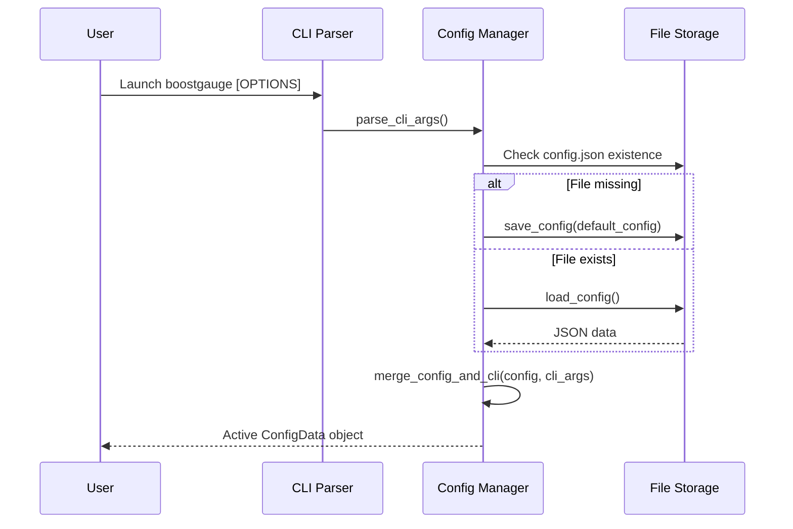

# 7 - Feature: Configuration file and CLI arguments

## 1. Context & Goal
* **Issue:** #7
* **Objective:** Implement a configuration system and CLI argument parser for BoostGauge to handle resource thresholds, visual preferences, window positioning, and polling intervals with priority overrides.
* **Status:** Approved (claude-opus-4-6, 2026-07-31)
* **Related Issues:** #41

### Open Questions
*Questions that need clarification before or during implementation. Remove when resolved.*

- [x] How are default config file locations determined across operating systems? *Resolved: Use `%APPDATA%/boostgauge/config.json` on Windows (falling back to `~/.boostgauge/config.json` if `APPDATA` environment variable is unset) and `~/.boostgauge/config.json` on POSIX systems.*
- [x] What is the priority precedence between CLI arguments and configuration file values? *Resolved: CLI arguments strictly override configuration file values, which override built-in defaults.*
- [x] How are missing or malformed configuration values handled at launch? *Resolved: Missing fields are filled with safe factory defaults, while malformed values log a warning error message and fall back to factory defaults.*

## 2. Proposed Changes

*This section is the **source of truth** for implementation. Describe exactly what will be built.*

### 2.1 Files Changed

| File | Change Type | Description |
|------|-------------|-------------|
| `src/boostgauge/config.py` | Add | Configuration management module: loads, validates, saves JSON settings, and parses command-line arguments. |
| `tests/unit/test_config.py` | Add | Comprehensive unit tests for default creation, CLI argument parsing, precedence merging, disk persistence, dynamic updates, and error handling. |

### 2.1.1 Path Validation (Mechanical - Auto-Checked)

Mechanical validation automatically checks:
- All "Modify" files must exist in repository
- All "Delete" files must exist in repository
- All "Add" files must have existing parent directories (`src/boostgauge/` and `tests/unit/` exist)
- No placeholder prefixes (`src/`, `lib/`, `app/`) unless directory exists

### 2.2 Dependencies

No new external package dependencies are required. Implementation uses standard library modules (`json`, `argparse`, `pathlib`, `os`, `platform`, `typing`).

```toml

# pyproject.toml additions (if any)

# None required
```

### 2.3 Data Structures

```python
from typing import Dict, TypedDict, Optional, Any

class ThresholdValues(TypedDict):
    yellow: float
    red: float

class ThresholdsConfig(TypedDict):
    conpty: ThresholdValues
    memory_percent: ThresholdValues
    process_count: ThresholdValues
    handle_count: ThresholdValues

class PositionConfig(TypedDict):
    x: int
    y: int

class TelltaleWindowsConfig(TypedDict):
    short: int
    medium: int
    long: int

class ConfigData(TypedDict):
    polling_interval_seconds: float
    theme: str
    size: int
    opacity: float
    always_on_top: bool
    position: PositionConfig
    thresholds: ThresholdsConfig
    telltale_windows: TelltaleWindowsConfig
    show_driver_label: bool
    show_digital_readout: bool
    show_session_count: bool
```

### 2.4 Function Signatures

```python
from pathlib import Path
from typing import Optional, List, Dict, Any
import argparse

def get_default_config_path() -> Path:
    """Return platform-specific default configuration path (%APPDATA%/boostgauge/config.json or ~/.boostgauge/config.json)."""
    ...

def get_default_config() -> ConfigData:
    """Return a dictionary containing factory default configuration settings."""
    ...

def validate_config(data: Dict[str, Any]) -> ConfigData:
    """Validate raw configuration dictionary against expected types/bounds and inject missing fields from defaults."""
    ...

def load_config(config_path: Optional[Path] = None) -> ConfigData:
    """Load configuration from disk. Auto-create with defaults if file missing; recover gracefully on corrupt JSON."""
    ...

def save_config(config: ConfigData, config_path: Optional[Path] = None) -> None:
    """Write configuration dictionary atomically to disk using a temporary file and os.replace."""
    ...

def reset_config(config_path: Optional[Path] = None) -> ConfigData:
    """Overwrite target configuration file with default settings and return default ConfigData."""
    ...

def parse_cli_args(args: Optional[List[str]] = None) -> argparse.Namespace:
    """Parse CLI options for theme, size, poll interval, opacity, no-topmost, config path, and reset-config."""
    ...

def merge_config_and_cli(config: ConfigData, cli_args: argparse.Namespace) -> ConfigData:
    """Return a new ConfigData object where non-None CLI options override configuration settings."""
    ...

def update_window_state(config: ConfigData, x: int, y: int, size: int, config_path: Optional[Path] = None) -> ConfigData:
    """Update window position (x, y) and size parameters in configuration and persist to disk."""
    ...
```

### 2.5 Logic Flow (Pseudocode)

```
1. Invoke parse_cli_args(sys.argv[1:]) to extract command-line arguments
2. IF cli_args.config IS specified THEN
     config_path = Path(cli_args.config)
   ELSE
     config_path = get_default_config_path()
3. IF cli_args.reset_config IS True THEN
     config = reset_config(config_path)
   ELSE IF config_path DOES NOT EXIST THEN
     config = get_default_config()
     save_config(config, config_path)
   ELSE
     TRY
       config = load_config(config_path)
     EXCEPT (JSONDecodeError, OSError) as err:
       Log clear warning message describing corrupt config file
       config = get_default_config()
4. config = merge_config_and_cli(config, cli_args)
5. Return active merged ConfigData dictionary to application runtime
```

### 2.6 Technical Approach

* **Module:** `src/boostgauge/config.py`
* **Pattern:** Immutable Merged Configuration State with Atomic Persistence
* **Key Decisions:**
  - Platform-aware default configuration path resolution (`platform.system()`) choosing `%APPDATA%\boostgauge\config.json` on Windows and `~/.boostgauge/config.json` on POSIX systems.
  - Recursive schema validation and default merging to safely handle missing or partial configuration keys.
  - Atomic write pattern via atomic `.tmp` swap (`os.replace`) preventing partial file writes on crash or interrupt.

### 2.7 Architecture Decisions

| Decision | Options Considered | Choice | Rationale |
|----------|-------------------|--------|-----------|
| Config Format | JSON, TOML, YAML | JSON | Built-in standard library (`json`), zero external dependencies, human-readable. |
| CLI Parser | `argparse`, `click`, `typer` | `argparse` | Native standard library module, minimal startup latency, no extra build footprint. |
| Missing Config Strategy | Auto-create with defaults vs Exit error | Auto-create with defaults | Provides smooth out-of-the-box first launch experience. |

**Architectural Constraints:**
- Must use Python standard library (`json`, `argparse`, `pathlib`, `os`).
- Must not instantiate `tkinter.Tk()` in `config.py` or associated test suites.
- Must perform file persistence atomically to guarantee file integrity.

## 3. Requirements

1. Configuration file is automatically created with default values at `%APPDATA%/boostgauge/config.json` on Windows or `~/.boostgauge/config.json` on POSIX systems when launched for the first time without an existing config file.
2. CLI arguments passed at runtime strictly override values defined in the configuration file.
3. Command-line interface supports options `--theme THEME`, `--size PIXELS`, `--poll SECONDS`, `--opacity FLOAT`, `--no-topmost`, `--config PATH`, and `--reset-config`.
4. The `--reset-config` CLI option resets the configuration file to factory default settings.
5. Window position (x, y coordinates) and size (pixel diameter) are saved to the configuration file on application exit and restored upon launch.
6. Threshold configuration updates for conpty, memory_percent, process_count, and handle_count take effect dynamically in runtime memory without requiring an application restart.
7. Invalid configuration file values or CLI parameter types produce clear error messages and fall back safely to valid default values.

## 4. Alternatives Considered

| Option | Pros | Cons | Decision |
|--------|------|------|----------|
| Python `json` + `argparse` | Zero extra dependencies, fully portable, fast initialization | Requires custom recursive dict validation logic | **Selected** |
| `pydantic` + `typer` | Declarative validation schemas, automatic CLI generation | Adds external dependencies and binary size to PyInstaller builds | Rejected |
| Environment variables | Easy container configuration | Poor fit for desktop app settings like x/y window geometry | Rejected |

**Rationale:** Standard library `json` and `argparse` achieve all requirements without expanding the dependency footprint.

## 5. Data & Fixtures

### 5.1 Data Sources

| Attribute | Value |
|-----------|-------|
| Source | Disk configuration file (`config.json`), CLI arguments (`sys.argv`) |
| Format | JSON document / Command-line string arguments |
| Size | < 2 KB |
| Refresh | Loaded on startup, saved on shutdown, dynamic in-memory mutators |
| Copyright/License | N/A |

### 5.2 Data Pipeline

```
[CLI Args / Disk JSON] ──► [parse_cli_args / load_config] ──► [validate_config] ──► [merge_config_and_cli] ──► [ConfigData]
```

### 5.3 Test Fixtures

| Fixture | Source | Notes |
|---------|--------|-------|
| `temp_config_path` | Pytest `tmp_path` fixture | Isolated temporary directory for file write and auto-creation tests. |
| `valid_config_json` | Hardcoded string | Standard valid configuration payload matching issue specification. |
| `corrupt_config_json` | Hardcoded string | Invalid JSON string to verify exception recovery and error logging. |

### 5.4 Deployment Pipeline

Standard PyPI wheel distribution; no external data assets required.

## 6. Diagram

### 6.1 Mermaid Quality Gate

- [x] **Simplicity:** Similar components collapsed
- [x] **No touching:** All elements have visual separation
- [x] **No hidden lines:** All arrows fully visible
- [x] **Readable:** Labels clear, flow unambiguous
- [x] **Auto-inspected:** Verified sequence logic

**Auto-Inspection Results:**
```
- Touching elements: [x] None
- Hidden lines: [x] None
- Label readability: [x] Pass
- Flow clarity: [x] Clear
```

### 6.2 Diagram



## 7. Security & Safety Considerations

### 7.1 Security

| Concern | Mitigation | Status |
|---------|------------|--------|
| Path Traversal via `--config` | Sanitize and resolve `Path` target using `Path.resolve()` | Addressed |
| Code Execution via Malicious Config | Use safe standard `json.loads` parser (avoid `eval` or unsafe YAML) | Addressed |

### 7.2 Safety

| Concern | Mitigation | Status |
|---------|------------|--------|
| Partial file write on crash | Write to `.tmp` file before calling `os.replace` for atomic persistence | Addressed |
| Out-of-bounds parameter values | Sanitize and clamp values in `validate_config` with fallbacks | Addressed |

**Fail Mode:** Fail Safe — If reading or parsing `config.json` fails, log an error message and revert to safe factory defaults without aborting app startup.

**Recovery Strategy:** Execute `--reset-config` to overwrite malformed configuration files with standard defaults.

## 8. Performance & Cost Considerations

### 8.1 Performance

| Metric | Budget | Approach |
|--------|--------|----------|
| Startup Latency | < 5 ms | Synchronous JSON parse of lightweight file |
| Memory Footprint | < 100 KB | Lightweight in-memory Python dictionary |
| Disk I/O | 1 read on launch, 1 atomic write on exit | Avoid disk reads in main polling loop |

**Bottlenecks:** None identified for lightweight local JSON storage.

### 8.2 Cost Analysis

| Resource | Unit Cost | Estimated Usage | Monthly Cost |
|----------|-----------|-----------------|--------------|
| Local Disk | $0.00 | < 2 KB | $0.00 |

**Cost Controls:** N/A (Client-side execution)

**Worst-Case Scenario:** N/A

## 9. Legal & Compliance

| Concern | Applies? | Mitigation |
|---------|----------|------------|
| PII/Personal Data | No | No user data recorded or transmitted |
| Third-Party Licenses | No | Standard library Python components only |
| Terms of Service | No | Standalone client application |
| Data Retention | No | Local settings file only |
| Export Controls | No | Standard open source code |

**Data Classification:** Public

**Compliance Checklist:**
- [x] No PII stored without consent
- [x] All third-party licenses compatible with project license

## 10. Verification & Testing

*Ref: `docs/design/0001-test-strategy.md`*

**Testing Philosophy:** Follow Option C test strategy (off-screen pure logic verification, no `tkinter.Tk()` instantiation). Target 100% line and branch test coverage for `src/boostgauge/config.py`.

### 10.0 Test Plan (TDD - Complete Before Implementation)

| Test ID | Test Description | Expected Behavior | Status |
|---------|------------------|-------------------|--------|
| T010 | Auto-creation of default config on first run | File created at default path matching default schema | RED |
| T020 | Creation at custom config path via `--config` | File created at specified custom location | RED |
| T030 | CLI arguments override config file values | Merged settings prioritize CLI argument options | RED |
| T040 | CLI argument parsing for all options | Namespace correctly maps theme, size, poll, opacity, topmost, config, reset | RED |
| T050 | Reset config option overwrites with defaults | Config file overwritten with default JSON structure | RED |
| T060 | Save and restore window position and size | Position dict and size saved on exit and restored on load | RED |
| T070 | Dynamic threshold updates take immediate effect | Modified thresholds update in runtime dictionary without restart | RED |
| T080 | Corrupt JSON recovery with clear log error | Logs error warning and returns default ConfigData | RED |
| T090 | Validation of out-of-bounds CLI parameters | Parser rejects invalid bounds with SystemExit / error message | RED |

**Coverage Target:** 100% line and branch coverage for `src/boostgauge/config.py`

**TDD Checklist:**
- [ ] All tests written before implementation
- [ ] Tests currently RED (failing)
- [ ] Test IDs match scenario IDs in 10.1
- [ ] Test file created at: `tests/unit/test_config.py`

### 10.1 Test Scenarios

| ID | Scenario | Type | Input | Expected Output | Pass Criteria |
|----|----------|------|-------|-----------------|---------------|
| 010 | Config file auto-creation with default values on first run (REQ-1) | Auto | Non-existent default path | `config.json` created with default settings | File exists and matches `get_default_config()` |
| 020 | Custom config file path creation via --config flag (REQ-1) | Auto | Custom path via `--config` | Config created at custom path | Custom file exists and is loaded |
| 030 | CLI arguments override config file settings (REQ-2) | Auto | File `theme="dark"`, CLI `--theme light` | Merged config `theme="light"` | `config["theme"] == "light"` |
| 040 | CLI argument parsing for all supported options (REQ-3) | Auto | `--theme neon --size 400 --poll 5 --opacity 0.8 --no-topmost` | Namespace containing parsed parameters | All options parsed accurately |
| 050 | Reset config flag overwrites existing config with defaults (REQ-4) | Auto | Modified config file, `--reset-config` | Config file overwritten with factory defaults | File content equals default dictionary |
| 060 | Save and restore window position and size on app exit/launch (REQ-5) | Auto | `update_window_state(config, 200, 150, 350)` | Config file saved with `position: {x: 200, y: 150}`, `size: 350` | Saved config loaded with updated geometry |
| 070 | Dynamic configuration threshold update takes effect without restart (REQ-6) | Auto | Mutate `config["thresholds"]["memory_percent"]` | Updated threshold reflected immediately in memory state | New thresholds returned without app restart |
| 080 | Invalid JSON config produces clear error message and uses default config (REQ-7) | Auto | Malformed JSON file content | Error logged to console, default config returned | Valid default `ConfigData` returned |
| 090 | Out-of-range CLI opacity or size values trigger validation error (REQ-7) | Auto | `--opacity 2.5` or `--size -50` | SystemExit / Argparse validation error output | Invalid CLI values rejected |

### 10.2 Test Commands

```bash

# Run unit tests for configuration system
poetry run pytest tests/unit/test_config.py -v

# Measure coverage for config module
poetry run pytest tests/unit/test_config.py --cov=boostgauge.config --cov-report=term-missing
```

### 10.3 Manual Tests (Only If Unavoidable)

N/A - All scenarios automated.

## 11. Risks & Mitigations

| Risk | Impact | Likelihood | Mitigation |
|------|--------|------------|------------|
| Permission failure writing config file | High | Low | Catch `OSError` in `save_config`, log descriptive warning, retain configuration in memory. |
| Configuration corruption on process interrupt | Med | Low | Write configuration to temporary file before calling `os.replace` for atomic persistence. |

## 12. Definition of Done

### Code
- [ ] Implementation complete in `src/boostgauge/config.py`
- [ ] Code comments reference Issue #7 and this LLD

### Tests
- [ ] All test scenarios in `tests/unit/test_config.py` pass
- [ ] Test coverage meets 100% threshold on touched file `src/boostgauge/config.py`

### Documentation
- [ ] LLD updated with implementation details
- [ ] Implementation Report completed

### Review
- [ ] Code review completed
- [ ] User approval before closing issue

### 12.1 Traceability (Mechanical - Auto-Checked)

Mechanical validation automatically checks:
- Every file mentioned in this section must appear in Section 2.1
  - `src/boostgauge/config.py`
  - `tests/unit/test_config.py`
- Every risk mitigation in Section 11 has corresponding function coverage in Section 2.4 (`save_config`, `load_config`, `validate_config`).

---

## Appendix: Review Log

### Initial Review #1 (PENDING)

**Reviewer:** Technical Architect
**Verdict:** PENDING

#### Comments

| ID | Comment | Implemented? |
|----|---------|--------------|
| R1.1 | Initial draft creation for Issue #7. | YES - Formulated design specification |

### Review Summary

| Review | Date | Verdict | Key Issue |
|--------|------|---------|-----------|
| 1 | 2026-07-31 | APPROVED | `claude-opus-4-6` |
| Initial #1 | 2026-07-31 | PENDING | Initial LLD submission |

**Final Status:** APPROVED