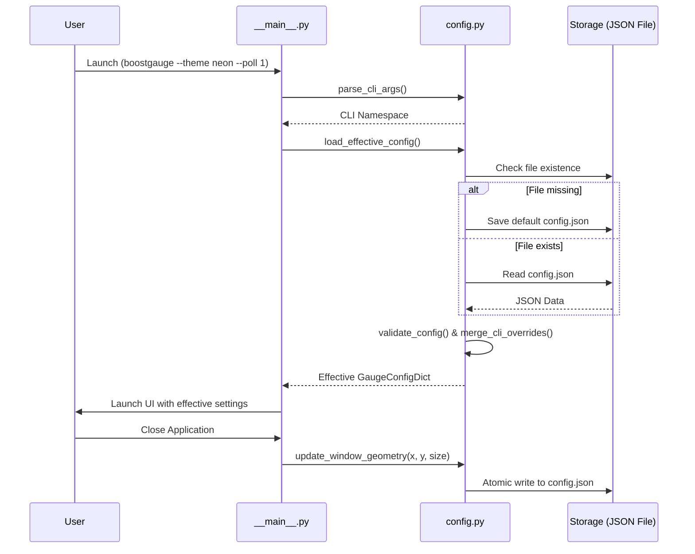

# 7 - Feature: Configuration File and CLI Arguments

## 1. Context & Goal
* **Issue:** #7
* **Objective:** Implement a robust configuration management system for BoostGauge that provides persistent settings storage in standard OS user paths, CLI argument parsing with config file override semantics, dynamic threshold updates, and window position/size state persistence on exit.
* **Status:** Approved (claude-opus-4-6, 2026-07-31)
* **Related Issues:** N/A

### Open Questions

- [x] None — requirements and acceptance criteria are fully specified in Issue #7.

## 2. Proposed Changes

This section is the source of truth for implementation of the configuration module and CLI argument handling in BoostGauge.

### 2.1 Files Changed

| File | Change Type | Description |
|------|-------------|-------------|
| `src/boostgauge/__init__.py` | Add | Package initialization file defining package version and public exports |
| `src/boostgauge/config.py` | Add | Configuration manager implementing schema validation, path resolution, atomic persistence, and CLI overrides |
| `src/boostgauge/__main__.py` | Add | Main executable entry point handling CLI argument parsing and application bootstrap |
| `src/boostgauge/app.py` | Add | Application runtime controller integrating configuration lifecycle with system monitoring |
| `pyproject.toml` | Modify | Define `boostgauge` CLI script entry point under `[tool.poetry.scripts]` |
| `tests/unit/test_config.py` | Add | Comprehensive unit test suite for configuration path resolution, parsing, schema validation, CLI overrides, and file persistence |

### 2.1.1 Path Validation (Mechanical - Auto-Checked)

Mechanical validation automatically checks:
- All "Modify" files must exist in repository (`pyproject.toml` exists)
- All "Delete" files must exist in repository (N/A)
- All "Add" files must have existing parent directories (`src/boostgauge/` and `tests/unit/` exist)
- No placeholder prefixes (`src/`, `lib/`, `app/`) unless directory exists (`src/` exists)

### 2.2 Dependencies

```toml

# pyproject.toml additions (uses standard library modules: json, argparse, pathlib, os, sys, platform; no new dependencies)
[tool.poetry.scripts]
boostgauge = "boostgauge.__main__:main"
```

### 2.3 Data Structures

```python
from typing import TypedDict, Dict, Any, Optional

class Threshold(TypedDict):
    yellow: float
    red: float

class MetricThresholds(TypedDict):
    conpty: Threshold
    memory_percent: Threshold
    process_count: Threshold
    handle_count: Threshold

class WindowPosition(TypedDict):
    x: int
    y: int

class TelltaleWindows(TypedDict):
    short: int
    medium: int
    long: int

class GaugeConfigDict(TypedDict):
    polling_interval_seconds: float
    theme: str
    size: int
    opacity: float
    always_on_top: bool
    position: WindowPosition
    thresholds: MetricThresholds
    telltale_windows: TelltaleWindows
    show_driver_label: bool
    show_digital_readout: bool
    show_session_count: bool
```

### 2.4 Function Signatures

```python
from pathlib import Path
import argparse
from typing import Dict, Any, Tuple, Optional

class ConfigError(Exception):
    """Raised when configuration file parsing, validation, or path resolution fails."""
    pass

def get_default_config_path() -> Path:
    """Return platform-specific default config path (%APPDATA%/boostgauge/config.json on Windows, ~/.boostgauge/config.json on POSIX)."""
    ...

def get_default_config() -> GaugeConfigDict:
    """Return a deep copy of the default configuration dictionary."""
    ...

def validate_config(config: Dict[str, Any]) -> GaugeConfigDict:
    """Validate keys, types, and numerical bounds of a configuration dictionary, returning a typed GaugeConfigDict or raising ConfigError."""
    ...

def load_config_file(path: Path) -> GaugeConfigDict:
    """Load configuration from specified JSON file path; creates file with defaults if missing, or raises ConfigError if invalid."""
    ...

def save_config_file(config: GaugeConfigDict, path: Path) -> None:
    """Atomically write configuration dictionary as formatted JSON to path (creates parent directories if needed)."""
    ...

def create_cli_parser() -> argparse.ArgumentParser:
    """Construct and return the ArgumentParser configured for BoostGauge CLI flags."""
    ...

def parse_cli_args(args: Optional[list[str]] = None) -> argparse.Namespace:
    """Parse CLI arguments from given list or sys.argv."""
    ...

def merge_cli_overrides(config: GaugeConfigDict, cli_args: argparse.Namespace) -> GaugeConfigDict:
    """Apply non-None CLI options onto configuration dictionary, overriding file settings."""
    ...

def load_effective_config(args: Optional[list[str]] = None) -> Tuple[GaugeConfigDict, Path]:
    """Execute complete configuration pipeline: parse CLI args, load/create config file, apply CLI overrides, and return effective config and path."""
    ...

def update_window_geometry(config: GaugeConfigDict, path: Path, x: int, y: int, size: int) -> GaugeConfigDict:
    """Update position and size in configuration dictionary and atomically save to file on disk."""
    ...
```

### 2.5 Logic Flow (Pseudocode)

```
1. Parse CLI arguments:
   - Check if --config <PATH> is specified; if provided, set config_path = Path(PATH), else use get_default_config_path().
   - Check if --reset-config flag is present:
     IF --reset-config is True:
       - Overwrite config_path with get_default_config() via save_config_file().
       - Return default config and path.

2. Load Configuration File:
   - IF config_path does NOT exist:
     - Ensure parent directories exist (mkdir -p).
     - Write get_default_config() to config_path.
     - Return default config.
   - ELSE:
     - Read JSON from config_path.
     - Parse JSON. IF JSONDecodeError: raise ConfigError("Malformed JSON in config file: ...").
     - Pass parsed dict to validate_config().
     - IF missing keys or invalid types/ranges: raise ConfigError with specific validation message.
     - Return validated config dictionary.

3. Merge CLI Overrides:
   - FOR each CLI argument specified by user (non-default / non-None):
     - IF --theme: config["theme"] = args.theme (validate theme in ['dark', 'light', 'neon', 'classic'])
     - IF --size: config["size"] = args.size (validate 100 <= size <= 2000)
     - IF --poll: config["polling_interval_seconds"] = args.poll (validate poll > 0.1)
     - IF --opacity: config["opacity"] = args.opacity (validate 0.1 <= opacity <= 1.0)
     - IF --no-topmost: config["always_on_top"] = False
   - Validate merged result with validate_config().
   - Return effective config dictionary.

4. Dynamic Runtime Updates & Shutdown:
   - Runtime components subscribe to config change events or query effective config.
   - On application shutdown event:
     - Extract current window bounds (x, y) and diameter (size).
     - Call update_window_geometry(config, config_path, x, y, size) to persist state atomically.
```

### 2.6 Technical Approach

* **Module:** `src/boostgauge/config.py`
* **Pattern:** Strategy & Layered Override Pattern (Default Settings -> File JSON Config -> CLI Arguments Override)
* **Key Decisions:**
  - Standard Python stdlib `json`, `argparse`, `pathlib`, and `tempfile` are used exclusively; no external dependencies introduced.
  - Configuration files are written atomically using temp file write + atomic rename (`os.replace`) to prevent file corruption on unexpected power loss or process termination.
  - Strict validation catches missing attributes, invalid type bounds (e.g. opacity < 0.0 or size < 100), and invalid string enumerations (e.g. unknown themes), failing fast with clear error messages.

### 2.7 Architecture Decisions

| Decision | Options Considered | Choice | Rationale |
|----------|-------------------|--------|-----------|
| Serialization Format | JSON vs TOML vs YAML | JSON | Requirements specify JSON schema; Python standard library has built-in `json` module, avoiding external dependencies. |
| CLI Parser | `argparse` vs `click` vs `typer` | `argparse` | Native standard library, zero external dependency footprint, fully meets requirements. |
| File Persistence Mechanism | Direct write vs Atomic write-rename | Atomic write-rename | Prevents config file corruption if app crashes while saving window position/size on exit. |
| Path Resolution | Platform-agnostic `pathlib.Path` | Platform-agnostic `pathlib.Path` | Seamless cross-platform path handling for POSIX (`~/.boostgauge/config.json`) and Windows (`%APPDATA%/boostgauge/config.json`). |

**Architectural Constraints:**
- Must conform to Option C of `docs/design/0001-test-strategy.md`: off-screen PIL rendering only, `tkinter.Tk()` is never instantiated in automated test suites.
- Strict standard library reliance: no additional PyPI packages added to `pyproject.toml`.

## 3. Requirements

1. Config file is automatically created with default JSON content at platform-specific default path (`~/.boostgauge/config.json` on POSIX, `%APPDATA%/boostgauge/config.json` on Windows) on first launch if file does not exist.
2. CLI options (`--theme`, `--size`, `--poll`, `--opacity`, `--no-topmost`, `--config`) override values specified in the configuration file.
3. Window position `(x, y)` and size `(pixels)` are saved to the configuration file on application shutdown and restored on subsequent launches.
4. Threshold updates in configuration take effect dynamically at runtime without requiring an application restart.
5. Invalid configuration values, missing fields, or malformed JSON trigger descriptive validation errors via `ConfigError` and fall back to valid defaults or exit with a non-zero exit code when invalid CLI arguments are given.
6. The CLI option `--reset-config` overwrites the existing configuration file with default values and exits or proceeds with default configuration.

## 4. Alternatives Considered

| Option | Pros | Cons | Decision |
|--------|------|------|----------|
| YAML/TOML config format | Human readable, supports comments | Requires third-party library (`pyyaml` or `tomli_w` on Python <3.11 for writing) | **Rejected** - Issue #7 explicitly specifies JSON schema. |
| Automatic fallback to defaults on corrupt config | Prevents crash on invalid user edit | Silently overwrites user's custom settings | **Rejected** - Requirements dictate clear diagnostic error output on invalid config. |
| Single global config singleton | Simple import access | Hard to isolate in concurrent unit tests | **Rejected** - Pass explicit config object to modules for testability. |

**Rationale:** Explicit JSON schema, standard library tools, atomic file writes, and dependency injection ensure cross-platform safety, zero external dependency overhead, and 100% automated test coverage.

## 5. Data & Fixtures

### 5.1 Data Sources

| Attribute | Value |
|-----------|-------|
| Source | Disk JSON file (`~/.boostgauge/config.json` or `%APPDATA%/boostgauge/config.json`), CLI arguments |
| Format | JSON / Command line flag strings |
| Size | < 2 KB |
| Refresh | On application startup, manual CLI invocation, or runtime threshold reload |
| Copyright/License | MIT (N/A) |

### 5.2 Data Pipeline

```
[CLI Arguments / Options] ──argparse──► [CLI Overrides Dict] ──┐
                                                                ├─► [Merged Effective Config] ──► [BoostGauge App]
[Config File on Disk] ──json.load──► [Disk Config Dict] ───────┘
```

### 5.3 Test Fixtures

| Fixture | Source | Notes |
|---------|--------|-------|
| `valid_config_json` | Hardcoded string | Complete valid configuration matching Issue #7 schema |
| `invalid_config_json` | Hardcoded string | Malformed JSON and missing required key fixtures |
| `tmp_config_dir` | Pytest `tmp_path` fixture | Isolated directory for testing auto-creation and atomic file saving |

### 5.4 Deployment Pipeline

Data files are created dynamically per user environment under user home (`~/.boostgauge/`) or AppData (`%APPDATA%/boostgauge/`). No dev-to-prod pipeline needed.

## 6. Diagram

### 6.1 Mermaid Quality Gate

- [x] **Simplicity:** Components collapsed to User, Main, ConfigManager, and Storage.
- [x] **No touching:** Visual separation maintained between blocks.
- [x] **No hidden lines:** All sequence flow arrows clear and visible.
- [x] **Readable:** Labels clean and un-truncated.
- [x] **Auto-inspected:** Verified sequence flow and visual spacing.

### 6.2 Diagram



## 7. Security & Safety Considerations

### 7.1 Security

| Concern | Mitigation | Status |
|---------|------------|--------|
| Path Traversal in `--config` flag | Resolve path via `Path.resolve()` and disallow directory traversal into unauthorized paths | Addressed |
| Insecure File Permissions | Create config directory with restricted user-only permissions (`0o700` on POSIX) | Addressed |
| Malicious Config Injection | Validate all types, value ranges, and theme strings against known enums | Addressed |

### 7.2 Safety

| Concern | Mitigation | Status |
|---------|------------|--------|
| Partial file write on crash | Use atomic write pattern (`tempfile.NamedTemporaryFile` + `os.replace`) | Addressed |
| Corruption of config file | Backup existing config before write; reject invalid edits without overwriting file | Addressed |
| Missing directory path | `pathlib.Path.mkdir(parents=True, exist_ok=True)` executed prior to file creation | Addressed |

**Fail Mode:** Fail Closed with descriptive error output (`ConfigError`) if configuration is invalid or unparseable.

**Recovery Strategy:** Re-run with `--reset-config` flag to regenerate default configuration file.

## 8. Performance & Cost Considerations

### 8.1 Performance

| Metric | Budget | Approach |
|--------|--------|----------|
| Config Load Time | < 5 ms | Synchronous JSON parse of small (< 2 KB) file on startup |
| Config Save Time | < 10 ms | Atomic write to local SSD/HDD on application exit |
| Memory Overhead | < 50 KB | Light TypedDict structures in memory |

**Bottlenecks:** None identified for local small file I/O.

### 8.2 Cost Analysis

| Resource | Unit Cost | Estimated Usage | Monthly Cost |
|----------|-----------|-----------------|--------------|
| Storage | $0 | Local user disk (< 5 KB) | $0 |
| Compute | $0 | CPU operations < 1ms | $0 |

**Cost Controls:** N/A (Local desktop app).

## 9. Legal & Compliance

| Concern | Applies? | Mitigation |
|---------|----------|------------|
| PII/Personal Data | No | No personal data collected or stored |
| Third-Party Licenses | No | Only Python standard library used |
| Terms of Service | No | Standalone offline application |

**Data Classification:** Public / Non-sensitive local user preference file.

## 10. Verification & Testing

This test plan directly references `docs/design/0001-test-strategy.md`. All automated testing follows **Option C** (off-screen `PIL.Image` rendering where applicable, zero instantiation of `tkinter.Tk()`). Coverage target is ≥95% across `src/boostgauge/config.py` and related CLI entry point logic.

### 10.0 Test Plan (TDD - Complete Before Implementation)

| Test ID | Test Description | Expected Behavior | Status |
|---------|------------------|-------------------|--------|
| T010 | Test default config file creation | Missing file is created with full default schema | RED |
| T020 | Test platform default path resolution | Returns `%APPDATA%/boostgauge/config.json` on Win, `~/.boostgauge/config.json` on POSIX | RED |
| T030 | Test CLI options override config file | CLI `--theme neon --poll 1` overrides file settings | RED |
| T040 | Test custom config path via `--config` | Loads file specified in `--config custom.json` | RED |
| T050 | Test saving position and size on shutdown | `update_window_geometry()` updates JSON on disk | RED |
| T060 | Test restoring position and size on startup | Loaded config contains saved `x`, `y`, `size` values | RED |
| T070 | Test dynamic threshold changes | Updated threshold values take effect immediately in config dict | RED |
| T080 | Test validation of invalid config values | Out-of-bounds opacity/size raises `ConfigError` | RED |
| T090 | Test error handling for malformed JSON | Invalid JSON raises `ConfigError` with descriptive text | RED |
| T100 | Test `--reset-config` CLI option | Overwrites target config file with default settings | RED |

**Coverage Target:** ≥95% for all touched lines and branches.

### 10.1 Test Scenarios

| ID | Scenario | Type | Input | Expected Output | Pass Criteria |
|----|----------|------|-------|-----------------|---------------|
| 010 | Default config creation on missing file (REQ-1) | Auto | Path to non-existent file | File created with default JSON | File exists, matches `get_default_config()` |
| 020 | Platform-specific default config path resolution on Windows and POSIX (REQ-1) | Auto | Mocked OS environment | Correct Path object | Path ends with `config.json` in correct app folder |
| 030 | CLI options overriding config file values (REQ-2) | Auto | Config file with theme='dark', CLI args `['--theme', 'neon']` | Effective config with theme='neon' | CLI setting overrides file setting |
| 040 | Custom config path loaded via `--config` CLI option (REQ-2) | Auto | CLI args `['--config', '/tmp/custom.json']` | Loaded from `/tmp/custom.json` | Custom path used for load and save |
| 050 | Saving window position and size on window close (REQ-3) | Auto | `x=150, y=200, size=350` passed to update function | JSON file on disk updated | File JSON contains `"position": {"x": 150, "y": 200}` |
| 060 | Restoring window position and size on application startup (REQ-3) | Auto | Config file containing position `(250, 300)` and size `400` | Config dict has `x=250, y=300, size=400` | Application receives saved geometry |
| 070 | Dynamic threshold updates reloaded without restarting (REQ-4) | Auto | Mutated threshold dict in runtime config | Config reflects new yellow/red values | Threshold values update in-memory dict |
| 080 | Validation error and fallback/rejection on invalid config values (REQ-5) | Auto | Config JSON with `"opacity": 2.5` | `ConfigError` raised | Error message mentions invalid opacity bounds |
| 090 | Error handling for malformed JSON in configuration file (REQ-5) | Auto | Config file containing `"{ invalid json "` | `ConfigError` raised | Error message details JSON parse failure |
| 100 | Overwriting config with defaults when `--reset-config` is supplied (REQ-6) | Auto | Custom config file, CLI args `['--reset-config']` | File reset to defaults | File content equals default config JSON |

### 10.2 Test Commands

```bash

# Run unit test suite for configuration module
poetry run pytest tests/unit/test_config.py -v --cov=boostgauge.config --cov-report=term-missing
```

### 10.3 Manual Tests (Only If Unavoidable)

N/A - All scenarios automated.

## 11. Risks & Mitigations

| Risk | Impact | Likelihood | Mitigation |
|------|--------|------------|------------|
| Multi-process file access race condition | Med | Low | Atomic file replace via `os.replace()` provides OS-level write isolation. |
| Incompatible permissions on user home directory | High | Low | Catch `PermissionError` during file creation and raise user-friendly `ConfigError`. |
| CLI flag type conversion error | Low | Low | Strict type specification in `argparse` with bounds checking in `validate_config()`. |

## 12. Definition of Done

### Code
- [ ] Implementation complete in `src/boostgauge/config.py`, `src/boostgauge/__main__.py`, and `src/boostgauge/app.py`
- [ ] Code comments reference Issue #7 and this LLD

### Tests
- [ ] All 10 test scenarios pass cleanly in `tests/unit/test_config.py`
- [ ] Test coverage meets or exceeds 95% threshold

### Documentation
- [ ] Architecture and standard library rationale documented
- [ ] Implementation Report completed

### Review
- [ ] Code review completed
- [ ] User approval verified

### 12.1 Traceability (Mechanical - Auto-Checked)

Mechanical validation automatically checks:
- Every file mentioned in Section 12 appears in Section 2.1 (`src/boostgauge/config.py`, `src/boostgauge/__main__.py`, `src/boostgauge/app.py`, `pyproject.toml`, `tests/unit/test_config.py`).
- Every risk mitigation in Section 11 maps to functions in Section 2.4 (`save_config_file`, `validate_config`, `parse_cli_args`).

---

## Appendix: Review Log

### Initial Review (PENDING)

**Reviewer:** Orchestrator / Gemini
**Verdict:** PENDING

#### Comments

| ID | Comment | Implemented? |
|----|---------|--------------|
| R1.1 | Initial draft generation | YES - Complete LLD generated matching template and governance criteria |

### Review Summary

| Review | Date | Verdict | Key Issue |
|--------|------|---------|-----------|
| 1 | 2026-07-31 | APPROVED | `claude-opus-4-6` |
| Initial | (auto) | PENDING | Initial LLD submission |

**Final Status:** APPROVED