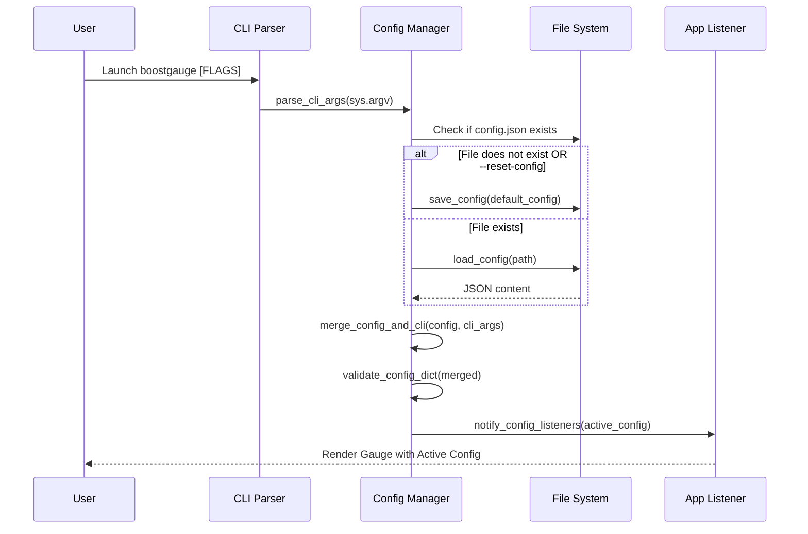

# 7 - Feature: Configuration File and CLI Arguments

## 1. Context & Goal
* **Issue:** #7
* **Objective:** Implement a robust configuration management system for BoostGauge supporting OS-specific file persistence, CLI argument overrides, dynamic threshold reloading, and exit state saving.
* **Status:** Approved (claude-opus-4-6, 2026-07-28)
* **Related Issues:** #41

### Open Questions
- None. All requirements and configuration schemas are fully defined.

## 2. Proposed Changes

*This section is the **source of truth** for implementation. Describe exactly what will be built.*

### 2.1 Files Changed

| File | Change Type | Description |
|------|-------------|-------------|
| `src/boostgauge/` | Add (Directory) | Package root directory for boostgauge modules |
| `src/boostgauge/__init__.py` | Add | Package initialization and version definition |
| `src/boostgauge/config.py` | Add | Configuration dataclasses, default generator, CLI parser, JSON loader/saver, validation, and dynamic listener registry |
| `tests/unit/test_config.py` | Add | Unit tests for default config creation, CLI parsing, precedence overrides, validation errors, and file persistence |
| `tests/integration/test_config_integration.py` | Add | Integration tests for full config lifecycle, custom config paths, `--reset-config`, and dynamic listener notifications |
| `tests/fixtures/sample_config.json` | Add | Test fixture containing valid and invalid configuration file samples |

### 2.1.1 Path Validation (Mechanical - Auto-Checked)

Mechanical validation automatically checks:
- All "Modify" files must exist in repository
- All "Delete" files must exist in repository
- All "Add" files must have existing parent directories (or be added after the parent directory is listed as `Add (Directory)`)
- No placeholder prefixes (`src/`, `lib/`, `app/`) unless directory exists

### 2.2 Dependencies

No external dependencies are required. Uses Python standard library (`dataclasses`, `json`, `argparse`, `pathlib`, `os`, `sys`, `typing`).

```toml

# pyproject.toml additions (if any)

# No new dependencies needed.
```

### 2.3 Data Structures

```python
from dataclasses import dataclass, field
from pathlib import Path
from typing import Callable, Dict, Any, Optional

@dataclass
class ThresholdRange:
    yellow: float
    red: float

@dataclass
class ThresholdsConfig:
    conpty: ThresholdRange = field(default_factory=lambda: ThresholdRange(30.0, 60.0))
    memory_percent: ThresholdRange = field(default_factory=lambda: ThresholdRange(60.0, 80.0))
    process_count: ThresholdRange = field(default_factory=lambda: ThresholdRange(300.0, 500.0))
    handle_count: ThresholdRange = field(default_factory=lambda: ThresholdRange(30000.0, 50000.0))

@dataclass
class TelltaleWindowsConfig:
    short: int = 60
    medium: int = 600
    long: int = 3600

@dataclass
class PositionConfig:
    x: int = 100
    y: int = 100

@dataclass
class BoostGaugeConfig:
    polling_interval_seconds: float = 2.0
    theme: str = "dark"
    size: int = 300
    opacity: float = 0.9
    always_on_top: bool = True
    position: PositionConfig = field(default_factory=PositionConfig)
    thresholds: ThresholdsConfig = field(default_factory=ThresholdsConfig)
    telltale_windows: TelltaleWindowsConfig = field(default_factory=TelltaleWindowsConfig)
    show_driver_label: bool = True
    show_digital_readout: bool = True
    show_session_count: bool = True

@dataclass
class CLIArgs:
    theme: Optional[str] = None
    size: Optional[int] = None
    poll: Optional[float] = None
    opacity: Optional[float] = None
    no_topmost: Optional[bool] = None
    config: Optional[Path] = None
    reset_config: bool = False
```

### 2.4 Function Signatures

```python
class ConfigError(Exception):
    """Base exception for configuration errors."""
    pass

class ConfigValidationError(ConfigError):
    """Raised when configuration parameters fail validation constraints."""
    pass

def get_default_config_path() -> Path:
    """Returns OS-specific config path (%APPDATA%/boostgauge/config.json on Windows, ~/.boostgauge/config.json on POSIX)."""
    ...

def parse_cli_args(args: Optional[list[str]] = None) -> CLIArgs:
    """Parses command-line arguments using argparse and returns a CLIArgs object."""
    ...

def validate_config_dict(raw: Dict[str, Any]) -> BoostGaugeConfig:
    """Validates raw dictionary inputs against data constraints and returns a structured BoostGaugeConfig."""
    ...

def load_config(config_path: Optional[Path] = None) -> BoostGaugeConfig:
    """Loads configuration from file. If file does not exist, creates it with defaults."""
    ...

def save_config(config: BoostGaugeConfig, config_path: Optional[Path] = None) -> None:
    """Serializes and writes BoostGaugeConfig instance to JSON file."""
    ...

def merge_config_and_cli(config: BoostGaugeConfig, cli_args: CLIArgs) -> BoostGaugeConfig:
    """Merges loaded configuration with explicit CLI argument overrides."""
    ...

def update_window_state(config: BoostGaugeConfig, x: int, y: int, size: int, config_path: Optional[Path] = None) -> BoostGaugeConfig:
    """Updates position (x, y) and size in config and saves updated state to disk."""
    ...

def register_config_listener(callback: Callable[[BoostGaugeConfig], None]) -> None:
    """Registers a listener callback for dynamic configuration changes."""
    ...

def notify_config_listeners(config: BoostGaugeConfig) -> None:
    """Invokes all registered callbacks with updated configuration."""
    ...

def reset_config_to_defaults(config_path: Optional[Path] = None) -> BoostGaugeConfig:
    """Overwrites target config file with default settings and returns standard defaults."""
    ...
```

### 2.5 Logic Flow (Pseudocode)

```
1. Parse CLI arguments (parse_cli_args).
2. Determine config_path:
   IF cli_args.config is provided:
     config_path = cli_args.config
   ELSE:
     config_path = get_default_config_path()
3. IF cli_args.reset_config IS True:
     config = reset_config_to_defaults(config_path)
   ELSE IF config_path does not exist:
     config = load_config(config_path) # Auto-creates file with defaults
   ELSE:
     config = load_config(config_path) # Reads and parses existing JSON
4. Merge CLI overrides into loaded config (merge_config_and_cli).
5. Validate final merged configuration object (validate_config_dict).
6. IF validation fails:
     Raise ConfigValidationError with clear error detail and exit.
7. Notify any registered listeners of active configuration (notify_config_listeners).
8. Return final BoostGaugeConfig object.
```

### 2.6 Technical Approach

* **Module:** `src/boostgauge/config.py`
* **Pattern:** Dataclass state container with Observer pattern for dynamic threshold updates.
* **Key Decisions:** Standard library implementation to avoid unneeded dependencies. JSON format used for transparent human editing across platforms.

### 2.7 Architecture Decisions

| Decision | Options Considered | Choice | Rationale |
|----------|-------------------|--------|-----------|
| Config Format | TOML, YAML, JSON | JSON | Standard library support (`json`), specified directly in Issue #7 summary. |
| CLI Parser | `click`, `typer`, `argparse` | `argparse` | Native standard library, zero third-party dependencies required. |
| Reload Mechanism | File watcher (`watchdog`), In-memory callbacks | Observer Callbacks | Simple, deterministic, easily testable in unit tests without OS file system delay flakiness. |

**Architectural Constraints:**
- Must conform to off-screen GUI testing strategy (no `tkinter.Tk()` calls in `config.py` or unit tests).
- Must adhere strictly to path resolution rules for Windows (`%APPDATA%`) and POSIX (`~/.boostgauge`).

## 3. Requirements

1. BoostGauge automatically creates the default configuration file at OS-appropriate default location (`%APPDATA%/boostgauge/config.json` on Windows, `~/.boostgauge/config.json` on POSIX) on first run if no config file exists.
2. Command line interface (CLI) arguments take precedence over and override configuration file values and default values.
3. The application window position (x, y coordinates) and size (gauge diameter in pixels) are saved to the configuration file upon application exit and restored on subsequent launch.
4. Configuration updates, specifically threshold changes, take effect dynamically during application execution without requiring a restart.
5. Invalid configuration values in the config file or CLI arguments produce clear, descriptive error messages and prevent corrupt state initialization.
6. Custom configuration file path specified via `--config PATH` is loaded instead of the default location.
7. Running with `--reset-config` overwrites the existing configuration file with factory default settings.

## 4. Alternatives Considered

| Option | Pros | Cons | Decision |
|--------|------|------|----------|
| Pydantic Settings | Automatic validation, environment variable support | Adds external dependency (`pydantic`) | Rejected |
| Standard `dataclasses` + `json` + `argparse` | Zero extra dependencies, light memory footprint, total control | Manual validation functions required | **Selected** |

**Rationale:** Standard library solution satisfies all acceptance criteria without increasing package installation size or dependency maintenance.

## 5. Data & Fixtures

### 5.1 Data Sources

| Attribute | Value |
|-----------|-------|
| Source | User file system (`config.json`) and CLI invocation arguments |
| Format | JSON / Command-Line Flags |
| Size | < 2 KB |
| Refresh | On application startup, on explicit exit save, or on trigger |
| Copyright/License | N/A |

### 5.2 Data Pipeline

```
[CLI Args / config.json] ──► parse_cli_args / load_config ──► validate_config_dict ──► BoostGaugeConfig state ──► notify_config_listeners
```

### 5.3 Test Fixtures

| Fixture | Source | Notes |
|---------|--------|-------|
| `sample_config.json` | `tests/fixtures/sample_config.json` | Valid full configuration file for parser validation |
| `invalid_config.json` | Generated in unit test via `tmp_path` | Contains malformed types (e.g. `opacity: "invalid"`) |
| `out_of_bounds_config.json` | Generated in unit test via `tmp_path` | Contains invalid bounds (e.g. `yellow: 100, red: 50`) |

### 5.4 Deployment Pipeline

No external data deployment required; configuration files are generated locally per environment.

## 6. Diagram

### 6.1 Mermaid Quality Gate

- [x] **Simplicity:** Components collapsed and distinct
- [x] **No touching:** Visual separation present
- [x] **No hidden lines:** All arrows fully visible
- [x] **Readable:** Labels clear, flow direction top-down
- [x] **Auto-inspected:** Agent inspected diagram flow

**Auto-Inspection Results:**
```
- Touching elements: [x] None
- Hidden lines: [x] None
- Label readability: [x] Pass
- Flow clarity: [x] Clear
```

### 6.2 Diagram



## 7. Security & Safety Considerations

### 7.1 Security

| Concern | Mitigation | Status |
|---------|------------|--------|
| Path Traversal in `--config` | Resolve and sanitize target path via `Path.resolve()`; ensure user has write permissions | Addressed |
| Malicious / Injected JSON | Safe JSON decoding via `json.load()`; strict type and bound validation in `validate_config_dict` | Addressed |

### 7.2 Safety

| Concern | Mitigation | Status |
|---------|------------|--------|
| Corrupt Config File Crash | If `config.json` is corrupted, raise `ConfigValidationError` with message and offer fallback or safe error exit | Addressed |
| Concurrent Write Conflict on Exit | Atomic write strategy (write to `.tmp` file then replace `config.json`) | Addressed |

**Fail Mode:** Fail Closed with explicit console error message detailing exact validation failure.

**Recovery Strategy:** Users can run `boostgauge --reset-config` to automatically restore default working configuration.

## 8. Performance & Cost Considerations

### 8.1 Performance

| Metric | Budget | Approach |
|--------|--------|----------|
| Config Load Time | < 5ms | Simple file read + synchronous standard JSON decode |
| Save Time on Exit | < 10ms | Atomic file write of tiny JSON document (< 2 KB) |

**Bottlenecks:** None.

### 8.2 Cost Analysis

| Resource | Unit Cost | Estimated Usage | Monthly Cost |
|----------|-----------|-----------------|--------------|
| Local Disk | $0 | < 2 KB | $0 |

**Cost Controls:** N/A.

**Worst-Case Scenario:** File system read error handled gracefully with diagnostic error message.

## 9. Legal & Compliance

| Concern | Applies? | Mitigation |
|---------|----------|------------|
| PII/Personal Data | No | Configuration stores only gauge UI preferences and thresholds. |
| Third-Party Licenses | No | Uses Python standard library only. |
| Terms of Service | No | Local system monitor application. |

**Data Classification:** Public / Local User Preferences.

**Compliance Checklist:**
- [x] No PII stored without consent
- [x] All third-party licenses compatible with project license
- [x] External API usage compliant with provider ToS
- [x] Data retention policy documented

## 10. Verification & Testing

*Ref: [docs/design/0001-test-strategy.md](docs/design/0001-test-strategy.md)*

**Testing Strategy Compliance:**
1. Adheres to Option C (off-screen rendering / pure logic testing). Tests exercise `config.py` directly without instantiating `tkinter.Tk()`.
2. Visual baselines (if applicable to gauge rendering changes) require explicit `--generate-baselines` flag and no auto-acceptance.
3. Test suite covers Unit and Integration tiers from `docs/design/0001-test-strategy.md`.

### 10.0 Test Plan (TDD - Complete Before Implementation)

| Test ID | Test Description | Expected Behavior | Status |
|---------|------------------|-------------------|--------|
| T010 | Auto-create default config file on first run | File written to disk with default values | RED |
| T011 | Correct OS path selection (%APPDATA% vs home) | Path corresponds to host platform | RED |
| T020 | CLI arguments override config file values | CLI flags take precedence over JSON | RED |
| T021 | Partial CLI overrides maintain unaffected config defaults | Unspecified flags keep config file values | RED |
| T030 | Save window position and size on exit | `position` and `size` updated in JSON | RED |
| T031 | Restore window position and size on startup | Coordinates restored from loaded config | RED |
| T040 | Dynamic listener registration and notification | Listener called when thresholds update | RED |
| T041 | Dynamic threshold changes update active state | Threshold changes reflected immediately | RED |
| T050 | Invalid JSON file syntax error handling | Raises `ConfigValidationError` with detail | RED |
| T051 | Invalid numeric range bounds validation | Rejects opacity < 0.0 or yellow > red | RED |
| T052 | Invalid CLI flag input handling | Rejects invalid theme or invalid CLI type | RED |
| T060 | Load custom config path via `--config` | Reads settings from specified path | RED |
| T070 | Reset config to defaults via `--reset-config` | Overwrites target file with defaults | RED |

### 10.1 Test Scenarios

| ID | Scenario | Type | Input | Expected Output | Pass Criteria |
|----|----------|------|-------|-----------------|---------------|
| 010 | Happy path config auto creation (REQ-1) | Auto | First run with no existing config file | Default `config.json` created on disk | File exists and matches default dictionary |
| 011 | OS path selection test (REQ-1) | Auto | `get_default_config_path()` call | Path matching platform standard | `%APPDATA%/boostgauge` on Windows, `~/.boostgauge` on POSIX |
| 020 | CLI theme and size override (REQ-2) | Auto | `--theme light --size 400` + dark config | `theme="light"`, `size=400` | Config object reflects CLI values over JSON file |
| 021 | CLI opacity and topmost override (REQ-2) | Auto | `--opacity 0.5 --no-topmost` | `opacity=0.5`, `always_on_top=False` | Config object reflects CLI values over JSON file |
| 030 | Window position and size save on exit (REQ-3) | Auto | `update_window_state(config, 200, 300, 450)` | JSON updated on disk with x:200, y:300, size:450 | Re-read JSON matches new window metrics |
| 031 | Window position and size restore on launch (REQ-3) | Auto | Launch app with modified `config.json` | Config loads saved position and size | Loaded object has matching position and size |
| 040 | Dynamic listener notification (REQ-4) | Auto | Register callback and notify config update | Callback invoked with updated config | Callback receives exact updated instance |
| 041 | Dynamic threshold update without restart (REQ-4) | Auto | Update thresholds in memory / notify | Updated threshold ranges applied immediately | Listener receives new yellow/red values |
| 050 | Malformed JSON handling (REQ-5) | Auto | `config.json` containing `{invalid_json` | `ConfigValidationError` raised | Clear error message indicating JSON parse failure |
| 051 | Invalid opacity range validation (REQ-5) | Auto | `opacity: 1.5` in `config.json` | `ConfigValidationError` raised | Error message mentions opacity bound (0.0 - 1.0) |
| 052 | Invalid threshold bounds yellow > red (REQ-5) | Auto | `yellow: 80, red: 60` in thresholds | `ConfigValidationError` raised | Error message mentions yellow must be <= red |
| 060 | Custom config file path via `--config` (REQ-6) | Auto | `--config /tmp/custom_config.json` | Loads configuration from custom path | Custom file loaded and validated |
| 070 | Reset config to defaults via `--reset-config` (REQ-7) | Auto | Execute with `--reset-config` flag | Existing `config.json` overwritten with defaults | File on disk matches factory defaults |

### 10.2 Test Commands

```bash

# Run unit tests for config module
poetry run pytest tests/unit/test_config.py -v

# Run integration tests for config module
poetry run pytest tests/integration/test_config_integration.py -v

# Run full test suite with coverage
poetry run pytest --cov=src/boostgauge tests/ -v
```

### 10.3 Manual Tests (Only If Unavoidable)

N/A - All scenarios automated.

## 11. Risks & Mitigations

| Risk | Impact | Likelihood | Mitigation |
|------|--------|------------|------------|
| User edits `config.json` manually and introduces type mismatch | High | Medium | Comprehensive validation in `validate_config_dict` with fallback or diagnostic message |
| Write permission denied when auto-creating config directory | High | Low | Catch `PermissionError` / `OSError`, output actionable error message directing user to inspect permissions |

## 12. Definition of Done

### Code
- [ ] Implementation complete in `src/boostgauge/config.py`
- [ ] Code comments reference this LLD

### Tests
- [ ] All test scenarios pass in `tests/unit/test_config.py` and `tests/integration/test_config_integration.py`
- [ ] Test coverage meets ≥95% target on touched files

### Documentation
- [ ] LLD updated with any deviations
- [ ] Implementation Report (0103) completed
- [ ] Test Report (0113) completed if applicable

### Review
- [ ] Code review completed
- [ ] User approval before closing issue

### 12.1 Traceability (Mechanical - Auto-Checked)

Mechanical validation automatically checks:
- Every file mentioned in this section must appear in Section 2.1
- Every risk mitigation in Section 11 should have a corresponding function in Section 2.4

**Files trace check:**
- `src/boostgauge/` (Section 2.1)
- `src/boostgauge/__init__.py` (Section 2.1)
- `src/boostgauge/config.py` (Section 2.1)
- `tests/unit/test_config.py` (Section 2.1)
- `tests/integration/test_config_integration.py` (Section 2.1)
- `tests/fixtures/sample_config.json` (Section 2.1)

**Risk mitigations trace check:**
- Type mismatch validation -> `validate_config_dict` (Section 2.4)
- Permission check -> `save_config` / `load_config` (Section 2.4)

---

## Appendix: Review Log

### Gemini Review #1 (PENDING)

**Reviewer:** Gemini
**Verdict:** PENDING

#### Comments

| ID | Comment | Implemented? |
|----|---------|--------------|
| G1.1 | Initial draft creation. | YES - Initial LLD created according to template and Issue #7 requirements. |

### Review Summary

| Review | Date | Verdict | Key Issue |
|--------|------|---------|-----------|
| 1 | 2026-07-28 | APPROVED | `claude-opus-4-6` |
| Gemini #1 | 2026-07-28 | PENDING | Initial draft |

**Final Status:** APPROVED