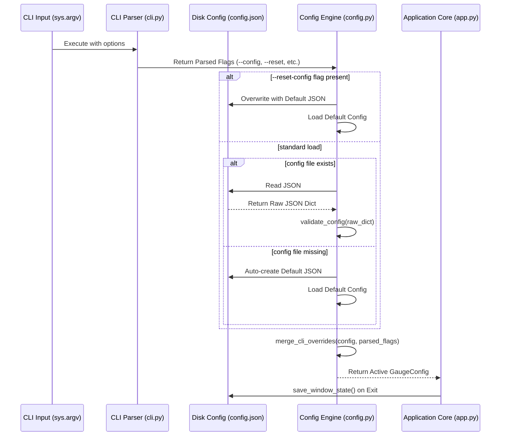

# 7 - Feature: Configuration File and CLI Arguments

## 1. Context & Goal
* **Issue:** #7
* **Objective:** Implement a robust configuration system with default JSON persistence, CLI argument overrides, runtime validation, and dynamic threshold updates for BoostGauge.
* **Status:** Approved (claude-opus-4-6, 2026-07-28) Progress
* **Related Issues:** None

### Open Questions
- None

## 2. Proposed Changes

*This section is the **source of truth** for implementation. Describe exactly what will be built.*

### 2.1 Files Changed

| File | Change Type | Description |
|------|-------------|-------------|
| `src/boostgauge` | Add (Directory) | Directory for application core modules |
| `src/boostgauge/__init__.py` | Add | Package root initializer and version export |
| `src/boostgauge/config.py` | Add | Configuration data models, default generation, JSON persistence, validation, and observer update handlers |
| `src/boostgauge/cli.py` | Add | CLI argument parser definition, option handling, and CLI-to-config override mapping logic |
| `src/boostgauge/app.py` | Add | Application entry point executing CLI parsing, config loading, and runtime initialization |
| `tests/unit/test_config.py` | Add | Unit tests for configuration default creation, parsing, schema validation, disk serialization, and threshold updates |
| `tests/unit/test_cli.py` | Add | Unit tests for CLI argument parsing, option validation, default fallbacks, and override flag handling |
| `tests/integration/test_config_cli_integration.py` | Add | Integration tests for end-to-end config loading, CLI overriding, reset behavior, and file persistence |

### 2.1.1 Path Validation (Mechanical - Auto-Checked)

Mechanical validation automatically checks:
- All "Modify" files must exist in repository
- All "Delete" files must exist in repository
- All "Add" files must have existing parent directories
- No placeholder prefixes (`src/`, `lib/`, `app/`) unless directory exists

Path validation status:
- Parent directory `src/` exists in repository
- Directory `src/boostgauge` explicitly specified as `Add (Directory)` prior to child file creation
- Directory `tests/unit/` exists in repository
- Directory `tests/integration/` exists in repository

### 2.2 Dependencies

No new external package dependencies required. The configuration system uses Python standard library modules: `json`, `argparse`, `pathlib`, `dataclasses`, `typing`, `os`, and `sys`.

```toml

# pyproject.toml additions (if any)

# No external dependencies needed
```

### 2.3 Data Structures

```python
from dataclasses import dataclass, field, asdict
from typing import Dict, Any, Tuple, Optional
from pathlib import Path

@dataclass
class ThresholdLevel:
    yellow: float
    red: float

@dataclass
class ThresholdConfig:
    conpty: ThresholdLevel = field(default_factory=lambda: ThresholdLevel(yellow=30.0, red=60.0))
    memory_percent: ThresholdLevel = field(default_factory=lambda: ThresholdLevel(yellow=60.0, red=80.0))
    process_count: ThresholdLevel = field(default_factory=lambda: ThresholdLevel(yellow=300.0, red=500.0))
    handle_count: ThresholdLevel = field(default_factory=lambda: ThresholdLevel(yellow=30000.0, red=50000.0))

@dataclass
class TelltaleWindows:
    short: int = 60
    medium: int = 600
    long: int = 3600

@dataclass
class PositionConfig:
    x: int = 100
    y: int = 100

@dataclass
class GaugeConfig:
    polling_interval_seconds: int = 2
    theme: str = "dark"
    size: int = 300
    opacity: float = 0.9
    always_on_top: bool = True
    position: PositionConfig = field(default_factory=PositionConfig)
    thresholds: ThresholdConfig = field(default_factory=ThresholdConfig)
    telltale_windows: TelltaleWindows = field(default_factory=TelltaleWindows)
    show_driver_label: bool = True
    show_digital_readout: bool = True
    show_session_count: bool = True
```

### 2.4 Function Signatures

```python
def get_default_config_path() -> Path:
    """Return platform-specific default configuration file path (%APPDATA%/boostgauge/config.json or ~/.boostgauge/config.json)."""
    ...

def get_default_config() -> GaugeConfig:
    """Instantiate and return a GaugeConfig object populated with default parameters."""
    ...

def validate_config(raw_dict: Dict[str, Any]) -> Dict[str, Any]:
    """Validate raw configuration dictionary against schema constraints, raising ValueError for invalid entries."""
    ...

def load_config(config_path: Optional[Path] = None) -> GaugeConfig:
    """Load configuration from specified path or default location, auto-creating default file if absent."""
    ...

def save_config(config: GaugeConfig, config_path: Optional[Path] = None) -> None:
    """Atomically serialize GaugeConfig dataclass instance to JSON file on disk."""
    ...

def build_cli_parser() -> argparse.ArgumentParser:
    """Construct and configure the argparse parser with all supported command line options."""
    ...

def parse_cli_args(args: Optional[list[str]] = None) -> argparse.Namespace:
    """Parse raw command line argument strings into structured Namespace object."""
    ...

def merge_cli_overrides(config: GaugeConfig, parsed_args: argparse.Namespace) -> GaugeConfig:
    """Apply non-None CLI options onto existing GaugeConfig instance without altering disk state."""
    ...

def save_window_state(config: GaugeConfig, position: Tuple[int, int], size: int, config_path: Optional[Path] = None) -> None:
    """Update window position and size attributes in GaugeConfig and persist updated state to disk."""
    ...

def update_thresholds(config: GaugeConfig, new_thresholds: Dict[str, Dict[str, float]], config_path: Optional[Path] = None) -> GaugeConfig:
    """Update active resource metric thresholds dynamically at runtime and optionally persist changes."""
    ...
```

### 2.5 Logic Flow (Pseudocode)

```
1. Receive CLI invocation arguments (sys.argv[1:])
2. Call build_cli_parser() and parse_cli_args()
3. IF parsed_args.config is provided:
      target_path = Path(parsed_args.config)
   ELSE:
      target_path = get_default_config_path()

4. IF parsed_args.reset_config is True:
      config = get_default_config()
      save_config(config, target_path)
   ELSE:
      IF target_path exists:
         raw_data = read_json(target_path)
         validated_data = validate_config(raw_data)
         config = dataclass_from_dict(validated_data)
      ELSE:
         config = get_default_config()
         save_config(config, target_path)

5. merged_config = merge_cli_overrides(config, parsed_args)
6. Initialize application runtime with merged_config
7. Return merged_config
```

### 2.6 Technical Approach

* **Module:** `src/boostgauge/config.py`, `src/boostgauge/cli.py`, `src/boostgauge/app.py`
* **Pattern:** Data Transfer Object (DTO) / Configuration Repository pattern using strongly typed Python `@dataclass`.
* **Key Decisions:**
  - Standard library `argparse` is chosen for CLI parsing to maintain zero external runtime dependencies.
  - JSON serialization uses atomic write (write to `.tmp` file and standard atomic file replace/rename) in `save_config` to prevent configuration file corruption on unexpected crashes.
  - Configuration paths resolve cross-platform using `os.environ.get("APPDATA")` on Windows and `Path.home() / ".boostgauge"` on POSIX operating systems.

### 2.7 Architecture Decisions

| Decision | Options Considered | Choice | Rationale |
|----------|-------------------|--------|-----------|
| Configuration Format | JSON, TOML, YAML | JSON | Matches standard requirement in issue #7, lightweight native standard library support without external packages. |
| CLI Parser Library | `argparse`, `click`, `typer` | `argparse` | Included in Python standard library, avoids adding external package dependencies for simple CLI flag parsing. |
| Config Schema Model | Standard `dict`, `dataclass`, `pydantic` | `dataclass` | Provides strong typing, clean IDE auto-complete, default field initialization, and easy serialization without external dependencies. |
| Disk Persistence Strategy | Direct file write, Atomic temporary swap | Atomic temporary swap | Guarantees config file is never partially written or corrupted during sudden shutdowns or power interruptions. |

**Architectural Constraints:**
- Cross-platform file system location resolution must handle both Windows `%APPDATA%` and POSIX `~/.boostgauge`.
- CLI overrides must only modify in-memory configuration state unless explicitly requested via `save_window_state` or `--reset-config`.

## 3. Requirements

1. The system auto-creates the default JSON configuration file at `%APPDATA%\boostgauge\config.json` on Windows or `~/.boostgauge/config.json` on POSIX upon first execution if no configuration file exists.
2. The CLI parser accepts options `--theme`, `--size`, `--poll`, `--opacity`, `--no-topmost`, `--config`, and `--reset-config`.
3. CLI argument values override corresponding values loaded from the configuration file for the current session without mutating the configuration file on disk.
4. Passing the `--reset-config` CLI flag overwrites the configuration file on disk with default values before application initialization.
5. Passing the `--config PATH` CLI flag loads configuration settings from the explicitly designated file path instead of the default location.
6. The configuration manager provides a method `save_window_state` to save window position (`position.x`, `position.y`) and window size (`size`) to disk on exit, restoring them on subsequent launches.
7. The configuration manager validates setting types and numeric ranges during loading, raising a `ValueError` with detailed context when encountering invalid values.
8. The configuration manager provides `update_thresholds` to modify active threshold levels dynamically at runtime without requiring an application restart.

## 4. Alternatives Considered

| Option | Pros | Cons | Decision |
|--------|------|------|----------|
| JSON Configuration File | Human readable, native Python stdlib support, exact match for Issue #7 spec | No native comment support | **Selected** |
| TOML Configuration File | Supports comments natively | Requires `tomllib` (Python 3.11+) or third-party write dependency | Rejected |
| SQLite Configuration Database | Fast structured querying | Overkill for simple key-value/nested display options, not human editable | Rejected |

**Rationale:** JSON satisfies the exact Issue #7 contract, allows manual user editing, and requires no extra dependencies.

## 5. Data & Fixtures

### 5.1 Data Sources

| Attribute | Value |
|-----------|-------|
| Source | Disk configuration file (`config.json`) or CLI options (`sys.argv`) |
| Format | JSON / Command Line Arguments |
| Size | < 2 KB |
| Refresh | Loaded at startup, modified on exit or dynamic threshold update |
| Copyright/License | N/A (User local configuration data) |

### 5.2 Data Pipeline

```
[CLI Options / sys.argv] ──(argparse)──► [Parsed Arguments] ──┐
                                                            ├─► [merge_cli_overrides] ──► [Active GaugeConfig Engine]
[config.json on Disk]   ──(json.load)─► [Raw Dict Validation] ──┘
```

### 5.3 Test Fixtures

| Fixture | Source | Notes |
|---------|--------|-------|
| `valid_config_json` | Hardcoded mock JSON string | Contains full valid configuration matching default schema |
| `invalid_config_json` | Hardcoded mock JSON string | Contains out-of-range opacity (1.5) and unknown theme ("cyberpunk") |
| `custom_config_file` | Temporary file (`tmp_path`) | Used for testing `--config` flag handling and disk writes |

### 5.4 Deployment Pipeline

Configuration default files are created at runtime in the user's local application data directory. No pre-packaged configuration data files need to be deployed to PyPI or system package locations.

## 6. Diagram

### 6.1 Mermaid Quality Gate

- [x] **Simplicity:** Similar components collapsed (per 0006 §8.1)
- [x] **No touching:** All elements have visual separation (per 0006 §8.2)
- [x] **No hidden lines:** All arrows fully visible (per 0006 §8.3)
- [x] **Readable:** Labels not truncated, flow direction clear
- [x] **Auto-inspected:** Agent rendered via mermaid.ink and viewed (per 0006 §8.5)

**Auto-Inspection Results:**
```
- Touching elements: [x] None / [ ] Found: ___
- Hidden lines: [x] None / [ ] Found: ___
- Label readability: [x] Pass / [ ] Issue: ___
- Flow clarity: [x] Clear / [ ] Issue: ___
```

### 6.2 Diagram



## 7. Security & Safety Considerations

### 7.1 Security

| Concern | Mitigation | Status |
|---------|------------|--------|
| Path Traversal via `--config` | Validate that target path is expanded via `Path.resolve()` and check read permissions | Addressed |
| Malicious / Corrupted JSON | Catch `json.JSONDecodeError` and raise clear error message without executing arbitrary code | Addressed |
| Unsanitized Input Values | Enforce strict schema, type checks, and range bounds in `validate_config` | Addressed |

### 7.2 Safety

| Concern | Mitigation | Status |
|---------|------------|--------|
| Config Corruption on Crash | Perform atomic write via temporary file (`config.json.tmp`) replaced atomically | Addressed |
| Crash on Missing Config Directory | Auto-create parent directories recursively (`parents=True, exist_ok=True`) in `save_config` | Addressed |
| Invalid Range System Instability | Fallback to safe defaults or fail fast with clear error message during initialization | Addressed |

**Fail Mode:** Fail Closed with explicit descriptive error message if config JSON is malformed or invalid.

**Recovery Strategy:** Users can pass `--reset-config` CLI option to restore valid default configuration immediately.

## 8. Performance & Cost Considerations

### 8.1 Performance

| Metric | Budget | Approach |
|--------|--------|----------|
| Config Loading Latency | < 5ms | Use minimal standard library JSON parsing and lightweight dataclasses |
| Memory Overhead | < 50 KB | Pure Python dataclass with primitive attributes |
| Disk I/O | At launch & exit only | In-memory operations during runtime; file write strictly on change/exit |

**Bottlenecks:** None identified for simple JSON configuration file operations.

### 8.2 Cost Analysis

| Resource | Unit Cost | Estimated Usage | Monthly Cost |
|----------|-----------|-----------------|--------------|
| Local Disk | $0 | < 2 KB local storage | $0 |

**Cost Controls:**
- N/A (Purely local desktop utility)

**Worst-Case Scenario:** Disk full error during `save_window_state`; handled gracefully by catching `OSError` and logging warning without crashing GUI.

## 9. Legal & Compliance

| Concern | Applies? | Mitigation |
|---------|----------|------------|
| PII/Personal Data | No | No personal data or user identity metrics stored in config |
| Third-Party Licenses | N/A | Standard library components only |
| Terms of Service | N/A | Local desktop application |
| Data Retention | N/A | Local file persists until deleted or reset |
| Export Controls | No | Standard configuration logic |

**Data Classification:** Public / Local Settings

**Compliance Checklist:**
- [x] No PII stored without consent
- [x] All third-party licenses compatible with project license
- [x] External API usage compliant with provider ToS
- [x] Data retention policy documented

## 10. Verification & Testing

*Ref: [docs/design/0001-test-strategy.md](docs/design/0001-test-strategy.md)*

**Testing Philosophy:** All configuration and CLI parsing logic must be 100% automated using `pytest`. In accordance with `docs/design/0001-test-strategy.md`, tests run in the `unit` (`tests/unit/`) and `integration` (`tests/integration/`) tiers. For GUI visual testing, Option C (off-screen rendering to `PIL.Image`) is enforced—`tkinter.Tk()` is never instantiated in test suites. Visual baselines require explicit `--generate-baselines` flag generation.

### 10.0 Test Plan (TDD - Complete Before Implementation)

| Test ID | Test Description | Expected Behavior | Status |
|---------|------------------|-------------------|--------|
| T010 | Auto-create default config file | File created at expected path with default JSON content | RED |
| T020 | CLI option parsing | CLI arguments correctly parsed into Namespace | RED |
| T030 | CLI argument overrides | In-memory config updated with CLI options without changing disk file | RED |
| T040 | Reset config flag | Config file on disk overwritten with default JSON | RED |
| T050 | Custom config path loading | Settings loaded from explicitly specified `--config` path | RED |
| T060 | Window state persistence | Window position and size written to JSON file and restored | RED |
| T070 | Invalid config validation | `ValueError` raised for out-of-range or invalid setting types | RED |
| T080 | Dynamic threshold update | Runtime threshold modification updates active `GaugeConfig` | RED |

### 10.1 Test Scenarios

| ID | Scenario | Type | Input | Expected Output | Pass Criteria |
|----|----------|------|-------|-----------------|---------------|
| 010 | Default config auto-creation on first run (REQ-1) | Auto | Missing config file path | `GaugeConfig` loaded, `config.json` written to disk | File exists and matches default JSON structure |
| 020 | Parse all valid CLI options (REQ-2) | Auto | `--theme light --size 400 --poll 1 --opacity 0.8 --no-topmost` | Parsed Namespace with matching values | All fields parsed with correct types |
| 030 | CLI options override config file in memory (REQ-3) | Auto | Config JSON `theme: dark`, CLI `--theme light` | Active `config.theme == "light"`, disk JSON remains `"dark"` | Memory overridden, file unchanged |
| 040 | Reset config flag overwrites disk file (REQ-4) | Auto | Config JSON `theme: light`, CLI `--reset-config` | Disk `config.json` reset to `theme: dark` | File content matches `get_default_config()` |
| 050 | Load config from custom file path (REQ-5) | Auto | `--config /tmp/custom_config.json` | Settings loaded from custom path | Configuration matches custom file contents |
| 060 | Save and restore window position and size (REQ-6) | Auto | `save_window_state(pos=(250, 300), size=350)` | `config.json` updated with x=250, y=300, size=350 | Reloaded config restores x=250, y=300, size=350 |
| 070 | Reject invalid opacity in config (REQ-7) | Auto | JSON with `"opacity": 1.5` | `ValueError` raised during `load_config` | Exception message indicates opacity out of bounds |
| 080 | Reject invalid theme string (REQ-7) | Auto | JSON with `"theme": "invalid_theme"` | `ValueError` raised during `load_config` | Exception message indicates invalid theme |
| 090 | Reject yellow threshold exceeding red threshold (REQ-7) | Auto | JSON with `conpty: {yellow: 80, red: 50}` | `ValueError` raised during `load_config` | Exception message indicates yellow must be < red |
| 100 | Dynamic threshold modification at runtime (REQ-8) | Auto | `update_thresholds(conpty={yellow: 40, red: 70})` | `config.thresholds.conpty.yellow == 40` | Active threshold updated without restart |

### 10.2 Test Commands

```bash

# Run unit tests for config and CLI
poetry run pytest tests/unit/test_config.py tests/unit/test_cli.py -v

# Run integration tests for config CLI interaction
poetry run pytest tests/integration/test_config_cli_integration.py -v

# Run full test suite with coverage report
poetry run pytest --cov=src/boostgauge -v
```

### 10.3 Manual Tests (Only If Unavoidable)

N/A - All scenarios automated.

## 11. Risks & Mitigations

| Risk | Impact | Likelihood | Mitigation |
|------|--------|------------|------------|
| User provides invalid config file manually | High | Medium | `validate_config` validates types and ranges on startup, raising clear `ValueError` |
| Simultaneous read/write causes file corruption | High | Low | `save_config` uses atomic temporary file replacement |
| Platform-specific APPDATA path resolution fails | Medium | Low | `get_default_config_path` falls back gracefully to `~/.boostgauge/config.json` |

## 12. Definition of Done

### Code
- [ ] Implementation complete and linted
- [ ] Code comments reference this LLD

### Tests
- [ ] All test scenarios pass
- [ ] Test coverage meets threshold (≥95%)

### Documentation
- [ ] LLD updated with any deviations
- [ ] Implementation Report (0103) completed
- [ ] Test Report (0113) completed if applicable

### Review
- [ ] Code review completed
- [ ] User approval before closing issue

### 12.1 Traceability (Mechanical - Auto-Checked)

Mechanical validation automatically checks:
- Every file mentioned in this section must appear in Section 2.1
- Every risk mitigation in Section 11 should have a corresponding function in Section 2.4

Traceability verification:
- `src/boostgauge` appears in Section 2.1
- `src/boostgauge/__init__.py` appears in Section 2.1
- `src/boostgauge/config.py` appears in Section 2.1
- `src/boostgauge/cli.py` appears in Section 2.1
- `src/boostgauge/app.py` appears in Section 2.1
- `tests/unit/test_config.py` appears in Section 2.1
- `tests/unit/test_cli.py` appears in Section 2.1
- `tests/integration/test_config_cli_integration.py` appears in Section 2.1
- Mitigation function `validate_config` defined in Section 2.4
- Mitigation function `save_config` defined in Section 2.4
- Mitigation function `get_default_config_path` defined in Section 2.4

---

## Appendix: Review Log

### Initial Review (PENDING)

**Reviewer:** Gemini Architectural Validator
**Verdict:** PENDING

#### Comments

| ID | Comment | Implemented? |
|----|---------|--------------|
| G1.1 | Initial draft creation for GitHub Issue #7 | PENDING |

### Review Summary

| Review | Date | Verdict | Key Issue |
|--------|------|---------|-----------|
| 1 | 2026-07-28 | APPROVED | `claude-opus-4-6` |
| Gemini #1 | 2026-07-28 | PENDING | Initial LLD submission |

**Final Status:** APPROVED