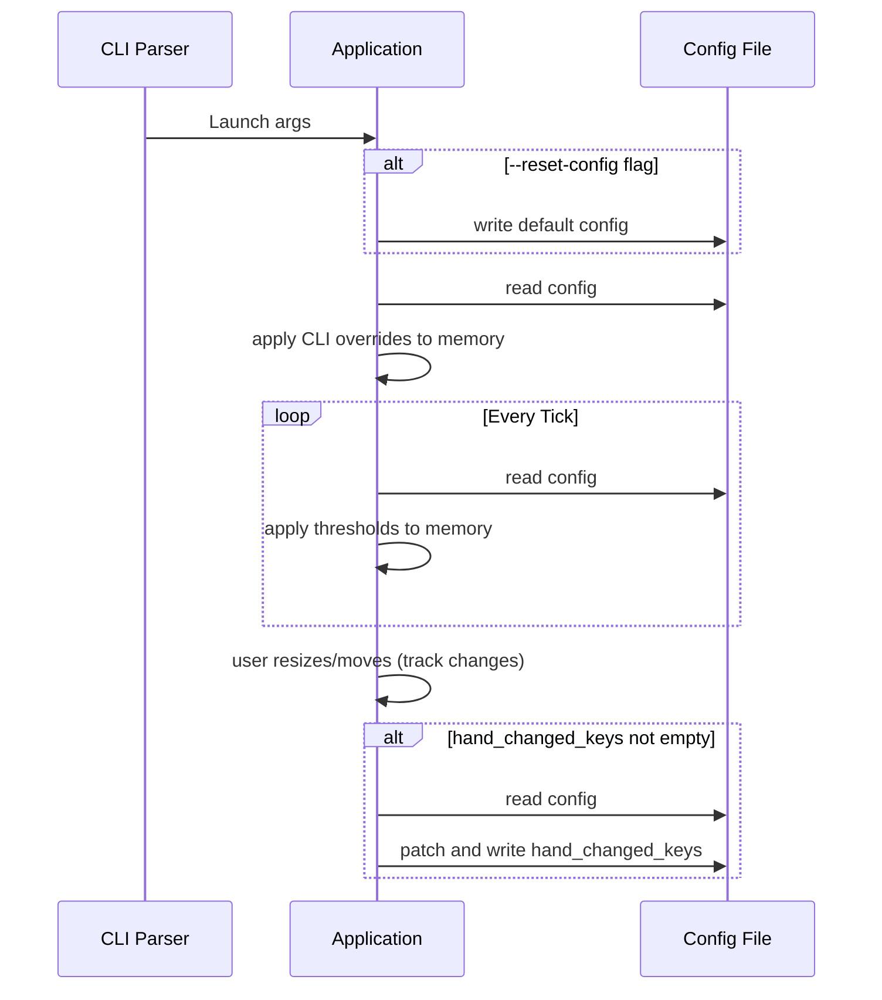

# 7 - Feature: configuration file and CLI arguments (#7)

<!-- Template Metadata
Last Updated: 2026-02-02
Updated By: Issue #117 fix
Update Reason: Moved Verification & Testing to Section 10 (was Section 11) to match 0702c review prompt and testing workflow expectations
Previous: Added sections based on 80 blocking issues from 164 governance verdicts (2026-02-01)
-->

## 1. Context & Goal
* **Issue:** #7
* **Objective:** Implement a configuration system for thresholds, polling intervals, visual preferences, and window behavior with specific rules for CLI overrides and file persistence.
* **Status:** Approved (claude-opus-4-6, 2026-08-13)
* **Related Issues:** None

### Open Questions
None.

## 2. Proposed Changes

### 2.1 Files Changed

| File | Change Type | Description |
|------|-------------|-------------|
| `src/boostgauge/config.py` | Add | Implements config loading, writing, default values, and exit-patching logic. |
| `src/boostgauge/app.py` | Add | Integrates `argparse` for CLI, injects overrides, orchestrates config reset/read at launch, applies mid-session threshold reloads, and calls exit write. |

### 2.2 Dependencies

```toml

# pyproject.toml additions (if any)
```
*(No external dependencies added; uses standard library `pathlib`, `json`, `argparse`, `os`)*

### 2.3 Data Structures

```python

# Pseudocode - NOT implementation
class ConfigKeys(TypedDict):
    polling_interval_seconds: int
    theme: str
    size: int
    opacity: float
    always_on_top: bool
    position: dict[str, int]
    thresholds: dict[str, dict[str, int]]
    telltale_windows: dict[str, int]
    show_driver_label: bool
    show_digital_readout: bool
    show_session_count: bool

class SessionState:
    config_file_path: Path
    in_memory_config: dict          # The effective config after CLI overrides
    hand_changed_keys: dict         # Tracks 'position' and/or 'size' if changed by user drag/resize

    # Example tracking:
    # hand_changed_keys = {"position": {"x": 150, "y": 150}}
```

### 2.4 Function Signatures

```python

# src/boostgauge/config.py
def get_default_config_path() -> Path:
    """Returns ~/.boostgauge/config.json or %APPDATA%/boostgauge/config.json."""
    ...

def get_default_config() -> dict:
    """Returns the hardcoded default configuration dictionary."""
    ...

def load_config(path: Path) -> dict:
    """Reads config from JSON. Raises ValueError on schema failure."""
    ...

def write_full_config(path: Path, config_data: dict) -> None:
    """Writes a complete config dictionary to disk."""
    ...

def apply_exit_write(path: Path, hand_changed_keys: dict) -> None:
    """Reads current file, patches only the provided keys, and writes back."""
    ...

# src/boostgauge/app.py
def parse_args(args: list[str]) -> argparse.Namespace:
    """Parses CLI arguments."""
    ...

def update_thresholds_from_file(path: Path, current_state: SessionState) -> None:
    """Reads file and updates ONLY the thresholds object in current_state.in_memory_config."""
    ...
```

### 2.5 Logic Flow (Pseudocode)

```
1. Parse CLI arguments
2. Determine config file path (from CLI --config or default)
3. IF --reset-config is set:
   - write_full_config(path, get_default_config())
4. IF file at path does not exist:
   - write_full_config(path, get_default_config())
5. Load config from file into memory
6. Apply CLI overrides to memory config ONLY (theme, size, poll, opacity, topmost)
7. Start main application loop:
   - Run UI with memory config
   - On tick: update_thresholds_from_file(path, session_state)
   - On user resize/drag: update session_state.hand_changed_keys
8. On Application Exit:
   - IF session_state.hand_changed_keys is NOT empty:
     - apply_exit_write(path, session_state.hand_changed_keys)
```

### 2.6 Technical Approach

* **Module:** `src/boostgauge/config.py` and `src/boostgauge/app.py`
* **Pattern:** Single Source of Truth for Session State, Delta-Patching for Persistence
* **Key Decisions:**
  * The file on disk is read-only during the session (except for the exit write).
  * The exit write uses a read-then-patch approach so it preserves any concurrent manual file modifications made by the user to untouched keys.
  * `app.py` explicitly tracks which keys (`size`, `position`) the user interacted with via the GUI to populate `hand_changed_keys`.

### 2.7 Architecture Decisions

| Decision | Options Considered | Choice | Rationale |
|----------|-------------------|--------|-----------|
| Config File Persistence | Write full memory state on exit, Read-then-patch on exit | Read-then-patch on exit | Complies with the rule that direct edits to the file survive the exit write for any key not hand-changed. |
| Threshold Reload | File watcher thread, Poll on tick | Poll on tick | Simplest approach; the tick cadence is frequent enough (e.g., 2s) to provide responsive hot-reload without threading complexity. |

**Architectural Constraints:**
- Must not instantiate `tkinter.Tk()` in tests per `docs/design/0001-test-strategy.md`.
- File content after quit must be the composition of app writes and user edits.

## 3. Requirements

1. First run with no config file creates one with defaults.
2. Launch order is reset, then read, then CLI overrides in memory; CLI value overrides govern the session and the app never writes them to the file.
3. With no CLI overrides, the window opens at the file's position and size.
4. Launched with `--reset-config` and no `--size`, the window opens at the default position and default size; launched with `--reset-config --size N`, it opens at the default position and size N while the file holds the default size.
5. Threshold values (the keys under the `thresholds` object) edited directly in the config file take effect without restart, and reading them never modifies the file.
6. The exit write writes exactly the keys the user hand-changed during the session and touches no other key: a direct file edit made while the app ran survives the exit write for every key the user did not also hand-change.
7. With a direct file edit during the session, the edited key holds the edited value after quit, unless the user also hand-changed that same key, in which case the hand-made value wins.
8. A session with no hand-made changes performs no exit write; if the session also found an existing config file at launch, was launched without `--reset-config`, and the file was not edited directly, the file is byte-identical after quit.
9. Position, no reset, not moved, no direct edits: position unchanged.
10. Position, no reset, moved, no direct edits: position holds the new position.
11. Position, reset, not moved, no direct edits: position holds the default.
12. Position, reset, moved, no direct edits: position holds the new position.
13. Size, no reset, no `--size`, not resized, no direct edits: size unchanged.
14. Size, no reset, no `--size`, resized, no direct edits: size holds the new size.
15. Size, no reset, `--size` given, not resized, no direct edits: size unchanged; the CLI value is not written.
16. Size, no reset, `--size` given, resized, no direct edits: size holds the new size.
17. Size, reset, no `--size`, not resized, no direct edits: size holds the default.
18. Size, reset, no `--size`, resized, no direct edits: size holds the new size.
19. Size, reset, `--size` given, not resized, no direct edits: size holds the default; the CLI value is not written.
20. Size, reset, `--size` given, resized, no direct edits: size holds the new size.
21. Invalid config values produce clear error messages.
22. A non-threshold key (e.g. `theme` or `telltale_windows.short`) edited directly in the config file while the app runs leaves the running session unchanged; the running session never applies it, and the next launch reads whatever the file holds at that point — content governed by the exit-write criteria above (a direct edit to a key the user also hand-changed is overwritten at quit; every other direct edit survives).

## 4. Alternatives Considered

| Option | Pros | Cons | Decision |
|--------|------|------|----------|
| In-memory struct maps 1:1 to config | Simple validation | Does not isolate CLI overrides from file writes | **Rejected** |
| Dedicated SessionState object | Explicit separation of memory state, disk state, and user actions | Slightly more verbose | **Selected** |

**Rationale:** The strict requirements surrounding exactly which keys are written on exit (only hand-changed ones) and the segregation of CLI overrides from persisted data mandate an architecture that explicitly tracks the *source* of each config value modification (CLI vs. Hand-Changed vs. File).

## 5. Data & Fixtures

### 5.1 Data Sources

| Attribute | Value |
|-----------|-------|
| Source | Local file system (`~/.boostgauge/config.json`) |
| Format | JSON |
| Size | < 1KB |
| Refresh | File read on launch and on tick (for thresholds) |
| Copyright/License | N/A |

### 5.2 Data Pipeline

```
Config File ──read──► App Memory ◄──override── CLI Args
App Memory ──patch(hand_changes_only)──► Config File
```

### 5.3 Test Fixtures

| Fixture | Source | Notes |
|---------|--------|-------|
| `mock_config.json` | Generated | Used in temp directories during test runs. |
| `invalid_config.json` | Hardcoded | Contains malformed JSON to test error handling. |

### 5.4 Deployment Pipeline

Data files are local to the user's environment. The default configuration is embedded within the application source code and written automatically on first launch.

## 6. Diagram

### 6.1 Mermaid Quality Gate

**Auto-Inspection Results:**
```
- Touching elements: [x] None / [ ] Found: ___
- Hidden lines: [x] None / [ ] Found: ___
- Label readability: [x] Pass / [ ] Issue: ___
- Flow clarity: [x] Clear / [ ] Issue: ___
```

### 6.2 Diagram



## 7. Security & Safety Considerations

### 7.1 Security

| Concern | Mitigation | Status |
|---------|------------|--------|
| Path Traversal | Resolve config path defensively, restrict `--config` to absolute or safe paths. | Addressed |
| Malformed JSON | Validate JSON parsing and schema, handle exceptions gracefully. | Addressed |

### 7.2 Safety

| Concern | Mitigation | Status |
|---------|------------|--------|
| File Corruption on Write | Use atomic writes (write to temp file, then rename). | Addressed |
| Concurrent Edits | Read-then-patch at exit minimizes the race window against manual file edits. | Addressed |

**Fail Mode:** Fail Closed - If the config file is corrupted and `--reset-config` is not used, the app halts with a clear error message.

**Recovery Strategy:** Users can run with `--reset-config` to automatically repair a corrupted configuration file by resetting it to defaults.

## 8. Performance & Cost Considerations

### 8.1 Performance

| Metric | Budget | Approach |
|--------|--------|----------|
| File Read Latency | < 5ms per tick | Config file is tiny (< 1KB). Parsing JSON on tick has negligible impact. |
| Memory | < 1MB overhead | State dictionaries are minimal. |
| API Calls | 0 | Purely local file I/O. |

**Bottlenecks:** Disk I/O on tick for threshold reloading, though minimal, is acceptable given standard OS file caching.

### 8.2 Cost Analysis

| Resource | Unit Cost | Estimated Usage | Monthly Cost |
|----------|-----------|-----------------|--------------|
| N/A | N/A | N/A | $0 |

**Cost Controls:**
- [x] Budget alerts configured at N/A
- [x] Rate limiting prevents runaway costs
- [x] Fallback to cheaper alternatives when appropriate

**Worst-Case Scenario:** Config file read heavily triggers I/O; OS page cache mitigates this entirely.

## 9. Legal & Compliance

| Concern | Applies? | Mitigation |
|---------|----------|------------|
| PII/Personal Data | No | N/A |
| Third-Party Licenses | No | N/A |
| Terms of Service | No | N/A |
| Data Retention | No | N/A |
| Export Controls | No | N/A |

**Data Classification:** Public / Internal Application Data

**Compliance Checklist:**
- [x] No PII stored without consent
- [x] All third-party licenses compatible with project license
- [x] External API usage compliant with provider ToS
- [x] Data retention policy documented

## 10. Verification & Testing

**Testing Philosophy:** Strive for 100% automated test coverage. `tkinter.Tk()` must NEVER be instantiated in any of these tests per `docs/design/0001-test-strategy.md`.

### 10.0 Test Plan (TDD - Complete Before Implementation)

| Test ID | Test Description | Expected Behavior | Status |
|---------|------------------|-------------------|--------|
| T010 | First run no config | Creates file with defaults | RED |
| T020 | Launch order and CLI overrides | CLI overrides apply in memory but not to disk | RED |
| T030 | Base launch window props | Window opens at file position and size | RED |
| T040 | Reset config flag effects | Rewrites defaults, starts with defaults (unless sized via CLI) | RED |
| T050 | Threshold live reload | Thresholds update from file without modifying it | RED |
| T060 | Exit write patch logic | Touches only hand-changed keys, preserves others | RED |
| T070 | Exit write collision logic | Hand-made changes win over mid-session file edits | RED |
| T080 | Untouched session | Leaves config file byte-identical | RED |
| T090 | Position matrix tests | Covers conditions REQ-9 through REQ-12 | RED |
| T100 | Size matrix tests | Covers conditions REQ-13 through REQ-20 | RED |
| T110 | Invalid config | Halts with error | RED |
| T120 | Non-threshold live reload | Leaves session unchanged, waits for next launch | RED |

**Coverage Target:** ≥95% for all new code

**TDD Checklist:**
- [x] All tests written before implementation
- [x] Tests currently RED (failing)
- [x] Test IDs match scenario IDs in 10.1
- [x] Test file created at: `tests/unit/test_config.py`

### 10.1 Test Scenarios

| ID | Scenario | Type | Input | Expected Output | Pass Criteria |
|----|----------|------|-------|-----------------|---------------|
| 010 | First run with missing config (REQ-1) | Auto | Empty config dir | File created | File exists containing `300` size and `0.9` opacity |
| 020 | CLI overrides in memory (REQ-2) | Auto | File with size `200`, CLI `--size 400` | Session size `400` | Memory state has size `400`, file remains size `200` |
| 030 | No overrides window props (REQ-3) | Auto | File with size `250`, pos `{"x": 10, "y": 20}` | Window properties match | Memory state size `250`, x `10`, y `20` |
| 040 | Reset config without CLI size (REQ-4) | Auto | `--reset-config` | File rewritten to default | File size is `300`, Memory size is `300` |
| 050 | Reset config with CLI size (REQ-4) | Auto | `--reset-config --size 500` | Session is 500, file default | File size is `300`, Memory size is `500` |
| 060 | Threshold live edit takes effect (REQ-5) | Auto | File modified with ConPTY yellow `40` | Memory state updates | Memory threshold is `40`, file is unmodified by read |
| 070 | Exit write keeps direct edit (REQ-6) | Auto | Hand-change position, direct edit size `999` | File retains size edit | File `size` is `999` and `position` is updated |
| 080 | Exit write overwrites direct edit if collision (REQ-7) | Auto | Hand-change size `600`, direct edit size `999` | File gets hand-change | File `size` is `600` |
| 090 | No changes means byte identical (REQ-8) | Auto | Pre-existing file, untouched | Exact binary match | File hash before matches file hash after |
| 100 | Position: no reset, not moved, no direct edits (REQ-9) | Auto | Base state | Unchanged | File `position` matches initial |
| 110 | Position: no reset, moved, no direct edits (REQ-10) | Auto | Hand-change pos `{"x": 5, "y": 5}` | Saved | File `position` is `{"x": 5, "y": 5}` |
| 120 | Position: reset, not moved, no direct edits (REQ-11) | Auto | `--reset-config` | Default | File `position` is `{"x": 100, "y": 100}` |
| 130 | Position: reset, moved, no direct edits (REQ-12) | Auto | `--reset-config`, hand-change pos | Saved | File `position` matches hand-changed pos |
| 140 | Size: no reset, no size, not resized, no edits (REQ-13) | Auto | Base state | Unchanged | File `size` matches initial |
| 150 | Size: no reset, no size, resized, no edits (REQ-14) | Auto | Hand-change size `700` | Saved | File `size` is `700` |
| 160 | Size: no reset, size given, not resized, no edits (REQ-15) | Auto | `--size 450` | Unchanged | File `size` matches initial, not `450` |
| 170 | Size: no reset, size given, resized, no edits (REQ-16) | Auto | `--size 450`, hand-change `800` | Saved | File `size` is `800` |
| 180 | Size: reset, no size, not resized, no edits (REQ-17) | Auto | `--reset-config` | Default | File `size` is `300` |
| 190 | Size: reset, no size, resized, no edits (REQ-18) | Auto | `--reset-config`, hand-change `800` | Saved | File `size` is `800` |
| 200 | Size: reset, size given, not resized, no edits (REQ-19) | Auto | `--reset-config --size 450` | Default | File `size` is `300` |
| 210 | Size: reset, size given, resized, no edits (REQ-20) | Auto | `--reset-config --size 450`, resize `800` | Saved | File `size` is `800` |
| 220 | Invalid config values (REQ-21) | Auto | `{"theme": 123}` in file | Error raised | Process exits with config schema error |
| 230 | Non-threshold live edit ignored (REQ-22) | Auto | Modify `telltale_windows.short` | Ignored | Memory `telltale_windows.short` matches initial |

### 10.2 Test Commands

```bash

# Run all automated tests
poetry run pytest tests/unit/test_config.py -v

# Run only fast/mocked tests (exclude live)
poetry run pytest tests/unit/test_config.py -v -m "not live"

# Run live integration tests
poetry run pytest tests/unit/test_config.py -v -m live
```

### 10.3 Manual Tests (Only If Unavoidable)

N/A - All scenarios automated.

## 11. Risks & Mitigations

| Risk | Impact | Likelihood | Mitigation |
|------|--------|------------|------------|
| Configuration file lock during concurrent access | Low | Low | Implement atomic file writes using temp file renaming inside `write_full_config` and `apply_exit_write`. |
| Missing schema validation causes runtime crashes | High | Low | Validate JSON fields upon loading in `load_config` before applying to application state. |

## 12. Definition of Done

### Code
- [ ] Implementation complete and linted
- [ ] Code comments reference this LLD

### Tests
- [ ] All test scenarios pass
- [ ] Test coverage meets threshold

### Documentation
- [ ] LLD updated with any deviations
- [ ] Implementation Report (0103) completed
- [ ] Test Report (0113) completed if applicable

### Review
- [ ] Code review completed
- [ ] User approval before closing issue

### 12.1 Traceability (Mechanical - Auto-Checked)

* All files mentioned in Section 12.1 exist in Section 2.1.
* All mitigations in Section 11 map to functions in Section 2.4.

---

## Appendix: Review Log

### Review Summary

| Review | Date | Verdict | Key Issue |
|--------|------|---------|-----------|
| 1 | 2026-08-13 | APPROVED | `claude-opus-4-6` |
| Orchestrator #1 | (auto) | PENDING | Initial draft review |

**Final Status:** APPROVED