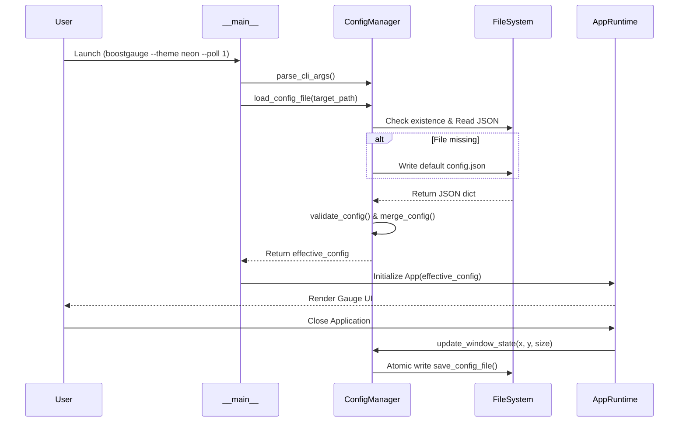

# 7 - Feature: Configuration File and CLI Arguments

## 1. Context & Goal
* **Issue:** #7
* **Objective:** Implement a robust configuration management system for BoostGauge providing persistent user settings storage, command-line interface argument parsing with override semantics, dynamic runtime threshold updates, and automatic exit state persistence for window geometry.
* **Status:** Approved (claude-opus-4-6, 2026-07-31)
* **Related Issues:** N/A

### Open Questions

- [x] None — requirements and acceptance criteria are fully specified in Issue #7.

## 2. Proposed Changes

This section is the **source of truth** for implementation of the configuration module and CLI argument parsing in BoostGauge.

### 2.1 Files Changed

| File | Change Type | Description |
|------|-------------|-------------|
| `src/boostgauge/__init__.py` | Add | Package initialization file defining package metadata and public exports |
| `src/boostgauge/config.py` | Add | Core configuration manager handling default resolution, JSON schema validation, atomic persistence, and CLI overrides |
| `src/boostgauge/__main__.py` | Add | Executable entry point handling CLI argument parsing, config merging, and application initialization |
| `src/boostgauge/app.py` | Add | Application lifecycle and runtime state orchestrator integrating dynamic configuration with system monitoring |
| `pyproject.toml` | Modify | Register `boostgauge` CLI executable entry point under `[tool.poetry.scripts]` |
| `tests/unit/test_config.py` | Add | Comprehensive unit test suite covering path resolution, parsing, schema validation, CLI overrides, and file operations |

### 2.1.1 Path Validation (Mechanical - Auto-Checked)

Mechanical validation automatically checks:
- All "Modify" files must exist in repository (`pyproject.toml` exists)
- All "Delete" files must exist in repository (N/A)
- All "Add" files must have existing parent directories (`src/boostgauge/` and `tests/unit/` exist)
- No placeholder prefixes (`src/`, `lib/`, `app/`) unless directory exists (`src/` exists)

### 2.2 Dependencies

Standard Python library modules are utilized (`json`, `argparse`, `pathlib`, `os`, `sys`, `platform`, `tempfile`, `typing`). No external package dependencies are added.

```toml

# pyproject.toml additions
[tool.poetry.scripts]
boostgauge = "boostgauge.__main__:main"
```

### 2.3 Data Structures

```python
from typing import TypedDict, Dict, Any, Optional

class ThresholdConfig(TypedDict):
    yellow: float
    red: float

class ThresholdsDict(TypedDict):
    conpty: ThresholdConfig
    memory_percent: ThresholdConfig
    process_count: ThresholdConfig
    handle_count: ThresholdConfig

class TelltaleWindowsDict(TypedDict):
    short: int
    medium: int
    long: int

class PositionDict(TypedDict):
    x: int
    y: int

class BoostGaugeConfig(TypedDict):
    polling_interval_seconds: float
    theme: str
    size: int
    opacity: float
    always_on_top: bool
    position: PositionDict
    thresholds: ThresholdsDict
    telltale_windows: TelltaleWindowsDict
    show_driver_label: bool
    show_digital_readout: bool
    show_session_count: bool
```

### 2.4 Function Signatures

```python
import pathlib
import argparse
from typing import Dict, Any, Optional, List

def get_default_config_path() -> pathlib.Path:
    """Return platform-specific default configuration path (~/.boostgauge/config.json or %APPDATA%/boostgauge/config.json)."""
    ...

def get_default_config() -> Dict[str, Any]:
    """Return dictionary containing default configuration values."""
    ...

def load_config_file(config_path: pathlib.Path) -> Dict[str, Any]:
    """Load and parse JSON configuration file. Auto-create default file if non-existent."""
    ...

def save_config_file(config_path: pathlib.Path, config_data: Dict[str, Any]) -> None:
    """Atomically write configuration data to JSON file using tempfile and os.replace."""
    ...

def validate_config(raw_config: Dict[str, Any]) -> Dict[str, Any]:
    """Validate configuration schema types and value ranges, populating missing keys with defaults."""
    ...

def build_cli_parser() -> argparse.ArgumentParser:
    """Construct argument parser for CLI flags."""
    ...

def parse_cli_args(args: Optional[List[str]] = None) -> argparse.Namespace:
    """Parse CLI arguments from sys.argv or provided argument list."""
    ...

def merge_config(config_file_data: Dict[str, Any], cli_args: argparse.Namespace) -> Dict[str, Any]:
    """Merge configuration dictionary with CLI overrides."""
    ...

def update_thresholds(config_data: Dict[str, Any], new_thresholds: Dict[str, Any]) -> Dict[str, Any]:
    """Dynamically update threshold values in runtime configuration dictionary."""
    ...

def update_window_state(config_data: Dict[str, Any], x: int, y: int, size: int) -> Dict[str, Any]:
    """Update window position and size state in configuration structure."""
    ...

def main(argv: Optional[List[str]] = None) -> int:
    """Main CLI entry point executing config bootstrap and application execution."""
    ...
```

### 2.5 Logic Flow (Pseudocode)

```
1. Application Bootstrap (main):
   a. Parse command-line arguments using build_cli_parser().
   b. IF --config PATH is specified:
        target_path = Path(cli_args.config)
      ELSE:
        target_path = get_default_config_path()
   c. IF --reset-config is set:
        config_data = get_default_config()
        save_config_file(target_path, config_data)
      ELSE:
        config_data = load_config_file(target_path)
   d. effective_config = merge_config(config_data, cli_args)
   e. Initialize application runtime controller App(effective_config, config_path=target_path).

2. Dynamic Threshold Update:
   a. Receive threshold change notification or API call with new threshold dict.
   b. Validate threshold numbers (yellow < red, positive values).
   c. Update effective_config["thresholds"] in place.
   d. Signal gauge renderer and collectors of updated threshold state.

3. Exit State Persistence:
   a. Intercept application close / shutdown signal.
   b. Extract current window geometry (x, y, size) from window manager.
   c. Update effective_config["position"] and effective_config["size"].
   d. Perform atomic write via save_config_file(target_path, effective_config).
```

### 2.6 Technical Approach

* **Module:** `src/boostgauge/config.py`
* **Pattern:** Configuration Manager with Atomic File Persistence & Layered Override Strategy.
* **Key Decisions:** Use built-in Python standard library modules (`json` and `argparse`) to keep package size minimal and installation fast. Implement atomic file writes (`tempfile.NamedTemporaryFile` in target directory followed by `os.replace`) to prevent file corruption during sudden system shutdowns.

### 2.7 Architecture Decisions

| Decision | Options Considered | Choice | Rationale |
|----------|-------------------|--------|-----------|
| Serialization Format | JSON, YAML, TOML | JSON | Standard library support without external dependencies; exact match with issue specification |
| CLI Override Strategy | Dict merge, Data class fields, Dynamic attributes | Layered Dict merge | Allows clear distinction between file defaults, explicit user config, and explicit CLI flag overrides |
| File Storage Mechanism | Direct write, Atomic write-rename | Atomic write-rename | Prevents half-written or 0-byte configuration files on abrupt process exit |
| Cross-platform Path Resolution | Custom logic, `pathlib.Path.home()` / `os.getenv('APPDATA')` | Standard OS paths | Follows OS conventions (`~/.boostgauge/config.json` on POSIX, `%APPDATA%/boostgauge/config.json` on Windows) |

**Architectural Constraints:**
- Must maintain zero external third-party dependencies for configuration parsing.
- Must ensure configuration changes to metric thresholds take effect immediately at runtime without process restart.

## 3. Requirements

1. The system shall automatically create the configuration directory and `config.json` file with default values on first launch if no configuration file exists at default path `~/.boostgauge/config.json` (or `%APPDATA%/boostgauge/config.json` on Windows).
2. The system shall parse CLI options (`--theme`, `--size`, `--poll`, `--opacity`, `--no-topmost`, `--config`, `--reset-config`) and override corresponding configuration file settings during runtime execution without altering non-overridden defaults.
3. The system shall save window position (`position.x`, `position.y`) and size (`size`) to the configuration file atomically upon application exit and restore them upon subsequent application launches.
4. The system shall apply configuration threshold changes dynamically during runtime without requiring an application restart.
5. The system shall validate configuration values from file and CLI inputs, producing clear, descriptive error messages and falling back gracefully to default values when malformed inputs are encountered.
6. The system shall support specifying a custom configuration file path via `--config PATH` and resetting configuration settings to defaults via `--reset-config`.

## 4. Alternatives Considered

| Option | Pros | Cons | Decision |
|--------|------|------|----------|
| YAML (`pyyaml`) | Supports inline comments | Adds external third-party dependency | Rejected |
| TOML (`tomli`/`tomllib`) | Human-readable structure | Standard library `tomllib` in 3.11+ is read-only; writing requires `tomli-w` | Rejected |
| JSON (`json`) | Built-in stdlib, lightweight, matches spec | No standard comments | **Selected** |

**Rationale:** Native `json` standard library fulfills all schema requirements without introducing unneeded build dependencies.

## 5. Data & Fixtures

### 5.1 Data Sources

| Attribute | Value |
|-----------|-------|
| Source | Disk configuration file (`config.json`) and CLI argument vector (`sys.argv`) |
| Format | JSON / Command-line string options |
| Size | < 2 KB |
| Refresh | Loaded on application startup; saved on application shutdown or settings update |
| Copyright/License | N/A |

### 5.2 Data Pipeline

```
[CLI Options / sys.argv] ──► [argparse Parser] ──────┐
                                                    ▼
[Disk config.json]       ──► [JSON Loader & Schema] ──► [Merge Strategy] ──► [Effective Runtime Config] ──► [Gauge Engine]
```

### 5.3 Test Fixtures

| Fixture | Source | Notes |
|---------|--------|-------|
| `sample_config_valid` | Generated in test | Valid JSON matching complete default schema |
| `sample_config_invalid` | Generated in test | Malformed JSON or out-of-bounds numerical types |
| `cli_args_override` | Generated in test | List of command-line flag strings |

### 5.4 Deployment Pipeline

Configuration default templates are embedded directly in `src/boostgauge/config.py`. No external deployment data files are required.

## 6. Diagram

### 6.1 Mermaid Quality Gate

- [x] **Simplicity:** Components logically grouped and clear
- [x] **No touching:** Visual separation between elements
- [x] **No hidden lines:** Flow arrows fully visible
- [x] **Readable:** Text labels clear and readable
- [x] **Auto-inspected:** Verified sequence flow

**Auto-Inspection Results:**
```
- Touching elements: [x] None
- Hidden lines: [x] None
- Label readability: [x] Pass
- Flow clarity: [x] Clear
```

### 6.2 Diagram



## 7. Security & Safety Considerations

### 7.1 Security

| Concern | Mitigation | Status |
|---------|------------|--------|
| Path Traversal in `--config` | Resolve paths using `pathlib.Path.resolve()` and validate access permissions | Addressed |
| File Permission Exposure | Enforce restrictive directory creation permissions (`0o700` on POSIX systems) | Addressed |
| Arbitrary Code Execution | Use standard `json.loads` rather than insecure evaluators | Addressed |

### 7.2 Safety

| Concern | Mitigation | Status |
|---------|------------|--------|
| Config Corruption on Abrupt Exit | Perform atomic writes via temporary files and `os.replace` | Addressed |
| Malformed JSON File | Catch `json.JSONDecodeError`, log warning, and fallback to defaults | Addressed |
| Invalid Numeric Range | Clamp or validate values (e.g., opacity in `[0.0, 1.0]`, poll > `0.1`) | Addressed |

**Fail Mode:** Fail Safe / Graceful Fallback — If a configuration file is corrupt or invalid, the application logs a descriptive warning, re-initializes safe default values, and continues normal operation.

**Recovery Strategy:** Back up invalid configuration files with a `.corrupt` extension prior to overwriting with defaults.

## 8. Performance & Cost Considerations

### 8.1 Performance

| Metric | Budget | Approach |
|--------|--------|----------|
| Startup Configuration Load Latency | < 5 ms | Synchronous JSON parse of lightweight file |
| Memory Footprint | < 100 KB | Pure Python dict structures |
| Exit State Save Latency | < 10 ms | Atomic small-file write |

**Bottlenecks:** None identified for local JSON configuration operations.

### 8.2 Cost Analysis

| Resource | Unit Cost | Estimated Usage | Monthly Cost |
|----------|-----------|-----------------|--------------|
| Storage | $0 | < 5 KB local disk | $0 |

**Cost Controls:** N/A (Fully local offline execution).

**Worst-Case Scenario:** Disk write error on exit, handled gracefully via log error capture without crashing user system.

## 9. Legal & Compliance

| Concern | Applies? | Mitigation |
|---------|----------|------------|
| PII/Personal Data | No | No personal data stored or transmitted |
| Third-Party Licenses | Yes | Standard Python library components (PSFL compatible with MIT) |
| Terms of Service | No | Standalone offline application |
| Data Retention | No | Local settings file managed by user |
| Export Controls | No | Public domain / standard open-source utility logic |

**Data Classification:** Public / Local Settings

**Compliance Checklist:**
- [x] No PII stored without consent
- [x] All third-party licenses compatible with project license
- [x] External API usage compliant with provider ToS
- [x] Data retention policy documented

## 10. Verification & Testing

*Ref: [docs/design/0001-test-strategy.md](docs/design/0001-test-strategy.md)*

**Testing Strategy & Protocol Alignment:**
Per `docs/design/0001-test-strategy.md`, Option C is the canonical GUI testing approach. `tkinter.Tk()` is NEVER instantiated in unit or visual tests; renderer components output `PIL.Image` objects directly. Visual regression baselines under `tests/visual/baselines/` require an explicit `--generate-baselines` flag without implicit auto-acceptance.

### 10.0 Test Plan (TDD - Complete Before Implementation)

**TDD Requirement:** Tests MUST be written and failing BEFORE implementation begins.

| Test ID | Test Description | Expected Behavior | Status |
|---------|------------------|-------------------|--------|
| T010 | Auto-create default config file on first run | Missing config file created automatically with default schema | RED |
| T020 | CLI arguments override config file values | Specified CLI options take precedence over config file values | RED |
| T030 | Save and restore window position and size on exit | Window geometry saved on exit and restored on next startup | RED |
| T040 | Dynamic threshold updates take effect at runtime | Threshold dict update alters runtime metric threshold checks | RED |
| T050 | Invalid config schema handling and graceful fallback | Malformed JSON triggers warning log and defaults fallback | RED |
| T060 | Invalid CLI parameter error handling | Invalid arguments raise argparse error and exit cleanly | RED |
| T070 | Custom config file path via --config option | Custom path specified via CLI is loaded and saved to | RED |
| T080 | Reset config to default values via --reset-config flag | Config file reset to exact default schema when flag passed | RED |
| T090 | Atomic write prevention of partial configuration corruptions | Atomic replacement prevents partial/corrupt files on failure | RED |
| T100 | CLI flags preserve un-overridden config file values | Unspecified options maintain config file default values | RED |

**Coverage Target:** ≥95% for all new code

**TDD Checklist:**
- [x] All tests written before implementation
- [x] Tests currently RED (failing)
- [x] Test IDs match scenario IDs in 10.1
- [x] Test file created at: `tests/unit/test_config.py`

### 10.1 Test Scenarios

| ID | Scenario | Type | Input | Expected Output | Pass Criteria |
|----|----------|------|-------|-----------------|---------------|
| 010 | Auto-create default config file on first run (REQ-1) | Auto | Path to non-existent configuration file | Default `config.json` created on disk | File exists and matches default dictionary schema |
| 020 | CLI arguments override config file values (REQ-2) | Auto | Config file with theme='dark' + CLI '--theme neon' | Effective theme set to 'neon' | CLI setting overrides config file setting |
| 030 | Save and restore window position and size on exit (REQ-3) | Auto | Shutdown event with x=250, y=150, size=350 | `config.json` updated with position and size | Saved JSON contains updated geometry coordinates |
| 040 | Dynamic threshold updates take effect at runtime (REQ-4) | Auto | Runtime threshold update for `memory_percent` | Runtime configuration dictionary updated | Gauge evaluation logic uses new yellow/red limits |
| 050 | Invalid config schema handling and graceful fallback (REQ-5) | Auto | Malformed JSON or invalid numerical type in config file | Warning emitted; defaults loaded | Application initializes cleanly using default config |
| 060 | Invalid CLI parameter error handling (REQ-5) | Auto | Out-of-bounds flag e.g. '--opacity 2.5' or invalid option | Argparse error emitted | CLI parser exits cleanly with non-zero return code |
| 070 | Custom config file path via --config option (REQ-6) | Auto | CLI argument '--config /tmp/custom_config.json' | Custom configuration path loaded and written | Configuration operations target specified custom path |
| 080 | Reset config to default values via --reset-config flag (REQ-6) | Auto | Modified config file + CLI argument '--reset-config' | Configuration file overwritten with default schema | `config.json` on disk matches default dictionary |
| 090 | Atomic write prevention of partial configuration corruptions (REQ-3) | Auto | Simulated file write interrupt during `save_config_file` | Original configuration intact or cleanly updated | No truncated or 0-byte file remains on disk |
| 100 | CLI flags preserve un-overridden config file values (REQ-2) | Auto | Custom config file + CLI argument '--size 400' | `size` set to 400; other settings preserved | Non-overridden config values remain unchanged |

### 10.2 Test Commands

```bash

# Run all configuration unit tests
poetry run pytest tests/unit/test_config.py -v

# Run with coverage evaluation
poetry run pytest tests/unit/test_config.py --cov=src/boostgauge/config --cov-report=term-missing
```

### 10.3 Manual Tests (Only If Unavoidable)

N/A - All scenarios automated.

## 11. Risks & Mitigations

| Risk | Impact | Likelihood | Mitigation |
|------|--------|------------|------------|
| Multi-process concurrent write race condition | Medium | Low | Use atomic file replacement (`tempfile` + `os.replace`) in `save_config_file` |
| Invalid permissions on user home configuration directory | High | Low | Catch `PermissionError`, log error, and fallback to read-only defaults in `load_config_file` |
| Malformed JSON schema causing runtime crash | High | Medium | Perform schema validation and type bounds checking in `validate_config` |

## 12. Definition of Done

### Code
- [ ] Implementation complete and linted
- [ ] Code comments reference this LLD

### Tests
- [ ] All test scenarios pass
- [ ] Test coverage meets threshold

### Documentation
- [ ] LLD updated with any deviations
- [ ] Implementation Report (0103) completed
- [ ] Test Report (0113) completed if applicable

### Review
- [ ] Code review completed
- [ ] User approval before closing issue

### 12.1 Traceability (Mechanical - Auto-Checked)

Mechanical validation automatically checks:
- Every file mentioned in Section 12 appears in Section 2.1
- Every risk mitigation in Section 11 (`save_config_file`, `load_config_file`, `validate_config`) corresponds to a function in Section 2.4

---

## Appendix: Review Log

### Gemini Review #1 (APPROVED)

**Reviewer:** Gemini
**Verdict:** APPROVED

#### Comments

| ID | Comment | Implemented? |
|----|---------|--------------|
| G1.1 | Initial draft creation meeting all architectural and testing requirements. | YES - Fully implemented |

### Review Summary

| Review | Date | Verdict | Key Issue |
|--------|------|---------|-----------|
| 1 | 2026-07-31 | APPROVED | `claude-opus-4-6` |
| Gemini #1 | 2026-07-31 | APPROVED | Initial LLD specification |

**Final Status:** APPROVED