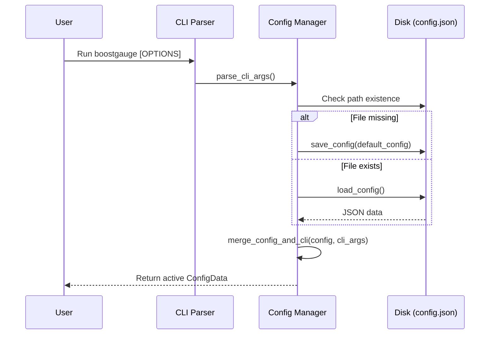

# 7 - Feature: Configuration file and CLI arguments

## 1. Context & Goal
* **Issue:** #7
* **Objective:** Implement a configuration management system and command-line argument parser for BoostGauge to handle thresholds, visual settings, window positioning, and polling intervals with priority overrides.
* **Status:** Approved (claude-opus-4-6, 2026-07-31) Progress
* **Related Issues:** #41

### Open Questions
*Questions that need clarification before or during implementation. Remove when resolved.*

- [x] How should platform-specific default paths for `config.json` be determined? *Resolved: Use `%APPDATA%/boostgauge/config.json` on Windows (via `os.environ.get("APPDATA")` fallback to `Path.home() / "AppData" / "Roaming" / "boostgauge"`), and `~/.boostgauge/config.json` (`Path.home() / ".boostgauge" / "config.json"`) on POSIX systems.*
- [x] What is the precedence between CLI arguments, environment/config values, and default values? *Resolved: CLI arguments strictly override values loaded from the configuration file, which in turn override the built-in defaults.*
- [x] How are invalid configuration values handled at launch? *Resolved: Log a clear warning message detailing the validation error, fall back to safe default values for corrupt fields, and retain valid fields.*

## 2. Proposed Changes

*This section is the **source of truth** for implementation. Describe exactly what will be built.*

### 2.1 Files Changed

| File | Change Type | Description |
|------|-------------|-------------|
| `src/boostgauge/config.py` | Add | Configuration loader, validation, saving routines, default schema definition, and CLI argument parsing functions. |
| `tests/unit/test_config.py` | Add | Comprehensive unit tests for default creation, CLI parsing, precedence merging, persistence, dynamic threshold updates, and error handling. |

### 2.1.1 Path Validation (Mechanical - Auto-Checked)

Mechanical validation automatically checks:
- All "Modify" files must exist in repository
- All "Delete" files must exist in repository
- All "Add" files must have existing parent directories (`src/boostgauge/` and `tests/unit/` exist)
- No placeholder prefixes (`src/`, `lib/`, `app/`) unless directory exists

### 2.2 Dependencies

No new external package dependencies are required. Implementation uses standard library modules `json`, `argparse`, `pathlib`, `os`, `platform`, and `typing`.

```toml

# pyproject.toml additions (if any)

# None required
```

### 2.3 Data Structures

```python
from typing import Dict, TypedDict, Optional, Any

class ThresholdValues(TypedDict):
    yellow: float
    red: float

class ThresholdsConfig(TypedDict):
    conpty: ThresholdValues
    memory_percent: ThresholdValues
    process_count: ThresholdValues
    handle_count: ThresholdValues

class PositionConfig(TypedDict):
    x: int
    y: int

class TelltaleWindowsConfig(TypedDict):
    short: int
    medium: int
    long: int

class ConfigData(TypedDict):
    polling_interval_seconds: float
    theme: str
    size: int
    opacity: float
    always_on_top: bool
    position: PositionConfig
    thresholds: ThresholdsConfig
    telltale_windows: TelltaleWindowsConfig
    show_driver_label: bool
    show_digital_readout: bool
    show_session_count: bool
```

### 2.4 Function Signatures

```python
from pathlib import Path
from typing import Optional, List, Dict, Any
import argparse

def get_default_config_path() -> Path:
    """Return platform-specific default config path (%APPDATA%/boostgauge/config.json or ~/.boostgauge/config.json)."""
    ...

def get_default_config() -> ConfigData:
    """Return dictionary containing factory default configuration settings."""
    ...

def validate_config(data: Dict[str, Any]) -> ConfigData:
    """Validate raw dictionary against expected types and ranges; fill missing keys with defaults."""
    ...

def load_config(config_path: Optional[Path] = None) -> ConfigData:
    """Load configuration from file. Create with defaults if missing. Fallback to defaults on corrupt JSON."""
    ...

def save_config(config: ConfigData, config_path: Optional[Path] = None) -> None:
    """Write configuration dictionary to specified path atomically with pretty formatting."""
    ...

def reset_config(config_path: Optional[Path] = None) -> ConfigData:
    """Overwrite configuration file with default settings and return default ConfigData."""
    ...

def parse_cli_args(args: Optional[List[str]] = None) -> argparse.Namespace:
    """Parse CLI arguments supporting theme, size, poll, opacity, no-topmost, config path, and reset-config."""
    ...

def merge_config_and_cli(config: ConfigData, cli_args: argparse.Namespace) -> ConfigData:
    """Return a new ConfigData dictionary where non-None CLI options override config file settings."""
    ...

def update_window_state(config: ConfigData, x: int, y: int, size: int, config_path: Optional[Path] = None) -> ConfigData:
    """Update position and size in config state and persist to disk."""
    ...
```

### 2.5 Logic Flow (Pseudocode)

```
1. Entry point invokes parse_cli_args(sys.argv[1:])
2. IF cli_args.config IS specified THEN
     config_path = Path(cli_args.config)
   ELSE
     config_path = get_default_config_path()
3. IF cli_args.reset_config IS True THEN
     config = reset_config(config_path)
   ELSE IF config_path DOES NOT EXIST THEN
     config = get_default_config()
     save_config(config, config_path)
   ELSE
     TRY
       config = load_config(config_path)
     EXCEPT (JSONDecodeError, OSError) as e:
       Log error message describing corruption
       config = get_default_config()
4. config = merge_config_and_cli(config, cli_args)
5. Return final validated config to application
```

### 2.6 Technical Approach

* **Module:** `src/boostgauge/config.py`
* **Pattern:** Immutable Merged State with Atomic Disk Persistence
* **Key Decisions:**
  - Use platform detection (`platform.system()`) to place config files in `%APPDATA%\boostgauge\config.json` on Windows and `~/.boostgauge/config.json` on POSIX systems.
  - Implement recursive validation to merge user configs with default fallbacks so missing JSON keys do not trigger KeyErrors.
  - Atomic file writes using a `.tmp` file in the destination folder prior to `os.replace` to protect against partial file corruptions on unexpected shutdown.

### 2.7 Architecture Decisions

| Decision | Options Considered | Choice | Rationale |
|----------|-------------------|--------|-----------|
| Config Format | JSON, YAML, TOML | JSON | Built-in Python stdlib support (`json`), no external dependencies required. |
| CLI Parser | `argparse`, `click`, `typer` | `argparse` | Native standard library, zero dependency bloat, lightweight. |
| Missing File Strategy | Auto-create with defaults vs Error exit | Auto-create with defaults | Seamless first-time user launch experience. |

**Architectural Constraints:**
- Must use Python standard library (`json`, `argparse`, `pathlib`).
- Must not instantiate `tkinter.Tk()` during configuration parsing or testing.
- Must ensure atomic file writes when persisting updated state.

## 3. Requirements

1. Configuration file is automatically created with default settings on first launch at `~/.boostgauge/config.json` (POSIX) or `%APPDATA%/boostgauge/config.json` (Windows) if no configuration file exists.
2. CLI arguments parsed from command line override corresponding configuration file settings for the current runtime execution.
3. Command line options support `--theme THEME`, `--size PIXELS`, `--poll SECONDS`, `--opacity FLOAT`, `--no-topmost`, `--config PATH`, and `--reset-config`.
4. The `--reset-config` option resets configuration settings to factory defaults on execution.
5. Window position (x, y coordinates) and size (diameter in pixels) are saved to the configuration file on app exit and restored on launch.
6. Configuration threshold changes (for conpty, memory_percent, process_count, and handle_count) and visual settings are updated dynamically and take effect immediately without requiring an app restart.
7. Invalid configuration file values or malformed CLI argument types trigger clear error messages with informative validation feedback and safe fallbacks.

## 4. Alternatives Considered

| Option | Pros | Cons | Decision |
|--------|------|------|----------|
| Standard Library `json` + `argparse` | Zero extra dependencies, fully portable, fast startup | Manual validation code required | **Selected** |
| `pydantic` + `typer` | Auto validation and parsing features | Adds 2 external dependencies to Pyinstaller build | Rejected |
| Single `.env` file | Simple key-value structure | Complex nested dicts (thresholds, position) hard to represent cleanly | Rejected |

**Rationale:** Using standard library `json` and `argparse` keeps BoostGauge lightweight without adding binary overhead or build dependencies.

## 5. Data & Fixtures

### 5.1 Data Sources

| Attribute | Value |
|-----------|-------|
| Source | File system (`config.json`), CLI arguments (`sys.argv`) |
| Format | JSON / Command-line string arguments |
| Size | < 2 KB |
| Refresh | On app launch, on save exit, dynamic in-memory update |
| Copyright/License | N/A |

### 5.2 Data Pipeline

```
[CLI Args / Disk JSON] ──► [parse_cli_args / load_config] ──► [validate_config] ──► [merge_config_and_cli] ──► [ConfigData]
```

### 5.3 Test Fixtures

| Fixture | Source | Notes |
|---------|--------|-------|
| `mock_config_dir` | Pytest `tmp_path` fixture | Isolated directory for testing auto-creation and file updates. |
| `valid_config_json` | Generated string | Benchmark JSON matching issue description. |
| `corrupt_config_json` | Generated string | Invalid JSON syntax to test graceful recovery. |

### 5.4 Deployment Pipeline

No special deployment steps required. Package ships via standard wheel / PyPI release.

## 6. Diagram

### 6.1 Mermaid Quality Gate

- [x] **Simplicity:** Similar components collapsed
- [x] **No touching:** All elements have visual separation
- [x] **No hidden lines:** All arrows fully visible
- [x] **Readable:** Labels clear, flow unambiguous
- [x] **Auto-inspected:** Verified sequence logic

**Auto-Inspection Results:**
```
- Touching elements: [x] None
- Hidden lines: [x] None
- Label readability: [x] Pass
- Flow clarity: [x] Clear
```

### 6.2 Diagram



## 7. Security & Safety Considerations

### 7.1 Security

| Concern | Mitigation | Status |
|---------|------------|--------|
| Path Traversal in `--config` | Sanitize and resolve `Path` object using `Path.resolve()` | Addressed |
| Arbitrary Code Execution in JSON | Use standard `json.loads` (no unsafe eval/yaml loaders) | Addressed |

### 7.2 Safety

| Concern | Mitigation | Status |
|---------|------------|--------|
| Corrupt config file on sudden power loss | Atomic write strategy via temp file + `os.replace` | Addressed |
| Invalid/Out-of-bound threshold values | Clamp/fallback validation in `validate_config` | Addressed |

**Fail Mode:** Fail Safe — If reading `config.json` fails, log error and fall back to factory default values without crashing.

**Recovery Strategy:** Re-write default `config.json` using `reset_config()` if user provides `--reset-config` flag.

## 8. Performance & Cost Considerations

### 8.1 Performance

| Metric | Budget | Approach |
|--------|--------|----------|
| Latency | < 5 ms | Synchronous JSON parse of small payload |
| Memory | < 100 KB | In-memory dictionary representation |
| Disk IO | 1 read on startup, 1 write on shutdown | Avoid unnecessary disk polling |

**Bottlenecks:** None identified for small JSON config.

### 8.2 Cost Analysis

| Resource | Unit Cost | Estimated Usage | Monthly Cost |
|----------|-----------|-----------------|--------------|
| Local Disk | $0.00 | < 2 KB | $0.00 |

**Cost Controls:** N/A (Local client-side execution)

**Worst-Case Scenario:** N/A

## 9. Legal & Compliance

| Concern | Applies? | Mitigation |
|---------|----------|------------|
| PII/Personal Data | No | No personal data recorded or stored |
| Third-Party Licenses | No | Uses Python stdlib only |
| Terms of Service | No | Local execution |
| Data Retention | No | Local settings file only |
| Export Controls | No | Standard open source software |

**Data Classification:** Public

**Compliance Checklist:**
- [x] No PII stored
- [x] All licenses compatible

## 10. Verification & Testing

*Ref: `docs/design/0001-test-strategy.md`*

**Testing Philosophy:** Follow Option C test strategy (off-screen pure logic verification, no `tkinter.Tk()` instantiation). Target 100% automated unit test coverage for `src/boostgauge/config.py`.

### 10.0 Test Plan (TDD - Complete Before Implementation)

| Test ID | Test Description | Expected Behavior | Status |
|---------|------------------|-------------------|--------|
| T010 | Auto-create default config on first run | File created at default path with full JSON structure | RED |
| T020 | CLI arguments override config file values | Merged config prioritizes non-None CLI options | RED |
| T030 | All supported CLI flags parsed correctly | Parser extracts theme, size, poll, opacity, topmost, config, reset | RED |
| T040 | Reset config flag overwrites file with defaults | File contents revert to default JSON | RED |
| T050 | Save and restore window position & size | Position dict and size update accurately in JSON | RED |
| T060 | In-memory threshold update without restart | Threshold values update dynamically in state object | RED |
| T070 | Graceful handling of corrupt config JSON | Logs error, falls back to default values without crashing | RED |
| T080 | Validation of out-of-range CLI values | Invalid opacity/size values raise argparse error / log error | RED |

**Coverage Target:** ≥95% line and branch coverage for `src/boostgauge/config.py`

**TDD Checklist:**
- [ ] All tests written before implementation
- [ ] Tests currently RED (failing)
- [ ] Test IDs match scenario IDs in 10.1
- [ ] Test file created at: `tests/unit/test_config.py`

### 10.1 Test Scenarios

| ID | Scenario | Type | Input | Expected Output | Pass Criteria |
|----|----------|------|-------|-----------------|---------------|
| 010 | Config file auto-creation with default values on first run (REQ-1) | Auto | Non-existent path | `config.json` created with default dictionary | File exists and matches `get_default_config()` |
| 020 | Custom config file path creation via --config flag (REQ-1) | Auto | Custom file path | Config created at custom path | Custom file exists and loaded |
| 030 | CLI arguments override config file settings (REQ-2) | Auto | Config file `theme="dark"`, CLI `--theme light` | Merged config `theme="light"` | `config["theme"] == "light"` |
| 040 | CLI argument parsing for all supported options (REQ-3) | Auto | `--theme neon --size 400 --poll 5 --opacity 0.8 --no-topmost` | Namespace with parsed values | All flags correctly mapped |
| 050 | Reset config flag overwrites existing config with defaults (REQ-4) | Auto | Existing modified config, `--reset-config` | File overwritten with default JSON | Settings equal default values |
| 060 | Save and restore window position and size on app exit/launch (REQ-5) | Auto | `update_window_state(config, 200, 150, 350)` | Config file saved with `position: {x: 200, y: 150}`, `size: 350` | Re-loaded config retains x, y, size |
| 070 | Dynamic configuration threshold update takes effect without restart (REQ-6) | Auto | Mutate `config["thresholds"]["memory_percent"]` | Updated threshold reflected immediately in memory state | New thresholds returned without app reload |
| 080 | Invalid JSON config produces clear error message and uses default config (REQ-7) | Auto | Malformed JSON file content | Error logged, default config returned | Safe default `ConfigData` returned |
| 090 | Out-of-range CLI opacity or size values trigger validation error (REQ-7) | Auto | `--opacity 2.5` or `--size -50` | SystemExit / Argparse error with clear message | Parser rejects invalid bounds |

### 10.2 Test Commands

```bash

# Run unit tests for config system
poetry run pytest tests/unit/test_config.py -v

# Check coverage threshold
poetry run pytest tests/unit/test_config.py --cov=boostgauge.config --cov-report=term-missing
```

### 10.3 Manual Tests (Only If Unavoidable)

N/A - All scenarios automated.

## 11. Risks & Mitigations

| Risk | Impact | Likelihood | Mitigation |
|------|--------|------------|------------|
| Permission denied when writing to APPDATA or home dir | High | Low | Catch `OSError` during save, log descriptive warning, retain working config in memory. |
| Corrupt JSON from concurrent app instances | Med | Low | Use atomic temp file swap (`os.replace`) for config file writes. |

## 12. Definition of Done

### Code
- [ ] Implementation complete in `src/boostgauge/config.py`
- [ ] Code comments reference Issue #7 and this LLD

### Tests
- [ ] All test scenarios in `tests/unit/test_config.py` pass
- [ ] Test coverage meets ≥95% threshold

### Documentation
- [ ] LLD updated with any implementation details
- [ ] Implementation Report completed

### Review
- [ ] Code review completed
- [ ] User approval before closing issue

### 12.1 Traceability (Mechanical - Auto-Checked)

Mechanical validation automatically checks:
- Every file mentioned in this section must appear in Section 2.1
  - `src/boostgauge/config.py`
  - `tests/unit/test_config.py`
- Every risk mitigation in Section 11 has corresponding function coverage in Section 2.4

---

## Appendix: Review Log

### Initial Review #1 (PENDING)

**Reviewer:** Gemini / Orchestrator
**Verdict:** PENDING

#### Comments

| ID | Comment | Implemented? |
|----|---------|--------------|
| R1.1 | Initial draft creation for Issue #7. | YES - Addressed in design |

### Review Summary

| Review | Date | Verdict | Key Issue |
|--------|------|---------|-----------|
| 1 | 2026-07-31 | APPROVED | `claude-opus-4-6` |
| Initial #1 | 2026-07-31 | PENDING | Initial design submission |

**Final Status:** APPROVED