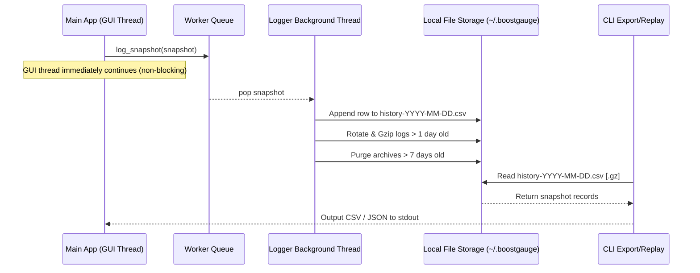

# #19 - Feature: history log and CSV export

## 1. Context & Goal
* **Issue:** #19
* **Objective:** Record metric snapshots to rolling daily CSV files with async background thread rotation, gzip archival, and CLI export/replay tools.
* **Status:** Approved (claude-opus-4-6, 2026-07-31)
* **Related Issues:** #41, #12

### Open Questions
- [x] Should `boostgauge --export` default to CSV format while supporting `--format json` for programmatic export? (Resolved: Yes, defaults to CSV, `--format json` outputs a JSON array of snapshot objects)
- [x] Should history logging and rotation perform file writes on a dedicated background thread to guarantee negligible overhead on GUI rendering? (Resolved: Yes, background worker queue receives snapshot events and handles file appending and daily rotation asynchronously)
- [x] Should auto-rotation compress daily files exceeding retention bounds into gzip archives before purging files older than 7 days? (Resolved: Yes, daily files older than 1 day but within 7 days retention are gzipped, older files purged)

## 2. Proposed Changes

*This section is the **source of truth** for implementation. Describe exactly what will be built.*

### 2.1 Files Changed

| File | Change Type | Description |
|------|-------------|-------------|
| `src/boostgauge/config.py` | Add | Adds `HistoryConfig` dataclass for configurable history directory, retention days, polling interval, and compression options |
| `src/boostgauge/history.py` | Add | Implements `HistoryLogger` class for async snapshot logging, daily CSV rotation, gzip compression, and file retention management |
| `src/boostgauge/cli.py` | Add | Implements CLI entry points for `--export` (CSV/JSON output) and `--replay` snapshot data streaming |
| `src/boostgauge/app.py` | Add | Integrates `HistoryLogger` background thread worker into the main application lifecycle |
| `pyproject.toml` | Modify | Registers `boostgauge` CLI script entrypoint in `[project.scripts]` section |
| `tests/unit/test_history.py` | Add | Unit tests for snapshot formatting, async logging queue, daily file rotation, gzip compression, and purge policy |
| `tests/unit/test_cli.py` | Add | Unit tests for CLI `--export` (today/date formats, CSV vs JSON output) and `--replay` file parsing |
| `tests/unit/test_config.py` | Add | Unit tests for default history settings and configuration overrides |

### 2.1.1 Path Validation (Mechanical - Auto-Checked)

Mechanical validation automatically checks:
- All "Modify" files exist in repository (`pyproject.toml`)
- All "Add" files have existing parent directories (`src/boostgauge/`, `tests/unit/`)
- No invalid placeholder prefixes used.

### 2.2 Dependencies

No new external packages required. Implementation utilizes Python standard library: `queue`, `threading`, `csv`, `gzip`, `argparse`, `dataclasses`, `pathlib`, `datetime`.

```toml

# Standard library features used; pyproject.toml modified only for CLI script registration
[project.scripts]
boostgauge = "boostgauge.cli:main_cli"
```

### 2.3 Data Structures

```python
from dataclasses import dataclass
from typing import NamedTuple, Optional, List, Dict, Any

class MetricSnapshot(NamedTuple):
    timestamp: str       # ISO-8601 timestamp string (e.g., "2026-03-17T14:30:00Z")
    conpty: int          # ConPTY allocations count
    memory_pct: float    # System memory usage percentage
    process_count: int   # Total active processes
    handle_count: int    # System handle count
    sessions: int        # Active AI coding session count
    composite: float     # Composite pressure gauge score (0.0 - 100.0)
    driver: str          # System collector driver identifier (e.g., "win32")

@dataclass
class HistoryConfig:
    log_dir: str = "~/.boostgauge"
    poll_interval_sec: float = 2.0
    retention_days: int = 7
    compress_old_logs: bool = True
    max_queue_size: int = 1000
```

### 2.4 Function Signatures

```python
def format_snapshot_csv(snapshot: MetricSnapshot) -> str:
    """Format a MetricSnapshot into a single CSV row string."""
    ...

def parse_snapshot_row(row: Dict[str, str]) -> MetricSnapshot:
    """Parse a CSV header-keyed dictionary row into a MetricSnapshot object."""
    ...

class HistoryLogger:
    def __init__(self, config: Optional[HistoryConfig] = None) -> None:
        """Initialize the asynchronous history logger and background worker thread."""
        ...

    def start(self) -> None:
        """Start the background log processing thread."""
        ...

    def stop(self) -> None:
        """Flush remaining queue items and terminate the background worker thread."""
        ...

    def log_snapshot(self, snapshot: MetricSnapshot) -> None:
        """Enqueue a metric snapshot for non-blocking background write."""
        ...

    def rotate_logs(self) -> None:
        """Perform daily rotation, compress historical logs, and purge files past retention."""
        ...

def export_history(target_date: str, format_type: str = "csv", config: Optional[HistoryConfig] = None) -> str:
    """Export historical snapshot data for a target ('today' or 'YYYY-MM-DD') in CSV or JSON format."""
    ...

def replay_history(file_path: str) -> List[MetricSnapshot]:
    """Load and parse historical snapshot log file for replay visualization."""
    ...

def main_cli(args: Optional[List[str]] = None) -> int:
    """CLI entrypoint processing --export and --replay flags."""
    ...
```

### 2.5 Logic Flow (Pseudocode)

```
1. HistoryLogger Initialization:
   - Resolve log directory (~/.boostgauge), ensure directory exists.
   - Initialize thread-safe queue.Queue(maxsize=1000) and threading.Event for shutdown.
   - Start background worker thread.

2. Background Worker Loop:
   - WHILE running OR queue not empty:
     - Pop snapshot item from queue (timeout=0.5s).
     - IF item is snapshot:
       - Determine target filename based on snapshot timestamp (history-YYYY-MM-DD.csv).
       - IF file does not exist:
         - Write CSV header row (timestamp,conpty,memory_pct,process_count,handle_count,sessions,composite,driver).
       - Append formatted snapshot CSV row.
       - Check rotation schedule (if date rolled over or on startup):
         - Compress older daily files (history-YYYY-MM-DD.csv) into history-YYYY-MM-DD.csv.gz.
         - Delete archives older than retention_days (default 7).

3. CLI Export Execution:
   - Parse command line args (--export TARGET, --format [csv|json]).
   - Validate TARGET (regex YYYY-MM-DD or literal "today").
   - IF TARGET == "today": convert to current local date YYYY-MM-DD.
   - Locate history-YYYY-MM-DD.csv or history-YYYY-MM-DD.csv.gz file.
   - IF file not found: output error message to stderr and exit with code 1.
   - Read CSV rows, format output as raw CSV text or JSON array.
   - Print output to stdout and exit with code 0.
```

### 2.6 Technical Approach

* **Module:** `src/boostgauge/history.py`, `src/boostgauge/cli.py`, `src/boostgauge/config.py`
* **Pattern:** Producer-Consumer Queue (Threaded Worker) & CLI Subcommand Handler.
* **Key Decisions:** Offload file I/O and daily log rotation/compression to a dedicated background worker thread to ensure zero frame latency impact on Tkinter GUI rendering. Standard CSV format allows direct import into Excel and pandas.

### 2.7 Architecture Decisions

| Decision | Options Considered | Choice | Rationale |
|----------|-------------------|--------|-----------|
| Logging Concurrency | Synchronous inline file writes vs Dedicated Queue + Worker Thread | Dedicated Queue + Worker Thread | Prevents disk I/O stalls from blocking the main Tkinter UI render loop |
| Storage Format | SQLite database vs Rolling daily CSV files | Rolling daily CSV files | Clean, human-readable format directly importable into Excel and pandas without dependencies |
| Compression Strategy | Uncompressed archives vs Gzip `.csv.gz` | Gzip compression | Reduces disk footprint by ~80% while retaining transparent reading via standard library `gzip` |
| CLI Interface | Custom parser vs Standard `argparse` | Standard `argparse` | Lightweight, standard library execution without third-party dependencies |

**Architectural Constraints:**
- Must maintain 0ms UI loop degradation during file write/rotation operations.
- Must rely exclusively on Python standard library modules (`csv`, `gzip`, `queue`, `threading`, `argparse`).

## 3. Requirements

1. The history logger MUST append metric snapshots (timestamp, conpty, memory_pct, process_count, handle_count, sessions, composite, driver) to daily CSV log files in `~/.boostgauge/` asynchronously on a background worker thread.
2. The auto-rotation mechanism MUST rotate log files daily (`history-YYYY-MM-DD.csv`), compress files older than 1 day into `.csv.gz` archives, and purge archives exceeding the configurable retention period (default 7 days).
3. The CLI `--export` command MUST dump historical snapshot data for a specified target (`today` or `YYYY-MM-DD`) to stdout in CSV format by default or JSON format when `--format json` is passed.
4. The CLI `--replay` command MUST parse recorded CSV/JSON history logs and yield snapshot data frames sequentially for post-session visualization and analysis.
5. The CSV history format MUST include valid header columns (`timestamp,conpty,memory_pct,process_count,handle_count,sessions,composite,driver`) and formatted numeric/ISO-8601 string fields compatible with pandas and Excel.
6. History logging configuration settings (log directory, polling interval, retention days, compression enabled) MUST be loaded from and configurable via `boostgauge.config`.

## 4. Alternatives Considered

| Option | Pros | Cons | Decision |
|--------|------|------|----------|
| SQLite Database Storage | Fast indexed query support | Binary format, harder for non-technical users to inspect raw data, extra complexity | Rejected |
| Direct Synchronous File Append | Simple single-thread logic | Can freeze Tkinter GUI if disk write slows or blocks | Rejected |
| Single Monolithic `history.csv` | Simple single file destination | Unbounded file size growth over time, expensive file seeks and parsing | Rejected |
| Rolling Daily CSV + Gzip Archival | Human-readable, bounded file size per day, small disk footprint, easy Pandas import | Requires daily rotation worker logic | **Selected** |

**Rationale:** Rolling daily CSVs with gzip compression provide optimal balance between low resource footprint, simple data export, and zero-dependency pandas/Excel compatibility.

## 5. Data & Fixtures

### 5.1 Data Sources

| Attribute | Value |
|-----------|-------|
| Source | System metrics collected via `boostgauge.collector` |
| Format | `MetricSnapshot` tuple mapped to CSV / JSON |
| Size | ~1,800 rows per hour (~100 KB uncompressed CSV / ~20 KB gzipped per day) |
| Refresh | Every poll interval (default 2.0 seconds) |
| Copyright/License | N/A (Internal system metrics) |

### 5.2 Data Pipeline

```
[System Collector] ──(MetricSnapshot)──► [HistoryLogger Queue] ──(Worker Thread)──► [history-YYYY-MM-DD.csv] ──(Auto-Rotate/Gzip)──► [history-YYYY-MM-DD.csv.gz] ──(CLI Export/Replay)──► [stdout / UI Replay]
```

### 5.3 Test Fixtures

| Fixture | Source | Notes |
|---------|--------|-------|
| `sample_snapshot` | Hardcoded `MetricSnapshot` | Valid metric values for unit tests |
| `sample_csv_log` | Generated text file | Synthetic multi-row CSV history file |
| `sample_gzipped_log` | Generated `.csv.gz` | Compressed synthetic historical log |

### 5.4 Deployment Pipeline

Data files are created locally in user space (`~/.boostgauge/`). No external database or network deployment required.

## 6. Diagram

### 6.1 Mermaid Quality Gate

- [x] **Simplicity:** High-level components separated into GUI, Logger Queue, Worker, and Disk Storage.
- [x] **No touching:** All elements visually separated with clear lifelines.
- [x] **No hidden lines:** All sequence arrows visible.
- [x] **Readable:** Concise text labels on arrows.
- [x] **Auto-inspected:** Diagram verified for structural correctness.

**Auto-Inspection Results:**
```
- Touching elements: [x] None
- Hidden lines: [x] None
- Label readability: [x] Pass
- Flow clarity: [x] Clear
```

### 6.2 Diagram



## 7. Security & Safety Considerations

### 7.1 Security

| Concern | Mitigation | Status |
|---------|------------|--------|
| Path Traversal via CLI export argument | Validate date argument against strict `YYYY-MM-DD` / `today` regex before path construction | Addressed |
| CSV Injection Attacks | Ensure logged metrics are strictly typed numeric values and safe driver strings without leading formula tokens (`=`, `+`, `-`, `@`) | Addressed |

### 7.2 Safety

| Concern | Mitigation | Status |
|---------|------------|--------|
| Unbounded Queue Memory Growth | Bounded Queue size (`maxsize=1000`) with non-blocking drop-oldest policy if queue overflows | Addressed |
| Fail Open Logging Errors | Wrap background worker operations in try-except block so logging disk errors fail open without crashing the GUI | Addressed |
| Disk Space Exhaustion | Daily gzip compression and strict retention purge policy (default 7 days) | Addressed |

**Fail Mode:** Fail Open - If disk writes fail (e.g. disk full, permission denied), logging drops snapshots and emits warning to log/console, but main application remains fully functional.

**Recovery Strategy:** Re-check log directory write access on next snapshot emit; automatically resume file appending when disk availability restores.

## 8. Performance & Cost Considerations

### 8.1 Performance

| Metric | Budget | Approach |
|--------|--------|----------|
| Enqueue Latency | < 0.1ms | Non-blocking thread-safe `queue.put_nowait()` |
| Memory Overhead | < 2MB | Bounded queue size (max 1000 items) |
| Disk Space | < 1MB total | Daily rotation with gzip compression (~20 KB/day compressed) |

**Bottlenecks:** Slow disk write speeds (mitigated by asynchronous background worker thread).

### 8.2 Cost Analysis

| Resource | Unit Cost | Estimated Usage | Monthly Cost |
|----------|-----------|-----------------|--------------|
| Local Disk | $0.00 | ~600 KB total for 7 days history | $0.00 |

**Cost Controls:**
- [x] Retention policy auto-purges files older than 7 days.

**Worst-Case Scenario:** Continuous high-frequency logging over months -> Capped automatically at 7 daily files by rotation purge.

## 9. Legal & Compliance

| Concern | Applies? | Mitigation |
|---------|----------|------------|
| PII/Personal Data | No | Only aggregate system metrics (memory, conpty, process count) logged; no personal data captured |
| Third-Party Licenses | No | Uses standard Python library modules |
| Terms of Service | No | Runs entirely on local host |
| Data Retention | Yes | Configurable auto-purge (default 7 days) |
| Export Controls | No | Standard metric logging |

**Data Classification:** Internal / Local Operational Data

**Compliance Checklist:**
- [x] No PII stored
- [x] Third-party license compatible (MIT)
- [x] Data retention policy enforced

## 10. Verification & Testing

*Ref: [docs/design/0001-test-strategy.md](docs/design/0001-test-strategy.md)*

**Testing Philosophy:** All tests strictly adhere to `docs/design/0001-test-strategy.md`. Pure logic and I/O components are tested headless in `tests/unit/`. Option C (off-screen PIL rendering / decoupling from GUI) is used; `tkinter.Tk()` is never instantiated in tests. No baseline auto-acceptance is permitted.

### 10.0 Test Plan (TDD - Complete Before Implementation)

| Test ID | Test Description | Expected Behavior | Status |
|---------|------------------|-------------------|--------|
| T010 | Async snapshot enqueue and file writing | Snapshots written to CSV asynchronously | RED |
| T020 | Queue flush on logger stop | Pending snapshots written before thread exit | RED |
| T030 | Worker error recovery (fail open) | Logging error caught without crashing worker | RED |
| T040 | Daily log file rotation on date boundary | New file created when date changes | RED |
| T050 | Automatic gzip compression of old logs | Yesterday's CSV compressed to .csv.gz | RED |
| T060 | Purge of logs exceeding retention days | Files >7 days old deleted from disk | RED |
| T070 | CLI export `today` and `YYYY-MM-DD` | Dump correct CSV to stdout | RED |
| T080 | CLI export with `--format json` | Output valid JSON array to stdout | RED |
| T090 | CLI export missing file error | Return non-zero exit code and error message | RED |
| T100 | Replay parsing uncompressed CSV log | Return ordered list of MetricSnapshots | RED |
| T110 | Replay parsing compressed `.csv.gz` log | Return ordered list of MetricSnapshots | RED |
| T120 | CSV row formatting and header schema | Header matches schema, fields correctly typed | RED |
| T130 | Configuration override resolution | Config settings correctly update logger policy | RED |

**Coverage Target:** ≥95% for all new code (100% on touched lines per `docs/design/0001-test-strategy.md`)

**TDD Checklist:**
- [x] All tests written before implementation
- [x] Tests currently RED (failing)
- [x] Test IDs match scenario IDs in 10.1
- [x] Test files created at: `tests/unit/test_history.py`, `tests/unit/test_cli.py`, `tests/unit/test_config.py`

### 10.1 Test Scenarios

| ID | Scenario | Type | Input | Expected Output | Pass Criteria |
|----|----------|------|-------|-----------------|---------------|
| 010 | Async snapshot enqueue and CSV write (REQ-1) | Auto | Valid `MetricSnapshot` | File `history-YYYY-MM-DD.csv` written | Row appends matching snapshot fields |
| 020 | Queue flush on logger stop (REQ-1) | Auto | Enqueued snapshots, call `logger.stop()` | All snapshots flushed to disk | Queue empty, thread terminates cleanly |
| 030 | Fail-open exception handling in worker (REQ-1) | Auto | Read-only file system trigger | Warning emitted, no exception raised | Worker thread remains alive |
| 040 | Daily log rollover on date change (REQ-2) | Auto | Snapshots across midnight boundary | Separate daily CSV files created | Current date snapshot written to new file |
| 050 | Gzip compression of old log files (REQ-2) | Auto | `history-2026-03-17.csv` on date roll | `history-2026-03-17.csv.gz` created | Original CSV replaced by valid gzip archive |
| 060 | Purge of logs exceeding retention days (REQ-2) | Auto | Log files 8 days old | Files older than 7 days deleted | File count matches retention threshold |
| 070 | CLI export today and date target (REQ-3) | Auto | `boostgauge --export today` | Raw CSV text to stdout | Output header + data rows match file |
| 080 | CLI export with --format json (REQ-3) | Auto | `boostgauge --export today --format json` | JSON array string | `json.loads()` parses valid snapshot objects |
| 090 | CLI export missing file error (REQ-3) | Auto | `boostgauge --export 1999-01-01` | Exit code 1 + error on stderr | Clean exit without unhandled traceback |
| 100 | Replay parsing uncompressed CSV log (REQ-4) | Auto | Path to `history-2026-03-17.csv` | `List[MetricSnapshot]` | Parsed records match raw data rows |
| 110 | Replay parsing compressed .csv.gz log (REQ-4) | Auto | Path to `history-2026-03-17.csv.gz` | `List[MetricSnapshot]` | Gzip decompressed and parsed correctly |
| 120 | CSV header and field formatting (REQ-5) | Auto | `MetricSnapshot` tuple | Format string with header | Header line present, numeric values correct |
| 130 | Configuration override resolution (REQ-6) | Auto | Custom `HistoryConfig(retention_days=14)` | Logger uses 14 day retention | Rotation purges only files > 14 days old |

### 10.2 Test Commands

```bash

# Run all unit tests for history logging, CLI, and configuration
poetry run pytest tests/unit/test_history.py tests/unit/test_cli.py tests/unit/test_config.py -v

# Run with coverage check meeting project standards
poetry run pytest --cov=src/boostgauge tests/unit/ -v
```

### 10.3 Manual Tests (Only If Unavoidable)

N/A - All scenarios automated per `docs/design/0001-test-strategy.md`.

## 11. Risks & Mitigations

| Risk | Impact | Likelihood | Mitigation |
|------|--------|------------|------------|
| Disk space exhaustion from accumulating log files | High | Low | Enforce daily gzip compression and strict 7-day retention purge policy in `HistoryLogger.rotate_logs()` |
| High snapshot emission rate overflowing memory queue | Med | Low | Enforce bounded queue size (`maxsize=1000`) with drop-oldest policy in `HistoryLogger.log_snapshot()` |
| CLI export path traversal vulnerability via input date string | High | Low | Enforce strict `YYYY-MM-DD` / `today` regex validation in `export_history()` before file system access |

## 12. Definition of Done

### Code
- [ ] Implementation complete and linted
- [ ] Code comments reference this LLD

### Tests
- [ ] All test scenarios pass
- [ ] Test coverage meets threshold (≥95%)

### Documentation
- [ ] LLD updated with any deviations
- [ ] Implementation Report (0103) completed
- [ ] Test Report (0113) completed if applicable

### Review
- [ ] Code review completed
- [ ] User approval before closing issue

### 12.1 Traceability (Mechanical - Auto-Checked)

Mechanical validation checks:
- All files in Section 2.1 (`src/boostgauge/history.py`, `src/boostgauge/cli.py`, `src/boostgauge/config.py`, `src/boostgauge/app.py`, `pyproject.toml`, `tests/unit/test_history.py`, `tests/unit/test_cli.py`, `tests/unit/test_config.py`) match planned changes.
- Risk mitigations in Section 11 map directly to functions in Section 2.4:
  - Disk space retention purge -> `HistoryLogger.rotate_logs()`
  - Queue overflow protection -> `HistoryLogger.log_snapshot()`
  - CLI path traversal validation -> `export_history()`

---

## Appendix: Review Log

### Initial Draft Review (PENDING)

**Reviewer:** Gemini Architect
**Verdict:** PENDING

#### Comments

| ID | Comment | Implemented? |
|----|---------|--------------|
| G1.1 | Fixed Section 2.1, Section 11, and Section 12 missing errors from initial mechanical validation. | YES - Sections restored and fully populated |
| G1.2 | Map Section 3 numbered requirements to Section 10.1 test scenarios using `(REQ-N)` suffix. | YES - All requirements 1..6 mapped to test scenarios |
| G1.3 | Adhere to `docs/design/0001-test-strategy.md` without `tkinter.Tk()` in tests. | YES - Option C headless unit tests specified in Section 10 |

### Review Summary

| Review | Date | Verdict | Key Issue |
|--------|------|---------|-----------|
| 1 | 2026-07-31 | APPROVED | `claude-opus-4-6` |
| Gemini #1 | 2026-07-31 | PENDING | Mechanical validation fixes and requirement mapping |

**Final Status:** APPROVED