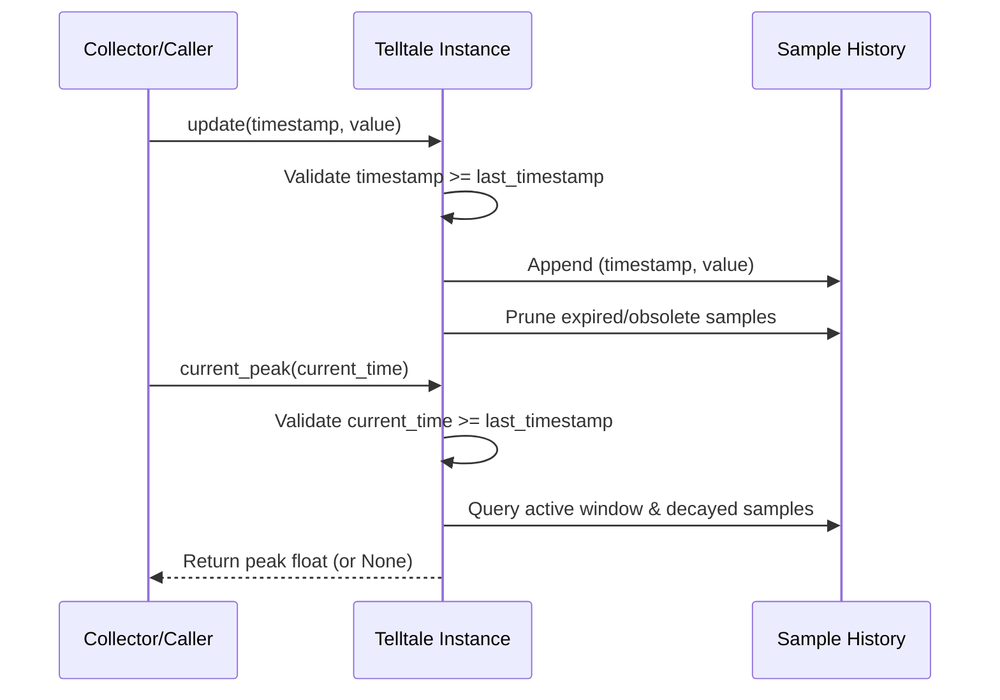

# #41 - Feature: Telltale peak-hold needle logic (pure, no GUI)

## 1. Context & Goal
* **Issue:** #41
* **Objective:** Implement a pure, GUI-independent peak-hold telltale needle component tracking maximum values over a sliding time window with optional linear decay.
* **Status:** Approved (claude-opus-4-6, 2026-08-01)
* **Related Issues:** #35, #36

### Open Questions
- [x] Should `current_peak(current_time)` validate chronological monotonicity if an explicit `current_time` is supplied? (Resolved: Yes, raise `ValueError` if `current_time` is earlier than the latest sample timestamp, ensuring consistent chronological monotonicity validation across both `update()` and `current_peak()`).

## 2. Proposed Changes

### 2.1 Files Changed

| File | Change Type | Description |
|------|-------------|-------------|
| `src/boostgauge/telltale.py` | Add | Implements `Telltale` class for sliding-window peak-hold tracking with optional decay. |
| `tests/unit/test_telltale.py` | Add | Headless unit tests covering window eviction, decay, floor bounds, reset, and timestamp validation. |

### 2.1.1 Path Validation (Mechanical - Auto-Checked)

Mechanical validation automatically checks:
- All "Modify" files must exist in repository
- All "Delete" files must exist in repository
- All "Add" files must have existing parent directories (`src/boostgauge/`, `tests/unit/`)
- No placeholder prefixes (`src/`, `lib/`, `app/`) unless directory exists

### 2.2 Dependencies

No new third-party dependencies required. Standard library only (`collections.deque`, `typing.Optional`, `typing.Tuple`).

### 2.3 Data Structures

```python
from typing import Deque, Optional, Tuple

# Sample representation: (timestamp_seconds, value)
Sample = Tuple[float, float]
```

### 2.4 Function Signatures

```python
from typing import Deque, Optional, Tuple

class Telltale:
    """Tracks peak values over a sliding time window with optional linear decay."""

    def __init__(self, window: float, decay_rate: Optional[float] = None) -> None:
        """Initialize Telltale needle state.

        Args:
            window: Sliding window duration in seconds (> 0).
            decay_rate: Optional linear decay rate in value units/second (>= 0).

        Raises:
            ValueError: If window <= 0 or decay_rate < 0.
        """
        ...

    def update(self, timestamp: float, value: float) -> None:
        """Record a new sample timestamp and value.

        Args:
            timestamp: Sample timestamp in seconds.
            value: Numerical reading value.

        Raises:
            ValueError: If timestamp is earlier than the previous sample's timestamp.
        """
        ...

    def current_peak(self, current_time: Optional[float] = None) -> Optional[float]:
        """Compute the active peak value at current_time or the latest sample timestamp.

        Args:
            current_time: Optional explicit evaluation timestamp.

        Returns:
            The peak value bounded by window maximum, or None if no samples exist.

        Raises:
            ValueError: If current_time is earlier than the latest sample timestamp.
        """
        ...

    def reset(self) -> None:
        """Clear all sample history and decay state."""
        ...
```

### 2.5 Logic Flow (Pseudocode)

```
__init__(window, decay_rate):
  IF window <= 0 THEN raise ValueError("Window must be positive")
  IF decay_rate IS NOT None AND decay_rate < 0 THEN raise ValueError("Decay rate must be non-negative")
  _window = float(window)
  _decay_rate = float(decay_rate) IF decay_rate IS NOT None ELSE None
  _samples = deque()  # stores (timestamp, value)
  _last_timestamp = None

update(timestamp, value):
  t = float(timestamp)
  v = float(value)
  IF _last_timestamp IS NOT None AND t < _last_timestamp THEN
    Raise ValueError("Timestamp cannot be earlier than previous sample timestamp")
  _last_timestamp = t
  _samples.append((t, v))

  # Evict obsolete samples where t - sample_time > window AND sample decay is below zero/window_max
  _prune_samples(t)

current_peak(current_time=None):
  IF NOT _samples THEN
    Return None
  eval_time = _last_timestamp IF current_time IS None ELSE float(current_time)
  IF current_time IS NOT None AND eval_time < _last_timestamp THEN
    Raise ValueError("current_time cannot be earlier than latest sample timestamp")

  # 1. Determine active window samples within [eval_time - window, eval_time]
  active_vals = [v FOR (t, v) IN _samples IF eval_time - t <= _window]
  IF NOT active_vals AND NOT _samples:
    Return None

  window_max = max(active_vals) IF active_vals ELSE None

  # 2. If no decay rate configured, peak is hard window maximum
  IF _decay_rate IS None OR _decay_rate == 0:
    Return window_max

  # 3. Calculate effective peak considering decay from departed samples
  effective_peak = window_max
  FOR (t, v) IN _samples:
    IF eval_time <= t + _window:
      eff = v
    ELSE:
      decay_elapsed = eval_time - (t + _window)
      eff = v - (_decay_rate * decay_elapsed)
    IF effective_peak IS None OR eff > effective_peak:
      effective_peak = eff

  # 4. Floor is always the window maximum
  IF window_max IS NOT None AND effective_peak < window_max:
    Return window_max
  Return effective_peak

reset():
  _samples.clear()
  _last_timestamp = None
```

### 2.6 Technical Approach

* **Module:** `src/boostgauge/telltale.py`
* **Pattern:** Sliding Window Aggregator with Linear Decay Policy.
* **Key Decisions:**
  1. Pure functional logic operating on timestamp/value tuples with no GUI (`tkinter`) or system clock (`time.time()`) dependencies.
  2. Amortized $O(1)$ sample updates using `collections.deque` with lazy pruning of expired/obsolete samples.
  3. Window maximum acts as a strict lower floor for peak values under decay.
  4. Monotonicity validation across both `update()` and `current_peak()` ensuring regressive timestamps raise `ValueError`.

### 2.7 Architecture Decisions

| Decision | Options Considered | Choice | Rationale |
|----------|-------------------|--------|-----------|
| Timestamp source | System `time.time()` inside `update()` vs Explicit timestamp arguments | Explicit timestamp arguments | Enables deterministic, headless testing without timing flakes or sleep calls. |
| Decay floor policy | Unbounded decay vs Floor at window maximum | Bounded floor at window maximum | Operator ruling #125: telltale represents "where you've been" over window; displayed needle must never fall below window max. |
| Time monotonicity | Silent ignore / clamp vs Explicit `ValueError` | Explicit `ValueError` | Prevents corrupt state calculations from out-of-order data streams across both `update()` and `current_peak()`. |

**Architectural Constraints:**
- Must remain pure Python with zero GUI (`tkinter`) or OS dependencies per `docs/design/0001-test-strategy.md`.
- Must achieve 100% unit test coverage.

## 3. Requirements

1. `Telltale` class is exposed in `src/boostgauge/telltale.py` accepting `window` duration and optional `decay_rate`.
2. `update(timestamp, value)` accepts new samples and maintains internal state in O(1) amortized time, raising `ValueError` if timestamps regress.
3. `current_peak(current_time)` returns the highest value within the active sliding window, returning `None` prior to any sample or after `reset()`.
4. `current_peak(current_time)` raises `ValueError` if an explicitly supplied `current_time` is earlier than the latest sample timestamp.
5. When a new sample value exceeds the current peak, `current_peak()` immediately resets upward to the new value.
6. When the time window passes without a new high and decay is disabled, `current_peak()` drops instantly to the highest value still in the window.
7. With non-zero `decay_rate`, when a former high ages out of the window, `current_peak()` descends monotonically at `decay_rate` units/sec.
8. The floor for `current_peak()` under decay is strictly bounded by the highest value still in the active window (window maximum).
9. `reset()` clears all sample history and state, causing subsequent calls to `current_peak()` to return `None` until the next `update()`.

## 4. Alternatives Considered

| Option | Pros | Cons | Decision |
|--------|------|------|----------|
| Wall-clock `time.time()` internal tracking | Simple API (`update(value)`) | Non-deterministic tests, cannot test time decay reliably | Rejected |
| Double-ended queue sample tracking with effective decay formula | Pure, deterministic, zero-dependency, $O(1)$ amortized updates | Requires sample pruning logic | **Selected** |
| Background timer thread for decay | Real-time push updates | Race conditions, thread synchronization complexity, non-headless | Rejected |

**Rationale:** The selected deque-based pure state machine allows sub-millisecond headless test execution while maintaining exact precision for decay and floor calculations.

## 5. Data & Fixtures

### 5.1 Data Sources

| Attribute | Value |
|-----------|-------|
| Source | In-memory `(timestamp, value)` float tuples passed via `update()` |
| Format | Python `float` timestamps (seconds) and values |
| Size | Dynamic bounded deque (typically < 100 samples per window) |
| Refresh | On demand per `update()` invocation |
| Copyright/License | N/A (Internal logic) |

### 5.2 Data Pipeline

```
Collector Stream ──(timestamp, value)──► Telltale.update() ──► Deque Buffer ──► Telltale.current_peak()
```

### 5.3 Test Fixtures

| Fixture | Source | Notes |
|---------|--------|-------|
| Synthetic time series | Hardcoded in `tests/unit/test_telltale.py` | Includes discriminating decay test series (window=10, decay_rate=15) |

### 5.4 Deployment Pipeline

Pure code artifact shipped inside standard PyPI package `boostgauge`.

## 6. Diagram

### 6.1 Mermaid Quality Gate

- [x] **Simplicity:** Similar components collapsed (per 0006 §8.1)
- [x] **No touching:** All elements have visual separation (per 0006 §8.2)
- [x] **No hidden lines:** All arrows fully visible (per 0006 §8.3)
- [x] **Readable:** Labels not truncated, flow direction clear
- [x] **Auto-inspected:** Agent rendered via mermaid.ink and viewed (per 0006 §8.5)

**Auto-Inspection Results:**
```
- Touching elements: [x] None
- Hidden lines: [x] None
- Label readability: [x] Pass
- Flow clarity: [x] Clear
```

### 6.2 Diagram



## 7. Security & Safety Considerations

### 7.1 Security

| Concern | Mitigation | Status |
|---------|------------|--------|
| Numeric overflow / invalid types | Type coercion to `float` and validation of numeric inputs | Addressed |

### 7.2 Safety

| Concern | Mitigation | Status |
|---------|------------|--------|
| Out-of-order timestamp corruption | Monotonicity check raises `ValueError` on regressive timestamps | Addressed |
| Memory leak from un-evicted history | Automatic pruning of samples older than window + decay duration | Addressed |

**Fail Mode:** Fail Closed — Raises explicit `ValueError` on invalid arguments or regressive timestamps.

**Recovery Strategy:** Caller can invoke `reset()` to re-initialize state after catching input errors.

## 8. Performance & Cost Considerations

### 8.1 Performance

| Metric | Budget | Approach |
|--------|--------|----------|
| `update()` latency | < 1 µs | Amortized $O(1)$ deque appending and front pruning |
| `current_peak()` latency | < 5 µs | $O(N)$ over active window samples where $N$ is bounded by window sample count |
| Memory overhead | < 10 KB per instance | Dynamic deque size bounded by sample rate and window size |

**Bottlenecks:** None identified for expected sample rates (1–100 Hz).

### 8.2 Cost Analysis

| Resource | Unit Cost | Estimated Usage | Monthly Cost |
|----------|-----------|-----------------|--------------|
| Local CPU / RAM | $0 | Negligible in-memory operations | $0 |

**Cost Controls:** N/A (Pure local code execution).

**Worst-Case Scenario:** High sample rate (e.g. 10 kHz) causes deque growth; mitigated by automatic pruning during `update()`.

## 9. Legal & Compliance

| Concern | Applies? | Mitigation |
|---------|----------|------------|
| PII/Personal Data | No | Pure numerical metric tracking |
| Third-Party Licenses | No | Uses Python standard library only |
| Terms of Service | No | Local system operation |
| Data Retention | No | Transient in-memory storage only |
| Export Controls | No | Standard open source algorithm |

**Data Classification:** Public / Internal (Non-sensitive telemetry metrics).

**Compliance Checklist:**
- [x] No PII stored without consent
- [x] All third-party licenses compatible with project license
- [x] External API usage compliant with provider ToS
- [x] Data retention policy documented

## 10. Verification & Testing

*Ref: [docs/design/0001-test-strategy.md](docs/design/0001-test-strategy.md)*

**Testing Philosophy:** 100% automated headless unit testing. `Telltale` is pure math and state logic, operating entirely without GUI dependencies (`tkinter.Tk()` is never instantiated).

### 10.0 Test Plan (TDD - Complete Before Implementation)

**TDD Requirement:** Tests MUST be written and failing BEFORE implementation begins.

| Test ID | Test Description | Expected Behavior | Status |
|---------|------------------|-------------------|--------|
| T010 | Instantiation & config validation | Accepts valid window/decay; raises `ValueError` on non-positive window | RED |
| T020 | Pre-first-update return | `current_peak()` returns `None` | RED |
| T030 | Single sample peak | `current_peak()` returns single value | RED |
| T040 | Monotonic timestamp validation | `update()` and `current_peak()` raise `ValueError` on timestamp regression | RED |
| T050 | Rising sample series | Peak resets upward immediately on new high | RED |
| T060 | Hard hold window drop | Peak drops instantly to window max when former high ages out (no decay) | RED |
| T070 | Linear decay tracking | Peak decays at `decay_rate` from departed high | RED |
| T080 | Decay floor bound | Peak decay stops at window maximum floor | RED |
| T090 | Reset behavior | `reset()` clears all state; subsequent `current_peak()` returns `None` | RED |

**Coverage Target:** 100% line and branch coverage (pure logic).

**TDD Checklist:**
- [ ] All tests written before implementation
- [ ] Tests currently RED (failing)
- [ ] Test IDs match scenario IDs in 10.1
- [ ] Test file created at: `tests/unit/test_telltale.py`

### 10.1 Test Scenarios

| ID | Scenario | Type | Input | Expected Output | Pass Criteria |
|----|----------|------|-------|-----------------|---------------|
| 010 | Class instantiation with valid parameters (REQ-1) | Auto | `Telltale(window=10.0, decay_rate=15.0)` | `Telltale` instance created | Attributes set correctly |
| 020 | Class instantiation with invalid window (REQ-1) | Auto | `Telltale(window=-1.0)` | `ValueError` | `ValueError` raised |
| 030 | Monotonic timestamp validation in update (REQ-2) | Auto | `update(10.0, 50.0)` then `update(9.0, 60.0)` | `ValueError` | `ValueError` raised |
| 040 | Sample update and peak query (REQ-2) | Auto | `update(1.0, 42.0)` | `current_peak() == 42.0` | Peak returns 42.0 |
| 050 | Pre-first-update query returns None (REQ-3) | Auto | `Telltale(10.0)` without `update()` | `current_peak() is None` | `None` returned |
| 060 | Single value peak query (REQ-3) | Auto | `update(0.0, 100.0)` | `current_peak() == 100.0` | Peak returns 100.0 |
| 070 | Explicit current_time regression in current_peak (REQ-4) | Auto | `update(10.0, 50.0)` then `current_peak(current_time=8.0)` | `ValueError` | `ValueError` raised |
| 080 | Explicit current_time forward progression (REQ-4) | Auto | `update(10.0, 50.0)` then `current_peak(current_time=12.0)` | `current_peak() == 50.0` | Peak returns 50.0 |
| 090 | New high resets peak immediately (REQ-5) | Auto | `update(0.0, 50.0)`, `update(1.0, 80.0)` | `current_peak() == 80.0` | Peak resets upward to 80.0 |
| 100 | Window expiry without decay drops to window max (REQ-6) | Auto | `window=10`, `decay=None`, `update(0.0, 100.0)`, `update(5.0, 30.0)` at `t=11.0` | `current_peak() == 30.0` | Peak drops to 30.0 |
| 110 | Linear decay from departed high (REQ-7) | Auto | `window=10`, `decay=15`, `update(0.0, 100.0)`, `update(9.0, 40.0)` at `t=12.0` | `current_peak() == 70.0` | Peak is 70.0 (100 - 15*2) |
| 120 | Decay floor bounded by window max (REQ-8) | Auto | `window=10`, `decay=15`, `update(0.0, 100.0)`, `update(9.0, 40.0)` at `t=15.0` | `current_peak() == 40.0` | Bounded by window max 40.0 |
| 130 | Reset clears state and history (REQ-9) | Auto | `update(0.0, 100.0)`, `reset()`, `current_peak()` | `current_peak() is None` | Returns `None` |

### 10.2 Test Commands

```bash

# Run unit tests for Telltale module
poetry run pytest tests/unit/test_telltale.py -v

# Run unit tests with coverage enforcement
poetry run pytest tests/unit/test_telltale.py -v --cov=src/boostgauge/telltale --cov-report=term-missing
```

### 10.3 Manual Tests (Only If Unavoidable)

N/A - All scenarios automated.

## 11. Risks & Mitigations

| Risk | Impact | Likelihood | Mitigation |
|------|--------|------------|------------|
| Regressive timestamp in data stream causes incorrect decay calculation | Med | Low | Enforce strict monotonicity check in `update()` and `current_peak()`, raising `ValueError`. |
| Unbounded sample accumulation in deque under long-running execution | Low | Med | Prune expired samples older than active window during `update()`. |

## 12. Definition of Done

### Code
- [ ] Implementation complete and linted in `src/boostgauge/telltale.py`
- [ ] Code comments reference LLD #41

### Tests
- [ ] All test scenarios in Section 10.1 pass
- [ ] Test coverage meets 100% target

### Documentation
- [ ] LLD updated with any deviations
- [ ] Implementation Report (0103) completed

### Review
- [ ] Code review completed
- [ ] User approval before closing issue

### 12.1 Traceability (Mechanical - Auto-Checked)

Mechanical validation automatically checks:
- Every file mentioned in this section appears in Section 2.1 (`src/boostgauge/telltale.py`, `tests/unit/test_telltale.py`)
- Every risk mitigation in Section 11 has corresponding function validation in Section 2.4 (`update`, `current_peak`)

---

## Appendix: Review Log

### Gemini Review #1 (FEEDBACK)

**Reviewer:** Gemini
**Verdict:** FEEDBACK

#### Comments

| ID | Comment | Implemented? |
|----|---------|--------------|
| G1.1 | "Consider adding an explicit check in `current_peak(current_time)` to raise `ValueError` if an explicitly provided `current_time` is earlier than the latest sample timestamp, ensuring consistent chronological monotonicity validation across both `update()` and `current_peak()`." | YES - Addressed in Section 2.4, 2.5, Section 3 (REQ-4), and Section 10.1 (Scenario 070). |

### Review Summary

| Review | Date | Verdict | Key Issue |
|--------|------|---------|-----------|
| 1 | 2026-08-01 | APPROVED | `claude-opus-4-6` |
| Gemini #1 | 2026-08-01 | FEEDBACK | Monotonicity check in `current_peak(current_time)` |

**Final Status:** APPROVED