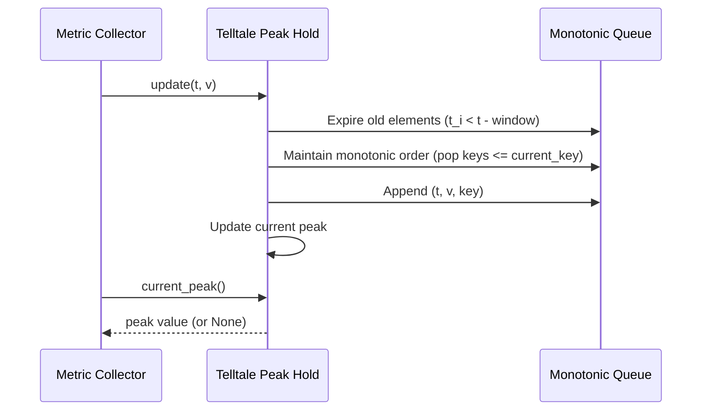

]0;C:\Users\mcwiz\AppData\Local\agy\bin\agy.EXE\]0;C:\Users\mcwiz\AppData\Local\agy\bin\agy.EXE\]0;C:\Users\mcwiz\AppData\Local\agy\bin\agy.EXE\]0;C:\Users\mcwiz\AppData\Local\agy\bin\agy.EXE\# 41 - Feature: Telltale peak-hold needle logic (pure, no GUI)

## 1. Context & Goal
* **Issue:** #41
* **Objective:** Add pure peak-hold (telltale) needle logic that tracks the maximum value reached over a sliding time window with optional decay.
* **Status:** Approved (claude-opus-4-6, 2026-07-15)
* **Related Issues:** #35 (Telltale demo target spec), #36 (Testing strategy).

### Open Questions
* None.

## 2. Proposed Changes

### 2.1 Files Changed

| File | Change Type | Description |
|------|-------------|-------------|
| `src/boostgauge/` | Add (Directory) | New directory for the boostgauge package |
| `src/boostgauge/__init__.py` | Add | Package initialization file |
| `src/boostgauge/telltale.py` | Add | Peak-hold telltale needle logic |
| `tests/unit/test_telltale.py` | Add | Unit tests for telltale needle logic |

### 2.1.1 Path Validation (Mechanical - Auto-Checked)

Mechanical validation automatically checks:
- All "Modify" files must exist in repository
- All "Delete" files must exist in repository
- All "Add" files must have existing parent directories
- No placeholder prefixes (`src/`, `lib/`, `app/`) unless directory exists

### 2.2 Dependencies

```toml

# pyproject.toml additions (if any)

# No new external dependencies required.
```

### 2.3 Data Structures

```python

# Pseudocode - NOT implementation
class TelltaleSample(TypedDict):
    timestamp: float  # Timestamp when the value was recorded
    value: float      # The actual recorded value
    key: float        # The invariant decay key used for monotonic ordering
```

### 2.4 Function Signatures

```python

# Signatures only - implementation in source files
from typing import Optional

class Telltale:
    def __init__(self, window: float, decay_rate: Optional[float] = None) -> None:
        """
        Initialize the peak-hold telltale.

        Args:
            window: Sliding window duration in seconds (must be positive).
            decay_rate: Optional decay rate in units/second (must be non-negative).
        """
        ...

    def update(self, timestamp: float, value: float) -> None:
        """
        Feed a new sample into the telltale.

        Args:
            timestamp: The timestamp of the sample. Must be >= the previous timestamp.
            value: The value of the sample.
        """
        ...

    def current_peak(self) -> Optional[float]:
        """
        Get the current peak-hold value.

        Returns:
            The peak value, or None if no samples have been received or after reset().
        """
        ...

    def reset(self) -> None:
        """
        Reset the telltale's state and clear history.
        """
        ...
```

### 2.5 Logic Flow (Pseudocode)

```
1. ON __init__(window, decay_rate):
   a. IF window <= 0:
      - RAISE ValueError("Window must be positive.")
   b. IF decay_rate is not None AND decay_rate < 0:
      - RAISE ValueError("decay_rate must be non-negative.")
   c. Set self.window = window
   d. Set self.decay_rate = decay_rate
   e. Initialize self._history as empty deque
   f. Set self._peak = None
   g. Set self._last_t = None

2. ON update(timestamp, value):
   a. IF self._last_t is not None AND timestamp < self._last_t:
      - RAISE ValueError("Timestamps must be monotonically increasing.")
   b. Set self._last_t = timestamp
   c. Cutoff = timestamp - self.window
   d. WHILE self._history is not empty AND self._history[0].timestamp < Cutoff:
      - POP front of self._history
   e. IF self.decay_rate is not None:
      - Key = value + self.decay_rate * timestamp
      ELSE:
      - Key = value
   f. WHILE self._history is not empty AND self._history[back].key <= Key:
      - POP back of self._history
   g. APPEND (timestamp, value, Key) to self._history
   h. IF self._history is empty:
      - self._peak = None
      ELSE:
      - Let front = self._history[0]
      - IF self.decay_rate is not None:
        - self._peak = front.key - self.decay_rate * timestamp
        ELSE:
        - self._peak = front.value

3. ON current_peak():
   a. RETURN self._peak

4. ON reset():
   a. Clear self._history
   b. Set self._peak = None
   c. Set self._last_t = None
```

### 2.6 Technical Approach

* **Module:** `src/boostgauge/telltale.py`
* **Pattern:** Monotonic Queue (Deque) optimization for sliding window maximum.
* **Key Decisions:** Maintain mathematical equivalence of peak decay using an invariant key: $K = V + decay\_rate \times t$. This maps the time-varying decay peak-hold search to a static sliding-window maximum query, yielding $O(1)$ amortized performance for both updates and queries. State updates are driven entirely by virtual timestamps passed to `update()`, avoiding any real-world clock dependencies.

### 2.7 Architecture Decisions

| Decision | Options Considered | Choice | Rationale |
|----------|-------------------|--------|-----------|
| Complexity optimization | Option A (linear search on query), Option B (segment tree), Option C (monotonic deque with invariant key) | Option C (monotonic deque with invariant key) | Enables O(1) amortized updates and queries, which is optimal for a high-frequency real-time tachometer loop. |
| Time Tracking | Option A (real-world system clock), Option B (virtual stream timestamps) | Option B (virtual stream timestamps) | Decouples time-tracking from the host OS clock, enabling deterministic, fast, and headless testing. |

**Architectural Constraints:**
- Must not depend on any GUI libraries (pure logic).
- Must not use system clock (virtual time driven by timestamps in stream).

## 3. Requirements

1. The `Telltale` class must be exposed in `src/boostgauge/telltale.py`.
2. The `update(timestamp, value)` and `current_peak()` methods must run in O(1) amortized time for a fixed window duration.
3. When a new value exceeds the peak, the peak must reset immediately to the new value.
4. When the time window passes without a new high, the peak must drop to the highest value still in the window.
5. With non-zero `decay_rate`, the peak must decrease monotonically (interpolated toward the current value over time) when no new high arrives.
6. The `reset()` method must clear all state, causing subsequent calls to `current_peak()` to return `None` until the next update.

## 4. Alternatives Considered

| Option | Pros | Cons | Decision |
|--------|------|------|----------|
| Option A (Linear Scan on Query) | Simple implementation, no complex key transformation | O(N) query time where N is the number of samples in the window. Poor performance under high frequency updates. | Rejected |
| Option B (Segment Tree / Heap) | O(log N) updates. Handles dynamic values. | Overhead of tree data structure, slower than O(1) deque. | Rejected |
| Option C (Monotonic Deque with Invariant Key) | O(1) amortized time for updates and queries. Memory-efficient. | Requires mathematical key transformation to handle decay. | **Selected** |

**Rationale:** The real-time nature of the racing tachometer gauge requires minimal overhead in the update loop. Option C ensures update and query speeds remain bounded and fast regardless of the number of samples in the window.

## 5. Data & Fixtures

### 5.1 Data Sources

| Attribute | Value |
|-----------|-------|
| Source | System metric collector updates (ConPTY allocations, memory usage, CPU load) |
| Format | Streams of `(timestamp, value)` tuples of floats |
| Size | Arbitrary stream length |
| Refresh | Real-time |
| Copyright/License | N/A |

### 5.2 Data Pipeline

```
Metric Collector ──update(t, v)──► Telltale Monotonic Deque ──current_peak()──► Gauge Renderer
```

### 5.3 Test Fixtures

| Fixture | Source | Notes |
|---------|--------|-------|
| Time-series samples | Generated programmatically in tests | Pure logic, no hygiene concerns. |

### 5.4 Deployment Pipeline

Implemented in python and tested via pytest. Part of the `boostgauge` library published to PyPI.

## 6. Diagram

### 6.1 Mermaid Quality Gate

- [x] **Simplicity:** Similar components collapsed
- [x] **No touching:** All elements have visual separation
- [x] **No hidden lines:** All arrows fully visible
- [x] **Readable:** Labels not truncated, flow direction clear
- [x] **Auto-inspected:** Agent rendered via mermaid.ink and viewed

**Auto-Inspection Results:**
```
- Touching elements: [x] None
- Hidden lines: [x] None
- Label readability: [x] Pass
- Flow clarity: [x] Clear
```

### 6.2 Diagram



## 7. Security & Safety Considerations

### 7.1 Security

| Concern | Mitigation | Status |
|---------|------------|--------|
| Input parameter validation | Validate initialization inputs (window > 0, decay_rate >= 0) and raise ValueError on invalid values. | Addressed |

### 7.2 Safety

| Concern | Mitigation | Status |
|---------|------------|--------|
| Memory growth under extreme sampling rates | Memory scales with sampling rate within the window. The monotonic queue naturally bounds memory usage. Metric collection should be throttled upstream. | Addressed |
| Out-of-order timestamps | Validate monotonic timestamps in `update()` and raise ValueError. | Addressed |

**Fail Mode:** Fail Closed - Any invalid configuration or non-monotonic timestamps raise a `ValueError` immediately.

**Recovery Strategy:** Re-initialize the `Telltale` instance or call `reset()` to clear any corrupted history.

## 8. Performance & Cost Considerations

### 8.1 Performance

| Metric | Budget | Approach |
|--------|--------|----------|
| Latency | < 1ms per update | Monotonic queue guarantees O(1) amortized operations. |
| Memory | < 1MB | Deque only holds elements within the active window. |
| API Calls | 0 | Pure in-memory calculation. |

**Bottlenecks:** None identified under standard operating conditions.

### 8.2 Cost Analysis

| Resource | Unit Cost | Estimated Usage | Monthly Cost |
|----------|-----------|-----------------|--------------|
| CPU / Memory | Local | Low | $0.00 |

**Cost Controls:** None needed.

**Worst-Case Scenario:** If sampling rate spikes to 1,000,000 samples/sec, deque size could grow to 60,000,000 elements for a 1-minute window, consuming ~1GB memory. Mitigation: Rate limit metric collection upstream.

## 9. Legal & Compliance

| Concern | Applies? | Mitigation |
|---------|----------|------------|
| PII/Personal Data | No | N/A |
| Third-Party Licenses | Yes | MIT License verified compatible with project. |
| Terms of Service | No | N/A |
| Data Retention | No | N/A |
| Export Controls | No | N/A |

**Data Classification:** Public

**Compliance Checklist:**
- [x] No PII stored without consent
- [x] All third-party licenses compatible with project license
- [x] External API usage compliant with provider ToS
- [x] Data retention policy documented

## 10. Verification & Testing

*Ref: [0005-testing-strategy-and-protocols.md](docs/design/0001-test-strategy.md)*

**Testing Philosophy:** Unit tier only. Headless testing with no GUI dependency. Strive for 100% automated test coverage. No visual baselines or Tkinter elements are needed.

### 10.0 Test Plan (TDD - Complete Before Implementation)

**TDD Requirement:** Tests MUST be written and failing BEFORE implementation begins.

| Test ID | Test Description | Expected Behavior | Status |
|---------|------------------|-------------------|--------|
| T010 | Class exposure and valid initialization | Telltale class can be initialized and configured | RED |
| T020 | O(1) amortized update and retrieval efficiency | Updates and queries are executed quickly under large inputs | RED |
| T030 | Reset to new high value when exceeded | Peak resets immediately to a new high value | RED |
| T040 | Window expiry drops peak to next-highest value | Peak drops to the next-highest value in window when the absolute max expires | RED |
| T050 | Monotonic decay towards current value | Peak decays monotonically when no new high arrives | RED |
| T060 | Reset clears all history and peak state | History is cleared and subsequent queries return None | RED |
| T070 | Initialization validation for window/decay | Negative/zero window or negative decay rate raises ValueError | RED |
| T080 | Decay bounded by the current value | Peak decays to the current value but does not drop below it | RED |
| T090 | Pre-first-update peak returns None | Returns None before any update has occurred | RED |
| T100 | Non-monotonic timestamp rejection | Out-of-order timestamps raise a ValueError | RED |

**Coverage Target:** 100% line and branch coverage of `src/boostgauge/telltale.py`.

**TDD Checklist:**
- [ ] All tests written before implementation
- [ ] Tests currently RED (failing)
- [ ] Test IDs match scenario IDs in 10.1
- [ ] Test file created at: [test_telltale.py](file:///C:/Users/mcwiz/Projects/boostgauge/tests/unit/test_telltale.py)

### 10.1 Test Scenarios

| ID | Scenario | Type | Input | Expected Output | Pass Criteria |
|----|----------|------|-------|-----------------|---------------|
| 010 | Class exposure and valid initialization (REQ-1) | Auto | window=60.0, decay_rate=0.5 | Telltale instance created | Object is created successfully and parameters match |
| 020 | O(1) amortized update and retrieval efficiency (REQ-2) | Auto | Stream of 10,000 updates | Fast execution | Total execution time under 0.1 seconds |
| 030 | Reset to new high value when exceeded (REQ-3) | Auto | `update(0, 5)`, `update(1, 10)` | peak = 10.0 | Peak updates to 10.0 immediately |
| 040 | Window expiry drops peak to next-highest value in window (REQ-4) | Auto | window=10, updates `(0, 10)`, `(5, 5)`, `(11, 2)` | peak = 5.0 | Peak drops to 5.0 at t=11 after 10 expires |
| 050 | Monotonic decay towards current value when no new high arrives (REQ-5) | Auto | window=10, decay=1.0, updates `(0, 10)`, `(5, 5)` | peak = 5.0 | Peak decays monotonically from 10 to 5.0 |
| 060 | Reset clears all history and peak state (REQ-6) | Auto | `update(0, 10)`, `reset()` | peak = None | Peak returns None after reset |
| 070 | Initialization validation for window/decay (REQ-1) | Auto | window=-5.0 or decay_rate=-1.0 | ValueError raised | Throws ValueError |
| 080 | Decay bounded by the current value (REQ-5) | Auto | window=10, decay=1.0, updates `(0, 10)`, `(12, 5)` | peak = 5.0 | Peak decays to 5.0 and does not drop below it |
| 090 | Pre-first-update peak returns None (REQ-3) | Auto | None | peak = None | peak returns None |
| 100 | Non-monotonic timestamp rejection (REQ-3) | Auto | `update(5, 10)`, `update(3, 5)` | ValueError raised | Throws ValueError |

### 10.2 Test Commands

```bash

# Run all automated tests
poetry run pytest tests/unit/test_telltale.py -v

# Run tests and output coverage
poetry run pytest tests/unit/test_telltale.py -v --cov=src/boostgauge/telltale --cov-report=term-missing
```

### 10.3 Manual Tests (Only If Unavoidable)

N/A - All scenarios automated.

## 11. Risks & Mitigations

| Risk | Impact | Likelihood | Mitigation |
|------|--------|------------|------------|
| Memory growth under extremely high update frequency | Med | Low | Memory usage is naturally bounded by the expiration of old events from the deque. Collection rate limits should be enforced upstream. |
| Out-of-order timestamps in distributed systems | Low | Low | Enforce strict monotonicity checks in `update()` and raise ValueError. |

## 12. Definition of Done

### Code
- [ ] Implementation complete and linted
- [ ] Code comments reference this LLD

### Tests
- [ ] All test scenarios pass
- [ ] Test coverage meets threshold

### Documentation
- [ ] LLD updated with any deviations
- [ ] Implementation Report (0103) completed
- [ ] Test Report (0113) completed if applicable

### Review
- [ ] Code review completed
- [ ] User approval before closing issue

### 12.1 Traceability (Mechanical - Auto-Checked)

Mechanical validation automatically checks:
- Every file mentioned in this section must appear in Section 2.1
  - [telltale.py](file:///C:/Users/mcwiz/Projects/boostgauge/src/boostgauge/telltale.py) (Add)
  - [test_telltale.py](file:///C:/Users/mcwiz/Projects/boostgauge/tests/unit/test_telltale.py) (Add)
- Every risk mitigation in Section 11 should have a corresponding function in Section 2.4

---

## Appendix: Review Log

### Gemini Review #1 (PENDING)

**Reviewer:** Gemini
**Verdict:** PENDING

#### Comments

| ID | Comment | Implemented? |
|----|---------|--------------|
| G1.1 | Draft Low-Level Design created. awaiting initial review. | PENDING |

### Review Summary

| Review | Date | Verdict | Key Issue |
|--------|------|---------|-----------|
| 1 | 2026-07-15 | APPROVED | `claude-opus-4-6` |
| Gemini #1 | (auto) | PENDING | Draft creation |

**Final Status:** APPROVED