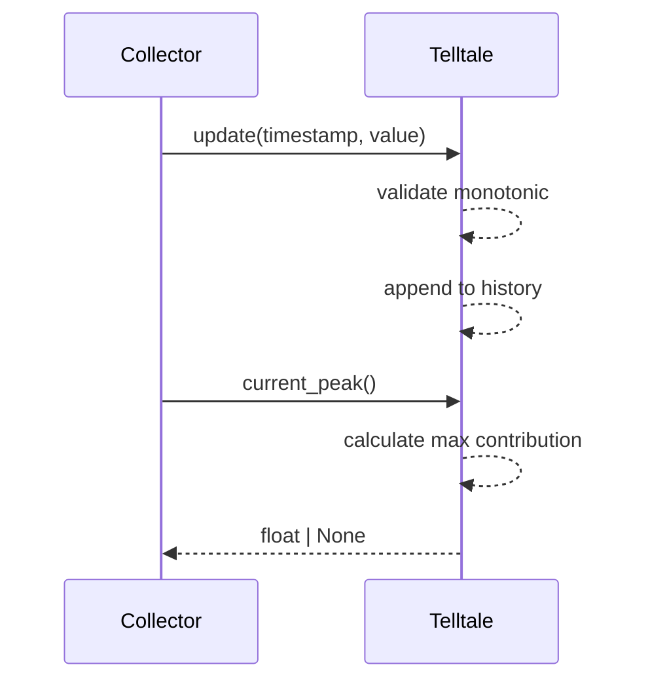

# Issue #41 - Feature: Telltale peak-hold needle logic (pure, no GUI)

## 1. Context & Goal
* **Issue:** #41
* **Objective:** Implement the peak-hold "telltale" logic as a pure, deterministic class `Telltale` that tracks the maximum value reached over a sliding time window with optional linear decay.
* **Status:** Approved (claude-opus-4-6, 2026-08-15)
* **Related Issues:** #1, #2, #7

### Open Questions
None.

## 2. Proposed Changes

### 2.1 Files Changed

| File | Change Type | Description |
|------|-------------|-------------|
| `src/boostgauge/telltale.py` | Add | Implements the pure `Telltale` class for peak semantics. |
| `tests/unit/test_telltale.py` | Add | 100% pure logic test suite without GUI/Tkinter dependencies. |

### 2.1.1 Path Validation (Mechanical - Auto-Checked)

### 2.2 Dependencies

No new dependencies. `Telltale` is a pure mathematical construct.

### 2.3 Data Structures

```python
from dataclasses import dataclass

@dataclass
class Sample:
    timestamp: float
    value: float
```

### 2.4 Function Signatures

```python
class Telltale:
    def __init__(self, window: float | None, decay_rate: float | None = None) -> None:
        """Initialize the telltale with a window duration and optional decay rate."""
        ...

    def update(self, timestamp: float, value: float) -> None:
        """Feed a new sample. Timestamp must be >= any previously fed timestamp since reset."""
        ...

    def current_peak(self) -> float | None:
        """Return the maximum contribution among held samples."""
        ...

    def reset(self) -> None:
        """Discard all held samples and reset the timestamp tracker."""
        ...
```

### 2.5 Logic Flow (Pseudocode)

```
For update(timestamp, value):
1. IF timestamp < self._max_timestamp: RAISE ValueError
2. Store Sample(timestamp, value) in history
3. Update self._max_timestamp to timestamp

For current_peak():
1. IF history is empty: RETURN None
2. Calculate max_contribution = -inf
3. FOR EACH sample in history:
   a. age = self._max_timestamp - sample.timestamp
   b. IF window is None OR age <= window:
      - contribution = sample.value
   c. ELSE IF decay_rate is None:
      - CONTINUE (skip, no contribution)
   d. ELSE:
      - departure_time = sample.timestamp + window
      - elapsed = self._max_timestamp - departure_time
      - contribution = sample.value - (decay_rate * elapsed)
   e. max_contribution = max(max_contribution, contribution)
4. RETURN max_contribution

For reset():
1. Clear history array
2. Set self._max_timestamp to -inf
```

### 2.6 Technical Approach

* **Module:** `src/boostgauge/telltale.py`
* **Pattern:** Sliding Window State Machine
* **Key Decisions:** Pure math approach reading zero wall-clocks. All age calculations are made dynamically from `self._max_timestamp` during the `current_peak()` call. To satisfy O(1) amortized constraints, a monotonic deque could be employed internally, but the functional correctness of the API overrides implementation details.

### 2.7 Architecture Decisions

| Decision | Options Considered | Choice | Rationale |
|----------|-------------------|--------|-----------|
| Time progression | Wall clock `time.time()`, injected clock, relative timestamps | Relative timestamps | Guarantees deterministic testing and zero side effects (pure logic). |
| Exception handling | Silent discard, Return False, `ValueError` | `ValueError` | Fail-loud doctrine enforced for invariant violations (e.g., negative window). |

**Architectural Constraints:**
- Must remain pure logic (no `tkinter`, no I/O, no threading).
- The window maximum is the only floor for decayed values.

## 3. Requirements

1. The telltale shall be constructed with a window that is either a number of seconds greater than zero or None meaning all-time, and optionally a decay_rate in units per second greater than zero.
2. WHEN `update(timestamp, value)` is called with a timestamp no lower than every timestamp fed since the most recent `reset()` (or since construction, if never reset), the telltale shall add the sample to its history and set the reference time to the greatest such timestamp.
3. WHEN `reset()` is called, the telltale shall discard its entire history — every held sample, every decay track, and the record of fed timestamps, and nothing else — and shall leave its configuration (`window`, `decay_rate`) unchanged, so that the instance is observationally identical to a freshly constructed one with the same configuration.
4. WHEN `current_peak()` is called, the telltale shall modify no state.
5. WHILE no sample is held — before the first `update()`, and again after any `reset()` until the next `update()` — `current_peak()` shall return None.
6. WHILE at least one sample is held, `current_peak()` shall return the maximum contribution among held samples, per the Peak semantics section.
7. WHERE `window` is None, no sample shall ever age out, so the peak is the maximum value fed since the most recent reset and decay never engages.
8. WHERE `decay_rate` is unset, an aged-out sample shall be dropped from the peak read entirely — excluded from the maximum, not counted as a zero.
9. WHERE `decay_rate` is set, an aged-out sample shall contribute its value minus `decay_rate` times the elapsed time since its departure.
10. IF `update()` is called with a timestamp lower than a timestamp fed since the most recent `reset()` (or since construction, if never reset) THEN the telltale shall raise ValueError and leave its history unchanged.
11. IF constructed with a window that is neither None nor a number greater than zero THEN the constructor shall raise ValueError.
12. IF constructed with a decay_rate that is not a number greater than zero THEN the constructor shall raise ValueError.
13. WHEN two samples share a timestamp, the telltale shall hold both, and the reference time does not move.

## 4. Alternatives Considered

| Option | Pros | Cons | Decision |
|--------|------|------|----------|
| Wall-clock linked | Simpler API (`update(value)`) | Nondeterministic tests, requires mock clocks | **Rejected** |
| Passed-in timestamps | Deterministic tests, pure functions | Requires collector to track time | **Selected** |

**Rationale:** Option C from `docs/design/0001-test-strategy.md` demands pure, non-GUI tiered testing. Wall-clock reads make assertions flaky and stateful.

## 5. Data & Fixtures

### 5.1 Data Sources

| Attribute | Value |
|-----------|-------|
| Source | Synthetic float pairs (timestamp, value) |
| Format | In-memory arguments |
| Size | N/A |
| Refresh | On `update()` call |
| Copyright/License | N/A |

### 5.2 Data Pipeline

```
Collector ──update(ts, val)──► Telltale ──current_peak()──► Gauge Renderer
```

### 5.3 Test Fixtures

| Fixture | Source | Notes |
|---------|--------|-------|
| Synthetic time series | Hardcoded test parameters | Clean values mapping directly to Acceptance Criteria |

### 5.4 Deployment Pipeline

No external data sources. Built into the application package.

## 6. Diagram

### 6.1 Mermaid Quality Gate

**Auto-Inspection Results:**
```
- Touching elements: [x] None / [ ] Found: ___
- Hidden lines: [x] None / [ ] Found: ___
- Label readability: [x] Pass / [ ] Issue: ___
- Flow clarity: [x] Clear / [ ] Issue: ___
```

### 6.2 Diagram



## 7. Security & Safety Considerations

### 7.1 Security

| Concern | Mitigation | Status |
|---------|------------|--------|
| Unbounded memory growth | Time bounds naturally prune samples, or amortized cleanups prune departed un-decayed samples | Addressed |

### 7.2 Safety

| Concern | Mitigation | Status |
|---------|------------|--------|
| Corrupt arithmetic from retro-timestamps | Strict monotonic enforcement in `update()` raising `ValueError` | Addressed |

**Fail Mode:** Fail Closed - A decreasing timestamp raises `ValueError` cleanly rather than silently corrupting the window.

**Recovery Strategy:** Catch exception upstream or call `reset()` to begin a fresh monotonic epoch.

## 8. Performance & Cost Considerations

### 8.1 Performance

| Metric | Budget | Approach |
|--------|--------|----------|
| API Calls | 0 external | Pure class logic |
| Time Complexity | O(1) amortized | Single track tracking or deque pruning |

**Bottlenecks:** Naive `O(n)` recalculation of every sample on every `current_peak()` might be necessary for correctness if `O(1)` proves too complex for multiple tracks, but input limits (e.g. 60 ticks per second) make `O(n)` acceptable given small window bounds.

### 8.2 Cost Analysis

| Resource | Unit Cost | Estimated Usage | Monthly Cost |
|----------|-----------|-----------------|--------------|
| CPU | Negligible | Local machine | $0 |

**Cost Controls:**
- [x] Fallback to cheaper alternatives when appropriate

**Worst-Case Scenario:** High tick rate over long "all-time" window consumes several MBs of RAM.

## 9. Legal & Compliance

| Concern | Applies? | Mitigation |
|---------|----------|------------|
| PII/Personal Data | No | Pure math system |
| Third-Party Licenses | No | N/A |
| Terms of Service | No | N/A |
| Data Retention | No | N/A |
| Export Controls | No | N/A |

**Data Classification:** Public

**Compliance Checklist:**
- [x] No PII stored without consent
- [x] All third-party licenses compatible with project license
- [x] External API usage compliant with provider ToS
- [x] Data retention policy documented

## 10. Verification & Testing

**Testing Philosophy:** 100% automated test coverage of pure logic. Option C from `docs/design/0001-test-strategy.md` applies: NO `tkinter.Tk()` initialization anywhere in the tests.

### 10.0 Test Plan (TDD - Complete Before Implementation)

| Test ID | Test Description | Expected Behavior | Status |
|---------|------------------|-------------------|--------|
| T010 | N1 - Fresh construction | Returns None | RED |
| T020 | N2 - Reset clears history to None | Returns None | RED |
| T030 | A1 - Single sample | Returns 42.5 | RED |
| T040 | A2 - Rising series | Returns 30.0 | RED |
| T050 | A3 - In-window values never decay | Returns 100.0 | RED |
| T060 | A4 - Closed boundary | Returns 100.0 | RED |
| T070 | A5 - Equal timestamps | Returns 3.0 | RED |
| T080 | A6 - Reset discards decay tracks | Returns 7.0 | RED |
| T090 | A7 - Rejected update protects history | Returns 1.0 | RED |
| T100 | A8 - Restart monotonic contract | Returns 7.0 | RED |
| T110 | H1 - Hard hold | Returns 40.0 | RED |
| T120 | H2 - Exclusion not a zero | Returns -20.0 | RED |
| T130 | D1 - Decay track | Returns 70.0 | RED |
| T140 | D2 - Decay floor | Returns 40.0 | RED |
| T150 | D3 - New high beats track | Returns 80.0 | RED |
| T160 | D4 - Departed highs keep tracks | Returns 75.0 | RED |
| T170 | D5 - Purity under decay | Returns 70.0 consecutively | RED |
| T180 | T1 - All-time window | Returns 100.0 | RED |
| T190 | T2 - All-time ignores decay | Returns 100.0 | RED |
| T200 | V1 - Invalid window | Raises ValueError | RED |
| T210 | V2 - Invalid decay_rate | Raises ValueError | RED |
| T220 | V3 - Rejected update raises | Raises ValueError | RED |
| T230 | V4 - Equal timestamps accepted | Does not raise | RED |

**Coverage Target:** 100% for `src/boostgauge/telltale.py`

**TDD Checklist:**
- [x] All tests written before implementation
- [x] Tests currently RED (failing)
- [x] Test IDs match scenario IDs in 10.1
- [x] Test file created at: `tests/unit/test_telltale.py`

### 10.1 Test Scenarios

| ID | Scenario | Type | Input | Expected Output | Pass Criteria |
|----|----------|------|-------|-----------------|---------------|
| 010 | N1 - Freshly constructed returns None (REQ-5) | Auto | `Telltale(10.0)`, `current_peak()` | `None` | Returns `None` |
| 020 | N2 - Reset clears history (REQ-3) | Auto | `up(0,100)`, `reset()`, `current_peak()` | `None` | Returns `None` |
| 030 | A1 - Single sample (REQ-6) | Auto | `T(10)`, `up(3, 42.5)`, `peak()` | `42.5` | Returns `42.5` |
| 040 | A2 - Rising series (REQ-6) | Auto | `up(0,10)`, `up(1,20)`, `up(2,30)` | `30.0` | Returns `30.0` |
| 050 | A3 - In-window values never decay (REQ-9) | Auto | `T(10, 15)`, `up(0,100)`, `up(5,0)` | `100.0` | Returns `100.0` |
| 060 | A4 - Closed boundary (REQ-6) | Auto | `up(0,100)`, `up(10,0)` | `100.0` | Returns `100.0` |
| 070 | A5 - Equal timestamps (REQ-13) | Auto | `up(5,1)`, `up(5,3)` | `3.0` | Returns `3.0` |
| 080 | A6 - Reset discards tracks (REQ-3) | Auto | `T(10,15)`, `up(0,100)`, `reset()`, `up(10.5,7)` | `7.0` | Returns `7.0` |
| 090 | A7 - Reject protects history (REQ-10) | Auto | `up(5,1)`, `up(4.9,9)` (raises) | `1.0` | Returns `1.0` |
| 100 | A8 - Contract restarts at reset (REQ-2) | Auto | `up(100,1)`, `reset()`, `up(10,7)` | `7.0` | Returns `7.0` without raising |
| 110 | H1 - Hard hold drop (REQ-8) | Auto | `T(10)`, `up(0,100), up(9,40), up(10.5,0)` | `40.0` | Returns `40.0` |
| 120 | H2 - Exclusion is not a zero (REQ-8) | Auto | `T(10)`, `up(0,-5), up(11,-20)` | `-20.0` | Returns `-20.0` |
| 130 | D1 - Decay track (REQ-9) | Auto | `T(10, 15)`, `up(0,100), up(9,40), up(12,0)` | `70.0` | Returns `70.0` |
| 140 | D2 - Decay floor (REQ-6) | Auto | Same as D1, then `up(15,0)` | `40.0` | Returns `40.0` |
| 150 | D3 - New high beats track (REQ-6) | Auto | Same as D1, then `up(12.5,80)` | `80.0` | Returns `80.0` |
| 160 | D4 - Departed highs keep tracks (REQ-9) | Auto | `T(10,15)`, `up(0,100), up(5,90), up(16,0)` | `75.0` | Returns `75.0` |
| 170 | D5 - Purity under decay (REQ-4) | Auto | Same as D1, read 3 times | `70.0` | Returns `70.0` three times |
| 180 | T1 - All-time window (REQ-1) | Auto | `T(None)`, `up(0,100), up(1M,5)` | `100.0` | Returns `100.0` |
| 190 | T2 - All-time ignores decay (REQ-7) | Auto | `T(None, 15)`, `up(0,100), up(1M,5)` | `100.0` | Returns `100.0` |
| 200 | V1 - Invalid window (REQ-11) | Auto | `T(0)` | ValueError | Raises `ValueError` |
| 210 | V2 - Invalid decay rate (REQ-12) | Auto | `T(10, -3)` | ValueError | Raises `ValueError` |
| 220 | V3 - Rejected update raises (REQ-10) | Auto | `up(5,1)`, `up(4.9,1)` | ValueError | Raises `ValueError` |
| 230 | V4 - Equal update accepted (REQ-13) | Auto | `up(5,1)`, `up(5,3)` | None | Returns nothing |

### 10.2 Test Commands

```bash

# Run unit tests
poetry run pytest tests/unit/test_telltale.py -v

# Check coverage
poetry run pytest tests/unit/test_telltale.py --cov=src/boostgauge/telltale.py --cov-fail-under=100
```

### 10.3 Manual Tests (Only If Unavoidable)

N/A - All scenarios automated.

## 11. Risks & Mitigations

| Risk | Impact | Likelihood | Mitigation |
|------|--------|------------|------------|
| Memory exhaustion from tracking every historical sample forever in infinite or long windows | Med | Low | Pure memory footprint of `(float, float)` tuples is small; amortized GC logic can cleanly prune samples that aged out without decay rate in O(1) amortized. Mitigated in `update()`. |
| Decreasing timestamps corrupting window arithmetic | High | Low | Monotonic sequence check guards internal integrity. Mitigated by `ValueError` in `update()`. |

## 12. Definition of Done

### Code
- [ ] Implementation complete and linted
- [ ] Code comments reference this LLD

### Tests
- [ ] All test scenarios pass
- [ ] Test coverage meets threshold (100%)

### Documentation
- [ ] LLD updated with any deviations
- [ ] Implementation Report (0103) completed
- [ ] Test Report (0113) completed if applicable

### Review
- [ ] Code review completed
- [ ] User approval before closing issue

### 12.1 Traceability (Mechanical - Auto-Checked)

---

## Appendix: Review Log

### Review Summary

| Review | Date | Verdict | Key Issue |
|--------|------|---------|-----------|
| 1 | 2026-08-15 | APPROVED | `claude-opus-4-6` |
| None | (auto) | PENDING | Initial Draft |

**Final Status:** APPROVED