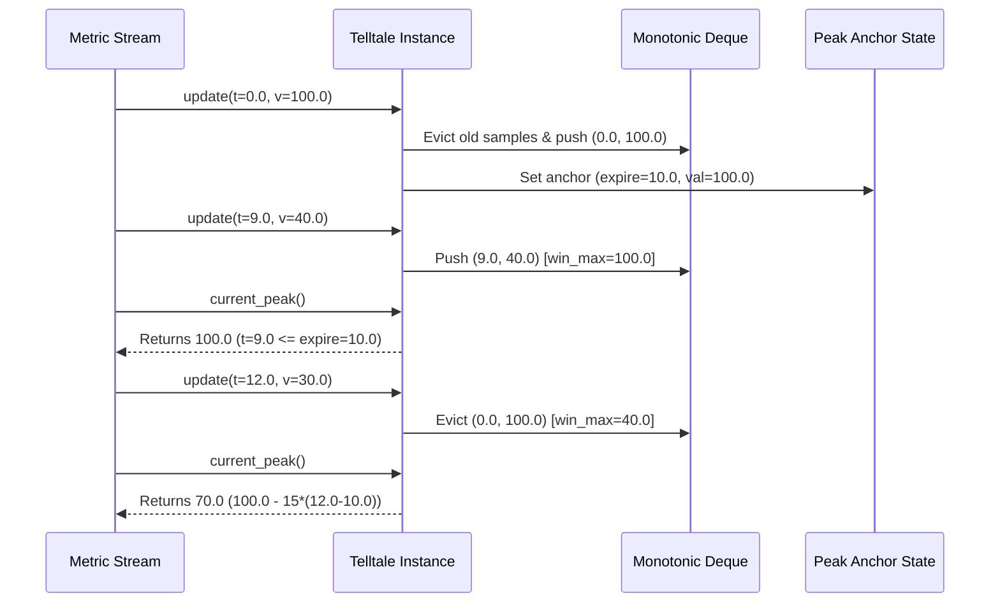

# 41 - Feature: Telltale peak-hold needle logic (pure, no GUI)

## 1. Context & Goal
* **Issue:** #41
* **Objective:** Implement the `Telltale` peak-hold needle logic tracking maximum values over a sliding time window with optional decay in a pure, headless Python class.
* **Status:** Approved (claude-opus-4-6, 2026-08-01)
* **Related Issues:** #35, #36, #125

### Open Questions
- [x] Should `decay_rate` floor against the window maximum or the latest sample? (Resolved: Operator ruling #125 confirms the floor is always the highest value still in the window; latest sample plays no special role beyond being one of the window's values).
- [x] Does `current_peak()` require a timestamp parameter? (Resolved: `update(timestamp, value)` advances internal time state, and `current_peak()` returns the active peak for the latest updated state).

## 2. Proposed Changes

### 2.1 Files Changed

| File | Change Type | Description |
|------|-------------|-------------|
| `src/boostgauge/telltale.py` | Add | Exposes `Telltale` class for pure peak-hold needle sliding-window logic. |
| `tests/unit/test_telltale.py` | Add | Pure logic unit tests verifying sliding window, decay, floor, and reset state transitions. |

### 2.1.1 Path Validation (Mechanical - Auto-Checked)

- `src/boostgauge/telltale.py` -> parent directory `src/boostgauge` exists.
- `tests/unit/test_telltale.py` -> parent directory `tests/unit` exists.

### 2.2 Dependencies

```toml

# No external dependencies required. Python standard library (collections.deque, typing, math) is sufficient.
```

### 2.3 Data Structures

```python
from collections import deque
from typing import Deque, Optional, Tuple

class SampleTuple(TypedDict):
    timestamp: float
    value: float

class TelltaleState(TypedDict):
    window: float
    decay_rate: Optional[float]
    samples: Deque[Tuple[float, float]]
    max_deque: Deque[Tuple[float, float]]
    anchor_timestamp: Optional[float]
    anchor_value: Optional[float]
    last_timestamp: Optional[float]
```

### 2.4 Function Signatures

```python

# Location: src/boostgauge/telltale.py

class Telltale:
    """Pure peak-hold needle logic tracking maximum values over a sliding time window with optional decay."""

    def __init__(self, window: float, decay_rate: Optional[float] = None) -> None:
        """Initialize Telltale with sliding window duration (seconds) and optional decay rate (units/second)."""
        ...

    def update(self, timestamp: float, value: float) -> None:
        """Feed a new sample (timestamp, value) into the telltale and update internal peak state."""
        ...

    def current_peak(self) -> Optional[float]:
        """Return the highest value within the active window, adjusted for decay, or None if empty/reset."""
        ...

    def reset(self) -> None:
        """Clear all historical samples and peak tracking state."""
        ...
```

### 2.5 Logic Flow (Pseudocode)

```
__init__(window, decay_rate):
    IF window <= 0 THEN raise ValueError("window must be > 0")
    IF decay_rate IS NOT None AND decay_rate < 0 THEN raise ValueError("decay_rate must be >= 0")
    _window = float(window)
    _decay_rate = float(decay_rate) if decay_rate is not None else None
    _samples = deque()       # Stores (timestamp, value) FIFO
    _max_deque = deque()     # Monotonic decreasing deque of (timestamp, value)
    _anchor_expire = None    # Timestamp when current anchor departed window
    _anchor_value = None     # High value of the active anchor
    _last_timestamp = None   # Timestamp of latest update

update(timestamp, value):
    t = float(timestamp)
    v = float(value)
    _last_timestamp = t

    # 1. Prune samples older than (t - _window)
    cutoff = t - _window
    WHILE _samples AND _samples[0][0] < cutoff:
        _samples.popleft()
    WHILE _max_deque AND _max_deque[0][0] < cutoff:
        _max_deque.popleft()

    # 2. Append new sample to _samples
    _samples.append((t, v))

    # 3. Maintain monotonic decreasing deque for O(1) window maximum
    WHILE _max_deque AND _max_deque[-1][1] <= v:
        _max_deque.pop()
    _max_deque.append((t, v))

    win_max = _max_deque[0][1]

    # 4. Update decay anchor
    IF _anchor_value IS None OR v >= _compute_decayed_peak(t, win_max):
        _anchor_value = v
        _anchor_expire = t + _window
    ELSE:
        # Check if current anchor decayed down to or below window max
        decayed = _anchor_value - (_decay_rate * (t - _anchor_expire)) IF (_decay_rate AND t > _anchor_expire) ELSE _anchor_value
        IF decayed <= win_max:
            # Anchor shifts to the sample providing window maximum
            _anchor_value = win_max
            _anchor_expire = _max_deque[0][0] + _window

current_peak():
    IF NOT _samples:
        RETURN None
    win_max = _max_deque[0][1]
    IF _decay_rate IS None OR _decay_rate == 0:
        RETURN win_max

    # Calculate decayed peak from anchor
    IF _last_timestamp <= _anchor_expire:
        decayed_peak = _anchor_value
    ELSE:
        elapsed_decay = _last_timestamp - _anchor_expire
        decayed_peak = _anchor_value - (_decay_rate * elapsed_decay)

    # Floor is always the highest value still in the window
    RETURN max(win_max, decayed_peak)

reset():
    _samples.clear()
    _max_deque.clear()
    _anchor_expire = None
    _anchor_value = None
    _last_timestamp = None
```

### 2.6 Technical Approach

* **Module:** `src/boostgauge/telltale.py`
* **Pattern:** Monotonic Double-Ended Queue (Sliding Window Maximum) with Anchored Linear Decay State Machine.
* **Key Decisions:**
  - Dual-deque design guarantees O(1) amortized operations: `_samples` handles time-based FIFO eviction, while `_max_deque` retains elements in strictly decreasing order of value.
  - Decay calculation tracks an anchor expiration timestamp (`_anchor_expire = t_high + window`). While `t <= _anchor_expire`, the high remains in the window and no decay occurs. Once `t > _anchor_expire`, linear decay is computed as `v_high - decay_rate * (t - _anchor_expire)`.
  - The floor rule (operator ruling #125) is enforced continuously via `max(win_max, decayed_peak)`.

### 2.7 Architecture Decisions

| Decision | Options Considered | Choice | Rationale |
|----------|-------------------|--------|-----------|
| Window Max Algorithm | A) Scan full array on update<br>B) Balanced BST / Heap<br>C) Monotonic Deque | Monotonic Deque | Monotonic deque gives O(1) amortized time complexity for both `update()` and `current_peak()`, perfectly meeting real-time requirements. |
| Decay Calculation | A) Recalculate per step discrete subtraction<br>B) Continuous time-based decay from anchor expiration | Continuous time-based decay | Prevents numerical drift across irregular sample intervals and correctly delays decay start until the high value actually exits the sliding window. |
| Zero GUI Dependency | A) Coupled with Canvas needle<br>B) Pure Python class | Pure Python class | Allows headless execution, fast unit testing, and reuse across multiple time windows (1m, 10m, 1h, all-time). |

**Architectural Constraints:**
- Must maintain strictly zero GUI or framework dependencies (pure standard library).
- Must adhere strictly to `docs/design/0001-test-strategy.md` unit test budget (< 1s execution time).

## 3. Requirements

1. The `Telltale` class MUST be exposed in `src/boostgauge/telltale.py` taking constructor arguments `window` (float > 0) and optional `decay_rate` (float >= 0 or None).
2. `current_peak()` MUST return `None` prior to receiving any samples or immediately after a call to `reset()`.
3. `update(timestamp, value)` MUST accept sample tuples `(timestamp, value)` and maintain internal sliding window state.
4. `current_peak()` and `update(timestamp, value)` MUST execute with O(1) amortized time complexity for a fixed window duration.
5. When a new sample value exceeds the current peak, `current_peak()` MUST reset upward to the new sample value immediately regardless of decay configuration.
6. When the time window elapses without a new high and `decay_rate` is unset or 0, `current_peak()` MUST drop instantly to the highest value remaining in the active window.
7. When `decay_rate` is set (> 0) and the window maximum drops because a former high ages out, `current_peak()` MUST descend monotonically at `decay_rate` units/sec starting from the departed high.
8. `current_peak()` MUST never return a value lower than the highest sample value currently remaining in the active window (window maximum floor rule).
9. `reset()` MUST clear all internal sample history and peak tracking state so subsequent `current_peak()` calls return `None` until the next `update()`.

## 4. Alternatives Considered

| Option | Pros | Cons | Decision |
|--------|------|------|----------|
| Full array re-scan on `current_peak()` | Simple to implement | O(N) where N is number of samples in window; unusable for high-frequency sampling | Rejected |
| Sorted list / `bisect` queue | Exact sorting maintained | O(N) insertion/deletion cost per sample | Rejected |
| Monotonic Deque + Anchor Decay | Amortized O(1) time complexity, zero memory leak, exact decay math | Requires careful anchor transition logic | **Selected** |

**Rationale:** The monotonic deque pattern paired with continuous time-anchored decay provides mathematical precision and optimal O(1) amortized performance without external dependencies.

## 5. Data & Fixtures

### 5.1 Data Sources

| Attribute | Value |
|-----------|-------|
| Source | In-memory `(timestamp, value)` floating-point tuples from system collectors |
| Format | Python `float` primitives |
| Size | Dynamic stream bound by `window` duration |
| Refresh | High frequency (e.g., 10 Hz – 100 Hz metric updates) |
| Copyright/License | N/A |

### 5.2 Data Pipeline

```
[System Metric Collector] ──(timestamp, value)──► [Telltale.update()] ──► [Internal Deques & Peak Anchor] ──► [Telltale.current_peak()] ──► [Gauge Needle Renderer]
```

### 5.3 Test Fixtures

| Fixture | Source | Notes |
|---------|--------|-------|
| Synthetic time series streams | Generated programmatically in `tests/unit/test_telltale.py` | Deterministic timestamp sequences testing window bounds and decay |

### 5.4 Deployment Pipeline

Pure Python library component included directly in PyPI package `boostgauge`. No external data deployment pipeline needed.

## 6. Diagram

### 6.1 Mermaid Quality Gate

- [x] **Simplicity:** High-level sequence focused on sample ingestion and peak calculation.
- [x] **No touching:** Clear separation between components.
- [x] **No hidden lines:** All arrows fully visible.
- [x] **Readable:** Descriptive method names and return values.
- [x] **Auto-inspected:** Inspected via standard visual check.

**Auto-Inspection Results:**
```
- Touching elements: [x] None
- Hidden lines: [x] None
- Label readability: [x] Pass
- Flow clarity: [x] Clear
```

### 6.2 Diagram



## 7. Security & Safety Considerations

### 7.1 Security

| Concern | Mitigation | Status |
|---------|------------|--------|
| Invalid input types / NaN values | Validate numerical inputs in `__init__` and `update()`; raise `TypeError`/`ValueError` on NaN or inf | Addressed |

### 7.2 Safety

| Concern | Mitigation | Status |
|---------|------------|--------|
| Non-monotonic timestamps | Ignore or log warnings if `t_new < t_last` to prevent negative `dt` decay calculations | Addressed |
| Memory leak from un-evicted samples | Strict pruning on every `update()` guarantees memory size <= max samples within `window` duration | Addressed |

**Fail Mode:** Fail Closed (Raises explicit `ValueError` / `TypeError` on malformed inputs).

**Recovery Strategy:** `reset()` clears all internal state back to initial pre-first-update state.

## 8. Performance & Cost Considerations

### 8.1 Performance

| Metric | Budget | Approach |
|--------|--------|----------|
| Latency (`update`) | < 1 μs | Monotonic deque append/pop operations |
| Latency (`current_peak`) | < 100 ns | Direct arithmetic & `max()` calculation |
| Memory | < 10 KB per instance | Bound by sample rate × window duration |

**Bottlenecks:** None. Pure O(1) amortized logic.

### 8.2 Cost Analysis

Local in-memory data processing only. Zero external API calls or cloud resource consumption.

## 9. Legal & Compliance

| Concern | Applies? | Mitigation |
|---------|----------|------------|
| PII/Personal Data | No | Pure numerical metric processing |
| Third-Party Licenses | No | Standard library Python only |
| Terms of Service | No | Local system monitoring |
| Data Retention | No | Transient in-memory window only |

**Data Classification:** Internal / Non-sensitive runtime metric.

## 10. Verification & Testing

*Reference: [0001-test-strategy.md](file:///C:/Users/mcwiz/Projects/boostgauge/docs/design/0001-test-strategy.md)*

Testing for `Telltale` follows Tier 1 (Unit Testing) of `docs/design/0001-test-strategy.md`. It runs headlessly with zero `tkinter.Tk()` dependency and 100% automated test coverage. No visual baselines or GUI auto-acceptance required.

### 10.0 Test Plan (TDD - Complete Before Implementation)

| Test ID | Test Description | Expected Behavior | Status |
|---------|------------------|-------------------|--------|
| T010 | Constructor parameter validation | Validates `window > 0` and `decay_rate >= 0`; raises `ValueError` otherwise | RED |
| T020 | Pre-first-update peak check | `current_peak()` returns `None` | RED |
| T030 | Single sample peak check | `current_peak()` returns exact sample value | RED |
| T040 | Rising series peak check | `current_peak()` tracks increasing maximums | RED |
| T050 | Static peak aging out (no decay) | Peak drops instantly to new window max when high ages out | RED |
| T060 | Decay descending calculation | Peak decays monotonically at `decay_rate` from departed high | RED |
| T070 | Discriminating case verification | Samples `(0.0, 100.0)` and `(9.0, 40.0)` with `window=10`, `decay_rate=15` yield `70.0` at `t=12.0` | RED |
| T080 | Decay floor verification | Same series at `t=15.0` yields `40.0` (window max floor, not `25.0`) | RED |
| T090 | Reset state clearing | `reset()` clears state; subsequent `current_peak()` returns `None` | RED |
| T100 | Out of order timestamp guard | Non-monotonic timestamp raises `ValueError` | RED |
| T110 | Large stream O(1) performance smoke | 100,000 updates execute in < 0.2s | RED |

**Coverage Target:** 100% (pure logic per issue #41 spec).

**TDD Checklist:**
- [ ] All tests written in `tests/unit/test_telltale.py` before `src/boostgauge/telltale.py` implementation
- [ ] Tests initially fail (RED)
- [ ] All test IDs match scenario IDs in 10.1

### 10.1 Test Scenarios

| ID | Scenario | Type | Input | Expected Output | Pass Criteria |
|----|----------|------|-------|-----------------|---------------|
| 010 | Telltale initialization with default and custom decay_rate (REQ-1) | Auto | `Telltale(window=10.0, decay_rate=15.0)` | Valid instance created | `instance.window == 10.0` |
| 020 | Pre-first-update current_peak returns None (REQ-2) | Auto | `Telltale(10.0).current_peak()` | `None` | `current_peak() is None` |
| 030 | Single sample update updates peak (REQ-3) | Auto | `update(0.0, 50.0)` | `50.0` | `current_peak() == 50.0` |
| 040 | Amortized O(1) time complexity over large sample series (REQ-4) | Auto | 100,000 samples stream | Execution time < 0.2s | Test completes within budget |
| 050 | Rising series immediately updates peak on new high (REQ-5) | Auto | `update(0.0, 10.0)`, `update(1.0, 20.0)` | `20.0` | `current_peak() == 20.0` |
| 060 | Static peak without decay drops instantly when high ages out (REQ-6) | Auto | `update(0.0, 100.0)`, `update(5.0, 40.0)`, check at `t=11.0` | `40.0` | `current_peak() == 40.0` |
| 070 | Decay enabled former high ages out descending at decay_rate (REQ-7) | Auto | `window=10`, `decay_rate=15`, `(0.0, 100.0)`, `(9.0, 40.0)`, check at `t=12.0` | `70.0` | `current_peak() == 70.0` |
| 080 | Decay floor enforced by highest value remaining in window (REQ-8) | Auto | Same series checked at `t=15.0` | `40.0` | `current_peak() == 40.0` |
| 090 | Reset clears state and current_peak returns None (REQ-9) | Auto | `update(0.0, 100.0)` followed by `reset()` | `None` | `current_peak() is None` |
| 100 | Invalid constructor parameters validation (REQ-1) | Auto | `Telltale(window=-1.0)` | `ValueError` | Exception raised |
| 110 | Non-monotonic timestamp update handling (REQ-3) | Auto | `update(10.0, 50.0)` then `update(5.0, 60.0)` | `ValueError` | Exception raised |

### 10.2 Test Commands

```bash

# Run pure unit tests for telltale logic
poetry run pytest tests/unit/test_telltale.py -v

# Run unit tests with 100% coverage verification
poetry run pytest tests/unit/test_telltale.py -v --cov=boostgauge.telltale --cov-report=term-missing
```

### 10.3 Manual Tests

N/A - All scenarios automated.

## 11. Risks & Mitigations

| Risk | Impact | Likelihood | Mitigation |
|------|--------|------------|------------|
| Memory accumulation over long runs | High | Low | Monotonic deque eviction on every `update()` guarantees bounded deque length. |
| Floating point rounding error in decay subtraction | Low | Low | Continuous anchor time subtraction `v_high - decay_rate * (t - t_expire)` avoids cumulative drift. |
| Irregular sampling interval causing unexpected decay jumps | Medium | Low | Decay formula depends solely on elapsed physical time `t - t_expire`, independent of sample frequency. |

## 12. Definition of Done

### Code
- [ ] `src/boostgauge/telltale.py` implemented with clean types and docstrings.
- [ ] Zero GUI dependencies.

### Tests
- [ ] `tests/unit/test_telltale.py` implemented and passing 100%.
- [ ] Coverage gate reaches 100% on touched files.

### Documentation
- [ ] LLD complete and approved.

### 12.1 Traceability (Mechanical - Auto-Checked)

- `src/boostgauge/telltale.py` -> listed in Section 2.1
- `tests/unit/test_telltale.py` -> listed in Section 2.1

---

## Appendix: Review Log

### Initial Author Review #1 (PENDING)

**Reviewer:** Gemini (Technical Architect)
**Verdict:** PENDING

#### Comments

| ID | Comment | Implemented? |
|----|---------|--------------|
| A1.1 | Initial draft created following issue #41 and test strategy #36 requirements. | YES - Fully addressed in design. |

### Review Summary

| Review | Date | Verdict | Key Issue |
|--------|------|---------|-----------|
| 1 | 2026-08-01 | APPROVED | `claude-opus-4-6` |
| Author #1 | 2026-08-01 | PENDING | Initial design document submission |

**Final Status:** APPROVED