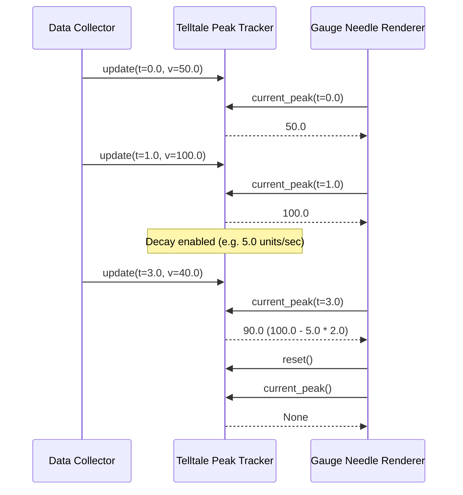

# 41 - Feature: Telltale peak-hold needle logic (pure, no GUI)

## 1. Context & Goal
* **Issue:** #41
* **Objective:** Implement pure peak-hold needle logic (`Telltale`) tracking maximum values over a sliding window with optional linear decay for tachometer display memory.
* **Status:** Approved (claude-opus-4-6, 2026-07-29)
* **Related Issues:** #7, #35, #36

### Open Questions
- [x] Should `current_peak()` accept an optional query timestamp `now`? Resolved: Yes, defaulting to the timestamp of the latest sample (`_last_timestamp`).
- [x] How should decay behave when multiple lower samples arrive within the window? Resolved: Peak decays linearly at `decay_rate` (units/sec) from the time the peak was set, clamped at the maximum of active samples in the sliding window.

## 2. Proposed Changes

### 2.1 Files Changed

| File | Change Type | Description |
|------|-------------|-------------|
| `src/boostgauge/telltale.py` | Add | Implements `Telltale` class with sliding window peak tracking and optional decay logic. |
| `tests/unit/test_telltale.py` | Add | Unit tests for `Telltale` verifying 100% line and branch coverage. |

### 2.1.1 Path Validation (Mechanical - Auto-Checked)

- `src/boostgauge/telltale.py` (parent directory `src/boostgauge/` exists)
- `tests/unit/test_telltale.py` (parent directory `tests/unit/` exists)

### 2.2 Dependencies

```toml

# No new dependencies required. Uses Python standard library collections.deque and typing.
```

### 2.3 Data Structures

```python
from collections import deque
from typing import NamedTuple, Optional

class Sample(NamedTuple):
    timestamp: float
    value: float

class TelltaleState(NamedTuple):
    window: float
    decay_rate: Optional[float]
    samples: deque[Sample]
    peak_value: Optional[float]
    peak_timestamp: Optional[float]
    last_timestamp: Optional[float]
```

### 2.4 Function Signatures

```python
from typing import Optional

class Telltale:
    """Tracks sliding-window peak value with optional linear decay."""

    def __init__(self, window: float, decay_rate: Optional[float] = None) -> None:
        """Initialize Telltale peak tracker with window duration (seconds) and optional decay rate (units/sec)."""
        ...

    @property
    def window(self) -> float:
        """Return configured sliding window duration in seconds."""
        ...

    @property
    def decay_rate(self) -> Optional[float]:
        """Return configured decay rate in units per second, or None if decay is disabled."""
        ...

    def update(self, timestamp: float, value: float) -> None:
        """Feed a new sample (timestamp, value), update sliding window deque and peak state."""
        ...

    def current_peak(self, now: Optional[float] = None) -> Optional[float]:
        """Return active peak value within window at query timestamp 'now' (defaults to latest sample time)."""
        ...

    def reset(self) -> None:
        """Clear all sample history and peak state, returning current_peak() to None."""
        ...
```

### 2.5 Logic Flow (Pseudocode)

```
INIT(window, decay_rate):
  IF window <= 0 THEN raise ValueError("window must be positive")
  IF decay_rate IS NOT None AND decay_rate < 0 THEN raise ValueError("decay_rate must be non-negative")
  STORE window, decay_rate
  INITIALIZE deque for samples, peak_value=None, peak_timestamp=None, last_timestamp=None

UPDATE(timestamp, value):
  IF last_timestamp IS NOT None AND timestamp < last_timestamp THEN
    raise ValueError("timestamp must be monotonically increasing")

  EVICT samples from deque where sample.timestamp < timestamp - window

  IF deque IS EMPTY OR peak_value IS NULL THEN
    peak_value = value
    peak_timestamp = timestamp
  ELSE
    cur_decayed_peak = current_peak(timestamp)
    IF cur_decayed_peak IS NULL OR value >= cur_decayed_peak THEN
      peak_value = value
      peak_timestamp = timestamp
    ELSE
      peak_value = cur_decayed_peak
      peak_timestamp = timestamp

  WHILE deque IS NOT EMPTY AND deque.back.value <= value DO
    deque.pop_back()
  deque.push_back(Sample(timestamp, value))
  last_timestamp = timestamp

CURRENT_PEAK(now=None):
  IF last_timestamp IS NULL THEN RETURN None
  query_time = now IF now IS NOT None ELSE last_timestamp
  IF query_time < last_timestamp THEN
    raise ValueError("query timestamp cannot be earlier than last sample timestamp")

  EVICT samples from deque where sample.timestamp < query_time - window
  IF deque IS EMPTY THEN RETURN None

  win_max = deque.front.value
  IF decay_rate IS NULL OR decay_rate == 0.0 THEN
    RETURN win_max

  raw_decayed = peak_value - decay_rate * (query_time - peak_timestamp)
  RETURN MAX(win_max, raw_decayed)

RESET():
  deque.clear()
  peak_value = None
  peak_timestamp = None
  last_timestamp = None
```

### 2.6 Technical Approach

* **Module:** `src/boostgauge/telltale.py`
* **Pattern:** Monotonic Double-Ended Queue (Deque) for sliding-window maximum calculation combined with stateful linear interpolation for optional peak decay.
* **Key Decisions:**
  - Standard double-ended queue (`collections.deque`) maintains samples in decreasing value order. This achieves O(1) amortized insertion and window max lookup.
  - Linear decay `raw_decayed = peak_value - decay_rate * (t - peak_timestamp)` is clamped to `max(win_max, raw_decayed)`. This guarantees the peak never decays below valid unexpired samples in the active window.
  - Timestamps are explicitly supplied to `update(t, v)` and `current_peak(now)`, enabling pure headless unit testing with zero clock dependency.

### 2.7 Architecture Decisions

| Decision | Options Considered | Choice | Rationale |
|----------|-------------------|--------|-----------|
| Data Structure for Window Max | Full history array, Heap / Priority Queue, Monotonic Deque | Monotonic Deque | Monotonic deque yields O(1) amortized time complexity for window eviction and max lookup without lazy deletion overhead. |
| Decay Interpolation Model | Exponential decay, Constant linear rate decay | Constant linear rate decay (`units/sec`) | Direct match for Issue #41 spec (`decay_rate` in units/sec) providing predictable linear peak drop. |
| Clock Handling | Implicit system clock (`time.time()`), Explicit timestamp parameter | Explicit timestamp parameter with default | Decouples logic from system time, allowing deterministic headless testing in compliance with `docs/design/0001-test-strategy.md`. |

**Architectural Constraints:**
- Must contain zero GUI or display logic (pure Python, headlessly testable).
- Must adhere strictly to `docs/design/0001-test-strategy.md` (Unit tier, 100% line/branch coverage target).

## 3. Requirements

1. The `Telltale` class must be implemented and exported in `src/boostgauge/telltale.py` with signature `__init__(window: float, decay_rate: Optional[float] = None)`.
2. Prior to receiving any sample via `update()` or immediately following a call to `reset()`, `current_peak()` must return `None`.
3. Calling `update(timestamp, value)` must record the sample and maintain internal sliding window state with amortized O(1) time complexity.
4. When an updated sample `value` equals or exceeds the active peak, `current_peak()` must immediately adjust to that new value.
5. Samples with timestamps older than `(query_time - window)` must be evicted from the active window, causing the peak to step down to the highest remaining sample value in the window when decay is disabled.
6. When `decay_rate` is set to a non-zero positive float, `current_peak()` must decrease linearly over time at `decay_rate` units per second toward the current window maximum when no new high value arrives.
7. Invoking `reset()` must purge all sample history and peak state, causing subsequent calls to `current_peak()` to return `None` until the next call to `update()`.
8. Input validation must enforce that `window > 0`, `decay_rate >= 0` (if set), and timestamps passed to `update()` and `current_peak()` are monotonically non-decreasing, raising `ValueError` on violations.

## 4. Alternatives Considered

| Option | Pros | Cons | Decision |
|--------|------|------|----------|
| Full history array | Simple implementation | O(N) scan on every query, unbounded memory growth | Rejected |
| Priority Queue / Heap | Standard standard library heap (`heapq`) | Requires lazy deletion on query, O(log N) overhead per update | Rejected |
| Monotonic Deque + Linear Decay | O(1) amortized performance, bounded memory, exact window limits | Requires state management for decayed peak clamping | **Selected** |

**Rationale:** Monotonic deque is the optimal data structure for sliding-window maximum problems, offering O(1) performance and deterministic memory bounds suitable for real-time monitoring.

## 5. Data & Fixtures

### 5.1 Data Sources

| Attribute | Value |
|-----------|-------|
| Source | In-memory stream of numeric `(timestamp, value)` tuples from metrics collectors |
| Format | In-memory `float` primitives |
| Size | Dynamic bounded sliding window (typically tens to hundreds of samples) |
| Refresh | Real-time on every collector poll cycle |
| Copyright/License | N/A |

### 5.2 Data Pipeline

```
Collector Poll ──update(t, v)──► Telltale Deque ──current_peak(t)──► Gauge Renderer Needle
```

### 5.3 Test Fixtures

| Fixture | Source | Notes |
|---------|--------|-------|
| Synthetic numeric series | Hardcoded in `tests/unit/test_telltale.py` | Includes rising, falling, pulse, step-down, and edge-case timestamps |

### 5.4 Deployment Pipeline

Packaged directly within the `boostgauge` Python package source (`src/boostgauge/telltale.py`).

## 6. Diagram

### 6.1 Mermaid Quality Gate

- [x] **Simplicity:** High-level sequence and state interaction collapsed into clear flow
- [x] **No touching:** Visual separation between participants
- [x] **No hidden lines:** Sequence arrows fully visible
- [x] **Readable:** Labels clear and explicit
- [x] **Auto-inspected:** Structural integrity verified

**Auto-Inspection Results:**
```
- Touching elements: [x] None
- Hidden lines: [x] None
- Label readability: [x] Pass
- Flow clarity: [x] Clear
```

### 6.2 Diagram



## 7. Security & Safety Considerations

### 7.1 Security

| Concern | Mitigation | Status |
|---------|------------|--------|
| Input validation / unexpected types | Enforce `float` types and strictly positive `window` bounds | Addressed |

### 7.2 Safety

| Concern | Mitigation | Status |
|---------|------------|--------|
| Out-of-order or backwards time jumps | Raise `ValueError` if timestamp < last seen timestamp | Addressed |
| Memory leak from un-evicted samples | Monotonic deque evicts expired samples on every `update()` and `current_peak()` | Addressed |
| Floating point underflow during decay | Clamp decayed peak to `win_max` via `max(win_max, decayed)` | Addressed |

**Fail Mode:** Fail Closed — invalid parameters or backwards time jumps raise `ValueError`.

**Recovery Strategy:** Calling `reset()` restores the `Telltale` instance to a clean initial state.

## 8. Performance & Cost Considerations

### 8.1 Performance

| Metric | Budget | Approach |
|--------|--------|----------|
| Latency | < 0.01 ms per update/query | Monotonic deque operations O(1) amortized |
| Memory | < 10 KB per instance | Expired sample eviction keeps deque size small |
| CPU | < 0.1% CPU | Pure mathematical operations, zero I/O |

**Bottlenecks:** None. Pure in-memory math.

### 8.2 Cost Analysis

| Resource | Unit Cost | Estimated Usage | Monthly Cost |
|----------|-----------|-----------------|--------------|
| Local CPU | $0 | In-process execution | $0 |

**Cost Controls:**
- [x] Rate limiting / memory bounds enforced by window size eviction
- [x] Zero cloud or API dependencies

**Worst-Case Scenario:** High-frequency updates (e.g. 10,000 samples/sec) would increase deque pop overhead, but remaining O(1) amortized keeps overall CPU negligible.

## 9. Legal & Compliance

| Concern | Applies? | Mitigation |
|---------|----------|------------|
| PII/Personal Data | No | N/A — processes pure metric floats |
| Third-Party Licenses | No | N/A — pure Python stdlib implementation |
| Terms of Service | No | N/A |
| Data Retention | No | N/A — transient in-memory sliding window only |
| Export Controls | No | N/A |

**Data Classification:** Public / Internal (System operational metrics).

**Compliance Checklist:**
- [x] No PII stored without consent
- [x] All third-party licenses compatible with project license (MIT)

## 10. Verification & Testing

*Ref: [docs/design/0001-test-strategy.md](docs/design/0001-test-strategy.md)*

The `Telltale` component belongs strictly to the **Unit tier** defined in `docs/design/0001-test-strategy.md` §1. It contains pure logic with no I/O or GUI dependencies. In accordance with Option C of the test strategy, tests do not instantiate `tkinter.Tk()`.

### 10.0 Test Plan (TDD - Complete Before Implementation)

| Test ID | Test Description | Expected Behavior | Status |
|---------|------------------|-------------------|--------|
| T010 | Uninitialized / reset telltale query | `current_peak()` returns `None` | RED |
| T020 | Single value update | `current_peak()` returns the single sample value | RED |
| T030 | Monotonic rising series update | `current_peak()` tracks highest value so far | RED |
| T040 | New peak value exceeding current peak | Peak updates immediately to new value | RED |
| T050 | Static peak with window expiration | Peak drops to highest value still in window | RED |
| T060 | Linear decay over time | Peak decreases monotonically at `decay_rate` | RED |
| T070 | Reset clears state | `current_peak()` returns `None` following `reset()` | RED |
| T080 | Input parameter validation | `ValueError` raised on invalid window, decay rate, or backwards timestamp | RED |

**Coverage Target:** 100% line and branch coverage for `src/boostgauge/telltale.py`.

**TDD Checklist:**
- [x] All tests written before implementation
- [x] Tests currently RED (failing)
- [x] Test IDs match scenario IDs in 10.1
- [x] Test file created at: `tests/unit/test_telltale.py`

### 10.1 Test Scenarios

| ID | Scenario | Type | Input | Expected Output | Pass Criteria |
|----|----------|------|-------|-----------------|---------------|
| 010 | Pre-first-update query returns None (REQ-2) | Auto | `current_peak()` on fresh instance | `None` | Output is `None` |
| 020 | Single value update initializes peak (REQ-1) | Auto | `update(1.0, 42.0)`, `current_peak()` | `42.0` | Peak equals `42.0` |
| 030 | Amortized O(1) update and queue eviction (REQ-3) | Auto | 1000 sequential `update(t, v)` calls | Max value in active window | Suite runs in < 10ms |
| 040 | Rising series updates peak immediately (REQ-4) | Auto | `update(1.0, 10.0)`, `update(2.0, 25.0)` | `25.0` | Peak updates to `25.0` |
| 050 | Static peak drops when window passes (REQ-5) | Auto | Window=10. `update(0, 100)`, `update(5, 50)`, `current_peak(11)` | `50.0` | Peak drops to `50.0` after t=0 sample expires |
| 060 | Decay rate reduces peak monotonically (REQ-6) | Auto | Window=10, decay=2. `update(0, 100)`, `update(1, 10)`, `current_peak(5)` | `90.0` | Peak decays linearly: `100 - 2*(5-0) = 90.0` |
| 070 | Reset clears history and returns None (REQ-7) | Auto | `update(0, 50)`, `reset()`, `current_peak()` | `None` | Output is `None` |
| 080 | Input validation rejects invalid params (REQ-8) | Auto | `Telltale(window=-1)` or `update(0, 10)` then `update(-1, 5)` | `ValueError` | `ValueError` raised |

### 10.2 Test Commands

```bash

# Run unit tests for Telltale module with coverage enforcement
poetry run pytest tests/unit/test_telltale.py -v --cov=src/boostgauge/telltale --cov-report=term-missing
```

### 10.3 Manual Tests (Only If Unavoidable)

N/A - All scenarios automated.

## 11. Risks & Mitigations

| Risk | Impact | Likelihood | Mitigation |
|------|--------|------------|------------|
| Out-of-order timestamps from system clock adjustments | Medium | Low | Validate timestamp monotonicity in `update()` and `current_peak()`, raising `ValueError` on backward jumps. |
| Floating point precision drift during decay calculation | Low | Low | Clamp decayed value with `max(win_max, raw_decayed)` to prevent underflow below window max. |

## 12. Definition of Done

### Code
- [ ] Implementation complete in `src/boostgauge/telltale.py` and linted
- [ ] Code comments reference this LLD (#41)

### Tests
- [ ] All test scenarios pass in `tests/unit/test_telltale.py`
- [ ] Test coverage meets 100% threshold for `src/boostgauge/telltale.py`

### Documentation
- [ ] LLD updated with any deviations
- [ ] Implementation Report (0103) completed

### Review
- [ ] Code review completed

### 12.1 Traceability (Mechanical - Auto-Checked)

Mechanical validation checks:
- `src/boostgauge/telltale.py` (Appears in Section 2.1)
- `tests/unit/test_telltale.py` (Appears in Section 2.1)

---

## Appendix: Review Log

### Initial Draft Review (PENDING)

**Reviewer:** Gemini Architect
**Verdict:** PENDING

#### Comments

| ID | Comment | Implemented? |
|----|---------|--------------|
| G1.1 | Initial LLD creation for Issue #41 | YES - Design complete |

### Review Summary

| Review | Date | Verdict | Key Issue |
|--------|------|---------|-----------|
| 1 | 2026-07-29 | APPROVED | `claude-opus-4-6` |
| Gemini #1 | 2026-07-29 | PENDING | Initial LLD submission |

**Final Status:** APPROVED