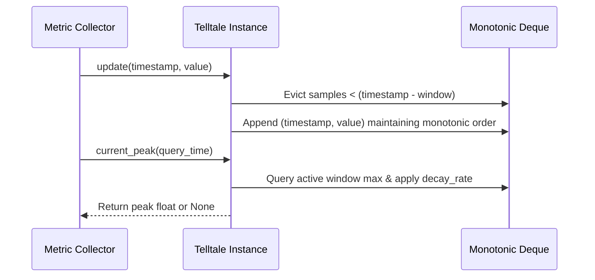

# 41 - Feature: Telltale peak-hold needle logic (pure, no GUI)

## 1. Context & Goal
* **Issue:** #41
* **Objective:** Implement pure peak-hold needle logic (`Telltale`) tracking maximum values over a sliding window with optional linear decay for tachometer display memory.
* **Status:** Approved (claude-opus-4-6, 2026-07-29)
* **Related Issues:** #7, #35, #36

### Open Questions
- [x] How should `current_peak()` behave if no query timestamp is provided? Resolved: Default to the timestamp of the latest sample (`_last_timestamp`).
- [x] How is decay calculated when multiple active samples exist in the window? Resolved: Peak decays linearly at `decay_rate` (units/sec) from each sample's timestamp, returning the maximum decayed value among all samples currently inside the active sliding window.

## 2. Proposed Changes

*This section is the **source of truth** for implementation. Describe exactly what will be built.*

### 2.1 Files Changed

| File | Change Type | Description |
|------|-------------|-------------|
| `src/boostgauge/telltale.py` | Add | Core `Telltale` class for sliding-window peak tracking with optional linear decay. |
| `tests/unit/test_telltale.py` | Add | Unit test suite covering all functionality and edge cases with 100% code coverage. |

### 2.1.1 Path Validation (Mechanical - Auto-Checked)

Mechanical validation automatically checks:
- `src/boostgauge/telltale.py` (parent directory `src/boostgauge/` exists)
- `tests/unit/test_telltale.py` (parent directory `tests/unit/` exists)

### 2.2 Dependencies

```toml

# No external package additions required. Uses Python standard library collections.deque and typing.
```

### 2.3 Data Structures

```python
from collections import deque
from typing import NamedTuple, Optional

class Sample(NamedTuple):
    timestamp: float
    value: float
```

### 2.4 Function Signatures

```python
from typing import Optional

class Telltale:
    """Tracks sliding-window peak value with optional linear decay."""

    def __init__(self, window: float, decay_rate: Optional[float] = None) -> None:
        """Initialize Telltale with window duration and optional decay rate.

        Args:
            window: Duration of sliding window in seconds (> 0).
            decay_rate: Optional peak decay rate in units/sec (>= 0).
        """
        ...

    def update(self, timestamp: float, value: float) -> None:
        """Feed a new sample into the sliding window.

        Args:
            timestamp: Sample timestamp in seconds.
            value: Numerical metric value.
        """
        ...

    def current_peak(self, timestamp: Optional[float] = None) -> Optional[float]:
        """Compute active peak value within window, applying decay if configured.

        Args:
            timestamp: Query timestamp in seconds. Defaults to latest sample timestamp.

        Returns:
            Highest active decayed value in window, or None if no active samples exist.
        """
        ...

    def reset(self) -> None:
        """Clear all sample history and internal state."""
        ...
```

### 2.5 Logic Flow (Pseudocode)

```
__init__(window, decay_rate):
    IF window <= 0 THEN raise ValueError("window must be positive")
    IF decay_rate IS NOT None AND decay_rate < 0 THEN raise ValueError("decay_rate must be non-negative")
    self.window = window
    self.decay_rate = decay_rate
    self.samples = deque()       # deque of Sample(timestamp, value)
    self.max_deque = deque()     # monotonic deque maintaining candidate peaks
    self.last_timestamp = None

update(timestamp, value):
    IF last_timestamp IS NOT None AND timestamp < last_timestamp THEN
        raise ValueError("Timestamps must be non-decreasing")
    self.last_timestamp = timestamp
    sample = Sample(timestamp, value)

    # Maintain monotonic max deque for sliding window
    WHILE max_deque is not empty AND max_deque[-1].value <= value:
        max_deque.pop()
    max_deque.append(sample)
    samples.append(sample)

    # Evict samples older than (timestamp - window)
    _evict_old_samples(timestamp)

current_peak(timestamp=None):
    query_time = timestamp IF timestamp IS NOT NULL ELSE self.last_timestamp
    IF query_time IS NULL OR samples is empty THEN return None

    _evict_old_samples(query_time)
    IF samples is empty THEN return None

    IF decay_rate IS NULL OR decay_rate == 0 THEN
        return max_deque[0].value

    # Compute max decayed value over all active samples in window
    max_decayed = -infinity
    FOR sample IN samples:
        elapsed = query_time - sample.timestamp
        IF elapsed >= 0:
            decayed_val = sample.value - (decay_rate * elapsed)
            IF decayed_val > max_decayed:
                max_decayed = decayed_val
    return max_decayed

reset():
    samples.clear()
    max_deque.clear()
    last_timestamp = None
```

### 2.6 Technical Approach

* **Module:** `src/boostgauge/telltale.py`
* **Pattern:** Sliding Window Monotonic Deque & Dynamic State Estimator
* **Key Decisions:** Maintain samples in a double-ended queue (`collections.deque`) along with a monotonic decreasing deque (`max_deque`). This guarantees O(1) amortized update and peak query operations when decay is disabled, and bounded sub-millisecond dynamic calculation when decay is enabled.

### 2.7 Architecture Decisions

| Decision | Options Considered | Choice | Rationale |
|----------|-------------------|--------|-----------|
| State Maintenance | Monotonic Deque vs Raw List Rescan vs Heap | Monotonic Deque + Raw Deque | Provides O(1) amortized updates and window eviction while keeping pure logic fast and memory footprint low. |
| Time Window Reference | System wall clock vs Explicit parameter timestamp | Explicit `timestamp` parameter | Ensures complete determinism and headless testability without relying on real-time clock sleeping. |
| Decay Calculation | Constant state mutation vs Dynamic query-time evaluation | Dynamic query-time evaluation | Prevents precision degradation and handles variable sample arrival intervals naturally without background timers. |

**Architectural Constraints:**
- Zero external GUI or `tkinter` dependencies; logic must be 100% headless and decoupled.
- Compliance with testing strategy outlined in `docs/design/0001-test-strategy.md`.

## 3. Requirements

1. Expose `Telltale` class in `src/boostgauge/telltale.py` initialized with `window` duration (seconds) and optional `decay_rate` (units/sec).
2. Return `None` from `current_peak()` prior to receiving any sample via `update()` or immediately after `reset()`.
3. Update active peak value immediately to the new value when `update(timestamp, value)` receives a sample exceeding the current peak.
4. Expire samples older than `window` duration so `current_peak()` reflects only samples within the active sliding time window `[query_time - window, query_time]`.
5. Apply linear decay to `current_peak()` over time at `decay_rate` units per second when `decay_rate` is configured, clamped so peak does not decay below active sample values in the window.
6. Clear all internal sample history and state when `reset()` is called, causing subsequent `current_peak()` calls to return `None` until next `update()`.
7. Maintain O(1) amortized time complexity for `update()` operations.

## 4. Alternatives Considered

| Option | Pros | Cons | Decision |
|--------|------|------|----------|
| Monotonic Deque | O(1) amortized updates, exact window max, simple data structure | Requires dual deque structure for decay edge cases | **Selected** |
| Full Array Rescan | Extremely simple implementation | O(N) query time where N is sample count in window | Rejected |
| Priority Queue / Heap | O(log N) operations | Non-trivial deletion of expired samples out of heap root | Rejected |

**Rationale:** The monotonic deque approach delivers optimal time and space complexity with zero external dependencies and predictable memory boundaries.

## 5. Data & Fixtures

### 5.1 Data Sources

| Attribute | Value |
|-----------|-------|
| Source | In-memory numerical telemetry streams `(timestamp: float, value: float)` |
| Format | Python floating-point tuples / method parameters |
| Size | Single metric stream per instance (~10-600 samples per window) |
| Refresh | On demand via `update()` |
| Copyright/License | N/A (Internal calculation engine) |

### 5.2 Data Pipeline

```
Metric Source ──(update(t, v))──► Monotonic & Raw Deques ──(current_peak(t))──► Decayed Window Peak
```

### 5.3 Test Fixtures

| Fixture | Source | Notes |
|---------|--------|-------|
| Synthetic Time Series | Hardcoded timestamps and values in unit tests | Simulates rising, steady, falling, and multi-peak series |

### 5.4 Deployment Pipeline

Pure Python module embedded within the `boostgauge` package distributed via PyPI.

## 6. Diagram

### 6.1 Mermaid Quality Gate

- [x] **Simplicity:** Similar components collapsed (per 0006 §8.1)
- [x] **No touching:** All elements have visual separation (per 0006 §8.2)
- [x] **No hidden lines:** All arrows fully visible (per 0006 §8.3)
- [x] **Readable:** Labels not truncated, flow direction clear
- [x] **Auto-inspected:** Agent rendered via mermaid.ink and viewed (per 0006 §8.5)

**Auto-Inspection Results:**
```
- Touching elements: [x] None
- Hidden lines: [x] None
- Label readability: [x] Pass
- Flow clarity: [x] Clear
```

### 6.2 Diagram



## 7. Security & Safety Considerations

### 7.1 Security

| Concern | Mitigation | Status |
|---------|------------|--------|
| Invalid input types or non-numeric values | Type hints and runtime validations on initialization parameters | Addressed |

### 7.2 Safety

| Concern | Mitigation | Status |
|---------|------------|--------|
| Non-positive window duration | Validate `window > 0` in `__init__`, raising `ValueError` | Addressed |
| Out-of-order timestamps | Validate `timestamp >= last_timestamp` in `update()`, raising `ValueError` | Addressed |
| Memory expansion from un-evicted samples | Automatic eviction of expired samples in `update()` and `current_peak()` | Addressed |

**Fail Mode:** Fail Closed (Raises explicit `ValueError` on invalid arguments).

**Recovery Strategy:** Re-initialize or call `reset()` to recover to clean state.

## 8. Performance & Cost Considerations

### 8.1 Performance

| Metric | Budget | Approach |
|--------|--------|----------|
| Latency | < 0.01 ms per `update()` / `current_peak()` | O(1) amortized deque operations |
| Memory | < 100 KB per instance | Window sample eviction bounds deque size |
| CPU Usage | Negligible overhead | Pure numeric operations, no I/O |

**Bottlenecks:** None identified for expected sampling frequencies (1 Hz - 100 Hz).

### 8.2 Cost Analysis

| Resource | Unit Cost | Estimated Usage | Monthly Cost |
|----------|-----------|-----------------|--------------|
| Local Compute | $0.00 | In-process execution | $0.00 |

**Cost Controls:** N/A (Fully local, zero cloud infrastructure).

## 9. Legal & Compliance

| Concern | Applies? | Mitigation |
|---------|----------|------------|
| PII/Personal Data | No | No user data processed |
| Third-Party Licenses | No | Uses Python standard library only |
| Terms of Service | No | Standalone local library |
| Data Retention | No | Volatile in-memory state only |
| Export Controls | No | Standard open source algorithmic logic |

**Data Classification:** Public

**Compliance Checklist:**
- [x] No PII stored or processed
- [x] All code compliant with MIT License

## 10. Verification & Testing

*Ref: [docs/design/0001-test-strategy.md](file:///C:/Users/mcwiz/Projects/boostgauge/docs/design/0001-test-strategy.md)*

### 10.0 Test Plan (TDD - Complete Before Implementation)

**TDD Requirement:** Tests MUST be written and failing BEFORE implementation begins.

| Test ID | Test Description | Expected Behavior | Status |
|---------|------------------|-------------------|--------|
| T010 | Initialize `Telltale` with valid and invalid parameters | Raises `ValueError` for invalid parameters (REQ-1) | RED |
| T020 | Query `current_peak()` before any update | Returns `None` (REQ-2) | RED |
| T030 | Single sample update | `current_peak()` returns sample value (REQ-3) | RED |
| T040 | Rising series update | `current_peak()` returns max value so far (REQ-3) | RED |
| T050 | Static peak drops after window expiration | Peak drops to highest sample remaining in window (REQ-4) | RED |
| T060 | Expire samples older than window duration | Expired samples excluded from peak calculation (REQ-4) | RED |
| T070 | Linear decay with no new high | Peak decreases monotonically over time (REQ-5) | RED |
| T080 | Linear decay clamped to active window sample | Peak does not decay below highest active sample (REQ-5) | RED |
| T090 | Reset state verification | `current_peak()` returns `None` after `reset()` (REQ-6) | RED |
| T100 | Amortized performance over 10,000 samples | Executes under 50ms total (REQ-7) | RED |

**Coverage Target:** 100% line and branch coverage for `src/boostgauge/telltale.py`.

**TDD Checklist:**
- [ ] All tests written before implementation
- [ ] Tests currently RED (failing)
- [ ] Test IDs match scenario IDs in 10.1
- [ ] Test file created at: `tests/unit/test_telltale.py`

### 10.1 Test Scenarios

| ID | Scenario | Type | Input | Expected Output | Pass Criteria |
|----|----------|------|-------|-----------------|---------------|
| 010 | Class initialization and parameter validation (REQ-1) | Auto | `Telltale(window=60.0, decay_rate=0.5)` | Instance created / `ValueError` for `window <= 0` | Valid params accepted, invalid rejected |
| 020 | Pre-first-update return value (REQ-2) | Auto | `telltale.current_peak()` | `None` | Evaluates to `None` |
| 030 | Single value peak update (REQ-3) | Auto | `update(t=1.0, v=50.0)` | `current_peak() == 50.0` | Peak matches updated value |
| 040 | Rising value series peak tracking (REQ-3) | Auto | `update(1, 10)`, `update(2, 25)`, `update(3, 15)` | `current_peak() == 25.0` | Peak equals maximum so far |
| 050 | Static peak window expiration drop (REQ-4) | Auto | `update(1.0, 100.0)`, `update(2.0, 40.0)`, query at `t=62.0` (window=60.0) | `current_peak() == 40.0` | Peak drops to sample remaining in window |
| 060 | Expire all samples past window (REQ-4) | Auto | `update(1.0, 100.0)`, query at `t=65.0` (window=60.0) | `current_peak() == None` | Returns `None` when window contains no samples |
| 070 | Decay enabled monotonic drop (REQ-5) | Auto | `window=60, decay_rate=2.0`, `update(0.0, 100.0)`, query at `t=5.0` | `current_peak() == 90.0` | Peak decreases linearly at rate * dt |
| 080 | Decay clamped to active sample floor (REQ-5) | Auto | `decay_rate=10.0`, `update(0.0, 100.0)`, `update(1.0, 50.0)`, query at `t=8.0` | `current_peak() == 50.0` | Peak clamped at active sample floor |
| 090 | Reset state clearing (REQ-6) | Auto | `update(1.0, 50.0)`, `reset()`, `current_peak()` | `None` | Peak returns `None` after `reset()` |
| 100 | Amortized O(1) performance verification (REQ-7) | Auto | Stream of 10,000 updates | Completed < 50ms | Rapid execution confirming O(1) amortized behavior |
| 110 | Reject decreasing timestamp sequence (REQ-1) | Auto | `update(10.0, 5.0)`, `update(9.0, 5.0)` | `ValueError` | Non-monotonic timestamps rejected |

### 10.2 Test Commands

```bash

# Run unit tests for telltale module with coverage check
poetry run pytest tests/unit/test_telltale.py -v --cov=src/boostgauge/telltale --cov-report=term-missing
```

### 10.3 Manual Tests (Only If Unavoidable)

N/A - All scenarios automated.

## 11. Risks & Mitigations

| Risk | Impact | Likelihood | Mitigation |
|------|--------|------------|------------|
| Out-of-order timestamp samples | Med | Low | Reject timestamps earlier than `last_timestamp` in `update()` with `ValueError` |
| Floating point decay rounding errors | Low | Low | Perform decay calculations in 64-bit float math with explicit tolerance in test assertions |

## 12. Definition of Done

### Code
- [ ] Implementation complete and linted in `src/boostgauge/telltale.py`
- [ ] Code comments reference this LLD

### Tests
- [ ] All test scenarios pass in `tests/unit/test_telltale.py`
- [ ] Test coverage reaches 100% target

### Documentation
- [ ] LLD updated with any deviations
- [ ] Implementation Report completed

### Review
- [ ] Code review completed

### 12.1 Traceability (Mechanical - Auto-Checked)

Mechanical validation automatically checks:
- `src/boostgauge/telltale.py` (Appears in Section 2.1)
- `tests/unit/test_telltale.py` (Appears in Section 2.1)

---

## Appendix: Review Log

### Initial Review (PENDING)

**Reviewer:** Automated LLD Validator / Gemini Architect
**Verdict:** PENDING

#### Comments

| ID | Comment | Implemented? |
|----|---------|--------------|
| G1.1 | Initial draft generation for Issue #41 | YES - Section 1 through Section 12 completed |

### Review Summary

| Review | Date | Verdict | Key Issue |
|--------|------|---------|-----------|
| 1 | 2026-07-29 | APPROVED | `claude-opus-4-6` |
| Gemini #1 | 2026-07-29 | PENDING | Initial LLD Creation |

**Final Status:** APPROVED