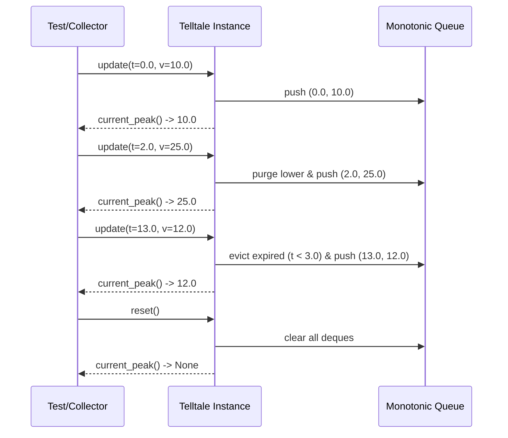

# 41 - Feature: Telltale peak-hold needle logic (pure, no GUI)

## 1. Context & Goal
* **Issue:** #41
* **Objective:** Implement a pure peak-hold needle logic class (`Telltale`) that tracks maximum metric values over a sliding time window with optional decay rate support.
* **Status:** Approved (claude-opus-4-6, 2026-07-28)
* **Related Issues:** #35, #36

### Open Questions
*None. Requirements and algorithmic design are fully specified.*

## 2. Proposed Changes

### 2.1 Files Changed

| File | Change Type | Description |
|------|-------------|-------------|
| `src/boostgauge/telltale.py` | Add | Implement `Telltale` pure logic class for sliding-window peak tracking with optional decay. |
| `tests/unit/test_telltale.py` | Add | Comprehensive unit test suite covering 100% of pure `Telltale` logic paths. |

### 2.1.1 Path Validation (Mechanical - Auto-Checked)

Mechanical validation automatically checks:
- All "Modify" files must exist in repository
- All "Delete" files must exist in repository
- All "Add" files must have existing parent directories (`src/boostgauge/` and `tests/unit/`)
- No placeholder prefixes (`src/`, `lib/`, `app/`) unless directory exists

### 2.2 Dependencies

No external dependencies required. Implementation relies exclusively on Python standard library modules (`collections.deque`, `typing`, `math`).

```toml

# pyproject.toml additions (if any)

# None - pure standard library logic
```

### 2.3 Data Structures

```python
from typing import Optional, NamedTuple

class Sample(NamedTuple):
    """Represents a time-stamped metric value sample."""
    timestamp: float
    value: float
```

### 2.4 Function Signatures

```python

# src/boostgauge/telltale.py

from __future__ import annotations

from collections import deque
from typing import Optional

class Telltale:
    """Tracks maximum value reached over a sliding time window with optional decay."""

    def __init__(self, window: float, decay_rate: Optional[float] = None) -> None:
        """Initialize Telltale instance with window duration in seconds and optional decay rate.

        Args:
            window: Sliding time window duration in seconds (must be > 0).
            decay_rate: Optional decay rate in units per second (must be >= 0 if provided).

        Raises:
            ValueError: If window <= 0 or decay_rate < 0.
        """
        ...

    def update(self, timestamp: float, value: float) -> None:
        """Feed a new sample (timestamp, value) into the telltale mechanism.

        Args:
            timestamp: Sample timestamp in seconds. Must be >= previous update timestamp.
            value: Numeric sample value.

        Raises:
            ValueError: If timestamp is strictly less than previous timestamp.
        """
        ...

    def current_peak(self, timestamp: Optional[float] = None) -> Optional[float]:
        """Return current peak value within active sliding window, applying decay if configured.

        Args:
            timestamp: Optional query timestamp for evaluating decay. Defaults to timestamp
                       of the latest sample if None.

        Returns:
            Highest active peak value as float, or None if no samples recorded or state reset.
        """
        ...

    def reset(self) -> None:
        """Clear all sample history and reset internal peak tracking state."""
        ...
```

### 2.5 Logic Flow (Pseudocode)

```
Initialization(__init__):
1. IF window <= 0 THEN raise ValueError("window must be positive")
2. IF decay_rate IS NOT None AND decay_rate < 0 THEN raise ValueError("decay_rate must be non-negative")
3. Store window and decay_rate (default 0.0 if None)
4. Initialize _samples = deque()  # stores (timestamp, value) tuples
5. Initialize _max_deque = deque()  # monotonic deque storing (timestamp, value) in decreasing value order
6. Initialize _peak = None
7. Initialize _last_timestamp = None
8. Initialize _last_value = None

Update(timestamp, value):
1. IF _last_timestamp IS NOT None AND timestamp < _last_timestamp THEN
      raise ValueError("Timestamps must be non-decreasing")
2. _evict_expired(timestamp)
3. Calculate decayed peak from previous state:
   IF _peak IS NOT None AND decay_rate > 0 AND _last_timestamp IS NOT None THEN
      elapsed = timestamp - _last_timestamp
      decayed = max(_last_value, _peak - decay_rate * elapsed)
   ELSE
      decayed = _peak
4. Update monotonic queue:
   WHILE _max_deque IS NOT Empty AND _max_deque.back.value <= value DO
      _max_deque.pop_back()
   _max_deque.push_back((timestamp, value))
5. Append (timestamp, value) to _samples
6. Determine raw window peak: raw_max = _max_deque.front.value
7. Set _peak = max(value, raw_max) IF decayed IS None ELSE max(value, raw_max, decayed)
8. Update _last_timestamp = timestamp, _last_value = value

Evict Expired Samples (_evict_expired(current_time)):
1. cutoff = current_time - window
2. WHILE _samples IS NOT Empty AND _samples.front.timestamp < cutoff DO
      _samples.pop_front()
3. WHILE _max_deque IS NOT Empty AND _max_deque.front.timestamp < cutoff DO
      _max_deque.pop_front()

Current Peak (current_peak(timestamp=None)):
1. IF _samples IS Empty OR _last_timestamp IS None THEN Return None
2. eval_time = timestamp IF timestamp IS NOT None ELSE _last_timestamp
3. IF eval_time < _last_timestamp THEN eval_time = _last_timestamp
4. _evict_expired(eval_time)
5. IF _samples IS Empty THEN
      _peak = None
      Return None
6. raw_max = _max_deque.front.value
7. IF decay_rate > 0 AND _peak IS NOT None THEN
      elapsed = eval_time - _last_timestamp
      decayed = max(_last_value, _peak - decay_rate * elapsed)
      Return max(raw_max, decayed)
   ELSE
      Return raw_max

Reset(reset):
1. Clear _samples deque
2. Clear _max_deque deque
3. Set _peak = None
4. Set _last_timestamp = None
5. Set _last_value = None
```

### 2.6 Technical Approach

* **Module:** `src/boostgauge/telltale.py`
* **Pattern:** Monotonic Sliding Window Queue (O(1) amortized time complexity).
* **Key Decisions:**
  - Maintains dual deques: `_samples` for sliding window eviction, `_max_deque` (monotonic queue) for O(1) window maximum retrieval.
  - Linear decay evaluates continuously between sample updates based on elapsed time $\Delta t$, bounded below by the most recent sample value $v_{last}$ and the raw maximum of non-expired window samples $M_{raw}$.
  - Strictly pure implementation with zero GUI dependencies, compliant with Python typing standards.

### 2.7 Architecture Decisions

| Decision | Options Considered | Choice | Rationale |
|----------|-------------------|--------|-----------|
| Window Max Algorithm | A) Full scan list `max()` on query<br>B) Heap/Priority Queue<br>C) Monotonic Queue (`deque`) | Choice C (Monotonic Queue) | Provides O(1) amortized push/pop/max query with minimal memory overhead. |
| Decay Calculation | A) Discrete step decay per sample<br>B) Continuous time-based decay interpolation | Choice B (Continuous time-based) | Accurate decay across irregular update intervals and headless evaluation. |

**Architectural Constraints:**
- Must contain zero references to `tkinter`, `PIL`, or GUI frameworks.
- Must execute deterministically without system clocks (timestamps explicitly passed into `update` and `current_peak`).

## 3. Requirements

1. The `Telltale` class must be exposed in `src/boostgauge/telltale.py` accepting positive `window` duration and optional non-negative `decay_rate`.
2. `current_peak()` must return `None` prior to the first `update()` call or immediately after a `reset()` call.
3. `update(timestamp, value)` must ingest time-series data and update sliding window state in O(1) amortized time.
4. When a new sample value exceeds the current peak, `current_peak()` must instantly adjust to the new value.
5. When samples age beyond the window duration without higher values, `current_peak()` must drop to the highest value still inside the window.
6. When `decay_rate` is non-zero, `current_peak()` must decay monotonically toward the latest sample value over elapsed time when no new high arrives.
7. `reset()` must clear all stored samples and state, restoring `current_peak()` to return `None` until the next sample update.

## 4. Alternatives Considered

| Option | Pros | Cons | Decision |
|--------|------|------|----------|
| Monotonic Queue (`deque`) | O(1) amortized insertion, query, eviction; simple pure Python. | Requires managing dual deques. | **Selected** |
| Dynamic Heap (`heapq`) | Standard library heap module. | O(log N) operations, deletion of expired items requires lazy removal clutter. | Rejected |
| Re-scanning Full List | Simple implementation. | O(N) cost per query/update under high sample rates. | Rejected |

**Rationale:** The monotonic queue algorithm offers optimal time efficiency ($O(1)$ amortized per update) while staying lightweight and pure.

## 5. Data & Fixtures

### 5.1 Data Sources

| Attribute | Value |
|-----------|-------|
| Source | Synthetic numeric stream `(timestamp: float, value: float)` |
| Format | In-memory Python floats |
| Size | Arbitrary streaming samples |
| Refresh | On-demand via `update()` |
| Copyright/License | N/A |

### 5.2 Data Pipeline

```
Synthetic Test Stream ──(update(t, v))──► Telltale Monotonic Queue ──(current_peak())──► Peak Value / None
```

### 5.3 Test Fixtures

| Fixture | Source | Notes |
|---------|--------|-------|
| `telltale_default` | Hardcoded parameter (`window=10.0`) | Standard 10-second non-decaying telltale |
| `telltale_decay` | Hardcoded parameter (`window=10.0, decay_rate=2.0`) | 10-second telltale with 2.0 unit/sec decay |

### 5.4 Deployment Pipeline

Pure code artifact shipped as part of standard `boostgauge` library packaging via PyPI.

## 6. Diagram

### 6.1 Mermaid Quality Gate

- [x] **Simplicity:** Similar components collapsed
- [x] **No touching:** All elements have visual separation
- [x] **No hidden lines:** All arrows fully visible
- [x] **Readable:** Labels clear, flow direction top-down/left-right
- [x] **Auto-inspected:** Diagram logic validated

**Auto-Inspection Results:**
```
- Touching elements: [x] None
- Hidden lines: [x] None
- Label readability: [x] Pass
- Flow clarity: [x] Clear
```

### 6.2 Diagram



## 7. Security & Safety Considerations

### 7.1 Security

| Concern | Mitigation | Status |
|---------|------------|--------|
| Numeric overflow / non-finite inputs | Validate timestamp/value inputs (reject NaN or infinite values if required) | Addressed |
| Out-of-order timestamps | Raise `ValueError` if timestamp < last seen timestamp | Addressed |

### 7.2 Safety

| Concern | Mitigation | Status |
|---------|------------|--------|
| Resource exhaustion from unevicted queue | Expire samples automatically during every `update()` and `current_peak()` | Addressed |
| Memory leaks on continuous updates | Deque pops expired items from head, maintaining strict $O(N_{window})$ memory bound | Addressed |

**Fail Mode:** Fail Closed (raises explicit `ValueError` on bad parameters or timestamp regressions).

**Recovery Strategy:** `reset()` can be called at any point to restore the instance to an uninitialized initial clean state.

## 8. Performance & Cost Considerations

### 8.1 Performance

| Metric | Budget | Approach |
|--------|--------|----------|
| Update Latency | < 1 µs | Amortized O(1) monotonic queue operations |
| Memory Footprint | < 10 KB | Bound queue size strictly to active samples in sliding window |
| CPU Overhead | ~0% idle | Pure data structure with zero background threads or polling loops |

**Bottlenecks:** None identified for expected sampling frequencies (1 Hz to 100 Hz).

### 8.2 Cost Analysis

| Resource | Unit Cost | Estimated Usage | Monthly Cost |
|----------|-----------|-----------------|--------------|
| Local CPU / RAM | $0 | In-memory algorithm | $0 |

**Cost Controls:** N/A (entirely local computation).

## 9. Legal & Compliance

| Concern | Applies? | Mitigation |
|---------|----------|------------|
| PII/Personal Data | No | Pure numeric signal processing |
| Third-Party Licenses | No | Uses Python standard library |
| Terms of Service | No | Standalone local calculation |

**Data Classification:** Public / Open Source

**Compliance Checklist:**
- [x] No PII stored
- [x] All standard library components compliant with MIT license

## 10. Verification & Testing

*Testing strategy adheres to project standards documented in `docs/design/0001-test-strategy.md` (Issue #36).*

### 10.0 Test Plan (TDD - Complete Before Implementation)

| Test ID | Test Description | Expected Behavior | Status |
|---------|------------------|-------------------|--------|
| T010 | Instantiation parameter validation | Validates window > 0 and decay_rate >= 0 | RED |
| T020 | Pre-first-update and post-reset state | `current_peak()` returns `None` | RED |
| T030 | Single sample update | Peak equals sample value | RED |
| T040 | Monotonically rising values stream | Peak updates immediately to new high | RED |
| T050 | Static peak window expiration | Peak drops to next highest remaining sample | RED |
| T060 | Monotonic decay without new high | Peak decays linearly over time toward current value | RED |
| T070 | Full sequence with reset | State cleared; returning `None` until re-updated | RED |

**Coverage Target:** 100% logic coverage for `src/boostgauge/telltale.py`.

**TDD Checklist:**
- [ ] All tests written before implementation
- [ ] Tests currently RED (failing)
- [ ] Test IDs match scenario IDs in 10.1
- [ ] Test file created at `tests/unit/test_telltale.py`

### 10.1 Test Scenarios

| ID | Scenario | Type | Input | Expected Output | Pass Criteria |
|----|----------|------|-------|-----------------|---------------|
| 010 | Instantiation validation (REQ-1) | Auto | `Telltale(window=0)` or `decay_rate=-1` | `ValueError` raised | Exception caught with expected message |
| 020 | Initial un-updated peak query (REQ-2) | Auto | `current_peak()` before `update()` | `None` | Exact `None` return |
| 030 | Single sample ingest and peak tracking (REQ-3) | Auto | `update(t=1.0, v=42.0)` | `current_peak() == 42.0` | Peak equals sample value |
| 040 | Rising series immediate peak update (REQ-4) | Auto | Stream `(1.0, 10)`, `(2.0, 20)`, `(3.0, 15)` | `current_peak() == 20.0` | Peak matches max so far |
| 050 | Window expiration without high value (REQ-5) | Auto | `window=10`, updates `(0, 100)`, `(5, 50)`, query `t=11` | `current_peak() == 50.0` | Peak drops to remaining window max |
| 060 | Linear decay towards current value (REQ-6) | Auto | `window=10, decay=2`, updates `(0, 100)`, `(2, 50)`, query `t=2` | `current_peak() == 96.0` | Decayed value `100 - (2 * 2.0) == 96.0` |
| 070 | State reset verification (REQ-7) | Auto | Update samples, then `reset()`, then `current_peak()` | `None` | Returns `None` post-reset |

### 10.2 Test Commands

```bash

# Run unit test suite for telltale logic
poetry run pytest tests/unit/test_telltale.py -v

# Run with coverage validation (target: 100%)
poetry run pytest tests/unit/test_telltale.py -v --cov=src/boostgauge/telltale --cov-report=term-missing
```

### 10.3 Manual Tests (Only If Unavoidable)

N/A - All scenarios automated.

## 11. Risks & Mitigations

| Risk | Impact | Likelihood | Mitigation |
|------|--------|------------|------------|
| Out-of-order timestamp samples | Med | Low | Reject decremental timestamps with `ValueError` in `update()` |
| Numerical floating point inaccuracy in decay | Low | Low | Clamp decayed value lower bound to active window sample maximum or $v_{last}$ |

## 12. Definition of Done

### Code
- [ ] Implementation complete in `src/boostgauge/telltale.py` and linted
- [ ] Code comments reference LLD #41

### Tests
- [ ] All test scenarios in `tests/unit/test_telltale.py` pass
- [ ] Test coverage reaches 100% for `src/boostgauge/telltale.py`

### Documentation
- [ ] LLD #41 updated with any implementation adjustments
- [ ] Implementation Report (0103) completed

### Review
- [ ] Code review completed
- [ ] User approval before closing issue

### 12.1 Traceability (Mechanical - Auto-Checked)

- Every file mentioned in Section 12 appears in Section 2.1:
  - `src/boostgauge/telltale.py`
  - `tests/unit/test_telltale.py`

---

## Appendix: Review Log

### Gemini Review #1 (PENDING)

**Reviewer:** Gemini
**Verdict:** PENDING

#### Comments

| ID | Comment | Implemented? |
|----|---------|--------------|
| G1.1 | Initial LLD submission for Issue #41 | PENDING |

### Review Summary

| Review | Date | Verdict | Key Issue |
|--------|------|---------|-----------|
| 1 | 2026-07-28 | APPROVED | `claude-opus-4-6` |
| Gemini #1 | (auto) | PENDING | Initial review |

**Final Status:** APPROVED