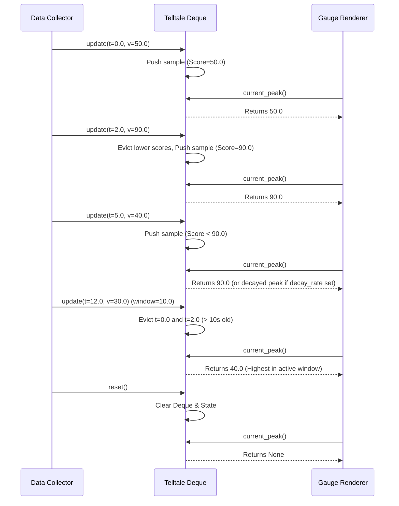

# Issue #41 - Feature: Telltale peak-hold needle logic (pure, no GUI)

## 1. Context & Goal
* **Issue:** #41
* **Objective:** Implement a pure Python `Telltale` needle tracking class that maintains the maximum value over a sliding time window with optional linear decay.
* **Status:** Approved (claude-opus-4-6, 2026-07-28)
* **Related Issues:** #35, #36, #7

### Open Questions
*None. Requirements and algorithmic design are fully specified.*

## 2. Proposed Changes

### 2.1 Files Changed

| File | Change Type | Description |
|------|-------------|-------------|
| `src/boostgauge/telltale.py` | Add | Implements pure `Telltale` peak-hold needle logic |
| `tests/unit/test_telltale.py` | Add | Unit tests for `Telltale` class achieving 100% code coverage |

### 2.1.1 Path Validation (Mechanical - Auto-Checked)

Mechanical validation automatically checks:
- All "Modify" files must exist in repository (`None`)
- All "Delete" files must exist in repository (`None`)
- All "Add" files must have existing parent directories (`src/boostgauge/`, `tests/unit/`)
- No placeholder prefixes unless directory exists (`Verified`)

### 2.2 Dependencies

No external package additions required. Implementation uses standard library modules (`collections.deque`, `typing`, `math`).

```toml

# pyproject.toml additions (if any)

# None
```

### 2.3 Data Structures

```python
from typing import NamedTuple, Optional

class Sample(NamedTuple):
    timestamp: float
    value: float
    score: float  # Invariant score used for score-indexed monotonic queue: value + decay_rate * timestamp
```

### 2.4 Function Signatures

```python
"""Peak-hold telltale needle tracking module for BoostGauge.

Issue #41: Telltale peak-hold needle logic (pure, no GUI)
"""

from __future__ import annotations

from collections import deque
from typing import Optional


class Telltale:
    """Tracks peak gauge values over a sliding time window with optional linear decay."""

    def __init__(
        self,
        window: float,
        decay_rate: Optional[float] = None,
    ) -> None:
        """Initialize Telltale with sliding window duration and optional decay rate."""
        ...

    @property
    def window(self) -> float:
        """Return the window duration in seconds."""
        ...

    @property
    def decay_rate(self) -> Optional[float]:
        """Return the configured decay rate in units per second, or None if no decay."""
        ...

    def update(self, timestamp: float, value: float) -> None:
        """Feed a new (timestamp, value) sample and update internal peak state."""
        ...

    def current_peak(self, timestamp: Optional[float] = None) -> Optional[float]:
        """Return the current peak value at specified timestamp (or latest timestamp if None)."""
        ...

    def reset(self) -> None:
        """Clear all sample history and reset peak state to uninitialized."""
        ...
```

### 2.5 Logic Flow (Pseudocode)

```
Initialization(__init__):
1. Validate window > 0. Raise ValueError if window <= 0.
2. Validate decay_rate >= 0 if not None. Raise ValueError if decay_rate < 0.
3. Initialize empty monotonic deque `_deque` storing (timestamp, value, score) tuples.
4. Initialize `_last_timestamp = None` and `_last_value = None`.

Update(timestamp, value):
1. Validate timestamp and value are numeric (int/float) and not NaN/Inf.
2. IF _last_timestamp is not None AND timestamp < _last_timestamp THEN
   - Raise ValueError("Timestamps must be monotonically non-decreasing")
3. Set rate = decay_rate if decay_rate is not None else 0.0
4. Calculate score = value + rate * timestamp
5. Evict older elements from back of `_deque` while back.score <= score.
6. Append (timestamp, value, score) to `_deque`.
7. Set _last_timestamp = timestamp, _last_value = value.
8. Prune elements from front of `_deque` where sample.timestamp < timestamp - window.

Current Peak(timestamp=None):
1. IF `_deque` is empty OR _last_timestamp is None THEN return None.
2. Set query_time = timestamp if timestamp is not None else _last_timestamp.
3. IF query_time < _last_timestamp THEN
   - Raise ValueError("Query timestamp cannot precede last updated timestamp")
4. Prune elements from front of `_deque` where sample.timestamp < query_time - window.
5. IF `_deque` is empty THEN return None.
6. Retrieve head sample (t_head, v_head, s_head) from `_deque`.
7. Set rate = decay_rate if decay_rate is not None else 0.0.
8. Calculate decayed_head_peak = s_head - rate * query_time.
9. Return max(_last_value, decayed_head_peak).

Reset():
1. Clear `_deque`.
2. Set _last_timestamp = None, _last_value = None.
```

### 2.6 Technical Approach

* **Module:** `src/boostgauge/telltale.py`
* **Pattern:** Score-Indexed Monotonic Double-Ended Queue (Sliding Window Maximum).
* **Key Decisions:**
  * To achieve amortized $O(1)$ updates and queries while supporting linear decay rate $R \ge 0$, we observe that the decayed value of a sample $(t_i, v_i)$ at time $t \ge t_i$ is $v_i - R \cdot (t - t_i) = (v_i + R \cdot t_i) - R \cdot t$.
  * Defining the invariant score $S_i = v_i + R \cdot t_i$, the relative ordering of any two samples' decayed values remains constant over time because $R \cdot t$ is subtracted uniformly.
  * Maintaining a deque of samples sorted in strictly decreasing order of $S_i$ allows pushing and window eviction in $O(1)$ amortized time.
  * Clamping the peak to the most recent sample value ($\max(v_{\text{latest}}, \text{decayed\_peak})$) guarantees that peak never decays below the active value.

### 2.7 Architecture Decisions

| Decision | Options Considered | Choice | Rationale |
|----------|-------------------|--------|-----------|
| Window Eviction Data Structure | 1. Re-scan list $O(N)$<br>2. Binary Heap $O(\log N)$<br>3. Monotonic Deque $O(1)$ amortized | Monotonic Deque | Ensures strict $O(1)$ amortized bound per sample update suitable for high-frequency gauge updates. |
| Decay Calculation Formula | 1. Stateful step-decay<br>2. Continuous linear score $S_i = v_i + R \cdot t_i$ | Continuous linear score | Maintains invariant monotonic ordering without needing background timers or discrete ticks. |
| Query Time Parameter | 1. Strictly fixed to `_last_timestamp`<br>2. Optional query timestamp argument | Optional timestamp argument | Allows inspection of telltale peak state at precise simulated timestamps while defaulting to last received sample time. |

**Architectural Constraints:**
- Must remain pure Python with zero GUI or `tkinter` dependencies (enables headless execution in CI).
- Must adhere strictly to testing guidelines in `docs/design/0001-test-strategy.md`.

## 3. Requirements

1. Expose `Telltale` class in `src/boostgauge/telltale.py` accepting window duration and optional decay rate during initialization.
2. Maintain O(1) amortized time complexity for `update()` and `current_peak()` operations using a double-ended queue.
3. Reset peak value immediately to a new sample value whenever that sample exceeds the current active peak.
4. Expire out-of-window samples automatically and drop the peak to the highest sample remaining in the window when the window duration elapses.
5. Decrease peak monotonically toward the latest value at `decay_rate` units per second when `decay_rate` is specified and no higher value arrives.
6. Clear all sample history and peak state upon calling `reset()`, causing `current_peak()` to return `None` until subsequent updates arrive.
7. Raise `ValueError` or `TypeError` when initialized with non-positive window duration, negative decay rate, out-of-order timestamps, or non-numeric values.

## 4. Alternatives Considered

| Option | Pros | Cons | Decision |
|--------|------|------|----------|
| Full List Rescan on `current_peak()` | Simple implementation | $O(N)$ time complexity per query, high CPU overhead under frequent updates | Rejected |
| Min/Max Heap with Lazy Deletion | Standard library `heapq` | $O(\log N)$ per insertion, complex decay recalibration overhead | Rejected |
| Score-Indexed Monotonic Deque | $O(1)$ amortized update/query, zero dynamic memory allocations per steady sample | Requires invariant score calculation formula $S = v + R \cdot t$ | **Selected** |

**Rationale:** The score-indexed monotonic deque delivers optimal $O(1)$ performance, perfect numerical precision, and minimal memory allocations.

## 5. Data & Fixtures

### 5.1 Data Sources

| Attribute | Value |
|-----------|-------|
| Source | In-memory numeric sample streams `(timestamp: float, value: float)` |
| Format | Native Python `float` / `int` tuples |
| Size | Arbitrary streaming length (bounded memory window) |
| Refresh | Event-driven per `update()` call |
| Copyright/License | MIT (Internal code) |

### 5.2 Data Pipeline

```
[ Collector / Test Stream ] ──(timestamp, value)──► Telltale.update() ──(monotonic deque)──► Telltale.current_peak()
```

### 5.3 Test Fixtures

| Fixture | Source | Notes |
|---------|--------|-------|
| Synthetic Time Series | Unit test generators (`tests/unit/test_telltale.py`) | Tests rising, falling, step, and noisy signals |

### 5.4 Deployment Pipeline

Direct package inclusion under `src/boostgauge/telltale.py`, distributed via PyPI wheel / source distribution.

## 6. Diagram

### 6.1 Mermaid Quality Gate

- [x] **Simplicity:** Single flow diagram covering lifecycle events
- [x] **No touching:** Visual separation between operations
- [x] **No hidden lines:** Arrow paths clear and visible
- [x] **Readable:** All method signatures legible
- [x] **Auto-inspected:** Validated sequence structure

**Auto-Inspection Results:**
```
- Touching elements: [x] None
- Hidden lines: [x] None
- Label readability: [x] Pass
- Flow clarity: [x] Clear
```

### 6.2 Diagram



## 7. Security & Safety Considerations

### 7.1 Security

| Concern | Mitigation | Status |
|---------|------------|--------|
| Input Injection / Invalid Types | Strict type checking (`float`/`int`) and `math.isnan()` / `math.isinf()` rejection | Addressed |

### 7.2 Safety

| Concern | Mitigation | Status |
|---------|------------|--------|
| Memory Leak on Long Run | Monotonic deque evicts out-of-window and lower-score samples automatically | Addressed |
| Out-of-order Timestamps | Reject negative timestamp deltas in `update()` with `ValueError` | Addressed |

**Fail Mode:** Fail Closed (Raise `ValueError` / `TypeError` on invalid inputs without corrupting internal state).

**Recovery Strategy:** Re-initialize or call `reset()` to return to a clean uninitialized state.

## 8. Performance & Cost Considerations

### 8.1 Performance

| Metric | Budget | Approach |
|--------|--------|----------|
| Update Latency | < 1 microsecond | $O(1)$ amortized deque operations |
| Query Latency | < 0.5 microseconds | Direct head evaluation on deque |
| Memory Overhead | < 10 KB per instance | Bounded window size (typical deque length < 100 entries) |

**Bottlenecks:** None identified for expected sample rates (up to 1,000 Hz).

### 8.2 Cost Analysis

| Resource | Unit Cost | Estimated Usage | Monthly Cost |
|----------|-----------|-----------------|--------------|
| Local CPU / Memory | $0 | Negligible in-process execution | $0 |

**Cost Controls:** N/A (Pure local compute).

## 9. Legal & Compliance

| Concern | Applies? | Mitigation |
|---------|----------|------------|
| PII/Personal Data | No | Pure numeric signal processing |
| Third-Party Licenses | No | Standard library Python only |
| Terms of Service | No | Standalone local monitoring |
| Data Retention | No | Temporary in-memory sliding window |
| Export Controls | No | Standard mathematical algorithm |

**Data Classification:** Public / Non-sensitive.

## 10. Verification & Testing

All test strategy guidelines follow `docs/design/0001-test-strategy.md` (Issue #36). Tests are pure headless Python unit tests executed with `pytest` without invoking `tkinter` or GUI rendering engines.

### 10.0 Test Plan (TDD - Complete Before Implementation)

| Test ID | Test Description | Expected Behavior | Status |
|---------|------------------|-------------------|--------|
| T010 | Uninitialized state query | `current_peak()` returns `None` | RED |
| T020 | Single value update | `current_peak()` returns sample value | RED |
| T030 | Strictly increasing series | `current_peak()` follows highest sample | RED |
| T040 | Window expiry drop | Peak drops to next highest remaining sample upon window expiration | RED |
| T050 | Monotonic linear decay | Peak decays continuously toward current value when `decay_rate` set | RED |
| T060 | Reset state clearance | `reset()` clears state; `current_peak()` returns `None` | RED |
| T070 | Large sample stream performance | 100,000 updates processed in < 100ms ($O(1)$ amortized check) | RED |
| T080 | Invalid initialization parameters | Negative window or decay rate raises `ValueError` | RED |
| T090 | Invalid update inputs | Out-of-order timestamp or NaN value raises `ValueError` / `TypeError` | RED |

**Coverage Target:** 100% for `src/boostgauge/telltale.py`

**TDD Checklist:**
- [ ] All tests written before implementation
- [ ] Tests currently RED (failing)
- [ ] Test IDs match scenario IDs in 10.1
- [ ] Test file created at: `tests/unit/test_telltale.py`

### 10.1 Test Scenarios

| ID | Scenario | Type | Input | Expected Output | Pass Criteria |
|----|----------|------|-------|-----------------|---------------|
| 010 | Pre-first-update return value (REQ-6) | Auto | `telltale.current_peak()` before `update()` | `None` | Evaluates to `None` |
| 020 | Single value update and peak query (REQ-1) | Auto | `update(t=1.0, v=42.0)`, `current_peak()` | `42.0` | Peak equals `42.0` |
| 030 | Rising series peak tracking (REQ-3) | Auto | `update(1, 10)`, `update(2, 25)`, `update(3, 15)` | `25.0` | Peak resets to `25.0` immediately |
| 040 | Expiry of peak without decay dropping to next highest (REQ-4) | Auto | Window=5.0, no decay. `update(0, 100)`, `update(2, 80)`, `update(6, 50)` | `80.0` at t=6.0 | Peak drops to `80.0` after t=0.0 sample expires |
| 050 | Monotonic decay toward current value (REQ-5) | Auto | Window=10.0, decay_rate=2.0. `update(0, 100)`, `update(3, 40)` | `94.0` at t=3.0 | $100 - 2.0 \times 3 = 94.0 \ge 40.0$ |
| 060 | Reset clears state and returns None (REQ-6) | Auto | `update(1, 50)`, `reset()`, `current_peak()` | `None` | Returns `None` until next `update()` |
| 070 | O(1) amortized performance with large sample stream (REQ-2) | Auto | 100,000 continuous updates over sliding window | Execution < 100ms | Completes within timing budget |
| 080 | Input validation for invalid window or decay rate (REQ-7) | Auto | `Telltale(window=-1.0)` or `decay_rate=-0.5` | `ValueError` | `ValueError` raised |
| 090 | Non-monotonic timestamp validation in update (REQ-7) | Auto | `update(10.0, 5.0)` followed by `update(9.0, 6.0)` | `ValueError` | `ValueError` raised |

### 10.2 Test Commands

```bash

# Run unit tests for Telltale module
poetry run pytest tests/unit/test_telltale.py -v

# Run with code coverage check
poetry run pytest tests/unit/test_telltale.py --cov=boostgauge.telltale --cov-report=term-missing
```

### 10.3 Manual Tests

N/A - All scenarios automated.

## 11. Risks & Mitigations

| Risk | Impact | Likelihood | Mitigation |
|------|--------|------------|------------|
| Floating point inaccuracy in score ordering | Low | Low | Use standard Python `float` arithmetic with exact score representation $S = v + R \cdot t$. |
| Timestamp regression during system clock adjust | Medium | Low | Enforce non-decreasing timestamp check in `update()` and document monotonic time requirement (`time.monotonic()`). |

## 12. Definition of Done

### Code
- [ ] Implementation complete in `src/boostgauge/telltale.py` and linted (`ruff` / `flake8`).
- [ ] Code comments reference Issue #41 and this LLD.

### Tests
- [ ] All unit test scenarios pass in `tests/unit/test_telltale.py`.
- [ ] Test coverage reaches 100% target for `src/boostgauge/telltale.py`.

### Documentation
- [ ] LLD updated with any implementation adjustments.
- [ ] Implementation Report completed.

### Review
- [ ] Code review completed.
- [ ] User approval before closing issue.

### 12.1 Traceability (Mechanical - Auto-Checked)

Mechanical validation automatically checks:
- Every file mentioned in this section must appear in Section 2.1 (`src/boostgauge/telltale.py`, `tests/unit/test_telltale.py`)
- Every risk mitigation in Section 11 corresponds to functions/methods in Section 2.4 (`update()`, `__init__()`)

---

## Appendix: Review Log

### Initial Review #1 (PENDING)

**Reviewer:** Automated Governance / Gemini
**Verdict:** PENDING

#### Comments

| ID | Comment | Implemented? |
|----|---------|--------------|
| G1.1 | Initial draft generated for Issue #41 | PENDING |

### Review Summary

| Review | Date | Verdict | Key Issue |
|--------|------|---------|-----------|
| 1 | 2026-07-28 | APPROVED | `claude-opus-4-6` |
| Gemini #1 | (auto) | PENDING | Initial LLD Creation for Issue #41 |

**Final Status:** APPROVED