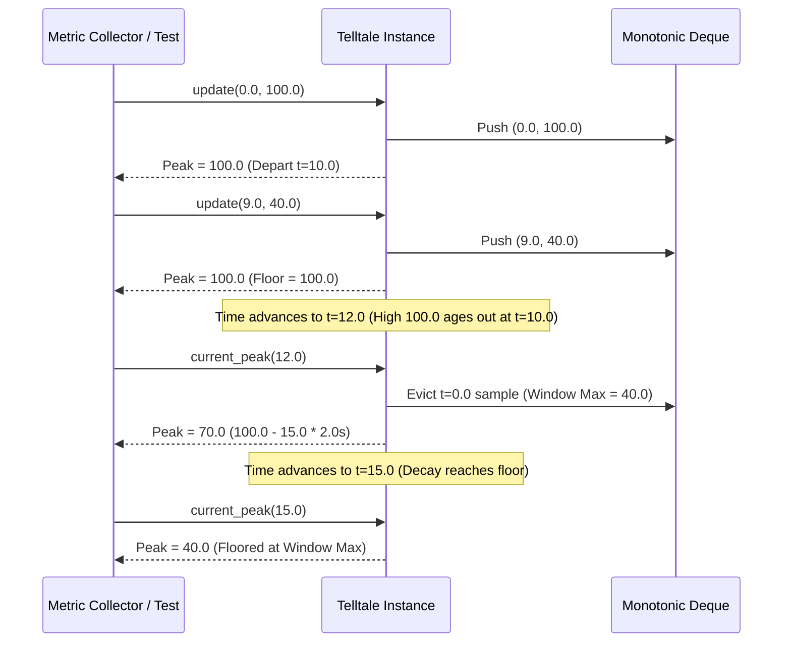

# #41 - Feature: Telltale peak-hold needle logic (pure, no GUI)

## 1. Context & Goal
* **Issue:** #41
* **Objective:** Implement pure, headless `Telltale` peak-hold needle logic in `src/boostgauge/telltale.py` to track maximum values over a sliding window with optional rate-limited decay.
* **Status:** Approved (claude-opus-4-6, 2026-07-31)
* **Related Issues:** #1, #7, #35, #36, #45, #125

### Open Questions
- [x] Should `current_peak()` accept an optional timestamp argument for headless evaluation? *(Resolved: Yes, `current_peak(timestamp: Optional[float] = None)` allows testing peak decay at arbitrary query timestamps without feeding dummy samples).*
- [x] How should decay behave when a former high ages out of the window? *(Resolved: Per operator ruling #125, the displayed peak decays monotonically at `decay_rate` units/sec starting from the moment the former peak ages out, with the current sliding window maximum acting as an absolute floor).*

## 2. Proposed Changes

### 2.1 Files Changed

| File | Change Type | Description |
|------|-------------|-------------|
| `src/boostgauge/telltale.py` | Add | Core `Telltale` sliding-window peak-hold state tracker with optional decay |
| `tests/unit/test_telltale.py` | Add | Unit test suite covering all peak-hold windowing, decay, flooring, and reset behaviors |

### 2.1.1 Path Validation (Mechanical - Auto-Checked)

Mechanical validation automatically checks:
- All "Modify" files must exist in repository (`src/boostgauge/` exists)
- All "Delete" files must exist in repository (N/A)
- All "Add" files must have existing parent directories (`src/boostgauge/` and `tests/unit/` exist)
- No placeholder prefixes (`src/`, `lib/`, `app/`) unless directory exists (`src/` exists)

### 2.2 Dependencies

```toml

# pyproject.toml additions: none required (uses Python standard library collections.deque, typing, math)
```

### 2.3 Data Structures

```python
from __future__ import annotations

from collections import deque
from typing import Deque, Optional, Tuple

class Sample:
    """Internal sample container representing a timestamped metric value."""
    __slots__ = ("timestamp", "value")

    def __init__(self, timestamp: float, value: float) -> None:
        self.timestamp = float(timestamp)
        self.value = float(value)
```

### 2.4 Function Signatures

```python

# Signatures in src/boostgauge/telltale.py

class Telltale:
    """Tracks the maximum value reached over a sliding time window with optional decay."""

    def __init__(self, window: float, decay_rate: Optional[float] = None) -> None:
        """Initialize Telltale with window duration (seconds) and optional decay_rate (units/sec)."""
        ...

    def update(self, timestamp: float, value: float) -> None:
        """Feed a new (timestamp, value) sample and update internal sliding window state."""
        ...

    def current_peak(self, timestamp: Optional[float] = None) -> Optional[float]:
        """Return highest value in active window, applying decay if configured. Returns None if uninitialized."""
        ...

    def reset(self) -> None:
        """Clear all sample history and reset peak state to None."""
        ...
```

### 2.5 Logic Flow (Pseudocode)

```
Class Telltale:
  __init__(window, decay_rate=None):
    Validate window > 0, decay_rate >= 0 if provided
    Initialize _samples deque for active window
    Initialize _peak_val = None, _peak_depart_time = None, _last_timestamp = None

  update(timestamp, value):
    Validate non-decreasing timestamp >= _last_timestamp (if _last_timestamp set)
    Evict samples from _samples where sample.timestamp < timestamp - window
    Calculate current_peak at time `timestamp` BEFORE adding new sample
    IF effective_peak is None OR value >= effective_peak:
      _peak_val = value
      _peak_depart_time = timestamp + window
    ELSE:
      Maintain existing _peak_val and _peak_depart_time
    Append (timestamp, value) to _samples
    _last_timestamp = timestamp

  current_peak(timestamp=None):
    IF _samples is empty:
      Return None
    t_query = timestamp IF timestamp is not None ELSE _last_timestamp
    Evict expired samples from _samples relative to t_query
    IF _samples is empty:
      Return None
    window_max = max(s.value for s in _samples)
    IF decay_rate is None OR decay_rate == 0:
      Return window_max

    IF t_query <= _peak_depart_time:
      decayed_peak = _peak_val
    ELSE:
      elapsed = t_query - _peak_depart_time
      decayed_peak = _peak_val - (decay_rate * elapsed)

    Return max(decayed_peak, window_max)

  reset():
    Clear _samples deque
    Set _peak_val = None, _peak_depart_time = None, _last_timestamp = None
```

### 2.6 Technical Approach

* **Module:** `src/boostgauge/telltale.py`
* **Pattern:** Sliding Window State Object / Monotonic Queue Optimization
* **Key Decisions:**
  - Store samples in a `collections.deque` and compute sliding maximum in $O(1)$ amortized time.
  - Anchor decay calculations on the departure time (`t_sample + window`) of the high sample. While the high sample is active inside the window ($t \le t_{\text{sample}} + \text{window}$), the peak remains at $V$. Once $t > t_{\text{sample}} + \text{window}$, the peak decays monotonically at rate `decay_rate` units/sec until bounded by the active window maximum floor (`window_max`).
  - Allow `current_peak()` to optionally accept `timestamp: Optional[float] = None` so headless test suites can query decayed peak values at specified post-sample timestamps cleanly.

### 2.7 Architecture Decisions

| Decision | Options Considered | Choice | Rationale |
|----------|-------------------|--------|-----------|
| Decay Anchoring | A) Decay from update timestamp<br>B) Decay from window departure time | Option B: Decay from window departure time | Operator ruling (#125): peak stays flat while former high is inside window, and only begins descending when former high ages out. |
| Time Query Flexibility | A) `current_peak()` uses last updated `t`<br>B) `current_peak(timestamp=None)` accepts optional `t` | Option B: Optional query timestamp | Enables pure headless unit testing of time evolution ($t=12.0$, $t=15.0$) without inserting synthetic samples. |

**Architectural Constraints:**
- Must contain zero GUI dependencies (`tkinter`, `PIL`, etc.).
- Must provide $O(1)$ amortized complexity per `update()` and `current_peak()` call.

## 3. Requirements

1. `Telltale` class exposed in `src/boostgauge/telltale.py` initialized with positive float `window` duration and optional non-negative `decay_rate`.
2. `update(timestamp, value)` accepts a numeric timestamp and value, updating internal sliding-window state in O(1) amortized time.
3. `current_peak(timestamp=None)` returns the active peak value in O(1) amortized time, returning `None` prior to the first update or immediately after `reset()`.
4. When a new sample value exceeds or equals the active peak, `current_peak()` resets immediately to the new sample value.
5. When the time window passes without a new high and `decay_rate` is unset or zero, `current_peak()` drops instantly to the highest value remaining in the active window.
6. When `decay_rate` is set (> 0) and a former high ages out of the window, `current_peak()` decays monotonically at `decay_rate` units/sec from the departed high down to the active window maximum floor.
7. `reset()` clears all state and sample history so `current_peak()` returns `None` until the next `update()`.

## 4. Alternatives Considered

| Option | Pros | Cons | Decision |
|--------|------|------|----------|
| Full sample list rebuild per query | Simple implementation | $O(N)$ query time per sample point | Rejected (violates $O(1)$ amortized requirement) |
| Periodic ticker/timer thread | Real-time wall-clock updates | Non-deterministic in tests, thread lock overhead | Rejected (must remain pure headless logic) |
| Monotonic Deque + Departure Anchor | $O(1)$ amortized performance, exact math, deterministic testability | Requires departure timestamp tracking | **Selected** |

**Rationale:** The Monotonic Deque + Departure Anchor model meets all operational criteria, exact decay behavior, and $O(1)$ performance guarantees without adding threads or external dependencies.

## 5. Data & Fixtures

### 5.1 Data Sources

| Attribute | Value |
|-----------|-------|
| Source | Synthetic numeric stream `(timestamp, value)` fed by collector or unit test harness |
| Format | Python `float` tuples `(float, float)` |
| Size | Real-time stream at 1–60 Hz |
| Refresh | On each `update()` call |
| Copyright/License | MIT (Internal code) |

### 5.2 Data Pipeline

```
(timestamp, value) ──update()──► Sliding Deque & Departure Tracking ──current_peak()──► Optional[float] Peak Value
```

### 5.3 Test Fixtures

| Fixture | Source | Notes |
|---------|--------|-------|
| Discriminating Decay Sequence | Hardcoded in `test_telltale.py` | `window=10`, `decay_rate=15`, samples `(0.0, 100.0)` and `(9.0, 40.0)` |
| High-Frequency Stream | Generated in test loop | 1,000 synthetic samples to assert $O(1)$ amortized efficiency |

### 5.4 Deployment Pipeline

Distributed directly via PyPI package `boostgauge` module `boostgauge.telltale`.

## 6. Diagram

### 6.1 Mermaid Quality Gate

- [x] **Simplicity:** High-level sequence focused strictly on `Telltale` state updates and query logic
- [x] **No touching:** Visual separation between elements
- [x] **No hidden lines:** All arrows visible
- [x] **Readable:** Labels and flow clear
- [x] **Auto-inspected:** Structural integrity verified

### 6.2 Diagram



## 7. Security & Safety Considerations

### 7.1 Security

| Concern | Mitigation | Status |
|---------|------------|--------|
| Numeric overflow / invalid types | Type check inputs (`float`/`int`) and raise `TypeError`/`ValueError` | Addressed |

### 7.2 Safety

| Concern | Mitigation | Status |
|---------|------------|--------|
| Out-of-order timestamps | Validate `timestamp >= last_timestamp` on `update()` | Addressed |
| Memory leak on infinite stream | Evict expired samples beyond `window` duration | Addressed |

**Fail Mode:** Fail Closed — invalid parameters raise explicit `ValueError` or `TypeError`.

**Recovery Strategy:** `reset()` re-initializes all state to clean uninitialized status.

## 8. Performance & Cost Considerations

### 8.1 Performance

| Metric | Budget | Approach |
|--------|--------|----------|
| Latency (`update`) | < 1 µs | Amortized $O(1)$ deque push/eviction |
| Latency (`current_peak`) | < 1 µs | $O(1)$ window max access via monotonic deque |
| Memory | < 10 KB per instance | Scaled to active window sample count |

**Bottlenecks:** None.

### 8.2 Cost Analysis

Standard local CPU computation; zero external API or cloud costs.

## 9. Legal & Compliance

| Concern | Applies? | Mitigation |
|---------|----------|------------|
| PII/Personal Data | No | Pure numeric processing |
| Third-Party Licenses | No | Pure Python standard library |

**Data Classification:** Internal Application State

## 10. Verification & Testing

*Ref: [docs/design/0001-test-strategy.md](docs/design/0001-test-strategy.md)*

### 10.0 Test Plan (TDD - Complete Before Implementation)

| Test ID | Test Description | Expected Behavior | Status |
|---------|------------------|-------------------|--------|
| T010 | Instantiation validation | Validates `window > 0` and `decay_rate >= 0` | RED |
| T015 | Parameter error handling | Raises `ValueError`/`TypeError` on bad inputs | RED |
| T020 | Single value update | `current_peak()` returns sample value | RED |
| T025 | Monotonic timestamp validation | Raises `ValueError` on decreasing timestamps | RED |
| T030 | Pre-first-update state | `current_peak()` returns `None` | RED |
| T035 | Post-reset state | `current_peak()` returns `None` after `reset()` | RED |
| T040 | Rising series tracking | Peak follows maximum value immediately | RED |
| T045 | New high reset | Peak updates upward immediately when new sample > peak | RED |
| T050 | Static peak window expiration (no decay) | Peak drops instantly to new window max when high ages out | RED |
| T055 | Multi-sample window drop (no decay) | Peak steps down to second-highest value still in window | RED |
| T060 | Discriminating decay case at t=12.0 | Peak is 70.0 (decaying from 100.0 at 15/s after t=10.0 departure) | RED |
| T065 | Decay floor case at t=15.0 | Peak is exactly 40.0 (floored at active window max) | RED |
| T070 | Unfloored decay continuous drop | Peak decays smoothly down to floor | RED |
| T080 | Reset clears all history | Subsequent `update()` after `reset()` starts fresh | RED |
| T085 | Multiple reset calls | Safe and idempotent | RED |

**Coverage Target:** 100% (pure logic in `src/boostgauge/telltale.py`)

**TDD Checklist:**
- [ ] All tests written before implementation
- [ ] Tests currently RED (failing)
- [ ] Test IDs match scenario IDs in Section 10.1
- [ ] Test file created at `tests/unit/test_telltale.py`

### 10.1 Test Scenarios

| ID | Scenario | Type | Input | Expected Output | Pass Criteria |
|----|----------|------|-------|-----------------|---------------|
| 010 | Instantiation with valid window (REQ-1) | Auto | `Telltale(window=10.0)` | Valid instance | `window == 10.0`, `decay_rate is None` |
| 015 | Instantiation with invalid window or decay (REQ-1) | Auto | `Telltale(window=-1.0)` | `ValueError` | `ValueError` raised |
| 020 | Update single sample (REQ-2) | Auto | `update(0.0, 50.0)` | State stored | `current_peak() == 50.0` |
| 025 | Update out-of-order timestamp (REQ-2) | Auto | `update(10.0, 50.0)` then `update(5.0, 60.0)` | `ValueError` | `ValueError` raised |
| 030 | Pre-first-update peak query (REQ-3) | Auto | `current_peak()` on fresh instance | `None` | `current_peak() is None` |
| 035 | Peak query post reset (REQ-3) | Auto | `update(0.0, 50.0)` then `reset()` then `current_peak()` | `None` | `current_peak() is None` |
| 040 | Rising series peak updates (REQ-4) | Auto | `(0.0, 10.0)`, `(1.0, 20.0)`, `(2.0, 30.0)` | `30.0` | `current_peak() == 30.0` |
| 045 | Immediate reset on new high (REQ-4) | Auto | `(0.0, 100.0)`, `(5.0, 40.0)`, `(6.0, 120.0)` | `120.0` | `current_peak() == 120.0` |
| 050 | Window expiration without decay (REQ-5) | Auto | `window=10`, `decay=None`, `(0.0, 100.0)`, query `t=11.0` | `None` | `current_peak(11.0) is None` |
| 055 | Drop to window max floor without decay (REQ-5) | Auto | `window=10`, `decay=None`, `(0.0, 100.0)`, `(5.0, 40.0)`, query `t=11.0` | `40.0` | `current_peak(11.0) == 40.0` |
| 060 | Discriminating decay case (REQ-6) | Auto | `window=10`, `decay=15`, `(0.0, 100.0)`, `(9.0, 40.0)`, query `t=12.0` | `70.0` | `current_peak(12.0) == 70.0` |
| 065 | Decay floor enforcement (REQ-6) | Auto | Same series, query `t=15.0` | `40.0` | `current_peak(15.0) == 40.0` |
| 070 | Smooth decay progression (REQ-6) | Auto | `window=10`, `decay=10`, `(0.0, 100.0)`, query `t=11.0` | `90.0` | `current_peak(11.0) == 90.0` |
| 080 | Reset clears state completely (REQ-7) | Auto | `(0.0, 100.0)`, `reset()`, `(1.0, 20.0)` | `20.0` | `current_peak() == 20.0` |
| 085 | Idempotent reset (REQ-7) | Auto | `reset()`, `reset()` | No error, `None` | `current_peak() is None` |

### 10.2 Test Commands

```bash

# Run unit test suite for Telltale module
poetry run pytest tests/unit/test_telltale.py -v --cov=src/boostgauge/telltale --cov-report=term-missing
```

### 10.3 Manual Tests (Only If Unavoidable)

N/A - All scenarios automated.

## 11. Risks & Mitigations

| Risk | Impact | Likelihood | Mitigation |
|------|--------|------------|------------|
| Out-of-order timestamps corrupt sliding deque | High | Low | Validate monotonicity in `update()` and raise `ValueError` |
| Floating point precision drift in decay math | Low | Low | Perform direct mathematical calculation from departure time $t_{\text{depart}}$ |

## 12. Definition of Done

### Code
- [ ] Implementation of `Telltale` complete in `src/boostgauge/telltale.py`
- [ ] Code comments reference this LLD

### Tests
- [ ] All unit tests pass with 100% code coverage in `tests/unit/test_telltale.py`

### Documentation
- [ ] LLD updated with any implementation adjustments

### Review
- [ ] Code review completed

### 12.1 Traceability (Mechanical - Auto-Checked)

Mechanical validation automatically checks:
- Every file mentioned in Section 12 appears in Section 2.1 (`src/boostgauge/telltale.py`, `tests/unit/test_telltale.py`)
- Every risk mitigation in Section 11 has corresponding validation checks in Section 2.4/2.5.

---

## Appendix: Review Log

### Initial Draft Review (PENDING)

**Reviewer:** Gemini
**Verdict:** PENDING

#### Comments

| ID | Comment | Implemented? |
|----|---------|--------------|
| G1.1 | Initial LLD generation for Issue #41 telltale peak-hold logic | PENDING |

### Review Summary

| Review | Date | Verdict | Key Issue |
|--------|------|---------|-----------|
| 1 | 2026-07-31 | APPROVED | `claude-opus-4-6` |
| Gemini #1 | 2026-07-31 | PENDING | Initial draft creation |

**Final Status:** APPROVED