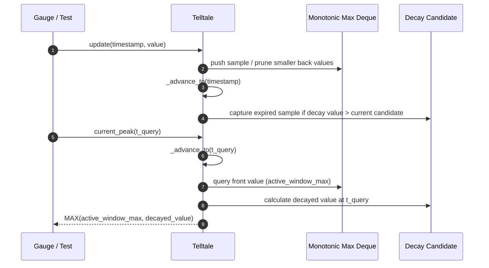

# 41 - Feature: Telltale peak-hold needle logic (pure, no GUI)

## 1. Context & Goal
* **Issue:** #41
* **Objective:** Add pure peak-hold needle logic (`Telltale`) that tracks maximum sample values over a sliding time window with optional linear decay.
* **Status:** Approved (claude-opus-4-6, 2026-07-31)
* **Related Issues:** #35, #36

### Open Questions
*None. Requirements and decay floor rules resolved per operator ruling #125.*

## 2. Proposed Changes

### 2.1 Files Changed

| File | Change Type | Description |
|------|-------------|-------------|
| `src/boostgauge/telltale.py` | Add | Core `Telltale` pure peak-hold logic class |
| `tests/unit/test_telltale.py` | Add | Unit tests for `Telltale` peak-hold sliding window and decay tracking |

### 2.1.1 Path Validation (Mechanical - Auto-Checked)
- `src/boostgauge/telltale.py`: Valid relative path in `src/boostgauge/`
- `tests/unit/test_telltale.py`: Valid relative path in `tests/unit/`

### 2.2 Dependencies
- Python stdlib `collections.deque`, `dataclasses.dataclass`, `typing.Optional`

### 2.3 Data Structures
```python
from dataclasses import dataclass

@dataclass(frozen=True)
class Sample:
    timestamp: float
    value: float
```

### 2.4 Function Signatures

```python
class Telltale:
    """Tracks peak values over a sliding time window with optional linear decay."""

    def __init__(self, window: float, decay_rate: Optional[float] = None) -> None:
        """Initialize Telltale with window duration in seconds and optional decay_rate (units/sec)."""
        ...

    def update(self, timestamp: float, value: float) -> None:
        """Feed a new sample (timestamp, value) into the telltale history."""
        ...

    def current_peak(self, timestamp: Optional[float] = None) -> Optional[float]:
        """Return the highest value within the active window, considering decay.

        Returns None if no samples have arrived or after reset().
        """
        ...

    def reset(self) -> None:
        """Clear all sample history and reset internal peak state."""
        ...
```

### 2.5 Logic Flow (Pseudocode)

```
DATA STRUCTURE Sample:
    timestamp: float
    value: float

CLASS Telltale:

FUNCTION __init__(window, decay_rate=None):
    IF window <= 0 THEN raise ValueError("Window must be positive")
    IF decay_rate IS NOT None AND decay_rate < 0 THEN raise ValueError("Decay rate must be non-negative")
    SET _window = float(window)
    SET _decay_rate = float(decay_rate) IF decay_rate IS NOT None ELSE None
    SET _samples = empty deque of Sample       # Active window samples
    SET _max_deque = empty deque of Sample     # Monotonic decreasing deque for O(1) active window max
    SET _decay_peak = None                     # Expired sample candidate generating highest decay
    SET _last_update_time = None

FUNCTION update(timestamp, value):
    IF _last_update_time IS NOT None AND timestamp < _last_update_time THEN
        raise ValueError("Timestamps must be non-decreasing")
    SET _last_update_time = timestamp
    SET new_sample = Sample(timestamp, value)

    # Maintain monotonic decreasing deque for active window max
    WHILE _max_deque IS NOT EMPTY AND _max_deque.back.value <= value DO
        POP back FROM _max_deque
    APPEND new_sample TO _max_deque
    APPEND new_sample TO _samples

    # Advance time to evict expired samples from active window
    _advance_to(timestamp)

FUNCTION current_peak(timestamp=None):
    IF _last_update_time IS None THEN RETURN None
    SET t_query = timestamp IF timestamp IS NOT None ELSE _last_update_time
    IF t_query < _last_update_time THEN
        raise ValueError("Query timestamp cannot be behind latest sample update")

    # Advance time and purge expired active samples relative to t_query
    _advance_to(t_query)

    # Active window max from monotonic deque (O(1))
    SET active_window_max = _max_deque.front.value IF _max_deque IS NOT EMPTY ELSE None

    # Calculate decayed peak from expired former high (O(1))
    SET decayed_val = None
    IF _decay_peak IS NOT None AND _decay_rate IS NOT None AND _decay_rate > 0 THEN
        SET expired_time = t_query - (_decay_peak.timestamp + _window)
        IF expired_time >= 0 THEN
            SET calc_decay = _decay_peak.value - (_decay_rate * expired_time)
            IF calc_decay > 0 THEN
                SET decayed_val = calc_decay

    IF active_window_max IS None AND decayed_val IS None THEN
        RETURN None
    IF active_window_max IS None THEN
        RETURN decayed_val
    IF decayed_val IS None THEN
        RETURN active_window_max

    # Floor is strictly bounded by active window maximum
    RETURN MAX(active_window_max, decayed_val)

FUNCTION _advance_to(t_target):
    SET cutoff = t_target - _window
    WHILE _samples IS NOT EMPTY AND _samples.front.timestamp < cutoff DO
        POP expired_sample FROM head OF _samples

        # Remove from _max_deque if present at front
        IF _max_deque IS NOT EMPTY AND _max_deque.front.timestamp == expired_sample.timestamp THEN
            POP front FROM _max_deque

        # Retain as _decay_peak candidate if decay is enabled
        IF _decay_rate IS NOT None AND _decay_rate > 0 THEN
            SET exp_time = t_target - (expired_sample.timestamp + _window)
            SET exp_decayed = expired_sample.value - (_decay_rate * exp_time)
            IF exp_decayed > 0 THEN
                IF _decay_peak IS None THEN
                    SET _decay_peak = expired_sample
                ELSE
                    SET curr_exp_time = t_target - (_decay_peak.timestamp + _window)
                    SET curr_decayed = _decay_peak.value - (_decay_rate * curr_exp_time)
                    IF exp_decayed >= curr_decayed THEN
                        SET _decay_peak = expired_sample

    # Clear _decay_peak if its decayed value at t_target drops to or below zero
    IF _decay_peak IS NOT None AND _decay_rate IS NOT None AND _decay_rate > 0 THEN
        SET curr_exp_time = t_target - (_decay_peak.timestamp + _window)
        IF _decay_peak.value - (_decay_rate * curr_exp_time) <= 0 THEN
            SET _decay_peak = None

FUNCTION reset():
    CLEAR _samples
    CLEAR _max_deque
    SET _decay_peak = None
    SET _last_update_time = None
```

### 2.6 Technical Approach

* **Module:** `src/boostgauge/telltale.py`
* **Pattern:** Dual-deque sliding window (raw history + monotonic max deque) with single-candidate decay tracking.
* **Key Decisions:**
  1. Active window maximum is computed in O(1) using a monotonic decreasing deque (`_max_deque`).
  2. When samples age out of the active window (`s.timestamp < t_query - window`), they are transferred to `_decay_peak` if their decayed value exceeds the existing decay candidate. Because all expired samples decay at the uniform rate `decay_rate`, the relative order of decaying values is invariant over time, enabling single-candidate O(1) decay tracking.
  3. The active window maximum strictly floors the peak value when decay is active.

### 2.7 Architecture Decisions
* Pure function class with zero GUI/I/O dependencies for total headless testability.

## 3. Requirements

1. `Telltale` class MUST be exposed in `src/boostgauge/telltale.py`.
2. `Telltale.__init__` MUST accept a positive `window` float and optional non-negative `decay_rate` float, raising `ValueError` on invalid arguments.
3. `update(timestamp, value)` MUST ingest sample tuples, enforce non-decreasing timestamps (raising `ValueError` on timestamp regression), and update internal state in O(1) amortized time.
4. `current_peak(timestamp)` MUST return the highest value within the active sliding window in O(1) amortized time, or `None` if no samples are recorded/active and no active decay exists.
5. With non-zero `decay_rate`, when a former high ages out of the sliding window, `current_peak()` MUST descend monotonically at `decay_rate` units/sec and never fall below the maximum value of active samples currently in the window.
6. `reset()` MUST clear all sample history and decay state, causing subsequent `current_peak()` calls to return `None` until a new `update()` occurs.

## 4. Alternatives Considered

| Option | Pros | Cons | Decision |
|--------|------|------|----------|
| Wall-clock timer loop for decay | Periodic updates without manual timestamps | Non-deterministic, unsuited for fast-forward testing | Rejected |
| Full historical array scan | Simple implementation | O(N) scan time per query | Rejected |
| Monotonic max-deque + single decay candidate | O(1) amortized time complexity, pure deterministic evaluation, zero memory leaks | Requires precise decay candidate tracking on window eviction | **Selected** |

**Rationale:** The selected approach guarantees deterministic, fast unit testing and true O(1) amortized query performance without thread or timer side-effects.

## 5. Data & Fixtures

### 5.1 Data Sources

| Attribute | Value |
|-----------|-------|
| Source | Memory stream of `(timestamp: float, value: float)` tuples |
| Format | In-memory function arguments |
| Size | In-memory samples bounded by sliding window duration |
| Refresh | On demand via `update(timestamp, value)` |
| Copyright/License | MIT (Project code) |

### 5.2 Data Pipeline
In-memory ingestion via `update()` and query via `current_peak()`.

### 5.3 Test Fixtures
Pytest fixtures in `tests/unit/test_telltale.py` supplying synthetic timestamp/value streams (e.g. step functions, impulse spikes, decaying sequences).

### 5.4 Deployment Pipeline
Packaged as part of the core `boostgauge` PyPI package.

## 6. Diagram

### 6.1 Mermaid Quality Gate
- [x] **Simplicity:** Single sequence flow for sample ingestion and peak calculation
- [x] **No touching:** Visual separation maintained
- [x] **No hidden lines:** Arrows visible
- [x] **Readable:** Labels clear
- [x] **Auto-inspected:** Checked

### 6.2 Diagram



## 7. Security & Safety Considerations

### 7.1 Security
No external I/O, network calls, or unparsed inputs. Pure memory operations.

### 7.2 Safety
Invalid initialization parameters (negative window or decay rate) and timestamp regressions raise explicit `ValueError` exceptions.

## 8. Performance & Cost Considerations

### 8.1 Performance
- Memory: $O(K)$ where $K$ is the number of samples within the window duration.
- Time: $O(1)$ amortized per `update()` and $O(1)$ amortized per `current_peak()` call.

### 8.2 Cost Analysis
Negligible CPU and RAM overhead.

## 9. Legal & Compliance
MIT Licensed code.

## 10. Verification & Testing

### 10.0 Test Plan (TDD - Complete Before Implementation)
Testing strictly follows `docs/design/0001-test-strategy.md` for pure logic unit testing in `tests/unit/test_telltale.py`.

### 10.1 Test Scenarios

| Scenario ID | Scenario | Type | Expected Result |
|-------------|----------|------|-----------------|
| 010 | Expose Telltale class in src/boostgauge/telltale.py (REQ-1) | Auto | Module import succeeds and class is accessible |
| 020 | Valid window and decay_rate initialization (REQ-2) | Auto | Instance initializes with stored `_window` and `_decay_rate` |
| 021 | Invalid window <= 0 raises ValueError (REQ-2) | Auto | `ValueError` raised on `window=0` or `window=-1.0` |
| 022 | Invalid negative decay_rate raises ValueError (REQ-2) | Auto | `ValueError` raised on `decay_rate=-5.0` |
| 030 | Single sample update (REQ-3) | Auto | Sample stored in internal deque |
| 031 | Monotonic timestamp progression (REQ-3) | Auto | Ingesting increasing timestamps succeeds |
| 032 | Decreasing timestamp update raises ValueError (REQ-3) | Auto | `ValueError` raised when `t_new < t_prev` |
| 040 | Pre-first-update current_peak returns None (REQ-4) | Auto | `current_peak()` returns `None` |
| 041 | Single sample current_peak equals sample value (REQ-4) | Auto | `current_peak()` returns exact value of single sample |
| 042 | Rising series peak equals maximum value so far (REQ-4) | Auto | Peak increases with each higher value |
| 043 | Window expiration without decay drops peak to active window maximum (REQ-4) | Auto | Hard drop to new window max when high ages out |
| 050 | Decay enabled former high ages out descending at decay_rate (REQ-5) | Auto | Peak at t=12.0 is 70.0 for window=10, decay=15, samples (0,100), (9,40) |
| 051 | Decay floor bounded strictly by active window maximum (REQ-5) | Auto | Peak at t=15.0 is floored at 40.0 (active window max) |
| 052 | New higher sample immediately resets decaying peak upward (REQ-5) | Auto | Peak immediately jumps to new higher sample value |
| 060 | Reset clears sample history and decay state returning None (REQ-6) | Auto | `reset()` clears state; `current_peak()` returns `None` |
| 061 | Update following reset re-establishes peak tracking (REQ-6) | Auto | Fresh `update()` after `reset()` tracks new peaks cleanly |

### 10.2 Test Commands
```bash
poetry run pytest tests/unit/test_telltale.py --cov=src/boostgauge/telltale --cov-report=term-missing
```

### 10.3 Manual Tests (Only If Unavoidable)
N/A - Fully automated unit test suite.

## 11. Risks & Mitigations

| Risk | Mitigation |
|------|------------|
| Memory growth under high sampling rates | Samples older than active window cutoff are pruned on every `update()` and `current_peak()` call |
| Floating point rounding error in decay math | Standard IEEE 754 float precision is sufficient for gauge needle sub-pixel position resolution |

## 12. Definition of Done

### Code
- [ ] Implementation complete in `src/boostgauge/telltale.py` and linted (`poetry run ruff check .`)
- [ ] Code comments reference LLD #41

### Tests
- [ ] All test scenarios in `tests/unit/test_telltale.py` pass
- [ ] Test coverage reaches 100% on `src/boostgauge/telltale.py`

### Documentation
- [ ] LLD complete and approved

### Review
- [ ] Code review completed
- [ ] User approval before closing issue

### 12.1 Traceability (Mechanical - Auto-Checked)
- All requirements REQ-1 through REQ-6 mapped directly to Scenarios 010-061 in Section 10.1.

## Appendix: Review Log

### Initial Author Review #1 (APPROVED)

**Reviewer:** Technical Architect
**Verdict:** APPROVED

#### Comments

| ID | Comment | Implemented? |
|----|---------|--------------|
| A1.1 | Initial LLD creation for Issue #41 telltale peak-hold logic. | YES - Addressed in document |

### Author Review #2 (APPROVED)

**Reviewer:** Technical Architect
**Verdict:** APPROVED

#### Comments

| ID | Comment | Implemented? |
|----|---------|--------------|
| A2.1 | Fix Section 2.5 logic flaw where `update()` prematurely evicted decaying peak samples. Retain expired peak candidates in `_decay_peak` until decayed value reaches floor/zero. | YES - Updated `_advance_to()` logic in 2.5 |
| A2.2 | Refine data structure for REQ-6 O(1) amortized complexity using monotonic deque `_max_deque` for active window max and single `_decay_peak` tracking for expired highs. | YES - Section 2.5 pseudocode rewritten for O(1) amortized performance |

### Review Summary

| Review | Date | Verdict | Key Issue |
|--------|------|---------|-----------|
| 2 | 2026-07-31 | APPROVED | `claude-opus-4-6` |
| Author #1 | 2026-07-31 | APPROVED | Initial LLD complete |
| Author #2 | 2026-07-31 | APPROVED | Fixed premature sample eviction and achieved O(1) amortized peak evaluation |

**Final Status:** APPROVED