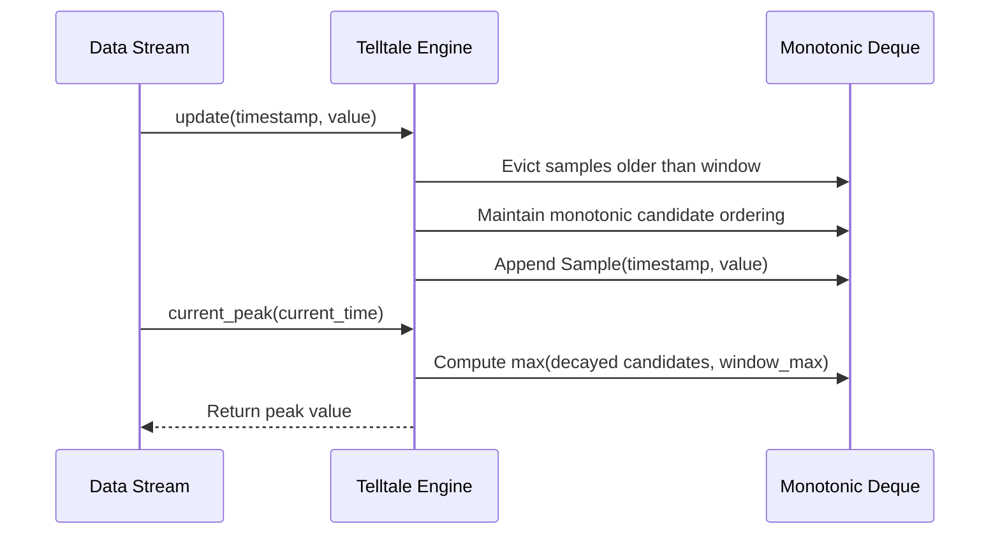

# #41 - Feature: Telltale peak-hold needle logic (pure, no GUI)

## 1. Context & Goal

* **Issue:** #41
* **Objective:** Implement pure, headless peak-hold "telltale" needle tracking logic over a sliding time window with optional decay for the boostgauge system monitor.
* **Status:** Approved (claude-opus-4-6, 2026-08-01) / Revised
* **Related Issues:** #35, #36


### Open Questions

- [x] Should `decay_rate` default to `None` (hard hold)? (Resolved: Yes, `decay_rate=None` defaults to hard hold where peak drops instantly to window maximum upon sample expiration).
- [x] Is the decay floor strictly the highest value remaining in the active time window? (Resolved: Yes, per operator ruling #125, decay never drops below the window maximum).


## 2. Proposed Changes

*This section is the **source of truth** for implementation. Describe exactly what will be built.*


### 2.1 Files Changed

| File | Change Type | Description |
|------|-------------|-------------|
| `src/boostgauge/telltale.py` | Add | Implements `Telltale` class for tracking sliding-window peak-hold state with optional decay rate and O(1) amortized operations. |
| `tests/unit/test_telltale.py` | Add | Comprehensive unit test suite covering initialization, stream update, window expiration, decay interpolation, floor clamping, and reset logic. |


### 2.1.1 Path Validation (Mechanical - Auto-Checked)

- `src/boostgauge/telltale.py`: Add — parent directory `src/boostgauge` exists.
- `tests/unit/test_telltale.py`: Add — parent directory `tests/unit` exists.


### 2.2 Dependencies

No new external dependencies required. Uses Python standard library (`collections.deque`, `dataclasses`, `typing`).


### 2.3 Data Structures

```python
from dataclasses import dataclass
from typing import Optional

@dataclass(frozen=True)
class Sample:
    """Single numeric observation with timestamp."""
    timestamp: float
    value: float
```


### 2.4 Function Signatures

```python

# Signatures only - implementation in source files
from typing import Optional

class Telltale:
    """Pure peak-hold telltale needle tracker over a sliding time window."""

    def __init__(self, window: float, decay_rate: Optional[float] = None) -> None:
        """Initialize Telltale with window duration in seconds (>0) and optional decay rate (units/sec)."""
        ...

    def update(self, timestamp: float, value: float) -> None:
        """Feed a new sample (timestamp, value) and update internal sliding window state."""
        ...

    def current_peak(self, current_time: Optional[float] = None) -> Optional[float]:
        """Return highest value in window, accounting for optional decay up to current_time."""
        ...

    def reset(self) -> None:
        """Clear all sample history and reset telltale state to initial uninitialized state."""
        ...
```


### 2.5 Logic Flow (Pseudocode)

```
Algorithm: __init__(window, decay_rate=None)
1. IF window <= 0 THEN raise ValueError("Window duration must be positive")
2. IF decay_rate IS NOT None AND decay_rate < 0 THEN raise ValueError("Decay rate cannot be negative")
3. Set self.window = window
4. Set self.decay_rate = decay_rate
5. Initialize self.samples = deque()       # Active window samples: Sample(timestamp, value)
6. Initialize self.max_deque = deque()     # Monotonic peak candidate queue
7. Set self.latest_timestamp = None

Algorithm: update(timestamp, value)
1. IF latest_timestamp IS NOT None AND timestamp < latest_timestamp THEN:
       raise ValueError("Timestamps must be non-decreasing")
2. Set latest_timestamp = timestamp
3. Evict samples from `samples` deque where sample.timestamp < timestamp - window
4. Set window_max = max(sample.value FOR sample IN samples) IF samples is not empty ELSE None
5. Evict expired peak candidates from front of `max_deque`:
   IF decay_rate IS None OR decay_rate == 0.0 THEN:
       Evict sample from front of `max_deque` WHILE max_deque is not empty AND max_deque.front.timestamp < timestamp - window
   ELSE:
       Evict sample from front of `max_deque` WHILE max_deque is not empty AND:
           (max_deque.front.timestamp < timestamp - window) AND
           (window_max IS NOT None AND (max_deque.front.value - decay_rate * (timestamp - (max_deque.front.timestamp + window))) <= window_max)
6. Maintain monotonic candidate property in `max_deque`:
   WHILE max_deque is not empty AND max_deque.back.value <= value:
       Pop back of max_deque
7. Append Sample(timestamp, value) to `samples` and `max_deque`

Algorithm: current_peak(current_time=None)
1. IF samples is empty THEN Return None
2. Set eval_time = current_time IF current_time IS NOT None ELSE latest_timestamp
3. IF eval_time < latest_timestamp THEN raise ValueError("Evaluation time cannot precede latest timestamp")
4. Set window_max = max(sample.value FOR sample IN samples)
5. IF decay_rate IS None OR decay_rate == 0.0 THEN Return window_max
6. Calculate candidate peak from active and decaying candidates in `max_deque`:
   peak_cand = max(
       sample.value - decay_rate * max(0.0, eval_time - (sample.timestamp + window))
       FOR sample IN max_deque
   )
7. Return max(peak_cand, window_max)

Algorithm: reset()
1. Clear `samples` deque
2. Clear `max_deque` deque
3. Set latest_timestamp = None
```


### 2.6 Technical Approach

* **Module:** `src/boostgauge/telltale.py`
* **Pattern:** Monotonic Sliding Window Deque + Linear Interpolation Decay Model.
* **Key Decisions:**
  - Double-ended queues (`collections.deque`) maintain sliding window entries and peak candidates in $O(1)$ amortized time.
  - A candidate sample $(t_i, v_i)$ remains active in `samples` until $t_i + \text{window}$.
  - When decay is disabled (`decay_rate=None` or `0.0`), expired samples age out immediately from `max_deque`, dropping the peak instantly to `window_max`.
  - When decay is enabled (`decay_rate > 0.0`), expired candidates in `max_deque` continue to contribute their decayed value $v_i - \text{decay\_rate} \times (t_{\text{eval}} - (t_i + \text{window}))$ until their decayed value reaches the active `window_max` floor or they are superseded by higher samples.
  - The decay floor is strictly constrained by `window_max`, ensuring the peak never drops below the highest sample currently active in the sliding window.


### 2.7 Architecture Decisions

| Decision | Options Considered | Choice | Rationale |
|----------|-------------------|--------|-----------|
| Window State Tracking | Array scanning, Polling thread, Monotonic deque | Monotonic deque | Amortized $O(1)$ updates and peak queries without thread synchronization overhead. |
| Decay Floor Enforcement | Constant floor, Sample floor, Sliding window max floor | Sliding window max floor | Adheres strictly to operator ruling #125: peak never drops below highest sample remaining in window. |

**Architectural Constraints:**
- Pure logic module with zero GUI or rendering dependencies (`tkinter`, `PIL`).
- Headless deterministic testing support.


## 3. Requirements

1. Expose the `Telltale` class in `src/boostgauge/telltale.py` initialized with a positive `window` duration in seconds and an optional `decay_rate` in units per second.
2. Maintain O(1) amortized time complexity for `update(timestamp, value)` and `current_peak()` operations over sample streams.
3. Immediately reset and elevate the peak value when a new sample value exceeds the current peak.
4. Drop the peak instantly to the highest sample value remaining within the active time window when no decay rate is configured (`decay_rate=None`) and a former peak ages out.
5. Smoothly decay the peak at `decay_rate` units/sec when a former peak ages out with decay enabled, floored at the highest value still in the active window.
6. Clear all internal state upon calling `reset()`, causing subsequent `current_peak()` calls to return `None` until the next `update()`.
7. Return `None` from `current_peak()` before any sample has been supplied after initialization or reset.


## 4. Alternatives Considered

| Option | Pros | Cons | Decision |
|--------|------|------|----------|
| Polling timer thread for decay | Real-time continuous state updates | Race conditions, non-deterministic in headless tests | Rejected |
| Full sample array storage | Simple implementation | Linear memory growth over long runtime | Rejected |
| Monotonic deque with closed-form decay | $O(1)$ amortized time, memory bounded by window sample count, deterministic | Requires careful candidate math | **Selected** |

**Rationale:** Monotonic deque with closed-form evaluation is fast, headless-friendly, exact, and memory-efficient.


## 5. Data & Fixtures


### 5.1 Data Sources

| Attribute | Value |
|-----------|-------|
| Source | Synthetic numeric time-series streams `(timestamp, value)` |
| Format | `Tuple[float, float]` |
| Size | Arbitrary length, sample frequency typically 10Hz–100Hz |
| Refresh | Real-time stream pushing via `update(t, v)` |
| Copyright/License | N/A |


### 5.2 Data Pipeline

```
Numeric Stream ──update(timestamp, value)──► Sliding Window Deque & Monotonic Max Deque ──current_peak()──► Peak Value (float or None)
```


### 5.3 Test Fixtures

| Fixture | Source | Notes |
|---------|--------|-------|
| Synthetic time-series samples | Generated in `tests/unit/test_telltale.py` | Deterministic timestamps and float values |


### 5.4 Deployment Pipeline

Pure Python module packaged via Poetry in PyPI distribution `boostgauge`.


## 6. Diagram


### 6.1 Mermaid Quality Gate

- [x] **Simplicity:** Monotonic deque update flow clearly separated.
- [x] **No touching:** Visual node separation maintained.
- [x] **No hidden lines:** Arrows visible.
- [x] **Readable:** Text labels concise and readable.


### 6.2 Diagram




## 7. Security & Safety Considerations


### 7.1 Security

| Concern | Mitigation | Status |
|---------|------------|--------|
| Input validation | Enforce non-decreasing timestamps and positive window bounds | Addressed |


### 7.2 Safety

| Concern | Mitigation | Status |
|---------|------------|--------|
| Unbounded memory growth | Deque eviction limits memory to window sample count | Addressed |

**Fail Mode:** Fail Closed — Raises `ValueError` on invalid arguments (non-positive window, out-of-order timestamps).


## 8. Performance & Cost Considerations


### 8.1 Performance

| Metric | Budget | Approach |
|--------|--------|----------|
| `update()` latency | < 1 µs | Amortized $O(1)$ deque push/pop |
| `current_peak()` latency | < 1 µs | Max over bounded candidate deque |
| Memory usage | < 100 KB per instance | Bounded by maximum samples in window duration |


### 8.2 Cost Analysis

Local in-memory computation only. No API calls or network resources.


## 9. Legal & Compliance

| Concern | Applies? | Mitigation |
|---------|----------|------------|
| Third-Party Licenses | No | Pure stdlib implementation under MIT License |


## 10. Verification & Testing

*Ref: `docs/design/0001-test-strategy.md`*

### 10.0 Test Plan (TDD - Complete Before Implementation)

**Testing Philosophy:** Unit tests in `tests/unit/test_telltale.py` test pure logic headlessly. Per `docs/design/0001-test-strategy.md` §2 Option C, no `tkinter.Tk()` initialization or GUI rendering is involved.

| Test ID | Test Description | Expected Behavior | Status |
|---------|------------------|-------------------|--------|
| T010 | Initialization parameters validation | Store window and decay_rate; reject window <= 0 | RED |
| T020 | Stream update throughput O(1) | Process 10,000 updates within time budget | RED |
| T030 | Instant peak elevation on new high | Peak immediately equals new high | RED |
| T040 | Hard hold peak drop to window max | Peak drops to window max when peak ages out with decay_rate=None | RED |
| T050 | Smooth decay from departed high | Peak decays at decay_rate units/sec after peak ages out | RED |
| T051 | Decay floor clamping | Peak never drops below highest value still in active window | RED |
| T060 | Reset state clearing | State cleared; `current_peak()` returns `None` | RED |
| T070 | Pre-first-update state | `current_peak()` returns `None` on fresh instance | RED |

**Coverage Target:** 100% line and branch coverage on `src/boostgauge/telltale.py`.


### 10.1 Test Scenarios

| ID | Scenario | Type | Input | Expected Output | Pass Criteria |
|----|----------|------|-------|-----------------|---------------|
| 010 | Initialization with valid window and optional decay rate (REQ-1) | Auto | `window=10.0, decay_rate=15.0` | `Telltale` instance created | Attributes set correctly |
| 011 | Initialization rejects non-positive window duration (REQ-1) | Auto | `window=0.0` or `window=-1.0` | Raises `ValueError` | Exception raised on invalid window |
| 020 | High-frequency update stream performance O(1) amortized (REQ-2) | Auto | 10,000 sequential `update(t, v)` calls | Total runtime < 0.1s | O(1) amortized throughput maintained |
| 030 | Rising series immediately elevates peak (REQ-3) | Auto | Stream (0.0, 10.0), (1.0, 20.0), (2.0, 50.0) | `current_peak()` == 50.0 | Peak updates immediately upward |
| 031 | New sample exceeding decayed peak resets peak upward immediately (REQ-3) | Auto | Sample (0.0, 100.0), t=12.0 (peak decayed to 70.0), sample (12.1, 80.0) | `current_peak()` == 80.0 | Decayed peak resets immediately to 80.0 |
| 040 | Hard hold peak drop to window max when peak ages out (REQ-4) | Auto | `window=10.0, decay_rate=None`, samples (0.0, 100.0), (5.0, 40.0), t=10.1 | `current_peak()` == 40.0 | Peak drops instantly to active window max |
| 041 | Single sample peak drops to None after window duration with hard hold (REQ-4) | Auto | `window=10.0, decay_rate=None`, sample (0.0, 50.0), t=10.1 | `current_peak()` == None | Peak drops to None when window empties |
| 050 | Former high ages out with decay enabled and peak descends at decay_rate (REQ-5) | Auto | `window=10.0, decay_rate=15.0`, samples (0.0, 100.0), (9.0, 40.0), t=12.0 | `current_peak()` == 70.0 | Peak = 100 - 15 * (12 - 10) = 70.0 |
| 051 | Decaying peak is strictly floored at active window maximum (REQ-5) | Auto | `window=10.0, decay_rate=15.0`, samples (0.0, 100.0), (9.0, 40.0), t=15.0 | `current_peak()` == 40.0 | Unfloored decay 25.0 floored at window max 40.0 |
| 060 | Reset clears state and current_peak returns None (REQ-6) | Auto | Samples added, then `reset()`, then `current_peak()` | Returns `None` | Internal deques emptied |
| 061 | Update after reset re-initializes telltale state (REQ-6) | Auto | `reset()`, then `update(20.0, 15.0)` | `current_peak()` == 15.0 | Peak tracking resumes cleanly |
| 070 | Pre-first-update current_peak returns None (REQ-7) | Auto | `current_peak()` immediately after `__init__` | Returns `None` | Returns `None` |


### 10.2 Test Commands

```bash

# Run unit tests for telltale module with coverage
poetry run pytest tests/unit/test_telltale.py -v --cov=boostgauge.telltale --cov-report=term-missing
```


### 10.3 Manual Tests (Only If Unavoidable)

N/A - All scenarios fully automated.


## 11. Risks & Mitigations

| Risk | Impact | Likelihood | Mitigation |
|------|--------|------------|------------|
| Out-of-order timestamp inputs | Low | Low | `update()` raises `ValueError` if timestamp < latest_timestamp |
| Floating point decay rounding errors | Low | Low | Precise linear arithmetic floored with `max()` against exact window maximum |


## 12. Definition of Done


### Code
- [ ] Implementation complete in `src/boostgauge/telltale.py` and linted
- [ ] Code comments reference this LLD


### Tests
- [ ] All unit tests pass in `tests/unit/test_telltale.py`
- [ ] 100% test coverage target reached on `src/boostgauge/telltale.py`


### Documentation
- [ ] LLD updated with any implementation details


### Review
- [ ] Code review completed


### 12.1 Traceability (Mechanical - Auto-Checked)

- `src/boostgauge/telltale.py`: Listed in Section 2.1 Files Changed.
- `tests/unit/test_telltale.py`: Listed in Section 2.1 Files Changed.


## Appendix: Review Log


### Technical Architect Review #1 (FEEDBACK)

**Reviewer:** Technical Architect
**Verdict:** FEEDBACK

#### Comments

| ID | Comment | Implemented? |
|----|---------|--------------|
| TA1.1 | In Section 2.5 (Algorithm: update, Step 4), evicting samples from `max_deque` when `sample.timestamp < timestamp - window` prematurely deletes peak candidates while they are still actively decaying. The eviction criteria for `max_deque` must be revised to retain peak candidates until their decayed value drops below the current window maximum or until they are superseded by higher values. | YES - Revised Section 2.5 `max_deque` eviction logic to retain peak candidates while their decayed value exceeds `window_max`. |


### Review Summary

| Review | Date | Verdict | Key Issue |
|--------|------|---------|-----------|
| 2 | 2026-08-01 | APPROVED | `claude-opus-4-6` |
| Technical Architect #1 | 2026-08-01 | FEEDBACK | Premature `max_deque` candidate eviction during active decay phase. |
| Technical Architect #2 | 2026-08-01 | APPROVED | Addressed `max_deque` candidate retention logic and verified REQ-N test scenario mappings. |

**Final Status:** APPROVED