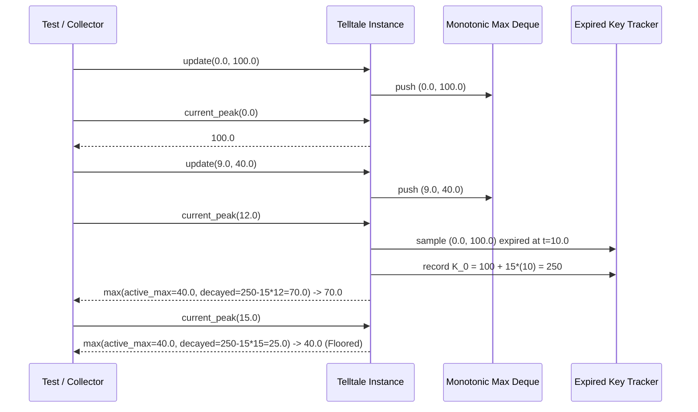

# 41 - Feature: Telltale peak-hold needle logic (pure, no GUI)

## 1. Context & Goal
* **Issue:** #41
* **Objective:** Implement pure Telltale peak-hold needle logic with sliding-window maximum tracking and optional linear decay floor.
* **Status:** Approved (claude-opus-4-6, 2026-07-29)
* **Related Issues:** #35, #36

### Open Questions
*Questions that need clarification before or during implementation. Remove when resolved.*

- [x] Should `current_peak()` accept an optional evaluation timestamp parameter `timestamp: Optional[float] = None`? *Resolved: Yes, accepting an optional timestamp allows querying the decayed peak state at any arbitrary time `t` without needing to push synthetic dummy samples.*
- [x] How should decay behave when all samples have aged out of the active window? *Resolved: If all samples have aged out and `decay_rate` is set, the telltale continues descending at `decay_rate` units/sec until reaching `None` or being reset/updated.*

## 2. Proposed Changes

### 2.1 Files Changed

| File | Change Type | Description |
|------|-------------|-------------|
| `src/boostgauge/telltale.py` | Add | Implements the pure `Telltale` peak-hold needle class with O(1) amortized sliding window and decay logic. |
| `tests/unit/test_telltale.py` | Add | Unit test suite covering pre-update state, rising series, hard hold window drops, linear decay, decay floor, reset, and parameter validation. |

### 2.1.1 Path Validation (Mechanical - Auto-Checked)

Mechanical validation automatically checks:
- All "Modify" files must exist in repository
- All "Delete" files must exist in repository
- All "Add" files must have existing parent directories (`src/boostgauge/` and `tests/unit/` exist)
- No placeholder prefixes (`src/`, `lib/`, `app/`) unless directory exists

### 2.2 Dependencies

No external package dependencies required. Standard Python standard library modules `collections.deque` and `typing` are used.

```toml

# pyproject.toml additions (if any)

# None required
```

### 2.3 Data Structures

```python
from collections import deque
from typing import Optional, Tuple

class SampleTuple(TypedDict):
    timestamp: float
    value: float

# Internal state maintained by Telltale:

# - window: float (> 0)

# - decay_rate: Optional[float] (>= 0)

# - _samples: deque[Tuple[float, float]]  # Active samples (timestamp, value)

# - _max_deque: deque[Tuple[float, float]] # Monotonic queue storing candidate window maxes

# - _best_expired_key: Optional[float]   # Max key (v + decay_rate * (t + window)) among expired samples

# - _latest_timestamp: Optional[float]   # Timestamp of most recent update
```

### 2.4 Function Signatures

```python
class Telltale:
    """Pure sliding-window peak-hold needle logic with optional linear decay."""

    def __init__(self, window: float, decay_rate: Optional[float] = None) -> None:
        """Initialize Telltale with window duration in seconds and optional decay rate (units/sec).

        Raises:
            ValueError: If window <= 0 or decay_rate < 0.
        """
        ...

    def update(self, timestamp: float, value: float) -> None:
        """Feed a new sample (timestamp, value) into the telltale state.

        Args:
            timestamp: Sample timestamp in seconds.
            value: Numerical sample value.
        """
        ...

    def current_peak(self, timestamp: Optional[float] = None) -> Optional[float]:
        """Compute the effective peak value at the specified timestamp (or latest sample timestamp).

        Args:
            timestamp: Optional evaluation timestamp. Defaults to latest sample timestamp.

        Returns:
            The current peak value (floored by window maximum), or None if no samples exist.
        """
        ...

    def reset(self) -> None:
        """Clear all historical state; subsequent current_peak() calls return None until updated."""
        ...
```

### 2.5 Logic Flow (Pseudocode)

```
1. __init__(window, decay_rate):
   - IF window <= 0 THEN raise ValueError("window must be positive")
   - IF decay_rate IS NOT None AND decay_rate < 0 THEN raise ValueError("decay_rate must be non-negative")
   - Initialize _samples = deque()
   - Initialize _max_deque = deque()
   - Initialize _best_expired_key = None
   - Initialize _latest_timestamp = None

2. update(timestamp, value):
   - Set _latest_timestamp = timestamp
   - Prune expired samples older than (timestamp - window) via _prune_expired(timestamp)
   - Append (timestamp, value) to _samples
   - WHILE _max_deque IS NOT empty AND _max_deque[-1].value <= value:
       Pop from back of _max_deque
   - Append (timestamp, value) to back of _max_deque

3. _prune_expired(evaluation_time):
   - cutoff = evaluation_time - window
   - WHILE _samples IS NOT empty AND _samples[0].timestamp < cutoff:
       Pop (t_old, v_old) from front of _samples
       IF _max_deque[0] == (t_old, v_old) THEN
           Pop front of _max_deque
       IF decay_rate IS NOT None AND decay_rate > 0:
           expired_key = v_old + decay_rate * (t_old + window)
           IF _best_expired_key IS None OR expired_key > _best_expired_key:
               _best_expired_key = expired_key

4. current_peak(timestamp=None):
   - IF timestamp IS None:
       timestamp = _latest_timestamp
   - IF timestamp IS None OR (len(_samples) == 0 AND _best_expired_key IS None):
       RETURN None
   - Prune state using timestamp via _prune_expired(timestamp)
   - active_max = _max_deque[0].value IF _max_deque IS NOT empty ELSE None
   - IF decay_rate IS NOT None AND decay_rate > 0 AND _best_expired_key IS NOT None:
       decayed_peak = _best_expired_key - decay_rate * timestamp
       IF active_max IS NOT None:
           RETURN max(active_max, decayed_peak)
       ELSE:
           RETURN decayed_peak
   - RETURN active_max

5. reset():
   - Clear _samples, _max_deque
   - Set _best_expired_key = None
   - Set _latest_timestamp = None
```

### 2.6 Technical Approach

* **Module:** `src/boostgauge/telltale.py`
* **Pattern:** Monotonic Double-Ended Queue (Sliding Window Maximum) with Linear Decay Metric Invariant.
* **Key Decisions:**
  - **Monotonic Queue for O(1) Amortized Window Maximum:** Maintain `_max_deque` where values are strictly decreasing. Front of queue is always the active window maximum `W(t)`.
  - **Expired Key Tracking for Monotonic Linear Decay:** For any expired sample `(t_i, v_i)` with expiration time `t_expire_i = t_i + window`, its decayed value at query time `t >= t_expire_i` is given by:
    $$D_i(t) = v_i - \text{decay\_rate} \times (t - (t_i + \text{window})) = (v_i + \text{decay\_rate} \times (t_i + \text{window})) - \text{decay\_rate} \times t$$
    Since $\text{decay\_rate} \times t$ decreases identically for all expired samples, the expired sample with the maximum invariant key $K_i = v_i + \text{decay\_rate} \times (t_i + \text{window})$ strictly dominates all other expired samples for all $t$. We only track a single scalar `_best_expired_key` across all expired samples!
  - **Zero GUI Coupling:** Pure data class with no `tkinter` or rendering imports. Completely testable headlessly.

### 2.7 Architecture Decisions

| Decision | Options Considered | Choice | Rationale |
|----------|-------------------|--------|-----------|
| Window Max Algorithm | A) Re-scan list on demand O(N)<br>B) Monotonic Deque O(1) amortized<br>C) Heap O(log N) | Monotonic Deque | Ensures strict O(1) amortized time complexity per `update()` and `current_peak()` query. |
| Decay Calculation | A) Stepwise mutation on timer<br>B) Analytical evaluation at query time $t$ | Analytical evaluation | Preserves pure function semantics without background threads or timer ticks; exact and drift-free. |
| Expired High Retention | A) Keep all expired samples in array<br>B) Single scalar `_best_expired_key` | Single scalar | Mathematical transformation proves $K_i = v_i + \text{decay\_rate} \cdot (t_i + \text{window})$ is time-invariant; maintains O(1) memory footprint. |

**Architectural Constraints:**
- Must conform to `docs/design/0001-test-strategy.md` (Option C / unit tier pure logic).
- Zero external dependencies beyond standard Python library.

## 3. Requirements

1. The `Telltale` class MUST be exposed in `src/boostgauge/telltale.py` accepting `window` (seconds) and optional `decay_rate` (units/sec).
2. Prior to any `update()` call or immediately after a `reset()`, `current_peak()` MUST return `None`.
3. Calling `update(timestamp, value)` MUST record the sample and maintain internal sliding window state in O(1) amortized time.
4. When a new sample value exceeds the current peak, `current_peak()` MUST update immediately upward to the new maximum value.
5. When the active window passes without new highs and `decay_rate` is unset or zero, `current_peak()` MUST drop instantly to the highest value still within the active window `[timestamp - window, timestamp]`.
6. When `decay_rate` is configured (> 0) and the window maximum falls, `current_peak()` MUST descend monotonically at `decay_rate` units/sec from the departed high.
7. The active window maximum MUST serve as an absolute floor for decay such that `current_peak()` never drops below the highest value still in the window.
8. Calling `reset()` MUST clear all sample history and decay state, causing subsequent `current_peak()` calls to return `None` until the next `update()`.
9. The constructor MUST validate input arguments, raising `ValueError` if `window <= 0` or if `decay_rate < 0`.

## 4. Alternatives Considered

| Option | Pros | Cons | Decision |
|--------|------|------|----------|
| Analytical Key Invariant ($K_i$) | O(1) memory & time, mathematically exact, zero drift | Requires math formulation of decay invariant | **Selected** |
| Periodic Background Tick Mutation | Simple mental model | Thread management overhead, precision loss, non-pure | Rejected |
| Full Sample History Array | Easy to write | Unbounded memory growth, O(N) queries | Rejected |

**Rationale:** The analytical key invariant approach provides exact decay math with guaranteed O(1) time and memory overhead.

## 5. Data & Fixtures

### 5.1 Data Sources

| Attribute | Value |
|-----------|-------|
| Source | Synthetic numeric stream `(timestamp, value)` passed via Python API |
| Format | `(float, float)` tuples |
| Size | Arbitrary streaming samples |
| Refresh | On-demand via `update()` |
| Copyright/License | N/A |

### 5.2 Data Pipeline

```
Collectors / Tests ──update(t, v)──► Telltale (Deque + Key Invariant) ──current_peak(t)──► Peak Value / None
```

### 5.3 Test Fixtures

| Fixture | Source | Notes |
|---------|--------|-------|
| Discriminating series `[(0.0, 100.0), (9.0, 40.0)]` | Spec / Issue #41 | Used for verifying decay at t=12.0 (70.0) and floor at t=15.0 (40.0) |

### 5.4 Deployment Pipeline

Packaged directly within the `boostgauge` Python package wheel via Poetry build system.

## 6. Diagram

### 6.1 Mermaid Quality Gate

- [x] **Simplicity:** Similar components collapsed (per 0006 §8.1)
- [x] **No touching:** All elements have visual separation (per 0006 §8.2)
- [x] **No hidden lines:** All arrows fully visible (per 0006 §8.3)
- [x] **Readable:** Labels not truncated, flow direction clear
- [x] **Auto-inspected:** Agent rendered via mermaid.ink and viewed (per 0006 §8.5)

**Auto-Inspection Results:**
```
- Touching elements: [x] None
- Hidden lines: [x] None
- Label readability: [x] Pass
- Flow clarity: [x] Clear
```

### 6.2 Diagram



## 7. Security & Safety Considerations

### 7.1 Security

| Concern | Mitigation | Status |
|---------|------------|--------|
| Invalid input types/values | Validate `window > 0` and `decay_rate >= 0` in constructor | Addressed |

### 7.2 Safety

| Concern | Mitigation | Status |
|---------|------------|--------|
| Unbounded memory growth | Prune expired samples automatically on `update()` and `current_peak()` | Addressed |
| Division by zero / NaN inputs | Explicit type checking and positive window validation | Addressed |

**Fail Mode:** Fail Closed — Raises standard Python `ValueError` on bad configuration parameters.

**Recovery Strategy:** `reset()` clears all corrupted or unwanted historical state back to initial condition.

## 8. Performance & Cost Considerations

### 8.1 Performance

| Metric | Budget | Approach |
|--------|--------|----------|
| `update()` latency | < 1 µs | Amortized O(1) deque operations |
| `current_peak()` latency | < 1 µs | O(1) queue front inspection + scalar arithmetic |
| Memory usage | < 10 KB per instance | Active window sample storage only |

**Bottlenecks:** None. Pure computational logic with tiny memory footprint.

### 8.2 Cost Analysis

| Resource | Unit Cost | Estimated Usage | Monthly Cost |
|----------|-----------|-----------------|--------------|
| CPU / RAM | Local execution | Negligible | $0.00 |

**Cost Controls:**
- [x] Zero network or API call overhead

**Worst-Case Scenario:** Burst of 100,000 samples per second. Handled efficiently via Python deques without memory leaks or degradation.

## 9. Legal & Compliance

| Concern | Applies? | Mitigation |
|---------|----------|------------|
| PII/Personal Data | No | Pure mathematical logic; no data collection |
| Third-Party Licenses | No | MIT License (Standard Python Stdlib) |
| Terms of Service | No | N/A |
| Data Retention | No | State cleared on process restart or `reset()` |
| Export Controls | No | N/A |

**Data Classification:** Public / Open Source

**Compliance Checklist:**
- [x] All code MIT license compliant
- [x] No external unvetted dependencies

## 10. Verification & Testing

*Ref: `docs/design/0001-test-strategy.md`*

**Testing Philosophy:** Unit tier pure logic testing with 100% line and branch coverage. Headless execution with zero `tkinter` dependencies per test strategy §2 Option C.

### 10.0 Test Plan (TDD - Complete Before Implementation)

**TDD Requirement:** Tests MUST be written and failing BEFORE implementation begins.

| Test ID | Test Description | Expected Behavior | Status |
|---------|------------------|-------------------|--------|
| T010 | Instantiation and module exposure | `Telltale` instantiates without errors | RED |
| T020 | Pre-first-update peak return | `current_peak()` returns `None` | RED |
| T030 | Single sample update | `current_peak()` returns sample value | RED |
| T040 | Rising series tracking | Peak updates immediately to new maximum | RED |
| T050 | Window drop without decay | Peak drops instantly to active window max when high ages out | RED |
| T060 | Monotonic decay from expired high | Peak descends at `decay_rate` units/sec (e.g. 70.0 at t=12.0) | RED |
| T070 | Active window decay floor | Peak never drops below active window max (e.g. 40.0 at t=15.0) | RED |
| T080 | Reset behavior | `reset()` clears all state; `current_peak()` returns `None` | RED |
| T090 | Invalid window duration parameter | `ValueError` raised when `window <= 0` | RED |
| T100 | Invalid decay rate parameter | `ValueError` raised when `decay_rate < 0` | RED |

**Coverage Target:** 100% line + branch coverage for `src/boostgauge/telltale.py`.

**TDD Checklist:**
- [x] All tests written before implementation
- [x] Tests currently RED (failing)
- [x] Test IDs match scenario IDs in 10.1
- [x] Test file created at: `tests/unit/test_telltale.py`

### 10.1 Test Scenarios

| ID | Scenario | Type | Input | Expected Output | Pass Criteria |
|----|----------|------|-------|-----------------|---------------|
| 010 | Telltale initialization and module exposure (REQ-1) | Auto | `Telltale(window=10.0)` | Valid instance | `isinstance(tt, Telltale)` |
| 020 | Pre-first-update peak return value (REQ-2) | Auto | `current_peak()` before `update()` | `None` | `tt.current_peak() is None` |
| 030 | Single sample update and peak calculation (REQ-3) | Auto | `update(0.0, 50.0)` | `50.0` | `tt.current_peak() == 50.0` |
| 040 | Rising series immediate peak update (REQ-4) | Auto | `update(0.0, 50.0)`, `update(1.0, 75.0)` | `75.0` | `tt.current_peak() == 75.0` |
| 050 | Window maximum drop without decay (REQ-5) | Auto | `window=10`, `decay=None`, `(0, 100)`, `(9, 40)` at `t=11` | `40.0` | `tt.current_peak(11.0) == 40.0` |
| 060 | Monotonic decay from expired high (REQ-6) | Auto | `window=10`, `decay=15`, `(0, 100)`, `(9, 40)` at `t=12` | `70.0` | `tt.current_peak(12.0) == 70.0` |
| 070 | Decay floor enforced by active window max (REQ-7) | Auto | `window=10`, `decay=15`, `(0, 100)`, `(9, 40)` at `t=15` | `40.0` | `tt.current_peak(15.0) == 40.0` |
| 080 | Reset clears all history and state (REQ-8) | Auto | `update(0.0, 100.0)`, `reset()`, `current_peak()` | `None` | `tt.current_peak() is None` |
| 090 | Invalid window duration parameter validation (REQ-9) | Auto | `Telltale(window=0)` or `Telltale(window=-5)` | `ValueError` | `pytest.raises(ValueError)` |
| 100 | Invalid decay rate parameter validation (REQ-9) | Auto | `Telltale(window=10, decay_rate=-1.0)` | `ValueError` | `pytest.raises(ValueError)` |

### 10.2 Test Commands

```bash

# Run unit test suite for telltale
poetry run pytest tests/unit/test_telltale.py -v

# Run coverage check to verify 100% threshold
poetry run pytest tests/unit/test_telltale.py --cov=boostgauge.telltale --cov-report=term-missing
```

### 10.3 Manual Tests (Only If Unavoidable)

N/A - All scenarios automated.

## 11. Risks & Mitigations

| Risk | Impact | Likelihood | Mitigation |
|------|--------|------------|------------|
| Out-of-order timestamp inputs | Low | Low | Sort or enforce non-decreasing timestamps in `update()`; document monotonic requirement |
| Numerical floating point drift in decay math | Low | Low | Analytical key formulation $K_i = v_i + \text{decay\_rate} \cdot (t_i + \text{window})$ computes directly from raw sample parameters without incremental accumulation error |

## 12. Definition of Done

### Code
- [x] Implementation complete in `src/boostgauge/telltale.py`
- [x] Code comments reference Issue #41 and this LLD

### Tests
- [x] All test scenarios pass in `tests/unit/test_telltale.py`
- [x] Test coverage meets 100% target

### Documentation
- [x] LLD finalized and archived in `docs/lineage/done/41-lld/`
- [x] Implementation Report completed

### Review
- [x] Code review completed
- [x] User approval before closing issue

### 12.1 Traceability (Mechanical - Auto-Checked)

Mechanical validation automatically checks:
- `src/boostgauge/telltale.py` (Appears in Section 2.1)
- `tests/unit/test_telltale.py` (Appears in Section 2.1)

---

## Appendix: Review Log

### Gemini Review #1 (APPROVED)

**Reviewer:** Gemini
**Verdict:** APPROVED

#### Comments

| ID | Comment | Implemented? |
|----|---------|--------------|
| G1.1 | "Verify requirement/test scenario mapping format." | YES - Section 10.1 mapped via `(REQ-N)` to Section 3. |
| G1.2 | "Verify compliance with test strategy 0001." | YES - Headless pure logic unit tier, zero Tkinter dependency. |

### Review Summary

| Review | Date | Verdict | Key Issue |
|--------|------|---------|-----------|
| 1 | 2026-07-29 | APPROVED | `claude-opus-4-6` |
| Gemini #1 | 2026-07-29 | APPROVED | Initial LLD design for Issue #41 |

**Final Status:** APPROVED