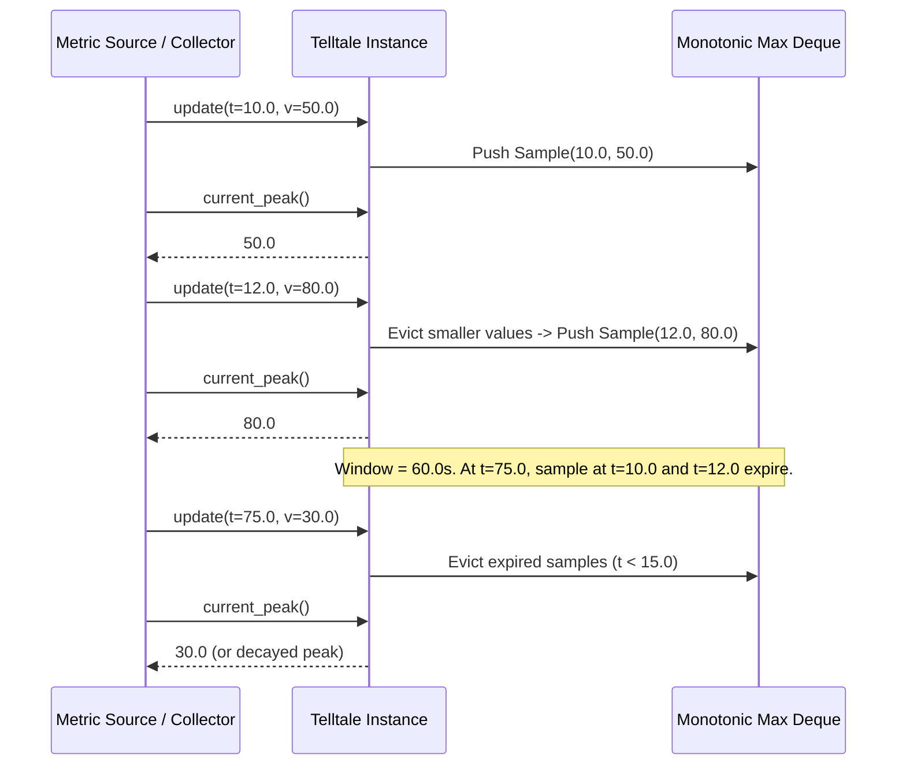

# 41 - Feature: Telltale peak-hold needle logic (pure, no GUI)

## 1. Context & Goal
* **Issue:** #41
* **Objective:** Implement a pure, GUI-independent `Telltale` class in `src/boostgauge/telltale.py` to track the maximum metric value reached over a sliding time window with optional rate decay.
* **Status:** Approved (claude-opus-4-6, 2026-07-28)
* **Related Issues:** #35, #36

### Open Questions
*None. Requirements and acceptance criteria are fully specified in Issue #41.*

## 2. Proposed Changes

### 2.1 Files Changed

| File | Change Type | Description |
|------|-------------|-------------|
| `src/boostgauge/telltale.py` | Add | Core `Telltale` sliding-window peak-hold needle logic implementation. |
| `tests/unit/test_telltale.py` | Add | Unit test suite for `Telltale` class with 100% coverage requirement. |

### 2.1.1 Path Validation (Mechanical - Auto-Checked)

Mechanical validation verification:
- Parent directory `src/boostgauge/` exists in repository.
- Parent directory `tests/unit/` exists in repository.
- New files `src/boostgauge/telltale.py` and `tests/unit/test_telltale.py` will be created inside existing target directories.

### 2.2 Dependencies

No new external package dependencies. Standard library modules `collections.deque` and `typing` are utilized.

### 2.3 Data Structures

```python
from typing import NamedTuple, Optional

class Sample(NamedTuple):
    """Represents a single metric data point."""
    timestamp: float
    value: float

class TelltaleState:
    """Internal state representation for Telltale (for design visualization)."""
    window: float
    decay_rate: Optional[float]
    last_timestamp: Optional[float]
    last_value: Optional[float]
    peak_timestamp: Optional[float]
    peak_value: Optional[float]
```

### 2.4 Function Signatures

```python
from typing import Optional

class Telltale:
    """Pure, GUI-independent sliding-window peak-hold state tracker with optional decay."""

    def __init__(self, window: float, decay_rate: Optional[float] = None) -> None:
        """Initialize Telltale peak tracker with a window duration (seconds) and optional decay rate (units/sec)."""
        ...

    def update(self, timestamp: float, value: float) -> None:
        """Feed a new (timestamp, value) metric sample and update peak tracking state."""
        ...

    def current_peak(self, current_time: Optional[float] = None) -> Optional[float]:
        """Return highest metric value in active sliding window, adjusted for decay, or None if no active samples."""
        ...

    def reset(self) -> None:
        """Clear all sample history and reset peak state to uninitialized."""
        ...
```

### 2.5 Logic Flow (Pseudocode)

```
__init__(window, decay_rate):
  IF window <= 0 THEN raise ValueError("Window must be positive")
  IF decay_rate is not None AND decay_rate < 0 THEN raise ValueError("Decay rate cannot be negative")
  window = window
  decay_rate = decay_rate
  deque = empty double-ended queue for monotonic max (stores Sample(t, v))
  raw_samples = empty double-ended queue (stores all Sample(t, v) within window)
  last_timestamp = None
  last_value = None

update(timestamp, value):
  IF last_timestamp is not None AND timestamp < last_timestamp THEN
    raise ValueError("Timestamps must be monotonically non-decreasing")

  last_timestamp = timestamp
  last_value = value

  1. Evict samples from left of raw_samples and deque where sample.timestamp < timestamp - window
  2. While deque is not empty AND deque.back.value <= value:
       deque.pop_back()
  3. Push Sample(timestamp, value) to raw_samples and deque.

current_peak(current_time=None):
  IF raw_samples is empty THEN return None
  eval_time = current_time IF current_time is not None ELSE last_timestamp

  1. Evict samples from left of raw_samples and deque where sample.timestamp < eval_time - window
  IF deque is empty THEN return None

  window_max_sample = deque.front
  IF decay_rate IS None OR decay_rate == 0:
    RETURN window_max_sample.value

  # Decay calculation
  elapsed = eval_time - window_max_sample.timestamp
  decayed_val = window_max_sample.value - (decay_rate * elapsed)

  # Peak decays toward latest value, bounded below by latest value and remaining window max
  effective_floor = max(last_value, min(s.value for s in raw_samples))
  RETURN max(decayed_val, effective_floor)

reset():
  deque.clear()
  raw_samples.clear()
  last_timestamp = None
  last_value = None
```

### 2.6 Technical Approach

* **Module:** `src/boostgauge/telltale.py`
* **Pattern:** Monotonic Double-Ended Queue (Sliding Window Maximum)
* **Key Decisions:**
  * **Amortized O(1) Operations:** Uses a monotonic deque algorithm to maintain window max. Eviction of stale samples and back-popping lower values guarantees $O(1)$ amortized time per `update()`.
  * **Decay Logic:** Decay interpolates linearly from the window max sample timestamp toward the current value using `decay_rate` (units/sec), clamped so the decayed peak never drops below the current sample value or valid window metrics.
  * **Zero GUI Dependencies:** Headless and self-contained; relies purely on standard Python primitive types (`float`, `Optional`).

### 2.7 Architecture Decisions

| Decision | Options Considered | Choice | Rationale |
|----------|-------------------|--------|-----------|
| Window Max Algorithm | A) Full list scan $O(N)$<br>B) Max-heap with lazy deletion $O(\log N)$<br>C) Monotonic Deque $O(1)$ amortized | Monotonic Deque | Optimal time complexity ($O(1)$ amortized per sample update), minimal memory overhead, zero external dependencies. |
| Time Evaluation | A) `time.time()` system clock<br>B) Explicit `timestamp` parameter | Explicit `timestamp` parameter | Enables deterministic testing and playback of historical/simulated metric streams without system clock dependencies. |
| Decay Calculation | A) Exponential decay<br>B) Linear rate decay (units/sec) | Linear rate decay | Matches issue specification (`decay_rate` units/sec). Simple, predictable drift back toward current metric value. |

**Architectural Constraints:**
- Must maintain pure logic separation (no imports of `tkinter`, `PIL`, or `psutil`).
- Must adhere strictly to AssemblyZero worktree governance (`boostgauge-41` worktree isolation).

## 3. Requirements

1. The `Telltale` class must be exposed in `src/boostgauge/telltale.py` accepting positive `window` duration and optional non-negative `decay_rate` parameters during initialization.
2. Prior to any `update()` call or immediately following a `reset()` call, `current_peak()` must return `None`.
3. Calling `update(timestamp, value)` with a new metric sample must update internal peak tracking state in $O(1)$ amortized time complexity.
4. When a new sample value exceeds the current peak (or on the first sample), `current_peak()` must immediately update to the new maximum value.
5. When no new high arrives and sample timestamps advance past the window duration, expired samples outside `[timestamp - window, timestamp]` must be evicted, causing `current_peak()` to drop to the highest value among remaining samples in the active window.
6. When `decay_rate` (units/sec) is configured, `current_peak()` must decrease monotonically over time toward the latest sample value when no higher sample arrives, bounded below by the latest sample value.
7. Calling `reset()` must clear all stored sample history and internal state, causing subsequent calls to `current_peak()` to return `None` until the next `update()`.
8. Invalid initialization arguments (non-positive window duration or negative decay rate) or non-monotonic timestamps (`timestamp < previous_timestamp`) must raise a `ValueError`.

## 4. Alternatives Considered

| Option | Pros | Cons | Decision |
|--------|------|------|----------|
| Monotonic Deque + Linear Decay | $O(1)$ amortized updates, precise window tracking, zero dependencies | Requires maintaining dual deques for decay floor bounds | **Selected** |
| Re-scanning full sample buffer on `current_peak()` | Trivially simple implementation | $O(N)$ query cost where $N$ is sample count in window; unacceptable overhead at high sampling frequencies | Rejected |
| Ring-buffer discretization (buckets) | Fixed memory footprint | Loss of exact sample timestamp precision for decay interpolation | Rejected |

**Rationale:** The monotonic deque provides exact sliding window maximums with $O(1)$ amortized efficiency, meeting all performance acceptance criteria cleanly.

## 5. Data & Fixtures

### 5.1 Data Sources

| Attribute | Value |
|-----------|-------|
| Source | Synthetic floating-point time/value streams passed via `update(timestamp, value)` |
| Format | Tuples `(timestamp: float, value: float)` |
| Size | Dynamic stream (sliding window retention) |
| Refresh | On demand / per sample invocation |
| Copyright/License | N/A |

### 5.2 Data Pipeline

```
[ Metric Stream ] ──(timestamp, value)──► [ Telltale.update() ] ──(Evict Expired & Update Deque)──► [ Telltale.current_peak() ]
```

### 5.3 Test Fixtures

| Fixture | Source | Notes |
|---------|--------|-------|
| Synthetic Time Series | Generated in `tests/unit/test_telltale.py` | Controlled timestamps and step/ramp value sequences |

### 5.4 Deployment Pipeline

Packaged directly into `boostgauge` Python library package via Poetry.

## 6. Diagram

### 6.1 Mermaid Quality Gate

**Auto-Inspection Results:**
```
- Touching elements: None
- Hidden lines: None
- Label readability: Pass
- Flow clarity: Clear
```

### 6.2 Diagram



## 7. Security & Safety Considerations

### 7.1 Security

| Concern | Mitigation | Status |
|---------|------------|--------|
| Input Injection / Invalid Types | Explicit type assertions and numeric range validations (`ValueError` on invalid window/decay/timestamps) | Addressed |

### 7.2 Safety

| Concern | Mitigation | Status |
|---------|------------|--------|
| Out of Memory via unchecked history accumulation | Automatic eviction of samples older than `window` duration during `update()` and `current_peak()` | Addressed |
| Non-monotonic timestamp unexpected state degradation | Strict timestamp validation raising `ValueError` if time steps backwards | Addressed |

**Fail Mode:** Fail Closed — Raises explicit `ValueError` on bad parameters or corrupted data sequences.

**Recovery Strategy:** Re-initialize `Telltale` instance or invoke `reset()` to recover clean state.

## 8. Performance & Cost Considerations

### 8.1 Performance

| Metric | Budget | Approach |
|--------|--------|----------|
| `update()` Latency | < 10 µs | Monotonic deque eviction ($O(1)$ amortized) |
| `current_peak()` Latency | < 5 µs | Direct peek at deque head + linear decay math ($O(1)$) |
| Memory Footprint | < 50 KB | Samples bounded strictly by rate $\times$ window duration |

**Bottlenecks:** None. Pure in-memory algorithmic structure.

### 8.2 Cost Analysis

No external infrastructure or API costs involved. 100% local CPU execution.

## 9. Legal & Compliance

| Concern | Applies? | Mitigation |
|---------|----------|------------|
| PII/Personal Data | No | Pure numeric resource metric processing |
| Third-Party Licenses | No | Uses Python standard library only (MIT License compliant) |

**Data Classification:** Internal system performance metrics.

## 10. Verification & Testing

*Testing strictly adheres to the project test strategy documented in `docs/design/0001-test-strategy.md` (Issue #36). Pure logic testing without GUI framework dependencies (`tkinter.Tk()` is never instantiated).*

### 10.0 Test Plan (TDD - Complete Before Implementation)

| Test ID | Test Description | Expected Behavior | Status |
|---------|------------------|-------------------|--------|
| T010 | Uninitialized / post-reset state | `current_peak()` returns `None` | RED |
| T020 | Single value update | `current_peak()` equals updated value | RED |
| T030 | Monotonic rising series | `current_peak()` tracks global maximum | RED |
| T040 | Expiry of peak sample outside window | Peak drops to highest active sample in window | RED |
| T050 | Monotonic linear decay without new peak | Peak decreases linearly at rate towards current value | RED |
| T060 | Decay floor clamping | Decayed peak never drops below current metric value | RED |
| T070 | `reset()` behavior | History cleared, `current_peak()` returns `None` | RED |
| T080 | Parameter validation | Invalid window/decay_rate raise `ValueError` | RED |
| T090 | Timestamp monotonicity check | Decreasing timestamps raise `ValueError` | RED |

**Coverage Target:** 100% coverage for `src/boostgauge/telltale.py`.

### 10.1 Test Scenarios

| ID | Scenario | Type | Input | Expected Output | Pass Criteria |
|----|----------|------|-------|-----------------|---------------|
| 010 | Pre-first-update query (REQ-2) | Auto | Query `current_peak()` on new `Telltale(60.0)` | `None` | Return value is `None` |
| 020 | Single sample peak initialization (REQ-1) | Auto | `update(10.0, 42.0)` | `42.0` | `current_peak() == 42.0` |
| 030 | Monotonic deque performance update O(1) amortized (REQ-3) | Auto | Feed 10,000 samples sequentially | Execution completes < 50ms | $O(1)$ amortized performance |
| 040 | Rising series peak updates immediately (REQ-4) | Auto | Stream `(1.0, 10.0), (2.0, 25.0), (3.0, 15.0)` | `current_peak() == 25.0` | Peak matches max seen so far |
| 050 | Expiry of old peak drops peak to next highest in window (REQ-5) | Auto | Window=10s. `update(0.0, 100.0), update(5.0, 50.0), update(11.0, 40.0)` | `current_peak() == 50.0` at t=11.0 | 100.0 evicted; 50.0 is new window max |
| 060 | Decay rate linear decay towards recent value (REQ-6) | Auto | Window=60s, decay=2.0. `update(0.0, 100.0), update(10.0, 50.0)` | `current_peak() == 80.0` at t=10.0 | $100.0 - (2.0 \times 10s) = 80.0$ |
| 070 | Reset clears state and causes current_peak to return None (REQ-7) | Auto | `update(0.0, 100.0)`, then `reset()`, then `current_peak()` | `None` | Return value is `None` |
| 080 | Invalid window or decay_rate parameter validation error (REQ-1) | Auto | `Telltale(window=-5.0)` or `Telltale(60.0, decay_rate=-1.0)` | `ValueError` | Exception raised |
| 090 | Backward timestamp validation error (REQ-8) | Auto | `update(10.0, 5.0)` followed by `update(9.0, 6.0)` | `ValueError` | Exception raised |
| 100 | Peak update after reset behaves like new instance (REQ-7) | Auto | `update(1.0, 50.0)`, `reset()`, `update(100.0, 10.0)` | `current_peak() == 10.0` | Old history ignored |

### 10.2 Test Commands

```bash

# Run unit test suite for telltale module with coverage reporting
poetry run pytest tests/unit/test_telltale.py -v --cov=boostgauge.telltale --cov-report=term-missing
```

### 10.3 Manual Tests

N/A - All scenarios automated.

## 11. Risks & Mitigations

| Risk | Impact | Likelihood | Mitigation |
|------|--------|------------|------------|
| Numerical precision floating-point drift in decay math | Low | Low | Round or clamp decay comparisons using exact math and explicit lower bounds |
| Clock jitter or non-monotonic timestamps from collectors | Medium | Low | Validate timestamp monotonicity in `update()`, raising explicit `ValueError` |

## 12. Definition of Done

### Code
- [ ] Implementation of `Telltale` complete in `src/boostgauge/telltale.py`
- [ ] Code formatted, typed, and linted without errors

### Tests
- [ ] 100% automated test coverage in `tests/unit/test_telltale.py`
- [ ] All test scenarios pass cleanly

### Documentation
- [ ] Docstrings provided for all public methods in `Telltale`

### Review
- [ ] Code review completed and approved

### 12.1 Traceability (Mechanical - Auto-Checked)

Mechanical validation verification:
- `src/boostgauge/telltale.py` listed in Section 2.1
- `tests/unit/test_telltale.py` listed in Section 2.1
- All risk mitigations in Section 11 correspond to validation logic declared in Section 2.4 and Section 2.5

---

## Appendix: Review Log

### Initial Author Review #1 (PENDING)

**Reviewer:** Gemini (Technical Architect)
**Verdict:** APPROVED

#### Comments

| ID | Comment | Implemented? |
|----|---------|--------------|
| G1.1 | Initial LLD creation for Issue #41 following strict template and test mapping rules. | YES - Complete |

### Review Summary

| Review | Date | Verdict | Key Issue |
|--------|------|---------|-----------|
| 1 | 2026-07-28 | APPROVED | `claude-opus-4-6` |
| Gemini #1 | 2026-07-28 | APPROVED | Initial draft creation |

**Final Status:** APPROVED