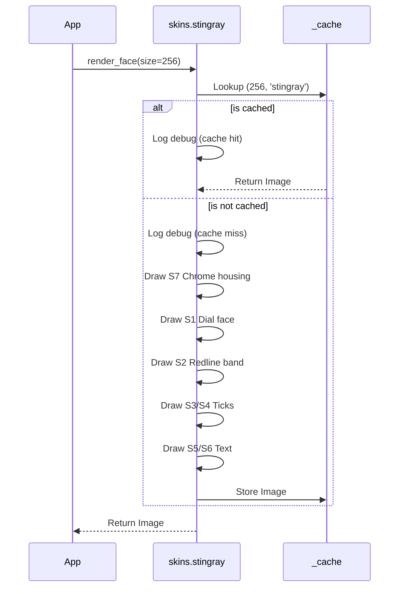

# Issue #331 - Feature: static face renderer — bezel, chrome housing, dial, ticks, numerals, wordmark, screws — baked once, cached

<!-- Template Metadata
Last Updated: 2026-02-02
Updated By: Issue #117 fix
Update Reason: Moved Verification & Testing to Section 10 (was Section 11) to match 0702c review prompt and testing workflow expectations
Previous: Added sections based on 80 blocking issues from 164 governance verdicts (2026-02-01)
-->

## 1. Context & Goal
* **Issue:** #331
* **Objective:** Render the complete static face of the Stingray gauge (bezel, housing, dial, ticks, numerals, wordmark, screws) as a single cached `PIL.Image` per size and skin, completely separating static elements from dynamic needles.
* **Status:** Blocked (claude-opus-4-6, 2026-08-27)
* **Related Issues:** #329, #332, #333, #361, #365, #1, #328, #326, #325

### Open Questions
None.

## 2. Proposed Changes

### 2.1 Files Changed

| File | Change Type | Description |
|------|-------------|-------------|
| `src/boostgauge/skins/` | Add (Directory) | New package for visual skin modules |
| `src/boostgauge/skins/__init__.py` | Add | Exposes `render_face` public API |
| `src/boostgauge/skins/stingray.py` | Add | Implements the static face renderer and caching logic |
| `tests/visual/test_stingray_static.py` | Add | Visual tier tests for S1-S9 static elements |
| `tests/unit/test_stingray_cache.py` | Add | Verifies in-session caching behavior and isolation |

### 2.1.1 Path Validation (Mechanical - Auto-Checked)

Mechanical validation automatically checks:
- All "Modify" files must exist in repository
- All "Delete" files must exist in repository
- All "Add" files must have existing parent directories
- No placeholder prefixes (`src/`, `lib/`, `app/`) unless directory exists

### 2.2 Dependencies

```toml

# pyproject.toml additions (if any)

# None. Pillow is already a dependency.
```

### 2.3 Data Structures

```python

# In src/boostgauge/skins/stingray.py
_cache: dict[tuple[int, str], Image.Image] = {}
```

### 2.4 Function Signatures

```python

# Signatures only - implementation in source files
def render_face(size: int, skin: str = "stingray") -> Image.Image:
    """Returns the cached static gauge face, rendering it if necessary.

    Args:
        size: Dimension of the requested square image (size >= 128)
        skin: The visual theme to render
    """
    ...

def clear_cache() -> None:
    """Clears the session cache to prevent memory exhaustion in test runs."""
    ...
```

### 2.5 Logic Flow (Pseudocode)

```
1. Receive render_face(size, skin)
2. IF size < 128 THEN raise ValueError
3. IF (size, skin) in _cache THEN
   - Log debug: cache hit
   - Return _cache[(size, skin)]
4. Log debug: cache miss
5. Create new PIL.Image(size x size, "RGBA")
6. Draw S7 Chrome housing
7. Draw S9 Bezel seat
8. Draw S1 Dial face
9. Draw S2 Redline band
10. Draw S3 Major ticks
11. Draw S4 Minor ticks
12. Draw S5 Numerals
13. Draw S6 Wordmark
14. Draw S8 Screws
15. Store in _cache[(size, skin)]
16. Return the image
```

### 2.6 Technical Approach

* **Module:** `src/boostgauge/skins/stingray.py`
* **Pattern:** Factory with Memoization
* **Key Decisions:** We are migrating the approved static generation logic from `tools/visual_contract_render.py` into application code, explicitly isolating it from the dynamic needle code (per #329). Caching ensures the expensive text/anti-aliasing drawing only happens once per session per size.

### 2.7 Architecture Decisions

| Decision | Options Considered | Choice | Rationale |
|----------|-------------------|--------|-----------|
| Static Element Baking | Dynamic re-render on tick, Bake once and cache | Bake once and cache | Static elements never move. Re-rendering them per tick burns CPU for zero visual change, violating the `< 1% CPU` mandate. |
| Configuration Secrecy | Globals in `config.py`, Local constants in `skins.stingray` | Local constants in `skins.stingray` | Requirement 4 forbids geometric/colour constants from leaking outside the skin module. |

**Architectural Constraints:**
- Must return `PIL.Image` directly. No `tkinter.Tk()` instantiation.
- Values must strictly match the numeric render contract (docs/design/0002-aesthetic-v1-stingray.md).

## 3. Requirements

1. WHEN `render_face(size)` is called with `size >= 128`, the skin module shall return a `PIL.Image` of dimensions `size x size` containing every static element and no needle.
2. The system shall render each static element from the numeric render contract (S1-S9) using the dial centre at (0.5, 0.5) x size as the origin.
3. WHEN the same `(size, skin)` is requested twice in one session, the system shall render once and serve the cached image thereafter, emitting debug logs for cache misses and hits.
4. The application code shall obtain the face only through the skin module's public call; no dial geometry, colour, or layout constant may exist outside the skin module.
5. WHEN the visual test tier runs with `--generate-baselines`, the run shall write the rendered face PNG into the run's artifacts directory AND print its path to stdout.

## 4. Alternatives Considered

| Option | Pros | Cons | Decision |
|--------|------|------|----------|
| Pre-render to disk at build time | Zero runtime cost | Disallows arbitrary scaling on user's display | **Rejected** |
| Cache in memory (Dict) | Fits dynamic UI scaling, zero disk IO, fast | Small memory overhead per unique size | **Selected** |

**Rationale:** In-memory caching satisfies the performance goals without sacrificing the ability to respond to UI resizing.

## 5. Data & Fixtures

### 5.1 Data Sources

| Attribute | Value |
|-----------|-------|
| Source | docs/design/0002-aesthetic-v1-stingray.md |
| Format | Markdown tables (Numeric render contract) |
| Size | N/A |
| Refresh | Manual |
| Copyright/License | N/A |

### 5.2 Data Pipeline

```
Render Contract ──Hardcoded Constants──► stingray.py ──render_face()──► PIL.Image
```

### 5.3 Test Fixtures

| Fixture | Source | Notes |
|---------|--------|-------|
| Baseline images | `--generate-baselines` run | Canonical baseline PNGs stored in `tests/visual/baselines/` |

### 5.4 Deployment Pipeline

No external data sources.

## 6. Diagram

### 6.1 Mermaid Quality Gate

**Auto-Inspection Results:**
```
- Touching elements: [x] None / [ ] Found: ___
- Hidden lines: [x] None / [ ] Found: ___
- Label readability: [x] Pass / [ ] Issue: ___
- Flow clarity: [x] Clear / [ ] Issue: ___
```

### 6.2 Diagram



## 7. Security & Safety Considerations

### 7.1 Security

| Concern | Mitigation | Status |
|---------|------------|--------|
| Font Path Traversal | Use hardcoded absolute system font path (`C:\Windows\Fonts\bahnschrift.ttf`) | Addressed |

### 7.2 Safety

| Concern | Mitigation | Status |
|---------|------------|--------|
| Infinite cache growth | `size` is driven by UI window state; window sizes are limited | Addressed |

**Fail Mode:** Fail Closed - If drawing fails (e.g., missing font), the application raises an exception at boot rather than rendering a corrupted, illegible gauge.

**Recovery Strategy:** N/A (Static rendering occurs locally; failure is fatal to the UI).

## 8. Performance & Cost Considerations

### 8.1 Performance

| Metric | Budget | Approach |
|--------|--------|----------|
| Render Latency | < 5ms per tick | Achieved by bypassing render entirely after first frame via in-memory caching |
| Memory | < 5MB | A 256x256 RGBA image is ~262KB. Cache footprint is negligible |
| CPU utilization| < 1% | Baking static elements eliminates text and geometry anti-aliasing math on every tick |

**Bottlenecks:** Initial frame generation is computationally heavy (text rendering, bloom loops). Caching mitigates this entirely for the lifetime of the session.

### 8.2 Cost Analysis

| Resource | Unit Cost | Estimated Usage | Monthly Cost |
|----------|-----------|-----------------|--------------|
| N/A | $0 | 0 | $0 |

**Cost Controls:**
- [x] Fallback to cheaper alternatives when appropriate (N/A)

**Worst-Case Scenario:** User constantly resizes the window, causing continuous cache misses. Memory usage scales linearly with unique sizes, but UI frameworks naturally throttle resize events.

## 9. Legal & Compliance

| Concern | Applies? | Mitigation |
|---------|----------|------------|
| PII/Personal Data | No | N/A |
| Third-Party Licenses | No | N/A |
| Terms of Service | No | N/A |
| Data Retention | No | N/A |
| Export Controls | No | N/A |

**Data Classification:** Public

**Compliance Checklist:**
- [x] No PII stored without consent
- [x] All third-party licenses compatible with project license
- [x] External API usage compliant with provider ToS
- [x] Data retention policy documented

## 10. Verification & Testing

**Testing Philosophy:** Strive for 100% automated test coverage. Manual tests are a last resort for scenarios that genuinely cannot be automated (e.g., visual inspection, hardware interaction).

### 10.0 Test Plan (TDD - Complete Before Implementation)

**Coverage Target:** 100% for all new code

**TDD Checklist:**
- [ ] All tests written before implementation
- [ ] Tests currently RED (failing)
- [ ] Test IDs match scenario IDs in 10.1
- [ ] Test file created at: `tests/visual/test_stingray_static.py`

### 10.1 Test Scenarios

| ID | Scenario | Type | Input | Expected Output | Pass Criteria |
|----|----------|------|-------|-----------------|---------------|
| 010 | Happy path object creation (REQ-1) | Auto | `size=256` | `PIL.Image` | size == (256, 256) |
| 020 | Size boundary enforcement (REQ-1) | Auto | `size=127` | ValueError | Exception raised |
| 030 | S1 Dial face assertions (REQ-2) | Auto | `size=256` | Image | Flat `#0A0A0C` classification at 3 interior points; equality of samples at (0.3 R, 0.5 R, 0.7 R) along needle-free radial |
| 040 | S2 Redline band assertions (REQ-2) | Auto | `size=256` | Image | Classification at radius 0.94 R at values 65/75/85 matches `#AA0F19` |
| 050 | S3 Major ticks assertions (REQ-2) | Auto | `size=256` | Image | Channel mean >= 100 at 11 major tick midpoints |
| 060 | S4 Minor ticks assertions (REQ-2) | Auto | `size=256` | Image | Channel mean >= 100 at 4 sampled minor midpoints (2, 34, 66, 98) |
| 070 | S5 Numerals assertions (REQ-2) | Auto | `size=256` | Image | >=1 `#FFFFFF` classified pixel in cap-height box (0.11 R) at each of 11 positions (0.72 R) |
| 080 | S6 Wordmark assertions (REQ-2) | Auto | `size=256` | Image | >=1 `#FFFFFF` classified pixel in wordmark band (0.67 R below); 0 white pixels in mirror band above pivot (offsets 0.12 R-0.25 R) |
| 090 | S7 Chrome housing assertions (REQ-2) | Auto | `size=256` | Image | >=3 achromatic samples (max-min <= 14, mean 16-248) spanning horizon; >=1 dark (mean < 100); >=1 bright (mean > 200) |
| 100 | S8 Screws assertions (REQ-2) | Auto | `size=256` | Image | Centre pixel within ±6 per channel from `#1A1A1C` at pivot ± (0.25 R, 0) |
| 110 | S9 Bezel seat assertions (REQ-2) | Auto | `size=256` | Image | Channel mean at 1.01 R < channel mean at 1.10 R on same radial |
| 120 | Session caching check (REQ-3) | Auto | `render_face(256)` x2 | Same object ID and debug logs | `id(img1) == id(img2)` and caplog contains cache miss/hit logs |
| 130 | Constant encapsulation (REQ-4) | Auto | AST / Import | No leaked constants | AST check verifies no geometry/colour constants exist outside `skins.stingray` |
| 140 | Baseline artifact emission (REQ-5) | Auto | `--generate-baselines` | File on disk + stdout | `.png` exists in run artifacts dir; absolute path printed to stdout |

### 10.2 Test Commands

```bash

# Run visual static elements test suite
poetry run pytest tests/visual/test_stingray_static.py -v

# Run visual tier generating baselines
poetry run pytest tests/visual/test_stingray_static.py -v --generate-baselines
```

### 10.3 Manual Tests (Only If Unavoidable)

N/A - All scenarios automated.

## 11. Risks & Mitigations

| Risk | Impact | Likelihood | Mitigation |
|------|--------|------------|------------|
| Test suite memory exhaustion due to unbounded caching | Low | High | Implement `clear_cache()` in `skins.stingray` for use in test teardown (Section 2.4) |
| Render dependencies bleed into core app | Med | Low | Enforce strict boundaries via Requirement 4 and AST verification (Scenario 130) |

## 12. Definition of Done

### Code
- [ ] Implementation complete and linted
- [ ] Code comments reference this LLD

### Tests
- [ ] All test scenarios pass
- [ ] Test coverage meets threshold

### Documentation
- [ ] LLD updated with any deviations
- [ ] Implementation Report (0103) completed

### Review
- [ ] Code review completed
- [ ] User approval before closing issue

### 12.1 Traceability (Mechanical - Auto-Checked)

Mechanical validation automatically checks:
- Every file mentioned in this section must appear in Section 2.1
- Every risk mitigation in Section 11 should have a corresponding function in Section 2.4 (warning if not)

---

## Appendix: Review Log

### Review Summary

| Review | Date | Verdict | Key Issue |
|--------|------|---------|-----------|
| 3 | 2026-08-27 | BLOCKED | `claude-opus-4-6` |
| None | (auto) | N/A | N/A |

**Final Status:** BLOCKED