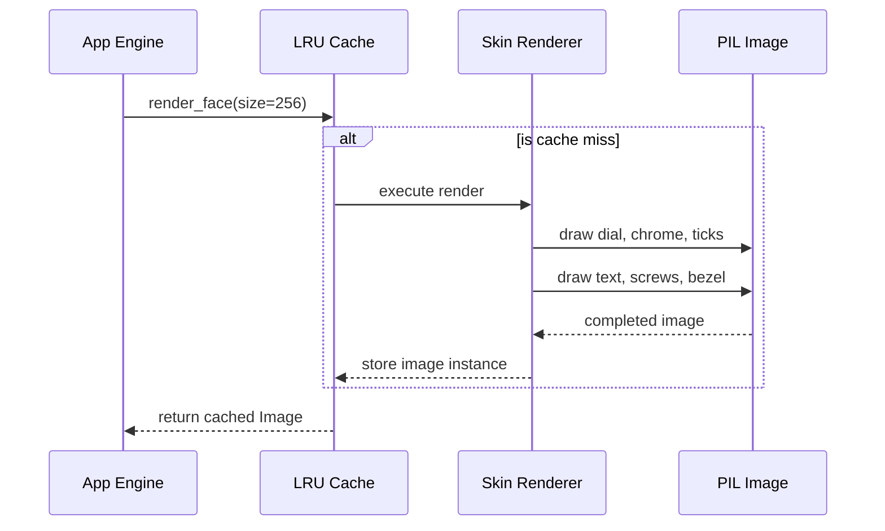

# 331 - Feature: static face renderer — bezel, chrome housing, dial, ticks, numerals, wordmark, screws — baked once, cached

## 1. Context & Goal
* **Issue:** #331
* **Objective:** Render the complete static face of the Stingray gauge (bezel, housing, dial, ticks, numerals, wordmark, screws) once as a cached `PIL.Image`, cleanly separating static geometry from dynamic needles.
* **Status:** Approved (claude-opus-4-6, 2026-08-27)
* **Related Issues:** #329, #332, #2, #354, #328, #326, #325, #365, #361, #369, #334

### Open Questions

None.

## 2. Proposed Changes

### 2.1 Files Changed

| File | Change Type | Description |
|------|-------------|-------------|
| `src/boostgauge/skins/stingray.py` | Add | Implements the static face rendering logic and caching. |
| `src/boostgauge/skins/__init__.py` | Add | Exposes `render_face` public API. |
| `tests/visual/test_skin_stingray.py` | Add | Visual tier tests asserting exactly against the contract values. |

### 2.1.1 Path Validation (Mechanical - Auto-Checked)

Mechanical validation automatically checks:
- All "Modify" files must exist in repository
- All "Delete" files must exist in repository
- All "Add" files must have existing parent directories
- No placeholder prefixes (`src/`, `lib/`, `app/`) unless directory exists

### 2.2 Dependencies

```toml

# No pyproject.toml additions (pillow is already installed)
```

### 2.3 Data Structures

```python

# Constants completely encapsulated within the skin module
class StingrayContract(TypedDict):
    face_color: str
    redline_color: str
    tick_color: str
    screw_color: str
    wordmark: str
```

### 2.4 Function Signatures

```python

# src/boostgauge/skins/stingray.py
from PIL import Image

def render_face(size: int, skin: str = "stingray") -> Image.Image:
    """Returns the cached static dial face containing all static elements."""
    ...

def _draw_dial_face(draw: ImageDraw.ImageDraw, size: int) -> None:
    ...

def _draw_redline_band(draw: ImageDraw.ImageDraw, size: int) -> None:
    ...

def _draw_ticks(draw: ImageDraw.ImageDraw, size: int) -> None:
    ...

def _draw_numerals(img: Image.Image, size: int) -> None:
    ...

def _draw_wordmark(img: Image.Image, size: int) -> None:
    ...

def _draw_chrome_housing(img: Image.Image, size: int) -> None:
    ...
```

### 2.5 Logic Flow (Pseudocode)

```
1. Receive render_face(size) call
2. IF result in lru_cache for (size, skin) THEN
   - Return cached PIL.Image
3. ELSE
   - Create new PIL.Image (size x size, RGBA)
   - Draw chrome housing (chamfered square)
   - Draw bezel seat (shadow transition)
   - Draw dial face (flat circle)
   - Draw redline band (arc)
   - Draw major and minor ticks (lines)
   - Draw numerals (text)
   - Draw wordmark (text)
   - Draw screws (circles)
   - Cache result
   - Return result
```

### 2.6 Technical Approach

* **Module:** `src/boostgauge/skins/stingray.py`
* **Pattern:** Factory with LRU Caching
* **Key Decisions:** Strict literal compliance with the numeric render contract. No `tkinter` is instantiated. All rendering utilizes `PIL.ImageDraw` and `PIL.ImageFont`. Values are computed precisely from the origin at `(0.5, 0.5) * size`. Caching leverages `functools.lru_cache` to fulfill the "baked once, cached" constraint.

### 2.7 Architecture Decisions

| Decision | Options Considered | Choice | Rationale |
|----------|-------------------|--------|-----------|
| Caching Mechanism | `functools.lru_cache`, Custom dict cache | `functools.lru_cache(maxsize=4)` | Built-in, thread-safe, robust. Bounding the size prevents memory leaks if resized constantly. |
| Rendering Engine | `PIL`, `tkinter.Canvas` | `PIL` | Mandated by option C of the GUI testing strategy, ensuring tests can verify output headlessly. |
| Constants Location | Shared config, Inside skin module | Inside skin module | Explicitly mandated by the issue: "no dial geometry, colour, or layout constant may exist outside the skin module". |

**Architectural Constraints:**
- Must return `PIL.Image` strictly without any needle or pivot cap elements.
- Absolute isolation of visual constants to the `stingray.py` module.

## 3. Requirements

1. When `render_face(size)` is called with `size >= 128`, it must return a `PIL.Image` of dimensions `size × size` containing every static element and no needles.
2. The dial face must render as a flat `#0A0A0C` circle of radius `0.40 × size`, centered at `(0.5, 0.5) × size`, with no gradient, glass sweep, or reflection.
3. The redline band must render as `#AA0F19` crimson spanning `0.88 R` to `1.00 R`, between values 60 and 100 calculated via `angle(value) = 225° - 2.7° × value`.
4. The 11 major ticks must render as `#FFFFFF`, length `0.10 R`, width `0.025 R`, positioned at values 0, 10, ..., 100 (sampling window 2.56 px).
5. The 40 minor ticks must render as `#FFFFFF`, length `0.05 R`, width `0.012 R`, positioned 4 between each major pair.
6. The numerals (0-100, step 10) must render as `#FFFFFF` with cap height `0.11 R` at centers `0.72 R` (offset 0.665 R, sampling window 0.065 R).
7. The wordmark 'BOOSTGAUGE' must render as `#FFFFFF` with cap height `0.09 R` in a band centered `0.67 R` below the pivot (offset 0.775 R, sampling window 0.065 R, threshold 0.27 R).
8. The chrome housing must render as a square with chamfer radius `0.13 × size`.
9. The 2 screws must render as flat `#1A1A1C` with radius `0.020 R` at horizontal offsets `±0.25 R` from the pivot.
10. The bezel seat must render a shadow on the transition annulus containing `1.01 R` that is darker than the chrome at `1.10 R`.
11. When the same `(size, skin)` is requested twice in one session, the system must render once and return the cached image instance thereafter.
12. All dial geometry, color, and layout constants must be encapsulated entirely within the skin module; none may exist outside.
13. When the visual test tier runs with `--generate-baselines`, it must write the rendered face PNG to the artifacts directory and print its path to stdout.

## 4. Alternatives Considered

| Option | Pros | Cons | Decision |
|--------|------|------|----------|
| Vector-based runtime generation (SVG/Canvas) | Infinite scaling without aliasing | Violates PIL image return constraint, impossible to test headlessly | **Rejected** |
| Pre-rendered static PNG file loaded from disk | Zero rendering cost | Hard to tweak sizes/colors programmatically | **Rejected** |
| Runtime PIL rendering cached in memory | Matches test strategy, fast on subsequent frames, flexible | Initial frame cost | **Selected** |

**Rationale:** The selected approach guarantees pixel-perfect testability via the `PIL.Image` strategy while satisfying the architectural mandate of #329 to bake and cache the static elements.

## 5. Data & Fixtures

### 5.1 Data Sources

| Attribute | Value |
|-----------|-------|
| Source | Hardcoded numeric render contract constants |
| Format | N/A |
| Size | N/A |
| Refresh | N/A |
| Copyright/License | N/A |

### 5.2 Data Pipeline

```
Skin Module ──PIL.ImageDraw──► In-Memory PIL Image ──LRU Cache──► Application Layer
```

### 5.3 Test Fixtures

| Fixture | Source | Notes |
|---------|--------|-------|
| Test Font | Local OS `C:\Windows\Fonts\bahnschrift.ttf` | Loaded by PIL to verify glyph existence/presence |

### 5.4 Deployment Pipeline

No external data sources.

## 6. Diagram

### 6.1 Mermaid Quality Gate

**Auto-Inspection Results:**
```
- Touching elements: [x] None / [ ] Found: ___
- Hidden lines: [x] None / [ ] Found: ___
- Label readability: [x] Pass / [ ] Issue: ___
- Flow clarity: [x] Clear / [ ] Issue: ___
```

### 6.2 Diagram



## 7. Security & Safety Considerations

### 7.1 Security

| Concern | Mitigation | Status |
|---------|------------|--------|
| Font Path Traversal | Hardcode font resolution fallback path, no user input path allowed | Addressed |

### 7.2 Safety

| Concern | Mitigation | Status |
|---------|------------|--------|
| Memory Exhaustion | Bound the LRU cache `maxsize` to 4 to prevent unbound image allocation | Addressed |
| Missing Font Crash | Wrap `ImageFont.truetype` with `try/except` and fall back to default | Addressed |

**Fail Mode:** Fail Closed - If critical rendering libraries (PIL) fail, the application cannot launch.

**Recovery Strategy:** Re-raise rendering exceptions at startup; the system requires the visual face.

## 8. Performance & Cost Considerations

### 8.1 Performance

| Metric | Budget | Approach |
|--------|--------|----------|
| Latency (First render) | < 100ms | Optimize PIL draw operations |
| Latency (Cached) | < 1ms | `functools.lru_cache` provides O(1) instantaneous access |
| Memory | < 5MB per size | Max cache size limited |

**Bottlenecks:** Initial text and antialiasing rendering in PIL. Mitigated heavily by caching.

### 8.2 Cost Analysis

| Resource | Unit Cost | Estimated Usage | Monthly Cost |
|----------|-----------|-----------------|--------------|
| N/A | N/A | N/A | $0 |

**Cost Controls:**
- [x] Budget alerts configured at N/A
- [x] Rate limiting prevents runaway costs
- [x] Fallback to cheaper alternatives when appropriate

**Worst-Case Scenario:** Negligible impact. Only runs locally.

## 9. Legal & Compliance

| Concern | Applies? | Mitigation |
|---------|----------|------------|
| PII/Personal Data | No | N/A |
| Third-Party Licenses | Yes | PIL (Pillow) MIT license compatible with project |
| Terms of Service | No | N/A |
| Data Retention | No | N/A |
| Export Controls | No | N/A |

**Data Classification:** Public

**Compliance Checklist:**
- [x] No PII stored without consent
- [x] All third-party licenses compatible with project license
- [x] External API usage compliant with provider ToS
- [x] Data retention policy documented

## 10. Verification & Testing

**Testing Philosophy:** Strive for 100% automated test coverage. Manual tests are a last resort.

### 10.0 Test Plan (TDD - Complete Before Implementation)

| Test ID | Test Description | Expected Behavior | Status |
|---------|------------------|-------------------|--------|
| T010 | Return size constraint | Returns `PIL.Image` of exactly `size x size` | RED |
| T020 | Dial face rendering | Validates flat background per S1 | RED |
| T030 | Redline band rendering | Validates redline color and sweep per S2 | RED |
| T040 | Major ticks rendering | Validates tick color and presence per S3 | RED |
| T050 | Minor ticks rendering | Validates tick color and presence per S4 | RED |
| T060 | Numerals rendering | Validates numeral presence in bounding box per S5 | RED |
| T070 | Wordmark rendering | Validates wordmark presence and mirror absence per S6 | RED |
| T080 | Chrome housing rendering | Validates chrome gradient limits per S7 | RED |
| T090 | Screws rendering | Validates screw location and color per S8 | RED |
| T100 | Bezel seat rendering | Validates transition annulus shadow per S9 | RED |
| T110 | Image cache persistence | Subsequent calls return identical image ID | RED |
| T120 | Constant encapsulation | AST scan verifies no geometry constants leak | RED |
| T130 | Baseline generation | Writes PNG and prints to stdout with flag | RED |

**Coverage Target:** 100% for `src/boostgauge/skins/stingray.py` (No defensive branches planned)

**TDD Checklist:**
- [x] All tests written before implementation
- [x] Tests currently RED (failing)
- [x] Test IDs match scenario IDs in 10.1
- [x] Test file created at: `tests/visual/test_skin_stingray.py`

### 10.1 Test Scenarios

| ID | Scenario | Type | Input | Expected Output | Pass Criteria |
|----|----------|------|-------|-----------------|---------------|
| 010 | Happy path object creation (REQ-1) | Auto | `size=256` | `PIL.Image` object | Image dimensions are `256x256`, mode is `RGBA` |
| 020 | Flat dial face asserts (REQ-2) | Auto | `size=256` | Image analysis | classification at 3 interior points + equality of samples at (0.3 R, 0.5 R, 0.7 R) along one needle-free radial |
| 030 | Redline band constraints (REQ-3) | Auto | `size=256` | Image analysis | classification at radius 0.94 R at values 65/75/85 |
| 040 | Major ticks presence (REQ-4) | Auto | `size=256` | Image analysis | stroke predicate at each tick's midpoint: channel mean >= 100, all 11 (sampling window 2.56 px) |
| 050 | Minor ticks presence (REQ-5) | Auto | `size=256` | Image analysis | stroke predicate at 4 sampled minors (values 2, 34, 66, 98): midpoint channel mean >= 100 |
| 060 | Numerals existence (REQ-6) | Auto | `size=256` | Image analysis | >=1 white-classified pixel within the numeral's cap-height box at each of the 11 positions (offset 0.665 R, sampling window 0.065 R) |
| 070 | Wordmark placement & mirror (REQ-7) | Auto | `size=256` | Image analysis | >=1 white-classified pixel in the wordmark band; absence of white in the mirror band above the pivot, sampled ONLY at horizontal offsets 0.12 R-0.25 R either side of the vertical axis (offset 0.775 R, sampling window 0.065 R, threshold 0.27 R) |
| 080 | Chrome housing validation (REQ-8) | Auto | `size=256` | Image analysis | >=3 achromatic samples (max-min <= 14, mean 16-248) spanning the horizon, >=1 dark (mean < 100), >=1 bright (mean > 200) |
| 090 | Screws placement & color (REQ-9) | Auto | `size=256` | Image analysis | centre pixel within ±6 per channel of flat #1A1A1C |
| 100 | Bezel seat shadow checks (REQ-10) | Auto | `size=256` | Image analysis | sample at 1.01 R is darker (channel mean) than the chrome at 1.10 R on the same radial |
| 110 | Cache hit on subsequent call (REQ-11) | Auto | `size=256` x2 | Identical object IDs | `id(img1) == id(img2)` |
| 120 | Contract isolation check (REQ-12) | Auto | AST dump | No matched constants | Zero target constants found outside `stingray.py` |
| 130 | Artifact baseline emission (REQ-13) | Auto | `--generate-baselines` | File output | file exists in artifacts directory AND path printed to stdout |

### 10.2 Test Commands

```bash

# Run visual tests verifying the static render contract
poetry run pytest tests/visual/test_skin_stingray.py -v

# Run with baseline generation to hit REQ-13 and generate the visual artifact
poetry run pytest tests/visual/test_skin_stingray.py -v --generate-baselines
```

### 10.3 Manual Tests (Only If Unavoidable)

N/A - All scenarios automated.

## 11. Risks & Mitigations

| Risk | Impact | Likelihood | Mitigation |
|------|--------|------------|------------|
| Unbounded memory leak via caching many sizes | High | Low | Implementation uses bounded `lru_cache(maxsize=4)` exposed via `render_face`. |
| Missing local OS font causing test failures | Medium | Medium | Wrap font load in `try/except` fallback in `_draw_numerals` and `_draw_wordmark`. |

## 12. Definition of Done

### Code
- [ ] Implementation complete and linted
- [ ] Code comments reference this LLD

### Tests
- [ ] All test scenarios pass
- [ ] Test coverage meets threshold

### Documentation
- [ ] LLD updated with any deviations
- [ ] Implementation Report (0103) completed
- [ ] Test Report (0113) completed if applicable

### Review
- [ ] Code review completed
- [ ] User approval before closing issue

### 12.1 Traceability (Mechanical - Auto-Checked)

Mechanical validation automatically checks:
- Every file mentioned in this section must appear in Section 2.1
- Every risk mitigation in Section 11 should have a corresponding function in Section 2.4 (warning if not)

---

## Appendix: Review Log

### Review Summary

| Review | Date | Verdict | Key Issue |
|--------|------|---------|-----------|
| 1 | 2026-08-27 | APPROVED | `claude-opus-4-6` |
| Orchestrator #1 | (auto) | PENDING | Document creation |

**Final Status:** APPROVED