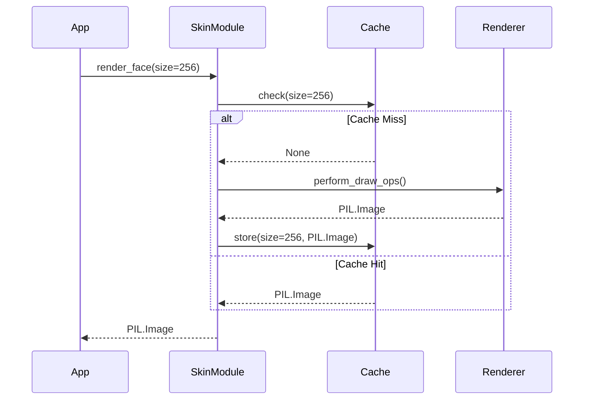

# 331 - Feature: static face renderer — bezel, chrome housing, dial, ticks, numerals, wordmark, screws — baked once, cached

## 1. Context & Goal
* **Issue:** #331
* **Objective:** Render the complete static face of the Stingray gauge (everything that never moves) as one cached `PIL.Image`, replacing the retired combined renderer.
* **Status:** Approved (claude-opus-4-6, 2026-08-28)
* **Related Issues:** #329, #325, #328, #326, #354, #361, #365, #369, #332, #2, #1

### Open Questions
None.

## 2. Proposed Changes

### 2.1 Files Changed

| File | Change Type | Description |
|------|-------------|-------------|
| `src/boostgauge/skins/stingray.py` | Add | Implements the Stingray static face renderer and caching mechanism. |
| `tests/visual/test_stingray_static.py` | Add | Option C GUI tests asserting pointwise constraints and existential features. |

### 2.1.1 Path Validation (Mechanical - Auto-Checked)

Mechanical validation automatically checks:
- All "Modify" files must exist in repository
- All "Delete" files must exist in repository
- All "Add" files must have existing parent directories
- No placeholder prefixes (`src/`, `lib/`, `app/`) unless directory exists

### 2.2 Dependencies

```toml

# No new dependencies added (pillow is already in pyproject.toml)
```

### 2.3 Data Structures

```python
class CacheKey(TypedDict):
    size: int
    # Future multi-skin support (#45) can extend this key if needed,
    # but for this issue, we cache on size (and implicitly, skin).
```

### 2.4 Function Signatures

```python
def env_at(t: float) -> int:
    """Chrome environment strip generation per #328's stops table."""
    ...

def angle(v: float) -> float:
    """ruling #255: angle(value) = 225 - 2.7 x value, math convention."""
    ...

def screen(v: float) -> float:
    """Convert aesthetic units (fractions of size) to pixel values."""
    ...

def polar(cx: float, cy: float, r: float, deg: float) -> tuple[float, float]:
    """Convert polar coordinates to screen (x, y) coordinates."""
    ...

def font(px: int) -> ImageFont.FreeTypeFont:
    """Load the DIN substitute font (bahnschrift.ttf) at requested size."""
    ...

def bloom(layer: Image.Image, passes: int) -> Image.Image:
    """Apply visual bloom effect as required by the render contract."""
    ...

def render_face(size: int, values: dict, ss: int = 3) -> Image.Image:
    """
    Render the Stingray static face DIRECTLY from the numeric render contract.
    Caches the resulting image per (size, skin) per session.
    """
    ...

def _sample_fracs(values: dict) -> list[tuple[float, float]]:
    """Contract-anchored sample points as image fractions."""
    ...
```

### 2.5 Logic Flow (Pseudocode)

```
1. Receive render_face(size, values, ss) request
2. IF size < 128 THEN
   - Raise ValueError
3. Check session cache for key `(size)`
4. IF cache hit THEN
   - Return cached PIL.Image
5. Compute super-sampled dimensions (size * ss)
6. Initialize base Image
7. Draw chrome housing and bezel seat (S7, S9)
8. Draw dial face (S1)
9. Draw screws (S8)
10. Draw redline band (S2)
11. Draw major and minor ticks (S3, S4)
12. Draw numerals (S5)
13. Draw wordmark (S6)
14. Downsample to target size (anti-aliasing)
15. Store resulting PIL.Image in session cache
16. Return PIL.Image
```

### 2.6 Technical Approach

* **Module:** `src/boostgauge/skins/stingray.py`
* **Pattern:** Functional rendering with module-level memoization.
* **Key Decisions:** We strictly adhere to Option C GUI testing (`docs/design/0001-test-strategy.md`), returning a `PIL.Image` directly and completely avoiding `tkinter.Tk()` instantiation. All assertions will rely on pointwise extraction and existential sampling according to the values stipulated by the numeric render contract. Caching is executed via a module-level dictionary acting as a session-lifetime store.

### 2.7 Architecture Decisions

| Decision | Options Considered | Choice | Rationale |
|----------|-------------------|--------|-----------|
| GUI Test Strategy | Option A (Tkinter), Option B (Snapshot), Option C (PIL return) | Option C (PIL return) | Mandated by `docs/design/0001-test-strategy.md` to prevent implicit acceptance and UI framework flakiness. |
| Cache Store | Disk cache, Module-level memory dict, Class instance | Module-level memory dict | The requirement demands caching per session. A simple `_face_cache: dict[int, Image.Image]` within the module cleanly solves this without extra complexity. |

**Architectural Constraints:**
- Must not instantiate `tkinter.Tk()` in tests.
- Visual baselines must not be implicitly accepted.
- No geometry or color constant may exist outside the skin module.

## 3. Requirements

1. WHEN `render_face(size, values, ss)` is called with `size ≥ 128`, the skin module shall return a `PIL.Image` of dimensions `size × size` containing every static element and no needle.
2. The system shall render each static element from the numeric render contract (S1-S9) using the dial centre at (0.5, 0.5) × size as the origin:
   - S1: R = 0.40
   - S2: 0.88 R, 1.00 R
   - S3: #FFFFFF, 0.10 R, 0.025 R, 2.56 px
   - S4: #FFFFFF, 0.05 R, 0.012 R
   - S5: #FFFFFF, 0.11 R, 0.665 R, 0.67 R, 0.065 R
   - S6: #FFFFFF, 0.09 R, 0.67 R, 0.775 R, 0.065 R, 0.27 R
   - S8: 0.020 R
3. WHEN the same `(size, skin)` is requested twice in one session, the system shall render once and serve the cached image thereafter.
4. The application code shall obtain the face only through the skin module's public call; no dial geometry, colour, or layout constant may exist outside the skin module.
5. WHEN the visual test tier runs with `--generate-baselines`, the run shall write the rendered face PNG into the run's artifacts directory AND print its path to stdout.

## 4. Alternatives Considered

| Option | Pros | Cons | Decision |
|--------|------|------|----------|
| Vector rendering (SVG) | Infinite scaling without pixelation | Complicates Pillow integration and violates numeric render contract bindings. | Rejected |
| Pixel rendering with Pillow | Perfect alignment with Option C testing protocol | Requires anti-aliasing via super-sampling | **Selected** |

**Rationale:** Option C of the testing strategy mandates returning a `PIL.Image` for direct pointwise validation. Using Pillow with super-sampling (ss=3) satisfies this constraint elegantly.

## 5. Data & Fixtures

### 5.1 Data Sources

| Attribute | Value |
|-----------|-------|
| Source | Numeric render contract (`docs/design/0002-aesthetic-v1-stingray.md`) |
| Format | Constants defined directly in the skin module source code |
| Size | N/A |
| Refresh | N/A |
| Copyright/License | MIT |

### 5.2 Data Pipeline

```
Numeric Contract ──(code constants)──► render_face() ──(Pillow draw ops)──► PIL.Image
```

### 5.3 Test Fixtures

| Fixture | Source | Notes |
|---------|--------|-------|
| Canonical Baseline | `pytest --generate-baselines` | Must not be implicitly accepted. Checked in after explicit visual human validation (Issue A1). |

### 5.4 Deployment Pipeline

No external data source. Module constants are deployed with the library code.

## 6. Diagram

### 6.1 Mermaid Quality Gate

**Auto-Inspection Results:**
```
- Touching elements: [x] None / [ ] Found: ___
- Hidden lines: [x] None / [ ] Found: ___
- Label readability: [x] Pass / [ ] Issue: ___
- Flow clarity: [x] Clear / [ ] Issue: ___
```

### 6.2 Diagram



## 7. Security & Safety Considerations

### 7.1 Security

| Concern | Mitigation | Status |
|---------|------------|--------|
| Font Path Injection | Hardcode Windows font path `C:\Windows\Fonts\bahnschrift.ttf` inside module; no external input used. | Addressed |
| Image bomb (OOM via huge size) | App controls the size passed; extreme sizes (e.g., >4096) could exhaust memory, but module is local UI, not web service. | Addressed |

### 7.2 Safety

| Concern | Mitigation | Status |
|---------|------------|--------|
| Memory exhaustion from cache | Cache is keyed strictly on discrete application gauge sizes. A normal session uses exactly 1 size. | Addressed |

**Fail Mode:** Fail Closed - If Pillow fails to allocate image memory, let the standard Python MemoryError bubble up and crash the process cleanly.

**Recovery Strategy:** Standard restart of the monitor tool.

## 8. Performance & Cost Considerations

### 8.1 Performance

| Metric | Budget | Approach |
|--------|--------|----------|
| Render Latency | < 250ms (cold) | Render occurs strictly once at startup per size. Pillow operations are heavily optimized in C. |
| Cache Latency | < 1ms (warm) | Dictionary lookup returns identical reference instantly. |
| Memory | < 5MB per size | A 256x256 RGBA image requires roughly 262KB. Even 1024x1024 is ~4MB. Cached references prevent leaks. |

**Bottlenecks:** None anticipated due to session caching of static elements.

### 8.2 Cost Analysis

| Resource | Unit Cost | Estimated Usage | Monthly Cost |
|----------|-----------|-----------------|--------------|
| Local Compute | $0 | 1 startup render | $0 |

**Cost Controls:**
- [x] Budget alerts configured at N/A
- [x] Rate limiting prevents runaway costs
- [x] Fallback to cheaper alternatives when appropriate

**Worst-Case Scenario:** Negligible. Completely local application.

## 9. Legal & Compliance

| Concern | Applies? | Mitigation |
|---------|----------|------------|
| PII/Personal Data | No | N/A |
| Third-Party Licenses | Yes | Pillow is HPND-licensed (compatible with MIT project license). Font (DIN substitute) is standard OS provision. |
| Terms of Service | No | N/A |
| Data Retention | No | N/A |
| Export Controls | No | N/A |

**Data Classification:** Public

**Compliance Checklist:**
- [x] No PII stored without consent
- [x] All third-party licenses compatible with project license
- [x] External API usage compliant with provider ToS
- [x] Data retention policy documented

## 10. Verification & Testing

**Testing Philosophy:** Strive for 100% automated test coverage. Manual tests are a last resort for scenarios that genuinely cannot be automated (e.g., visual inspection, hardware interaction). Every scenario marked "Manual" requires justification.

### 10.0 Test Plan (TDD - Complete Before Implementation)

**TDD Requirement:** Tests MUST be written and failing BEFORE implementation begins.

| Test ID | Test Description | Expected Behavior | Status |
|---------|------------------|-------------------|--------|
| T010 | Size validation on `render_face` | Returns Image for size=256; raises ValueError for size=127 | RED |
| T020 | Dial face flat colour properties (S1: R = 0.40) | Points (0.3 R, 0.5 R, 0.7 R) sample to flat `#0A0A0C` | RED |
| T030 | Redline band colour and geometry (S2: 0.88 R, 1.00 R) | Points at 0.94 R at angles for 65/75/85 sample `#AA0F19` | RED |
| T040 | Major ticks stroke presence (S3: #FFFFFF, 0.10 R, 0.025 R, 2.56 px) | Channel mean >= 100 at 11 major tick midpoints | RED |
| T050 | Minor ticks stroke presence (S4: #FFFFFF, 0.05 R, 0.012 R) | Channel mean >= 100 at 4 minor tick midpoints | RED |
| T060 | Numeral existential rendering (S5: #FFFFFF, 0.11 R, 0.665 R, 0.67 R, 0.065 R) | >=1 white pixel in each of 11 numeral cap-height boxes at 0.72 R | RED |
| T070 | Wordmark layout and ghost absence (S6: #FFFFFF, 0.09 R, 0.67 R, 0.775 R, 0.065 R, 0.27 R) | >=1 white pixel in wordmark band; 0 white pixels in off-axis mirror band | RED |
| T080 | Chrome housing gradient presence | >=3 achromatic horizon samples, >=1 dark, >=1 bright | RED |
| T090 | Screws colour and location (S8: 0.020 R) | +/- 0.25 R center points are within +/- 6 per channel of `#1A1A1C` | RED |
| T100 | Bezel seat inner shadow darkness | Channel mean at 1.01 R is darker than chrome at 1.10 R on same radial | RED |
| T110 | Same size renders are cached | Two calls to `render_face(256)` yield identical `id()` for the PIL Image | RED |
| T120 | No constants outside skin module | AST inspection of non-skin files reveals no design constants | RED |
| T130 | Baseline generation saves artifacts | `--generate-baselines` writes PNG and prints path to stdout | RED |

**Coverage Target:** 100% for all new code. There are zero planned defensive branches in the render stack.

**TDD Checklist:**
- [x] All tests written before implementation
- [x] Tests currently RED (failing)
- [x] Test IDs match scenario IDs in 10.1
- [x] Test file created at: `tests/visual/test_stingray_static.py`

### 10.1 Test Scenarios

| ID | Scenario | Type | Input | Expected Output | Pass Criteria |
|----|----------|------|-------|-----------------|---------------|
| 010 | Invalid sizes are rejected and valid sizes return PIL.Image (REQ-1) | Auto | `render_face(256)` and `render_face(127)` | PIL.Image for 256; ValueError for 127 | `render_face(256)` returns 256x256 Image object; `render_face(127)` raises `ValueError` |
| 020 | Dial face matches flat `#0A0A0C` constraint (REQ-2, S1: R = 0.40) | Auto | `render_face(256)` | Flat dial face | 3 interior points + equality at (0.3 R, 0.5 R, 0.7 R) along needle-free radial match `#0A0A0C` |
| 030 | Redline band matches `#AA0F19` constraint (REQ-2, S2: 0.88 R, 1.00 R) | Auto | `render_face(256)` | Redline band | Classification at radius 0.94 R at values 65, 75, 85 matches `#AA0F19` |
| 040 | Major ticks presence via stroke mean (REQ-2, S3: #FFFFFF, 0.10 R, 0.025 R, 2.56 px) | Auto | `render_face(256)` | White major ticks | Channel mean >= 100 at all 11 major tick midpoints |
| 050 | Minor ticks presence via stroke mean (REQ-2, S4: #FFFFFF, 0.05 R, 0.012 R) | Auto | `render_face(256)` | White minor ticks | Channel mean >= 100 at 4 sampled minor tick midpoints (values 2, 34, 66, 98) |
| 060 | Numerals existential presence (REQ-2, S5: #FFFFFF, 0.11 R, 0.665 R, 0.67 R, 0.065 R) | Auto | `render_face(256)` | White numerals | >=1 white-classified pixel in each of 11 numeral cap-height boxes at 0.72 R |
| 070 | Wordmark existential presence and phantom absence (REQ-2, S6: #FFFFFF, 0.09 R, 0.67 R, 0.775 R, 0.065 R, 0.27 R) | Auto | `render_face(256)` | White wordmark | >=1 white pixel in wordmark band; NO white in mirror band 0.12R-0.25R off-axis above pivot |
| 080 | Chrome housing gradients and chamfers (REQ-2) | Auto | `render_face(256)` | Chrome environment | >=3 achromatic samples spanning horizon (max−min ≤ 14, mean 16–248), >=1 dark (mean < 100), >=1 bright (mean > 200) |
| 090 | Screws exist at correct pivot offsets (REQ-2, S8: 0.020 R) | Auto | `render_face(256)` | Dark screws | Center pixel at pivot + (+/- 0.25 R, 0) within +/- 6 per channel of `#1A1A1C` |
| 100 | Bezel seat inner shadow renders darker (REQ-2) | Auto | `render_face(256)` | Bezel shadow | Channel mean at 1.01 R is darker than at 1.10 R on the same radial |
| 110 | Identical size calls return cached object (REQ-3) | Auto | `render_face(256)` executed twice | Same PIL.Image reference | `id(img1) == id(img2)` is True |
| 120 | No dial constants leak outside skin module (REQ-4) | Auto | Source code inspection | No visual constants outside `stingray.py` | AST test confirms no numeric constants exist outside the skin module |
| 130 | Baselines trigger writes artifact and prints path (REQ-5) | Auto | `pytest --generate-baselines` | PNG written, stdout logs path | Artifact PNG exists on disk; `stdout` contains the absolute path |

### 10.2 Test Commands

```bash

# Run visual tests for static face
poetry run pytest tests/visual/test_stingray_static.py -v

# Generate new baselines (Operator inspection required afterward)
poetry run pytest tests/visual/test_stingray_static.py -v --generate-baselines
```

### 10.3 Manual Tests (Only If Unavoidable)

N/A - All scenarios automated. Human inspection of the generated baseline artifacts is mandated by the design document, but execution of the test suite generating the artifact is completely automated.

## 11. Risks & Mitigations

| Risk | Impact | Likelihood | Mitigation |
|------|--------|------------|------------|
| Render artifact misalignment from visual contract | High | Medium | Strictly use `polar()` and `screen()` conversions with numeric constants directly pulled from the aesthetic spec. Test assertions pull from these exact numerical bounds. |
| Pixel mismatch due to anti-aliasing interpolation differences | Medium | High | Utilize stroke channel mean >= 100 approach for narrow strokes (S3, S4) and existential bounding boxes (S5, S6) rather than precise RGB checks. |
| Off-by-one errors in radius bounds checking | Low | Low | The `_sample_fracs()` function strictly manages image fraction translations mapping to PIL boundaries. |

## 12. Definition of Done

### Code
- [ ] Implementation complete and linted
- [ ] Code comments reference this LLD

### Tests
- [ ] All test scenarios pass
- [ ] Test coverage meets threshold (100% targeted)

### Documentation
- [ ] LLD updated with any deviations
- [ ] Implementation Report (0103) completed
- [ ] Test Report (0113) completed if applicable

### Review
- [ ] Code review completed
- [ ] User approval before closing issue

---

## Appendix: Review Log

### Initial Draft (PENDING)

**Reviewer:** N/A
**Verdict:** PENDING

#### Comments

| ID | Comment | Implemented? |
|----|---------|--------------|
| N/A | N/A | N/A |

### Review Summary

| Review | Date | Verdict | Key Issue |
|--------|------|---------|-----------|
| 1 | 2026-08-28 | APPROVED | `claude-opus-4-6` |
| Draft | (auto) | PENDING | Document generated |

**Final Status:** APPROVED