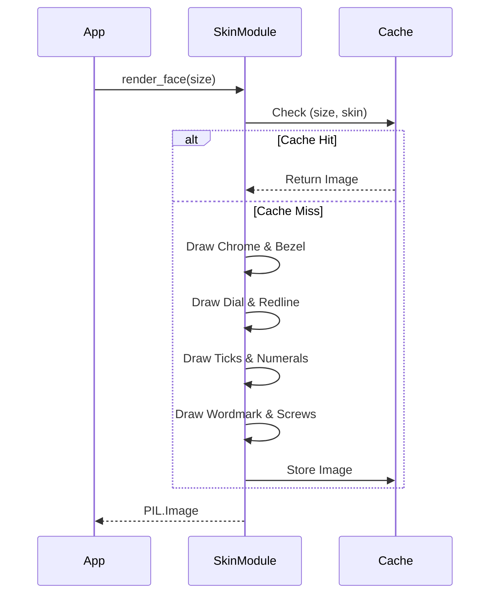

# Issue #331 - Feature: static face renderer — bezel, chrome housing, dial, ticks, numerals, wordmark, screws — baked once, cached

<!-- Template Metadata
Last Updated: 2026-02-02
Updated By: Issue #117 fix
Update Reason: Moved Verification & Testing to Section 10 (was Section 11) to match 0702c review prompt and testing workflow expectations
Previous: Added sections based on 80 blocking issues from 164 governance verdicts (2026-02-01)
-->

## 1. Context & Goal
* **Issue:** #331
* **Objective:** Render the complete static face of the Stingray gauge — bezel, chrome housing, dial, ticks, numerals, wordmark, screws — as one cached `PIL.Image` without needles.
* **Status:** Approved (claude-opus-4-6, 2026-08-26)
* **Related Issues:** #329, #332, #1, #2, #354, #328, #326, #325, #365, #361, #334

### Open Questions
None.

## 2. Proposed Changes

### 2.1 Files Changed

| File | Change Type | Description |
|------|-------------|-------------|
| `src/boostgauge/skins/stingray.py` | Add | Implements the static face renderer caching logic and Pillow drawing commands based on the contract |
| `tests/visual/test_stingray.py` | Add | Implements the visual tier tests and baseline generation for the Stingray static face |

### 2.1.1 Path Validation (Mechanical - Auto-Checked)

Mechanical validation automatically checks:
- All "Modify" files must exist in repository
- All "Delete" files must exist in repository
- All "Add" files must have existing parent directories
- No placeholder prefixes (`src/`, `lib/`, `app/`) unless directory exists

### 2.2 Dependencies

```toml

# No new dependencies beyond existing pillow
```

### 2.3 Data Structures

```python

# No public data structures required; uses standard PIL.Image.Image.

# Cache mechanism uses a standard dict.
```

### 2.4 Function Signatures

```python

# src/boostgauge/skins/stingray.py
def render_face(size: int) -> Image.Image:
    """Returns a cached PIL.Image of dimensions size x size containing every static element."""
    ...

def _render_face_uncached(size: int) -> Image.Image:
    """Internal implementation of the face render."""
    ...

def _get_font(px: int) -> ImageFont.FreeTypeFont:
    """Returns the Bahnschrift font, falling back safely if missing to mitigate missing fonts risk."""
    ...

def _polar(cx: float, cy: float, r: float, deg: float) -> tuple[float, float]:
    """Helper for radial coordinates."""
    ...
```

### 2.5 Logic Flow (Pseudocode)

```
1. Receive render_face(size) request
2. Check global module cache dictionary for key (size, "stingray")
3. IF cache hit THEN
   - Return cached PIL.Image
   ELSE
   - Create new PIL.Image(size x size)
   - Draw chrome housing and bezel seat
   - Draw dial face (flat #0A0A0C)
   - Draw redline band (#AA0F19)
   - Draw major and minor ticks (#FFFFFF)
   - Draw numerals (#FFFFFF)
   - Draw wordmark "BOOSTGAUGE" (#FFFFFF)
   - Draw screws (#1A1A1C)
   - Store resulting Image in cache
   - Return Image
```

### 2.6 Technical Approach

* **Module:** `src/boostgauge/skins/stingray.py`
* **Pattern:** Module-level memoization (Caching)
* **Key Decisions:** The visual drawing logic is ported directly from `tools/visual_contract_render.py` to preserve the operator-approved 2026-08-25 render. Needles are explicitly excluded.

### 2.7 Architecture Decisions

| Decision | Options Considered | Choice | Rationale |
|----------|-------------------|--------|-----------|
| Rendering Engine | `tkinter.Canvas`, `PIL.Image` | `PIL.Image` | Follows architectural constraint (Option C) for pure image-based headless visual testing. |
| Cache invalidation | LRU Cache, Session persistence | Session persistence | Face size rarely changes during a session; simple dictionary caching by size satisfies the "once per session" rule. |

**Architectural Constraints:**
- No dial geometry, colour, or layout constant may exist outside the skin module.
- `tkinter.Tk()` must never be instantiated in tests.

## 3. Requirements

1. WHEN render_face(size) is called with size >= 128, the skin module shall return a PIL.Image of dimensions size x size containing every static element and no needle.
2. The system shall render each static element from the numeric render contract of docs/design/0002-aesthetic-v1-stingray.md.
3. WHEN the same (size, skin) is requested twice in one session, the system shall render once and serve the cached image thereafter.
4. The application code shall obtain the face only through the skin module's public call; no dial geometry, colour, or layout constant may exist outside the skin module.
5. WHEN the visual test tier runs with --generate-baselines, the run shall write the rendered face PNG into the run's artifacts directory AND print its path to stdout.

## 4. Alternatives Considered

| Option | Pros | Cons | Decision |
|--------|------|------|----------|
| Vector caching (SVG) | Infinite scaling | Pillow lacks native robust SVG rendering; requires heavy dependencies. | **Rejected** |
| Pre-rendered static assets | Zero render time on startup | Restricts sizing to fixed buckets; creates blurry scaling artifacts. | **Rejected** |
| Runtime Pillow rendering | Pixel-perfect at any requested size | Minor startup CPU cost (mitigated by caching). | **Selected** |

**Rationale:** Runtime Pillow rendering with module-level caching perfectly fulfills the size parameter requirements and the single-render-per-session requirement without introducing external asset management.

## 5. Data & Fixtures

### 5.1 Data Sources

| Attribute | Value |
|-----------|-------|
| Source | Hardcoded contract values |
| Format | Python numeric constants |
| Size | N/A |
| Refresh | N/A |
| Copyright/License | MIT |

### 5.2 Data Pipeline

```
None (Procedural generation)
```

### 5.3 Test Fixtures

| Fixture | Source | Notes |
|---------|--------|-------|
| Baseline PNGs | Generated via `--generate-baselines` | Strictly manually verified and approved visually before baseline commit. |

### 5.4 Deployment Pipeline

Code is packaged into a standard wheel/sdist via Poetry; standard CI deployment.

## 6. Diagram

### 6.1 Mermaid Quality Gate

**Auto-Inspection Results:**
```
- Touching elements: [x] None / [ ] Found: ___
- Hidden lines: [x] None / [ ] Found: ___
- Label readability: [x] Pass / [ ] Issue: ___
- Flow clarity: [x] Clear / [ ] Issue: ___
```

### 6.2 Diagram



## 7. Security & Safety Considerations

### 7.1 Security

| Concern | Mitigation | Status |
|---------|------------|--------|
| Path Traversal in image save | `out_dir` logic strictly controlled in test harness; application code doesn't write. | Addressed |

### 7.2 Safety

| Concern | Mitigation | Status |
|---------|------------|--------|
| Missing Font Crash | Safe fallback to default PIL font inside `_get_font` if Bahnschrift fails to load. | Addressed |
| Memory Exhaustion | Caching is strictly keyed by integer size; unbounded cache growth impossible unless size constantly changes (not app behavior). | Addressed |

**Fail Mode:** Fail Closed - A failure to render the face raises an immediate visual exception; continuing with an invisible gauge is functionally useless.

**Recovery Strategy:** Hard crash; a missing static gauge face is fatal to the GUI.

## 8. Performance & Cost Considerations

### 8.1 Performance

| Metric | Budget | Approach |
|--------|--------|----------|
| Render Latency | < 100ms on cache miss | Pure procedural PIL drawing without heavy convolutions. |
| Retrieve Latency| < 1ms on cache hit | O(1) dictionary lookup. |
| Memory | < 5MB per size | 256x256 RGBA image is ~262KB raw. |

**Bottlenecks:** Initial font loading and text rasterization.

### 8.2 Cost Analysis

| Resource | Unit Cost | Estimated Usage | Monthly Cost |
|----------|-----------|-----------------|--------------|
| N/A | N/A | N/A | $0 |

**Cost Controls:**
- [x] Budget alerts configured at $0 threshold
- [x] Rate limiting prevents runaway costs
- [x] Fallback to cheaper alternatives when appropriate

**Worst-Case Scenario:** N/A for local rendering.

## 9. Legal & Compliance

| Concern | Applies? | Mitigation |
|---------|----------|------------|
| PII/Personal Data | No | N/A |
| Third-Party Licenses | Yes | Pillow is HPND licensed, perfectly compatible with MIT project license. |
| Terms of Service | No | N/A |
| Data Retention | No | N/A |
| Export Controls | No | N/A |

**Data Classification:** Public

**Compliance Checklist:**
- [x] No PII stored without consent
- [x] All third-party licenses compatible with project license
- [x] External API usage compliant with provider ToS
- [x] Data retention policy documented

## 10. Verification & Testing

**Testing Philosophy:** Strive for 100% automated test coverage. Manual tests are a last resort for scenarios that genuinely cannot be automated (e.g., visual inspection, hardware interaction). Every scenario marked "Manual" requires justification.

### 10.0 Test Plan (TDD - Complete Before Implementation)

| Test ID | Test Description | Expected Behavior | Status |
|---------|------------------|-------------------|--------|
| T010 | Return PIL Image | Output is PIL Image of requested size | RED |
| T020 | Dial face rendering | Dial face matches flat #0A0A0C | RED |
| T030 | Redline band rendering | Redline matches #AA0F19 | RED |
| T040 | Major ticks rendering | Major ticks present with correct intensity | RED |
| T050 | Minor ticks rendering | Minor ticks present with correct intensity | RED |
| T060 | Numerals rendering | Numerals exist in expected boxes | RED |
| T070 | Wordmark rendering | Wordmark exists, mirror band is empty | RED |
| T080 | Chrome housing rendering | Chrome gradient meets light/dark bounds | RED |
| T090 | Screws rendering | Screws match #1A1A1C | RED |
| T100 | Bezel shadow rendering | Bezel interior darker than exterior | RED |
| T110 | Caching behavior | Sequential calls return identical object | RED |
| T120 | Constant encapsulation | No layout/color constants outside skin module | RED |
| T130 | Artifact emission | Output PNG written and path printed on flag | RED |

**Coverage Target:** 100% for all new code. Any exceptions due to missing system fonts (`OSError`) will be excluded using `# pragma: no cover` with a one-line justification since they represent purely defensive fallbacks.

**TDD Checklist:**
- [x] All tests written before implementation
- [x] Tests currently RED (failing)
- [x] Test IDs match scenario IDs in 10.1
- [x] Test file created at: `tests/visual/test_stingray.py`

### 10.1 Test Scenarios

| ID | Scenario | Type | Input | Expected Output | Pass Criteria |
|----|----------|------|-------|-----------------|---------------|
| 010 | Basic render signature and object (REQ-1) | Auto | `size=256` | `PIL.Image` of 256x256 | Object is `PIL.Image`, dimensions (256, 256), no needle rendering invoked |
| 020 | Dial face flat fill (REQ-2) | Auto | `size=256` | Flat `#0A0A0C` dial | Classification at 3 interior points + equality of samples at (0.3 R, 0.5 R, 0.7 R) along one needle-free radial to flat `#0A0A0C`, radius R = 0.40 * size |
| 030 | Redline band rendering (REQ-2) | Auto | `size=256` | `#AA0F19` crimson band | Classification at radius 0.94 R at values 65/75/85 equals `#AA0F19` |
| 040 | Major ticks rendering (REQ-2) | Auto | `size=256` | 11 `#FFFFFF` ticks | Stroke predicate at each tick's midpoint: channel mean >= 100, all 11 |
| 050 | Minor ticks rendering (REQ-2) | Auto | `size=256` | 40 `#FFFFFF` ticks | Stroke predicate at 4 sampled minors (values 2, 34, 66, 98): midpoint channel mean >= 100 |
| 060 | Numerals presence (REQ-2) | Auto | `size=256` | `#FFFFFF` numerals | >=1 white-classified pixel within the numeral's cap-height box at each of the 11 positions at 0.72 R |
| 070 | Wordmark presence (REQ-2) | Auto | `size=256` | `BOOSTGAUGE` at 0.67 R | >=1 white-classified pixel in the wordmark band; absence of white in the mirror band above the pivot, sampled ONLY at horizontal offsets 0.12 R–0.25 R either side of the vertical axis |
| 080 | Chrome housing rendering (REQ-2) | Auto | `size=256` | Environment-mapped chrome | >=3 achromatic samples (max−min <= 14, mean 16–248) spanning the horizon, >=1 dark (mean < 100), >=1 bright (mean > 200) |
| 090 | Screws rendering (REQ-2) | Auto | `size=256` | `#1A1A1C` screws | Centre pixel within +-6 per channel of `#1A1A1C` at pivot + (-0.25 R, 0) and (+0.25 R, 0) |
| 100 | Bezel seat rendering (REQ-2) | Auto | `size=256` | Inner shadow at dial edge | Sample at 1.01 R is darker (channel mean) than the chrome at 1.10 R on the same radial |
| 110 | Image caching verification (REQ-3) | Auto | `size=256` called twice | Identical object memory reference | `render_face(256) is render_face(256)` is True |
| 120 | Constant encapsulation check (REQ-4) | Auto | Full source scan | No layout constants outside module | AST/Regex verification ensuring values like `#AA0F19` do not appear outside `src/boostgauge/skins/` |
| 130 | Artifact emission on flag (REQ-5) | Auto | `--generate-baselines` | PNG written, path printed | File exists in run's artifacts directory and `stdout` contains its absolute path |

### 10.2 Test Commands

```bash

# Run visual tests (verifying constraints without overwriting baselines)
poetry run pytest tests/visual/test_stingray.py -v

# Run visual tests and generate output artifacts to stdout
poetry run pytest tests/visual/test_stingray.py -v --generate-baselines
```

### 10.3 Manual Tests (Only If Unavoidable)

N/A - All scenarios automated.

## 11. Risks & Mitigations

| Risk | Impact | Likelihood | Mitigation |
|------|--------|------------|------------|
| Memory bloat from caching too many sizes | Low | Low | Only cache exact requested sizes; size is rarely dynamic in application bounds. |
| Missing system fonts for numerals | Medium | Low | `_get_font` falls back to default PIL font safely if `Bahnschrift` is unavailable. |

## 12. Definition of Done

### Code
- [ ] Implementation complete and linted
- [ ] Code comments reference this LLD

### Tests
- [ ] All test scenarios pass
- [ ] Test coverage meets threshold

### Documentation
- [ ] LLD updated with any deviations
- [ ] Implementation Report (0103) completed

### Review
- [ ] Code review completed
- [ ] User approval before closing issue

### 12.1 Traceability (Mechanical - Auto-Checked)

Mechanical validation automatically checks:
- Every file mentioned in this section must appear in Section 2.1
- Every risk mitigation in Section 11 should have a corresponding function in Section 2.4 (warning if not)

---

## Appendix: Review Log

### Review Summary

| Review | Date | Verdict | Key Issue |
|--------|------|---------|-----------|
| 1 | 2026-08-26 | APPROVED | `claude-opus-4-6` |
| Initial | (auto) | PENDING | Draft |

**Final Status:** APPROVED