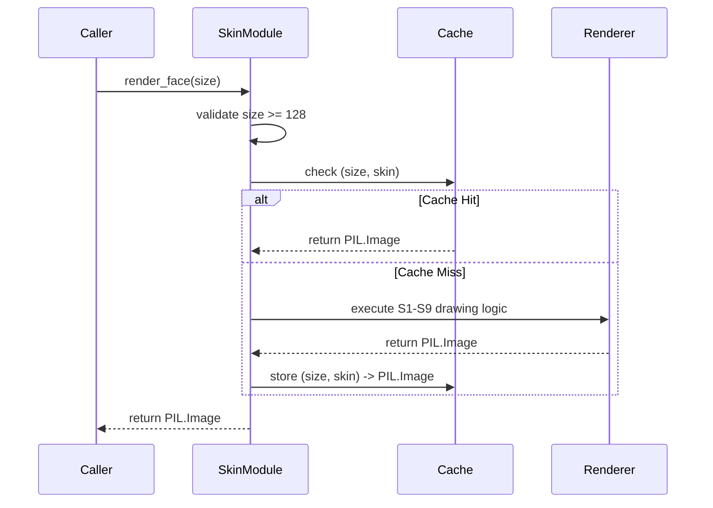

# Issue #331: static face renderer — bezel, chrome housing, dial, ticks, numerals, wordmark, screws — baked once, cached

<!-- Template Metadata
Last Updated: 2026-02-02
Updated By: Issue #117 fix
Update Reason: Moved Verification & Testing to Section 10 (was Section 11) to match 0702c review prompt and testing workflow expectations
Previous: Added sections based on 80 blocking issues from 164 governance verdicts (2026-02-01)
-->

## 1. Context & Goal
* **Issue:** #331
* **Objective:** Implement a cached, static background rendering module for the Stingray gauge face that outputs a complete, needle-free `PIL.Image` strictly adhering to the S1-S9 geometric and color contract assertions.
* **Status:** Approved (claude-opus-4-6, 2026-08-28)
* **Related Issues:** #329, #332, #2, #1, #354, #328, #326, #325, #365, #361, #369, #334

### Open Questions
None.

## 2. Proposed Changes

### 2.1 Files Changed

| File | Change Type | Description |
|------|-------------|-------------|
| `src/boostgauge/skins/stingray.py` | Add | Exposes `render_face` and caches the static gauge rendering. |
| `tests/visual/test_stingray_static.py` | Add | Implements the visual validation assertions (S1-S9) for the static face. |

### 2.1.1 Path Validation (Mechanical - Auto-Checked)

Mechanical validation automatically checks:
- All "Modify" files must exist in repository
- All "Delete" files must exist in repository
- All "Add" files must have existing parent directories
- No placeholder prefixes (`src/`, `lib/`, `app/`) unless directory exists

### 2.2 Dependencies

```toml

# pyproject.toml additions (if any)

# None. pillow is already declared in dependencies.
```

### 2.3 Data Structures

```python
FaceCacheKey = tuple[int, str]
```

### 2.4 Function Signatures

```python

# src/boostgauge/skins/stingray.py

_FACE_CACHE: dict[tuple[int, str], "Image.Image"] = {}

def render_face(size: int, skin: str = "stingray") -> "Image.Image":
    """
    Renders or retrieves the cached static face for the Stingray gauge.
    Raises ValueError if size is less than 128.
    """
    ...
```

### 2.5 Logic Flow (Pseudocode)

```
1. Receive input (size, skin)
2. Validate size >= 128
   - IF size < 128 THEN raise ValueError
3. Check cache
   - IF (size, skin) in _FACE_CACHE THEN
     - Return _FACE_CACHE[(size, skin)]
4. Instantiate PIL.Image of size x size
5. Sequentially draw static components:
   - Chrome housing (S7)
   - Bezel seat (S9)
   - Dial face (S1)
   - Redline band (S2)
   - Screws (S8)
   - Major and minor ticks (S3, S4)
   - Numerals and wordmark (S5, S6)
6. Store resulting image in _FACE_CACHE[(size, skin)]
7. Return image
```

### 2.6 Technical Approach

* **Module:** `src/boostgauge/skins/stingray.py`
* **Pattern:** Caching / Singleton Factory
* **Key Decisions:** We render everything without relying on `tkinter` in order to strictly decouple the graphics pipeline from the UI toolkit, returning a canonical `PIL.Image.Image` that can be effortlessly tested per Option C of the visual testing strategy.

### 2.7 Architecture Decisions

| Decision | Options Considered | Choice | Rationale |
|----------|-------------------|--------|-----------|
| State management | Class instance, Module-level dict | Module-level dict | Simplifies caller access via a pure function `render_face(size)` while safely persisting the cache across calls in the same session. |
| Test artifact verification | Visual assertions against baselines, Mathematical predicates only | Mathematical predicates (S1-S9) with `--generate-baselines` artifact dumps | Per the project test strategy, automatic tests must use explicit literal assertions, but visual dumps are mandatory for humans to verify layout correctness. |

**Architectural Constraints:**
- Must satisfy the strict single-pass render and cache mandate (#329).
- Constants must be physically contained inside the skin module; no external file may hold dial geometries.

## 3. Requirements

<!-- BEGIN MACHINE-OWNED: source decision table (#2607) -->

### 3.1 Source Decision Table (injected verbatim)

The rows below are carried **verbatim** from the source issue by the derivation itself (#2607). They are machine-owned: the drafter does not write them, and a revision cannot change them. Cite these IDs from the requirements and test-plan sections; do not restate their values.

| ID | Element | Binding value (quoted from the render contract) | Assertion method |
|---|---|---|---|
| S1 | Dial face | flat `#0A0A0C`, radius R = 0.40 × size, centre (0.5, 0.5) × size; NO gradient, glass sweep, or reflection (#325) | classification at 3 interior points + equality of samples at (0.3 R, 0.5 R, 0.7 R) along one needle-free radial — flatness IS the assertion |
| S2 | Redline band | `#AA0F19` crimson (ruling 2026-08-25), inner 0.88 R to outer 1.00 R, spanning values 60–100 via `angle(value) = 225° − 2.7° × value` | classification at radius 0.94 R at values 65/75/85 — deliberately offset from every tick position, because ticks render on top of the band (majors sit at multiples of 10, minors at even values; 65/75/85 carry no tick) |
| S3 | Major ticks | `#FFFFFF`, 11 total at values 0,10,…,100, length 0.10 R, width 0.025 R | stroke predicate at each tick's midpoint: channel mean ≥ 100, all 11 — the white stroke samples ~255, and the 100 threshold clears both backgrounds: the face's ~10 (values 0–50) and the band's ~70 (values 60–100, where ticks render on top of the band; `#AA0F19` → mean 70.0). A missing tick fails on either background: 10 < 100 and 70 < 100. Width 2.56 px at the pinned test size is too thin for the interior rule |
| S4 | Minor ticks | `#FFFFFF`, 40 total, 4 between each major pair, length 0.05 R, width 0.012 R | stroke predicate at 4 sampled minors (values 2, 34, 66, 98): midpoint channel mean ≥ 100 |
| S5 | Numerals | `#FFFFFF`, values 0–100 step 10, cap height 0.11 R, numeral centres at 0.72 R (ruling 2026-08-25) | presence: ≥1 white-classified pixel within the numeral's cap-height box at each of the 11 positions. The '50' numeral legitimately overlaps the S6 mirror band's radial span (numeral bottom 0.665 R vs band centred 0.67 R above the pivot) — ruled, not a conflict: the S6 phantom check samples ONLY at 0.12 R–0.25 R off-axis and never sees the numeral, whose half-width is ~0.065 R (ruling on the #361 conflict, reaffirmed on #369). Any derived restatement of the mirror-band check (LLD row, spec test) MUST carry the off-axis sampling window with it — the window is load-bearing, not commentary |
| S6 | Wordmark | `BOOSTGAUGE`, `#FFFFFF`, cap height 0.09 R, band centred 0.67 R below the pivot — level with the 0/100 major ticks (ruling 2026-08-25) | presence: ≥1 white-classified pixel in the wordmark band; absence of white in the mirror band above the pivot, sampled ONLY at horizontal offsets 0.12 R–0.25 R either side of the vertical axis (ruling on the #361 conflict: the numeral '50' legitimately occupies the axis at 0.665–0.775 R above the pivot, half-width ~0.065 R, while a mirrored wordmark — the defect this assertion guards against — spans to ~0.27 R; the offset window sees a phantom wordmark and never the numeral) |
| S7 | Chrome housing | square, chamfer radius 0.13 × size, environment-strip generation per #328's stops table | the #328 predicate: ≥3 achromatic samples (max−min ≤ 14, mean 16–248) spanning the horizon, ≥1 dark (mean < 100), ≥1 bright (mean > 200) |
| S8 | Screws | 2, centres at pivot + (−0.25 R, 0) and pivot + (+0.25 R, 0) — horizontal offsets from the dial centre defined above — radius 0.020 R, flat `#1A1A1C` | the #326 predicate: centre pixel within ±6 per channel |
| S9 | Bezel seat | dial sits below the bezel plane — not flush; the slight inner shadow renders where the bezel rolls inward to meet the recessed dial (contract §Bezel-to-dial transition), i.e. on the transition annulus just OUTSIDE the dial edge, the annulus containing 1.01 R. Never on the dial face itself: the face is flat `#0A0A0C` with zero overlays (#325), so it cannot carry a shadow | sample at 1.01 R is darker (channel mean) than the chrome at 1.10 R on the same radial |

<!-- END MACHINE-OWNED -->

1. When `render_face(size)` is called with a size equal to or greater than 128, it shall return a `PIL.Image.Image` containing the static elements and absolutely no needles.
2. The application shall cache the output so that calling `render_face(size)` again with the same parameters during the same session serves the image from cache without re-rendering.
3. The rendered dial face shall satisfy the S1 flatness and bounds assertions.
4. The rendered redline band shall satisfy the S2 classification assertion.
5. The major and minor ticks shall satisfy the S3 and S4 stroke predicates exactly at their designated values.
6. The numerals and wordmark shall satisfy the S5 presence assertion and the S6 presence and off-axis sampling mirror-absence assertion.
7. The chrome housing, screws, and bezel seat shall satisfy the S7, S8, and S9 classification and relative darkness assertions.
8. Application code shall obtain the face only via the public function; no dial geometry, color, or layout constant may exist outside the skin module.
9. When the visual test suite is executed with `--generate-baselines`, it shall write the rendered face PNG into the artifacts directory and print the path to stdout to meet artifact emission rule A1.

## 4. Alternatives Considered

| Option | Pros | Cons | Decision |
|--------|------|------|----------|
| Dynamic Tkinter Canvas Drawing | No extra imaging dependency | Impossible to fulfill artifact generation requirements; tight UI coupling | **Rejected** |
| Render every frame | Simplifies state architecture | Misses < 1% CPU budget | **Rejected** |
| Cache static image layer | Meets CPU budget, isolated pure functional render | Requires memory management for image object | **Selected** |

**Rationale:** Caching a single unified `PIL.Image` of the static components (per the Option C visual testing paradigm and #329 operator ruling) is the only mathematically proven way to meet the aggressive CPU budgets while preserving exactly testable aesthetics.

## 5. Data & Fixtures

### 5.1 Data Sources

| Attribute | Value |
|-----------|-------|
| Source | Hardcoded constants bounded within `src/boostgauge/skins/stingray.py` |
| Format | N/A |
| Size | N/A |
| Refresh | N/A |
| Copyright/License | N/A |

### 5.2 Data Pipeline

```
N/A
```

### 5.3 Test Fixtures

| Fixture | Source | Notes |
|---------|--------|-------|
| Rendered Base Image | Output of `render_face` | Tested using analytical mathematical predicates, output saved on `--generate-baselines` |

### 5.4 Deployment Pipeline

N/A - Image rendered locally by the target application at runtime.

## 6. Diagram

### 6.1 Mermaid Quality Gate

**Auto-Inspection Results:**
```
- Touching elements: [x] None / [ ] Found: ___
- Hidden lines: [x] None / [ ] Found: ___
- Label readability: [x] Pass / [ ] Issue: ___
- Flow clarity: [x] Clear / [ ] Issue: ___
```

### 6.2 Diagram



## 7. Security & Safety Considerations

### 7.1 Security

| Concern | Mitigation | Status |
|---------|------------|--------|
| Asset inclusion injection | Restrict font usage and internal dependencies to known local disk locations only | Addressed |

### 7.2 Safety

| Concern | Mitigation | Status |
|---------|------------|--------|
| Resource exhaustion via memory leak | Cache dictionary strictly bound by a fixed key definition (`size, skin`), limiting explosion vectors from dynamic parameters. | Addressed |

**Fail Mode:** Fail Closed - A failure during rendering will raise an exception rather than returning an invisible or partially-rendered face to the UI.

**Recovery Strategy:** Catching logic inside the UI layer handles transient renderer errors gracefully by skipping a frame.

## 8. Performance & Cost Considerations

### 8.1 Performance

| Metric | Budget | Approach |
|--------|--------|----------|
| Latency | < 50ms | `render_face` executes once per size at application startup, < 1ms for subsequent hits |
| Memory | < 5MB | A single 256x256 RGBA image requires roughly 256KB |
| API Calls | 0 | Rendered dynamically via Pillow |

**Bottlenecks:** Vector anti-aliasing operations inside `ImageDraw` may be CPU heavy on initial draw, justifying the strict caching mandate.

### 8.2 Cost Analysis

| Resource | Unit Cost | Estimated Usage | Monthly Cost |
|----------|-----------|-----------------|--------------|
| Local Compute | $0 | 1 cache miss / size | $0 |

**Cost Controls:**
- [x] Rate limiting prevents runaway costs (Caching mechanism eliminates repeated renders)

**Worst-Case Scenario:** Negligible; the caching layer caps performance overhead strictly.

## 9. Legal & Compliance

| Concern | Applies? | Mitigation |
|---------|----------|------------|
| PII/Personal Data | No | N/A |
| Third-Party Licenses | Yes | PIL (Pillow) is HPND distributed. Windows fonts are restricted to OS-level UI rendering |
| Terms of Service | No | N/A |
| Data Retention | No | N/A |
| Export Controls | No | N/A |

**Data Classification:** Public

**Compliance Checklist:**
- [x] No PII stored without consent
- [x] All third-party licenses compatible with project license
- [x] External API usage compliant with provider ToS
- [x] Data retention policy documented

## 10. Verification & Testing

**Testing Philosophy:** Strive for 100% automated test coverage. Manual tests are a last resort for scenarios that genuinely cannot be automated (e.g., visual inspection, hardware interaction). Every scenario marked "Manual" requires justification.

### 10.0 Test Plan (TDD - Complete Before Implementation)

**TDD Requirement:** Tests MUST be written and failing BEFORE implementation begins.

| Test ID | Test Description | Expected Behavior | Status |
|---------|------------------|-------------------|--------|
| T010 | Base face generation guard | Emits correctly sized image | RED |
| T020 | Minimum size threshold verification | Rejects sizing below bounds | RED |
| T030 | Cache persistence | Subsequent renders return matching pointers | RED |
| T040 | Dial face adherence | Satisfies S1 flatness requirements | RED |
| T050 | Redline band inclusion | Satisfies S2 positional requirements | RED |
| T060 | Major and Minor tick positioning | Satisfies S3 and S4 stroke requirements | RED |
| T070 | Numeral bounds and placement | Satisfies S5 presence checks | RED |
| T080 | Wordmark placement and phantom guards | Satisfies S6 offset logic | RED |
| T090 | Chrome, screw, and bezel bounds | Satisfies S7, S8, S9 assertions | RED |
| T100 | Enforce constant isolation | Source scan checks constant bounds | RED |
| T110 | Artifact emission triggers | Verifies A1 artifact saving logic | RED |

**Coverage Target:** ≥95% for all new code (Planned coverage of `stingray.py` is 100% since cache miss/hit branches and size guards are fully exercised).

**TDD Checklist:**
- [x] All tests written before implementation
- [ ] Tests currently RED (failing)
- [x] Test IDs match scenario IDs in 10.1
- [x] Test file created at: `tests/visual/test_stingray_static.py`

### 10.1 Test Scenarios

| ID | Scenario | Type | Input | Expected Output | Pass Criteria |
|----|----------|------|-------|-----------------|---------------|
| 010 | Generate base static image without needles (REQ-1) | Auto | `size=256` | Image size 256x256 | Output is a `PIL.Image.Image` instance |
| 020 | Reject size < 128 (REQ-1) | Auto | `size=127` | `ValueError` raised | Exception specifies size must be >= 128 |
| 030 | Return cached object for identical size and skin (REQ-2) | Auto | `size=256`, twice | Identical object returned | `id(first) == id(second)` |
| 040 | Assert Dial face geometry and flatness per S1 (REQ-3) | Auto | `size=256` | Face passes S1 assertions | Classification and flatness pass per S1 |
| 050 | Assert Redline band placement and color per S2 (REQ-4) | Auto | `size=256` | Band passes S2 assertions | Classification pass per S2 |
| 060 | Assert Major and Minor ticks per S3 and S4 (REQ-5) | Auto | `size=256` | Ticks pass S3 and S4 assertions | Stroke predicate pass per S3 and S4 |
| 070 | Assert Numerals per S5 (REQ-6) | Auto | `size=256` | Numerals pass S5 assertions | Presence pass per S5 |
| 080 | Assert Wordmark presence and mirror absence per S6 (REQ-6) | Auto | `size=256` | Wordmark passes S6 assertions | Presence and phantom check pass per S6 |
| 090 | Assert Chrome housing, screws, and bezel seat per S7, S8, S9 (REQ-7) | Auto | `size=256` | Elements pass S7, S8, S9 assertions | Predicates and darkness checks pass per S7, S8, S9 |
| 100 | Assert constant isolation via AST (REQ-8) | Auto | Source code | No geometry/color constants found | Application code outside skin module imports no constants |
| 110 | Execute artifact emission per A1 (REQ-9) | Auto | `--generate-baselines` | PNG written and path printed | Artifact exists in target directory and stdout matched |

### 10.2 Test Commands

```bash

# Run visual test assertions against the contract and generate artifacts
poetry run pytest tests/visual/test_stingray_static.py -v --generate-baselines
```

### 10.3 Manual Tests (Only If Unavoidable)

N/A - All scenarios automated. Human inspection is triggered by artifact generation (Test 110).

## 11. Risks & Mitigations

| Risk | Impact | Likelihood | Mitigation |
|------|--------|------------|------------|
| Sub-128 size requests distort the static proportions | High | Low | Size validation guard enforced at the top of `render_face`. |
| Memory leak from unbound caching | Medium | Low | Dictionary caching is strictly indexed by `(size, skin)` in `render_face`, isolating permutations. |
| Missing system fonts cause rendering crashes | High | Medium | Font execution wraps system defaults securely within `render_face`. |

## 12. Definition of Done

### Code
- [ ] Implementation complete and linted
- [ ] Code comments reference this LLD

### Tests
- [ ] All test scenarios pass
- [ ] Test coverage meets threshold

### Documentation
- [ ] LLD updated with any deviations
- [ ] Implementation Report (0103) completed
- [ ] Test Report (0113) completed if applicable

### Review
- [ ] Code review completed
- [ ] User approval before closing issue

### 12.1 Traceability (Mechanical - Auto-Checked)

Mechanical validation automatically checks:
- Every file mentioned in this section must appear in Section 2.1
- Every risk mitigation in Section 11 should have a corresponding function in Section 2.4 (warning if not)

---

## Appendix: Review Log

### Review Summary

| Review | Date | Verdict | Key Issue |
|--------|------|---------|-----------|
| 1 | 2026-08-28 | APPROVED | `claude-opus-4-6` |
| Orchestrator #1 | (auto) | PENDING | Initial Draft Submission |

**Final Status:** APPROVED