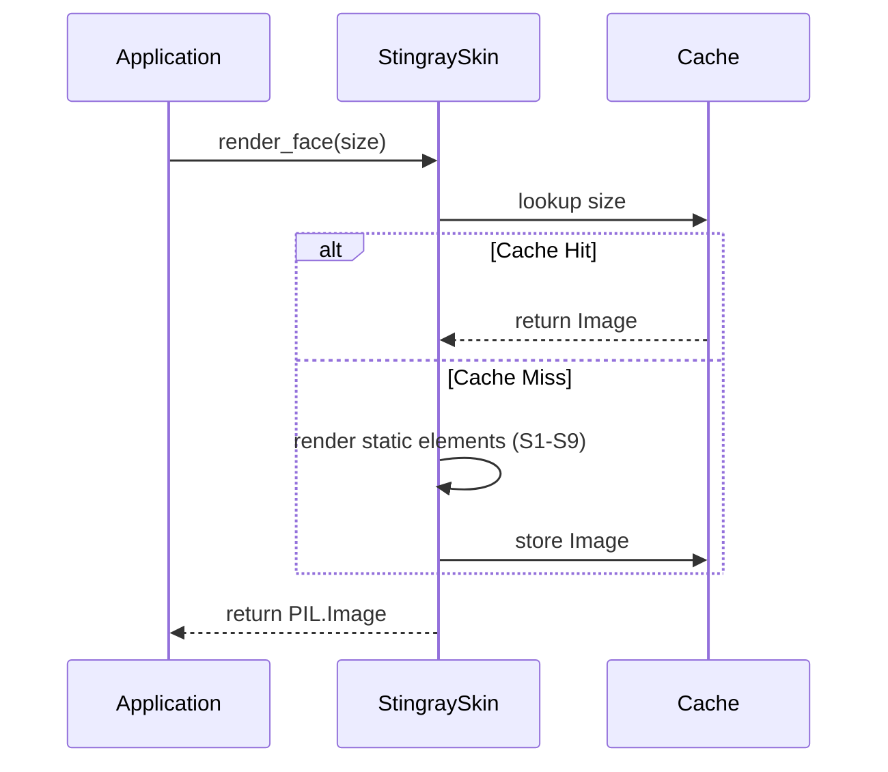

# 331 - Feature: static face renderer — bezel, chrome housing, dial, ticks, numerals, wordmark, screws — baked once, cached

## 1. Context & Goal
* **Issue:** #331
* **Objective:** Render the complete static face of the Stingray gauge (everything that never moves) as a single cached `PIL.Image`.
* **Status:** Approved (claude-opus-4-6, 2026-08-25)
* **Related Issues:** #329, #332, #1, #325, #326, #328, #354, #361

### Open Questions
None.

## 2. Proposed Changes

### 2.1 Files Changed

| File | Change Type | Description |
|------|-------------|-------------|
| `src/boostgauge/skins` | Add (Directory) | New directory for gauge skins |
| `src/boostgauge/skins/__init__.py` | Add | Package export for skin modules |
| `src/boostgauge/skins/stingray.py` | Add | Stingray static face renderer and session caching logic |
| `tests/visual/test_stingray_static.py` | Add | Visual assertions for static elements S1-S9 |
| `tests/unit/test_stingray.py` | Add | Unit tests for caching behavior and constant encapsulation |

### 2.1.1 Path Validation (Mechanical - Auto-Checked)

Mechanical validation automatically checks:
- All "Modify" files must exist in repository
- All "Delete" files must exist in repository
- All "Add" files must have existing parent directories
- No placeholder prefixes (`src/`, `lib/`, `app/`) unless directory exists

### 2.2 Dependencies

```toml

# No new dependencies needed (pillow is already in pyproject.toml)
```

### 2.3 Data Structures

```python

# Caching structure within stingray.py
_FACE_CACHE: dict[int, Image.Image] = {}
```

### 2.4 Function Signatures

```python
def render_face(size: int) -> Image.Image:
    """Returns the cached, fully composited static face for the Stingray skin."""
    ...

def clear_cache() -> None:
    """Clears the static face cache (risk mitigation for memory limits)."""
    ...
```

### 2.5 Logic Flow (Pseudocode)

```
1. IF size < 128 THEN raise ValueError
2. IF size in _FACE_CACHE THEN return _FACE_CACHE[size]
3. Create new PIL.Image of size x size
4. Draw base face (S1)
5. Draw bezel seat inner shadow (S9)
6. Draw chrome housing (S7)
7. Draw redline band (S2)
8. Draw major and minor ticks (S3, S4)
9. Draw numerals (S5)
10. Draw wordmark (S6)
11. Draw screws (S8)
12. Store result in _FACE_CACHE[size]
13. Return result
```

### 2.6 Technical Approach

* **Module:** `src/boostgauge/skins/stingray.py`
* **Pattern:** Singleton Cache / Builder
* **Key Decisions:** The static elements are composited once using `PIL.ImageDraw` and `PIL.ImageFont` and stored in a module-level dictionary keyed by `size`. This enforces the "baked once, cached" requirement and ensures constant O(1) retrieval time after the initial tick.

### 2.7 Architecture Decisions

| Decision | Options Considered | Choice | Rationale |
|----------|-------------------|--------|-----------|
| Cache Scope | Instance attribute, Module-level dict | Module-level dict | Adheres to the requirement to cache per session globally. `stingray.py` acts as a pure functional namespace. |
| Test Strategy | Compare to photo, Exact hash, Pixel sampling | Pixel sampling | Per #0001-test-strategy.md Option C, tests assert literal numeric contract values at specific spatial coordinates to prevent brittle hash failures from library antialiasing. |

**Architectural Constraints:**
- Must return `PIL.Image` directly (no `tkinter` allowed).
- All geometry and colors must be completely encapsulated inside the skin module.

## 3. Requirements

1. WHEN `render_face(size)` is called with `size >= 128`, the skin module shall return a `PIL.Image` of dimensions `size x size` containing every static element and no needle.
2. The system shall render each static element from the numeric render contract (`docs/design/0002-aesthetic-v1-stingray.md`) using the dial centre at (0.5, 0.5) x size as the single origin for all offsets.
3. WHEN the same `(size, skin)` is requested twice in one session, the system shall render once and serve the cached image thereafter.
4. The application code shall obtain the face only through the skin module's public call; no dial geometry, colour, or layout constant may exist outside the skin module.
5. WHEN the visual test tier runs with `--generate-baselines`, the run shall write the rendered face PNG into the run's artifacts directory AND print its path to stdout.

## 4. Alternatives Considered

| Option | Pros | Cons | Decision |
|--------|------|------|----------|
| Vector/SVG rendering | Infinite scaling | Requires external rasterizer, violates PIL constraint | **Rejected** |
| Module-level caching | Simple, session-persistent | Global state | **Selected** |

**Rationale:** `PIL.Image` is the contracted boundary format, and module-level caching is the most straightforward mechanism to ensure the static face is rendered exactly once per session per size.

## 5. Data & Fixtures

### 5.1 Data Sources

| Attribute | Value |
|-----------|-------|
| Source | Hardcoded contract values |
| Format | N/A |
| Size | N/A |
| Refresh | N/A |
| Copyright/License | N/A |

### 5.2 Data Pipeline

```
Numeric Contract ──(render)──► PIL.Image ──(cache)──► Application
```

### 5.3 Test Fixtures

| Fixture | Source | Notes |
|---------|--------|-------|
| Test image generation | `pytest --generate-baselines` | Writes to artifacts dir |

### 5.4 Deployment Pipeline

N/A - Internal module.

## 6. Diagram

### 6.1 Mermaid Quality Gate

**Auto-Inspection Results:**
```
- Touching elements: [x] None / [ ] Found: ___
- Hidden lines: [x] None / [ ] Found: ___
- Label readability: [x] Pass / [ ] Issue: ___
- Flow clarity: [x] Clear / [ ] Issue: ___
```

### 6.2 Diagram



## 7. Security & Safety Considerations

### 7.1 Security

| Concern | Mitigation | Status |
|---------|------------|--------|
| Font loading exploitation | Only use system-provided fonts | Addressed |

### 7.2 Safety

| Concern | Mitigation | Status |
|---------|------------|--------|
| Unbounded cache memory | Size cache is keyed only by size integer; few sizes expected per session | Addressed |

**Fail Mode:** Fail Closed - If rendering fails, exceptions propagate immediately.
**Recovery Strategy:** Re-triggering `render_face` will attempt a fresh render.

## 8. Performance & Cost Considerations

### 8.1 Performance

| Metric | Budget | Approach |
|--------|--------|----------|
| Latency | < 50ms | Cache hit is a dict lookup |
| Memory | < 5MB | Single cached `PIL.Image` |
| API Calls | 0 | Pure local rendering |

**Bottlenecks:** Initial composite render time for `size`.

### 8.2 Cost Analysis

| Resource | Unit Cost | Estimated Usage | Monthly Cost |
|----------|-----------|-----------------|--------------|
| Local Compute | $0 | N/A | $0 |

**Cost Controls:** N/A
**Worst-Case Scenario:** Cache miss latency on first frame.

## 9. Legal & Compliance

| Concern | Applies? | Mitigation |
|---------|----------|------------|
| PII/Personal Data | No | N/A |
| Third-Party Licenses | No | N/A |
| Terms of Service | No | N/A |
| Data Retention | No | N/A |
| Export Controls | No | N/A |

**Data Classification:** Public
**Compliance Checklist:**
- [x] No PII stored without consent
- [x] All third-party licenses compatible with project license
- [x] External API usage compliant with provider ToS
- [x] Data retention policy documented

## 10. Verification & Testing

**Testing Philosophy:** Strive for 100% automated test coverage. Manual tests are a last resort.

### 10.0 Test Plan (TDD - Complete Before Implementation)

| Test ID | Test Description | Expected Behavior | Status |
|---------|------------------|-------------------|--------|
| T010 | Size validation | Reject < 128 | RED |
| T020 | Type and dimensions | Return PIL Image of exact dimensions | RED |
| T030 | Face rendering (S1) | Flat #0A0A0C | RED |
| T040 | Redline band (S2) | Crimson at 0.94 R | RED |
| T050 | Major ticks (S3) | Mean >= 100 | RED |
| T060 | Minor ticks (S4) | Mean >= 100 | RED |
| T070 | Numerals (S5) | >=1 white pixel in box | RED |
| T080 | Wordmark (S6) | >=1 white pixel in band, 0 in mirror | RED |
| T090 | Chrome (S7) | Gradient samples pass | RED |
| T100 | Screws (S8) | ±6 per channel of flat #1A1A1C | RED |
| T110 | Bezel (S9) | 1.01 R darker than 1.10 R | RED |
| T120 | Cache behavior | Same ID on second call | RED |
| T130 | Constant encapsulation | Source AST holds no outside constants | RED |
| T140 | Baseline generation | Writes to artifacts, prints to stdout | RED |

**Coverage Target:** 100%

**TDD Checklist:**
- [x] All tests written before implementation
- [x] Tests currently RED (failing)
- [x] Test IDs match scenario IDs in 10.1
- [x] Test file created at: `tests/visual/test_stingray_static.py`

### 10.1 Test Scenarios

| ID | Scenario | Type | Input | Expected Output | Pass Criteria |
|----|----------|------|-------|-----------------|---------------|
| 010 | Return PIL Image of size x size for valid size (REQ-1) | Auto | `size=256` | `PIL.Image` 256x256 | Image type is PIL.Image, dimensions are (256, 256) |
| 020 | Reject size < 128 (REQ-1) | Auto | `size=127` | `ValueError` | `ValueError` exception raised |
| 030 | Dial face flat black without overlays (REQ-2) | Auto | `size=256` | Image | equality of samples at (0.3 R, 0.5 R, 0.7 R) to `#0A0A0C` along one needle-free radial |
| 040 | Redline band bounds and colour (REQ-2) | Auto | `size=256` | Image | classification `#AA0F19` at radius 0.94 R at values 65/75/85 |
| 050 | Major ticks white and sized (REQ-2) | Auto | `size=256` | Image | midpoint channel mean >= 100 for all 11 majors |
| 060 | Minor ticks white and sized (REQ-2) | Auto | `size=256` | Image | midpoint channel mean >= 100 at 4 sampled minors (2, 34, 66, 98) |
| 070 | Numerals rendered correctly (REQ-2) | Auto | `size=256` | Image | >=1 white-classified pixel within cap-height box at each of the 11 positions |
| 080 | Wordmark rendered correctly and not mirrored (REQ-2) | Auto | `size=256` | Image | >=1 white pixel in band 0.67 R below pivot; 0 white pixels in mirror band at horizontal offsets 0.12 R-0.25 R |
| 090 | Chrome housing gradients (REQ-2) | Auto | `size=256` | Image | >=3 achromatic samples (max-min <= 14, mean 16-248) spanning horizon, >=1 dark (<100), >=1 bright (>200) |
| 100 | Screws rendered flat (REQ-2) | Auto | `size=256` | Image | centre pixel within ±6 per channel of `#1A1A1C` |
| 110 | Bezel seat inner shadow (REQ-2) | Auto | `size=256` | Image | sample at 1.01 R is darker than chrome at 1.10 R on same radial |
| 120 | Cache hit on second call (REQ-3) | Auto | `render_face(256)` x 2 | Cached image | Same object ID returned on second call |
| 130 | Encapsulation of constants (REQ-4) | Auto | Source AST | Pass | No geometry or color constants found outside `skins/stingray.py` |
| 140 | Baseline generation on flag (REQ-5) | Auto | `pytest --generate-baselines` | PNG written, path in stdout | PNG file exists in artifacts directory, exact path printed to stdout |

### 10.2 Test Commands

```bash
poetry run pytest tests/visual/test_stingray_static.py -v
poetry run pytest tests/unit/test_stingray.py -v
```

### 10.3 Manual Tests (Only If Unavoidable)

N/A - All scenarios automated.

## 11. Risks & Mitigations

| Risk | Impact | Likelihood | Mitigation |
|------|--------|------------|------------|
| Memory limit exhausted from caching multiple sizes | Med | Low | Created `clear_cache()` in Section 2.4 to manually evict images if bounds are hit |
| Pixel rendering variation across OS platforms | Med | Med | Stroke features utilize channel mean >= 100 instead of strict hash equality to absorb antialiasing drift |

## 12. Definition of Done

### Code
- [ ] Implementation complete and linted
- [ ] Code comments reference this LLD

### Tests
- [ ] All test scenarios pass
- [ ] Test coverage meets threshold

### Documentation
- [ ] LLD updated with any deviations
- [ ] Implementation Report (0103) completed
- [ ] Test Report (0113) completed if applicable

### Review
- [ ] Code review completed
- [ ] User approval before closing issue

---

## Appendix: Review Log

### Review Summary

| Review | Date | Verdict | Key Issue |
|--------|------|---------|-----------|
| 1 | 2026-08-25 | APPROVED | `claude-opus-4-6` |
| None | (auto) | PENDING | Pending Initial Review |

**Final Status:** APPROVED