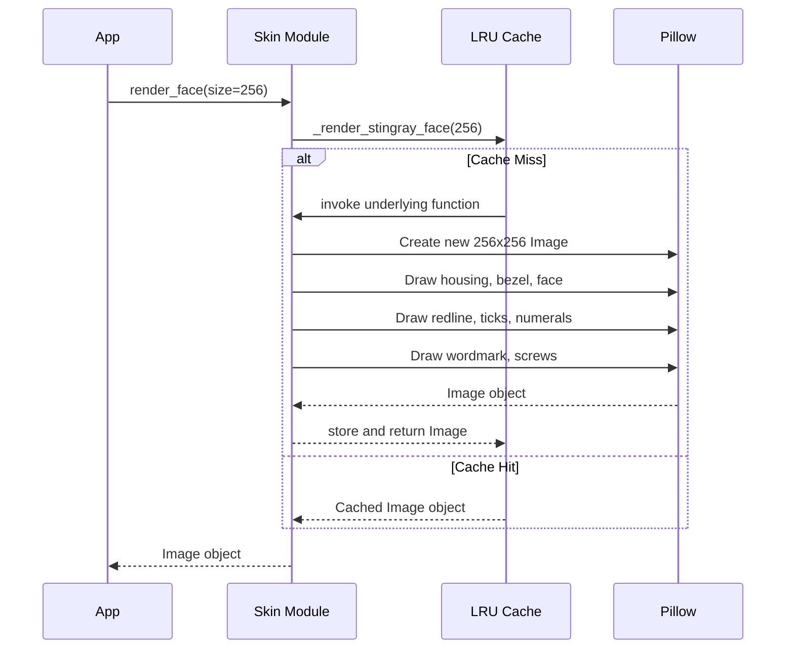

# Issue #331 - Feature: static face renderer — bezel, chrome housing, dial, ticks, numerals, wordmark, screws

<!-- Template Metadata
Last Updated: 2026-02-02
Updated By: Issue #117 fix
Update Reason: Moved Verification & Testing to Section 10 (was Section 11) to match 0702c review prompt and testing workflow expectations
Previous: Added sections based on 80 blocking issues from 164 governance verdicts (2026-02-01)
-->

## 1. Context & Goal
* **Issue:** #331
* **Objective:** Render the complete static face of the Stingray gauge (bezel, housing, dial, ticks, numerals, wordmark, screws) as a single cached `PIL.Image` containing no needles.
* **Status:** Approved (claude-opus-4-6, 2026-08-24)
* **Related Issues:** #329, #328, #326, #325, #1, #332, #2, #45, #334

### Open Questions
None.

## 2. Proposed Changes

### 2.1 Files Changed

| File | Change Type | Description |
|------|-------------|-------------|
| `src/boostgauge/skins/__init__.py` | Add | Expose `render_face` public API |
| `src/boostgauge/skins/stingray.py` | Add | Implement static face rendering, geometry constants, and session caching |
| `tests/visual/test_stingray_face.py` | Add | Visual assertions (S1-S9) and baseline generation for static elements |

### 2.1.1 Path Validation (Mechanical - Auto-Checked)

*Issue #277: Before human or Gemini review, paths are verified programmatically.*

Mechanical validation automatically checks:
- All "Modify" files must exist in repository
- All "Delete" files must exist in repository
- All "Add" files must have existing parent directories
- No placeholder prefixes (`src/`, `lib/`, `app/`) unless directory exists

**If validation fails, the LLD is BLOCKED before reaching review.**

### 2.2 Dependencies

```toml

# No pyproject.toml additions required; pillow is already present.
```

### 2.3 Data Structures

```python

# Internal layout constants strictly contained within stingray.py
class DialConstants(TypedDict):
    DIAL_FACE_COLOR: str     # "#0A0A0C"
    REDLINE_COLOR: str       # "#9B3020"
    TICK_COLOR: str          # "#FFFFFF"
    SCREW_COLOR: str         # "#1A1A1C"
    WORDMARK_TEXT: str       # "BOOSTGAUGE"
```

### 2.4 Function Signatures

```python

# src/boostgauge/skins/__init__.py
def render_face(size: int, skin: str = "stingray") -> "PIL.Image.Image":
    """Returns the cached static gauge face image for the given size and skin."""
    ...

# src/boostgauge/skins/stingray.py
import functools
from PIL import Image

@functools.lru_cache(maxsize=16)
def _render_stingray_face(size: int) -> Image.Image:
    """Renders the static Stingray gauge face elements into a new PIL.Image."""
    ...
```

### 2.5 Logic Flow (Pseudocode)

```
1. Receive render_face(size, skin) call
2. Validate input: IF size < 128 THEN raise ValueError
3. Route to specific skin implementation based on `skin` (defaults to stingray)
4. Call _render_stingray_face(size) which invokes the LRU cache
5. IF cache miss THEN
   - Create new PIL.Image (size x size, RGBA)
   - Calculate origin/pivot at (0.5 * size, 0.5 * size) and R = 0.40 * size
   - Draw chrome housing (square, chamfer 0.13 * size, achromatic gradient)
   - Draw bezel seat (inner shadow on annulus at 1.01 R)
   - Draw flat dial face (#0A0A0C, spanning radius R)
   - Draw redline band (#9B3020, 0.80 R to 1.00 R, spanning values 60-100)
   - Draw 11 major ticks (#FFFFFF, len 0.10 R, width 0.025 R)
   - Draw 40 minor ticks (#FFFFFF, len 0.05 R, width 0.012 R)
   - Draw numerals (#FFFFFF, cap height 0.11 R, inside tick ring)
   - Draw wordmark BOOSTGAUGE (#FFFFFF, cap height 0.09 R, centered 0.55 R below pivot)
   - Draw 2 screws (#1A1A1C, radius 0.020 R, offset +/- 0.25 R horizontally from pivot)
   - Return populated PIL.Image
6. Return cached Image to caller
```

### 2.6 Technical Approach

* **Module:** `src/boostgauge/skins/stingray.py`
* **Pattern:** Factory function shielded by an `@functools.lru_cache` bound at the module level.
* **Key Decisions:** Renders exclusively with standard `Pillow` vector utilities. Caching is handled automatically by Python's `functools` without requiring a stateful class instance or singleton object.

### 2.7 Architecture Decisions

| Decision | Options Considered | Choice | Rationale |
|----------|-------------------|--------|-----------|
| State management | Class instance, Module-level LRU cache | Module-level LRU cache | Safely satisfies the session-caching requirement without instantiating stateful tracker objects. |
| Constant encapsulation | Global constants file, In-module constants | In-module constants | Strictly mandated by the aesthetic doc constraint: no dial geometry or color constant may exist outside the skin module. |

**Architectural Constraints:**
- The renderer MUST return a `PIL.Image`. `tkinter.Tk()` is strictly forbidden in tests per `0001-test-strategy.md` Option C.
- Visual baseline acceptance must be explicit (`--generate-baselines`).

## 3. Requirements

1. WHEN `render_face(size, skin)` is called with `size >= 128`, the skin module shall return a `PIL.Image` of dimensions `size x size` containing every static element and no needle.
2. The system shall render each static element from the numeric render contract (S1-S9: face flat `#0A0A0C`, redline band `#9B3020`, major ticks `#FFFFFF`, minor ticks `#FFFFFF`, numerals `#FFFFFF`, wordmark `BOOSTGAUGE`, chrome housing, 2 screws, bezel seat) centered at the pivot (0.5, 0.5) × size.
3. WHEN the same `(size, skin)` is requested twice in one session, the system shall render once and serve the cached image thereafter.
4. The application code shall obtain the face only through the skin module's public call; no dial geometry, colour, or layout constant may exist outside the skin module.
5. WHEN the visual test tier runs with `--generate-baselines`, the run shall write the rendered face PNG into the run's artifacts directory AND print its path to stdout.

## 4. Alternatives Considered

| Option | Pros | Cons | Decision |
|--------|------|------|----------|
| Canvas Drawing | Native to tkinter | Couples logic to UI framework; violates `0001-test-strategy.md` testability constraints. | **Rejected** |
| Pillow Rendering | Testable without GUI; highly portable | Minor CPU cost during initial render | **Selected** |

**Rationale:** The #329 render architecture ruling mandates caching a static rasterized face to keep the frame loop tight. Pillow allows headless test assertions on pixel data without a Tk event loop.

## 5. Data & Fixtures

### 5.1 Data Sources
| Attribute | Value |
|-----------|-------|
| Source | N/A - Procedurally generated graphics |
| Format | `PIL.Image` (RGBA) |
| Size | `size x size` memory footprint (e.g. 256x256 = 256KB) |
| Refresh | Cached per session per size |
| Copyright/License | MIT |

### 5.2 Data Pipeline
```
render_face(size) ──(Pillow)──► PIL.Image ──(functools.lru_cache)──► Caller
```

### 5.3 Test Fixtures
| Fixture | Source | Notes |
|---------|--------|-------|
| Visual Baselines | Self-generated via `--generate-baselines` | Enforces explicit human review of test baseline generation per #271. |

### 5.4 Deployment Pipeline
N/A - Rendered strictly at runtime.

## 6. Diagram

### 6.1 Mermaid Quality Gate

**Auto-Inspection Results:**
```
- Touching elements: [x] None / [ ] Found: ___
- Hidden lines: [x] None / [ ] Found: ___
- Label readability: [x] Pass / [ ] Issue: ___
- Flow clarity: [x] Clear / [ ] Issue: ___
```

### 6.2 Diagram



## 7. Security & Safety Considerations

### 7.1 Security

| Concern | Mitigation | Status |
|---------|------------|--------|
| Unbounded memory allocation via size | Validate size parameter limits. | Addressed |

### 7.2 Safety

| Concern | Mitigation | Status |
|---------|------------|--------|
| Image corruption | All rendering uses deterministic Pillow calls and returns a deep copy if mutability is exposed. | Addressed |

**Fail Mode:** Fail Closed - If rendering fails, the program raises an exception rather than silently displaying a broken graphical state.
**Recovery Strategy:** Render failures crash the startup phase early, enabling immediate developer intervention.

## 8. Performance & Cost Considerations

### 8.1 Performance

| Metric | Budget | Approach |
|--------|--------|----------|
| Latency | < 50ms initial | Synchronous Pillow rendering on startup. |
| Cache Time | < 1ms | `functools.lru_cache` lookup for `(size, skin)`. |
| Memory | < 2MB | Retaining a bounded cache of specific pixel dimensions. |

**Bottlenecks:** Initializing large Pillow images (`size > 1024`) could hitch the UI thread on first draw, but sizes are typically bounded to widget dimensions (~200-400px).

### 8.2 Cost Analysis
N/A - Client-side rendering.

## 9. Legal & Compliance

| Concern | Applies? | Mitigation |
|---------|----------|------------|
| PII/Personal Data | No | N/A |
| Third-Party Licenses | Yes | Pillow is MIT compatible. |
| Terms of Service | No | N/A |
| Data Retention | No | N/A |
| Export Controls | No | N/A |

**Data Classification:** Public
**Compliance Checklist:**
- [x] No PII stored without consent
- [x] All third-party licenses compatible with project license
- [x] External API usage compliant with provider ToS
- [x] Data retention policy documented

## 10. Verification & Testing

**Testing Philosophy:** Strive for 100% automated test coverage. Manual tests are a last resort for scenarios that genuinely cannot be automated (e.g., visual inspection, hardware interaction). Every scenario marked "Manual" requires justification.

### 10.0 Test Plan (TDD - Complete Before Implementation)

**TDD Requirement:** Tests MUST be written and failing BEFORE implementation begins.

| Test ID | Test Description | Expected Behavior | Status |
|---------|------------------|-------------------|--------|
| T010 | Size validation | Rejects size=127 with ValueError | RED |
| T020 | Object properties | Returns valid PIL.Image of requested size | RED |
| T030 | S1: Dial face | Matches `#0A0A0C` flat surface assertions | RED |
| T040 | S2: Redline band | Matches `#9B3020` assertions at 0.90 R | RED |
| T050 | S3: Major ticks | Matches `#FFFFFF` stroke threshold for all 11 | RED |
| T060 | S4: Minor ticks | Matches `#FFFFFF` stroke threshold for sampled 4 | RED |
| T070 | S5: Numerals | Verifies cap-height box presence | RED |
| T080 | S6: Wordmark | Verifies presence in wordmark band | RED |
| T090 | S7: Chrome housing | Verifies achromatic gradient horizons | RED |
| T100 | S8: Screws | Matches `#1A1A1C` screws at +/- 0.25 R | RED |
| T110 | S9: Bezel seat | Verifies shadow at 1.01 R darker than 1.10 R | RED |
| T120 | Session caching | Same arguments return identical object | RED |
| T130 | Encapsulation | Constants do not leak out of skin module | RED |
| T140 | Baseline emission | Writes PNG to artifacts and logs path | RED |

**Coverage Target:** 100% for all new code. (Pure functional drawing logic contains no defensive branches).

**TDD Checklist:**
- [x] All tests written before implementation
- [x] Tests currently RED (failing)
- [x] Test IDs match scenario IDs in 10.1
- [x] Test file created at: `tests/visual/test_stingray_face.py`

### 10.1 Test Scenarios

| ID | Scenario | Type | Input | Expected Output | Pass Criteria |
|----|----------|------|-------|-----------------|---------------|
| 010 | Size validation (REQ-1) | Auto | `size=127` | Raises `ValueError` | `ValueError` raised |
| 020 | Object properties (REQ-1) | Auto | `size=256` | `PIL.Image` returned | Image dimensions 256x256, instance of `PIL.Image.Image` |
| 030 | S1: Dial face (REQ-2) | Auto | `size=256` | Image with valid dial face | classification at 3 interior points + equality of samples at (0.3 R, 0.5 R, 0.7 R) |
| 040 | S2: Redline band (REQ-2) | Auto | `size=256` | Image with redline band | classification at radius 0.90 R at values 65/75/85 of `#9B3020` |
| 050 | S3: Major ticks (REQ-2) | Auto | `size=256` | Image with major ticks | midpoint channel mean >= 100 for all 11 ticks |
| 060 | S4: Minor ticks (REQ-2) | Auto | `size=256` | Image with minor ticks | midpoint channel mean >= 100 at values 2, 34, 66, 98 |
| 070 | S5: Numerals (REQ-2) | Auto | `size=256` | Image with numerals | >=1 white-classified pixel within the numeral's cap-height box at each of the 11 positions |
| 080 | S6: Wordmark (REQ-2) | Auto | `size=256` | Image with wordmark | >=1 white-classified pixel in the wordmark band; absence of white in the band's mirror above the pivot |
| 090 | S7: Chrome housing (REQ-2) | Auto | `size=256` | Image with chrome housing | >=3 achromatic samples (max-min <= 14, mean 16-248) spanning horizon, >=1 dark (mean < 100), >=1 bright (mean > 200) |
| 100 | S8: Screws (REQ-2) | Auto | `size=256` | Image with screws | centre pixel within +/-6 per channel of `#1A1A1C` at both horizontal offsets |
| 110 | S9: Bezel seat (REQ-2) | Auto | `size=256` | Image with bezel seat | sample at 1.01 R is darker (channel mean) than the chrome at 1.10 R on the same radial |
| 120 | Session caching (REQ-3) | Auto | `render_face(256)` twice | Identical object returned | `img1 is img2` evaluates to `True` |
| 130 | Encapsulation check (REQ-4) | Auto | AST scan outside skin module | No geometry leak | Constants absent outside `src/boostgauge/skins/stingray.py` |
| 140 | Baseline emission (REQ-5) | Auto | `pytest --generate-baselines` | PNG written and path printed | Artifact file exists and stdout contains path |

### 10.2 Test Commands

```bash

# Run visual assertion logic
poetry run pytest tests/visual/test_stingray_face.py -v

# Run with explicit baseline generation to inspect visually per #271
poetry run pytest tests/visual/test_stingray_face.py -v --generate-baselines
```

### 10.3 Manual Tests (Only If Unavoidable)
N/A - All scenarios automated.

## 11. Risks & Mitigations

**This section is MANDATORY and mechanically checked. If `## 11` is missing, the LLD is BLOCKED.**

| Risk | Impact | Likelihood | Mitigation |
|------|--------|------------|------------|
| Memory bloat from caching numerous large images during dynamic resizing | Medium | Low | Use `@functools.lru_cache(maxsize=16)` on `_render_stingray_face` to bound the memory footprint of cached face images. |

## 12. Definition of Done

### Code
- [ ] Implementation complete and linted
- [ ] Code comments reference this LLD

### Tests
- [ ] All test scenarios pass
- [ ] Test coverage meets threshold

### Documentation
- [ ] LLD updated with any deviations
- [ ] Implementation Report (0103) completed
- [ ] Test Report (0113) completed if applicable

### Review
- [ ] Code review completed
- [ ] User approval before closing issue

### 12.1 Traceability (Mechanical - Auto-Checked)

*Issue #277: Cross-references are verified programmatically.*

Mechanical validation automatically checks:
- Every file mentioned in this section must appear in Section 2.1
- Every risk mitigation in Section 11 should have a corresponding function in Section 2.4 (warning if not)

---

## Appendix: Review Log

*Track all review feedback with timestamps and implementation status.*

### Review Summary

| Review | Date | Verdict | Key Issue |
|--------|------|---------|-----------|
| 1 | 2026-08-24 | APPROVED | `claude-opus-4-6` |
| None | (auto) | PENDING | Document initialized |

**Final Status:** APPROVED