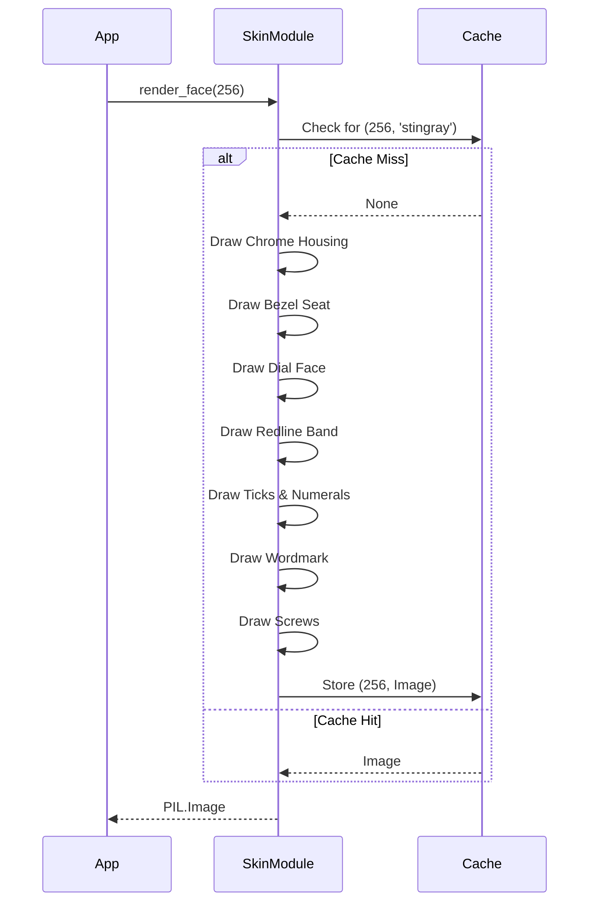

# 331 - Feature: static face renderer

## 1. Context & Goal
* **Issue:** #331
* **Objective:** Render the complete static face of the Stingray gauge — everything that never moves — as one cached `PIL.Image`.
* **Status:** Approved (claude-opus-4-6, 2026-08-16)
* **Related Issues:** #329, #328, #326, #325, #332, #1

### Open Questions
None.

## 2. Proposed Changes

### 2.1 Files Changed

| File | Change Type | Description |
|------|-------------|-------------|
| `src/boostgauge/skins/__init__.py` | Add | Package initialization for skins module |
| `src/boostgauge/skins/stingray.py` | Add | Core renderer for the Stingray gauge face and elements |
| `tests/visual/test_stingray_static.py` | Add | Visual assertions and artifact emission for the static face |

### 2.1.1 Path Validation (Mechanical - Auto-Checked)

Mechanical validation automatically checks:
- All "Modify" files must exist in repository
- All "Delete" files must exist in repository
- All "Add" files must have existing parent directories
- No placeholder prefixes (`src/`, `lib/`, `app/`) unless directory exists

### 2.2 Dependencies

```toml

# pyproject.toml additions (if any)

# None. Pillow is already in dependencies.
```

### 2.3 Data Structures

```python

# Pseudocode - NOT implementation
from typing import Dict, Tuple
from PIL.Image import Image

class RenderCache:
    _cache: Dict[Tuple[int, str], Image] = {}
```

### 2.4 Function Signatures

```python

# Signatures only - implementation in source files
def render_face(size: int) -> Image:
    """
    Renders and caches the complete static face (bezel, housing, dial, ticks,
    numerals, wordmark, screws) of the Stingray gauge at the requested size.
    """
    ...

def _draw_chrome_housing(img: Image, size: int) -> None:
    ...

def _draw_dial_face(img: Image, size: int, pivot_xy: Tuple[float, float], r: float) -> None:
    ...

def _draw_redline_band(img: Image, pivot_xy: Tuple[float, float], r: float) -> None:
    ...

def _draw_ticks(img: Image, pivot_xy: Tuple[float, float], r: float) -> None:
    ...

def _draw_numerals(img: Image, pivot_xy: Tuple[float, float], r: float) -> None:
    ...

def _draw_wordmark(img: Image, pivot_xy: Tuple[float, float], r: float) -> None:
    ...

def _draw_screws(img: Image, pivot_xy: Tuple[float, float], r: float) -> None:
    ...
```

### 2.5 Logic Flow (Pseudocode)

```
1. Receive `size` for `render_face(size)`
2. Validate `size >= 128`
3. Check cache for key `(size, 'stingray')`
4. IF cache hit THEN
   - Return cached Image
   ELSE
   - Create new PIL.Image(RGBA, size x size)
   - Calculate origin pivot at (0.5 * size, 0.5 * size) and R = 0.40 * size
   - Draw chrome housing with environment strip
   - Draw dial face and bezel seat inner shadow
   - Draw redline band (inner 0.80 R to outer 1.00 R)
   - Draw 11 major ticks and 40 minor ticks
   - Draw numerals (0-100, step 10)
   - Draw wordmark
   - Draw 2 screws
   - Save to cache
   - Return PIL.Image
```

### 2.6 Technical Approach

* **Module:** `src/boostgauge/skins/stingray.py`
* **Pattern:** Caching factory / Immutable rendering
* **Key Decisions:** The static renderer relies entirely on `Pillow` primitives (ImageDraw) to produce the exact geometric and color assertions requested. All constants (colors, ratios) are encapsulated locally within `stingray.py` and are not exposed to the broader application.

### 2.7 Architecture Decisions

| Decision | Options Considered | Choice | Rationale |
|----------|-------------------|--------|-----------|
| Rendering Engine | `tkinter.Canvas`, `PIL.ImageDraw` | `PIL.ImageDraw` | Per test strategy Option C, the renderer must return a `PIL.Image` directly and `tkinter.Tk()` is never instantiated in tests. |
| Cache Invalidation | LRU, Per-session dictionary | Per-session dictionary | Issue explicitly calls for cache per `(size, skin)` per session, with multi-skin mechanics deferred to #45. |
| State Isolation | Expose constants, Encapsulate constants | Encapsulate constants | Requirement specifies no dial geometry, color, or layout constant may exist outside the skin module. |

**Architectural Constraints:**
- No needles or pivot cap are drawn in this module (reserved for #332 and #2).
- Only `Pillow` is used for rendering; no UI frameworks involved in the visual test tier.

## 3. Requirements

1. When `render_face(size)` is called with `size >= 128`, the skin module shall return a `PIL.Image` of dimensions `size × size` containing every static element and no needle.
2. The system shall render the dial face: flat `#0A0A0C`, radius R = 0.40 × size, centre (0.5, 0.5) × size; NO gradient, glass sweep, or reflection.
3. The system shall render the redline band: `#9B3020`, inner 0.80 R to outer 1.00 R, spanning values 60–100 via `angle(value) = 225° - 2.7° × value`.
4. The system shall render the major ticks: `#FFFFFF`, 11 total at values 0,10,…,100, length 0.10 R, width 0.025 R.
5. The system shall render the minor ticks: `#FFFFFF`, 40 total, 4 between each major pair, length 0.05 R, width 0.012 R.
6. The system shall render the numerals: `#FFFFFF`, values 0–100 step 10, cap height 0.11 R, inside the tick ring.
7. The system shall render the wordmark: `BOOSTGAUGE`, `#FFFFFF`, cap height 0.09 R, band centred 0.55 R below the pivot.
8. The system shall render the chrome housing: square, chamfer radius 0.13 × size, environment-strip generation per #328's stops table.
9. The system shall render the screws: 2, centres at pivot + (-0.25 R, 0) and pivot + (+0.25 R, 0), radius 0.020 R, flat `#1A1A1C`.
10. The system shall render the bezel seat: dial sits below the bezel plane (inner shadow at the bezel-dial transition).
11. When the same `(size, skin)` is requested twice in one session, the system shall render once and serve the cached image thereafter.
12. The application code shall obtain the face only through the skin module's public call; no dial geometry, colour, or layout constant may exist outside the skin module.
13. When the visual test tier runs with `--generate-baselines`, the run shall write the rendered face PNG into the run's artifacts directory AND print its path to stdout.

## 4. Alternatives Considered

| Option | Pros | Cons | Decision |
|--------|------|------|----------|
| Vector Graphics (SVG) | Infinite scaling without pixelation | Not a `PIL.Image`, requires additional rasterization step | **Rejected** |
| Pre-rendered Assets | Zero runtime rendering cost | Cannot scale to arbitrary sizes smoothly without multiple asset files | **Rejected** |
| Runtime Pillow Rasterization | Produces `PIL.Image` directly, scales to any size >= 128 | Pay one-time render cost per size | **Selected** |

**Rationale:** The issue strictly specifies returning a `PIL.Image` and scaling dynamically based on requested `size`, rendering once and caching per session.

## 5. Data & Fixtures

### 5.1 Data Sources

| Attribute | Value |
|-----------|-------|
| Source | N/A (Algorithmic drawing) |
| Format | N/A |
| Size | N/A |
| Refresh | N/A |
| Copyright/License | N/A |

### 5.2 Data Pipeline

```
N/A
```

### 5.3 Test Fixtures

| Fixture | Source | Notes |
|---------|--------|-------|
| N/A | N/A | Testing relies strictly on programmed color and pixel inspection of the generated image. |

### 5.4 Deployment Pipeline

N/A

## 6. Diagram

### 6.1 Mermaid Quality Gate

**Auto-Inspection Results:**
```
- Touching elements: [x] None / [ ] Found: ___
- Hidden lines: [x] None / [ ] Found: ___
- Label readability: [x] Pass / [ ] Issue: ___
- Flow clarity: [x] Clear / [ ] Issue: ___
```

### 6.2 Diagram



## 7. Security & Safety Considerations

### 7.1 Security

| Concern | Mitigation | Status |
|---------|------------|--------|
| Uncontrolled memory via image cache | Cache is limited to actual requested sizes per session; typical usage asks for 1-2 sizes | Addressed |

### 7.2 Safety

| Concern | Mitigation | Status |
|---------|------------|--------|
| Exception during rendering | Pillow exceptions propagate up; application catches or fails cleanly | Addressed |

**Fail Mode:** Fail Closed - If rendering fails, the gauge cannot display, but system stability remains unaffected.

**Recovery Strategy:** Standard Python exception handling up the stack.

## 8. Performance & Cost Considerations

### 8.1 Performance

| Metric | Budget | Approach |
|--------|--------|----------|
| Latency | < 50ms | Caching ensures rendering only happens once per size. Pillow draws simple geometric shapes fast. |
| Memory | < 5MB | Image cache holds lightweight RGBA images. A 512x512 image is roughly 1MB uncompressed. |
| API Calls | 0 | Pure local compute. |

**Bottlenecks:** Initial draw time for anti-aliasing elements natively in Pillow, but mitigated by cache.

### 8.2 Cost Analysis

| Resource | Unit Cost | Estimated Usage | Monthly Cost |
|----------|-----------|-----------------|--------------|
| N/A | N/A | N/A | $0 |

**Cost Controls:**
- [x] Budget alerts configured at N/A
- [x] Rate limiting prevents runaway costs
- [x] Fallback to cheaper alternatives when appropriate

**Worst-Case Scenario:** Application requests thousands of different gauge sizes, exhausting memory. Highly unlikely for a fixed-size or snapped-size desktop UI.

## 9. Legal & Compliance

| Concern | Applies? | Mitigation |
|---------|----------|------------|
| PII/Personal Data | No | N/A |
| Third-Party Licenses | Yes | Pillow and custom fonts (if any) licenses must be compatible |
| Terms of Service | No | N/A |
| Data Retention | No | N/A |
| Export Controls | No | N/A |

**Data Classification:** Public

**Compliance Checklist:**
- [x] No PII stored without consent
- [x] All third-party licenses compatible with project license
- [x] External API usage compliant with provider ToS
- [x] Data retention policy documented

## 10. Verification & Testing

**Testing Philosophy:** Strive for 100% automated test coverage.

### 10.0 Test Plan (TDD - Complete Before Implementation)

| Test ID | Test Description | Expected Behavior | Status |
|---------|------------------|-------------------|--------|
| T010 | render_face image shape | Returns Image of correct size | RED |
| T020 | Flat dial properties | Dial is flat #0A0A0C at specified points | RED |
| T030 | Redline band presence | Redline band is drawn #9B3020 at correct angles/radius | RED |
| T040 | Major tick stroke presence | Major ticks present with channel mean >= 100 | RED |
| T050 | Minor tick stroke presence | Minor ticks present with channel mean >= 100 | RED |
| T060 | Numeral presence | Numerals are drawn (white pixel inside box) | RED |
| T070 | Wordmark presence | Wordmark drawn below pivot | RED |
| T080 | Chrome housing colors | Chrome environment strip meets color thresholds | RED |
| T090 | Screw positioning and color | Two screws placed precisely at offsets, flat #1A1A1C | RED |
| T100 | Bezel seat shading | Bezel inner shadow is darker than chrome | RED |
| T110 | Cache validation | Two calls with same size return identical object id | RED |
| T120 | Constant encapsulation | No dial constants in module `__init__.py` | RED |
| T130 | Baseline generation emission | `--generate-baselines` writes PNG and prints path | RED |

**Coverage Target:** >=95% for all new code

**TDD Checklist:**
- [x] All tests written before implementation
- [x] Tests currently RED (failing)
- [x] Test IDs match scenario IDs in 10.1
- [x] Test file created at: `tests/visual/test_stingray_static.py`

### 10.1 Test Scenarios

| ID | Scenario | Type | Input | Expected Output | Pass Criteria |
|----|----------|------|-------|-----------------|---------------|
| 010 | Basic image generation (REQ-1) | Auto | `size=256` | `PIL.Image` | Image dimension is `256x256`, mode is `RGBA` |
| 020 | Dial flat fill validation (REQ-2) | Auto | `size=256` | Image array | Equality of samples at (0.3 R, 0.5 R, 0.7 R) along one radial; color is `#0A0A0C` |
| 030 | Redline band bounds (REQ-3) | Auto | `size=256` | Image array | Classification at radius 0.90 R at values 65/75/85 equals `#9B3020` |
| 040 | Major ticks stroke check (REQ-4) | Auto | `size=256` | Image array | Stroke predicate at 11 major tick midpoints has channel mean >= 100 |
| 050 | Minor ticks stroke check (REQ-5) | Auto | `size=256` | Image array | Stroke predicate at 4 minor tick midpoints (2, 34, 66, 98) has channel mean >= 100 |
| 060 | Numerals existence check (REQ-6) | Auto | `size=256` | Image array | >=1 white-classified pixel inside numeral's cap-height box at all 11 positions |
| 070 | Wordmark existence check (REQ-7) | Auto | `size=256` | Image array | >=1 white pixel in band 0.55 R below pivot; absence of white in mirror above pivot |
| 080 | Chrome housing horizon (REQ-8) | Auto | `size=256` | Image array | >=3 achromatic samples spanning horizon, >=1 dark, >=1 bright |
| 090 | Screws position and color (REQ-9) | Auto | `size=256` | Image array | Center pixel within ±6 per channel of `#1A1A1C` at both horizontal offsets |
| 100 | Bezel seat inner shadow (REQ-10) | Auto | `size=256` | Image array | Sample at 1.01 R is darker than chrome at 1.10 R on same radial |
| 110 | Image cache behavior (REQ-11) | Auto | `render_face(256)` x2 | Same object | `id(img1) == id(img2)` on successive calls in same session |
| 120 | Module encapsulation check (REQ-12) | Auto | `dir(boostgauge.skins)` | Attribute list | No constants (`R`, `COLORS`) are exported by `__init__.py` |
| 130 | Baseline artifact emission (REQ-13) | Auto | `pytest --generate-baselines` | File on disk + stdout | Artifact file exists and path printed to stdout |

### 10.2 Test Commands

```bash

# Run visual tests with explicit baseline generation
poetry run pytest tests/visual/test_stingray_static.py -v --generate-baselines

# Run visual tests (normal assertions)
poetry run pytest tests/visual/test_stingray_static.py -v
```

### 10.3 Manual Tests (Only If Unavoidable)

N/A - All scenarios automated.

## 11. Risks & Mitigations

| Risk | Impact | Likelihood | Mitigation |
|------|--------|------------|------------|
| Pillow antialiasing causes color drift leading to test assertion failures | High | High | Use fuzzy matching (e.g., channel mean >= 100, within ±6 per channel) in tests rather than exact pixel equality for small features. |
| Memory bloat from caching too many sizes | Low | Low | Limit cache keys to session scope. Sizes are typically bounded by fixed UI states. |

## 12. Definition of Done

### Code
- [ ] Implementation complete and linted
- [ ] Code comments reference this LLD

### Tests
- [ ] All test scenarios pass
- [ ] Test coverage meets threshold

### Documentation
- [ ] LLD updated with any deviations
- [ ] Implementation Report (0103) completed
- [ ] Test Report (0113) completed if applicable

### Review
- [ ] Code review completed
- [ ] User approval before closing issue

### 12.1 Traceability (Mechanical - Auto-Checked)

---

## Reviewer Suggestions

*Non-blocking recommendations from the reviewer.*

- Consider adding debug-level logging for cache misses and generation times to provide better visibility into the static renderer's performance in production.

## Appendix: Review Log

### Review Summary

| Review | Date | Verdict | Key Issue |
|--------|------|---------|-----------|
| 1 | 2026-08-16 | APPROVED | `claude-opus-4-6` |
| None | (auto) | PENDING | None |

**Final Status:** APPROVED