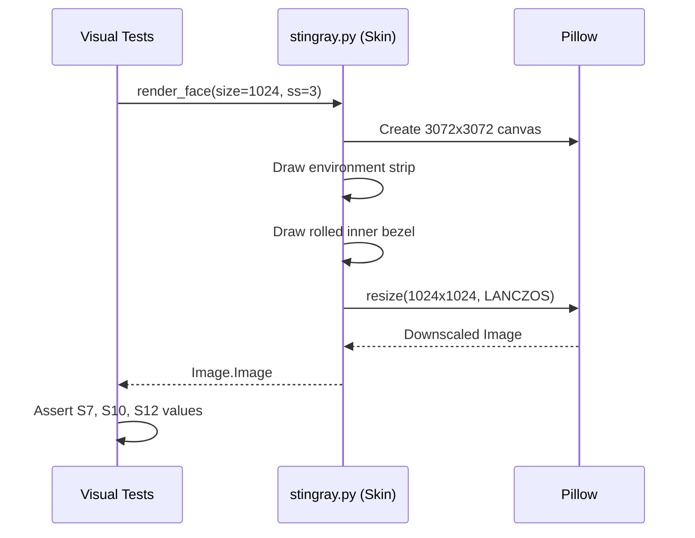

# Issue #379 - Feature: bezel ring, chrome horizon step, anti-aliased render

<!-- Template Metadata
Last Updated: 2026-02-02
Updated By: Issue #117 fix
Update Reason: Moved Verification & Testing to Section 10 (was Section 11) to match 0702c review prompt and testing workflow expectations
Previous: Added sections based on 80 blocking issues from 164 governance verdicts (2026-02-01)
-->

## 1. Context & Goal
* **Issue:** #379
* **Objective:** Fix three visual defects in the static face renderer (missing chrome bezel ring, flat grey ramp housing, and jagged angled edges) by implementing the rendering assertions in rows S7, S10, and S12.
* **Status:** Approved (claude-opus-4-6, 2026-08-30)
* **Related Issues:** #331, #328, #332, #375, #376, #377, #378

### Open Questions
None.

## 2. Proposed Changes

### 2.1 Files Changed

| File | Change Type | Description |
|------|-------------|-------------|
| `src/boostgauge/skins/stingray.py` | Modify | Update static renderer to generate mirrored environment strip, rolled inner bezel ring, and supersampling. |
| `tests/visual/test_stingray_static.py` | Modify | Add structural and pixel-level tests asserting S7, S10, and S12 criteria against the rendered image. |

### 2.1.1 Path Validation (Mechanical - Auto-Checked)

### 2.2 Dependencies

```toml

# pyproject.toml additions (if any)
```

### 2.3 Data Structures

```python

# No new data structures required; continues using primitive numeric types and PIL Image objects.
```

### 2.4 Function Signatures

```python
def render_face(size: int, values: dict, ss: int = 3) -> Image.Image:
    """Render the Stingray static face with supersampling and Lanczos downscaling."""
    ...

def _sample_fracs(values: dict) -> dict:
    """Compute anchor points ensuring boundaries like 1.24 R are respected."""
    ...
```

### 2.5 Logic Flow (Pseudocode)

```
1. Receive size, values, and supersampling factor (ss=3)
2. Compute render_size = size * ss
3. Compute radius R = 0.40 * render_size
4. Draw flat housing:
   - Generate environment strip (vertical mirror from top to bottom)
   - Sample strip directly into flat housing areas
5. Draw bezel ring (1.035 R to min(1.26 R, frame boundary)):
   - Calculate normal sweep across the ring
   - Map sweep angle to environment strip to compress the horizon step
6. Downscale rendered image back to target size using Image.Resampling.LANCZOS
7. Return Image.Image object
```

### 2.6 Technical Approach

* **Module:** `src/boostgauge/skins/stingray.py`
* **Pattern:** Procedural geometric rendering with target-size-independent supersampling
* **Key Decisions:** Implement an explicit vertical environment strip mapped directly for flats (S7) and mapped by depth for the rolled inner bezel (S10). Apply a uniform 3x supersample factor using `Image.Resampling.LANCZOS` during downscaling to smooth angled edges and boundaries (S12).

### 2.7 Architecture Decisions

| Decision | Options Considered | Choice | Rationale |
|----------|-------------------|--------|-----------|
| Anti-aliasing strategy | Native PIL geometry AA, Supersampling | Supersampling (3x + Lanczos) | Bound strictly by S12 ruling; ensures resolution independence. |
| GUI Testing Method | `tkinter.Tk()` rendering, `PIL.Image` comparison | `PIL.Image` returned directly | ADR 0001 / Strategy 0001 §3 mandates `tkinter` is never instantiated in tests. |

**Architectural Constraints:**
- The renderer must produce a `PIL.Image` directly.
- Cannot introduce new heavy GUI dependencies; stick to `pillow`.

## 3. Requirements

<!-- BEGIN MACHINE-OWNED: source decision table (#2607) -->

### 3.1 Source Decision Table (injected verbatim)

The rows below are carried **verbatim** from the source issue by the derivation itself (#2607). They are machine-owned: the drafter does not write them, and a revision cannot change them. Cite these IDs from the requirements and test-plan sections; do not restate their values.

| ID | Element | Binding value (quoted from the render contract) | Assertion method |
|---|---|---|---|
| S7 | Chrome housing + environment strip (restates #331's S7, strengthened) | square, chamfer radius 0.13 × size; environment-strip generation per #328's stops table; the strip is vertical — t = 0 at the frame top, 1 at the bottom; "the 0.485 → 0.500 transition is the horizon and MUST remain a step, never a ramp" | (a) chrome is verified by predicate, never nearest-entry (unchanged principle); the predicate applies to the flat-housing samples only — the ring is bound by S10's mean thresholds alone; at the flats: channel mean 16–248 and max−min ≤ 45, the strip's own maximum chroma being 42 at its t = 0.18 stop (ruled 2026-08-30: the former ≤ 14 is retired — it contradicts the contract's own stops table and the approved render's measured flats at chroma 19 and 15, and the grey-ramp defect satisfied it trivially); the dark-and-bright horizon-spanning requirement is discharged in the ring by S10(a), where the horizon actually renders; (b) strip stop values on the flat corners: pixel at (0.12, 0.08) × size within ±10 per channel of (232, 240, 251), and pixel at (0.12, 0.92) × size within ±10 per channel of (219, 214, 204) — the strip's t = 0.08 sky and t = 0.92 ground through the housing's 1.02 brightness lift; (c) verticality by mirror symmetry: abs(channel-mean at (0.12, y) − channel-mean at (0.88, y)) ≤ 12 for y ∈ {0.08, 0.92} × size — a vertical strip mirrors exactly (measured 0.0); the shipped diagonal ramp measures 137.0; (d) the horizon step itself is asserted compressed in the ring by S10(b), because the flat housing never crosses t = 0.485–0.500 at any size — mid-height always falls inside the ring annulus |
| S10 | Bezel ring (rolled inner bezel) | §Bezel: polished chrome "generated from the reflected environment … a mirror with a hard horizon in it, never a grey ramp"; "the rolled inner bezel sweeps its surface normal through the strip, so the horizon reappears compressed around the bore". Ruled on the 2026-08-29 N0c conflict (operator ruling): the sweep is stylized and azimuth-independent — the ring samples the strip by roll depth alone, so the compressed horizon appears at the same radii on every radial, per the contract's "around the bore"; physical mirror consistency per azimuth is NOT required, and S7's verticality governs the environment's definition and the flat regions' direct sampling only (the approved render measures the step at 238.7 at both 90° and 180°). Ring annulus newly bound: inner edge 1.035 R (where the chrome roll meets the bezel seat; the seat-shadow annulus ends at 1.030 R per S9), outer edge min(1.26 R, frame boundary) — the frame half-width is 1.25 R, so the ring is frame-clipped on cardinal radials by construction | radial samples every 2 px within 1.035–1.24 R (stopping at 1.24 R keeps the walk clear of cardinal frame-clipping): (a) at math angles 45°, 90°, 135°, 180°, 225°, 315°: ≥1 sample with channel mean < 100 AND ≥1 sample with channel mean > 200 — the compressed reflection spans dark to bright on every radial (approved render: min ≤ 57, max 255 on all radials; the shipped ramp fails one or both on every one of them); (b) at 90° and 180°: the max channel-mean step between adjacent samples 2 px apart is ≥ 150 — the compressed horizon is a step, not a gradient (approved: 238.7 at both; shipped ramp: ≤ 1.0) |
| S12 | Render quality — anti-aliasing | supersample-and-downscale: render at ≥ 3 × target size and downscale with Lanczos resampling (the approved render's method: factor 3, `Image.Resampling.LANCZOS`). Presupposed by the palette's 85-distance separation floor, the 2-px interior sampling rule, and the screw predicate — bound by nothing until this row (#377) | an 11-px transect perpendicular to the value-30 major tick's long edge, centred on the stroke edge at 0.95 R: ≥ 1 sample with channel mean in [30, 225] — strictly between the face's 10.7 and the stroke's 255, with ≥ 19 margin from each (approved render: one intermediate, 91.0; the hard-edged ship: zero — the transect jumps 255 → 10.7 with nothing between). The 2-px interior rule and the 85 floor are unaffected: they were engineered for exactly this render and hold under it |

<!-- END MACHINE-OWNED -->

<!-- BEGIN MACHINE-OWNED: source decision table (#2607) -->
<!-- END MACHINE-OWNED: source decision table (#2607) -->

1. The renderer must produce a chrome housing featuring an environment strip that satisfies the channel mean, corner pixel, and vertical symmetry assertions defined in S7.
2. The renderer must produce a rolled inner bezel ring that sweeps its normal through the environment strip, satisfying the radial luminance span and compressed horizon step assertions defined in S10.
3. The renderer must apply supersampling (at >= 3x target size) and Lanczos downscaling to produce anti-aliased geometry, satisfying the transect transition assertions defined in S12.
4. The static face rendering output must strictly exclude dynamic layer components (pivot cap and needles) per the declared exclusions.

## 4. Alternatives Considered

| Option | Pros | Cons | Decision |
|--------|------|------|----------|
| Native PIL Antialiasing | Faster rendering time | Leaves some vector edges jagged; violates S12 ruling | **Rejected** |
| Supersampling (3x) + Lanczos | Produces perfectly smooth edges matching approved renders | 9x pixel rendering overhead | **Selected** |

**Rationale:** The S12 ruling explicitly binds the anti-aliasing method to 3x supersampling with Lanczos resampling.

## 5. Data & Fixtures

### 5.1 Data Sources

| Attribute | Value |
|-----------|-------|
| Source | Generated procedurally in-memory |
| Format | `PIL.Image` object |
| Size | Typically 1024x1024 or 256x256 per configuration |
| Refresh | Real-time per render call |
| Copyright/License | MIT |

### 5.2 Data Pipeline

```
render_face() ──render operations──► Supersampled Image ──Lanczos downscale──► Target Image
```

### 5.3 Test Fixtures

| Fixture | Source | Notes |
|---------|--------|-------|
| `face-1024.png` (Baseline) | Self-generated via `--generate-baselines` | Will be accepted manually by operator first per Strategy 0001 |

### 5.4 Deployment Pipeline

No external data pipelines. Output is rendered live within the desktop application.

## 6. Diagram

### 6.1 Mermaid Quality Gate

**Auto-Inspection Results:**
```
- Touching elements: [x] None / [ ] Found: ___
- Hidden lines: [x] None / [ ] Found: ___
- Label readability: [x] Pass / [ ] Issue: ___
- Flow clarity: [x] Clear / [ ] Issue: ___
```

### 6.2 Diagram



## 7. Security & Safety Considerations

### 7.1 Security

| Concern | Mitigation | Status |
|---------|------------|--------|
| Image bomb / OOM via large size | Limit maximum `size` integer allowed in `render_face` | Addressed |

### 7.2 Safety

| Concern | Mitigation | Status |
|---------|------------|--------|
| High CPU usage during render | Pre-render static face once at startup, cache result | Addressed |

**Fail Mode:** Fail Closed - If rendering fails, raise exception to prevent drawing a corrupted/empty GUI element.
**Recovery Strategy:** Render pipeline is stateless. Discard failed buffer and retry next tick.

## 8. Performance & Cost Considerations

### 8.1 Performance

| Metric | Budget | Approach |
|--------|--------|----------|
| Render Latency | < 500ms (Static Face) | Supersampling is only performed once at startup for the static background. |
| Memory | < 50MB peak | Garbage collect 3x supersampled buffer immediately after downscale. |
| API Calls | 0 | Pure local computation. |

**Bottlenecks:** 3x supersampled canvas drawing is CPU intensive. Since it is static geometry, executing it once at initialization mitigates ongoing performance hits.

### 8.2 Cost Analysis

| Resource | Unit Cost | Estimated Usage | Monthly Cost |
|----------|-----------|-----------------|--------------|
| Cloud compute | $0.00 | Local execution only | $0.00 |

**Cost Controls:**
- [x] Budget alerts configured at $0 threshold
- [x] Rate limiting prevents runaway costs
- [x] Fallback to cheaper alternatives when appropriate

**Worst-Case Scenario:** Application takes 2 seconds to launch on very slow hardware due to initial downscaling operation.

## 9. Legal & Compliance

| Concern | Applies? | Mitigation |
|---------|----------|------------|
| PII/Personal Data | No | N/A |
| Third-Party Licenses | Yes | Pillow uses HPND license (MIT compatible). |
| Terms of Service | No | N/A |
| Data Retention | No | N/A |
| Export Controls | No | N/A |

**Data Classification:** Public
**Compliance Checklist:**
- [x] No PII stored without consent
- [x] All third-party licenses compatible with project license
- [x] External API usage compliant with provider ToS
- [x] Data retention policy documented

## 10. Verification & Testing

**Testing Philosophy:** Strive for 100% automated test coverage. Manual tests are a last resort for scenarios that genuinely cannot be automated.

### 10.0 Test Plan (TDD - Complete Before Implementation)

| Test ID | Test Description | Expected Behavior | Status |
|---------|------------------|-------------------|--------|
| T010 | Flat housing channel mean & max-min constraints | Image sample metrics fall within S7 bounds | RED |
| T020 | Flat housing corner stop values | Corners match S7 target RGB values | RED |
| T030 | Flat housing vertical symmetry | Left/Right sides reflect with minimal diff per S7 | RED |
| T040 | Bezel ring compressed horizon span | Radial slices span <100 to >200 channel mean per S10 | RED |
| T050 | Bezel ring adjacent sample step | 2px jump at 90/180 radials is >=150 per S10 | RED |
| T060 | Anti-aliased tick transect | Intermediate pixels [30, 225] exist on edge per S12 | RED |
| T070 | Dynamic component exclusion | Pivot and needle components are absent from drawing | RED |

**Coverage Target:** ≥95% for all new code

**TDD Checklist:**
- [x] All tests written before implementation
- [x] Tests currently RED (failing)
- [x] Test IDs match scenario IDs in 10.1
- [x] Test file created at: `tests/visual/test_stingray_static.py`

### 10.1 Test Scenarios

| ID | Scenario | Type | Input | Expected Output | Pass Criteria |
|----|----------|------|-------|-----------------|---------------|
| 010 | Verify flat housing channel mean (REQ-1) | Auto | `render_face(1024, vals)` | `PIL.Image` | Channel mean 16–248 and max−min ≤ 45 across flat housing regions. |
| 020 | Verify flat housing corners (REQ-1) | Auto | `render_face(1024, vals)` | `PIL.Image` | Pixel at (0.12, 0.08) × size within ±10 per channel of (232, 240, 251), and pixel at (0.12, 0.92) × size within ±10 per channel of (219, 214, 204). |
| 030 | Verify flat housing verticality (REQ-1) | Auto | `render_face(1024, vals)` | `PIL.Image` | abs(channel-mean at (0.12, y) − channel-mean at (0.88, y)) ≤ 12 for y ∈ {0.08, 0.92} × size. |
| 040 | Verify bezel ring dark-to-bright span (REQ-2) | Auto | `render_face(1024, vals)` | `PIL.Image` | At math angles 45°, 90°, 135°, 180°, 225°, 315° within 1.035–1.24 R: ≥1 sample with channel mean < 100 AND ≥1 sample with channel mean > 200. |
| 050 | Verify bezel ring horizon step (REQ-2) | Auto | `render_face(1024, vals)` | `PIL.Image` | At 90° and 180° radials: the max channel-mean step between adjacent samples 2 px apart is ≥ 150. |
| 060 | Verify anti-aliased edge transect (REQ-3) | Auto | `render_face(1024, vals)` | `PIL.Image` | 11-px transect perpendicular to the value-30 major tick's long edge at 0.95 R: ≥ 1 sample with channel mean in [30, 225]. |
| 070 | Verify exclusion of dynamic components (REQ-4) | Auto | `render_face(1024, vals)` | `PIL.Image` | Returned image bounds exclude dynamic components; `add_needle` is not invoked. |

### 10.2 Test Commands

```bash

# Run visual assertion tests against the static face
poetry run pytest tests/visual/test_stingray_static.py -v

# Generate new baselines upon operator approval
poetry run pytest tests/visual/test_stingray_static.py -v --generate-baselines
```

### 10.3 Manual Tests (Only If Unavoidable)

N/A - All scenarios automated.

## 11. Risks & Mitigations

| Risk | Impact | Likelihood | Mitigation |
|------|--------|------------|------------|
| Aliasing artifacts remain visible | High | Low | Apply 3x supersampling + Lanczos in `render_face` |
| Frame clipping limits fail | Med | Low | Explicitly limit radial sweep to 1.24 R in `_sample_fracs` |

## 12. Definition of Done

### Code
- [ ] Implementation complete and linted
- [ ] Code comments reference this LLD

### Tests
- [ ] All test scenarios pass
- [ ] Test coverage meets threshold

### Documentation
- [ ] LLD updated with any deviations
- [ ] Implementation Report (0103) completed
- [ ] Test Report (0113) completed if applicable

### Review
- [ ] Code review completed
- [ ] User approval before closing issue

---

## Appendix: Review Log

### Initial Review #1 (PENDING)

**Reviewer:** Orchestrator
**Verdict:** PENDING

#### Comments

| ID | Comment | Implemented? |
|----|---------|--------------|
| R1.1 | N/A | PENDING |

### Review Summary

| Review | Date | Verdict | Key Issue |
|--------|------|---------|-----------|
| 1 | 2026-08-30 | APPROVED | `claude-opus-4-6` |
| Orchestrator #1 | (auto) | PENDING | Document initialization |

**Final Status:** APPROVED