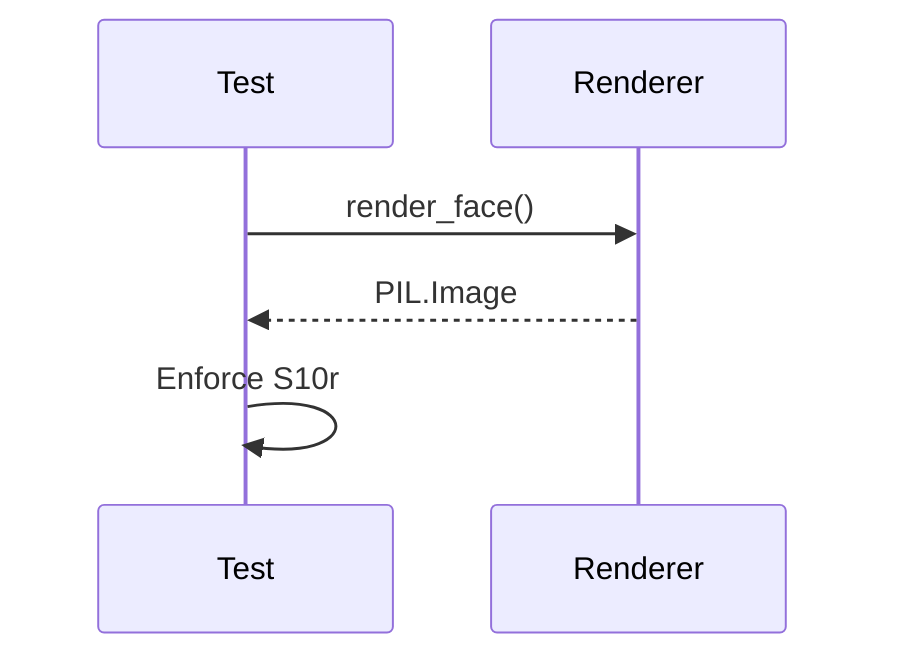

# Issue #384 - Feature: Bezel ring compressed horizon returns to bright

<!-- Template Metadata
Last Updated: 2026-02-02
Updated By: Issue #117 fix
Update Reason: Moved Verification & Testing to Section 10 (was Section 11) to match 0702c review prompt and testing workflow expectations
Previous: Added sections based on 80 blocking issues from 164 governance verdicts (2026-02-01)
-->

## 1. Context & Goal
* **Issue:** #384
* **Objective:** Fix the stingray static face renderer so the bezel ring's compressed horizon drops to a dark band and then returns to bright.
* **Status:** Approved (claude-opus-4-6, 2026-08-30)
* **Related Issues:** #379, #383, #332, #378

### Open Questions
None.

## 2. Proposed Changes

### 2.1 Files Changed

| File | Change Type | Description |
|------|-------------|-------------|
| `src/boostgauge/skins/stingray.py` | Modify | Adjust the static face rendering logic to ensure the bezel ring's dark crossing returns to bright near the bore. |
| `tests/visual/test_stingray_static.py` | Modify | Implement the S10r sampling grid assertion to enforce the return to bright. |

### 2.1.1 Path Validation (Mechanical - Auto-Checked)

Mechanical validation automatically checks:
- All "Modify" files must exist in repository
- All "Delete" files must exist in repository
- All "Add" files must have existing parent directories
- No placeholder prefixes (`src/`, `lib/`, `app/`) unless directory exists

### 2.2 Dependencies

```toml

# pyproject.toml additions (if any)
```

### 2.3 Data Structures

```python

# Pseudocode - NOT implementation
```

### 2.4 Function Signatures

```python

# Signatures only - implementation in source files
def render_face(size: int, values: dict, ss: int = 3) -> Image.Image:
    """Existing signature; logic modified to bracket the dark crossing with bright."""
    ...

def test_bezel_horizon_returns_to_bright() -> None:
    """New test to enforce S10r."""
    ...
```

### 2.5 Logic Flow (Pseudocode)

```
1. In stingray.py's bezel ring rendering phase:
2. Calculate the radial gradient for the bezel.
3. Instead of a monotonic drop to dark (edge into ramp), ensure the gradient curve returns to bright for the inner portion of the ring.
4. In test_stingray_static.py:
5. Generate the static face render.
6. Sample the pixels at the coordinates specified by S10r.
7. Assert the brightness profile meets the S10r criteria.
```

### 2.6 Technical Approach

* **Module:** `src/boostgauge/skins/stingray.py`
* **Pattern:** Procedural PIL Image drawing and math gradients
* **Key Decisions:** The fix requires adjusting the reflection profile for the bezel ring in the static renderer so it matches the approved visual contract where the sweep re-enters the strip's bright half.

### 2.7 Architecture Decisions

| Decision | Options Considered | Choice | Rationale |
|----------|-------------------|--------|-----------|
| Bezel gradient | Edge into ramp, Banded gradient | Banded gradient | Required to meet S10r where the dark crossing is bracketed by bright. |
| Test methodology | Baseline image diff, Procedural pixel sampling | Procedural pixel sampling | Required by the test strategy doc and specifically mandated by S10r. |

**Architectural Constraints:**
- The sweep is stylized and azimuth-independent.
- Physical mirror consistency per azimuth is not required (from #379).

## 3. Requirements

<!-- BEGIN MACHINE-OWNED: source decision table (#2607) -->

### 3.1 Source Decision Table (injected verbatim)

The rows below are carried **verbatim** from the source issue by the derivation itself (#2607). They are machine-owned: the drafter does not write them, and a revision cannot change them. Cite these IDs from the requirements and test-plan sections; do not restate their values.

| ID | Element | Binding value (quoted from the render contract) | Assertion method |
|---|---|---|---|
| S10r | Bezel ring — the horizon returns to bright | "the rolled inner bezel sweeps its surface normal through the strip, so the horizon reappears compressed around the bore" — the sweep re-enters the strip's bright half past the horizon, so the ring's dark crossing is bracketed by bright: within 0.02 R beyond r_d — the first sample with channel mean < 100 — the reflection is back above channel mean 240 (ruled 2026-08-30). Measured anchors, 0.01 R grid: approved dip 90 at 1.11 R, 255 at 1.12 R; the shipped ramp climbs 20–25 channel-mean per 0.01 R and tops at 190, so it cannot satisfy the window | at math angles 90° and 180°, sampling every 0.005 R within [1.05 R, 1.24 R]: let r_d be the smallest sampled radius with channel mean < 100; assert r_d exists, r_d ≤ 1.18 R, and ≥1 sample in (r_d, r_d + 0.02 R] has channel mean > 240 (approved, 0.01 R grid: r_d = 1.11 R with 255 at 1.12 R; the shipped render: r_d = 1.15 R and no sample through 1.24 R exceeds 190). The #379 rows S10(a)/(b) remain binding unchanged and are evaluated on their own shipped grid — the existing tests' 2 px walk at the test's render size, never this row's 0.005 R grid (ruled 2026-08-30) |

<!-- END MACHINE-OWNED -->

1. The bezel ring rendering logic must produce a dark crossing that is bracketed by bright, satisfying the S10r visual contract.
2. The visual test suite must verify the return to bright using the precise mathematical sampling grid and thresholds mandated by S10r.

## 4. Alternatives Considered

| Option | Pros | Cons | Decision |
|--------|------|------|----------|
| Full 3D raytraced bezel | Highly realistic | Too slow, violates static aesthetic rules | Rejected |
| Stylized 2D gradient fix | Fast, matches approved render | Requires precise tuning of radial stops | **Selected** |

**Rationale:** The 2D gradient approach is already used in the renderer and satisfies the S10r constraint without introducing performance overhead or new dependencies.

## 5. Data & Fixtures

### 5.1 Data Sources

| Attribute | Value |
|-----------|-------|
| Source | N/A |
| Format | N/A |
| Size | N/A |
| Refresh | N/A |
| Copyright/License | N/A |

### 5.2 Data Pipeline

```
N/A
```

### 5.3 Test Fixtures

| Fixture | Source | Notes |
|---------|--------|-------|
| Static face render | Generated | Generated in memory as PIL.Image during test execution |

### 5.4 Deployment Pipeline

N/A

## 6. Diagram

N/A

### 6.1 Mermaid Quality Gate

**Auto-Inspection Results:**
```
- Touching elements: [ ] None / [ ] Found: ___
- Hidden lines: [ ] None / [ ] Found: ___
- Label readability: [ ] Pass / [ ] Issue: ___
- Flow clarity: [ ] Clear / [ ] Issue: ___
```

### 6.2 Diagram



## 7. Security & Safety Considerations

### 7.1 Security

| Concern | Mitigation | Status |
|---------|------------|--------|
| None | N/A | Addressed |

### 7.2 Safety

| Concern | Mitigation | Status |
|---------|------------|--------|
| None | N/A | Addressed |

**Fail Mode:** Fail Closed - N/A

**Recovery Strategy:** N/A

## 8. Performance & Cost Considerations

### 8.1 Performance

| Metric | Budget | Approach |
|--------|--------|----------|
| Render time | < 100ms | Procedural 2D drawing with PIL |
| Memory | < 50MB | Single image buffer in memory |
| API Calls | 0 | N/A |

**Bottlenecks:** None identified.

### 8.2 Cost Analysis

| Resource | Unit Cost | Estimated Usage | Monthly Cost |
|----------|-----------|-----------------|--------------|
| Compute | $0 | Local execution | $0 |

**Cost Controls:**
- [ ] Budget alerts configured at $0 threshold
- [ ] Rate limiting prevents runaway costs
- [ ] Fallback to cheaper alternatives when appropriate

**Worst-Case Scenario:** N/A

## 9. Legal & Compliance

| Concern | Applies? | Mitigation |
|---------|----------|------------|
| PII/Personal Data | No | N/A |
| Third-Party Licenses | No | N/A |
| Terms of Service | No | N/A |
| Data Retention | No | N/A |
| Export Controls | No | N/A |

**Data Classification:** Public

**Compliance Checklist:**
- [x] No PII stored without consent
- [x] All third-party licenses compatible with project license
- [x] External API usage compliant with provider ToS
- [x] Data retention policy documented

## 10. Verification & Testing

**Testing Philosophy:** Strive for 100% automated test coverage. Manual tests are a last resort for scenarios that genuinely cannot be automated (e.g., visual inspection, hardware interaction). Every scenario marked "Manual" requires justification.

### 10.0 Test Plan (TDD - Complete Before Implementation)

| Test ID | Test Description | Expected Behavior | Status |
|---------|------------------|-------------------|--------|
| T010 | Verify bezel horizon return to bright | Renders image meeting S10r criteria | RED |
| T020 | Verify test grid boundaries | S10r measurement grid asserts correctly | RED |

**Coverage Target:** ≥95%

**TDD Checklist:**
- [ ] All tests written before implementation
- [ ] Tests currently RED (failing)
- [ ] Test IDs match scenario IDs in 10.1
- [ ] Test file created at: `tests/unit/test_{module}.py`

### 10.1 Test Scenarios

| ID | Scenario | Type | Input | Expected Output | Pass Criteria |
|----|----------|------|-------|-----------------|---------------|
| 010 | Bezel horizon drops to dark and returns to bright (REQ-1) | Auto | Static face render | PIL Image | Satisfies the S10r criteria |
| 020 | Test suite strictly asserts S10r grid constraints (REQ-2) | Auto | S10r angles and sampling grid | Test pass | Satisfies the S10r criteria |

### 10.2 Test Commands

```bash

# Run visual tests for static face
poetry run pytest tests/visual/test_stingray_static.py -v
```

### 10.3 Manual Tests (Only If Unavoidable)

N/A - All scenarios automated.

## 11. Risks & Mitigations

| Risk | Impact | Likelihood | Mitigation |
|------|--------|------------|------------|
| Unintended changes to other face elements | High | Low | The S10r assertion and existing #379 tests guard against regressions. Addressed in `test_bezel_horizon_returns_to_bright` |

## 12. Definition of Done

### Code
- [ ] Implementation complete and linted
- [ ] Code comments reference this LLD

### Tests
- [ ] All test scenarios pass
- [ ] Test coverage meets threshold

### Documentation
- [ ] LLD updated with any deviations
- [ ] Implementation Report (0103) completed
- [ ] Test Report (0113) completed if applicable

### Review
- [ ] Code review completed
- [ ] User approval before closing issue

### 12.1 Traceability (Mechanical - Auto-Checked)

Mechanical validation automatically checks:
- Every file mentioned in this section must appear in Section 2.1
- Every risk mitigation in Section 11 should have a corresponding function in Section 2.4 (warning if not)

---

## Appendix: Review Log

### Review Summary

| Review | Date | Verdict | Key Issue |
|--------|------|---------|-----------|
| 1 | 2026-08-30 | APPROVED | `claude-opus-4-6` |
| System | (auto) | PENDING | Initial Draft |

**Final Status:** APPROVED